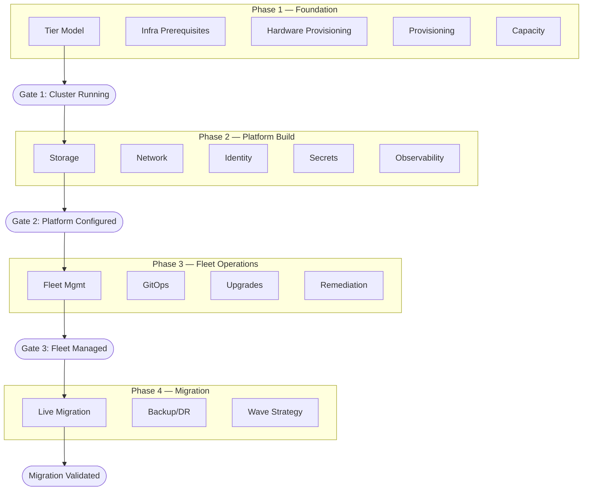
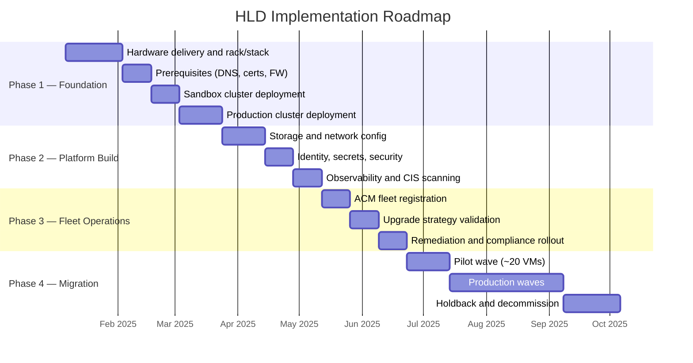

# {CLIENT} — OpenShift Virtualization HLD: Decision Journey

> **Decision Journey v1.0** · Architectural decisions in deployment order — from empty rack to validated migration.
> Replace all `{PLACEHOLDERS}` with engagement-specific values.

---

## Document Control

| Field                  | Value                                                     |
| ---------------------- | --------------------------------------------------------- |
| **Title**              | {CLIENT} OpenShift Virtualization — HLD: Decision Journey |
| **Version**            | {VERSION}                                                 |
| **Status**             | {Draft \| Review \| Approved}                             |
| **Classification**     | {CLASSIFICATION}                                          |
| **Author**             | {AUTHOR}                                                  |
| **Reviewers**          | {REVIEWER_LIST}                                           |
| **Approval Authority** | {APPROVER}                                                |
| **Last Updated**       | {DATE}                                                    |

### Revision History

| Ver | Date   | Author   | Changes                                |
| --- | ------ | -------- | -------------------------------------- |
| 0.1 | {DATE} | {AUTHOR} | Initial decision journey from template |

### Distribution List

| Name / Role       | Distribution    |
| ----------------- | --------------- |
| {SPONSOR}         | For approval    |
| {ARCHITECT_LEAD}  | For review      |
| {SRE_LEAD}        | For review      |
| {SECURITY_LEAD}   | For review      |
| {NETWORK_LEAD}    | For review      |
| {STORAGE_LEAD}    | For review      |
| {PROJECT_MANAGER} | For information |

---

## Executive Summary

### Business Context

{CLIENT} currently operates **{VM_COUNT}** virtual machines across **{SITE_COUNT}** sites on VMware vSphere, managed by approximately **{HOST_COUNT}** hosts. The organization has decided to migrate to Red Hat OpenShift Virtualization to:

- **Reduce licensing costs** — eliminate VMware vSphere licensing and consolidate to a single platform subscription
- **Unify operations** — manage VMs and containers through a single Kubernetes-native control plane
- **Improve automation** — replace manual provisioning with GitOps-driven, declarative configuration across all sites
- **Extend to edge** — deploy enterprise-grade virtualization to {BRANCH_COUNT} tier 3 site/edge sites with minimal on-site expertise

### Solution Overview

The platform will be deployed across three tiers — **Datacenter**, **Regional**, and **Tier 3 Site (3-node compact)** — managed through split ACM hubs. Approximately **{CLUSTER_COUNT}** OpenShift clusters will be provisioned, configured, and brought into fleet management before workload migration begins.

The design is structured as a four-phase decision journey:

| Phase | Name             | Outcome                                                  |
| ----- | ---------------- | -------------------------------------------------------- |
| 1     | Foundation       | Running OCP cluster on bare metal                        |
| 2     | Platform Build   | Storage, network, security, observability configured     |
| 3     | Fleet Operations | All clusters managed, upgradable, and compliant          |
| 4     | Migration        | VMs migrated from vSphere, validated, and decommissioned |

### End-State Architecture Summary

The approved target state is a three-tier OpenShift Virtualization platform operated as a managed fleet rather than as isolated clusters.

| Domain | Approved High-Level Direction |
| ------ | ----------------------------- |
| **Deployment tiers** | Datacenter, Regional, and Tier 3 Site (3-node compact) |
| **Scale** | Approximately **{CLUSTER_COUNT}** clusters supporting **{VM_COUNT}** VM migrations |
| **Hardware model** | **{SERVER_HARDWARE}** managed through **{HW_MGMT_PLATFORM}** server profiles |
| **Provisioning model** | ACM-driven installation and ZTP, with no bastion host |
| **Primary storage** | **{BLOCK_STORAGE_VENDOR}** for DC/Regional tiers; ODF local storage for Tier 3 Site tier |
| **Object storage** | **{OBJECT_STORAGE}** where applicable; Tier 3 Site uses local ODF S3 pattern |
| **Network model** | Segregated management, VM, migration, backup, and storage traffic with tier-specific NIC layout |
| **Identity** | LDAP-backed OAuth with custom RBAC roles and a breakglass local account controlled through **{SECRET_MGMT_VENDOR}** |
| **Secrets** | **{SECRET_MGMT_VENDOR}** target state with ESO integration; manual interim only where required |
| **Fleet management** | Split ACM hubs for DC/Regional and Tier 3 Site tiers |
| **Policy delivery** | ACM-managed policy model as the Day-2 control plane |
| **Observability** | Local Prometheus/Loki plus Thanos, **{SIEM_PLATFORM}**, **{NOC_PLATFORM}**, and supporting enterprise tools |
| **Remediation** | SNR plus FAR using **{HW_MGMT_PLATFORM}** / Redfish-backed fencing where validated |
| **Backup / DR** | **{BACKUP_VENDOR}** for VM backup; storage replication for DC DR continuity where implemented |
| **Migration** | MTV with wave-based planning, pilot-first execution, validation, and holdback-based rollback |

### Expected Outcomes

| Outcome                    | Measure                                               |
| -------------------------- | ----------------------------------------------------- |
| VMware license elimination | {LICENSE_SAVINGS} annual savings                      |
| Operational consolidation  | Single management plane for all tiers                 |
| Provisioning acceleration  | New cluster: hours (ZTP) vs weeks (manual)            |
| Fleet consistency          | ACM policy compliance across {CLUSTER_COUNT} clusters |
| Migration completion       | {VM_COUNT} VMs migrated within {MIGRATION_TIMELINE}   |

---

## How to Read This Journey

This document presents architectural decisions in the order you encounter them during a real engagement. Decisions are grouped into four phases, each gated by a checkpoint that must pass before proceeding. Phase-specific detail is maintained in separate companion documents (see Referenced Documents above).

| Element                 | Meaning                                                  |
| ----------------------- | -------------------------------------------------------- |
| **Phase 1–4**           | Chronological engagement phases                          |
| **Gate**                | Checkpoint between phases — conditions that must be true |
| `[DC]` `[REGIONAL]` `[EDGE]` | Deployment tier applicability                            |

**Reading order:** Start at Phase 1 and follow sequentially. The Master Journey Map below shows the full path.

---

## Master Journey Map

---

## Scope & Constraints

### In Scope / Out of Scope

| In Scope                                                  | Out of Scope                                          |
| --------------------------------------------------------- | ----------------------------------------------------- |
| OCP-V cluster architecture for all three deployment tiers | Step-by-step installation procedures (covered in LLD) |
| Compute, network, storage, and security design            | Guest OS configuration and application-level tuning   |
| Multi-cluster management architecture (ACM, GitOps, ZTP)  | VMware vSphere decommissioning plan                   |
| Observability, backup, and disaster recovery architecture | Third-party ISV application deployment                |
| VM migration strategy and tooling overview                | Detailed cost modeling                                |
| Capacity planning baselines                               | Vendor procurement negotiation                        |
| Implementation workflow and RACI                          | Detailed project schedule (managed in {PM_TOOL})      |

### Scope Statement

{CLIENT} operates **{VM_COUNT}** VMs across **{SITE_COUNT}** sites on **{CLUSTER_COUNT}** OpenShift clusters, migrating from VMware vSphere to OpenShift Virtualization. This covers datacenters ({SITE_PRIMARY}, {SITE_SECONDARY}), Regional sites, {BRANCH_COUNT} tier 3 site locations on {BRANCH_HARDWARE}, and lab/sandbox environments ({SITE_LAB}). Decisions below are sequenced across four phases.

### Constraints

| Constraint          | Detail                                                                         |
| ------------------- | ------------------------------------------------------------------------------ |
| Regulatory          | {REGULATORY_FRAMEWORKS} compliance required (e.g., PCI-DSS, SOX)               |
| Change moratoriums  | {MORATORIUM_SCHEDULE}                                                          |
| Hardware delivery   | {SERVER_HARDWARE} lead time: {HW_LEAD_TIME}                                    |
| Budget envelope     | Hardware and licensing budget approved for FY{FISCAL_YEAR}                     |
| Network bandwidth   | Tier 3 Site WAN bandwidth: {BRANCH_WAN_BW} — constrains ZTP ISO delivery and backup |
| Vendor dependencies | {BACKUP_VENDOR} CBT support: {CBT_TARGET_DATE}; ROBO: {ROBO_TARGET_DATE}       |

---

## Non-Functional Requirements

### Platform Availability

| Requirement              | Target                                       | Measurement                                             |
| ------------------------ | -------------------------------------------- | ------------------------------------------------------- |
| Cluster API uptime       | {AVAILABILITY_TARGET}                        | Prometheus `apiserver_up` metric over 30-day window     |
| etcd quorum              | 3 members healthy at all times               | etcd health endpoint; AlertManager alert on quorum loss |
| VM workload availability | N-1 node failure tolerance                   | VMs survive single node loss via LiveMigrate eviction   |
| ACM hub availability     | Hub outage does not affect running workloads | Klusterlet operates independently during hub downtime   |

### Performance Targets

| Metric                         | Target                                     | Validation Method                                                      |
| ------------------------------ | ------------------------------------------ | ---------------------------------------------------------------------- |
| etcd WAL fsync p99             | < 10ms                                     | `fio` pre-flight; `etcd_disk_wal_fsync_duration_seconds` in Prometheus |
| API server request latency p99 | < {API_LATENCY_TARGET}                     | `apiserver_request_duration_seconds` histogram                         |
| Live migration completion      | < {MIGRATION_TIME_TARGET} for standard VMs | KubeVirt migration metrics                                             |
| Storage IOPS (DC/Regional)          | {DC_IOPS_TARGET} per volume                | {BLOCK_STORAGE_VENDOR} monitoring + `fio` benchmark                    |
| Storage IOPS (Tier 3 Site ODF)      | {BRANCH_IOPS_TARGET} per volume            | ODF Ceph metrics + `fio` benchmark                                     |
| VM boot time                   | < {VM_BOOT_TARGET}                         | Guest agent timestamp vs VMI creation timestamp                        |

### Scalability Limits

| Dimension                | Limit                                                                                                                                                                                         |
| ------------------------ | --------------------------------------------------------------------------------------------------------------------------------------------------------------------------------------------- |
| Max VMs per cluster      | Per [OCP-V Supported Limits](https://docs.redhat.com/en/documentation/openshift_container_platform/4.21/html/virtualization/getting-started#virt-supported-limits)                            |
| Max nodes per cluster    | Per [OCP Object Maximums](https://docs.redhat.com/en/documentation/openshift_container_platform/4.21/html/scalability_and_performance/planning-your-environment-according-to-object-maximums) |
| Max clusters per ACM hub | 3,500 (validated by Red Hat scale lab for SNO; adjust for multi-node)                                                                                                                         |
| Pods per node            | {PODS_PER_NODE}                                                                                                                                                                               |

### Recovery Objectives

| Workload Tier   | RPO                | RTO                 | Strategy                                                            |
| --------------- | ------------------ | ------------------- | ------------------------------------------------------------------- |
| DC — Critical   | {RPO_TARGET}       | < {RTO_DC_CRITICAL} | {BLOCK_STORAGE_VENDOR} async replication + {BACKUP_VENDOR}          |
| DC — Standard   | 24 hours           | < {RTO_DC_STANDARD} | {BACKUP_VENDOR} daily backup                                        |
| Regional        | {RPO_REGIONAL}     | < {RTO_REGIONAL}    | {BLOCK_STORAGE_VENDOR} replication (if available) + {BACKUP_VENDOR} |
| Tier 3 Site          | {RPO_BRANCH}       | < {RTO_BRANCH}      | {BACKUP_VENDOR} WAN backup to DC                                    |
| Platform (etcd) | Hourly etcd backup | < 1 hour            | etcd snapshot restore from {SECRET_MGMT_VENDOR}-stored backup       |

### Capacity Growth Projections

| Year | Estimated VM Count | Estimated Cluster Count | Notes                          |
| ---- | ------------------ | ----------------------- | ------------------------------ |
| Y1   | {VM_COUNT}         | {CLUSTER_COUNT}         | Initial migration completion   |
| Y2   | {Y2_VM_COUNT}      | {Y2_CLUSTER_COUNT}      | Organic growth + new workloads |
| Y3   | {Y3_VM_COUNT}      | {Y3_CLUSTER_COUNT}      | Full steady-state              |

---

## RAID Register

### Risks

| ID   | Risk Description                                                        | Likelihood | Impact | Mitigation                                                                          | Owner         |
| ---- | ----------------------------------------------------------------------- | ---------- | ------ | ----------------------------------------------------------------------------------- | ------------- |
| R-01 | {BACKUP_VENDOR} CBT support delayed beyond {CBT_TARGET_DATE}            | Medium     | High   | Daily full backups as interim; monitor vendor roadmap quarterly                     | Backup        |
| R-02 | {SECRET_MGMT_VENDOR} integration remains blocked                        | High       | Medium | Manual secret pre-population (~10/cluster); ESO pivot date time-boxed               | Security      |
| R-03 | Tier 3 Site WAN insufficient for ZTP ISO delivery                            | Medium     | Medium | Pre-stage ISOs; use disconnected install; evaluate ROBO appliance                   | Network       |
| R-04 | Live migration storms during mass drain degrade cluster performance     | Medium     | High   | maxUnavailable limits; dedicated migration vNIC; sandbox benchmarking               | Platform      |
| R-05 | etcd performance degradation on schedulable masters with heavy VM load  | Low        | High   | Noisy-neighbor labels; etcd fsync monitoring; dedicated NVMe for etcd               | Platform      |
| R-06 | VLAN-to-vNIC mapping not finalized before hardware provisioning         | Medium     | High   | Track as prerequisite in Phase 1 gate; escalate to {CLIENT} networking              | Network       |
| R-07 | CIS benchmark remediation cycle delays production readiness             | Medium     | Medium | Start scanning in sandbox early; pre-approve exception process                      | Security      |
| R-08 | Monorepo grows unmanageable at {CLUSTER_COUNT} clusters                 | Low        | Medium | Evaluate repo-per-tier split if monorepo exceeds operational threshold              | Platform      |
| R-09 | {BLOCK_STORAGE_VENDOR} FC SAN unavailable at Regional sites                  | Low        | High   | Fall back to ODF at affected Regional sites; validate in site survey                          | Storage       |
| R-10 | Audit logging profile generates excessive volume under PCI requirements | Medium     | Medium | Benchmark `WriteRequestBodies` log volume in sandbox; plan {SIEM_PLATFORM} capacity | Observability |

### Issues (Open Items)

| ID   | Issue                                             | Status | Owner         | Target Resolution    |
| ---- | ------------------------------------------------- | ------ | ------------- | -------------------- |
| I-01 | VLAN-to-vNIC mapping incomplete (ADR 11)          | Open   | Network       | Before Phase 1 gate  |
| I-02 | Audit logging profile not finalized (ADR 27)      | Parked | Security      | Before Phase 2 gate  |
| I-03 | Namespace naming strategy not finalized (ADR 28)  | Parked | Platform      | Before Phase 2 gate  |
| I-04 | Tier 3 Site egress strategy TBD (ADR 17)               | Open   | Network       | Before Phase 1 gate  |
| I-05 | Descheduler profile selection (ADR 40)            | Open   | Platform      | Before Phase 2 gate  |
| I-06 | Thanos retention duration not finalized           | Open   | Observability | Before Phase 3 gate  |
| I-07 | Automatic vs operator-in-the-loop remediation TBD | Open   | Platform      | Before Phase 3 gate  |
| I-08 | HCR `workloadUpdateStrategy` not finalized        | Open   | Platform      | Sandbox benchmarking |

### Dependencies

| ID   | Dependency                                         | Phase Impact | Status   | Owner      |
| ---- | -------------------------------------------------- | ------------ | -------- | ---------- |
| D-01 | {SERVER_HARDWARE} hardware delivery and rack/stack | Phase 1      | {STATUS} | Infra      |
| D-02 | {BLOCK_STORAGE_VENDOR} FC SAN zoning per site      | Phase 1      | {STATUS} | Storage    |
| D-03 | {DNS_IPAM_VENDOR} DNS/IP record creation           | Phase 1      | {STATUS} | Network    |
| D-04 | {SECRET_MGMT_VENDOR} OpenShift integration         | Phase 2      | Blocked  | Security   |
| D-05 | {BACKUP_VENDOR} CDM version with Multus support    | Phase 4      | {STATUS} | Backup     |
| D-06 | vCenter network path from OCP clusters             | Phase 4      | {STATUS} | Network    |
| D-07 | CMDB/dependency map accuracy for wave planning     | Phase 4      | {STATUS} | App Owners |

---

## Implementation Timeline

### Phase Timeline Overview

### Milestones

| Milestone                     | Target Date   | Gate             | Success Criteria                                             |
| ----------------------------- | ------------- | ---------------- | ------------------------------------------------------------ |
| Sandbox cluster operational   | T+{WEEKS_SB}  | Gate 1 (sandbox) | Cluster API reachable; etcd healthy; console accessible      |
| First production cluster live | T+{WEEKS_P1}  | Gate 1 (prod)    | All Phase 1 gate criteria met                                |
| Platform configured           | T+{WEEKS_P2}  | Gate 2           | All Phase 2 gate criteria met; CIS scan completed            |
| Fleet managed                 | T+{WEEKS_P3}  | Gate 3           | All clusters in ACM; policies compliant; upgrade path tested |
| Pilot migration complete      | T+{WEEKS_P4P} | Phase 4 pilot    | ~20 VMs migrated and validated; app owner sign-off           |
| Migration complete            | T+{WEEKS_P4}  | Final            | All {VM_COUNT} VMs migrated; source decommissioned           |

---

## Stakeholder Governance

### Decision Authority

| Decision Type                        | Authority           | Escalation Path    |
| ------------------------------------ | ------------------- | ------------------ |
| Architecture decisions (ADRs)        | {ARCHITECT_LEAD}    | {SPONSOR}          |
| Change advisory (production changes) | {ITSM_PLATFORM} CAB | {CHANGE_MANAGER}   |
| Security exceptions (CIS, PCI)       | {SECURITY_LEAD}     | {CISO_OR_DELEGATE} |
| Migration wave approval              | App owners          | {MIGRATION_LEAD}   |
| Budget and timeline adjustments      | {PROJECT_MANAGER}   | {SPONSOR}          |

### Change Management Process

1. All production changes submitted via {ITSM_PLATFORM} change request
2. Standard changes: pre-approved categories (e.g., Day-2 config via GitOps)
3. Normal changes: reviewed at weekly CAB
4. Emergency changes: {EMERGENCY_CHANGE_PROCESS}

### Communication Cadence

| Meeting               | Frequency | Attendees             | Purpose                         |
| --------------------- | --------- | --------------------- | ------------------------------- |
| Architecture review   | Weekly    | Platform + leads      | ADR review, gate progress       |
| Stakeholder update    | Bi-weekly | All leads + sponsor   | Status, risks, decisions needed |
| Migration wave review | Per wave  | Platform + app owners | Wave readiness and sign-off     |

---

## Reference Node Hardware Profile

The following represents the reference node sizing for {SERVER_HARDWARE}. Adjust per tier.

| Parameter        | DC / Regional Value             | Tier 3 Site Value             | Notes                                 |
| ---------------- | ------------------------------- | ------------------------ | ------------------------------------- |
| CPU              | {DC_CPU_CORES} cores            | {BRANCH_CPU_CORES} cores | x86_64 with VT-x/VT-d enabled in BIOS |
| RAM              | {DC_RAM} GiB                    | {BRANCH_RAM} GiB         | ECC recommended                       |
| OS Disk          | {OS_DISK_CONFIG}                | {OS_DISK_CONFIG}         | NVMe preferred for RHCOS              |
| Data Disks (ODF) | N/A (external SAN)              | {BRANCH_DATA_DISKS}      | ODF at tier 3 sites only                  |
| Network          | 4x vNICs via {HW_MGMT_PLATFORM} | {BRANCH_NIC_COUNT}x NICs | {HW_MGMT_PLATFORM}-managed            |
| BMC              | IPMI/Redfish                    | IPMI/Redfish             | Required for IPI/ZTP and FAR          |

---

## Compliance Mapping

### PCI-DSS Relevant Controls

| PCI-DSS Requirement           | HLD Coverage                                                                    | Phase |
| ----------------------------- | ------------------------------------------------------------------------------- | ----- |
| 1.x Network segmentation      | VLAN isolation, 4-vNIC traffic separation, firewall rules                       | 1, 2  |
| 2.x Secure defaults           | CIS benchmark scanning, etcd encryption, hardened RHCOS                         | 2     |
| 3.x Data protection           | etcd encryption at rest; TLS in transit; {SECRET_MGMT_VENDOR}                   | 2     |
| 7.x Access control            | OAuth/LDAP RBAC; break-glass in {SECRET_MGMT_VENDOR}; self-provisioner disabled | 2     |
| 8.x Authentication            | OAuth with LDAP group sync; no shared accounts                                  | 2     |
| 10.x Audit logging            | API audit logs via CLF → {SIEM_PLATFORM}; audit profile TBD                     | 2     |
| 11.x Vulnerability management | {SCANNING_VENDOR} CIS scans                                                     | 2, 3  |
| 12.x Policy management        | ACM governance policies enforced fleet-wide                                     | 3     |

---

## Glossary

| Term    | Definition                                                                     |
| ------- | ------------------------------------------------------------------------------ |
| ACM     | Red Hat Advanced Cluster Management for Kubernetes                             |
| ADR     | Architecture Decision Record                                                   |
| CBT     | Changed Block Tracking — incremental backup optimization                       |
| Regional | Regional data center tier (mid-tier between DC and Tier 3 Site)                     |
| CDI     | Containerized Data Importer — handles VM disk import into PVCs                 |
| CIS     | Center for Internet Security — benchmark hardening standard                    |
| CLF     | ClusterLogForwarder — OpenShift log forwarding resource                        |
| ESO     | External Secrets Operator — syncs secrets from external vaults into Kubernetes |
| FAR     | Fence Agents Remediation — hardware-level node fencing via BMC                 |
| HCO     | HyperConverged Cluster Operator — single entrypoint for OCP-V deployment       |
| HLD     | High-Level Design                                                              |
| IPI     | Installer-Provisioned Infrastructure — automated OCP bare-metal installation   |
| ITSM    | IT Service Management                                                          |
| LLD     | Low-Level Design                                                               |
| MTV     | Migration Toolkit for Virtualization                                           |
| NAD     | NetworkAttachmentDefinition — secondary network configuration for VMs          |
| NMO     | Node Maintenance Operator — declarative node drain/cordon                      |
| NMState | Kubernetes operator for declarative host network configuration                 |
| ODF     | OpenShift Data Foundation — Ceph-based hyper-converged storage                 |
| PSI     | Pressure Stall Information — Linux kernel resource contention metrics          |
| RACI    | Responsible, Accountable, Consulted, Informed                                  |
| RAID    | Risks, Assumptions, Issues, Dependencies/Decisions                             |
| RWX     | ReadWriteMany — PVC access mode required for live migration                    |
| SNR     | Self Node Remediation — software-level node reboot for recovery                |
| VIP     | Virtual IP address                                                             |
| ZTP     | Zero Touch Provisioning — GitOps-driven unattended cluster deployment          |

---

## Placeholder Reference

All `{PLACEHOLDER}` values used in this template and its phase companions:

| Placeholder                   | Description                             | Example Value                |
| ----------------------------- | --------------------------------------- | ---------------------------- |
| `{CLIENT}`                | Customer name                           | Acme Corp                |
| `{VM_COUNT}`                  | Total VM count from RVTools             | ~5,000                       |
| `{HOST_COUNT}`                | Total vSphere host count                | 500                          |
| `{SITE_COUNT}`                | Total site count                        | 6                            |
| `{CLUSTER_COUNT}`             | Target OCP cluster count                | ~300                         |
| `{BRANCH_COUNT}`              | Tier 3 Site/edge site count                  | ~250                         |
| `{SITE_PRIMARY}`              | Primary DC location                     | Site-A                       |
| `{SITE_SECONDARY}`            | Secondary DC location                   | Site-B                       |
| `{SITE_LAB}`                  | Lab/sandbox location                    | Lab-1                        |
| `{SERVER_HARDWARE}`           | Server hardware model                   | (vendor server model)        |
| `{HW_MGMT_PLATFORM}`          | Hardware management platform            | (vendor HW mgmt platform)   |
| `{INFRA_PLATFORM}`            | Infrastructure automation platform      | (vendor infra platform)      |
| `{BRANCH_HARDWARE}`           | Tier 3 Site hardware platform                | (vendor edge platform)       |
| `{BLOCK_STORAGE_VENDOR}`      | Block storage vendor/product            | (vendor block storage)       |
| `{BLOCK_CSI_DRIVER}`          | Block CSI driver name                   | (vendor block CSI)           |
| `{BLOCK_SC_NAME}`             | Block StorageClass name                 | (vendor-block)               |
| `{OBJECT_STORAGE}`            | S3-compatible object storage            | (S3-compatible object store) |
| `{BACKUP_VENDOR}`             | Backup vendor/product                   | (backup vendor product)      |
| `{SECRET_MGMT_VENDOR}`        | Enterprise secret management            | (enterprise vault)           |
| `{IMAGE_REGISTRY}`            | Enterprise image registry               | (enterprise registry)        |
| `{SIEM_PLATFORM}`             | SIEM / log platform                     | (SIEM platform)              |
| `{NOC_PLATFORM}`              | NOC alerting platform                   | (NOC platform)               |
| `{APM_VENDOR}`                | APM / unified observability vendor      | (APM vendor)                 |
| `{HW_MONITORING_VENDOR}`      | Hardware monitoring vendor              | (HW monitoring vendor)       |
| `{SCANNING_VENDOR}`           | CIS/vulnerability scanning tool         | (scanning vendor)            |
| `{ITSM_PLATFORM}`             | IT service management platform          | (ITSM platform)              |
| `{DNS_IPAM_VENDOR}`           | DNS/IPAM management platform            | (DNS/IPAM vendor)            |
| `{OCP_VERSION}`               | Target OCP version                      | 4.21                         |
| `{RPO_TARGET}`                | DC-tier RPO target                      | 15-min                       |
| `{AVAILABILITY_TARGET}`       | Platform availability SLA               | 99.9%                        |
| `{PODS_PER_NODE}`             | Pods-per-node setting                   | 512                          |
| `{POD_CIDR}`                  | Pod subnet CIDR                         | 192.168.0.0/17               |
| `{SVC_CIDR}`                  | Service subnet CIDR                     | 192.168.128.0/18             |
| `{HOST_CIDR}`                 | Host prefix CIDR                        | /22                          |
| `{MORATORIUM_SCHEDULE}`       | Change moratorium periods               | Mid-month, EOM, Nov-Dec      |
| `{CBT_TARGET_DATE}`           | Backup CBT availability date            | (per vendor roadmap)         |
| `{ROBO_TARGET_DATE}`          | ROBO appliance OCP-V support date       | (per vendor roadmap)         |
| `{PROMETHEUS_RETENTION_DAYS}` | Local Prometheus retention              | 7                            |
| `{BRANCH_STORAGE_CAPACITY}`   | Per-tier 3 site ODF usable capacity          | 1.6 TB                       |
| `{CIS_STANDARD_VERSION}`      | Internal CIS hardening standard version | CIS 1.8                      |
| `{REGULATORY_FRAMEWORKS}`     | Applicable regulatory frameworks        | PCI-DSS, SOX                 |
| `{SWITCH_VENDOR}`             | Network switch vendor                   | (switch vendor)              |
