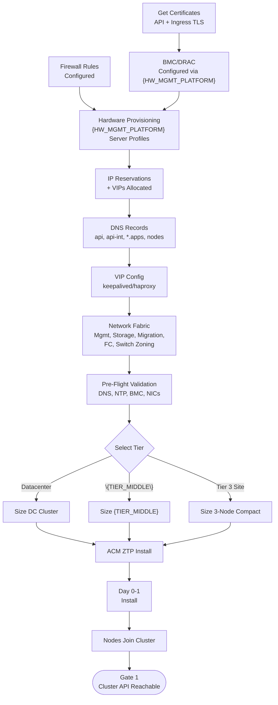
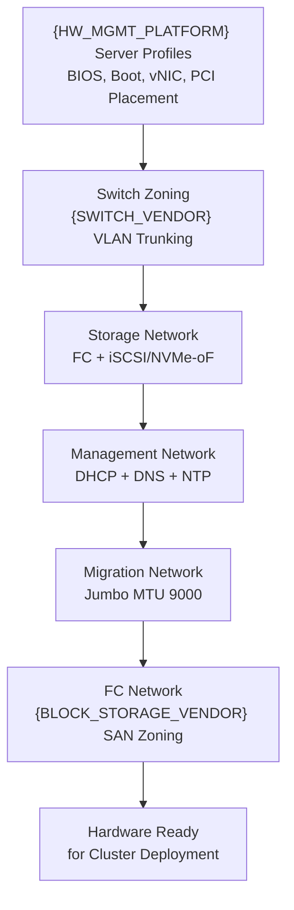
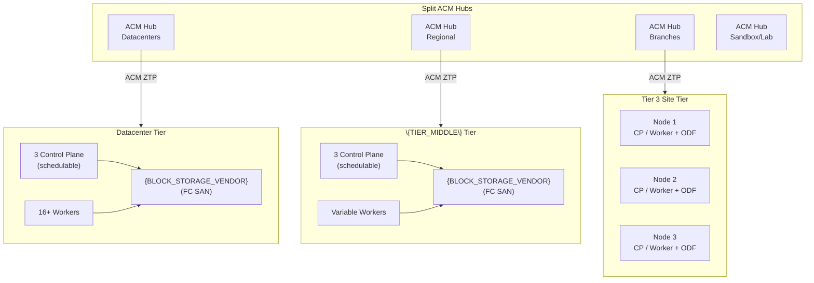
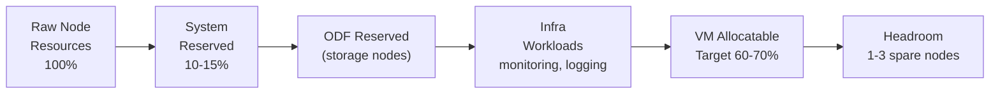
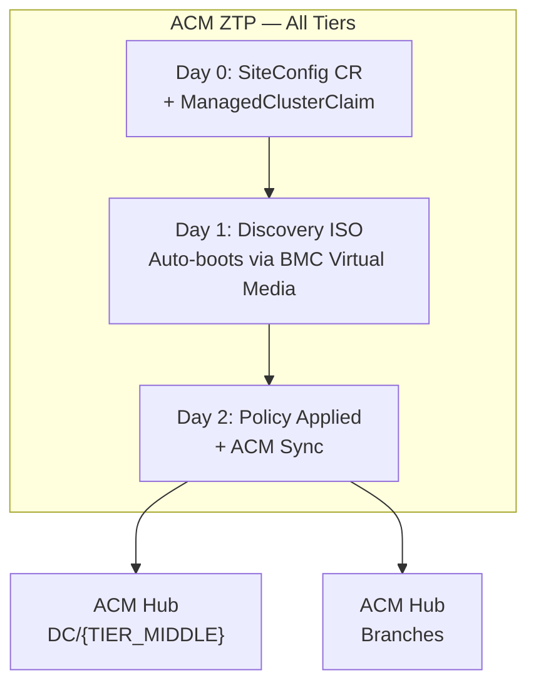
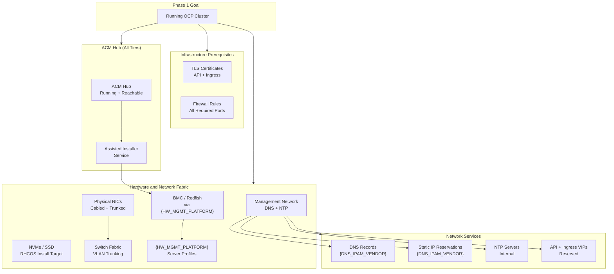

# PHASE 1 — FOUNDATION

*No cluster exists. These decisions define what we build, how large, and how we provision it. This phase also captures all infrastructure prerequisites — DNS, certificates, firewall rules, network fabric, and hardware provisioning — that must be completed before ACM ZTP begins cluster provisioning.*

## Phase 1 Flow — Bare Metal to Running Cluster

### Phase 1 Gate Criteria

- [ ] TLS certificates obtained (API + Ingress wildcard)
- [ ] BMC/Redfish reachable from ACM hub for all nodes
- [ ] All DNS records resolving (API, API-int, *.apps, per-node A + PTR)
- [ ] NTP synchronized across all nodes
- [ ] Firewall rules validated (inter-node, VIP, BMC, NTP, egress)
- [ ] IP reservations allocated; API and Ingress VIPs reserved
- [ ] Network fabric configured (VLANs trunked, switch zoning complete)
- [ ] Pre-flight validation passed
- [ ] Cluster API reachable from management network
- [ ] etcd quorum healthy (3 members)
- [ ] All worker nodes joined and `Ready`
- [ ] Console accessible via ingress

---

## TLS/SSL Certificates (Pre-Install)

**Problem:** The API server and ingress endpoints require TLS certificates before cluster deployment. Default self-signed certificates trigger browser warnings and may be rejected by enterprise security scanning. Certificate procurement has lead time that must be factored into the deployment timeline.

**Decision:**

- Internal CA with wildcard certificates for ingress (`*.apps.<cluster>.<base_domain>`)
- Enterprise-signed certificates for the API server (`api.<cluster>.<base_domain>`)
- Certificates obtained as a Day-0 prerequisite before installation begins
- Default ingress certificate replaced post-install by creating a TLS secret in `openshift-ingress` and patching the IngressController resource, as documented in the [OCP certificate configuration guide](https://docs.redhat.com/en/documentation/openshift_container_platform/4.21/html/security_and_compliance/configuring-certificates)
- cert-manager operator automates rotation post-install; initial certificates are provisioned manually
- Per-cluster exception required for wildcard certificates (ADR 24)

**Applies to:** [DC] [{TIER_MIDDLE}] [EDGE]

### Certificate Inventory (per cluster)

| Certificate      | Subject / SAN                    | Issued By       | Timing                 |
| ---------------- | -------------------------------- | --------------- | ---------------------- |
| API server       | `api.<cluster>.<base_domain>`    | Enterprise CA   | Day 0 — before install |
| Ingress wildcard | `*.apps.<cluster>.<base_domain>` | Internal CA     | Day 0 — before install |
| etcd peer/client | Auto-generated by OCP            | OCP internal CA | Automatic at install   |
| Kubelet serving  | Auto-generated by OCP            | OCP internal CA | Automatic at install   |

**Positive:**

- Enterprise-grade TLS from Day 0
- No self-signed certificate warnings

**Trade-off:**

- Certificate procurement adds lead time
- Wildcard cert exceptions needed per cluster

---

## Firewall Rules & Port Requirements

**Problem:** Firewall rules must be in place before installation. Blocked ports cause silent installation failures or cryptic timeouts. {CLIENT}'s network security model requires explicit firewall rules for all traffic paths. The port matrix below aligns with the [OCP bare-metal installation guide](https://docs.redhat.com/en/documentation/openshift_container_platform/4.21/html/installing_on_bare_metal/preparing-to-install-on-bare-metal), the  [RHACM networking requirements](https://docs.redhat.com/en/documentation/red_hat_advanced_cluster_management_for_kubernetes/2.12/html/networking/networking), the [OCP IPI bare-metal prerequisites](https://docs.redhat.com/en/documentation/openshift_container_platform/4.15/html/deploying_installer-provisioned_clusters_on_bare_metal/ipi-install-prerequisites) (virtual media and Ironic ports), and the [OCP firewall configuration guide](https://docs.redhat.com/en/documentation/openshift_container_platform/4.21/html/installation_configuration/configuring-firewall).

**Decision:**

- Firewall-only egress for DC/{TIER_MIDDLE} clusters — no proxy (ADR 16)
- VM traffic is unaffected (bridged VLANs bypass cluster egress)
- Tier 3 Site egress {BRANCH_EGRESS_STRATEGY}
- All inter-node, VIP-to-node, BMC/Redfish, Ironic provisioning, ACM hub <-> managed cluster, and external connectivity ports opened before ACM ZTP begins cluster provisioning, per the sources cited above

**Applies to:** [DC] [{TIER_MIDDLE}] [EDGE]

### Required Port Matrix

| Traffic Path                          | Ports       | Protocol | Purpose                                                      |
| ------------------------------------- | ----------- | -------- | ------------------------------------------------------------ |
| **Inter-node (all <-> all)**            |             |          |                                                              |
|                                       | —           | ICMP     | Network reachability tests                                   |
|                                       | 1936        | TCP      | Metrics / ingress health-check probes                        |
|                                       | 9000-9999   | TCP/UDP  | Host services (node-exporter, CVO, etc.)                     |
|                                       | 10250-10259 | TCP      | Kubernetes reserved (kubelet, kube-proxy)                    |
|                                       | 22623       | TCP      | Machine Config Server (node → control plane)                 |
|                                       | 6081        | UDP      | Geneve (OVN-Kubernetes)                                      |
|                                       | 30000-32767 | TCP/UDP  | NodePort range                                               |
| **All machines → Control Plane**      |             |          |                                                              |
|                                       | 6443        | TCP      | Kubernetes API                                               |
| **Control Plane <-> Control Plane**     |             |          |                                                              |
|                                       | 2379-2380   | TCP      | etcd server + peer                                           |
| **VIP (keepalived/haproxy) → Control Plane** |        |          |                                                              |
|                                       | 6443        | TCP      | Kubernetes API                                               |
|                                       | 22623       | TCP      | Machine Config Server                                        |
| **VIP (keepalived/haproxy) → Workers** |             |          |                                                              |
|                                       | 80          | TCP      | HTTP ingress                                                 |
|                                       | 443         | TCP      | HTTPS ingress                                                |
| **ACM Hub <-> Managed Cluster**         |             |          |                                                              |
|                                       | 443         | TCP      | Hub management, log retrieval, metrics, alerts               |
|                                       | 6443        | TCP      | Kubernetes API (klusterlet install + sync)                   |
| **ACM Hub → BMC (Redfish API)**       |             |          |                                                              |
|                                       | 443         | TCP      | Redfish management (power state, virtual media boot control) |
| **BMC → Hub (Virtual Media ISO)**     |             |          |                                                              |
|                                       | 6180        | TCP      | Virtual media HTTP — BMC pulls ISO from hub image service    |
|                                       | 6183        | TCP      | Virtual media HTTPS/TLS — BMC pulls ISO from hub             |
| **Hub <-> Provisioning Nodes (Ironic)** |             |          |                                                              |
|                                       | 5050        | TCP      | Ironic Inspector API (hardware introspection)                |
|                                       | 6385        | TCP      | Ironic API (node enroll, power, deploy)                      |
|                                       | 9999        | TCP      | Ironic Python Agent callback (IPA on node → conductor)       |
| **External Connectivity**             |             |          |                                                              |
|                                       | 123         | UDP      | NTP                                                          |
|                                       | 443         | TCP      | {IMAGE_REGISTRY} (pull-through cache), registry access            |
|                                       | 443         | TCP      | GitHub Enterprise (`{GITOPS_HOST}`) — GitOps repo access      |
|                                       | 443         | TCP      | GitHub.com (`*.github.com`) — GitOps dependencies            |
|                                       | 53          | TCP/UDP  | DNS (CoreDNS to upstream)                                    |

**Positive:** Firewall-only eliminates proxy config complexity and noProxy maintenance across {CLUSTER_COUNT} clusters

**Trade-off:**

- Firewall rules must be created per site/cluster before installation
- Requires network team coordination

**Alternatives rejected:**

- **Proxy for all clusters**:
  - noProxy maintenance across {CLUSTER_COUNT} clusters is operationally expensive
  - Proxy adds latency
- **No firewall (flat network)**: Does not meet security standards for regulated production environments

---

## Hardware Provisioning & Network Fabric

**Problem:** Physical infrastructure — server profiles, switch zoning, VLAN trunking, and multi-layer network fabric — must be configured before cluster deployment. This is the longest lead-time activity in Phase 1 and involves multiple teams (compute, network, storage, security).

**Decision:**

- Cisco {HW_MGMT_PLATFORM} server profiles define BIOS, boot, vNIC, and storage policies for all nodes
- PCI placement rules in {HW_MGMT_PLATFORM} resolve NIC reordering across reboots (ADR 7)
- NIC design and traffic separation follows the [OCP-V Architecture Guide](https://access.redhat.com/articles/7119411) and [OCP-V Example Architectures](https://access.redhat.com/articles/7067871)
- Switch zoning and VLAN trunking could be configured via Ansible playbooks run through AAP
- Baseline 4 vNICs per node — vNIC 0 for OCP management (FI-A), vNIC 1 for VM data with OVS bridges (FI-B), vNIC 2 for live migration, vNIC 3 for backup ({BACKUP_VENDOR})
- MTU: jumbo (9000/9216) at FI, management at 1500
- {CLIENT} to complete VLAN-to-vNIC mapping and identify VLANs for migration and backup interfaces

**Applies to:** [DC] [{TIER_MIDDLE}] [EDGE]

### Hardware Provisioning Sequence

### Network Fabric Layers

| Network Layer | VLAN                           | MTU       | Purpose                                  | Tier Applicability |
| ------------- | ------------------------------ | --------- | ---------------------------------------- | ------------------ |
| Management    | Site-specific                  | 1500      | OCP API, etcd, DNS, NTP, node-to-node    | [DC] [{TIER_MIDDLE}] [EDGE]  |
| VM Data       | Multiple (all presented VLANs) | 1500      | VM tenant traffic via OVS bridges + NADs | [DC] [{TIER_MIDDLE}] [EDGE]  |
| Storage       | Site-specific                  | 9000/9216 | {BLOCK_STORAGE_VENDOR} FC block access              | [DC] [{TIER_MIDDLE}]         |
| Migration     | Dedicated                      | 9000      | Live migration memory page transfer      | [DC] [{TIER_MIDDLE}]         |
| Backup        | Dedicated                      | 9000      | {BACKUP_VENDOR} agent backup traffic              | [DC] [{TIER_MIDDLE}] [EDGE]  |
| FC SAN        | N/A (FC zoning)                | N/A       | {BLOCK_STORAGE_VENDOR} block access                 | [DC] [{TIER_MIDDLE}]         |
| BMC/CIMC      | Site-specific                  | 1500      | Out-of-band management, Redfish          | [DC] [{TIER_MIDDLE}] [EDGE]  |

### NIC Naming & Interface Stability

**Problem:** Interface names can change on reboot with Broadcom NICs, breaking NMState policies and bond configurations. The [NMState Operator](https://docs.redhat.com/en/documentation/openshift_container_platform/4.21/html/networking_operators/k8s-nmstate-about-the-k8s-nmstate-operator) requires consistent naming for `NodeNetworkConfigurationPolicy` resources to apply correctly across all nodes of the same role.

**Decision:** PCI placement rules in {HW_MGMT_PLATFORM} server profiles resolve the Broadcom NIC reordering issue (ADR 7). Rules are carried into all production server profile templates as a Day-0 requirement. All production nodes use {SERVER_HARDWARE} managed by {HW_MGMT_PLATFORM}.

**Positive:**

- Predictable NIC names
- NMState policies apply consistently across fleet

**Trade-off:**

- PCI rules must be included in every server profile template
- {HW_MGMT_PLATFORM} dependency

### Day-0 MachineConfig Considerations

If the `KubeVirtRelieveAndMigrate` descheduler profile is selected (ADR 40), the PSI (Pressure Stall Information) kernel argument must be enabled on all worker nodes via a MachineConfig applied at Day 0. Per the [OpenShift Virtualization 4.21 descheduler documentation](https://docs.redhat.com/en/documentation/openshift_container_platform/4.21/html/virtualization/managing-vms#virt-enabling-descheduler-evictions), this profile "requires PSI metrics to be enabled on all worker nodes" via `psi=1`. The MachineConfig name must be lexicographically higher than `98-*` (default config disables PSI). Applying this at Day 0 avoids a node reboot cycle after workloads are running.

**PSI status in OCP 4.21:** PSI kernel support is [newly officially available starting with OCP 4.21](https://developers.redhat.com/articles/2026/03/18/prepare-enable-linux-pressure-stall-information-red-hat-openshift)  It is a **fully supported feature** (not Technology Preview) but remains disabled by default. The `KubeletPSI` feature gate is enabled by default in Kubernetes 1.34 (which underpins OCP 4.21), but the MCO does not change the kernel default, a MachineConfig with `psi=1` is still required. **Prometheus capacity impact:** Red Hat's performance evaluation shows enabling PSI increases Prometheus pod RSS by up to ~1.3 GB per pod (~42% increase from baseline at 500+ containers). No observable impact on kubelet CPU or memory. Plan Prometheus memory allocation accordingly.

**Descheduler profile status in OCP 4.21:** The base `KubeVirtRelieveAndMigrate` profile is available in OCP 4.21 (GA March 2026). The `dev*`-prefixed customization fields (`devDeviationThresholds`, `devActualUtilizationProfile`, `devEnableSoftTainter`) indicate those advanced tuning options are still in developer preview — however the base profile with default thresholds is production-supported on OCP 4.21.

### {HW_MGMT_PLATFORM} Server Profile Contents

| Policy           | Purpose                                                            |
| ---------------- | ------------------------------------------------------------------ |
| BIOS             | {HW_MGMT_PLATFORM} vendor-recommended BIOS profile — virtualization extensions (VT-x, VT-d), NX bit, performance tuning. Validate against OCP foundation requirements. |
| Boot             | UEFI boot order; local disk or SAN boot                            |
| vNIC             | 4 vNICs with VLAN assignments, PCI placement, QoS                  |
| Ethernet Adapter | Interrupt coalescing, RSS, ring buffer sizing                      |
| Storage (FC)     | WWPN pools, SAN boot targets (if applicable)                       |
| IPMI             | IPMI encryption configuration per vendor CVD. Validate with hardware vendor for correct enablement sequence (some platforms require initial deployment with IPMI encryption disabled, then post-install hardening). |

**Positive:**

- Repeatable server profiles
- NIC stability via PCI rules
- Network fabric pre-validated
- Vendor-recommended BIOS profile simplifies standardization across VMware and OCP-V

**Trade-off:**

- {HW_MGMT_PLATFORM} profile creation is multi-team
- {INFRA_PLATFORM} playbook adaptation required
- IPMI encryption requires post-install hardening step (not automated yet)

**Alternatives rejected:**

- **Manual server profile creation**:
  - Not repeatable across {CLUSTER_COUNT} clusters
  - Configuration drift
- **Single vNIC for all traffic**:
  - No isolation
  - Migration storms impact etcd/API

---

## IP Reservations & Load Balancer VIPs

**Problem:** API and Ingress VIPs, per-node IPs, and per-interface IPs must be reserved before `install-config.yaml` generation. Post-install IP changes are not supported for cluster networks. 

**Decision:**

- Built-in keepalived/haproxy for all clusters (ADR 12)
- No F5 VIP pre-provisioning
- F5 GTM in DNS path only (pool members are {DNS_IPAM_VENDOR}), not LB for OCP traffic
- API VIP and Ingress VIP reserved on the baremetal network and not assigned to any host, per the [bare-metal installation guide](https://docs.redhat.com/en/documentation/openshift_container_platform/4.21/html/installing_on_bare_metal/preparing-to-install-on-bare-metal)

**Applies to:** [DC] [{TIER_MIDDLE}] [EDGE]

### Per-Cluster IP Allocation

| IP Type             | Count      | Network        | Notes                                                 |
| ------------------- | ---------- | -------------- | ----------------------------------------------------- |
| API VIP             | 1          | Baremetal      | Kubernetes API virtual IP; floats via keepalived      |
| Ingress VIP         | 1          | Baremetal      | Application ingress virtual IP; floats via keepalived |
| Control plane nodes | 3          | Baremetal      | Static IP via NMState                                 |
| Worker nodes        | N          | Baremetal      | Static IP via NMState                                 |
| BMC/CIMC            | 1 per node | Management/BMC | Out-of-band management                                |
| Storage interface   | 1 per node | Storage VLAN   | {BLOCK_STORAGE_VENDOR} FC (DC/{TIER_MIDDLE}); ODF (tier 3 site)                 |

### keepalived/haproxy VIP Targets

| VIP Target                | Ports               | Backend                                            |
| ------------------------- | ------------------- | -------------------------------------------------- |
| API (internal + external) | TCP 6443, TCP 22623 | Control plane nodes                                |
| Ingress                   | TCP 80, TCP 443     | Worker nodes (or all nodes if schedulable masters) |

**Positive:**

- Eliminates external LB dependency
- Simplifies provisioning
- VIP failover is automatic

**Trade-off:**

- VIP failover limited to single cluster
- keepalived requires L2 adjacency for VRRP

**Alternatives rejected:**

- **F5 as external LB for OCP traffic**:
  - Adds external dependency
  - Requires F5 team coordination per cluster
- **MetalLB for VIPs**: Not needed — keepalived handles API/Ingress VIPs natively. No advanced usecases uncovered

---

## DNS, Static IPs & NTP Prerequisites

**Problem:** Cluster bootstrap requires forward and reverse DNS records, static IPs, and NTP synchronization before installation begins. Missing or misconfigured DNS is the most common cause of installation failure. NTP drift causes Kerberos failures, certificate validation errors, and log correlation problems.

**Decision:**

- All DNS records created in {DNS_IPAM_VENDOR} before installation, as required by the [OCP bare-metal installation guide](https://docs.redhat.com/en/documentation/openshift_container_platform/4.21/html/installing_on_bare_metal/preparing-to-install-on-bare-metal)
- IP reservations for all nodes on the baremetal network
- Internal NTP servers configured via chrony MachineConfig at Day 0/Day 1, per the [bare-metal installation guide](https://docs.redhat.com/en/documentation/openshift_container_platform/4.21/html/installing_on_bare_metal/preparing-to-install-on-bare-metal)
- CoreDNS requires both TCP and UDP to upstream DNS servers

**Applies to:** [DC] [{TIER_MIDDLE}] [EDGE]

### Required DNS Records (per cluster)

| Type            | Record                               | Target             | Required By                 |
| --------------- | ------------------------------------ | ------------------ | --------------------------- |
| A/AAAA + PTR    | `api.<cluster>.<base_domain>`        | API VIP            | All methods                 |
| A/AAAA + PTR    | `api-int.<cluster>.<base_domain>`    | API VIP (internal) | All methods                 |
| Wildcard A/AAAA | `*.apps.<cluster>.<base_domain>`     | Ingress VIP        | All methods                 |
| A/AAAA + PTR    | `<hostname>.<base_domain>`           | Per-node IP        | All control plane + workers |

PTR (reverse) records are **required** for all nodes. The [OCP bare-metal installation guide](https://docs.redhat.com/en/documentation/openshift_container_platform/4.21/html/installing_on_bare_metal/preparing-to-install-on-bare-metal) confirms that RHCOS uses PTR records to set hostnames. Missing PTR records cause CSR failures and node naming issues.

### NTP Requirements

| Requirement | Detail                                                                         |
| ----------- | ------------------------------------------------------------------------------ |
| NTP servers | Internal NTP at DCs and {TIER_MIDDLE} sites; tier 3 site NTP via existing network infra (confirm per-site) |
| Protocol    | UDP port 123 reachable from all nodes via baremetal network                    |
| BIOS clock  | Consistent date/time format across all nodes (mismatch causes install failure). {HW_MGMT_PLATFORM} domain-level NTP may not propagate to server BIOS — validate with hardware vendor before scale deployments. |
| Chrony delivery | ArgoCD pushes chrony MachineConfig; ACM inform policy monitors compliance |
| Guest VM time | **No hypervisor time sync.** Windows VMs sync via Active Directory / Kerberos; Linux VMs sync via NTP servers directly. Hypervisor time sync explicitly disabled. Appliances use per-device NTP at minimum. |

**Positive:** Pre-validated DNS eliminates the most common installation failure mode. Guest VMs already manage their own time sync independently — no hypervisor-level time configuration needed on OCP-V.

**Trade-off:**

- DNS record creation requires coordination with {DNS_IPAM_VENDOR} team
- Lead time for record propagation
- BIOS time validation adds a step to the hardware handoff checklist but prevents installation failures

---

## Deployment Tier Model

**Problem:** {CLIENT}'s fleet spans {CLUSTER_COUNT} sites of vastly different size, from 16+ node datacenters to 3-node tier 3 site offices on {BRANCH_HARDWARE}. A single cluster profile cannot serve both.

**Decision:** Three-tier deployment model; Datacenter, {TIER_MIDDLE}, and Tier 3 Site (3-node compact on Unified Edge) — each with a defined node profile, managed through split ACM hubs with ACM policy overlays. Tier sizing follows the [OCP-V Cluster Sizing Guide](https://access.redhat.com/articles/7107457) and architectural guidance from the [OCP-V Architecture Guide](https://access.redhat.com/articles/7119411).

**Applies to:** [DC] [{TIER_MIDDLE}] [EDGE]

### Tier Model Diagram

**Positive:**

- Single management plane per tier
- Overlays prevent fleet drift across {CLUSTER_COUNT} clusters

**Trade-off:**

- Three profiles + split hubs to maintain
- Overlay complexity increases with tier divergence

**Alternatives rejected:**

- **Single flat profile**: Cannot scale from 3-node tier 3 site to 16+ node DC efficiently
- **Per-cluster customization**:
  - Snowflake clusters
  - No fleet consistency across {CLUSTER_COUNT} clusters
- **Single ACM hub**: Organizational alignment (different teams for DCs vs tier 3 sites), blast radius concerns

---

## OCP Version Strategy

**Problem:** Target OCP version impacts support lifecycle, feature availability, and {BACKUP_VENDOR} CBT compatibility.

**Decision:**

- Target OCP {OCP_VERSION}
- Track latest GA (N) during year one to obtain {BACKUP_VENDOR} CBT support (expected in OCP 4.22, ~June 2026), then revert to N-1 policy for stability
- `stable` update channel for production clusters; releases promoted from `fast` to `stable` typically have a 1-2 week delay for z-stream and 45-90 days for minor versions
- OCP lifecycle and support timelines published in the [Red Hat OpenShift Life Cycle Policy](https://access.redhat.com/support/policy/updates/openshift)

**Applies to:** [DC] [{TIER_MIDDLE}] [EDGE]

**Positive:**

- Broadest feature set
- Latest bug fixes
- CBT available soonest

**Trade-off:**

- Faster upgrade cadence required during year one
- Operator compatibility validated per release

---

## Capacity & Headroom Policy

**Problem:** Over-provisioning wastes money; under-provisioning causes migration failures during drains. {CLIENT} needs a defined capacity model based on RVTools baseline ({VM_COUNT} VMs, {HOST_COUNT} hosts, {SITE_COUNT} sites).

**Decision:**

- Target 60-70% average CPU utilization
- No memory overcommit
- Headroom: 1 spare node minimum (2-3 preferred) for DC/{TIER_MIDDLE}; tier 3 sites have only 3 control plane nodes and it is currently anticipated that there are no capacity concerns
- maxUnavailable: 1 for small clusters; 2-4 for 16+ node clusters
- Pods-per-node: {PODS_PER_NODE}
- Right-sizing addressed post-migration by comparing actual utilization (from Prometheus/Grafana dashboards) against allocated resources
- VM sizing should reflect actual expected workload rather than generic defaults, per the [OCP-V Cluster Sizing Guide](https://access.redhat.com/articles/7107457)
- Node sizing recommendations for VM-heavy bare-metal deployments per the [OCP-V Architecture Guide](https://access.redhat.com/articles/7119411)
- Per-node and per-cluster maximums governed by [OCP-V Supported Limits](https://docs.redhat.com/en/documentation/openshift_container_platform/4.21/html/virtualization/getting-started#virt-supported-limits) and [OCP Object Maximums](https://docs.redhat.com/en/documentation/openshift_container_platform/4.21/html/scalability_and_performance/planning-your-environment-according-to-object-maximums)

**Applies to:** [DC] [{TIER_MIDDLE}] [EDGE]

### Capacity Waterfall

**Positive:**

- Predictable drain behavior
- Capacity alerts fire before migration failures

**Trade-off:**

- Higher hardware cost due to headroom
- Strict memory allocation limits VM density

**Alternatives rejected:**

- **90% target utilization**:
  - No headroom for drains
  - Migration failures during maintenance
- **Memory overcommit enabled**:
  - OOM kill risk for VMs
  - Unacceptable for regulated production workloads
- **No formal capacity policy**:
  - Reactive
  - Capacity issues discovered during incidents

---

## Cluster Network CIDRs

**Problem:** Pod and service subnet CIDRs and pods-per-node limits must be finalized before installation — they cannot be changed post-install.

**Decision:**

- PodSubnet `{POD_CIDR}`, ServicesSubnet `{SVC_CIDR}`, Host CIDR `/23`
- Same non-routable ranges reused across all clusters
- Pods-per-node: **512** (accommodates VM density plus system workloads and sidecars)
- Tier 3 Sites/{TIER_MIDDLE} sites share existing subnets where dedicated OCP subnets are unavailable
- These values are set in `install-config.yaml` and cannot be changed post-install, as noted in the [OCP bare-metal installation guide](https://docs.redhat.com/en/documentation/openshift_container_platform/4.21/html/installing_on_bare_metal/preparing-to-install-on-bare-metal)

**Applies to:** [DC] [{TIER_MIDDLE}] [EDGE]

**Positive:**

- Fleet-wide consistency
- /23 matches 512 pods-per-node target and supports up to 64 nodes per cluster

**Trade-off:** Shared subnets at tier 3 sites require per-tier 3 site IP planning

---

## Container Image Registry

**Problem:** {CLUSTER_COUNT} clusters need reliable image access. Rate-limiting and internet dependency must be minimized.

**Decision:** {IMAGE_REGISTRY} is the pull-through cache and enterprise image registry. The OpenShift image registry (in-cluster) operates in ephemeral mode, as described in the [OCP registry documentation](https://docs.redhat.com/en/documentation/openshift_container_platform/4.21/html/registry/).

**Applies to:** [DC] [{TIER_MIDDLE}] [EDGE]

**Positive:**

- Reduced internet dependency
- No rate-limit risk
- Leverages existing {IMAGE_REGISTRY}

**Trade-off:**

- {IMAGE_REGISTRY} availability becomes a cluster dependency
- Bandwidth-constrained tier 3 sites may need local mirror

---

## Provisioning Method per Tier

**Problem:** DC/{TIER_MIDDLE} clusters have BMC access and stable networks; {BRANCH_COUNT} tier 3 site sites on Unified Edge need zero-touch deployment at scale.

**Decision:**

- All tiers use ACM ZTP with the [Assisted Installer via RHACM](https://docs.redhat.com/en/documentation/red_hat_advanced_cluster_management_for_kubernetes/2.12/html/clusters/cluster_mce_overview#hosting-service-cluster-configure-bm) for cluster provisioning
- Tier 3 Site clusters additionally leverage the [GitOps ZTP pipeline with SiteConfig resources](https://docs.openshift.com/container-platform/4.21/edge_computing/ztp-deploying-far-edge-sites.html) for at-scale deployment
- Both produce RHCOS nodes joined to their respective ACM hub
- Red Hat's scale lab has validated 3,500 single-node clusters managed from a single RHACM hub, as documented in the [ZTP hub cluster preparation guide](https://docs.redhat.com/en/documentation/openshift_container_platform/4.21/html/edge_computing/ztp-preparing-the-hub-cluster)
- Cisco {INFRA_PLATFORM} validated Ansible playbooks available as starting point; AAP competency exists in-house

**Applies to:** [DC] [{TIER_MIDDLE}] [EDGE]

### Provisioning Paths

**Positive:**

- Single provisioning method for all tiers
- ZTP scales to ~400+ tier 3 sites

**Trade-off:**

- ZTP has steeper learning curve
- Requires ACM hub to be operational before any spoke

**Alternatives rejected:**

- **UPI for all**:
  - Manual
  - Error-prone
  - Does not scale to {CLUSTER_COUNT} clusters
- **IPI for DC/{TIER_MIDDLE} + ZTP for tier 3 sites**: Two provisioning methods to maintain; IPI requires bastion host

---

## Pre-Flight Validation Checklist

**Problem:** Installation failures are difficult to diagnose when prerequisites are partially met. Cryptic error messages from the Assisted Installer service often trace back to DNS, NTP, or BMC connectivity issues that could have been caught before installation was attempted.

**Decision:**

- Mandatory pre-flight validation executed before installation runs, following the [OCP bare-metal installation guide](https://docs.redhat.com/en/documentation/openshift_container_platform/4.21/html/installing_on_bare_metal/preparing-to-install-on-bare-metal)
- Validation is scripted (Ansible playbook or shell) and produces a pass/fail report
- Installation does not proceed until all checks pass
- The [OCP-V Architecture Guide](https://access.redhat.com/articles/7119411) recommends pre-deployment validation of network, storage, and BMC connectivity

**Applies to:** [DC] [{TIER_MIDDLE}] [EDGE]

### Pre-Flight Checklist

| Check                   | Method                                                         | Pass Criteria                           |
| ----------------------- | -------------------------------------------------------------- | --------------------------------------- |
| DNS — API record        | `dig api.<cluster>.<base_domain>`                              | Resolves to API VIP                     |
| DNS — API-int record    | `dig api-int.<cluster>.<base_domain>`                          | Resolves to API VIP                     |
| DNS — Ingress wildcard  | `dig test.apps.<cluster>.<base_domain>`                        | Resolves to Ingress VIP                 |
| DNS — Node A records    | `dig <hostname>.<base_domain>` per node                        | Resolves to correct node IP             |
| DNS — PTR records       | `dig -x <node_ip>` per node                                    | Returns correct FQDN                    |
| NTP                     | `chronyc sources` from ACM hub                                 | Synced to internal NTP; offset < 100ms  |
| BMC reachability        | `curl -k https://<bmc_ip>/redfish/v1/Systems` per node         | HTTP 200 with valid JSON                |
| NIC cabling             | {HW_MGMT_PLATFORM} inventory or `lldpctl`                              | Expected NICs present and linked        |
| IP conflict             | `arping -D -c 3 <node_ip>` per node on baremetal VLAN          | No duplicate IP detected                |
| Firewall — API          | `nc -zv <api_vip> 6443` from external client                   | Connection succeeds                     |
| Firewall — Ingress      | `nc -zv <ingress_vip> 443` from external client                | Connection succeeds                     |
| Firewall — inter-node   | `nc -zv <node_ip> 2379` from peer node                         | Connection succeeds (etcd)              |
| Certificates            | `openssl x509 -in <cert> -noout -dates`                        | Not expired; SAN matches cluster FQDN   |
| Pull secret             | `podman login --authfile <pull_secret> <artifactory_registry>` | Login succeeds to {IMAGE_REGISTRY}           |
| Disk — etcd performance | `fio` sequential write test on install target                  | `wal_fsync_duration_seconds` p99 < 10ms |

**Positive:**

- Catches configuration errors before they become installation failures
- Reduces troubleshooting time

**Trade-off:**

- Adds ~15-30 minutes before each cluster install
- Requires scripted validation tooling

---

## Phase 1 Dependency Overlay

What must be healthy before the cluster exists:

| Shared Dependency          | Failure Impact                                                         |
| -------------------------- | ---------------------------------------------------------------------- |
| BMC/Redfish ({HW_MGMT_PLATFORM})   | Cannot discover or power-on nodes; provisioning halted                 |
| TLS Certificates           | API/Ingress endpoints untrusted; enterprise scanning blocks access     |
| DNS Records ({DNS_IPAM_VENDOR})     | Bootstrap fails; nodes cannot resolve API endpoint                     |
| Static IP Reservations     | Nodes unreachable; NMState config fails if IPs conflict or unallocated |
| NTP Servers                | Clock drift causes cert validation failures and Kerberos errors        |
| Firewall Rules             | Silent installation failures; blocked ports cause timeouts             |
| API + Ingress VIPs         | No cluster endpoint; keepalived cannot float VIPs                      |
| Switch Fabric / VLANs      | No network connectivity; traffic isolation broken                      |
| {HW_MGMT_PLATFORM} Server Profiles | Nodes not configured; NIC naming unstable                              |
| Physical NICs              | No network connectivity; cluster cannot form                           |
| NVMe/SSD                   | No install target; RHCOS cannot be written                             |

---

## Phase 1 RACI

| Activity                              | Platform | Network | Storage | Security | Infra |
| ------------------------------------- | -------- | ------- | ------- | -------- | ----- |
| TLS/SSL certificate procurement       | C        | I       | -       | R/A      | I     |
| Firewall rules configuration          | C        | R/A     | -       | C        | I     |
| DNS record creation ({DNS_IPAM_VENDOR})        | C        | R/A     | -       | -        | I     |
| IP reservations and VIP allocation    | C        | R/A     | -       | -        | I     |
| Hardware provisioning ({HW_MGMT_PLATFORM})    | I        | C       | C       | -        | R/A   |
| Switch zoning and VLAN trunking       | I        | R/A     | C       | -        | I     |
| Pre-flight validation                 | R/A      | C       | C       | -        | C     |
| Cluster deployment (ACM ZTP)          | R/A      | C       | -       | -        | C     |

**Legend:** R = Responsible, A = Accountable, C = Consulted, I = Informed
