# PHASE 2 — PLATFORM BUILD

*Cluster exists but is unconfigured. These decisions define the storage, network, security, and observability foundations.*

## Phase 2 Flow — Cluster to Configured Platform

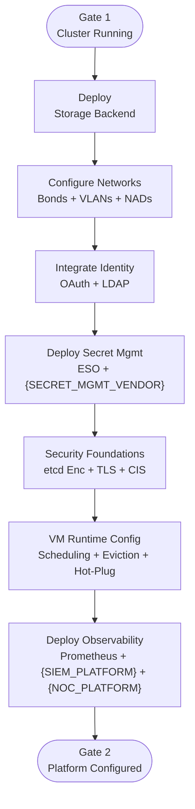

### Phase 2 Gate Criteria

- [ ] Storage backends healthy — {BLOCK_CSI_DRIVER} connected to {BLOCK_STORAGE_VENDOR} at DC/{TIER_MIDDLE}; ODF healthy at tier 3 sites; default StorageClasses created
- [ ] NMState policies applied, all bonds active
- [ ] OAuth login working with LDAP groups
- [ ] ESO syncing secrets from {SECRET_MGMT_VENDOR}
- [ ] etcd encryption enabled; TLS certs deployed
- [ ] {SCANNING_VENDOR} CIS scan completed; high-severity items remediated
- [ ] VM eviction strategy set to `LiveMigrate`; hot-plug defaults configured (4x CPU, 2x memory)
- [ ] Schedulable masters confirmed; infra workloads co-located; no memory overcommit enforced
- [ ] Prometheus scraping, AlertManager → {NOC_PLATFORM} routing confirmed
- [ ] Vector → {SIEM_PLATFORM} log forwarding active; Loki 3-day local retention verified
- [ ] Descheduler profile selected and deployed (ADR 40)
- [ ] CIS OCP-V benchmark scan completed alongside OCP CIS scan; Phase 2-relevant gaps triaged

---

## Storage Backend Selection

**Problem:** VMs need persistent block storage with RWX support for live migration. The storage backend differs by tier: DC/{TIER_MIDDLE} clusters use {BLOCK_STORAGE_VENDOR} via FC SAN with the {BLOCK_CSI_DRIVER}, while tier 3 site clusters use local NVMe with ODF.

**Decision:** Two-tier storage model.

- *DC/{TIER_MIDDLE}*: {BLOCK_STORAGE_VENDOR} via {BLOCK_CSI_DRIVER} over FC SAN — enterprise-grade block storage with RWX support for live migration
- *Tier 3 Sites*: ODF with Ceph backend on local NVMe (replica 3, {BRANCH_STORAGE_CAPACITY} total per tier 3 site)
- ODF provides RBD for VM disks (RWX via krbd), CephFS for shared workloads, and S3 via RGW, as detailed in the [ODF bare-metal deployment guide](https://docs.redhat.com/en/documentation/red_hat_openshift_data_foundation/4.21/html/deploying_openshift_data_foundation_using_bare_metal_infrastructure/index)
- Minimum three OCP worker nodes with locally attached storage devices required for ODF at tier 3 sites per the [ODF Planning Guide](https://docs.redhat.com/en/documentation/red_hat_openshift_data_foundation/4.21/html/planning_your_deployment/infrastructure-requirements_rhodf)

**Applies to:** [DC] [{TIER_MIDDLE}] [EDGE]

### Storage I/O Path

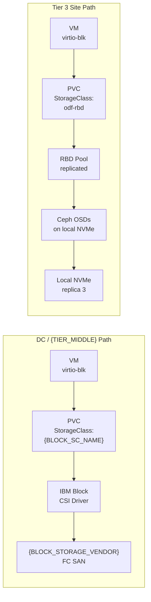

**Positive:**

- DC/{TIER_MIDDLE}: enterprise-grade SAN with existing IBM support
- Tier 3 Site: self-contained storage

**Trade-off:**

- Two storage backends to manage
- ODF overhead at tier 3 sites consumes 10-15% of resources

**Alternatives rejected:**

- **ODF everywhere**: Unnecessary overhead at DC/{TIER_MIDDLE} where {BLOCK_STORAGE_VENDOR} already provides block + RWX
- **{BLOCK_STORAGE_VENDOR} at tier 3 sites**: No FC SAN at tier 3 site sites
- **HostPath CSI only**:
  - No shared storage
  - live migration impossible

### Storage Topology by Tier

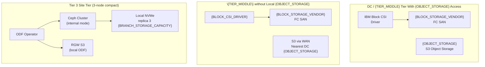

### Object Storage

**Problem:** S3-compatible object storage needed for image registry, logging (Loki), and metrics retention.

**Decision:**

- DC/{TIER_MIDDLE}: {OBJECT_STORAGE} for registry, Loki, and metrics
- Registry: ephemeral ({IMAGE_REGISTRY} is pull-through cache)
- Loki: {OBJECT_STORAGE}-backed, 3-day local retention
- *Tier 3 Sites*: ODF local object storage (replica 3)
- {TIER_MIDDLE} sites without {OBJECT_STORAGE} access nearest DC {OBJECT_STORAGE} over WAN

**Positive:**

- Unified S3 API across tiers
- logging/metrics have durable backend

**Trade-off:** Sites without direct {OBJECT_STORAGE} access need WAN-backed or local alternatives

---

## Network Segregation Strategy

**Problem:** VM storage traffic, live migration, management, and VM data all share physical NICs on {SERVER_HARDWARE}. Without segregation, noisy-neighbor effects degrade latency-sensitive workloads.

**Decision:**

- 4 vNICs per node — vNIC 0 for OCP management (FI-A), vNIC 1 for VM data with OVS bridges (FI-B), vNIC 2 for live migration, vNIC 3 for backup ({BACKUP_VENDOR})
- Both Red Hat and {BACKUP_VENDOR} align on 4 vNICs for traffic isolation (ADR 11)
- MTU: jumbo (9000/9216) at FI, management at 1500
- 100G pipe bandwidth sufficient with QoS
- Traffic separation follows the [OCP-V Architecture Guide](https://access.redhat.com/articles/7119411) recommendations for dedicated management, data, storage/migration, and backup paths
- {CLIENT} to complete VLAN-to-vNIC mapping and identify VLANs for migration and backup interfaces

**Applies to:** [DC] [{TIER_MIDDLE}] [EDGE]

### Network Architecture

**Problem:** {HW_MGMT_PLATFORM} is handling all of the networking hardware

**Decision:** No bonding or similar functionality will be used by the OpenShift Platform as this will happen transparent to the platform.

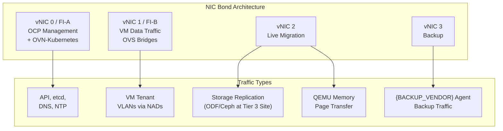

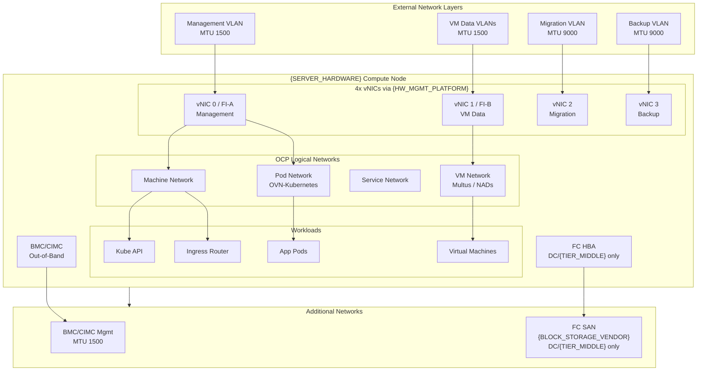

**Positive:** Full traffic isolation — management, VM data, migration, and backup each on dedicated vNICs

**Trade-off:**

- 4 vNICs per node increases {SERVER_HARDWARE} profile complexity
- VLAN-to-vNIC mapping must be completed (ADR 11)

**Alternatives rejected:**

- **Single bond, all traffic**:
  - No isolation
  - migration storms impact storage I/O
- **SR-IOV for all VM traffic**:
  - Hardware-dependent
  - low multi-NIC VM ratio doesn't justify it

### NAD Scope & VLAN Strategy

**Problem:** NetworkAttachmentDefinitions (NADs) can be namespace-scoped or cluster-wide. {CLIENT} has more VLANs presented than currently needed.  NADs are configured using the `NetworkAttachmentDefinition` CRD with OVN-Kubernetes or Multus, as described in the [OCP secondary networks documentation](https://docs.redhat.com/en/documentation/openshift_container_platform/4.21/html/multiple_networks/secondary-networks).

**Decision:**

- NADs in default namespace (cluster-wide)
- All known VLANs configured at build time via NMState policies and NADs
- Cluster-level tier separation (IAM Secure Enclave, DMZ, standard, dedicated) provides primary isolation
- Namespace-scoped NADs add complexity with minimal benefit given ticket-based provisioning

**Positive:** Pre-configuring avoids post-deployment NMState updates and missing VLANs during migration

**Trade-off:**

- Cluster-level isolation rather than namespace-level
- relies on tier separation

**Alternatives rejected:**

- **Namespace-scoped NADs**:
  - Adds complexity
  - minimal isolation benefit with cluster-per-tier model
- **Configure VLANs on-demand**:
  - Post-deployment NMState changes risk disruption
  - missing VLANs at migrate

### MAC Spoof Filtering — Open CIS Compliance Item

CIS OCP-V Level 1 control 4.2 identifies MAC spoof filtering as a gap for `cnv-bridge` NADs, where it is off by default. Enabling `"macspoofchk": true` in bridge-type NAD configurations prevents VMs from impersonating other devices by changing their MAC address. 

- **Explicit enablement:** Add `"macspoofchk": true` to all bridge-type NADs as a Day-1 template requirement propagated via GitOps. No VM downtime or performance impact

This item does not have a firm direction from {CLIENT} yet and should be resolved as part of the CIS OCP-V compliance workflow (see CIS Benchmark Compliance section below), not treated as a hard Day-1 requirement at this time.

### Live Migration Network

**Problem:** Live migration traffic is bandwidth-intensive (QEMU memory page transfer). Sharing with etcd/API traffic risks control plane starvation. The [OCP-V Architecture Guide](https://access.redhat.com/articles/7119411) recommends dedicated or QoS-controlled migration traffic paths.

**Decision:**

- Dedicated vNIC 2 for live migration traffic (ADR 11)
- MTU: jumbo (9000) for migration
- Dedicated interface eliminates contention with etcd/API on the management link during mass migration or maintenance windows as long as QoS is properly implemented
- As the vNICs all share the same physical link, this will have no impact without proper network shaping

**Positive:** Dedicated vNIC eliminates etcd/API starvation risk during mass migration

**Trade-off:**

- Requires dedicated VLAN assignment and {SERVER_HARDWARE} profile update
- VLAN mapping pending (ADR 11)

### Egress Configuration

**Problem:** Cluster egress to internet must be defined — proxy vs direct with firewall rules. Proxy introduces noProxy maintenance overhead across {CLUSTER_COUNT} clusters.

**Decision:**

- No proxy for DC/{TIER_MIDDLE} clusters — firewall-only (ADR 16)
- Firewalls deployed for {SITE_LAB} Lab, {SITE_PRIMARY} prod, {SITE_SECONDARY} prod
- Non-production clusters reuse same firewall groups
- Tier 3 Site egress {BRANCH_EGRESS_STRATEGY}
- VM traffic unaffected (bridged VLANs bypass cluster egress)

**Positive:** Eliminates proxy config complexity and noProxy maintenance across {CLUSTER_COUNT} clusters

**Trade-off:**

- Firewall rules must be created per site before installation
- tier 3 site egress strategy still open

---

## Identity & Access Model

**Problem:** Multiple teams (SRE, platform operations, OS, app owners, backup) need controlled access integrated with {CLIENT} enterprise identity.

**Decision:**

- OAuth with LDAP + group sync, configured per the [OCP authentication and authorization guide](https://docs.redhat.com/en/documentation/openshift_container_platform/4.21/html/authentication_and_authorization/)
- {SECRET_MGMT_VENDOR} for privileged connectors (console)
- htpasswd break-glass managed in {SECRET_MGMT_VENDOR}
- RBAC via cluster roles + namespace isolation

**Applies to:** [DC] [{TIER_MIDDLE}] [EDGE]

### Identity & Access Sequence

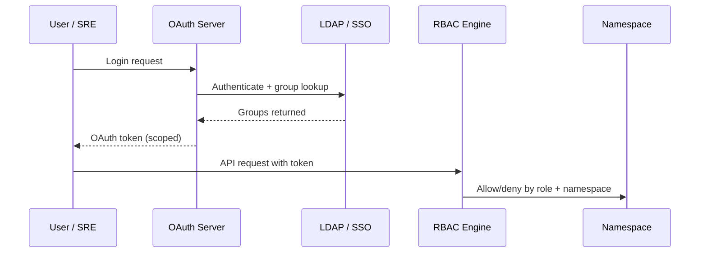

**Positive:**

- Centralized identity
- only break glass account locally
- audit trail
- preserves existing SRE auth model

**Trade-off:**

- LDAP group structure must be well-organized
- {SECRET_MGMT_VENDOR} integration time-boxed

**Alternatives rejected:**

- **Local kubeadmin only**:
  - No audit trail
  - no SSO
- **HTPasswd file**:
  - Not enterprise-grade
  - no centralized lifecycle
  - **only used for break-glass account**

### RBAC Assignments

**Problem:** Access control model must define who can do what across platform, OS, and application tiers. Custom roles are needed because default ClusterRoles do not provide the granularity required for OCP-V operations (e.g., VM console access, backup agent permissions).

**Decision:**

- Auth via LDAP + group sync
- Custom RBAC roles for: {BACKUP_VENDOR} backup team, Windows/Linux OS teams, namespace-level app access
- Iterative approach: minimal role → deploy → test → audit API logs → refine
- Namespace access via AD group process
- Precise role definitions require finalized workload and namespace strategy (ADR 28)

**{BACKUP_VENDOR} RBAC specifics**: {BACKUP_VENDOR} to provide a baseline least-privilege permission set covering ~60-70% of operational scenarios. Backup operations require read/list access only. **Restore operations require elevated permissions**, specifically object creation permissions including cluster roles. {BACKUP_VENDOR} is not requesting cluster-admin access; they are working on runtime elevation for restore scenarios (active development in another regulated environment). Cross-namespace restore has a KubeVirt platform limitation (issue #14544). Iterative refinement planned: {BACKUP_VENDOR} delivers baseline permission set -> platform team deploys -> tests -> audits -> refines.

**Positive:**

- Least privilege enforced
- iterative refinement avoids over-permissioning

**Trade-off:**

- Multiple custom roles to maintain
- API log auditing required to tune permissions

### Breakglass Account

**Problem:** Fallback authentication is needed if LDAP is unavailable. Without a local account, cluster access is impossible during IdP outages.

**Decision:**

- Local htpasswd user account with credentials managed in {SECRET_MGMT_VENDOR} (ADR 22)
- Used only for emergency access when LDAP is unavailable
- Interim until {SECRET_MGMT_VENDOR}/PAM provides OC CLI connector
- htpasswd identity provider configured via OAuth custom resource, as documented in the [OCP authentication guide](https://docs.redhat.com/en/documentation/openshift_container_platform/4.21/html/authentication_and_authorization/)

**Positive:**

- Guaranteed cluster access during IdP outages
- credentials auditable in {SECRET_MGMT_VENDOR}

**Trade-off:**

- Local account is an additional attack surface
- must be tightly controlled

### Self-Provisioner Policy

**Problem:** Should authenticated users self-create projects (namespaces)? Unrestricted self-provisioning can lead to namespace sprawl and audit enforcement problems.

**Decision:** Disable self-provisioner on all OCP-V clusters. Only virt/systems team creates projects which is consistent with VMware operational model.

**Positive:**

- Controlled namespace creation
- consistent with VMware operational model

**Trade-off:**

- Namespace creation requires ticket
- no self-service for teams

### VM Console Access Control

**Problem:** Console access (OCP web console, VNC, serial) must be controlled per team role. Unrestricted console access exposes VMs to unauthorized interaction.

**Decision:**

- Restrict console access — push most users to RDP/SSH via bridged VLANs 
- General app owners: no web console
- Windows/Linux OS teams: may retain console (specifics {CONSOLE_ACCESS_NOTES})
- RBAC via `subresources.kubevirt.io`; the [OCP-V default cluster roles](https://docs.redhat.com/en/documentation/openshift_container_platform/4.21/html/virtualization/about#default-cluster-roles-for-virt_virt-security-policies) (`kubevirt.io:view`, `edit`, `admin`, `migrate`) gate VM operations — custom ClusterRoles restricting `subresources.kubevirt.io` verbs (e.g., `console`, `vnc`) enforce per-team console lockdown
- Iterative refinement per RBAC model

**Positive:**

- Least privilege
- reduced attack surface
- most teams use direct SSH/RDP anyway

**Trade-off:**

- Per-team access matrix must be defined
- multiple custom RBAC roles to maintain

### Namespace Strategy for VMs

**Problem:** Namespace naming granularity: OS-level (linux-vms, windows-vms, appliance-vms) vs application-level. Namespace structure determines RBAC boundary and resource isolation.

**Decision:** Preliminary agreement on mostly OS-level namespaces with a few custom namespaces for specific applications. Internal {CLIENT} discussion needed to finalize, this depends on RBAC model.

**Positive:**

- Simple namespace model mirrors VMware cluster organization
- fewer namespaces to manage

**Trade-off:**

- Coarse-grained isolation
- app-level separation not available without additional namespaces

**Alternatives rejected:**

- **Per-application namespaces**:
  - Requires fine-grained namespace management at scale
  - overhead too high
- **Single namespace for all VMs**:
  - No isolation
  - RBAC cannot differentiate OS/app teams

## Secret Management Approach

**Problem:** VMs and platform services need secrets. {SECRET_MGMT_VENDOR} is the enterprise standard but  OpenShift integration  is currently blocked.

**Decision:**

- {SECRET_MGMT_VENDOR} is the target
- External Secrets Operator (ESO) as connector (supports Conjur)
- Manual pre-population as interim
- Time-box {SECRET_MGMT_VENDOR} effort with a pivot date
- Manual secret count manageable (~10 per cluster)

**Applies to:** [DC] [{TIER_MIDDLE}] [EDGE]

### Secret Management Pipeline

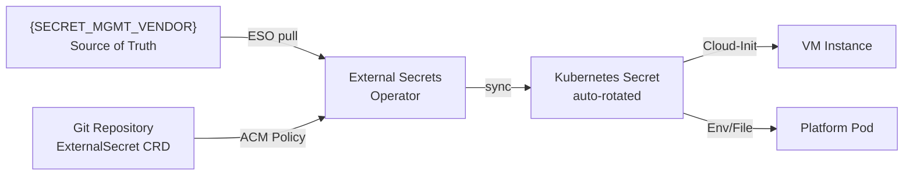

**Positive:**

- Secrets never in Git
- {SECRET_MGMT_VENDOR} is enterprise standard
- ESO is vendor-agnostic

**Trade-off:**

- ESO is an additional operator
- {SECRET_MGMT_VENDOR} connectivity is a dependency
- manual interim during integration

**Alternatives rejected:**

- **Sealed Secrets**:
  - Secrets still in Git (encrypted)
  - no centralized rotation
- **Native K8s secrets only long-term**:
  - No rotation
  - no audit
  - not centralized

---

## Security & Compliance Foundations

### etcd Encryption

**Problem:** Secrets and sensitive data stored in etcd are readable at rest without encryption. {CLIENT} InfoSec standard requires database-level encryption for restricted/confidential data regardless of CIS benchmark requirements.

**Decision:**

- Enable etcd encryption at rest on all OCP-V clusters
- Encryption enabled by setting `spec.encryption.type` to `aescbc` or `aesgcm` on the `APIServer` resource, per the [OCP etcd encryption guide](https://docs.redhat.com/en/documentation/openshift_container_platform/4.21/html/etcd/enabling-etcd-encryption)
- Performance impact: ~1-2% 
- Keys stored in {SECRET_MGMT_VENDOR}
- Key rotation procedures required; SRE backup/restore must include key retrieval from {SECRET_MGMT_VENDOR}

**Positive:**

- Meets InfoSec compliance
- secrets, config maps, OAuth tokens encrypted at rest

**Trade-off:**

- Encryption process takes time up front
- key rotation procedures required
- {SECRET_MGMT_VENDOR} dependency

### CIS Benchmark Compliance

**Problem:** OCP and OCP-V clusters need hardening against CIS benchmarks. Scanning and remediation workflow must be defined before production workloads arrive.

**Decision:**

- {SCANNING_VENDOR} (enterprise standard) for scanning — one sandbox already onboarded

- Approach: build → deploy → {SCANNING_VENDOR} scan → remediate (prioritize high-severity) → re-scan → sign-off

- Both OCP and OCP-V benchmarks evaluated; the [CIS Benchmark for Red Hat OpenShift 4](https://static.open-scap.org/ssg-guides/ssg-ocp4-guide-cis.html) provides the OCP baseline controls

- CIS OCP-V benchmark (published December 2025) adds 26 virtualization-specific controls; analysis shows 21 of 26 are covered by secure defaults or existing ADRs

{CLIENT} internal hardening standard: CIS 1.8, moving to 1.9. Latest M8 hardware addresses most BIOS CIS items.

### CIS Compliance Workflow

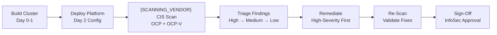

**Positive:** Scan-then-remediate is safer than auto-remediation for regulated production environments

**Trade-off:**

- Remediation cycle adds time before production readiness
- some items may require exceptions

### Audit Logging Policy

**Problem:** API audit logging profile must balance compliance coverage against resource consumption and storage cost. PCI/InfoSec compliance requires API-level audit logging.

**Decision:**

- Parked — SRE already ships all logs to {SIEM_PLATFORM} via CLF (ADR 26); Architecture lead has filter details
- `WriteRequestBodies` profile provides best balance of compliance coverage and resource efficiency
- Final profile {DESCHEDULER_FINAL_PROFILE} based on PCI/InfoSec compliance requirements
- Available profiles: `Default`, `WriteRequestBodies`, `AllRequestBodies`, and `None`, per the [OCP audit log policy documentation](https://docs.redhat.com/en/documentation/openshift_container_platform/4.21/html/security_and_compliance/audit-log-policy-config)

**Positive:** `WriteRequestBodies` captures mutations for compliance without excessive volume

**Trade-off:**

- Higher audit profiles increase log volume and storage costs
- final decision pending InfoSec

---

## VM Runtime & Scheduling Configuration

**Problem:** Before VMs can be managed effectively, the platform must define how VMs are scheduled, how they behave during node maintenance, what hot-plug capabilities are available, and how memory/CPU resources are allocated. These are cluster-level platform configurations that affect every VM. The [OCP-V Architecture Guide](https://access.redhat.com/articles/7119411) and [OCP-V Example Architectures](https://access.redhat.com/articles/7067871) provide prescriptive guidance on these settings.

**Applies to:** [DC] [{TIER_MIDDLE}] [EDGE]

### VM Runtime Configuration Decision Tree

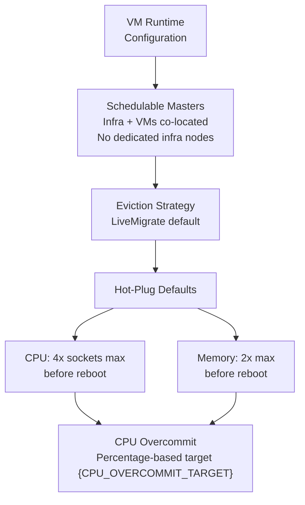

### Control Plane Node Placement

**Decision:**

- Schedulable masters run infra services and end-user VMs — no dedicated infra nodes
- Control plane distributed across separate chassis/racks for etcd quorum protection
- Noisy-neighbor labels protect etcd from resource-intensive VMs
- Infra services (ingress, monitoring, logging) have low overhead relative to node capacity

**Positive:**

- Maximizes schedulable capacity
- no dedicated infra node cost

**Trade-off:**

- etcd co-located with VM workloads
- requires noisy-neighbor labels and capacity monitoring

### VM Eviction Strategy

**Problem:** During node drains (maintenance, upgrades), VMs must either live-migrate or be stopped. The eviction strategy determines whether drains block on migration failures or proceed regardless.

**Decision:** `LiveMigrate` default for all VMs. VMs expected to survive upgrades/maintenance transparently. If migration fails, draining nodes is blocked which is the desired behavior as it surfaces capacity problems rather than masking them. Per-VM override is available via the `evictionStrategy` field on the VirtualMachine spec, as described in the [OCP-V live migration documentation](https://docs.redhat.com/en/documentation/openshift_container_platform/4.21/html/virtualization/live-migration#virt-configuring-vm-eviction-strategy).

**Positive:**

- Zero-downtime for VMs during maintenance
- mirrors VMware HA expectations

**Trade-off:**

- Blocked drains surface capacity problems that must be resolved
- requires sufficient headroom

**Alternatives rejected:**

- **`LiveMigrateIfPossible`**:
  - Silently shuts down VMs if migration fails
  - unacceptable for production
- **`None` (no eviction)**:
  - VMs killed on drain
  - no protection during maintenance

### VM Hot-Plug Configuration

**Problem:** Hot-add CPU/memory ratios determine how much can be scaled without reboot. VMware operational model expects hot-add capability.

**Decision:** Accept defaults: 4x CPU sockets, 2x memory before reboot required. These ratios are sufficient for the vast majority of {CLIENT} workloads. Reboot required beyond these ratios which is operationally acceptable since scaling beyond 4x/2x requires approval gate (carries over from VMware).

**Positive:**

- Flexible scaling within defaults
- no custom configuration needed per VM

**Trade-off:** Reboot required for extreme scaling beyond 4x CPU / 2x memory

### Descheduler and VM Rebalancing

**Problem:** After node drains, upgrades, or uneven scheduling, VM distribution across nodes can become imbalanced. Without automated rebalancing, some nodes become hotspots while others sit underutilized — undermining the spare node headroom policy (ADR 39).

**Decision:** ADR 40 is open. Two OCP-V-supported descheduler profiles are available per the [OpenShift Virtualization descheduler documentation](https://docs.openshift.org/latest/virt/managing_vms/advanced_vm_management/virt-enabling-descheduler-evictions.html):

- **`LongLifecycle`** — simpler profile with no prerequisites. Enables `RemovePodsHavingTooManyRestarts` (threshold: 100 container restarts) and `LowNodeUtilization` (underutilized < 20%, overutilized > 50%). No PSI metrics required.
- **`KubeVirtRelieveAndMigrate`** — enhanced superset of `LongLifecycle`. Adds background evictions, cost-aware eviction, spare capacity balancing, and load-aware descheduling via Prometheus CPU metrics and PSI (Pressure Stall Information). Requires `psi=1` kernel arg via MachineConfig on all worker nodes (see Phase 1 Day-0 MachineConfig Considerations). The spare capacity balancing directly supports the 1-2 spare node headroom policy.

Both profiles trigger **live migration** (not shutdown) for VM workloads, consistent with the `LiveMigrate` eviction strategy (ADR 37). The profiles are mutually exclusive — only one can be active.

**OCP 4.21 status:** The base `KubeVirtRelieveAndMigrate` profile is available in OCP 4.21 (GA March 2026). The `dev*`-prefixed customization fields (`devDeviationThresholds`, `devActualUtilizationProfile`, `devEnableSoftTainter`) indicate those advanced tuning options are still in developer preview. However the base profile with default thresholds is production-supported. PSI itself is [newly officially supported in OCP 4.21](https://developers.redhat.com/articles/2026/03/18/prepare-enable-linux-pressure-stall-information-red-hat-openshift), but remains disabled by default and requires Day-0 MachineConfig (see Phase 1). **Note:** Enabling PSI increases Prometheus pod RSS by ~1.3 GB per pod; plan monitoring capacity accordingly.

**Positive:**

- Automated rebalancing prevents hotspots
- aligns with spare node headroom policy
- base profile and PSI both GA on OCP 4.21

**Trade-off:**

- PSI MachineConfig required (Day 0)
- ~1.3 GB Prometheus memory increase per pod
- `dev*` customization fields in dev preview

---

## Observability Stack Architecture

**Problem:** {CLIENT} needs metrics, logs, and alerts across all clusters covering infrastructure and VMs, replacing Aria/vROPs and {HW_MONITORING_VENDOR} monitoring.

**Decision:**

- [ACM Multicluster Observability](https://docs.redhat.com/en/documentation/red_hat_advanced_cluster_management_for_kubernetes/2.12/html/observability/) (Prometheus/Thanos) feeds {OBJECT_STORAGE} for long-term storage
- OCP-V Grafana dashboards (migrating to Perses) for VM metrics
- AlertManager → {NOC_PLATFORM} for NOC
- Vector + CLF forwards logs to {SIEM_PLATFORM} via HEC, configured per the [OCP log forwarding guide](https://docs.redhat.com/en/documentation/red_hat_openshift_logging/6.3/html/configuring_logging/configuring-log-forwarding)
- Loki for 3-day local retention backed by {OBJECT_STORAGE}
- {APM_VENDOR} under evaluation as unified long-term store
- {HW_MONITORING_VENDOR} continues for {SERVER_HARDWARE}/{BLOCK_STORAGE_VENDOR} hardware monitoring

**Applies to:** [DC] [{TIER_MIDDLE}] [EDGE]

### Observability Stack

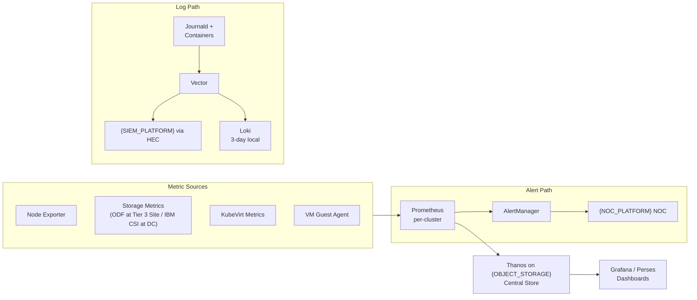

**Positive:**

- Unified cross-cluster view
- Thanos provides long-term retention on {OBJECT_STORAGE}

**Trade-off:** Multiple tools ({APM_VENDOR}, {HW_MONITORING_VENDOR}, {NOC_PLATFORM}, Grafana/Perses) — {APM_VENDOR} could consolidate if onboarded

### Logging Strategy

**Problem:** Log shipping strategy must define local retention, forwarding destination, and volume management. Multiple consumers (SRE, security, compliance) need access to different log types.

**Decision:**

- Vector + ClusterLogForwarder → {SIEM_PLATFORM} 
- Loki for local retention (3 days) backed by {OBJECT_STORAGE}
- Estimated log volume: ~360 MB/hr/node (high-side); actual volume expected well below estimate
- {SIEM_PLATFORM} HEC maintained by {CLIENT} {SIEM_PLATFORM} team
- Vector is the recommended collector per the [OCP logging documentation](https://docs.redhat.com/en/documentation/red_hat_openshift_logging/6.3/html/configuring_logging/configuring-log-forwarding) — Fluentd is deprecated

**Positive:**

- OpenShift-native Vector/CLF avoids deploying separate {SIEM_PLATFORM} agent
- Loki provides local search

**Trade-off:**

- Dual destinations ({SIEM_PLATFORM} + Loki) increase storage
- {SIEM_PLATFORM} is an external dependency

### Backup Traffic Monitoring

Once {BACKUP_VENDOR} is deployed, backup traffic monitoring should be included in the Prometheus/Grafana dashboard set. Dashboards should track {BACKUP_VENDOR} agent pod network utilization during backup windows to detect contention. Alerting thresholds should be defined for backup-related network saturation on the backup vNIC.

### Metric Retention

**Problem:** In-cluster metrics retention must balance local query performance against storage cost. Long-term retention needed for capacity planning and trend analysis. Operations requires minimum 30 days.

**Decision:**

- Local Prometheus retention set to 7 days (SRE standard), configured per the [OCP monitoring guide](https://docs.redhat.com/en/documentation/openshift_container_platform/4.21/html/monitoring/)
- Loki logs: 3 days local, {SIEM_PLATFORM} long-term
- ACM Thanos: central longer-term retention (duration {THANOS_RETENTION_TARGET} — operations needs minimum 30 days)
- {APM_VENDOR} under evaluation as long-term store
- Tiered retention balances cluster resource consumption against operations historical data needs

**Positive:**

- Tiered retention minimizes per-cluster storage
- Thanos provides cross-cluster long-term view

**Trade-off:**

- 7-day local window may be insufficient for debugging
- Thanos {OBJECT_STORAGE} storage is an added dependency

---

## Phase 2 Dependency Overlay

What must be healthy for Phase 2 capabilities to function:

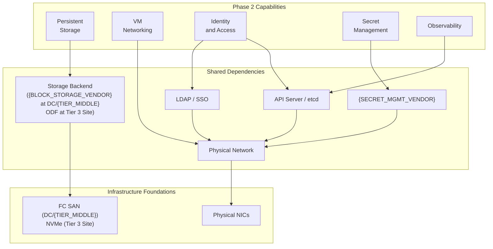

| Shared Dependency | Blast Radius                                                           |
| ----------------- | ---------------------------------------------------------------------- |
| Storage Backend   | All VMs lose persistent storage ({BLOCK_STORAGE_VENDOR} at DC/{TIER_MIDDLE}; ODF at Tier 3 Site) |
| Physical Network  | All networking lost                                                    |
| API Server / etcd | Platform unmanageable                                                  |
| {SECRET_MGMT_VENDOR}          | No new secrets; existing secrets remain                                |

---

## Phase 2 RACI

| Activity                            | Platform | Network | Storage | Security | Infra |
| ----------------------------------- | -------- | ------- | ------- | -------- | ----- |
| Storage backend deployment          | C        | -       | R/A     | -        | I     |
| NMState policies and NAD creation   | C        | R/A     | -       | -        | -     |
| OAuth/LDAP integration              | C        | -       | -       | R/A      | -     |
| RBAC role definition                | R        | -       | -       | R/A      | -     |
| ESO / {SECRET_MGMT_VENDOR} configuration       | C        | -       | -       | R/A      | -     |
| etcd encryption enablement          | R        | -       | -       | A        | -     |
| CIS benchmark scan and remediation  | R        | C       | C       | A        | C     |
| Observability stack deployment      | R/A      | -       | C       | -        | -     |

**Legend:** R = Responsible, A = Accountable, C = Consulted, I = Informed
