# PHASE 3 — FLEET OPERATIONS

*Clusters are running and configured. These decisions define how they are managed, updated, and kept healthy at scale.*

## Phase 3 Flow — Single Cluster to Managed Fleet

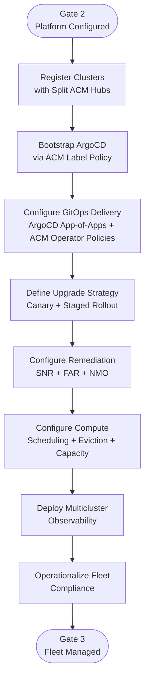

### Phase 3 Gate Criteria

- [ ] All clusters visible in respective ACM hub with `Compliant` status
- [ ] ArgoCD app-of-apps syncing from Git repo; ACM operator policies enforcing operator versions fleet-wide
- [ ] ArgoCD Agent deployed on all spoke clusters; hub Argo instance shows fleet-wide sync status
- [ ] Canary cluster identified and upgrade path tested
- [ ] SNR/FAR operators deployed; {HW_MGMT_PLATFORM} IPMI-over-LAN confirmed
- [ ] NMO deployed on all OCP-V clusters; {ITSM_PLATFORM} integration via AAP functional
- [ ] VM eviction set to `LiveMigrate`; capacity headroom verified (1+ spare node per cluster)
- [ ] ACM Thanos aggregating metrics from all managed clusters; Grafana/Perses dashboards operational
- [ ] Vector → {SIEM_PLATFORM} log forwarding active across fleet; AlertManager → {NOC_PLATFORM} routing confirmed
- [ ] {SCANNING_VENDOR} CIS scans running across fleet; ACM compliance policies reporting status per cluster
- [ ] ArgoCD + ACM hybrid delivery model documented and enforced; AAP retained as fallback only

---

## Fleet Management Topology

**Problem:** {CLUSTER_COUNT} clusters across 3 tiers need consistent configuration and policy enforcement. Organizational alignment requires separation between DC, {TIER_MIDDLE} and tier 3 site management. The [RHACM cluster lifecycle documentation](https://docs.redhat.com/en/documentation/red_hat_advanced_cluster_management_for_kubernetes/2.13/html/clusters/cluster_mce_overview) describes the hub-spoke model that underpins fleet management at this scale.

**Decision:**

- Split ACM hubs — separate instances for DC, {TIER_MIDDLE}, tier 3 sites, and sandbox/lab
- No global hub
- No active/passive DR (ACM outage does not affect running workloads)
- {APM_VENDOR} or external tool provides unified observability across hubs
- Reusing non-routable CIDRs (PodSubnet `{POD_CIDR}`, ServicesSubnet `{SVC_CIDR}`) across all clusters simplifies fleet-wide networking

**Applies to:** [DC] [{TIER_MIDDLE}] [TIER3]

### Fleet Management — Sandbox & Tier 3 Site Tier

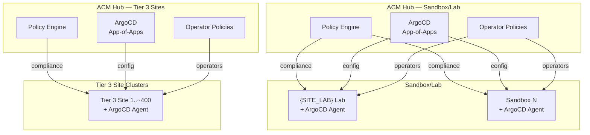

### Fleet Management — DC/{TIER_MIDDLE} Tier

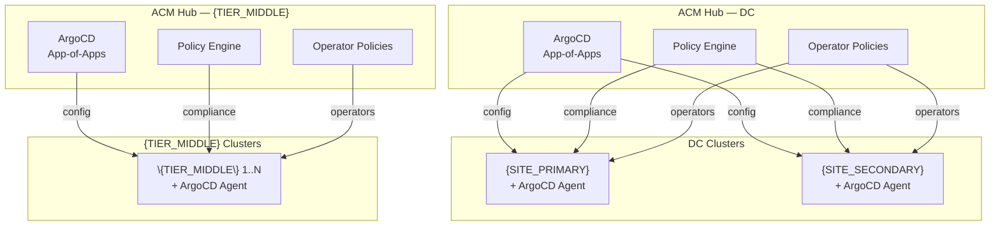

### Klusterlet and ArgoCD Agent Configuration

Each managed cluster runs two lightweight agents:

1. **Klusterlet** — communicates with its ACM hub over mTLS. The [RHACM governance framework](https://docs.redhat.com/en/documentation/red_hat_advanced_cluster_management_for_kubernetes/2.13/html/governance/) pushes operator policies and governance policies to klusterlets and collects compliance status.
2. **ArgoCD Agent** — lightweight agent that syncs configuration from the hub's ArgoCD instance without requiring a full ArgoCD deployment on each spoke. Provides centralized sync status and observability at the hub.

Key configuration:

- **Registration**: Clusters register to their tier-appropriate hub (DC hub, {TIER_MIDDLE} hub, tier 3 site hub, or sandbox hub)
- **Bootstrap**: ACM label-triggered policy deploys the ArgoCD operator and agent configuration on newly provisioned spokes
- **Policy pull interval**: Default — klusterlet watches for policy changes via the hub API
- **Compliance reporting**: Each klusterlet reports `Compliant` / `NonCompliant` status per policy back to the hub console
- **Placement rules**: ACM Placement API targets operator and governance policies to cluster groups using label selectors (e.g., `tier=dc`, `tier=tier 3 site`)
- **ArgoCD sync**: ArgoCD Agent pulls config from the hub's Argo instance; `groups/` directory in the Git repo determines which configuration applies to each cluster tier

**Positive:**

- Organizational alignment (different teams)
- operational isolation (blast radius)

**Trade-off:** No single pane of glass across all clusters without {APM_VENDOR} or equivalent

**Alternatives rejected:**

- **Single ACM hub**:
  - Blast radius too large for {CLUSTER_COUNT} clusters
  - organizational mismatch
- **Per-cluster manual management**:
  - Does not scale
  - drift guaranteed
- **Ansible Tower only**:
  - Imperative, not declarative
  - no Kubernetes reconciliation loop

---

## GitOps Repository & Delivery Strategy (ArgoCD + ACM Hybrid)

**Problem:** Platform configuration needs a source of truth supporting tier-specific variance across {CLUSTER_COUNT} clusters, with PR-based change review, controlled rollout, and automated drift correction. The existing SRE team has a working ArgoCD codebase using the [Red Hat COP GitOps template](https://github.com/redhat-cop/gitops-template) with Kustomize overlays, but managing operator lifecycle at scale via pure GitOps is operationally painful (install plan approvals, channel pinning, version gating). ACM Operator Policies solve this specific gap.

**Decision:**

- **ArgoCD** delivers Day 2 cluster configuration via the Red Hat COP GitOps template (app-of-apps pattern, Kustomize overlays)
- **ACM Operator Policies** manage operator lifecycle — version pinning, channel control, and install plan approval gating
- **ACM governance and security policies** enforce compliance baselines fleet-wide
- ArgoCD Agent (lightweight) on spoke clusters; full ArgoCD instance on hub clusters only
- **Multi-repo structure:** {CLIENT} will **not** use a single monorepo. Minimum repo split: **sandbox**, **lab**, **production**. Tier 3 Sites are likely in a separate repo from DC/{TIER_MIDDLE} production due to different team ownership. Each repo internally follows the Red Hat COP GitOps template with `components/`, `clusters/`, `groups/` directories.
- `groups/` directory within each repo provides rollout targeting scoped to that repo's tier (e.g., staging subset → full production within the production repo; individual tier 3 site rollout waves within the tier 3 site repo)
- **Cross-repo drift management:** Dependabot-style automated PR process — when a change merges in one repo (e.g., non-prod), an automated process opens corresponding PRs against the other repos (e.g., production DC, production tier 3 site). Human review merges or closes each PR with documented rationale, providing an audit trail.
- **PR rigor:** Fork-and-PR model for production repos — no direct commits to the primary production repo. Pre-merge checks (linting, validation) to be expanded over time. Sandbox repo is exempt from PR oversight.
- **Lab designation:** Lab is "prod light" — separate repo from production, may have lighter PR review gates, but still subject to change management.
- **Exact repo boundaries {REPO_BOUNDARY_DECISION}** — parked for sandbox experimentation. Team needs hands-on experience before committing to a final split.

**Applies to:** [DC] [{TIER_MIDDLE}] [TIER3]

### GitOps Repo Structure

> **Note:** The diagram below still reflects the prior monorepo design and will be updated in a future pass once repo boundaries are finalized. The text above represents the current direction.

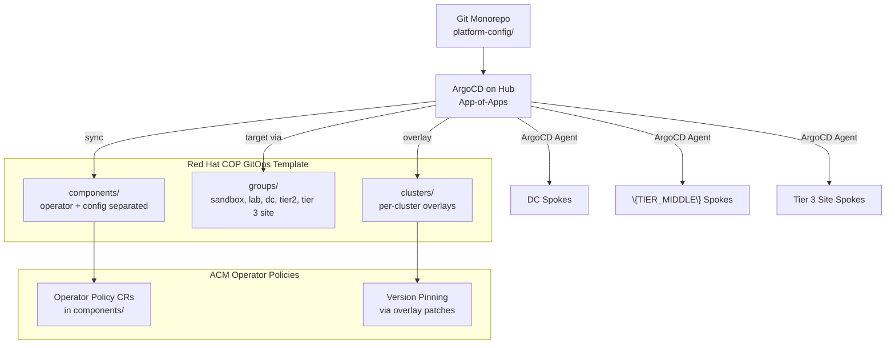

### Spoke Cluster Bootstrap Flow

> **Note:** The bootstrap sequence below references a single repo. Under the multi-repo direction, the app-of-apps pointing and ArgoCD configuration will vary per repo/tier. Full update deferred until repo boundaries are finalized.

When ACM provisions a new spoke cluster, the following bootstrap sequence connects it to the GitOps delivery pipeline:

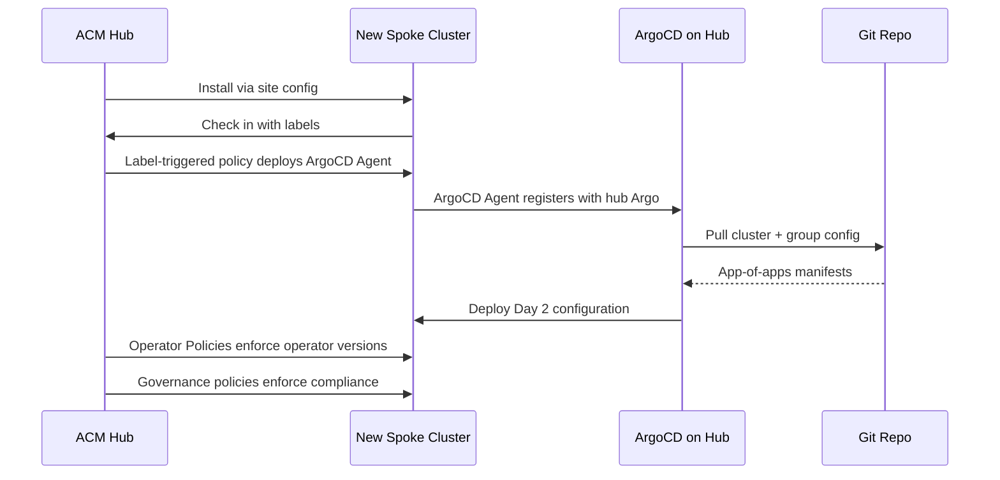

### ACM Operator Policy Model

ACM Operator Policies solve a specific gap: managing OLM operator lifecycle at fleet scale without manual install plan approvals or the risks of fully automatic mode.

**How it works:**

1. Each operator has a component in `components/` with an `OperatorPolicy` CR that sets `upgradeApproval: Automatic` and a `versions` list
2. Per-cluster or per-group overlays patch the `versions` list to include only approved versions
3. When a new operator version appears that is NOT in the approved list, the policy engine flips the install plan to `Manual` — blocking the upgrade
4. When the team adds the new version string to the overlay and merges the PR, the policy engine sees the version is now approved, flips to `Automatic`, and the upgrade proceeds
5. After the upgrade completes, if a newer unapproved version appears, the engine returns to `Manual`

This provides PR-gated, per-cluster operator version control without manual OLM interaction.

**Positive:**

- Git remains the source of truth for all configuration and operator versions
- Existing SRE ArgoCD codebase reused — no format migration required
- ACM Operator Policies fill the operator lifecycle gap that ArgoCD/Kustomize cannot handle cleanly
- PR-based review for all changes including operator upgrades
- ArgoCD Agent on spokes provides centralized observability without per-cluster Argo overhead

**Trade-off:**

- Two tools to understand (ArgoCD for config, ACM for operators/compliance)
- Multi-repo requires cross-repo drift management (Dependabot-style automated PRs)
- Repo boundaries not finalized — requires sandbox experimentation before committing
- Semantic versioning for repo releases still under evaluation

**Alternatives rejected:**

- **Single monorepo**: Multi-team ownership and blast radius concerns led to rejection. A single repo merging sandbox, lab, DC, {TIER_MIDDLE}, and tier 3 site changes creates a wide blast radius and complicates access control.
- **ACM-only (no ArgoCD)**:
  - Would require migrating existing SRE codebase to ACM policy format
  - ACM governance API can be overloaded at large scale when used for all config delivery
  - Team already proficient with ArgoCD/Kustomize patterns
- **Repo-per-cluster**:
  - Repository explosion at {CLUSTER_COUNT} clusters
  - No DRY enforcement; drift between repos difficult to detect
- **ArgoCD-only (no ACM policies)**:
  - Operator lifecycle management remains painful at scale (manual install plan approvals or automatic mode risks)
  - No fleet-wide compliance enforcement

### Day 2 Tooling Boundary

**Problem:** Deployment tooling must be clearly scoped to avoid duplication or gaps. The hybrid model assigns distinct responsibilities to each tool.

**Decision:**

| Tool                           | Scope                                                             | Examples                                                                                       |
| ------------------------------ | ----------------------------------------------------------------- | ---------------------------------------------------------------------------------------------- |
| **ArgoCD (config delivery)**   | All cluster configuration via app-of-apps and Kustomize overlays  | NMState policies, NADs, HCO configuration, RBAC manifests, MachineConfigs, monitoring stack     |
| **ACM Operator Policies**      | Operator lifecycle: version pinning, channel control, upgrade gating | OCP-V operator, ODF, Loki, NMO, ACM itself — all managed via OperatorPolicy CRs               |
| **ACM Governance Policies**    | Compliance enforcement and fleet-wide security baselines          | CIS benchmark checks, etcd encryption verification, audit logging, kubeadmin removal           |
| **AAP (fallback)**             | Infrastructure automation and external system integration         | Hardware provisioning, {ITSM_PLATFORM} ticketing, post-migration remediation playbooks          |

**Positive:**

- Each tool handles what it does best — no overlap or gap
- Existing SRE ArgoCD skills transfer directly
- ACM Operator Policies eliminate the most painful GitOps gap (operator lifecycle)

**Trade-off:**

- Teams must understand the boundary between ArgoCD and ACM responsibilities
- Bootstrap policy on hub must be maintained to deploy ArgoCD Agent on new spokes

### Secret Sync via ArgoCD + ESO

**Problem:** Secrets for managed clusters (pull secrets, TLS certs, {SECRET_MGMT_VENDOR} connectors) must flow into the delivery pipeline without exposing plaintext in Git.

**Decision:**

- {SECRET_MGMT_VENDOR} is the target vault
- External Secrets Operator (ESO) is the recommended connector, syncing {SECRET_MGMT_VENDOR}-stored secrets into Kubernetes `Secret` objects
- Manual pre-population is the interim approach
- ArgoCD deploys `ExternalSecret` CRs via the `components/` directory; ESO resolves them at runtime on each cluster
- A pivot date is time-boxed for {SECRET_MGMT_VENDOR} integration — if blocked, sealed secrets or an alternative vault connector will be evaluated

**Positive:**

- No plaintext secrets in Git
- ESO is vendor-agnostic with broad community support

**Trade-off:**

- {SECRET_MGMT_VENDOR} integration may be blocked or delayed
- Interim manual process does not scale
- Deployment-time secret interpolation (secrets referenced in source control that need vault resolution during delivery) remains an open gap
- Secret count unvalidated — the total number of secrets requiring ESO synchronization across {CLUSTER_COUNT} clusters has not been inventoried yet

---

## Upgrade Rollout Strategy

**Problem:** OCP-V upgrades require VM live migration during node drains — significantly more complex than container-only platform upgrades. {CLIENT} has moratorium windows that constrain timing. The [OCP cluster update documentation](https://docs.redhat.com/en/documentation/openshift_container_platform/4.21/html/updating_clusters/) describes the Cluster Version Operator (CVO) and MachineConfigPool mechanics that govern the rollout process.

**Decision:**

- Tiered rollout: sandbox → lab/pre-prod (same week) → prod (1-2 week bake)
- Tier 3 Sites: mock in lab → pilot → main per DC
- MachineConfigPool `maxUnavailable` controls reboot concurrency
- VMs live-migrate off draining nodes
- Operator compatibility validated before each major upgrade
- Each minor version of OpenShift Virtualization must run on the corresponding OCP version, per the [OCP-V update chapter](https://docs.redhat.com/en/documentation/openshift_container_platform/4.21/html/virtualization/updating)

**Applies to:** [DC] [{TIER_MIDDLE}] [TIER3]

### Upgrade State Machine

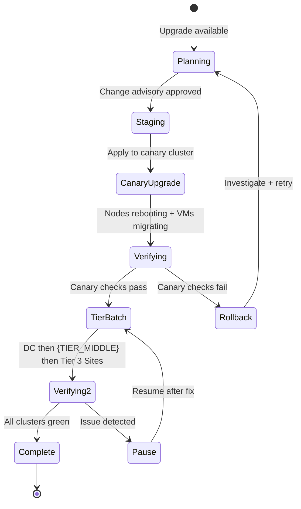

**Positive:**

- Controlled blast radius
- 1-2 week bake matches {CLIENT} VMware patching cadence

**Trade-off:**

- Slower fleet completion
- moratoriums constrain windows

**Alternatives rejected:**

- **Big-bang fleet upgrade**:
  - No rollback path
  - full fleet at risk
- **Per-cluster manual upgrade**:
  - No consistency
  - does not scale to {CLUSTER_COUNT} clusters

### maxUnavailable Strategy

**Problem:** The default `maxUnavailable: 1` for MachineConfigPools is implicit and may be too conservative for large clusters or too aggressive for small ones. The [machine configuration documentation](https://docs.redhat.com/en/documentation/openshift_container_platform/4.21/html/machine_configuration/) describes how the MCO applies updates and reboots nodes within pool concurrency limits.

**Decision:** Set `maxUnavailable` explicitly per cluster size:

| Cluster Size   | maxUnavailable | Rationale                                                       |
| -------------- | -------------- | --------------------------------------------------------------- |
| 3-node compact | 1              | Minimum viable — cannot lose quorum                             |
| 4-15 nodes     | 1              | Conservative; single drain validates live migration per node    |
| 16+ nodes      | 2-4            | Parallel drains reduce fleet upgrade time; validated in sandbox |

Headroom: maintain at least 1 spare node (2-3 preferred) so that `LiveMigrate` eviction can place VMs during drain. Explicit settings remove ambiguity; values tuned after sandbox validation.

### Maintenance Windows & Moratoriums

**Problem:** Upgrade windows must respect {CLIENT} organizational change management and business-critical periods.

**Decision:**

- Moratorium windows: {MORATORIUM_SCHEDULE}
- All maintenance coordinated through {ITSM_PLATFORM} change advisory process
- Tier 3 Site rollout: mock upgrade in lab → pilot tier 3 site cluster → main rollout per DC region
- HCR `workloadUpdateStrategy` not finalized — deferred to sandbox benchmarking

| Window / Constraint        | Detail                                                      |
| -------------------------- | ----------------------------------------------------------- |
| **Moratoriums**            | {MORATORIUM_SCHEDULE}                                       |
| **Sandbox → Prod bake**    | {BAKE_PERIOD} between canary pass and production rollout    |
| **Tier 3 Site rollout**         | Lab mock → pilot tier 3 site → main per DC region                |
| **Operator compatibility** | Validated before each major upgrade (OLM channel alignment) |

---

## Node Remediation & Recovery Model

**Problem:** Nodes fail. The platform must detect unhealthy nodes, fence them, and recover workloads automatically — VMware HA-equivalent recovery expected by operations. The [Workload Availability remediation guide](https://docs.redhat.com/en/documentation/workload_availability_for_red_hat_openshift/4.21-0/html/remediation_fencing_and_maintenance/about-remediation-fencing-maintenance) describes the SNR, FAR, and NMO operators that provide this layered recovery model.

**Decision:**

- FAR is the primary target (Redfish via {HW_MGMT_PLATFORM} IPMI-over-LAN policies on {SERVER_HARDWARE}); SNR as software-level fallback
- Fully automatic vs operator-in-the-loop not finalized
- Layered approach: NodeHealthCheck controller detects failure → triggers SNR or FAR remediation CR → VMs rescheduled on healthy nodes

**Applies to:** [DC] [{TIER_MIDDLE}] [TIER3]

### Node Remediation Flow

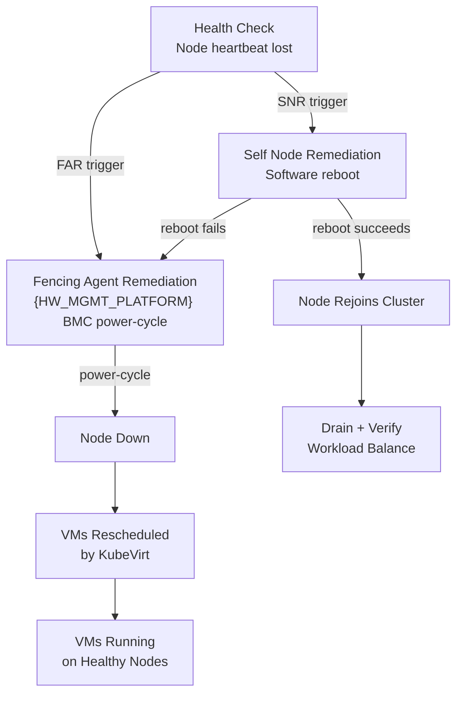

### Self Node Remediation

As documented in the [SNR operator guide](https://docs.redhat.com/en/documentation/workload_availability_for_red_hat_openshift/4.21-0/html/remediation_fencing_and_maintenance/self-node-remediation-operator-remediate-nodes), SNR automatically reboots unhealthy nodes using the best available watchdog mechanism. The operator determines its strategy based on device availability: hardware watchdog (preferred), softdog, or software reboot as a last resort. SNR handles transient failures where a reboot restores node health without requiring BMC access.

### Fence Agents Remediation

For nodes that are truly hung (SNR reboot fails or node is unresponsive to software reboot), the [FAR operator](https://docs.redhat.com/en/documentation/workload_availability_for_red_hat_openshift/4.21-0/html/remediation_fencing_and_maintenance/fence-agents-remediation-operator-remediate-nodes) performs hardware-level fencing via Redfish BMC power-cycle. {CLIENT} uses {SERVER_HARDWARE} with {HW_MGMT_PLATFORM} IPMI-over-LAN policies — these policies are currently being configured in the sandbox environment. FAR supports two fencing actions: **reboot** (node rejoins after power-cycle) and **off** (permanent shutdown requiring manual restart).

### Hardware Watchdog Integration

**Problem:** Watchdog device availability determines the reliability tier of automated remediation.

**Decision:**

- {SERVER_HARDWARE} hardware watchdog devices are the preferred mechanism for SNR
- {HW_MGMT_PLATFORM} server profiles must include IPMI-over-LAN policies to expose the BMC endpoint for FAR
- Configuration validated in sandbox before production rollout

| Remediation Layer | Mechanism                     | Scope                         |
| ----------------- | ----------------------------- | ----------------------------- |
| L1 — Software     | SNR (watchdog/softdog/reboot) | All nodes                     |
| L2 — Hardware     | FAR (Redfish power-cycle)     | Nodes with BMC/{HW_MGMT_PLATFORM}     |
| L3 — Automation   | EDA/Ansible liveness probes   | External health check overlay |

**Positive:**

- Automated recovery
- critical for OCP-V where stuck nodes hold VMs hostage

**Trade-off:**

- FAR requires reliable BMC/Redfish
- {HW_MGMT_PLATFORM} IPMI-over-LAN policies in sandbox

**Alternatives rejected:**

- **Manual remediation only**: Too slow for production SLAs
- **Machine Health Check only (no FAR)**: Cannot fence truly hung nodes

### Node Maintenance Operator

**Problem:** Standardized node drain/cordon procedures are needed with integration to change management workflows. The [NMO documentation](https://docs.redhat.com/en/documentation/workload_availability_for_red_hat_openshift/4.21-0/html/remediation_fencing_and_maintenance/node-maintenance-operator) describes the declarative maintenance mode model.

**Decision:**

- NMO deployed on all OCP-V clusters (tested in POC, operations preferred)
- Creating a `NodeMaintenance` CR cordons the node and evicts all pods; deleting the CR returns the node to schedulable state
- NMO is no longer bundled with OpenShift Virtualization (since OCP 4.11) and must be installed from OperatorHub
- {ITSM_PLATFORM} integration via AAP — maintenance requests create {ITSM_PLATFORM} tickets automatically
- Event-Driven Ansible (EDA) may provide automated ticket status updates as nodes transition through maintenance states

**Positive:**

- Declarative, GitOps-friendly maintenance
- POC familiarity reduces team training

**Trade-off:**

- Requires OperatorHub install
- AAP/{ITSM_PLATFORM} integration adds deployment complexity

---

## Fleet Compute Configuration

**Problem:** Phase 2 configures VM scheduling, eviction, and capacity settings per cluster. Phase 3 must enforce these settings fleet-wide via ArgoCD configuration delivery and ACM governance policies to prevent drift across {CLUSTER_COUNT} clusters, and verify that headroom and eviction behavior meet operational requirements before migration waves begin.

**Decision:**

- ArgoCD delivers compute configuration via the `components/` and `groups/` directories; ACM governance policies verify compliance across all managed clusters:
  - VM eviction strategy set to `LiveMigrate` (ADR 37) — drain blocks if migration fails, surfacing capacity problems
  - Capacity headroom verified: minimum 1 spare node (2-3 preferred) per cluster for DC/{TIER_MIDDLE}
  - `maxUnavailable` set explicitly per cluster size band (ADR 45): 1 for compact/small, 2-4 for 16+ node clusters
  - No memory overcommit (ADR 38)
- Descheduler profile (`KubeVirtRelieveAndMigrate` or alternative per ADR 40) deployed fleet-wide after sandbox validation; PSI kernel argument confirmed enabled on all workers
- Capacity dashboards (Grafana/Perses via ACM Thanos) provide fleet-level visibility into utilization, headroom, and scheduling health
- Non-compliant clusters reported via ACM hub console for remediation before production migration waves

**Applies to:** [DC] [{TIER_MIDDLE}] [TIER3]

**Positive:**

- Fleet-wide enforcement prevents per-cluster drift
- Capacity alerts fire before migration failures during drains

**Trade-off:**

- Descheduler tuning requires sandbox validation to avoid migration churn
- Conservative capacity targets increase hardware cost

---

## Multicluster Observability

**Problem:** With {CLUSTER_COUNT} clusters across split ACM hubs, a unified view of fleet health, VM metrics, and alerting is essential. {CLIENT} must replace Aria/vROPs and supplement {HW_MONITORING_VENDOR} monitoring with an OpenShift-native observability stack. The [RHACM observability documentation](https://docs.redhat.com/en/documentation/red_hat_advanced_cluster_management_for_kubernetes/2.13/html/observability/) describes the Prometheus/Thanos multicluster architecture that aggregates metrics from all managed clusters.

**Decision:** Tiered observability stack with multiple tools serving complementary roles:

| Tool                        | Role                                                         | Retention                          |
| --------------------------- | ------------------------------------------------------------ | ---------------------------------- |
| **Local Prometheus**        | Per-cluster metric collection                                | 7 days (SRE standard)              |
| **ACM Thanos**              | Central long-term metrics across each hub                    | Duration {THANOS_RETENTION_DECISION} (target 6 months)     |
| **{OBJECT_STORAGE}**                    | S3-compatible backend for Thanos long-term storage at DC/{TIER_MIDDLE} | Per hub capacity                   |
| **Loki**                    | Local log search                                             | 3 days local; {SIEM_PLATFORM} for long-term |
| **Vector + CLF**            | Log shipping to {SIEM_PLATFORM} (HEC)                                 | Streaming                          |
| **AlertManager → {NOC_PLATFORM}** | Alert routing to NOC                                         | Real-time                          |
| **Grafana / Perses**        | OCP-V VM dashboards (Grafana migrating to Perses)            | Dashboard layer                    |
| **{APM_VENDOR}**               | Confirmed as {NOC_PLATFORM} replacement; enterprise direction for unified observability across split hubs | Enterprise rollout underway        |
| **{HW_MONITORING_VENDOR}**                 | {SERVER_HARDWARE}/{BLOCK_STORAGE_VENDOR} hardware monitoring (beta OCP-V support)     | Existing tooling                   |

Operations requires a minimum 30-day metric retention window. {APM_VENDOR} is confirmed as the enterprise direction for unified observability and {NOC_PLATFORM} replacement. Until {APM_VENDOR} is fully onboarded, built-in OCP monitoring (Prometheus, Grafana/Perses, ACM observability) serves as the interim stack — limited to OS teams; all other teams wait for the unified tool.

**Applies to:** [DC] [{TIER_MIDDLE}] [TIER3]

### Multicluster Observability Flow

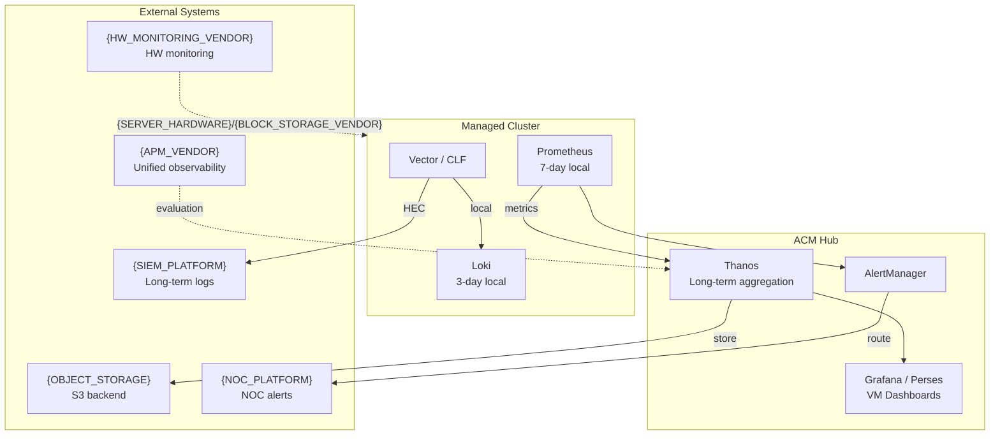

**Positive:** Multiple tools cover all dimensions — metrics, logs, alerts, hardware, VM dashboards

**Trade-off:**

- No single pane of glass without {APM_VENDOR}
- multiple tools increase operational complexity

**Alternatives rejected:**

- **Prometheus-only**:
  - No long-term retention
  - no fleet aggregation
- **{APM_VENDOR}-only**:
  - Timeline uncertain
  - not yet evaluated for full OCP-V coverage
- **Single ACM hub for obs**: Contradicts split-hub decision (ADR 5)

---

## Operations Model and ITSM Integration

**Problem:** Phase 3 introduces the tools and workflows required to operate the fleet, but the ownership model is spread across observability, maintenance, upgrades, and RACI tables. A concise operating model is needed so stakeholders can see how alerts, logs, maintenance actions, and ticket-driven changes flow across teams.

**Decision:** The fleet is operated through a shared model across Platform, Network, Storage, Security, Infrastructure, Backup, and Application Owner teams. Existing enterprise control points remain in place, with ACM, AlertManager, and `NodeMaintenance` providing the OpenShift-native execution path.

**Applies to:** [DC] [{TIER_MIDDLE}] [TIER3]

### Service Model

| Function | Primary Team | Supporting Teams | Notes |
| -------- | ------------ | ---------------- | ----- |
| Fleet management and ACM policy delivery | Platform | Security, Network, Storage | Platform owns hub registration, policy rollout, and fleet-state visibility |
| Identity, RBAC, and secrets | Security | Platform | LDAP-backed OAuth, breakglass account control, and {SECRET_MGMT_VENDOR} alignment |
| Network changes | Network | Platform, Infra | VLAN presentation, LB readiness, egress controls, and migration path validation |
| Storage and backup | Storage / Backup | Platform | {BLOCK_STORAGE_VENDOR}, ODF, storage classes, and {BACKUP_VENDOR} validation |
| Node lifecycle and remediation | Platform | Infra | SNR/FAR deployment, maintenance workflows, and fencing readiness |
| Workload acceptance | App Owners | Platform, Network, Storage | App owners remain accountable for workload-level validation and sign-off |

### Operational Event Flow

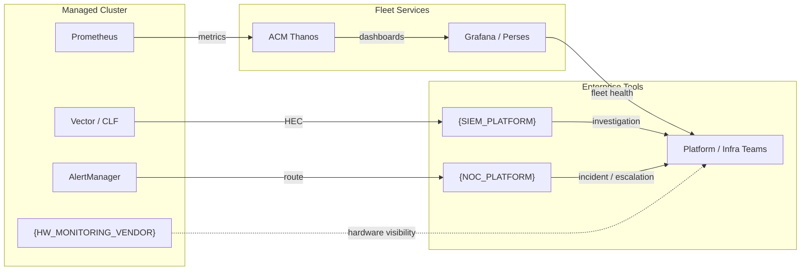

### Change and Maintenance Workflow

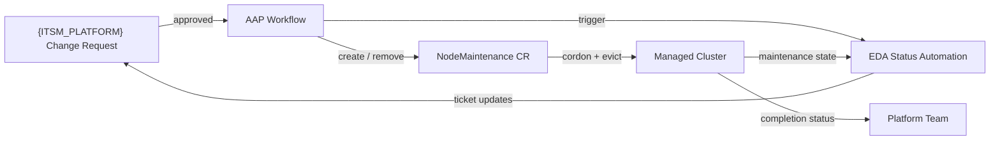

### Change and Maintenance Model

- Production maintenance follows established {ITSM_PLATFORM} advisory and moratorium controls.
- Planned node maintenance is executed through `NodeMaintenance`, with AAP used where ticketing or workflow automation is required.
- Upgrade rollout remains phased: sandbox, lab/pre-prod, then production with bake periods and pause points.
- Tier 3 Site rollout follows lab mock, pilot tier 3 site, then region-based main rollout.

### Support Boundary

- Platform owns the virtualization control plane and fleet-state management.
- Network, Storage, Security, and Infrastructure remain accountable for upstream domain dependencies.
- Application owners remain accountable for workload-level acceptance after migration or service-impacting changes.

---

## Fleet-wide Compliance & Hardening

**Problem:** Phase 2 establishes the initial CIS benchmark scan and high-severity remediation for individual clusters. Phase 3 must operationalize this at fleet scale — continuous scanning, policy enforcement across all {CLUSTER_COUNT} clusters, and integration with ACM governance.

**Decision:**

- {SCANNING_VENDOR} (enterprise standard) runs continuous CIS benchmark scans across all clusters
- ACM governance policies enforce baseline hardening (etcd encryption, audit logging, TLS) and report `NonCompliant` clusters to the hub console
- Scan-then-remediate approach — no auto-remediation for regulated production environments

**Applies to:** [DC] [{TIER_MIDDLE}] [TIER3]

### Compliance Lifecycle

| Phase         | Action                                                                | Tool             |
| ------------- | --------------------------------------------------------------------- | ---------------- |
| **Scan**      | CIS benchmark scan (OCP + OCP-V benchmarks)                           | {SCANNING_VENDOR}          |
| **Assess**    | Prioritize by severity; evaluate {SCANNING_VENDOR} OCP-V benchmark availability | {SCANNING_VENDOR}          |
| **Enforce**   | ACM policies enforce hardening baseline across fleet                  | RHACM Governance |
| **Remediate** | Manual remediation of high-severity findings                          | SRE team         |
| **Report**    | Compliance status per cluster visible in ACM hub console              | RHACM            |

Internal {CLIENT} hardening standard: CIS 1.8, moving to 1.9. Latest M8 hardware addresses most BIOS-level CIS items.

**Positive:**

- Continuous compliance posture
- ACM provides fleet-wide visibility

**Trade-off:** Manual remediation is slower than auto-remediation but safer for financial services

---

## Phase 3 Dependency Overlay

What must be healthy for fleet operations:

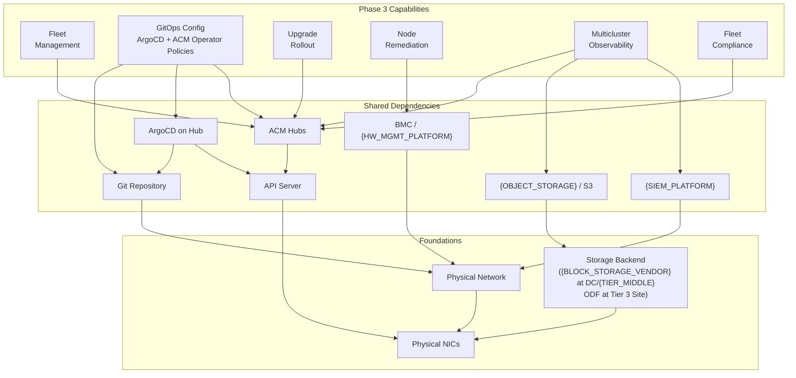

| Shared Dependency | Blast Radius                                                                              |
| ----------------- | ----------------------------------------------------------------------------------------- |
| ACM Hubs          | No operator policy enforcement, compliance, or observability for affected tier             |
| ArgoCD on Hub     | No Day 2 config delivery to spokes; ACM operator policies and governance still function    |
| Git Repository    | No config or secret definitions; ArgoCD and ACM operator policies both degraded            |
| BMC/{HW_MGMT_PLATFORM}    | No fencing; no ZTP provisioning                                                    |
| {OBJECT_STORAGE} / S3         | No long-term metric storage; Thanos degraded                                   |
| {SIEM_PLATFORM}            | No long-term log retention; local Loki provides 3-day buffer                      |

---

## Phase 3 RACI

| Activity                              | Platform | Network | Storage | Security | Infra |
| ------------------------------------- | -------- | ------- | ------- | -------- | ----- |
| ACM hub registration                  | R/A      | -       | -       | -        | -     |
| ArgoCD + GitOps repo configuration    | R/A      | -       | -       | C        | -     |
| ACM operator policy management        | R/A      | -       | -       | -        | -     |
| Upgrade rollout strategy              | R/A      | C       | C       | -        | I     |
| SNR/FAR remediation deployment        | R/A      | -       | -       | -        | C     |
| Fleet compliance operationalization   | R        | C       | C       | A        | C     |

**Legend:** R = Responsible, A = Accountable, C = Consulted, I = Informed
