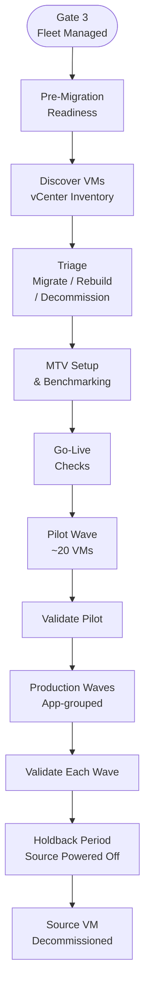
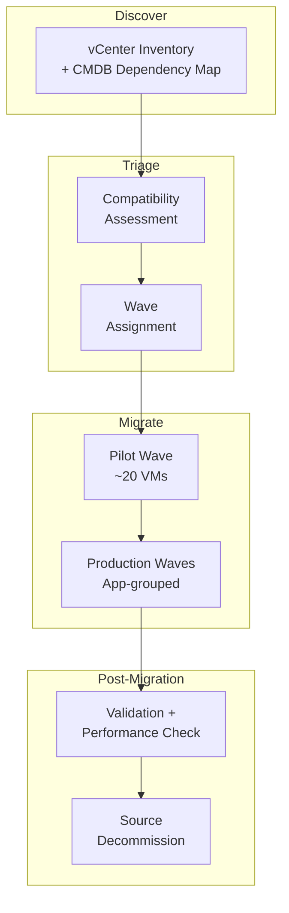
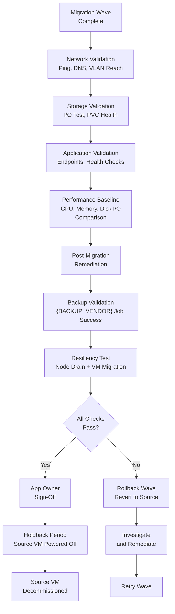
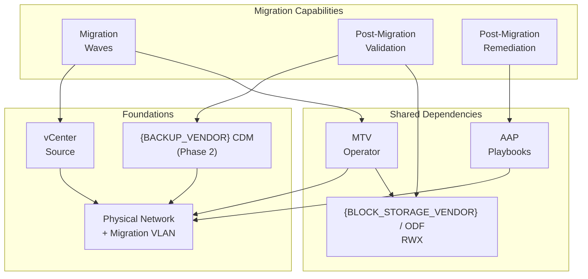

# PHASE 4 — VMware EXODUS: MIGRATION & VALIDATION

*Platform is ready. {VM_COUNT} VMs move from VMware vSphere to OpenShift Virtualization, wave by wave. This phase covers everything from source-platform preparation through validated migration and VMware decommission.*

## Phase 4 Flow — VMware to OpenShift Virtualization

### Phase 4 Gate Criteria (per wave)

- [ ] Target cluster passes Production Readiness Validation (Phases 1–3 gates met)
- [ ] MTV operator healthy; vCenter provider connected
- [ ] All VMs in wave migrated successfully via MTV
- [ ] Network connectivity validated (ping, DNS, VLAN)
- [ ] Storage I/O verified (performance baseline comparison)
- [ ] Application health checks passing
- [ ] Windows post-migration remediation complete (QEMU agent, VirtIO, VMware Tools removed)
- [ ] {BACKUP_VENDOR} backup job succeeds for migrated VMs
- [ ] App owner sign-off obtained via {ITSM_PLATFORM}
- [ ] Rollback window (holdback) observed
- [ ] NIC bond failover tested (no packet loss)

---

## Pre-Migration Readiness

**Problem:** Migration cannot begin until both the source VMware environment and the target OCP-V cluster are prepared. Source VMs require CBT enablement and tooling upgrades; the target cluster must pass all Phase 1–3 gates plus cluster post-build validation.

### Source Platform Preparation

| Activity | Owner | Dependency |
| --- | --- | --- |
| CBT enabled on source ESXi VMs (required for warm migration) | Migration | vCenter access; maintenance windows |
| VMware Tools upgraded to current on all source VMs | Migration | vCenter access |
| Windows VMs: Volume Shadow Copy service disabled | Migration | WinRM access |
| RVTools inventory export completed | Migration | vCenter access |
| CMDB/{ITSM_PLATFORM} dependency map extracted per application | App owners | CMDB data current |

**Applies to:** [DC] [{TIER_MIDDLE}]

### Target Cluster Prerequisites

The target OCP-V cluster must pass all cluster post-build validation checks before any migration wave begins. These are Phase 1–3 deliverables validated as a Phase 4 entry gate:

| Prerequisite | Phase Origin | Validation Method |
| --- | --- | --- |
| Cluster registered with Premium Red Hat Support | Phase 1 | OCP Console SLA confirmed |
| Alert routing configured and endpoints reachable | Phase 2 | `alerts.sh` — PASS |
| Monitoring PVCs bound and sized for retention | Phase 2 | `monitoring_pvc.sh` — PASS |
| etcd backup CronJobs succeeding | Phase 2 | `check_etcd_jobs.sh` — PASS |
| Logging operational | Phase 2 | `logging.sh` — PASS |
| Storage array healthy; multipath active | Phase 2 | Storage backend status Operational; `multipath -ll` healthy |
| NADs present for all VM VLANs | Phase 2 | `nads.sh` — no missing mappings |
| MTU consistent across NNCPs and NADs | Phase 2 | `mtu.sh` — report reviewed |
| Live migration network configured | Phase 2 | `live_migration_check.sh` — PASS |
| OCP-V operator available | Phase 2 | Operator status `Available` |
| MTV operator deployed and provider Ready | Phase 3 | `oc get providers -A` — Ready |
| RBAC verified | Phase 2 | `rbac.sh` — all manifests Ok |
| Software component versions match authorized list | Phase 3 | `software_versions_check.sh` — PASS |
| Cluster imported into RHACM | Phase 3 | RHACM cluster list — Ready |
| {BACKUP_VENDOR} configured and backup VLAN active | Phase 2 | {BACKUP_VENDOR} CDM healthy; Multus NAD present |

---

## Discovery & Triage

**Problem:** {VM_COUNT} VMs must be classified before migration. Not all VMs should migrate — some should be rebuilt as containers, others decommissioned. Migration waves must respect application dependency boundaries.

**Decision:**

- Triage every workload into **migrate / rebuild / retire** using RVTools + CMDB/{ITSM_PLATFORM} dependencies
- Low-criticality, low-dependency workloads pilot first
- Waves sized to change-window capacity (MTV concurrency, storage, network) with rollback criteria documented per wave
- Wave composition based on application dependency map from CMDB/{ITSM_PLATFORM}, not VM count alone

**Applies to:** [DC] [{TIER_MIDDLE}]

### Migration Wave Pipeline

**Positive:**
- Structured risk reduction
- rollback per wave
- MTV handles MAC/IP preservation

**Trade-off:**
- Wave planning requires accurate dependency maps from CMDB
- long timeline for {VM_COUNT} VMs

---

## Migration Tooling & Method

### MTV Controller Placement

**Problem:** MTV controller placement, migration network bandwidth, and VDDK hosting must be planned to avoid saturating production traffic during migration.

**Decision:**

- MTV operator on target OCP-V cluster in a dedicated namespace
- 10Gbps+ connectivity between VMware and OCP-V
- VDDK redistributable as container image hosted in {IMAGE_REGISTRY}
- Concurrent migration limits tuned per cluster size
- Dedicated migration network or bandwidth-limited path to avoid saturating production traffic

**Applies to:** [DC] [{TIER_MIDDLE}]

### Migration Method: Warm vs Cold

**Problem:** Migration method selection directly impacts downtime, datastore free space requirements, and change-window utilization. Warm and cold migrations have different operational profiles and prerequisites.

**Decision:**

- **Warm migration is the default** (~90%+ of VMs) — pre-stages data outside the change window; final cutover within window
- **Cold migration for exceptions** — {TIER_MIDDLE} sites and applications that can be split across a load balancer for zero-downtime cutover; ~1/3 faster but cannot be pre-staged
- **Maintenance windows:** {MIGRATION_WINDOW}; pre-staging (warm sync) occurs outside the change window; cutover within it
- **MTV default concurrency:** 20 VMs in flight
- **Plan sizing:** 100–200 VMs for warm; up to 500 for cold
- **AIO buffer tuning:** can accelerate cold migrations by ~25% but is incompatible with warm (must be disabled before warm runs)
- **CBT pre-enablement required:** warm migration requires CBT on the source ESXi VMs — {CLIENT} must begin enabling CBT in maintenance windows before migration waves start
- Rollback: power on source VM — no data sync needed unless significant write delta

**Applies to:** [DC] [{TIER_MIDDLE}]

**Positive:**

- Warm minimizes downtime for the majority of workloads
- Pre-staging outside the change window means actual cutover time is short (final delta + power cycle)

**Trade-off:**

- Warm requires 10% free space on source datastores for VMware snapshots during sync
- {BACKUP_VENDOR} snapshots require additional 2% free space
- Cold cannot be pre-staged — full copy must complete within the maintenance window

---

## Migration Execution Workflow

### MTV Setup & Testing

| Activity | Owner | Dependency |
| --- | --- | --- |
| MTV connected to vCenter | Migration | Network path to vCenter |
| NADs validated for migration target networks | Migration | NADs created |
| Test VM migrated from VMware (Linux + Windows) | Migration | MTV connected |
| Migration benchmarking completed | Migration | Test VM success |
| VM provisioning test (Fedora + Windows) with live migration validated | Migration | OCP-V operator, storage classes |
| NIC bond failover tested — no packet loss observed | Migration | Bond configuration stable |

### Go-Live Checks

| Activity | Owner | Dependency |
| --- | --- | --- |
| VMware Tools upgraded on source VMs | Migration | vCenter access |
| CBT enabled (if warm migrating) | Migration | VMware Tools current |
| Windows: Volume Shadow service disabled | Migration | WinRM access |
| VM backup test (backup → delete → restore → verify) | Backup | {BACKUP_VENDOR} configured |
| Go-live readiness checklist completed | All | All target prerequisites met |
| Final check and cluster freeze | Platform | Readiness checklist |
| {BACKUP_VENDOR} backup configuration validated | Backup | {BACKUP_VENDOR} configured |

### Migration Execution

| Activity | Owner | Dependency |
| --- | --- | --- |
| Application identification (CMDB/{ITSM_PLATFORM}) | App owners | CMDB data |
| Migration order of operations defined | Migration | Wave plan approved |
| Pilot wave (~20 VMs) executed | Migration | Go-live checks pass |
| OS verification per VM | Migration | Migration complete |
| Application verification per VM | App owners | OS verification |
| Windows post-migration (QEMU agent, VirtIO, VMware Tools removal) | Migration | AAP playbook |
| Production waves executed (app-grouped) | Migration | Pilot validated |
| Holdback period observed per wave | Migration | App owner sign-off |
| Source VMs decommissioned | Infra | Holdback complete |

---

## Post-Migration Validation Framework

Each migration wave passes through this validation flow:

| Validation Step | Method | Pass Criteria |
| --- | --- | --- |
| Network | Ping sweep + DNS resolution + VLAN tag verify | All endpoints reachable; DNS resolves correctly |
| Storage | fio benchmark + PVC status check | I/O within 10% of source baseline; PVC `Bound` |
| Application | HTTP/TCP health probes + service mesh check | All probes return healthy |
| Performance | Compare CPU/memory/IOPS to pre-migration baseline | Within acceptable variance (10%) |
| Windows remediation | QEMU agent health + VirtIO driver status + VMware Tools absent | Guest agent reporting; drivers loaded; no conflicts |
| Backup | {BACKUP_VENDOR} backup job triggered and succeeds for migrated VMs | Backup completes within retention SLA |
| Resiliency | Cordon/drain a worker node; verify VMs migrate to other nodes | Workloads migrate; no packet loss; services remain available |

---

## Post-Migration Remediation

### Windows Post-Migration Remediation

**Problem:** Windows VMs migrated from VMware require post-migration remediation: QEMU guest agent installation, VirtIO driver deployment, and VMware Tools removal. Manual remediation does not scale for hundreds of Windows VMs.

**Decision:**

- Automated Ansible playbooks via AAP handle post-migration remediation for Windows VMs
- VMs are reachable via WinRM/SSH from AAP
- POC scripts are adaptable to Ansible
- Remediation steps per VM:

1. Install QEMU guest agent (enables guest metrics, graceful shutdown)
2. Deploy VirtIO drivers (disk, network, balloon)
3. Remove VMware Tools (prevents conflicts)
4. Validate guest agent health and network connectivity

This remediation is triggered after each migration wave and integrated into the migration validation framework.

**Positive:**
- Consistent remediation across all Windows VMs
- automation avoids manual errors

**Trade-off:** Requires WinRM/SSH access and AAP connectivity to migrated VMs

### Guest OS Lifecycle

**Decision:**

- Validate in sandbox that all in-guest tools (patching agents, EDR, monitoring agents) operate unchanged inside OCP-V VMs
- Tools are network-based (agent phones home over VLAN) — VLAN bridging preserves same path
- No VMware-specific dependencies expected

---

## Migration Artifact Storage & Reporting

**Problem:** MTV plan YAMLs contain vCenter credentials and infrastructure details. Raw artifacts are needed for migration tracking and reporting but must be secured.

**Decision:**

- Sanitized artifacts stored on an ACL-controlled share (credentials stripped via sanitization script)
- MTV analyzer tool (CLI/containerized) produces migration reporting — Gantt charts, timing data, success/failure rates, and OS breakdowns
- Project management uses analyzed output, not raw artifacts
- Storage location {MIGRATION_ARTIFACT_STORAGE} (SMB share, NFS with ACLs, or similar)

**Positive:**

- Enables long-term migration tracking — velocity trends, failure analysis, and project management reporting

**Trade-off:**

- Sanitization script required to strip vCenter credentials before storage
- Git storage inappropriate even after sanitization due to infrastructure detail exposure

---

## Holdback & Source Decommission

**Problem:** Premature VMware decommissioning risks data loss if migration issues surface after cutover. A standardized holdback and rollback process is required.

**Decision:**

- **Holdback period:** source VMs remain powered off for a defined observation window after app-owner sign-off — duration {HOLDBACK_DURATION} per wave risk profile
- **Rollback:** power on source VM in VMware — no data sync needed unless significant write delta occurred post-cutover
- **Decommission criteria:**
  - Holdback period elapsed without rollback request
  - Application owner confirms production stability via {ITSM_PLATFORM}
  - {BACKUP_VENDOR} backup of migrated VM verified
- **Source VM decommission** managed by Infra team after all criteria met

**Applies to:** [DC] [{TIER_MIDDLE}]

---

## Phase 4 Dependency Overlay

What must be healthy for migration to succeed:

| Dependency | Blast Radius |
| --- | --- |
| MTV Operator | Cannot migrate VMs; waves blocked |
| vCenter (source) | Cannot discover or migrate VMs |
| {BLOCK_STORAGE_VENDOR} / ODF (RWX) | No persistent storage for migrated VMs |
| Physical Network + Migration VLAN | MTV data transfer blocked; migration stalls |
| {BACKUP_VENDOR} CDM (Phase 2 prerequisite) | Cannot validate backup of migrated VMs |
| AAP | Windows post-migration remediation blocked |

---

## Phase 4 RACI

| Activity | Platform | Network | Storage | Security | Backup | App Owners | Infra |
| --- | --- | --- | --- | --- | --- | --- | --- |
| Pre-migration readiness validation | R/A | C | C | C | C | - | - |
| MTV operator deployment | R/A | - | C | - | - | - | - |
| vCenter connectivity validation | R | R | - | - | - | - | C |
| Wave planning (CMDB dependency mapping) | C | - | - | - | - | R/A | - |
| Pilot migration execution (~20 VMs) | R/A | C | C | - | C | C | - |
| Post-migration validation | R | C | C | - | C | A | - |
| Windows post-migration remediation (AAP) | R/A | - | - | - | - | I | - |
| {BACKUP_VENDOR} backup validation (migrated VMs) | C | - | C | - | R/A | - | - |
| Resiliency testing (node drain + VM migration) | R/A | C | C | - | - | I | - |
| Holdback period management | C | - | - | - | - | A | - |
| Source VM decommission | I | - | - | - | - | A | R |

**Legend:** R = Responsible, A = Accountable, C = Consulted, I = Informed
