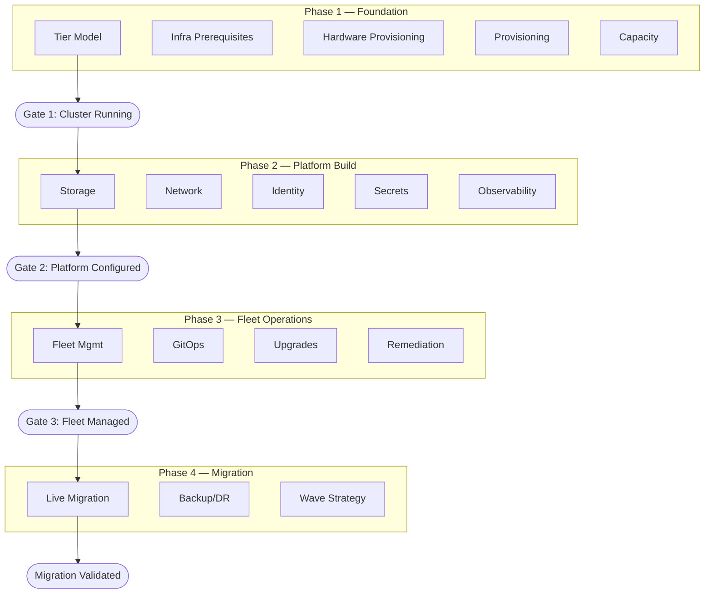

# {CLIENT} — OpenShift Virtualization HLD: Decision Journey

> **Decision Journey v1.0** · Architectural decisions in deployment order — from empty rack to validated migration.
> Replace all `{PLACEHOLDERS}` with engagement-specific values.

---

## Document Control

| Field                  | Value                                                     |
| ---------------------- | --------------------------------------------------------- |
| **Title**              | {CLIENT} OpenShift Virtualization — HLD: Decision Journey |
| **Version**            | {VERSION}                                                 |
| **Status**             | {Draft \| Review \| Approved}                             |
| **Classification**     | {CLASSIFICATION}                                          |
| **Author**             | {AUTHOR}                                                  |
| **Reviewers**          | {REVIEWER_LIST}                                           |
| **Approval Authority** | {APPROVER}                                                |
| **Last Updated**       | {DATE}                                                    |

### Revision History

| Ver | Date   | Author   | Changes                                |
| --- | ------ | -------- | -------------------------------------- |
| 0.1 | {DATE} | {AUTHOR} | Initial decision journey from template |

### Distribution List

| Name / Role       | Distribution    |
| ----------------- | --------------- |
| {SPONSOR}         | For approval    |
| {ARCHITECT_LEAD}  | For review      |
| {SRE_LEAD}        | For review      |
| {SECURITY_LEAD}   | For review      |
| {NETWORK_LEAD}    | For review      |
| {STORAGE_LEAD}    | For review      |
| {PROJECT_MANAGER} | For information |

---

## Executive Summary

### Business Context

{CLIENT} currently operates **{VM_COUNT}** virtual machines across **{SITE_COUNT}** sites on VMware vSphere, managed by approximately **{HOST_COUNT}** hosts. The organization has decided to migrate to Red Hat OpenShift Virtualization to:

- **Reduce licensing costs** — eliminate VMware vSphere licensing and consolidate to a single platform subscription
- **Unify operations** — manage VMs and containers through a single Kubernetes-native control plane
- **Improve automation** — replace manual provisioning with GitOps-driven, declarative configuration across all sites
- **Extend to edge** — deploy enterprise-grade virtualization to {BRANCH_COUNT} tier 3 site/edge sites with minimal on-site expertise

### Solution Overview

The platform will be deployed across three tiers — **Datacenter**, **Regional**, and **Tier 3 Site (3-node compact)** — managed through split ACM hubs. Approximately **{CLUSTER_COUNT}** OpenShift clusters will be provisioned, configured, and brought into fleet management before workload migration begins.

The design is structured as a four-phase decision journey:

| Phase | Name             | Outcome                                                  |
| ----- | ---------------- | -------------------------------------------------------- |
| 1     | Foundation       | Running OCP cluster on bare metal                        |
| 2     | Platform Build   | Storage, network, security, observability configured     |
| 3     | Fleet Operations | All clusters managed, upgradable, and compliant          |
| 4     | Migration        | VMs migrated from vSphere, validated, and decommissioned |

### End-State Architecture Summary

The approved target state is a three-tier OpenShift Virtualization platform operated as a managed fleet rather than as isolated clusters.

| Domain | Approved High-Level Direction |
| ------ | ----------------------------- |
| **Deployment tiers** | Datacenter, Regional, and Tier 3 Site (3-node compact) |
| **Scale** | Approximately **{CLUSTER_COUNT}** clusters supporting **{VM_COUNT}** VM migrations |
| **Hardware model** | **{SERVER_HARDWARE}** managed through **{HW_MGMT_PLATFORM}** server profiles |
| **Provisioning model** | ACM-driven installation and ZTP, with no bastion host |
| **Primary storage** | **{BLOCK_STORAGE_VENDOR}** for DC/Regional tiers; ODF local storage for Tier 3 Site tier |
| **Object storage** | **{OBJECT_STORAGE}** where applicable; Tier 3 Site uses local ODF S3 pattern |
| **Network model** | Segregated management, VM, migration, backup, and storage traffic with tier-specific NIC layout |
| **Identity** | LDAP-backed OAuth with custom RBAC roles and a breakglass local account controlled through **{SECRET_MGMT_VENDOR}** |
| **Secrets** | **{SECRET_MGMT_VENDOR}** target state with ESO integration; manual interim only where required |
| **Fleet management** | Split ACM hubs for DC/Regional and Tier 3 Site tiers |
| **Policy delivery** | ACM-managed policy model as the Day-2 control plane |
| **Observability** | Local Prometheus/Loki plus Thanos, **{SIEM_PLATFORM}**, **{NOC_PLATFORM}**, and supporting enterprise tools |
| **Remediation** | SNR plus FAR using **{HW_MGMT_PLATFORM}** / Redfish-backed fencing where validated |
| **Backup / DR** | **{BACKUP_VENDOR}** for VM backup; storage replication for DC DR continuity where implemented |
| **Migration** | MTV with wave-based planning, pilot-first execution, validation, and holdback-based rollback |

### Expected Outcomes

| Outcome                    | Measure                                               |
| -------------------------- | ----------------------------------------------------- |
| VMware license elimination | {LICENSE_SAVINGS} annual savings                      |
| Operational consolidation  | Single management plane for all tiers                 |
| Provisioning acceleration  | New cluster: hours (ZTP) vs weeks (manual)            |
| Fleet consistency          | ACM policy compliance across {CLUSTER_COUNT} clusters |
| Migration completion       | {VM_COUNT} VMs migrated within {MIGRATION_TIMELINE}   |

---

## How to Read This Journey

This document presents architectural decisions in the order you encounter them during a real engagement. Decisions are grouped into four phases, each gated by a checkpoint that must pass before proceeding. Phase-specific detail is maintained in separate companion documents (see Referenced Documents above).

| Element                 | Meaning                                                  |
| ----------------------- | -------------------------------------------------------- |
| **Phase 1–4**           | Chronological engagement phases                          |
| **Gate**                | Checkpoint between phases — conditions that must be true |
| `[DC]` `[REGIONAL]` `[EDGE]` | Deployment tier applicability                            |

**Reading order:** Start at Phase 1 and follow sequentially. The Master Journey Map below shows the full path.

---

## Master Journey Map

---

## Scope & Constraints

### In Scope / Out of Scope

| In Scope                                                  | Out of Scope                                          |
| --------------------------------------------------------- | ----------------------------------------------------- |
| OCP-V cluster architecture for all three deployment tiers | Step-by-step installation procedures (covered in LLD) |
| Compute, network, storage, and security design            | Guest OS configuration and application-level tuning   |
| Multi-cluster management architecture (ACM, GitOps, ZTP)  | VMware vSphere decommissioning plan                   |
| Observability, backup, and disaster recovery architecture | Third-party ISV application deployment                |
| VM migration strategy and tooling overview                | Detailed cost modeling                                |
| Capacity planning baselines                               | Vendor procurement negotiation                        |
| Implementation workflow and RACI                          | Detailed project schedule (managed in {PM_TOOL})      |

### Scope Statement

{CLIENT} operates **{VM_COUNT}** VMs across **{SITE_COUNT}** sites on **{CLUSTER_COUNT}** OpenShift clusters, migrating from VMware vSphere to OpenShift Virtualization. This covers datacenters ({SITE_PRIMARY}, {SITE_SECONDARY}), Regional sites, {BRANCH_COUNT} tier 3 site locations on {BRANCH_HARDWARE}, and lab/sandbox environments ({SITE_LAB}). Decisions below are sequenced across four phases.

### Constraints

| Constraint          | Detail                                                                         |
| ------------------- | ------------------------------------------------------------------------------ |
| Regulatory          | {REGULATORY_FRAMEWORKS} compliance required (e.g., PCI-DSS, SOX)               |
| Change moratoriums  | {MORATORIUM_SCHEDULE}                                                          |
| Hardware delivery   | {SERVER_HARDWARE} lead time: {HW_LEAD_TIME}                                    |
| Budget envelope     | Hardware and licensing budget approved for FY{FISCAL_YEAR}                     |
| Network bandwidth   | Tier 3 Site WAN bandwidth: {BRANCH_WAN_BW} — constrains ZTP ISO delivery and backup |
| Vendor dependencies | {BACKUP_VENDOR} CBT support: {CBT_TARGET_DATE}; ROBO: {ROBO_TARGET_DATE}       |

---
