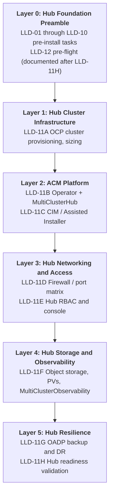
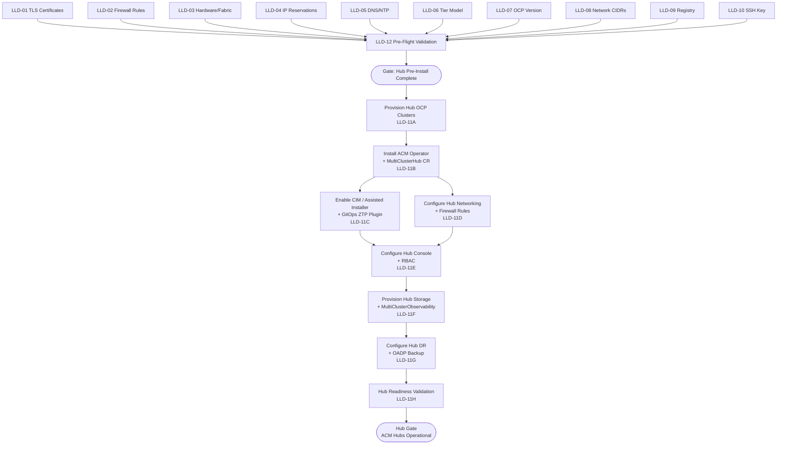

# {CLIENT} OpenShift Virtualization — Phase 1 ACM Hub Deployment LLD

> Replace all `{PLACEHOLDERS}` with engagement-specific values. See placeholder reference table at end of document.

---

## Document Control

| Field                  | Value                                                            |
| ---------------------- | ---------------------------------------------------------------- |
| **Title**              | {CLIENT} OpenShift Virtualization — Phase 1 ACM Hub Deployment LLD |
| **Version**            | 0.4                                                              |
| **Status**             | Draft                                                            |
| **Classification**     | Internal — Confidential                                          |
| **Author**             | {AUTHOR}                                           |
| **Reviewers**          | {REVIEWER_LIST}                       |
| **Approval Authority** | {APPROVER}                                  |
| **Last Updated**       | 2026-06-16                                                       |

### Platform Version Alignment

| Component   | Target Version | Notes                                                                                                                                                       |
| ----------- | -------------- | ----------------------------------------------------------------------------------------------------------------------------------------------------------- |
| Hub OCP     | {OCP_VERSION}.x         | Aligns with spoke target and validated platform baseline                                                                                                    |
| RHACM       | 2.16.x         | Latest GA release for initial deployment; supports OCP {OCP_VERSION} as hub. Steady-state RHACM version hold (N vs N-1) is aligned at Hub Gate with ADR 2/46 policy. |
| MCE         | 2.11.x         | Installed and managed by RHACM 2.16                                                                                                                         |
| OLM channel | `release-2.16` | Pinned with `installPlanApproval: Manual`                                                                                                                   |

### Revision History

| Ver | Date       | Author                    | Changes                                  |
| --- | ---------- | ------------------------- | ---------------------------------------- |
| 0.1 | 2026-06-05 | {AUTHOR} | Initial Phase 1 ACM Hub Deployment LLD |
| 0.2 | 2026-06-16 | {AUTHOR}               | Renumbered hub sections from LLD-46x to LLD-11x, replaced Gate 2.5 with Hub Gate, and realigned flow to start after Phase 1 pre-install artifacts |
| 0.3 | 2026-06-16 | {AUTHOR}               | Made ACM Hub LLD fully self-contained: added explicit pre-install prerequisite summary, removed direct spoke-LDD forward flow references, and added a formal Hub Gate handoff note. |
| 0.4 | 2026-06-16 | {AUTHOR}               | Integrated Foundation LLD sections (LLD-01 through LLD-10, LLD-12) into ACM Hub LLD and enforced `install-config.yaml` via `openshift-install` as the Phase 1 hub installation method (no ACM dependency). |

---

## Scope & References

This LLD provides implementation specifications for Phase 1 ACM Hub Deployment: the hub foundation pre-install workstream, provisioning of ACM hub OCP clusters, installation of the RHACM operator and `MultiClusterHub`, enablement of the Assisted Installer / Central Infrastructure Management (CIM) service, hub networking and RBAC, hub storage and observability backends, and ACM hub DR/backup posture. Each LLD-11x section maps to the corresponding decision in the {CLIENT} HLD.

**Phase context:** This companion document is part of Phase 1 Foundation. It includes the full pre-install foundation sections (LLD-01 through LLD-10), then executes LLD-11A through LLD-11H, and documents LLD-12 (Pre-Flight Validation) after LLD-11H for numeric ordering. LLD-12 is still executed as a prerequisite before LLD-11A provisioning.

> **Scope boundary:** This LLD covers the hub cluster OCP install and ACM platform layer only. Spoke provisioning procedures and fleet governance rollout are documented in separate Phase 1/Phase 3 documents.

## Hub Foundation Preamble (Phase 1)

The ACM hub cluster requires the same Foundation pre-install workstream as any OCP cluster. The following sections include the full Foundation LLD content for LLD-01 through LLD-10. LLD-11 (Provisioning Method per Tier) is intentionally excluded — it covers spoke provisioning via ACM ZTP, which cannot apply to the hub itself. The hub provisioning method is defined in LLD-11A below using install-config.yaml.

## LLD-01: TLS/SSL Certificates

Procure and validate enterprise TLS certificates for API and ingress endpoints before cluster installation. Post-install certificate deployment is in LLD-13. *(ADR 24)*

### Prerequisites

| ID      | Item                                                                               | Owner         | Status |
| ------- | ---------------------------------------------------------------------------------- | ------------- | ------ |
| CG-01-1 | Confirm the required TLS certificate key algorithm standard with the Security team | Security Team | Open   |

### Dependencies

*No dependencies — this section can begin immediately.*

### Configuration Parameters

| Parameter              | Value                            | Description                          | Source                      |
| ---------------------- | -------------------------------- | ------------------------------------ | --------------------------- |
| API cert subject       | `api.<cluster>.<base_domain>`    | API server CN/SAN                    | HLD — Certificate Inventory |
| Ingress cert subject   | `*.apps.<cluster>.<base_domain>` | Wildcard ingress CN/SAN              | HLD — Certificate Inventory |
| cert-manager namespace | `cert-manager`                   | Operator manages rotation post Day 0 | OCP docs                    |

### Sample Configuration

No sample configuration for pre-install procurement. Post-install certificate deployment sample configs are in LLD-13.

### Tier Variance

| Parameter           | DC            | {SITE_3}           | Branch        |
| ------------------- | ------------- | ------------- | ------------- |
| API cert issuer     | Enterprise CA | Enterprise CA | Enterprise CA |
| Ingress cert issuer | Internal CA   | Internal CA   | Internal CA   |
| Wildcard exception  | Required      | Required      | Required      |

*No tier-specific variance for certificates.*

### Implementation Procedure

**Execution Readiness Checks:**

- [ ] Cluster name and base domain finalized
- [ ] Enterprise CA and Internal CA accessible
- [ ] Wildcard certificate exception approved (ADR 24)

**Steps:**

1. **Generate CSR for API certificate**
   
   - Subject: `api.<cluster>.<base_domain>`
   
   - SAN: `api.<cluster>.<base_domain>`
   
   - Key: RSA 2048 or ECDSA P-256 per enterprise policy

2. **Generate CSR for Ingress wildcard certificate**
   
   - Subject: `*.apps.<cluster>.<base_domain>`
   
   - SAN: `*.apps.<cluster>.<base_domain>`

3. **Submit API CSR to Enterprise CA** — follow {CLIENT} PKI submission process

4. **Submit Ingress CSR to Internal CA** — include wildcard exception reference (ADR 24)

5. **Validate received certificates:**
   
   ```bash
   openssl x509 -in api.crt -noout -text | grep -E "Subject:|DNS:"
   openssl x509 -in ingress.crt -noout -text | grep -E "Subject:|DNS:"
   openssl x509 -in api.crt -noout -dates
   openssl verify -CAfile ca-bundle.crt api.crt
   openssl verify -CAfile ca-bundle.crt ingress.crt
   ```

6. **Store certificates securely** for use post-install

> Post-install certificate deployment (ingress secret creation, IngressController patching) is in LLD-13.

**Verification:**

```bash
openssl x509 -in api.crt -noout -text | grep -E "Subject:|DNS:"
openssl verify -CAfile ca-bundle.crt api.crt
openssl verify -CAfile ca-bundle.crt ingress.crt
```

**Rollback:**

- Re-submit CSR with corrected SAN if needed
- Certificates are pre-install artifacts; no cluster-side rollback at this stage

### Acceptance Criteria

| ID      | Criterion                | Test                                                     | Expected Result                           |
| ------- | ------------------------ | -------------------------------------------------------- | ----------------------------------------- |
| AC-01-1 | API cert SAN correct     | `openssl x509 -in api.crt -noout -text \| grep DNS:`     | Contains `api.<cluster>.<base_domain>`    |
| AC-01-2 | Ingress cert SAN correct | `openssl x509 -in ingress.crt -noout -text \| grep DNS:` | Contains `*.apps.<cluster>.<base_domain>` |
| AC-01-3 | Chain validates          | `openssl verify -CAfile ca-bundle.crt <cert>`            | OK                                        |
| AC-01-4 | Not expired              | `openssl x509 -in <cert> -noout -dates`                  | notAfter is future                        |

> Post-install certificate verification (AC-14-1, AC-14-2) is in LLD-13.

---

## LLD-02: Firewall Rules & Port Requirements

Open all required inter-node, ACM hub-spoke, BMC/Ironic provisioning, and external egress firewall ports before ACM ZTP begins cluster deployment. *(ADR 16)*

### Prerequisites

| ID      | Item                                                                       | Owner                     | Status |
| ------- | -------------------------------------------------------------------------- | ------------------------- | ------ |
| CG-02-1 | Decide whether branch network egress uses a proxy or direct firewall rules | Network / Architecture    | Open   |
| CG-02-2 | Finalise branch firewall rules and IP subnet allocations                   | Network / Sam (Branch PM) | Open   |

### Dependencies

*No dependencies — this section can begin immediately.*

### Reference

| Parameter                                       | Value                     | Description                                                       | Source                |
| ----------------------------------------------- | ------------------------- | ----------------------------------------------------------------- | --------------------- |
| Egress model (DC/{SITE_3})                           | Firewall-only             | No cluster-wide proxy                                             | ADR 16                |
| Egress model (Branch)                           | **TBD**                   | Firewall or proxy pending branch infra maturity                   | ADR 16                |
| Inter-node — ICMP                               | ICMP all                  | Network reachability tests                                        | OCP install guide     |
| Inter-node — metrics                            | TCP 1936                  | Ingress health-check probes                                       | OCP install guide     |
| Inter-node — host services                      | TCP/UDP 9000-9999         | node-exporter, CVO, etc.                                          | OCP install guide     |
| Inter-node — kubelet                            | TCP 10250-10259           | Kubernetes reserved                                               | OCP install guide     |
| Inter-node — MCS                                | TCP 22623                 | Machine Config Server                                             | OCP install guide     |
| Inter-node — Geneve                             | UDP 6081                  | OVN-Kubernetes overlay                                            | OCP install guide     |
| Inter-node — NodePort                           | TCP/UDP 30000-32767       | NodePort range                                                    | OCP install guide     |
| All → CP — API                                  | TCP 6443                  | Kubernetes API                                                    | OCP install guide     |
| CP ↔ CP — etcd                                  | TCP 2379-2380             | etcd server + peer                                                | OCP install guide     |
| LB → CP                                         | TCP 6443, 22623           | API + MCS                                                         | OCP install guide     |
| LB → Workers                                    | TCP 80, 443               | HTTP/HTTPS ingress                                                | OCP install guide     |
| **ACM Hub → Managed Cluster**                   |                           |                                                                   |                       |
| Hub → Managed — Search logs                     | TCP 443                   | Log retrieval via Search console (klusterlet-addon-workmgr)       | RHACM 2.12 networking |
| Hub → Managed — API                             | TCP 6443                  | Kubernetes API for klusterlet install (Hive + import-controller)  | RHACM 2.12 networking |
| **Managed Cluster → ACM Hub**                   |                           |                                                                   |                       |
| Managed → Hub — metrics/alerts                  | TCP 443                   | Push Observability metrics, alerts, cluster proxy add-on          | RHACM 2.12 networking |
| Managed → Hub — API watch                       | TCP 6443                  | Watch hub API server for policy/config changes                    | RHACM 2.12 networking |
| **ACM Hub → BMC**                               |                           |                                                                   |                       |
| Hub → BMC — Redfish                             | TCP 443                   | Redfish management (power state, virtual media boot)              | MCE Infra Operator    |
| **BMC → ACM Hub (Ironic)**                      |                           |                                                                   |                       |
| BMC → Hub — virtual media HTTP                  | TCP 6180                  | BMC pulls discovery ISO from hub Ironic HTTP server               | MCE Infra Operator    |
| BMC → Hub — virtual media TLS                   | TCP 6183                  | BMC pulls discovery ISO from hub Ironic HTTPS server              | MCE Infra Operator    |
| **Hub Ironic ↔ Managed Node (provisioning)**    |                           |                                                                   |                       |
| Hub Ironic → Node — IPA callback                | TCP 9999                  | Ironic conductor to Ironic Python Agent on bare-metal node        | MCE Infra Operator    |
| Node IPA → Hub Ironic — API                     | TCP 6385                  | Ironic Python Agent communicates with Ironic API on hub           | MCE Infra Operator    |
| **Managed Cluster → Hub (provisioning)**        |                           |                                                                   |                       |
| Managed → Hub — assistedService                 | TCP 443                   | Report hardware info via assistedService route during install     | MCE Infra Operator    |
| **Managed Cluster → Image Repo (provisioning)** |                           |                                                                   |                       |
| Managed → Image Repo — rootfs                   | TCP 443 (80 disconnected) | Download rootfs/ISO image during cluster install                  | MCE Infra Operator    |
| **ACM Hub → External**                          |                           |                                                                   |                       |
| Hub → ObjectStore — Observability               | TCP 443                   | Thanos long-term metrics storage (ICOS / Cluster Backup Operator) | RHACM 2.12 networking |
| Hub → Channel sources — GitOps                  | TCP 443                   | Git, Helm, Object Store for Application lifecycle / ArgoCD        | RHACM 2.12 networking |
| **External Connectivity**                       |                           |                                                                   |                       |
| External — NTP                                  | UDP 123                   | Time sync                                                         | OCP firewall guide    |
| External — registry                             | TCP 443                   | {REGISTRY_MIRROR} pull-through cache                                    | ADR 4                 |
| External — DNS                                  | TCP/UDP 53                | CoreDNS to upstream                                               | OCP firewall guide    |

### Egress URL Allowlist

The hub cluster (and {REGISTRY_MIRROR} itself) must reach the following upstream URLs on TCP 443 even when {REGISTRY_MIRROR} is the pull-through cache. Spoke clusters pull through {REGISTRY_MIRROR}; the per-spoke allowlist may be limited to {REGISTRY_MIRROR} only. Branch spoke egress is TBD per ADR 16. *(Source: [OCP {OCP_VERSION} — Configuring your firewall](https://docs.redhat.com/en/documentation/openshift_container_platform/{OCP_VERSION}/html/installation_configuration/configuring-firewall), HLD Firewall Port Matrix, ADR 16)*

| Category                                                      | URL                                                     | Port | Purpose                                             | Required On       |
| ------------------------------------------------------------- | ------------------------------------------------------- | ---- | --------------------------------------------------- | ----------------- |
| **Container Registries**                                      |                                                         |      |                                                     |                   |
|                                                               | `registry.redhat.io`                                    | 443  | Core container images                               | Hub + {REGISTRY_MIRROR} |
|                                                               | `registry.access.redhat.com` (or `*.access.redhat.com`) | 443  | Red Hat Ecosystem Catalog images                    | Hub + {REGISTRY_MIRROR} |
|                                                               | `access.redhat.com`                                     | 443  | Image signature verification                        | Hub + {REGISTRY_MIRROR} |
|                                                               | `quay.io` / `*.quay.io`                                 | 443  | Core container images + CDN                         | Hub + {REGISTRY_MIRROR} |
|                                                               | `sso.redhat.com`                                        | 443  | Authentication for console.redhat.com               | Hub               |
| **Cluster Lifecycle**                                         |                                                         |      |                                                     |                   |
|                                                               | `api.openshift.com`                                     | 443  | Cluster token + update availability checks          | Hub + Spokes      |
|                                                               | `console.redhat.com`                                    | 443  | Cluster token + Insights                            | Hub + Spokes      |
|                                                               | `mirror.openshift.com`                                  | 443  | Mirrored install content + release image signatures | Hub               |
|                                                               | `rhcos.mirror.openshift.com`                            | 443  | RHCOS images for Assisted Installer                 | Hub               |
|                                                               | `storage.googleapis.com/openshift-release`              | 443  | Release image signatures (alternate source)         | Hub               |
|                                                               | `quayio-production-s3.s3.amazonaws.com`                 | 443  | Quay image content on AWS S3                        | Hub + {REGISTRY_MIRROR} |
| **Telemetry / Insights** (required unless Telemetry disabled) |                                                         |      |                                                     |                   |
|                                                               | `cert-api.access.redhat.com`                            | 443  | Telemetry                                           | Hub + Spokes      |
|                                                               | `api.access.redhat.com`                                 | 443  | Telemetry                                           | Hub + Spokes      |
|                                                               | `infogw.api.openshift.com`                              | 443  | Telemetry                                           | Hub + Spokes      |
| **GitOps**                                                    |                                                         |      |                                                     |                   |
|                                                               | `github.{CLIENT_DOMAIN}`                                       | 443  | GitHub Enterprise — ArgoCD + ACM policy repos       | Hub               |
|                                                               | `*.github.com`                                          | 443  | GitHub.com — GitOps dependencies                    | Hub               |
| **Third-Party Operators**                                     |                                                         |      |                                                     |                   |
|                                                               | `registry.connect.redhat.com`                           | 443  | Certified operators + third-party images            | Hub + {REGISTRY_MIRROR} |

> **Wildcard simplification:** `*.quay.io` can replace `cdn.quay.io` and `cdn01`–`cdn06.quay.io`. `*.access.redhat.com` can replace `registry.access.redhat.com` and `access.redhat.com`.

> **Operator health-check routes:** OCP operators require egress to three application routes for health checks. If `*.apps.<cluster>.<base_domain>` is not globally allowed at the firewall, the following routes must be explicitly permitted per cluster:
> 
> - `oauth-openshift.apps.<cluster>.<base_domain>`
> - `canary-openshift-ingress-canary.apps.<cluster>.<base_domain>`
> - `console-openshift-console.apps.<cluster>.<base_domain>` (or the hostname in `consoles.operator/cluster` spec if overridden)
> 
> *(Source: [OCP {OCP_VERSION} — Configuring your firewall](https://docs.redhat.com/en/documentation/openshift_container_platform/{OCP_VERSION}/html/installation_configuration/configuring-firewall))*

### Sample Configuration

**Firewall change request template (per cluster):**

```
Cluster: <cluster_name>
Site: <site_name>
Tier: DC / {SITE_3} / Branch
ACM Hub: <hub_cluster_fqdn> / <hub_api_vip>

Source → Destination rules:

  --- OCP Inter-Cluster ---
  Inter-node (all ↔ all): ICMP, TCP 1936, TCP/UDP 9000-9999, TCP 10250-10259,
                           TCP 22623, UDP 6081, TCP/UDP 30000-32767
  All → CP: TCP 6443
  CP ↔ CP: TCP 2379-2380
  LB → CP: TCP 6443, TCP 22623
  LB → Workers: TCP 80, TCP 443

  --- ACM Hub ↔ Managed Cluster ---
  Hub → Managed:  TCP 443 (Search/logs), TCP 6443 (klusterlet install)
  Managed → Hub:  TCP 443 (metrics/alerts/proxy), TCP 6443 (API watch)

  --- ACM ZTP Provisioning (MCE Infrastructure Operator) ---
  Hub → BMC:        TCP 443 (Redfish management)
  BMC → Hub:        TCP 6180 (virtual media HTTP), TCP 6183 (virtual media TLS)
  Hub Ironic → Node: TCP 9999 (IPA callback)
  Node IPA → Hub:   TCP 6385 (Ironic API)
  Managed → Hub:    TCP 443 (assistedService hardware report)
  Managed → Repo:   TCP 443 (rootfs/ISO download)

  --- ACM Hub External Egress ---
  Hub → ObjectStore: TCP 443 (Observability/Thanos long-term metrics)
  Hub → Channels:    TCP 443 (Git/Helm/Object Store for GitOps)

  --- General External ---
  External: UDP 123 (NTP), TCP 443 ({REGISTRY_MIRROR}), TCP/UDP 53 (DNS)

  --- Egress URL Allowlist (TCP 443 — Hub + {REGISTRY_MIRROR}) ---
  Registries:  registry.redhat.io, *.quay.io, *.access.redhat.com, sso.redhat.com
  Lifecycle:   api.openshift.com, console.redhat.com, mirror.openshift.com,
               rhcos.mirror.openshift.com, storage.googleapis.com/openshift-release
  Telemetry:   cert-api.access.redhat.com, api.access.redhat.com,
               infogw.api.openshift.com
  GitOps:      github.{CLIENT_DOMAIN}, *.github.com
  Third-party: registry.connect.redhat.com
```

### Tier Variance

| Parameter                         | DC                                   | {SITE_3}                                  | Branch                               |
| --------------------------------- | ------------------------------------ | ------------------------------------ | ------------------------------------ |
| Egress model                      | Firewall-only                        | Firewall-only                        | **TBD**                              |
| Firewall locations                | {SITE_1}/{SITE_2}/{SITE_3}               | Site-specific                        | **TBD**                              |
| MCE Infra Operator / Ironic ports | Yes (ACM ZTP via Assisted Installer) | Yes (ACM ZTP via Assisted Installer) | Yes (ACM ZTP via Assisted Installer) |
| VM traffic impacted               | No (bridged VLANs)                   | No (bridged VLANs)                   | No (bridged VLANs)                   |

### Implementation Procedure

**Execution Readiness Checks:**

- [ ] Cluster name, node IPs, VIPs, and BMC IPs finalized
- [ ] ACM hub API VIP, hub route FQDN, and assistedService route known
- [ ] Hub Ironic service IP (for virtual media / IPA ports) identified
- [ ] Network team firewall change request process available
- [ ] Firewall team capacity for rule creation

**Steps:**

1. **Prepare firewall change request** using the port matrix above, substituting cluster-specific IPs

2. **Submit change request** to Network team per {CLIENT} change management process

3. **Network team implements rules** on site-specific firewalls ({SITE_1}, {SITE_2}, or {SITE_3}/Branch firewalls)

4. **Validate inter-node connectivity:**
   
   ```bash
   nc -zv <peer_node_ip> 6443
   nc -zv <peer_node_ip> 2379
   nc -zv <peer_node_ip> 22623
   nc -zv <peer_node_ip> 10250
   ```

5. **Validate ACM hub → managed cluster connectivity (from hub):**
   
   ```bash
   nc -zv <managed_cluster_route> 443   # Search/log retrieval
   nc -zv <managed_cluster_api> 6443    # klusterlet install
   ```

6. **Validate managed cluster → ACM hub connectivity (from spoke):**
   
   ```bash
   nc -zv <acm_hub_route> 443           # metrics/alerts push
   nc -zv <acm_hub_api> 6443            # API watch
   ```

7. **Validate BMC/Redfish connectivity from hub:**
   
   ```bash
   curl -sk https://<bmc_ip>/redfish/v1/Systems
   nc -zv <bmc_ip> 443
   ```

8. **Validate MCE Infrastructure Operator provisioning ports (from hub):**
   
   ```bash
   nc -zv <bmc_ip> 6180                 # virtual media HTTP
   nc -zv <bmc_ip> 6183                 # virtual media TLS
   ```

9. **Validate assistedService route reachability (from spoke network):**
   
   ```bash
   curl -sk https://<hub_assisted_service_route>/api/v2/infra-envs
   ```

10. **Validate external egress:**
    
    ```bash
    nc -zv <artifactory_host> 443
    nc -zv <ntp_server> 123
    dig +short @<upstream_dns> redhat.com
    ```

11. **Validate egress URL allowlist (from hub):**
    
    ```bash
    curl -sk https://registry.redhat.io/v2/ | head -1
    curl -sk https://quay.io/v2/ | head -1
    curl -sk https://console.redhat.com -o /dev/null -w "%{http_code}"
    curl -sk https://github.{CLIENT_DOMAIN} -o /dev/null -w "%{http_code}"
    ```

**Verification:**

```bash
echo "=== Inter-node ==="
for port in 6443 22623 2379 10250 443 80; do
  echo "Port $port: $(nc -zv <target_node_ip> $port 2>&1)"
done

echo "=== Spoke → Hub ==="
for port in 443 6443; do
  echo "Hub port $port: $(nc -zv <acm_hub_ip> $port 2>&1)"
done

echo "=== Hub → BMC / Ironic ==="
for port in 443 6180 6183; do
  echo "BMC port $port: $(nc -zv <bmc_ip> $port 2>&1)"
done
```

**Rollback:**

- Reverse firewall change request via Network team
- Ports revert to blocked state

### Acceptance Criteria

| ID       | Criterion                          | Test                                                              | Expected Result     |
| -------- | ---------------------------------- | ----------------------------------------------------------------- | ------------------- |
| AC-02-1  | API port reachable                 | `nc -zv <api_vip> 6443`                                           | Connection succeeds |
| AC-02-2  | MCS port reachable                 | `nc -zv <cp_node> 22623`                                          | Connection succeeds |
| AC-02-3  | etcd ports reachable               | `nc -zv <cp_node> 2379`                                           | Connection succeeds |
| AC-02-4  | Ingress ports reachable            | `nc -zv <ingress_vip> 443`                                        | Connection succeeds |
| AC-02-5  | BMC reachable from hub (Redfish)   | `curl -sk https://<bmc_ip>/redfish/v1/Systems`                    | HTTP 200            |
| AC-02-6  | NTP reachable                      | `nc -zvu <ntp_server> 123`                                        | Connection succeeds |
| AC-02-7  | {REGISTRY_MIRROR} reachable              | `curl -sk https://<artifactory>/v2/`                              | HTTP 200 or 401     |
| AC-02-8  | Hub → managed cluster route (logs) | `nc -zv <managed_cluster_route> 443`                              | Connection succeeds |
| AC-02-9  | Managed → hub route (metrics push) | `nc -zv <acm_hub_route> 443`                                      | Connection succeeds |
| AC-02-10 | Managed → hub API (policy watch)   | `nc -zv <acm_hub_api> 6443`                                       | Connection succeeds |
| AC-02-11 | BMC → hub virtual media HTTP       | `nc -zv <hub_ironic_ip> 6180`                                     | Connection succeeds |
| AC-02-12 | BMC → hub virtual media TLS        | `nc -zv <hub_ironic_ip> 6183`                                     | Connection succeeds |
| AC-02-13 | Hub assistedService reachable      | `curl -sk https://<hub_assisted_route>/api/v2/infra-envs`         | HTTP 200 or 401     |
| AC-02-14 | Red Hat registry reachable (hub)   | `curl -sk https://registry.redhat.io/v2/`                         | HTTP 200 or 401     |
| AC-02-15 | Quay registry reachable (hub)      | `curl -sk https://quay.io/v2/`                                    | HTTP 200 or 401     |
| AC-02-16 | GitHub Enterprise reachable (hub)  | `curl -sk https://github.{CLIENT_DOMAIN} -o /dev/null -w "%{http_code}"` | HTTP 200 or 301     |

---

## LLD-03: Hardware Provisioning & Network Fabric

Configure {HW_VENDOR} {HW_MGMT_PLATFORM} server profiles, PCI placement, switch zoning, VLAN trunking, and multi-NIC layout to prepare the physical infrastructure. Post-install PSI and IPMI hardening are in LLD-13. *(ADR 7)*

### Prerequisites

| ID      | Item                                                                                                 | Owner              | Status |
| ------- | ---------------------------------------------------------------------------------------------------- | ------------------ | ------ |
| CG-03-1 | Finalise the two-network-interface layout for branch nodes                                           | Network Team       | Open   |
| CG-03-2 | Validate server BIOS settings against OpenShift hardware requirements                                | Platform / Red Hat | Open   |
| CG-03-3 | Deliver the IPMI post-install hardening procedure for all deployed nodes (tracked in LLD-13)         | Platform / {HW_VENDOR}   | Open   |
| CG-03-4 | Confirm which NTP source takes precedence for BIOS time synchronisation ({HW_MGMT_PLATFORM} vs BIOS setting) | BC Team / {HW_VENDOR}    | Open   |

### Dependencies

| Blocked By | Reason                    |
| ---------- | ------------------------- |
| LLD-02     | Firewall rules open       |

### Configuration Parameters

| Parameter        | Value                                  | Description                        | Source              |
| ---------------- | -------------------------------------- | ---------------------------------- | ------------------- |
| BIOS profile     | {HW_VENDOR} "virtualization" preset          | VT-x, VT-d, NX bit enabled         | [{HW_VENDOR} CVD][cvd] baseline |
| Boot mode        | UEFI                                   | Local disk or SAN boot             | OCP requirement     |
| vNIC 0           | FI-A, management VLAN                  | MTU 1500                           | HLD                 |
| vNIC 1           | FI-B, all VM VLANs                     | MTU 1500                           | HLD                 |
| vNIC 2           | Dedicated, migration VLAN              | MTU 9000                           | HLD                 |
| vNIC 3           | Dedicated, backup VLAN                 | MTU 9000                           | HLD                 |
| PCI placement    | Enabled in all profile templates       | Resolves Broadcom NIC reordering   | ADR 7               |
| IPMI encryption  | Disabled at Day 0                      | Hardened post-install — see LLD-13 | [{HW_VENDOR} CVD][cvd]    |
| Ethernet adapter | Interrupt coalescing, RSS, ring buffer | Per CVD sizing                     | [{HW_VENDOR} CVD][cvd]    |
| PSI kernel arg   | `psi=1` via MachineConfig              | Applied post-install — see LLD-13  | ADR 40              |

### Sample Configuration

**{HW_MGMT_PLATFORM} policy baseline (record in profile template):**

```yaml
biosPolicy:
  name: {CLIENT_LOWER}-ocp-virt-bios
  virtualizationTechnology: Enabled
  intelVtForDirectedIo: Enabled
  executeDisableBit: Enabled
bootPolicy:
  name: {CLIENT_LOWER}-ocp-virt-boot
  bootMode: UEFI
vnicPolicies:
  - name: {CLIENT_LOWER}-vnic-mgmt
    fabric: A
    mtu: 1500
    vlans: [<mgmt_vlan>]
  - name: {CLIENT_LOWER}-vnic-vm-data
    fabric: B
    mtu: 1500
    vlans: [<tenant_vlan_range>]
  - name: {CLIENT_LOWER}-vnic-migration
    fabric: A
    mtu: 9000
    vlans: [<migration_vlan>]
  - name: {CLIENT_LOWER}-vnic-backup
    fabric: B
    mtu: 9000
    vlans: [<backup_vlan>]
```

**Switch trunk example (parameterized):**

```bash
interface port-channel <pc_id>
  description OCP-V Fabric Interconnect uplink
  switchport
  switchport mode trunk
  switchport trunk allowed vlan <mgmt_vlan>,<tenant_vlans>,<migration_vlan>,<backup_vlan>,<bmc_vlan>
  mtu 9216
  spanning-tree port type network
```

**FC SAN zoning example (DC/{SITE_3}):**

```bash
zone name OCPV_CP0_FLASH_A vsan <vsan_id>
  member pwwn <cp0_hba_wwpn>
  member pwwn <flashsystem_target_wwpn_a>
zoneset name OCPV_CLUSTER_A vsan <vsan_id>
  member OCPV_CP0_FLASH_A
zoneset activate name OCPV_CLUSTER_A vsan <vsan_id>
```

### Tier Variance

| Parameter           | DC                       | {SITE_3}                      | Branch                  |
| ------------------- | ------------------------ | ------------------------ | ----------------------- |
| vNIC count          | 4 (full bond separation) | 4 (baseline)             | 2 (TBD, combined bonds) |
| FC HBA / SAN zoning | Required                 | Required                 | N/A                     |
| Hardware model      | {SERVER_MODEL}                   | {SERVER_MODEL}                   | Unified Edge            |
| Storage VLAN        | Site-specific, 9000/9216 | Site-specific, 9000/9216 | N/A (local ODF)         |
| Migration VLAN      | Dedicated, 9000          | Dedicated, 9000          | N/A (shared bond TBD)   |
| FC SAN zoning       | Required                 | Required                 | N/A                     |

### Implementation Procedure

**Execution Readiness Checks:**

- [ ] {HW_VENDOR} {SERVER_MODEL} hardware racked, powered, registered in {HW_MGMT_PLATFORM}
- [ ] {HW_MGMT_PLATFORM} account with admin privileges
- [ ] VLAN IDs for all network layers determined
- [ ] WWPN pools defined (if FC SAN boot)
- [ ] Data center switch access credentials available

**Steps — L1: Server Profiles (Infrastructure Team):**

1. **Create BIOS policy** — base: {HW_VENDOR} "virtualization" preset; verify VT-x, VT-d, NX bit

2. **Create Boot policy** — UEFI; local disk or SAN boot

3. **Create vNIC policies:**
   
   | vNIC   | Fabric    | VLANs        | Purpose               | MTU  |
   | ------ | --------- | ------------ | --------------------- | ---- |
   | vNIC 0 | FI-A      | Management   | OCP management        | 1500 |
   | vNIC 1 | FI-B      | All VM VLANs | VM data (OVS bridges) | 1500 |
   | vNIC 2 | Dedicated | Migration    | Live migration        | 9000 |
   | vNIC 3 | Dedicated | Backup       | {BACKUP_VENDOR} backup         | 9000 |

4. **Enable PCI placement rules** in the server profile template (ADR 7)

5. **Configure IPMI** — deploy with encryption disabled per [{HW_VENDOR} CVD][cvd]

6. **Create Ethernet adapter policies** — interrupt coalescing, RSS, ring buffer per [{HW_VENDOR} CVD][cvd]

7. **Create server profile template** combining all policies

8. **Derive and apply profiles** to each physical server

9. **Verify profile application** — {HW_MGMT_PLATFORM} console: all profiles status "OK"

10. **Export server profile template JSON** and store in Git-controlled artifact repository for recovery.

**Steps — L2: Network Fabric (Network Team):**

10. **Configure VLAN trunking** on data center switches:
    
    - Management (1500), VM Data (1500), Storage (9000), Migration (9000), Backup (9000), BMC (1500)

11. **Configure FC SAN zoning** (DC/{SITE_3} only) — zone each node FC HBA WWPN to FlashSystem targets

12. **Verify MTU end-to-end:**
    
    ```bash
    ping -M do -s 8972 <peer_migration_ip>
    ```

13. **Verify PCI ordering and NIC name stability** from host:
    
    ```bash
    lspci | grep -Ei 'Ethernet|Fibre'
    ip -br link
    ```

**Verification:**

```bash
ip link show
curl -sk https://<bmc_ip>/redfish/v1/Systems
ip link show <iface> | grep mtu
show interface trunk
show zoneset active vsan <vsan_id>
```

**Rollback:**

- Unapply server profile from {HW_MGMT_PLATFORM}; server reverts on reboot
- Revert switch config to pre-change snapshot
- Remove FC SAN zones via switch CLI

### Acceptance Criteria

| ID      | Criterion                    | Test                                           | Expected Result         |
| ------- | ---------------------------- | ---------------------------------------------- | ----------------------- |
| AC-03-1 | Profiles applied             | {HW_MGMT_PLATFORM} console                             | Status: OK              |
| AC-03-2 | NIC names stable             | `ip link show` across reboot                   | Names unchanged         |
| AC-03-3 | BMC reachable                | `curl -sk https://<bmc_ip>/redfish/v1/Systems` | HTTP 200                |
| AC-03-4 | MTU correct                  | `ip link show <iface> \| grep mtu`             | Expected MTU            |
| AC-03-5 | FC SAN zone active           | Switch CLI — zone membership                   | Correct WWPN pairs      |
| AC-03-6 | Server profile export stored | Artifact repository check                      | Template JSON available |

---

## LLD-04: IP Reservations & Load Balancer VIPs

Reserve all node IPs, API/ingress VIPs, BMC IPs, and storage interface IPs in {IPAM_PLATFORM} (IPAM) per cluster and validate no address conflicts exist. DNS record creation for these IPs is handled in LLD-05. *(ADR 12)*

### Prerequisites

| ID      | Item                                                                                                                          | Owner        | Status |
| ------- | ----------------------------------------------------------------------------------------------------------------------------- | ------------ | ------ |
| CG-04-1 | Decide the IP address management strategy for branch nodes (static allocation on shared /23 subnets confirmed or alternative) | Network Team | Open   |
| CG-04-2 | Decide whether IPv6 is in scope for Phase 1 or explicitly deferred                                                            | Architecture | Open   |

### Dependencies

| Blocked By | Reason                                                              |
| ---------- | ------------------------------------------------------------------- |
| None       | IP reservations can be allocated during planning before LLD-03 work |

### Configuration Parameters

| Parameter             | Value                              | Description                                      | Source            |
| --------------------- | ---------------------------------- | ------------------------------------------------ | ----------------- |
| API VIP               | 1 per cluster on baremetal network | Floats via keepalived                            | ADR 12            |
| Ingress VIP           | 1 per cluster on baremetal network | Floats via keepalived                            | ADR 12            |
| CP node IPs           | 3 static per cluster               | NMState-managed                                  | HLD               |
| Worker node IPs       | N static per cluster               | NMState-managed                                  | HLD               |
| BMC/CIMC IPs          | 1 per node on management/BMC VLAN  | Out-of-band management                           | HLD               |
| Storage interface IPs | 1 per node on storage VLAN         | FC (DC/{SITE_3}); ODF (Branch)                        | HLD               |
| LB target — API       | TCP 6443, TCP 22623                | Backend: control plane nodes                     | OCP install guide |
| LB target — Ingress   | TCP 80, TCP 443                    | Backend: workers (or all if schedulable masters) | OCP install guide |
| IPAM system           | {IPAM_PLATFORM}                           | Enterprise DNS/IPAM                              | ADR 13            |
| F5 role               | DNS path only (GTM)                | Pool members are {IPAM_PLATFORM}; not LB for OCP        | ADR 12            |

### Sample Configuration

**IP reservation naming convention (required in {IPAM_PLATFORM}):**

| Artifact Type      | Naming Pattern             | Example                             |
| ------------------ | -------------------------- | ----------------------------------- |
| Control-plane node | `<cluster>-cp-<index>`     | `dc-{SITE_1}-prod-01-cp-0`             |
| Worker node        | `<cluster>-worker-<index>` | `dc-{SITE_1}-prod-01-worker-3`         |
| API VIP            | `<cluster>-api-vip`        | `dc-{SITE_1}-prod-01-api-vip`          |
| Ingress VIP        | `<cluster>-ingress-vip`    | `dc-{SITE_1}-prod-01-ingress-vip`      |
| BMC endpoint       | `<cluster>-<node>-bmc`     | `dc-{SITE_1}-prod-01-cp-0-bmc`         |
| Storage interface  | `<cluster>-<node>-storage` | `dc-{SITE_1}-prod-01-worker-3-storage` |

**{IPAM_PLATFORM} CSV import template (reservation worksheet):**

```csv
name,ip_address,network_view,comment
<cluster>-api-vip,<api_vip>,default,VIP reserved not host-assigned
<cluster>-ingress-vip,<ingress_vip>,default,VIP reserved not host-assigned
<cluster>-cp-0,<cp0_ip>,default,control-plane node
<cluster>-cp-1,<cp1_ip>,default,control-plane node
<cluster>-cp-2,<cp2_ip>,default,control-plane node
```

**NMState static IP (worker node example):**

```yaml
apiVersion: nmstate.io/v1
kind: NodeNetworkConfigurationPolicy
metadata:
  name: worker-0-static-ip
spec:
  nodeSelector:
    kubernetes.io/hostname: worker-0
  desiredState:
    interfaces:
      - name: ens1f0
        type: ethernet
        state: up
        ipv4:
          enabled: true
          address:
            - ip: <worker_ip>
              prefix-length: 24
          dhcp: false
        mtu: 1500
```

### Tier Variance

| Parameter             | DC                          | {SITE_3}                         | Branch                                 |
| --------------------- | --------------------------- | --------------------------- | -------------------------------------- |
| Worker node count     | 16+                         | Variable (4-10)             | 0 (compact — 3 CP/worker)              |
| Total IPs per cluster | ~30+                        | ~20-30                      | ~12                                    |
| Subnet model          | Dedicated OCP subnets       | Dedicated or shared         | Shared /23 with non-OCP                |
| Storage interface IPs | FC SAN (site-specific VLAN) | FC SAN (site-specific VLAN) | ODF (local, no dedicated storage VLAN) |

### Implementation Procedure

**Execution Readiness Checks:**

- [ ] Cluster name, tier, and node count finalized
- [ ] {IPAM_PLATFORM} access with permissions to create reservations
- [ ] Baremetal network VLAN and subnet identified
- [ ] BMC/CIMC VLAN identified

**Steps:**

1. **Calculate IP requirements** per cluster and produce `ip-plan.csv`:
   
   - 2 VIPs (API + Ingress)
   
   - 3 CP node IPs
   
   - N worker node IPs
   
   - 1 BMC IP per node
   
   - 1 storage interface IP per node (DC/{SITE_3})

2. **Reserve all IPs in {IPAM_PLATFORM}** using either CSV import or WAPI.
   
   Example WAPI call for one reservation:
   
   ```bash
   curl -sk -u "${INFOBLOX_USER}:${INFOBLOX_PASS}" \
     -H "Content-Type: application/json" \
     -X POST "https://<infoblox_fqdn>/wapi/v2.12/fixedaddress" \
     -d '{
       "ipv4addr": "<cp0_ip>",
       "name": "<cluster>-cp-0",
       "comment": "OCP control-plane reservation"
     }'
   ```

3. **Reserve BMC IPs** on the management/BMC VLAN with `<cluster>-<node>-bmc` naming.

4. **Document IP-to-host mapping** for the deployment record and assisted install payload.

5. **Validate no IP conflicts:**
   
   ```bash
   for ip in $(awk -F, 'NR>1 {print $2}' ip-plan.csv); do
     arping -D -c 3 $ip
   done
   ```

6. **Validate VIP L2 adjacency** — keepalived requires VRRP on the same L2 segment

**Verification:**

```bash
arping -D -c 3 <api_vip>
arping -D -c 3 <ingress_vip>
ping -c 1 <node_ip>
curl -sk -u "${INFOBLOX_USER}:${INFOBLOX_PASS}" \
  "https://<infoblox_fqdn>/wapi/v2.12/fixedaddress?name~=<cluster>-"
```

**Rollback:**

- Release IP reservations in {IPAM_PLATFORM}
- IPs return to available pool

### Acceptance Criteria

| ID      | Criterion                     | Test                         | Expected Result           |
| ------- | ----------------------------- | ---------------------------- | ------------------------- |
| AC-04-1 | All IPs reserved              | {IPAM_PLATFORM} query               | All cluster IPs allocated |
| AC-04-2 | No IP conflicts               | `arping -D -c 3 <ip>` per IP | No duplicate detected     |
| AC-04-3 | VIPs not host-assigned        | {IPAM_PLATFORM} — VIP records       | Reserved but unassigned   |
| AC-04-4 | IP-to-host mapping documented | Mapping document reviewed    | Complete and accurate     |

---

## LLD-05: DNS, Static IPs & NTP

Create DNS A/PTR records in {IPAM_PLATFORM} for the IPs reserved in LLD-04 and validate resolution before cluster installation. Post-install NTP/chrony configuration is in LLD-13. *(ADR 48)*

### Prerequisites

| ID      | Item                                                                                       | Owner           | Status |
| ------- | ------------------------------------------------------------------------------------------ | --------------- | ------ |
| CG-05-1 | Confirm the NTP server(s) for branch clusters (tracked in LLD-13)                          | Network Team    | Open   |
| CG-05-2 | Validate BIOS time synchronisation with {HW_VENDOR} across all server models (tracked in LLD-13) | BC Team / {HW_VENDOR} | Open   |

### Dependencies

| Blocked By | Reason                            |
| ---------- | --------------------------------- |
| LLD-04     | IP reservations allocated in IPAM |

### Configuration Parameters

| Parameter        | Value                                          | Description           | Source            |
| ---------------- | ---------------------------------------------- | --------------------- | ----------------- |
| DNS provider     | {IPAM_PLATFORM}                                       | Enterprise DNS        | HLD               |
| API record       | `api.<cluster>.<base_domain>` → API VIP        | A + PTR               | OCP install guide |
| API-int record   | `api-int.<cluster>.<base_domain>` → API VIP    | A + PTR               | OCP install guide |
| Ingress wildcard | `*.apps.<cluster>.<base_domain>` → Ingress VIP | Wildcard A            | OCP install guide |
| Node records     | `<hostname>.<cluster>.<base_domain>` → node IP | A + PTR per node      | OCP install guide |
| TTL              | 300s (recommended during deployment)           | Raise post-validation | Best practice     |

### Tier Variance

| Parameter         | DC                 | {SITE_3}             | Branch    |
| ----------------- | ------------------ | --------------- | --------- |
| Node record count | 3 CP + 16+ workers | 3 CP + variable | 3 compact |
| DNS provider      | {IPAM_PLATFORM}           | {IPAM_PLATFORM}        | {IPAM_PLATFORM}  |

### Implementation Procedure

**Execution Readiness Checks:**

- [ ] IP allocations completed (LLD-04)
- [ ] Cluster name and base domain finalized
- [ ] {IPAM_PLATFORM} access

**Steps — L3: DNS Records (Network Team):**

1. **Create API records:**
   
   ```
   api.<cluster>.<base_domain>        A     <api_vip>
   api-int.<cluster>.<base_domain>    A     <api_vip>
   <api_vip>                          PTR   api.<cluster>.<base_domain>
   ```

2. **Create Ingress wildcard record:**
   
   ```
   *.apps.<cluster>.<base_domain>     A     <ingress_vip>
   ```

3. **Create per-node records** (A + PTR for each node)

4. **Wait for DNS propagation**

5. **Validate all records:**
   
   ```bash
   dig +short api.<cluster>.<base_domain>
   dig +short api-int.<cluster>.<base_domain>
   dig +short test.apps.<cluster>.<base_domain>
   dig +short <hostname>.<cluster>.<base_domain>
   dig +short -x <node_ip>
   ```

**Rollback:**

- DNS: delete records from {IPAM_PLATFORM} (non-destructive)

### Acceptance Criteria

| ID      | Criterion              | Test                                            | Expected Result |
| ------- | ---------------------- | ----------------------------------------------- | --------------- |
| AC-05-1 | API DNS resolves       | `dig +short api.<cluster>.<base_domain>`        | API VIP         |
| AC-05-2 | API-int DNS resolves   | `dig +short api-int.<cluster>.<base_domain>`    | API VIP         |
| AC-05-3 | Wildcard resolves      | `dig +short test.apps.<cluster>.<base_domain>`  | Ingress VIP     |
| AC-05-4 | Node A records resolve | `dig +short <hostname>.<cluster>.<base_domain>` | Node IP         |
| AC-05-5 | PTR records resolve    | `dig +short -x <node_ip>`                       | FQDN            |

> 

---

## LLD-06: Tier Classification and Policy Binding

Define the ACM tier classification label taxonomy, placement structure, and policy binding manifests. Manifests are pre-staged in Git before any cluster exists; they are applied to the ACM hub once it is operational. Tier architecture and sizing definitions remain in HLD Phase 1 (`Deployment Tier Model`). *(ADR 5, 6)*

### Prerequisites

| ID      | Item                                                                 | Owner                | Status |
| ------- | -------------------------------------------------------------------- | -------------------- | ------ |
| CG-06-1 | Tier definitions approved in HLD (`Deployment Tier Model`)           | Architecture lead | Open   |
| CG-06-2 | Tier-specific PolicySet names finalized in GitOps repositories       | Platform / Monte     | Open   |

### Dependencies

*No dependencies — this section can begin immediately.*

### Configuration Parameters

| Parameter                       | Value                                  | Description                                      | Source |
| ------------------------------- | -------------------------------------- | ------------------------------------------------ | ------ |
| Tier label key                 | `tier`                                 | Primary selector for ACM placement               | ADR 5  |
| Tier label values              | `datacenter`, `cdf`, `branch`          | Fleet-standard tier identifiers                  | LLD-06 |
| Cluster class label key        | `cluster-class`                        | Tier-specific baseline class                     | LLD-06 |
| Cluster class values           | `dc-standard`, `cdf-standard`, `branch-compact` | Used by overlays and policy targeting            | LLD-06 |
| Storage profile label values   | `flashsystem-fc`, `odf-local`          | Drives storage policy overlays                   | ADR 6  |
| Network profile label values   | `4nic-dedicated`, `2nic-compact`       | Drives network policy overlays                   | ADR 6  |
| Policy namespace               | `policies`                             | Namespace for Placement/Binding/PolicySet        | ACM    |
| Placement naming               | `placement-<tier>`                     | Standardized naming for cluster selection        | LLD-06 |
| PlacementBinding naming        | `bind-<tier>-foundation`               | Standardized naming for tier foundation bindings | LLD-06 |

### Sample Configuration

**ACM ManagedCluster labels (tier identification):**

```yaml
apiVersion: cluster.open-cluster-management.io/v1
kind: ManagedCluster
metadata:
  name: dc-{SITE_1}-prod-01
  labels:
    tier: datacenter
    site: {SITE_1}
    environment: production
    cluster-class: dc-standard
```

**Tier label taxonomy (fleet standard):**

| Label Key         | Datacenter Value         | {SITE_3} Value                | Branch Value             |
| ----------------- | ------------------------ | ------------------------ | ------------------------ |
| `tier`            | `datacenter`             | `cdf`                    | `branch`                 |
| `environment`     | `production` / `nonprod` | `production` / `nonprod` | `production` / `nonprod` |
| `cluster-class`   | `dc-standard`            | `cdf-standard`           | `branch-compact`         |
| `storage-profile` | `flashsystem-fc`         | `flashsystem-fc`         | `odf-local`              |
| `network-profile` | `4nic-dedicated`         | `4nic-dedicated`         | `2nic-compact`           |

**Placement + PolicySet binding example (DC clusters):**

```yaml
apiVersion: cluster.open-cluster-management.io/v1beta1
kind: Placement
metadata:
  name: placement-dc
  namespace: policies
spec:
  predicates:
    - requiredClusterSelector:
        labelSelector:
          matchLabels:
            tier: datacenter
---
apiVersion: policy.open-cluster-management.io/v1beta1
kind: PlacementBinding
metadata:
  name: bind-dc-foundation
  namespace: policies
placementRef:
  apiGroup: cluster.open-cluster-management.io
  kind: Placement
  name: placement-dc
subjects:
  - apiGroup: policy.open-cluster-management.io
    kind: PolicySet
    name: dc-foundation
```

### Tier Mapping

| Label Key         | Datacenter Value         | {SITE_3} Value                | Branch Value             |
| ----------------- | ------------------------ | ------------------------ | ------------------------ |
| `tier`            | `datacenter`             | `cdf`                    | `branch`                 |
| `environment`     | `production` / `nonprod` | `production` / `nonprod` | `production` / `nonprod` |
| `cluster-class`   | `dc-standard`            | `cdf-standard`           | `branch-compact`         |
| `storage-profile` | `flashsystem-fc`         | `flashsystem-fc`         | `odf-local`              |
| `network-profile` | `4nic-dedicated`         | `4nic-dedicated`         | `2nic-compact`           |

### Implementation Procedure

**Execution Readiness Checks:**

- [ ] Tier definitions approved in HLD
- [ ] Tier-specific PolicySets exist in `policies` namespace
- [ ] Tier-specific label values documented and agreed

**Steps (Pre-Install — pre-stage manifests in Git):**

1. **Define tier label taxonomy** — finalize label keys and values per the Configuration Parameters table above.

2. **Author Placement and PlacementBinding manifests** for each tier (see sample configuration above) and commit to the GitOps policy repository.

3. **Peer review manifests** — confirm label selectors match the taxonomy; confirm PolicySet names align with CG-06-2.

> The manifests authored above are applied to the ACM hub during Phase 2 (Platform Build). Tier labels are carried into each spoke cluster through the ClusterInstance manifest used in LLD-11.

**Verification:**

```bash
git log --oneline -- policies/placement-*.yaml policies/bind-*.yaml
ls policies/placement-datacenter.yaml policies/placement-cdf.yaml policies/placement-branch.yaml
```

**Rollback:**

- Revert the Git commit containing incorrect manifests; re-run peer review

### Acceptance Criteria

| ID      | Criterion                             | Test                                      | Expected Result                            |
| ------- | ------------------------------------- | ----------------------------------------- | ------------------------------------------ |
| AC-06-1 | Tier label taxonomy documented        | Review of committed manifests in GitOps repo | Label keys/values match Configuration Parameters table |
| AC-06-2 | Placement manifests authored          | `ls` / `git log` on policy repo              | One Placement + PlacementBinding per tier committed    |
| AC-06-3 | Manifests pass peer review            | PR approval in GitOps repo                   | No selector mismatches; PolicySet names valid          |

---

## LLD-07: Release Image Pinning and Version Controls

Document the approved OCP release version and pre-stage the `ClusterImageSet` manifest in Git. The manifest is applied to the ACM hub during Phase 2 (Platform Build); this section ensures the version decision is locked and the artifact is ready. Post-install update-channel operations remain in LLD-13. *(ADR 2)*

### Prerequisites

| ID      | Item                                                                 | Owner                  | Status |
| ------- | -------------------------------------------------------------------- | ---------------------- | ------ |
| CG-07-1 | Approved target OCP minor version recorded in ADR/HLD               | Architecture / Platform | Open  |
| CG-07-2 | Mirrored release payload published and signed in {REGISTRY_MIRROR}         | Platform                | Open  |

### Dependencies

*No dependencies — this section can begin immediately.*

### Configuration Parameters

| Parameter                    | Value                                                   | Description                                             | Source |
| ---------------------------- | ------------------------------------------------------- | ------------------------------------------------------- | ------ |
| Approved OCP minor version   | `{OCP_VERSION}`                                                  | Target minor for this release wave                      | ADR 2  |
| ClusterImageSet name         | `openshift-v{OCP_VERSION}.0`                                     | Reference object consumed by install assets             | LLD-07 |
| Release payload              | `<mirror_registry>/ocp/release@sha256:<release_digest>` | Digest-pinned payload in mirror registry                | LLD-07 |
| Update channel (post-install)| `stable-{OCP_VERSION}`                                           | Day-2 channel target (configured in LLD-13)             | ADR 2  |
| Git source of truth          | ClusterInstance manifests                               | Where version references are controlled                 | LLD-07 |

### Sample Configuration

**ClusterImageSet (hub):**

```yaml
apiVersion: hive.openshift.io/v1
kind: ClusterImageSet
metadata:
  name: openshift-v{OCP_VERSION}.0
spec:
  releaseImage: <mirror_registry>/ocp/release@sha256:<release_digest>
```

**Cluster manifest reference:**

```yaml
spec:
  clusterImageSetNameRef: openshift-v{OCP_VERSION}.0
```

### Tier Variance

No tier variance. All tiers must reference the same approved release wave unless a formal exception is approved.

### Implementation Procedure

**Execution Readiness Checks:**

- [ ] Release payload digest validated and mirrored to {REGISTRY_MIRROR}
- [ ] Approved OCP minor version recorded in ADR/HLD

**Steps (Pre-Install — pre-stage in Git):**

1. **Document approved version** — record OCP {OCP_VERSION} as the target, with digest-pinned release image reference.

2. **Author `ClusterImageSet` manifest** with the digest-pinned release image and commit to GitOps repo.

3. **Update ClusterInstance templates** so `clusterImageSetNameRef` references the approved image set name.

4. **Peer review** — confirm digest matches mirrored payload; confirm all cluster manifests reference the same approved version.

> The `ClusterImageSet` CR is applied to the ACM hub during Phase 2 (Platform Build). Until then, the manifest exists only in Git.

**Verification:**

```bash
git log --oneline -- clusterimageset-openshift-v{OCP_VERSION}.0.yaml
rg "clusterImageSetNameRef:\s*openshift-v4\.21\.0" "<gitops_repo_path>"
```

**Rollback:**

- Revert manifests to previous approved version reference in Git; re-run peer review.

### Acceptance Criteria

| ID      | Criterion                                   | Test                                                     | Expected Result                                  |
| ------- | ------------------------------------------- | -------------------------------------------------------- | ------------------------------------------------ |
| AC-07-1 | `ClusterImageSet` manifest committed        | `git log` on GitOps repo                                | Manifest exists with digest-pinned release image |
| AC-07-2 | Cluster manifests reference approved image  | `rg "clusterImageSetNameRef:\\s*openshift-v4\\.21\\.0"` | All target manifests reference approved set      |
| AC-07-3 | Release payload mirrored                    | `podman pull` from {REGISTRY_MIRROR}                           | Digest-pinned image pulls successfully           |

---

## LLD-08: Cluster Network CIDR Input Controls

Implement pre-install CIDR artifact preparation for cluster networking. Cluster installation occurs in LLD-11; post-install runtime validation occurs in LLD-13. *(ADR 3)*

### Prerequisites

| ID      | Item                                                          | Owner          | Status |
| ------- | ------------------------------------------------------------- | -------------- | ------ |
| CG-08-1 | Machine network CIDR assigned for every cluster              | Network Team   | Open   |
| CG-08-2 | Existing site subnet inventory exported for overlap checking  | Network Team   | Open   |

### Dependencies

| Blocked By | Reason                                          |
| ---------- | ----------------------------------------------- |
| HLD/ADR    | Capacity targets approved (ADR 38, ADR 39, ADR 45) |

### Configuration Parameters

| Parameter      | Value              | Description                             | Source            |
| -------------- | ------------------ | --------------------------------------- | ----------------- |
| Pod subnet     | `192.168.0.0/17`   | Non-routable, reused fleet-wide         | ADR 3             |
| Service subnet | `192.168.128.0/18` | Non-routable, reused fleet-wide         | ADR 3             |
| Host prefix    | `/23`              | 510 IPs per node; headroom for 32 nodes | ADR 3             |
| Network type   | OVNKubernetes      | Default for OCP {OCP_VERSION}                    | OCP install guide |
| Pods-per-node  | 512                | Set via KubeletConfig (HLD/ADR 39)      | ADR 3             |

### Sample Configuration

**install-config.yaml networking section:**

```yaml
networking:
  networkType: OVNKubernetes
  clusterNetwork:
    - cidr: 192.168.0.0/17
      hostPrefix: 23
  serviceNetwork:
    - 192.168.128.0/18
  machineNetwork:
    - cidr: <baremetal_network_cidr>
```

### Tier Variance

| Parameter       | DC                   | {SITE_3}                 | Branch           |
| --------------- | -------------------- | ------------------- | ---------------- |
| Pod subnet      | 192.168.0.0/17       | 192.168.0.0/17      | 192.168.0.0/17   |
| Service subnet  | 192.168.128.0/18     | 192.168.128.0/18    | 192.168.128.0/18 |
| Host prefix     | /23                  | /23                 | /23              |
| Machine network | Dedicated OCP subnet | Dedicated or shared | Shared /23       |

*CIDRs are identical across tiers. Machine network differs by site allocation.*

### Implementation Procedure

**Execution Readiness Checks:**

- [ ] Machine network CIDR identified per site
- [ ] Subnet inventory available for overlap analysis
- [ ] ClusterInstance/install-config templates available in Git

**Steps:**

1. **Populate networking CIDRs** in `install-config.yaml`/`ClusterInstance` for each cluster (pod, service, hostPrefix, machineNetwork).

2. **Run overlap validation** against site subnet inventory before merge:

   ```bash
   python3 - <<'PY'
   import ipaddress
   pod = ipaddress.ip_network("192.168.0.0/17")
   svc = ipaddress.ip_network("192.168.128.0/18")
   machine = ipaddress.ip_network("<baremetal_network_cidr>")
   assert not pod.overlaps(svc), "pod/service overlap"
   assert not machine.overlaps(pod), "machine/pod overlap"
   assert not machine.overlaps(svc), "machine/service overlap"
   print("cidr-validation=ok")
   PY
   ```

3. **Commit validated network inputs** to GitOps manifests consumed by LLD-11 installation workflows.

4. **Create install handoff record** linking CIDR artifact commit to the LLD-11 installation run.

**Verification:**

- Manifest review confirms required networking fields are present for each cluster.
- CIDR overlap validation output shows `cidr-validation=ok`.
- Handoff record to LLD-11 references the exact manifest commit.

**Rollback:**

- Pre-install: revert networking manifest changes and rerun overlap checks.
- Post-install: CIDRs are immutable; change requires rebuild procedure via LLD-11 path.

### Acceptance Criteria

| ID      | Criterion                               | Test                                             | Expected Result                                  |
| ------- | --------------------------------------- | ------------------------------------------------ | ------------------------------------------------ |
| AC-09-1 | Networking fields are fully populated   | Manifest review (`networkType`, CIDRs, hostPrefix) | No missing networking fields per cluster      |
| AC-09-2 | CIDR overlap validation passes          | Validation script output                         | `cidr-validation=ok`                             |
| AC-09-3 | Install handoff prepared for LLD-11     | Handoff record review                            | CIDR commit linked to installation workflow       |

---

## LLD-09: Container Image Registry

Configure the {REGISTRY_MIRROR} pull secret and validate image pulls before cluster installation. Post-install registry verification and third-party credentials are in LLD-13. *(ADR 4)*

### Prerequisites

| ID      | Item                                                                                            | Owner            | Status |
| ------- | ----------------------------------------------------------------------------------------------- | ---------------- | ------ |
| CG-09-1 | Assess branch network bandwidth and decide whether a local container image mirror is required   | Network Team     | Open   |
| CG-09-2 | Decide whether spoke clusters pull images directly from {REGISTRY_MIRROR} or via an ACM-hosted mirror | Platform / Monte | Open   |

### Dependencies

*No dependencies — this section can begin immediately.*

### Configuration Parameters

| Parameter   | Value                   | Description                | Source |
| ----------- | ----------------------- | -------------------------- | ------ |
| Pull secret | {REGISTRY_MIRROR} credentials | Embedded in install-config | ADR 4  |

> Post-install registry configuration (in-cluster registry, third-party pull secrets) is in LLD-13.

### Sample Configuration

**`.dockerconfigjson` structure ({REGISTRY_MIRROR} + Red Hat):**

```json
{
  "auths": {
    "artifactory.{CLIENT_DOMAIN}": {
      "auth": "<base64(username:password)>",
      "email": "platform@{CLIENT_DOMAIN}"
    },
    "registry.redhat.io": {
      "auth": "<base64(rhsm_user:rhsm_token)>",
      "email": "platform@{CLIENT_DOMAIN}"
    }
  }
}
```

**Merge {REGISTRY_MIRROR} credentials into existing pull secret (`pull-secret-merged.json`):**

```bash
jq -s '.[0] * .[1] |
  .auths = ((.[0].auths // {}) + (.[1].auths // {}))' \
  pull-secret-redhat.json pull-secret-artifactory.json > pull-secret-merged.json
```

**Install-config snippet:**

```yaml
pullSecret: '{"auths":{"artifactory.{CLIENT_DOMAIN}":{"auth":"<base64>"}, "registry.redhat.io":{"auth":"<base64>"}}}'
```

### Tier Variance

| Parameter                | DC                   | {SITE_3}                  | Branch                                         |
| ------------------------ | -------------------- | -------------------- | ---------------------------------------------- |
| Image source             | {REGISTRY_MIRROR} (direct) | {REGISTRY_MIRROR} (direct) | {REGISTRY_MIRROR} (direct) or local mirror (**TBD**) |
| Bandwidth to {REGISTRY_MIRROR} | High (LAN)           | High (LAN)           | Limited (WAN)                                  |
| In-cluster registry      | Ephemeral            | Ephemeral            | Ephemeral                                      |

### Implementation Procedure

**Execution Readiness Checks:**

- [ ] {REGISTRY_MIRROR} registry URL and credentials available
- [ ] Pull secret generated with {REGISTRY_MIRROR} auth
- [ ] Network connectivity to {REGISTRY_MIRROR} validated (LLD-02)

**Steps:**

1. **Include {REGISTRY_MIRROR} credentials in pull secret** used by install-config.yaml
   
   ```bash
   cp pull-secret-merged.json pull-secret.json
   chmod 0600 pull-secret.json
   ```

2. **Validate image pull from {REGISTRY_MIRROR}:**
   
   ```bash
   podman login --authfile <pull_secret> <artifactory_registry>
   podman pull <artifactory_registry>/ocp4/openshift-release-images:{OCP_VERSION}.0-x86_64
   ```

3. **Validate pull-through from Red Hat via {REGISTRY_MIRROR} remote path:**
   
   ```bash
   podman pull <artifactory_registry>/rh-osbs/openshift4/ose-cli:latest
   ```

> Post-install registry verification and third-party pull secret additions are in LLD-13.

**Verification:**

```bash
podman login --authfile <pull_secret> <artifactory_registry>
podman pull <artifactory_registry>/ocp4/openshift-release-images:{OCP_VERSION}.0-x86_64
jq -e '.auths["artifactory.{CLIENT_DOMAIN}"]' <pull_secret> >/dev/null
```

**Rollback:**

- Pull secret is a pre-install artifact; regenerate if credentials are wrong

### Acceptance Criteria

| ID      | Criterion                 | Test                                                                    | Expected Result |
| ------- | ------------------------- | ----------------------------------------------------------------------- | --------------- |
| AC-10-1 | {REGISTRY_MIRROR} pull succeeds | `podman pull <artifactory>/ocp4/openshift-release-images:{OCP_VERSION}.0-x86_64` | Pull completes  |
| AC-10-2 | Pull secret valid         | `podman login --authfile <secret> <registry>`                           | Login succeeds  |
| AC-10-3 | Merged auths present      | `jq '.auths                                                             | keys' <secret>` |

> Post-install registry verification (AC-14-9) is in LLD-13.

---

## LLD-10: SSH Key Management

Generate or retrieve the SSH key pair used for node access during and after installation. The public key is embedded in the ClusterInstance CR; the private key is used for emergency `core` user access to nodes. *(OCP install guide — generating a key pair for cluster node SSH access)*

### Prerequisites

*No completion gates — standard key generation.*

### Dependencies

*No dependencies — this section can begin immediately.*

### Configuration Parameters

| Parameter     | Value                                                     | Description                                         | Source                |
| ------------- | --------------------------------------------------------- | --------------------------------------------------- | --------------------- |
| Key algorithm | Ed25519 (preferred) or RSA 4096                           | Ed25519 is shorter and faster                       | OCP install guide     |
| Key scope     | One key pair per fleet (or per tier if security requires) | Shared across all nodes provisioned by the same hub | Architecture decision |

### Sample Configuration

**Generate key pair:**

```bash
ssh-keygen -t ed25519 -N '' -f ~/.ssh/ocp_cluster_key -C "ocp-cluster-access"
```

**Verify key:**

```bash
ssh-keygen -l -f ~/.ssh/ocp_cluster_key.pub
```

**Load into ssh-agent (required before install):**

```bash
eval "$(ssh-agent -s)"
ssh-add ~/.ssh/ocp_cluster_key
```

### Tier Variance

*No tier-specific variance. All tiers use the same key generation procedure. Key scope (fleet-wide vs per-tier) is an architecture decision.*

### Implementation Procedure

**Execution Readiness Checks:**

- [ ] Platform team member with access to provisioning workstation
- [ ] Enterprise secrets management system available (Vault, {VAULT_SOLUTION}, etc.)

**Steps:**

1. **Generate SSH key pair:**
   
   ```bash
   ssh-keygen -t ed25519 -N '' -f ~/.ssh/ocp_cluster_key -C "ocp-cluster-access"
   ```

2. **Store private key in enterprise secrets management** — do not commit to Git

3. **Extract public key** for embedding in ClusterInstance:
   
   ```bash
   cat ~/.ssh/ocp_cluster_key.pub
   ```

4. **Validate key loads into ssh-agent:**
   
   ```bash
   eval "$(ssh-agent -s)"
   ssh-add ~/.ssh/ocp_cluster_key
   ssh-add -l
   ```

**Verification:**

```bash
ssh-keygen -l -f ~/.ssh/ocp_cluster_key.pub
ssh-add -l | grep ocp_cluster_key
```

**Rollback:**

- Generate a new key pair; update ClusterInstance before applying
- If cluster already deployed with old key, add new public key via MachineConfig

### Acceptance Criteria

| ID      | Criterion                   | Test                                          | Expected Result                   |
| ------- | --------------------------- | --------------------------------------------- | --------------------------------- |
| AC-11-1 | Key pair exists             | `ls ~/.ssh/ocp_cluster_key*`                  | Both .pub and private exist       |
| AC-11-2 | Key is Ed25519 or RSA 4096  | `ssh-keygen -l -f ~/.ssh/ocp_cluster_key.pub` | Shows ed25519 or 4096-bit         |
| AC-11-3 | Key loads into agent        | `ssh-add -l`                                  | Key fingerprint listed            |
| AC-11-4 | Private key stored in vault | Secrets management audit                      | Key present and access-controlled |

---
## Layer Model Overview — Phase 1 ACM Hub Deployment

| Layer  | Scope                       | LLD coverage                                                                       |
| ------ | --------------------------- | ---------------------------------------------------------------------------------- |
| **L0** | Hub Foundation Preamble     | LLD-01 through LLD-10 pre-install tasks; LLD-12 pre-flight checklist (documented after LLD-11H for numeric order) |
| **L1** | Hub Cluster Infrastructure  | LLD-11A — Hub OCP cluster provisioning, sizing, bare-metal install                 |
| **L2** | ACM Platform                | LLD-11B — Operator install + `MultiClusterHub`; LLD-11C — CIM / Assisted Installer |
| **L3** | Hub Networking & Access     | LLD-11D — Hub firewall and port matrix; LLD-11E — Hub RBAC and console             |
| **L4** | Hub Storage & Observability | LLD-11F — Object storage back-end, PV sizing, `MultiClusterObservability`          |
| **L5** | Hub Resilience              | LLD-11G — OADP backup and DR posture; LLD-11H — Hub readiness validation           |



---

## Phase 1 ACM Hub Deployment Flow



---

## LLD-11A: Hub Cluster Provisioning

Provision the OCP clusters that will serve as ACM hubs, sized and placed per the split-hub topology. Each hub cluster is a standard OCP bare-metal deployment that serves as the management plane for its assigned spoke tier segment. *(ADR 5)*

### Prerequisites

| ID       | Item                                                                                                                                                               | Owner                     | Status |
| -------- | ------------------------------------------------------------------------------------------------------------------------------------------------------------------ | ------------------------- | ------ |
| CG-11A-1 | Finalize ACM hub count and tier placement — confirm the exact number of hubs (sandbox, lab, prod-{SITE_1}, prod-{SITE_2}, {SITE_3}, branches) to close open ADR 5 decisions | Architecture / Leadership | Open   |
| CG-11A-2 | Confirm hub hardware (server count, NIC layout, NVMe availability) is allocated and cabled at each site before install begins                                      | Platform / DC Ops         | Open   |
| CG-11A-3 | Confirm OCP version for hub clusters matches or exceeds spoke target version ({OCP_VERSION}) to ensure full MCE and RHACM 2.16 compatibility                                | Platform                  | Open   |
| CG-11A-4 | Confirm hub clusters' DNS, TLS certificates, and {IPAM_PLATFORM} IP reservations are provisioned before OCP install (follows Phase 1 LLD-01–05 pattern)                   | Platform / Network        | Open   |

### Dependencies

> These items must be completed by their respective teams **before** Phase 1 hub deployment begins. The pre-flight script in the Implementation Procedure below validates all of them.

| Blocked By | What Must Be Done                                                                                      |
| ---------- | ------------------------------------------------------------------------------------------------------ |
| LLD-01     | TLS certs procured: API cert (CN=`api.<hub>.<domain>`) + ingress wildcard (CN=`*.apps.<hub>.<domain>`) |
| LLD-02     | Firewall rules open: inter-node (2379-2380, 6443, 22623, 10250), BMC (443), {REGISTRY_MIRROR} (443)          |
| LLD-03     | Hub servers racked, cabled, profiled in {HW_MGMT_PLATFORM} with BIOS "virtualization" preset + UEFI boot       |
| LLD-04     | {IPAM_PLATFORM} reservations: 3 node IPs + API VIP + ingress VIP + 3 BMC IPs per hub                          |
| LLD-05     | DNS records: `api.<hub>.<domain>` → API VIP, `*.apps.<hub>.<domain>` → ingress VIP, per-node A + PTR   |
| LLD-09     | {REGISTRY_MIRROR} pull secret: `.dockerconfigjson` with {REGISTRY_MIRROR} + Red Hat registry credentials           |
| LLD-10     | SSH key pair generated, public key for `install-config.yaml`, private key stored in {VAULT_SOLUTION}           |

### Configuration Parameters

| Parameter              | Value                                                           | Description                                         | Source                       |
| ---------------------- | --------------------------------------------------------------- | --------------------------------------------------- | ---------------------------- |
| Hub topology           | Split hubs — DC, {SITE_3}, branches, sandbox, lab; **TBD per ADR 5** | Per-tier isolation of management-plane blast radius | ADR 5 / HLD Phase 1 & 3      |
| Hub OCP version        | {OCP_VERSION} (same as spoke target — LLD-07)                            | Supports RHACM 2.16 / MCE 2.11                      | ADR 2 / RHACM support matrix |
| Control-plane topology | 3-node compact bare metal (schedulable masters, no workers)     | Validated at 3,500+ managed clusters                | RHACM 2.16 sizing docs       |
| etcd storage           | NVMe local disk; **≤10 ms p99 fsync**                           | Primary hub performance driver at scale             | OCP {OCP_VERSION} HW requirements     |
| Provisioning method    | `install-config.yaml` via `openshift-install` (no ACM dependency) | Required because ACM does not exist until hub is operational | ADR 1                        |
| CPU / memory           | Match or exceed DC spoke sizing; branch profile for branch hubs | Scales with managed-cluster count                   | RHACM 2.16 sizing docs       |

### Sample Configuration

**Hub install-config.yaml (abbreviated — DC hub example):**

```yaml
apiVersion: v1
baseDomain: <base_domain>
metadata:
  name: {HUB_CLUSTER_NAME}
controlPlane:
  architecture: amd64
  hyperthreading: Enabled
  name: master
  replicas: 3
  platform:
    baremetal: {}
compute:
  - architecture: amd64
    hyperthreading: Enabled
    name: worker
    replicas: 0   # compact — masters are schedulable
platform:
  baremetal:
    apiVIPs:
      - <hub_api_vip>
    ingressVIPs:
      - <hub_ingress_vip>
    hosts:
      - name: hub-cp-0
        role: master
        bmc:
          address: redfish-virtualmedia://<bmc_ip>/redfish/v1/Systems/1
          username: <bmc_user>
          password: <bmc_pass>
        bootMACAddress: <mac>
        rootDeviceHints:
          deviceName: /dev/nvme0n1
pullSecret: '<pull_secret>'
sshKey: '<ssh_pub_key>'
```

> **Note:** Hub clusters follow the same pre-flight and post-install patterns as spoke clusters. Pre-flight validation is documented in LLD-12; post-install foundation configuration follows the same patterns as Phase 1 LLD-13.

### Tier Variance

| Parameter            | DC Hubs ({SITE_1} / {SITE_2})                  | {SITE_3} Hub                                      | Branch Hub                                    | Sandbox / Lab Hub                  |
| -------------------- | ------------------------------------------ | -------------------------------------------- | --------------------------------------------- | ---------------------------------- |
| Managed cluster load | High (~40 DC/{SITE_3} clusters per DC hub)      | Low–Medium ({SITE_3} clusters only) — **TBD**     | High (~400 branch clusters)                   | Low (dev/test clusters)            |
| Hardware profile     | Full DC server ({SERVER_MODEL} blade)              | {SERVER_MODEL} or shared with DC hub — **TBD ADR 5** | {HW_VENDOR} Unified Edge or equivalent compact node | Dev-grade or shared infrastructure |
| Storage              | {BLOCK_STORAGE_PRODUCT} (FC SAN) for etcd PVs      | {BLOCK_STORAGE_PRODUCT} or ODF — **TBD**             | ODF on local NVMe                             | ODF or ephemeral                   |
| DR posture           | Active/passive standby hub — **TBD ADR 5** | Aligned to DC or standalone — **TBD**        | Independent; no standby (tolerate hub loss)   | No DR required                     |

### Implementation Procedure

**Execution Readiness Checks:**

- [ ] ADR 5 formally closed (hub count, tier mapping, and production resiliency model documented)
- [ ] Hub hardware allocated, racked, and cabled at target sites
- [ ] DNS A/PTR records created for hub cluster API (`api.<hub>.<domain>`), ingress (`*.apps.<hub>.<domain>`), and each node
- [ ] TLS certificates procured: API server cert (CN=`api.<hub>.<domain>`) and ingress wildcard cert (CN=`*.apps.<hub>.<domain>`)
- [ ] Hub node IPs, API VIP, ingress VIP, and BMC IPs reserved in {IPAM_PLATFORM}
- [ ] Firewall rules open for hub inter-node (TCP/2379-2380, TCP/6443, TCP/22623, TCP/10250), BMC (TCP/443 Redfish), and {REGISTRY_MIRROR} (TCP/443)
- [ ] {REGISTRY_MIRROR} pull secret validated (see pre-flight step below)
- [ ] SSH key pair generated and stored in vault for hub node access
- [ ] NTP server addresses confirmed for hub site

**Step 1 — Pre-Flight Validation:**

Run the following checks from a machine with network access to all hub cluster nodes, BMCs, and VIPs. All must PASS before proceeding to install.

```bash
#!/bin/bash
CLUSTER="<hub_cluster_name>"
DOMAIN="<base_domain>"
API_VIP="<hub_api_vip>"
INGRESS_VIP="<hub_ingress_vip>"

echo "=== DNS Checks ==="
dig +short api.${CLUSTER}.${DOMAIN} | grep -q ${API_VIP} && echo "PASS: API DNS" || echo "FAIL: API DNS"
dig +short api-int.${CLUSTER}.${DOMAIN} | grep -q ${API_VIP} && echo "PASS: API-int DNS" || echo "FAIL: API-int DNS"
dig +short test.apps.${CLUSTER}.${DOMAIN} | grep -q ${INGRESS_VIP} && echo "PASS: Wildcard DNS" || echo "FAIL: Wildcard DNS"

echo "=== Firewall Checks ==="
nc -zv ${API_VIP} 6443 2>&1 | grep -q succeeded && echo "PASS: API port" || echo "FAIL: API port"
nc -zv ${INGRESS_VIP} 443 2>&1 | grep -q succeeded && echo "PASS: Ingress port" || echo "FAIL: Ingress port"

echo "=== BMC Checks ==="
for bmc in <bmc_ip_1> <bmc_ip_2> <bmc_ip_3>; do
  curl -sk https://${bmc}/redfish/v1/Systems | grep -q Systems && echo "PASS: BMC ${bmc}" || echo "FAIL: BMC ${bmc}"
done

echo "=== Certificate Checks ==="
openssl x509 -in api.crt -noout -checkend 0 && echo "PASS: API cert not expired" || echo "FAIL: API cert expired"

echo "=== Pull Secret Check ==="
podman login --authfile pull-secret.json <artifactory_registry> 2>&1 | grep -q "Login Succeeded" && echo "PASS: Pull secret" || echo "FAIL: Pull secret"

echo "=== Disk I/O (etcd WAL fsync — run on each control-plane node) ==="
fio --rw=write --ioengine=sync --fdatasync=1 \
    --directory=/var/lib/etcd --size=22m --bs=2300 \
    --name=etcd-wal-fsync --output-format=json 2>/dev/null | \
  python3 -c "import sys,json; d=json.load(sys.stdin); p99=d['jobs'][0]['sync']['clat_ns']['percentile']['99.000000']/1e6; print(f'{'PASS' if p99<=10 else 'FAIL'}: etcd fsync p99 = {p99:.2f}ms')"
```

> **If any check FAILs:** Remediate before proceeding. DNS failures → fix {IPAM_PLATFORM} records. Firewall failures → submit change request. BMC failures → verify cabling/credentials. Certificate failures → re-request from CA. Pull secret failures → regenerate {REGISTRY_MIRROR} credentials. Disk I/O failures → verify NVMe is installed and mounted at `/var/lib/etcd`.

**Step 2 — OCP Cluster Install:**

1. Adapt the `install-config.yaml` sample above with hub-specific site parameters (cluster name, VIPs, BMC addresses, MAC addresses, pull secret, SSH key).
2. Create the cluster with `openshift-install` using `install-config.yaml` directly.
   
   - **Phase 1 requirement:** Hub installation must not depend on ACM services and therefore cannot use CIM/ZTP during this step.
   - **Out-of-scope note:** After a hub is operational, later-phase hub expansions may use CIM workflows, but that path is outside this Phase 1 LLD.
3. Monitor install progress until all nodes join and the `install-complete` event fires.
4. Export and secure the kubeconfig: `export KUBECONFIG=<hub_install_dir>/auth/kubeconfig`

**Step 3 — Post-Install Foundation Configuration:**

Once the cluster is up and `KUBECONFIG` is set, apply the following Day-1 configurations:

```bash
# 3a. Approve any pending CSRs (kubelet serving certs)
oc get csr -o go-template='{{range .items}}{{if not .status}}{{.metadata.name}}{{"\n"}}{{end}}{{end}}' \
  | xargs -r oc adm certificate approve

# 3b. Deploy custom ingress certificate
oc create secret tls custom-ingress-cert \
  --cert=ingress.crt --key=ingress.key \
  -n openshift-ingress
oc patch ingresscontroller default -n openshift-ingress-operator \
  --type=merge -p '{"spec":{"defaultCertificate":{"name":"custom-ingress-cert"}}}'

# 3c. Deploy custom API server certificate
oc create secret tls api-server-cert \
  --cert=api.crt --key=api.key \
  -n openshift-config
oc patch apiserver cluster --type=merge -p "{
  \"spec\":{\"servingCerts\":{\"namedCertificates\":[{
    \"names\":[\"api.${CLUSTER}.${DOMAIN}\"],
    \"servingCertificate\":{\"name\":\"api-server-cert\"}
  }]}}}"
# Wait for kube-apiserver operator rollout (pods restart sequentially)
oc get co kube-apiserver -w   # wait for Available=True, Progressing=False

# 3d. Configure NTP via MachineConfig
cat <<'EOF' | oc apply -f -
apiVersion: machineconfiguration.openshift.io/v1
kind: MachineConfig
metadata:
  labels:
    machineconfiguration.openshift.io/role: master
  name: 99-master-chrony
spec:
  config:
    ignition:
      version: 3.4.0
    storage:
      files:
        - path: /etc/chrony.conf
          mode: 0644
          overwrite: true
          contents:
            source: data:text/plain;charset=utf-8;base64,<BASE64_CHRONY_CONF>
EOF
# Replace <BASE64_CHRONY_CONF> with: printf 'server ntp1.{NTP_DOMAIN} iburst\nserver ntp2.{NTP_DOMAIN} iburst\ndriftfile /var/lib/chrony/drift\nmakestep 1.0 3\nrtcsync\n' | base64 -w0
oc get mcp -w   # wait for master MCP to finish rolling

# 3e. Set update channel
oc adm upgrade channel stable-{OCP_VERSION}

# 3f. Apply PSI kernel argument (enables pressure stall information for monitoring)
cat <<'EOF' | oc apply -f -
apiVersion: machineconfiguration.openshift.io/v1
kind: MachineConfig
metadata:
  labels:
    machineconfiguration.openshift.io/role: master
  name: 99-master-kernel-psi
spec:
  kernelArguments:
    - psi=1
EOF
oc get mcp -w   # wait for master MCP to finish rolling
```

> **Note for compact 3-node hubs:** All MachineConfigs target role `master` (no workers). MCP rollout restarts nodes sequentially — hub will temporarily lose quorum during the last node restart.

**Step 4 — Final Validation:**

1. Validate all control-plane operators `Available` and all nodes `Ready`.
2. Tag the hub cluster's kubeconfig with the hub's tier label and store in {VAULT_SOLUTION} / secure offline vault.
3. Document hub API endpoints, ingress URLs, and tier assignments in the hub inventory register.

**Verification:**

```bash
# Confirm all nodes Ready
oc get nodes

# Confirm all cluster operators Available (shows ONLY unhealthy operators)
# Healthy state is Available=True, Progressing=False, Degraded=False
oc get clusteroperators | grep -v "True.*False.*False"

# Alternative spacing-independent operator health check (expected: no output)
oc get clusteroperators -o json | jq -r '
  .items[] | select(
    any(.status.conditions[]; .type == "Degraded" and .status == "True") or
    any(.status.conditions[]; .type == "Available" and .status != "True")
  ) | .metadata.name'

# Confirm OCP version
oc version
```

**Rollback:**

- Hub cluster is an independent OCP install; rollback is a full cluster reinstall. There is no in-place rollback. Ensure backup of install artifacts (kubeconfig, pull secret, SSH keys) before proceeding.

### Acceptance Criteria

| ID       | Criterion                       | Test                                                  | Expected Result                                  |
| -------- | ------------------------------- | ----------------------------------------------------- | ------------------------------------------------ |
| AC-12A-1 | All hub nodes Ready             | `oc get nodes`                                        | All nodes `Ready`, no `NotReady`                 |
| AC-12A-2 | All ClusterOperators Available  | `oc get co`                                           | All operators `Available=True`, `Degraded=False` |
| AC-12A-3 | OCP version correct             | `oc version`                                          | Server version matches target ({OCP_VERSION}.x)           |
| AC-12A-4 | Hub API and ingress DNS resolve | `dig api.<hub>.<domain>`, `dig *.apps.<hub>.<domain>` | A records resolve to correct VIPs                |
| AC-12A-5 | Hub kubeconfig stored in vault  | {VAULT_SOLUTION} / vault record verified                      | Credential accessible to platform team only      |

---

## LLD-11B: ACM Operator Installation

Install the Red Hat Advanced Cluster Management operator on each hub cluster via OLM and create the `MultiClusterHub` CR. The operator automatically installs the multicluster engine operator (MCE) and creates the `MultiClusterEngine` resource. *(ADR 5, ADR 1)*

> **Ref:** [RHACM 2.16 Install — Installing and upgrading](https://docs.redhat.com/en/documentation/red_hat_advanced_cluster_management_for_kubernetes/2.16/html-single/install/index#installing-acm-overview)

### Prerequisites

| ID       | Item                                                                                                              | Owner        | Status |
| -------- | ----------------------------------------------------------------------------------------------------------------- | ------------ | ------ |
| CG-11B-1 | Pin the RHACM operator version to 2.16.x in all hub subscriptions (prevent OLM auto-upgrades beyond approved CSV) | Platform     | Open   |
| CG-11B-2 | Confirm `MultiClusterHub` availability mode (HA vs non-HA) with Architecture team for each hub tier               | Architecture | Open   |
| CG-11B-3 | Validate hub cluster has sufficient CPU and memory headroom for ACM component pods before operator install        | Platform     | Open   |

### Dependencies

| Blocked By | Reason                                                                                                                                        |
| ---------- | --------------------------------------------------------------------------------------------------------------------------------------------- |
| LLD-11A    | Hub OCP cluster provisioned and all operators Ready                                                                                           |
| LLD-23     | Hub cluster's global pull secret (`openshift-config/pull-secret`) includes {REGISTRY_MIRROR} + Red Hat registry credentials for operator image pull |

### Configuration Parameters

| Parameter                  | Value                                       | Description                               | Source                                                                                                                                                                                                      |
| -------------------------- | ------------------------------------------- | ----------------------------------------- | ----------------------------------------------------------------------------------------------------------------------------------------------------------------------------------------------------------- |
| RHACM version              | 2.16.x (latest patch)                       | Ships MCE 2.11; supports OCP {OCP_VERSION} hubs    | RHACM 2.16 release notes                                                                                                                                                                                    |
| MCE version                | 2.11 (auto-installed by RHACM)              | Do not install separately                 | [RHACM 2.16 Install](https://docs.redhat.com/en/documentation/red_hat_advanced_cluster_management_for_kubernetes/2.16/html-single/install/index)                                                            |
| Operator namespace         | `open-cluster-management`                   | Dedicated namespace for hub components    | [RHACM 2.16 Install](https://docs.redhat.com/en/documentation/red_hat_advanced_cluster_management_for_kubernetes/2.16/html-single/install/index)                                                            |
| InstallPlanApproval        | `Manual`                                    | Prevents auto-upgrade to next minor       | ADR platform pinning policy                                                                                                                                                                                 |
| `availabilityConfig`       | `High` (prod DC/{SITE_3}); `Basic` (sandbox/lab) | HA replicas vs single replica             | [RHACM 2.16 Install — MCH spec](https://docs.redhat.com/en/documentation/red_hat_advanced_cluster_management_for_kubernetes/2.16/html-single/install/index#advanced-config-hub)                             |
| `disableHubSelfManagement` | `false` (default)                           | Hub self-manages as `local-cluster`       | [RHACM 2.16 Install — Section 1.5 disableHubSelfManagement](https://docs.redhat.com/en/documentation/red_hat_advanced_cluster_management_for_kubernetes/2.16/html-single/install/index#advanced-config-hub) |
| `overrides.components`     | Default (all enabled)                       | All components required for {CLIENT} use case | [RHACM 2.16 Install](https://docs.redhat.com/en/documentation/red_hat_advanced_cluster_management_for_kubernetes/2.16/html-single/install/index)                                                            |

### Sample Configuration

**Namespace and OperatorGroup:**

```yaml
apiVersion: v1
kind: Namespace
metadata:
  name: open-cluster-management
---
apiVersion: operators.coreos.com/v1
kind: OperatorGroup
metadata:
  name: open-cluster-management
  namespace: open-cluster-management
spec:
  targetNamespaces:
    - open-cluster-management
```

**Subscription:**

```yaml
apiVersion: operators.coreos.com/v1alpha1
kind: Subscription
metadata:
  name: advanced-cluster-management
  namespace: open-cluster-management
spec:
  channel: release-2.16
  name: advanced-cluster-management
  source: redhat-operators
  sourceNamespace: openshift-marketplace
  installPlanApproval: Manual
```

**MultiClusterHub CR (production DC hub):**

```yaml
apiVersion: operator.open-cluster-management.io/v1
kind: MultiClusterHub
metadata:
  name: multiclusterhub
  namespace: open-cluster-management
spec:
  availabilityConfig: High
  disableHubSelfManagement: false
  overrides:
    components:
      - name: cluster-backup
        enabled: true   # required for OADP-based hub backup (LLD-11G)
```

**Approval of ACM install plan:**

```bash
# List pending install plans and identify the ACM plan by CSV name
oc get installplan -n open-cluster-management

# Identify ACM install plan safely (exactly one match required)
INSTALLPLANS=$(oc get installplan -n open-cluster-management -o json | jq -r '
  .items[]
  | select(.spec.approved == false)
  | select(any(.spec.clusterServiceVersionNames[]?; contains("advanced-cluster-management")))
  | .metadata.name')
if [ -z "${INSTALLPLANS}" ]; then
  echo "ERROR: No unapproved ACM install plan found." && exit 1
fi
if [ "$(echo "${INSTALLPLANS}" | wc -l)" -ne 1 ]; then
  echo "ERROR: Expected exactly one ACM install plan; found:" && echo "${INSTALLPLANS}" && exit 1
fi
INSTALLPLAN="${INSTALLPLANS}"
echo "Install plan to approve: ${INSTALLPLAN}"
oc patch installplan -n open-cluster-management "${INSTALLPLAN}" \
  --type merge --patch '{"spec":{"approved":true}}'
```

**Approval of MCE install plan:**

> **Important:** When the ACM Subscription uses `installPlanApproval: Manual`, the MCE Subscription created by the ACM operator inherits that setting. The MCE install plan in the `multicluster-engine` namespace must also be manually approved or the `MultiClusterHub` will stall in `Installing` phase indefinitely. The MCH operator logs will show: `no matches for kind "MultiClusterEngine" in version "multicluster.openshift.io/v1"`.

```bash
# Wait for the MCE install plan to appear in the multicluster-engine namespace
oc get installplan -n multicluster-engine

# Identify MCE install plan safely (exactly one match required)
INSTALLPLANS=$(oc get installplan -n multicluster-engine -o json | jq -r '
  .items[]
  | select(.spec.approved == false)
  | select(any(.spec.clusterServiceVersionNames[]?; contains("multicluster-engine")))
  | .metadata.name')
if [ -z "${INSTALLPLANS}" ]; then
  echo "ERROR: No unapproved MCE install plan found." && exit 1
fi
if [ "$(echo "${INSTALLPLANS}" | wc -l)" -ne 1 ]; then
  echo "ERROR: Expected exactly one MCE install plan; found:" && echo "${INSTALLPLANS}" && exit 1
fi
INSTALLPLAN="${INSTALLPLANS}"
echo "MCE install plan to approve: ${INSTALLPLAN}"
oc patch installplan -n multicluster-engine "${INSTALLPLAN}" \
  --type merge --patch '{"spec":{"approved":true}}'
```

### Tier Variance

| Parameter                  | DC / {SITE_3} Production Hubs       | Branch Hub                      | Sandbox / Lab Hub                     |
| -------------------------- | ------------------------------ | ------------------------------- | ------------------------------------- |
| `availabilityConfig`       | `High` (HA replicas)           | `High` (manages ~400 clusters)  | `Basic` (single replica, cost-saving) |
| `cluster-backup` component | Enabled (OADP backup required) | **TBD** — evaluate cost vs risk | Disabled (no backup needed)           |
| InstallPlanApproval        | `Manual` (version-pinned)      | `Manual`                        | `Manual`                              |

### Implementation Procedure

**Execution Readiness Checks:**

- [ ] Hub OCP cluster Running with all ClusterOperators Available (LLD-11A)
- [ ] `open-cluster-management` namespace does not already exist
- [ ] Hub cluster has network access to `registry.redhat.io` / {REGISTRY_MIRROR} mirror for operator image pull
- [ ] Storage backend available for ACM PVCs (hub etcd storage from LLD-11A)

**Steps:**

1. Apply the `Namespace` and `OperatorGroup` manifests above.
2. Apply the `Subscription` manifest and wait for the install plan to appear.
3. Approve the ACM install plan (`oc patch installplan ...` as shown above).
4. Wait for the RHACM operator CSV to reach `Succeeded` status: `oc get csv -n open-cluster-management`.
5. Approve the MCE install plan in the `multicluster-engine` namespace (`oc patch installplan ...` as shown above). The MCE Subscription inherits `installPlanApproval: Manual` from the ACM operator — the MCE install plan will not auto-approve.
6. Wait for the MCE operator CSV to reach `Succeeded` status: `oc get csv -n multicluster-engine`.
7. Apply the `MultiClusterHub` CR with the tier-appropriate `availabilityConfig`.
8. Monitor hub initialization: `oc get multiclusterhub -n open-cluster-management -w` until `Running`.
9. Verify MCE is `Available`: `oc get multiclusterengine`.
10. Confirm `local-cluster` `ManagedCluster` object is present and `Available`.

**Verification:**

```bash
# Operator CSV succeeded
oc get csv -n open-cluster-management | grep advanced-cluster-management

# MultiClusterHub Running
oc get multiclusterhub -n open-cluster-management \
  -o jsonpath='{.status.phase}' ; echo

# MCE Available
oc get multiclusterengine -o jsonpath='{.status.phase}' ; echo

# local-cluster registered
oc get managedcluster local-cluster \
  -o jsonpath='{.status.conditions[?(@.type=="ManagedClusterConditionAvailable")].status}' ; echo

# All ACM pods Running
oc get pods -n open-cluster-management | grep -v Running | grep -v Completed
```

**Rollback:**

Delete resources in this order. Wait for each step to complete before proceeding.

1. Delete the `MultiClusterHub` CR and wait for uninstall to finish (`oc get multiclusterhub -w` until gone). The MCH operator tears down ACM and MCE components, but the `multicluster-engine` namespace may take several minutes to terminate.

2. Delete the ACM operator artifacts:

   ```bash
   oc delete subscription.operators.coreos.com advanced-cluster-management -n open-cluster-management
   oc delete csv -n open-cluster-management -l operators.coreos.com/advanced-cluster-management.open-cluster-management
   oc delete operatorgroup open-cluster-management -n open-cluster-management
   oc delete namespace open-cluster-management
   ```

3. Delete orphaned namespaces not removed by MCH teardown:

   ```bash
   oc delete namespace hive --ignore-not-found
   oc delete namespace multicluster-engine --ignore-not-found
   ```

4. Delete orphaned CRDs. **Do not delete `metal3.io` CRDs** — they are owned by the OCP `baremetal` ClusterOperator:

   ```bash
   oc get crd -o name \
     | grep -E 'open-cluster-management|multicluster|hive|agent-install' \
     | xargs -r oc delete
   ```

5. Delete orphaned cluster-scoped RBAC:

   ```bash
   oc get clusterrole -o name \
     | grep -E 'open-cluster-management|multicluster|hive' \
     | xargs -r oc delete
   oc get clusterrolebinding -o name \
     | grep -E 'open-cluster-management|multicluster|hive' \
     | xargs -r oc delete
   ```

Hub OCP cluster remains intact. Re-install by repeating this procedure from Step 1.

### Acceptance Criteria

| ID       | Criterion                                 | Test                                     | Expected Result                    |
| -------- | ----------------------------------------- | ---------------------------------------- | ---------------------------------- |
| AC-12B-1 | RHACM operator CSV Succeeded              | `oc get csv -n open-cluster-management`  | `Succeeded`                        |
| AC-12B-2 | MultiClusterHub Running                   | `oc get multiclusterhub`                 | Phase `Running`                    |
| AC-12B-3 | MCE Available                             | `oc get multiclusterengine`              | Phase `Available`                  |
| AC-12B-4 | local-cluster ManagedCluster Available    | `oc get managedcluster local-cluster`    | `Available=True`                   |
| AC-12B-5 | All ACM pods Running or Completed         | `oc get pods -n open-cluster-management` | No `CrashLoopBackOff` or `Pending` |
| AC-12B-6 | Operator version pinned (no auto-upgrade) | `oc get sub -n open-cluster-management`  | `installPlanApproval: Manual`      |

---

## LLD-11C: Assisted Installer & CIM Configuration

Enable the Central Infrastructure Management (CIM) service on each hub cluster to support bare-metal spoke cluster provisioning via ACM ZTP. CIM provides the Assisted Installer service that generates ISO discovery images, validates hardware, and orchestrates OCP installation on spoke bare-metal nodes. This capability is a prerequisite for spoke provisioning execution. *(ADR 1)*

> **Ref:** [RHACM 2.16 Clusters — Central Infrastructure Management](https://docs.redhat.com/en/documentation/red_hat_advanced_cluster_management_for_kubernetes/2.16/html-single/clusters/index#cim-intro)
> 
> **Ref:** [OCP {OCP_VERSION} Edge Computing — Preparing the hub cluster for ZTP](https://docs.redhat.com/en/documentation/openshift_container_platform/{OCP_VERSION}/html-single/edge_computing/index#ztp-preparing-the-hub-cluster)

### Prerequisites

| ID       | Item                                                                                                                                               | Owner              | Status |
| -------- | -------------------------------------------------------------------------------------------------------------------------------------------------- | ------------------ | ------ |
| CG-11C-1 | Confirm `AgentServiceConfig` storage sizing is sufficient for ISO image caching and OS image storage across the expected cluster provisioning rate | Platform / Storage | Open   |
| CG-11C-2 | Validate that the hub cluster's BMC network path (Redfish virtual media) is reachable from the `assisted-service` pod for each spoke tier          | Platform / Network | Open   |
| CG-11C-3 | Confirm GitOps ZTP plugin (`ztp-site-generate` image) version is compatible with OCP {OCP_VERSION} target for `ClusterInstance` CRs                         | Platform           | Open   |
| CG-11C-4 | Decision closed: use `ClusterInstance` CR via SiteConfig Operator for production rollout                                                                      | Architecture       | Closed |

### Dependencies

| Blocked By | What Must Be Ready                                                                                                         |
| ---------- | -------------------------------------------------------------------------------------------------------------------------- |
| LLD-11B    | `MultiClusterHub` Running + MCE Available. Verify: `oc get multiclusterengine -o jsonpath='{.status.phase}'` → `Available` |
| LLD-15     | Default StorageClass exists for PVCs. Verify: `oc get storageclass` — one class marked `(default)`                         |
| LLD-16     | RHCOS ISO accessible from {REGISTRY_MIRROR}. Verify: `curl -sI <rhcos_iso_url>` returns HTTP 200                                 |

### Configuration Parameters

| Parameter                      | Value                                                    | Description                                               | Source                      |
| ------------------------------ | -------------------------------------------------------- | --------------------------------------------------------- | --------------------------- |
| Provisioning network mode      | `provisioningNetwork: Disabled` (Redfish virtual media)  | No L2 provisioning network; ISO via BMC virtual media     | ADR 1 / OCP {OCP_VERSION} IPI        |
| `AgentServiceConfig` OS images | PVC — **TBD** (≥50 GB per site)                          | Caches OCP release ISOs for assisted installation         | CIM install guide           |
| `AgentServiceConfig` database  | PVC — **TBD** (≥10 GB)                                   | Assisted-service internal state                           | CIM install guide           |
| `ClusterImageSet`              | `openshift-v{OCP_VERSION}.0`                                      | OCP release images available for spoke provisioning       | ADR 2 / LLD-07              |
| GitOps ZTP plugin              | `ztp-site-generate` image matching OCP {OCP_VERSION}              | Generates `ClusterInstance` / `PolicyGenerator` manifests | OCP {OCP_VERSION} Edge Computing     |
| Provisioning API               | `ClusterInstance` CR (SiteConfig Operator) for OCP {OCP_VERSION}+ | Active provisioning API for hub-managed deployments        | OCP {OCP_VERSION} Edge docs |
| TALM operator                  | Install on hub alongside RHACM                           | Fleet-wide OCP upgrade orchestration (LLD-48)             | ADR 46                      |

> **Ref:** [Installing managed clusters with RHACM and ClusterInstance resources (OCP {OCP_VERSION})](https://docs.redhat.com/en/documentation/openshift_container_platform/{OCP_VERSION}/html/edge_computing/ztp-deploying-far-edge-sites)
>
> **Ref:** [Migrating from SiteConfig CRs to ClusterInstance CRs (OCP {OCP_VERSION})](https://docs.redhat.com/en/documentation/openshift_container_platform/{OCP_VERSION}/html/edge_computing/ztp-migrate-clusterinstance)
>
> **Ref:** [SiteConfig Operator and ClusterInstance overview (RHACM 2.12)](https://docs.redhat.com/en/documentation/red_hat_advanced_cluster_management_for_kubernetes/2.12/html/multicluster_engine_operator_with_red_hat_advanced_cluster_management/siteconfig-intro)

### Sample Configuration

**Provisioning CR (disable L2 provisioning network — virtual media only):**

```yaml
apiVersion: metal3.io/v1alpha1
kind: Provisioning
metadata:
  name: provisioning-configuration
spec:
  provisioningNetwork: Disabled
  watchAllNamespaces: true
```

**AgentServiceConfig (CIM — production sizing):**

```yaml
apiVersion: agent-install.openshift.io/v1beta1
kind: AgentServiceConfig
metadata:
  name: agent
spec:
  # AgentServiceConfig is cluster-scoped. Tier guidance:
  # - DC/{SITE_3} hubs: filesystemStorage 100Gi (Red Hat minimum)
  # - Branch hubs: filesystemStorage 100Gi (scale headroom)
  # - Sandbox/Lab hubs: filesystemStorage 20Gi (ephemeral non-production exception)
  # Baseline sizing: ~200MiB per managed cluster + 2-3GiB per supported OCP version.
  databaseStorage:
    accessModes:
      - ReadWriteOnce
    resources:
      requests:
        storage: 10Gi
  filesystemStorage:
    accessModes:
      - ReadWriteOnce
    resources:
      requests:
        storage: <tier_filesystem_storage>
  imageStorage:
    accessModes:
      - ReadWriteOnce
    resources:
      requests:
        storage: 50Gi
  osImages:
    - openshiftVersion: "{OCP_VERSION}"
      version: <full_version_string>    # e.g. {OCP_VERSION}.0-x86_64
      url: <rhcos_iso_url>              # pull from mirror/{REGISTRY_MIRROR}
      cpuArchitecture: x86_64
```

**ClusterImageSet (OCP {OCP_VERSION}):**

```yaml
apiVersion: hive.openshift.io/v1
kind: ClusterImageSet
metadata:
  name: openshift-v{OCP_VERSION}.0
spec:
  releaseImage: <artifactory_mirror>/ocp/release:{OCP_VERSION}.0-x86_64
```

**TALM Subscription (alongside RHACM — install on hub):**

```yaml
apiVersion: operators.coreos.com/v1alpha1
kind: Subscription
metadata:
  name: topology-aware-lifecycle-manager
  namespace: openshift-operators
spec:
  channel: stable
  name: topology-aware-lifecycle-manager
  source: redhat-operators
  sourceNamespace: openshift-marketplace
  installPlanApproval: Manual
```

### Tier Variance

| Parameter                | DC / {SITE_3} Hubs                                                               | Branch Hub                                                     | Sandbox / Lab Hub                                                |
| ------------------------ | --------------------------------------------------------------------------- | -------------------------------------------------------------- | ---------------------------------------------------------------- |
| `filesystemStorage` size | ≥100 GiB (Red Hat minimum; scale with ~200MiB/cluster + 2-3GiB/OCP version) | ≥100 GiB (scale: ~400 branch clusters to provision)            | 20 GiB (ephemeral non-production only; below production minimum) |
| OS image download path   | Direct from {REGISTRY_MIRROR} / ICOS mirror over DC network                       | {REGISTRY_MIRROR} mirror accessible over WAN; validate latency first | Direct or cached                                                 |
| TALM                     | Installed; used for DC/{SITE_3} upgrade orchestration                            | Installed; used for branch wave upgrades (primary use case)    | Installed but `ClusterGroupUpgrade` test only                    |

### Implementation Procedure

**Execution Readiness Checks:**

- [ ] `MultiClusterHub` Running with MCE Available — verify: `oc get multiclusterengine -o jsonpath='{.status.phase}'` → `Available`
- [ ] CG-12C-1 closed with confirmed PVC sizes before first apply (resizing requires deleting and recreating `AgentServiceConfig`)
- [ ] Default StorageClass exists — verify: `oc get storageclass` shows one marked `(default)` (DC/{SITE_3}: `ibm-block-gold-vsc`; branch: `ocs-storagecluster-ceph-rbd`)
- [ ] Hub has network path to BMC/Redfish endpoints — verify: `curl -sk https://<bmc_ip>/redfish/v1/` returns JSON
- [ ] OCP {OCP_VERSION} RHCOS ISO accessible — verify: `curl -sI <artifactory_registry>/rhcos/{OCP_VERSION}/<iso_filename>` returns HTTP 200

**Steps:**

1. Apply the `Provisioning` CR to disable L2 provisioning network and enable `watchAllNamespaces`.
2. Apply the cluster-scoped `AgentServiceConfig` CR with tier-appropriate storage sizes from the LLD-11C Tier Variance table. StorageClass availability from LLD-15 is a prerequisite.
3. Wait for `assisted-service` and `assisted-image-service` pods to become `Running` in the `multicluster-engine` namespace.
4. Apply the `ClusterImageSet` CR for OCP {OCP_VERSION} pointing to the {REGISTRY_MIRROR}-mirrored release image.
5. Install the TALM operator and approve its install plan.
6. Confirm TALM CSV reaches `Succeeded`.
7. Validate ISO generation by creating a test `InfraEnv` and confirming a download URL is returned.

**Verification:**

```bash
# CIM pods Running
oc get pods -n multicluster-engine | grep -E "assisted-service|assisted-image"

# ClusterImageSet available
oc get clusterimageset openshift-v{OCP_VERSION}.0

# TALM CSV succeeded
oc get csv -n openshift-operators | grep topology-aware

# Test ISO generation (optional sandbox validation)
oc get infraenv -A
```

**Rollback:**

- Delete `AgentServiceConfig` CR to disable CIM. The `assisted-service` and `assisted-image-service` pods will be removed. ACM hub itself is unaffected. No spoke clusters are impacted.

### Acceptance Criteria

| ID       | Criterion                 | Test                                                 | Expected Result                                              |
| -------- | ------------------------- | ---------------------------------------------------- | ------------------------------------------------------------ |
| AC-12C-1 | CIM agent service Running | Pods in `multicluster-engine` namespace              | `assisted-service` and `assisted-image-service` pods Running |
| AC-12C-2 | ClusterImageSet available | `oc get clusterimageset`                             | OCP {OCP_VERSION} entry present                                       |
| AC-12C-3 | Provisioning CR applied   | `oc get provisioning`                                | `provisioningNetwork: Disabled`                              |
| AC-12C-4 | TALM CSV Succeeded        | `oc get csv -n openshift-operators`                  | TALM CSV `Succeeded`                                         |
| AC-12C-5 | ISO generation functional | Create test `InfraEnv`; verify download URL returned | ISO URL accessible from hub network                          |

---

## LLD-11D: Hub Networking & Firewall

Define and validate all network paths required for ACM hub operation: hub-to-spoke API (Hive/import-controller), spoke-to-hub klusterlet, BMC/Ironic provisioning, observability metrics push, and any required cluster-proxy paths. Hub networking extends and supplements the base spoke firewall rules defined in Phase 1 LLD-02.

### Prerequisites

| ID       | Item                                                                                                                                | Owner              | Status |
| -------- | ----------------------------------------------------------------------------------------------------------------------------------- | ------------------ | ------ |
| CG-11D-1 | Confirm firewall rules are open between each hub and its assigned spoke tier segment (hub → spoke API 6443; spoke → hub API 6443)   | Platform / Network | Open   |
| CG-11D-2 | Confirm hub has Redfish/BMC network path to bare-metal hosts in each spoke tier for ISO virtual media mount during ZTP provisioning | Platform / Network | Open   |
| CG-11D-3 | Confirm WAN latency profile for branch hub-to-spoke paths; determine if klusterlet poll interval tuning is required                 | Platform / Network | Open   |

### Dependencies

| Blocked By | Reason                                                                                            |
| ---------- | ------------------------------------------------------------------------------------------------- |
| LLD-02     | Base firewall rules already open for spoke inter-node and BMC; hub rules build on this foundation |
| LLD-11A    | Hub cluster nodes have assigned IPs and are reachable                                             |

### Reference

| Parameter                                 | Value        | Description                                                                         | Source                   |
| ----------------------------------------- | ------------ | ----------------------------------------------------------------------------------- | ------------------------ |
| **Hub Cluster Network Requirements**      |              |                                                                                     |                          |
| Hub → Managed — API (Hive/import)         | TCP 6443     | Hive and import-controller provisioning and import of managed cluster               | RHACM 2.16 networking    |
| Hub Ironic → Spoke BMC — Redfish          | TCP 443      | Virtual media ISO mount for bare-metal node discovery                               | RHACM 2.16 networking    |
| Hub Ironic → Spoke Node — IPA callback    | TCP 9999     | Ironic Python Agent callback to hub during provisioning (default callback path)     | RHACM 2.16 networking    |
| Hub Ironic HTTP → Spoke Node              | TCP 80       | Callback and artifact fetch path when `provisioningNetwork: Disabled`               | RHACM 2.16 networking    |
| **Managed Cluster → ACM Hub**             |              |                                                                                     |                          |
| Spoke klusterlet → Hub API                | TCP 6443     | Klusterlet pull-based watch on hub API for policy and lifecycle updates             | RHACM 2.16 networking    |
| Spoke add-on agents → Hub API             | TCP 6443     | Add-on agents access hub API for governance and work management                     | RHACM 2.16 networking    |
| Spoke cluster-proxy add-on → Hub proxy    | TCP 443      | Optional cluster-proxy tunnel for hub-to-spoke access without direct API exposure   | RHACM 2.16 clusters      |
| Spoke observability add-on → Hub endpoint | TCP 443      | Metrics push from spoke to hub Thanos receive endpoint                              | RHACM 2.16 observability |
| Spoke Node IPA → Hub Ironic API           | TCP 6385     | Ironic Python Agent callback to hub during bare-metal provisioning                  | RHACM 2.16 networking    |
| BMC → Hub assisted image service          | TCP 6183     | BMC virtual media access for discovery and boot artifacts                           | RHACM 2.16 networking    |
| BMC → Hub assisted service                | TCP 6180     | BMC virtual media access during ISO boot and registration flow                      | RHACM 2.16 networking    |
| **Hub Console and Application Management** |              |                                                                                     |                          |
| Hub console API (`open-cluster-management`) | TCP 4000   | ACM web console API access                                                          | RHACM 2.16 networking    |
| Hub application UI (`open-cluster-management`) | TCP 3001 | Application lifecycle UI                                                            | RHACM 2.16 networking    |
| Hub Kubernetes API (`open-cluster-management`) | TCP 6443 | Platform API access within hub                                                      | RHACM 2.16 networking    |
| Hub OpenShift DNS (`open-cluster-management`) | TCP/UDP 5353 | DNS resolution within hub for ACM service routing                                | RHACM 2.16 networking    |

> **Note:** {CLIENT} runs `provisioningNetwork: Disabled` in LLD-11C. Open both TCP/9999 and TCP/80 for compatibility; TCP/80 is the expected active path in this mode.

### Sample Configuration

**Firewall change request template (hub-specific additions on top of LLD-02 base rules):**

```
Cluster: <hub_cluster_name>
Site: <site_name>
Tier: DC / {SITE_3} / Branch / Sandbox / Lab
Spoke Tier Managed By This Hub: <tier_segment>

Source → Destination rules:

  --- ACM Hub → Managed Cluster ---
  Hub → Spoke API:            TCP 6443 (Hive/import-controller managed cluster import)
  Hub Ironic → Spoke BMC:     TCP 443 (Redfish virtual media mount)
  Hub Ironic → Spoke Node:    TCP 9999 (Ironic Python Agent callback)
  Hub Ironic HTTP → Spoke Node: TCP 80 (artifact/callback path with provisioningNetwork=Disabled)

  --- Managed Cluster → ACM Hub ---
  Spoke klusterlet/add-ons → Hub API:      TCP 6443 (policy/lifecycle watch)
  Spoke observability add-on → Hub endpoint: TCP 443 (metrics/alerts push)
  Spoke cluster-proxy add-on → Hub proxy:  TCP 443 (optional tunneled access)
  Spoke Node IPA → Hub Ironic API:         TCP 6385 (Ironic API callback)
  Spoke BMC → Hub assisted services:       TCP 6180, TCP 6183 (virtual media ISO path)

  --- Hub Internal ---
  Hub console API:      TCP 4000
  Hub application UI:   TCP 3001
  Hub Kubernetes API:   TCP 6443
  Hub OpenShift DNS:    TCP/UDP 5353
```

### Tier Variance

| Parameter                | DC / {SITE_3} Hubs                   | Branch Hub                                                   | Sandbox / Lab Hub    |
| ------------------------ | ------------------------------- | ------------------------------------------------------------ | -------------------- |
| Spoke API path           | LAN / DC network (low latency)  | WAN (high latency; evaluate klusterlet poll interval tuning) | Lab network          |
| BMC / Redfish path       | DC BMC VLAN (direct)            | Branch BMC VLAN reachable from branch hub over LAN           | Lab BMC or simulated |
| Cluster-proxy add-on     | Optional (direct API available) | Evaluate if WAN firewalls block direct hub → spoke API       | Not required         |
| Klusterlet poll interval | Hub default                     | **TBD** — may require tuning for high-latency WAN branches   | Hub default          |

### Implementation Procedure

**Execution Readiness Checks:**

- [ ] Hub cluster nodes have stable IPs and API/ingress VIPs configured (LLD-11A complete)
- [ ] Spoke tier IP ranges and BMC IP ranges documented (obtain from {IPAM_PLATFORM} / DC Ops — needed as source/destination in firewall rules below)
- [ ] Firewall change management ticket raised per {CLIENT} change control process (include all rules from the Reference matrix above)

**Steps:**

1. **Prepare firewall change request** using the Reference matrix above and substitute hub/spoke/BMC IPs for each managed tier.

2. **Submit change request** to the Network team per {CLIENT} change management process.

3. **Network team implements rules** on site-specific firewalls for the hub and managed tier segments.

4. **Validate hub → spoke API path (from hub):**

   ```bash
   nc -zv <spoke_api_vip> 6443
   curl -k https://<spoke_api_vip>:6443/healthz
   ```

5. **Validate spoke → hub API path (from spoke):**

   ```bash
   nc -zv <hub_api_vip> 6443
   ```

6. **Validate hub → BMC Redfish path (from hub):**

   ```bash
   nc -zv <bmc_ip> 443
   curl -sk https://<bmc_ip>/redfish/v1/Systems
   ```

7. **Validate BMC → hub assisted service ports (from BMC-reachable network):**

   ```bash
   nc -zv <hub_assisted_service_ip> 6180
   nc -zv <hub_assisted_image_service_ip> 6183
   ```

8. **Validate bare-metal provisioning callbacks:**

   ```bash
   # Hub Ironic callback path to node
   nc -zv <spoke_node_ip> 9999

   # Node IPA callback path to hub Ironic API (from node network)
   nc -zv <hub_ironic_service_ip> 6385
   ```

9. **Validate observability and optional cluster-proxy paths after pilot spoke import:**

   ```bash
   oc get managedclusteraddon observability-controller -n <pilot_cluster_name> \
     -o jsonpath='{.status.conditions[?(@.type=="Available")].status}' ; echo
   oc get managedclusteraddon cluster-proxy -n <pilot_cluster_name>
   ```

10. **Validate branch latency profile (branch hubs only):**

    ```bash
    ping -c 10 <branch_bmc_ip>
    ```

11. **Document firewall rule change records** in the change management system and link them to this LLD section.

**Verification:**

```bash
echo "=== Hub -> Spoke API ==="
for port in 6443; do
  echo "Spoke API $port: $(nc -zv <spoke_api_vip> $port 2>&1 | tail -1)"
done
curl -k https://<spoke_api_vip>:6443/healthz

echo "=== Spoke -> Hub API / Services ==="
for port in 6443 443 6385 6180 6183; do
  echo "Hub service $port: $(nc -zv <hub_service_ip> $port 2>&1 | tail -1)"
done

echo "=== Hub -> BMC / Provisioning ==="
for port in 443 9999 80; do
  echo "BMC or node path $port: $(nc -zv <bmc_or_spoke_node_ip> $port 2>&1 | tail -1)"
done
curl -sk https://<bmc_ip>/redfish/v1/Systems

echo "=== Hub Internal ACM Services ==="
for port in 4000 3001 6443 5353; do
  echo "Hub internal port $port: $(nc -zv <hub_node_ip> $port 2>&1 | tail -1)"
done

echo "=== ACM Add-on Status Checks ==="
oc get managedcluster -o wide
oc get managedclusteraddon observability-controller -n <pilot_cluster_name> \
  -o jsonpath='{.status.conditions[?(@.type=="Available")].status}' ; echo
oc get managedclusteraddon cluster-proxy -n <pilot_cluster_name>
```

**Rollback:**

- Revert firewall rule changes via the change management ticket. Hub and spoke clusters remain operational; ACM management functions (policy delivery, provisioning) will stop functioning until rules are restored.

### Acceptance Criteria

| ID       | Criterion                                                                     | Test                                                                          | Expected Result                                            |
| -------- | ----------------------------------------------------------------------------- | ----------------------------------------------------------------------------- | ---------------------------------------------------------- |
| AC-12D-1 | Hub → spoke API 6443 reachable                                                | `curl -k https://<spoke_api_vip>:6443/healthz`                                | HTTP 200 / `ok`                                            |
| AC-12D-2 | Spoke → hub API 6443 reachable                                                | Klusterlet registration test (pilot spoke import)                             | `ManagedCluster` Available=True                            |
| AC-12D-3 | Hub → BMC Redfish reachable                                                   | `curl -k <bmc_redfish_root>`                                                  | Redfish root resource JSON returned                        |
| AC-12D-4 | CIM virtual media ports (6180, 6183) reachable from spoke BMC IP range to hub | ISO boot + BMC virtual media attach test (LLD-11C CIM test)                   | BMC mounts discovery media; spoke agent registers with hub |
| AC-12D-5 | Firewall rules documented                                                     | Change management record                                                      | Rules traceable to this LLD                                |
| AC-12D-6 | Spoke observability addon can reach hub endpoint on TCP/443                   | `oc get managedclusteraddon observability-controller -n <pilot_cluster_name>` | Addon `Available=True`                                     |

---

## LLD-11E: Hub Console Access & RBAC

Configure LDAP-backed OAuth authentication on each hub cluster and define RBAC scoping for hub operations: who can provision spoke clusters, who can view and manage policies, who can access the ACM console, and how ManagedClusterSet boundaries enforce team-level access isolation.

### Prerequisites

| ID       | Item                                                                                                                | Owner              | Status |
| -------- | ------------------------------------------------------------------------------------------------------------------- | ------------------ | ------ |
| CG-11E-1 | Confirm which {CLIENT} LDAP groups require ACM hub console access and what level (admin, viewer, cluster-provisioner)   | IAM / Platform     | Open   |
| CG-11E-2 | Define ManagedClusterSet boundaries and the RBAC bindings that control which teams can target which cluster subsets | Architecture / IAM | Open   |
| CG-11E-3 | Confirm breakglass hub credentials are stored in vault before hub goes to production                                | Platform           | Open   |

### Dependencies

| Blocked By | Reason                                                                                           |
| ---------- | ------------------------------------------------------------------------------------------------ |
| LLD-24     | LDAP server, bind DN, and group schema available (used for spokes; reused for hubs)              |
| LLD-11B    | `MultiClusterHub` Running before ACM RBAC (ManagedClusterSet, cluster-manager) can be configured |

### Configuration Parameters

| Parameter               | Value                                          | Description                                      | Source             |
| ----------------------- | ---------------------------------------------- | ------------------------------------------------ | ------------------ |
| Hub OAuth               | LDAP IDP (steps inline below)                  | hub admin group separate from spoke              | ADR 28             |
| ACM console access      | CRB → `cluster-manager-admin` + scoped viewers | Bound to LDAP groups                             | RHACM RBAC docs    |
| `cluster-manager-admin` | Bound to platform-admin LDAP group             | Full ACM hub admin; restrict to senior engineers | RHACM RBAC docs    |
| ManagedClusterSet RBAC  | Per-set admin bindings to team LDAP group      | Scopes policy/placement per cluster set          | ADR 5 / RHACM docs |
| Breakglass account      | HTPasswd local admin (LLD-26 pattern)          | Vault-stored; for LDAP outage scenarios          | LLD-26             |

### Sample Configuration

**ACM hub admin ClusterRoleBinding (LDAP group → cluster-manager-admin):**

```yaml
apiVersion: rbac.authorization.k8s.io/v1
kind: ClusterRoleBinding
metadata:
  name: acm-cluster-manager-admin-binding
roleRef:
  apiGroup: rbac.authorization.k8s.io
  kind: ClusterRole
  name: cluster-manager-admin
subjects:
  - kind: Group
    apiGroup: rbac.authorization.k8s.io
    name: <{CLIENT_LOWER}-platform-admin-ldap-group>
```

**ManagedClusterSet (DC production — example):**

> **Note:** The ClusterRole `open-cluster-management:managedclusterset:admin:<setname>` is **auto-generated by ACM** when the `ManagedClusterSet` is created. Do not create it manually — only create the `ClusterRoleBinding` that references it.

```yaml
apiVersion: cluster.open-cluster-management.io/v1beta2
kind: ManagedClusterSet
metadata:
  name: datacenter-production
---
apiVersion: rbac.authorization.k8s.io/v1
kind: ClusterRoleBinding
metadata:
  name: clusterset-dc-prod-admin
roleRef:
  apiGroup: rbac.authorization.k8s.io
  kind: ClusterRole
  name: open-cluster-management:managedclusterset:admin:datacenter-production
subjects:
  - kind: Group
    apiGroup: rbac.authorization.k8s.io
    name: <{CLIENT_LOWER}-dc-platform-team-ldap-group>
```

### Tier Variance

| Parameter          | DC / {SITE_3} Production Hubs                  | Branch Hub                          | Sandbox / Lab Hub                        |
| ------------------ | ----------------------------------------- | ----------------------------------- | ---------------------------------------- |
| ManagedClusterSets | DC-prod, DC-nonprod, {SITE_3} sets (TBD ADR 5) | Branch-all or per-region sets (TBD) | Sandbox, lab                             |
| RBAC strictness    | Strict — separate groups for admin/viewer | Strict — same pattern as production | Relaxed — broader team access acceptable |
| Breakglass account | Required before production cutover        | Required                            | Required                                 |

### Implementation Procedure

**Execution Readiness Checks:**

- [ ] LDAP server FQDN and port confirmed (e.g., `ldaps://<ldap_fqdn>:636`)
- [ ] LDAP bind DN and password obtained from IAM team
- [ ] LDAP CA certificate bundle available (PEM format)
- [ ] LDAP group names confirmed: hub platform-admin group, hub viewer group, per-team cluster set manager groups
- [ ] Breakglass password generated per {CLIENT} complexity policy and stored in {VAULT_SOLUTION}
- [ ] `MultiClusterHub` Running (LLD-11B)

**Step 1 — Create LDAP Secrets and CA Bundle:**

```bash
# Create LDAP bind password secret
oc create secret generic ldap-bind-secret \
  -n openshift-config \
  --from-literal=bindPassword="<ldap_bind_password>"

# Create LDAP CA trust bundle (ConfigMap)
oc create configmap ldap-ca-bundle \
  -n openshift-config \
  --from-file=ca.crt=ldap-ca.pem
```

**Step 2 — Apply OAuth Configuration (LDAP IDP):**

```bash
oc patch oauth cluster --type=merge -p '{
  "spec": {
    "identityProviders": [{
      "type": "LDAP",
      "name": "{CLIENT_LOWER}-ldap",
      "mappingMethod": "claim",
      "ldap": {
        "attributes": {
          "id": ["dn"],
          "email": ["mail"],
          "name": ["cn"],
          "preferredUsername": ["uid"]
        },
        "bindDN": "<ldap_bind_dn>",
        "bindPassword": {"name": "ldap-bind-secret"},
        "ca": {"name": "ldap-ca-bundle"},
        "url": "ldaps://<ldap_fqdn>:636/<search_base>?uid?sub?(objectClass=person)",
        "insecure": false
      }
    }]
  }
}'
```

> **Verify LDAP reachability before patching:** `oc run ldaptest --rm -it --restart=Never --image=curlimages/curl -- curl -vk ldaps://<ldap_fqdn>:636` — should connect without timeout.

**Step 3 — Create ManagedClusterSets:**

```bash
# Create sets for each logical grouping (adapt names to ADR 5 outcome)
for SET in datacenter-production datacenter-nonprod cdf branches sandbox lab; do
  cat <<EOF | oc apply -f -
apiVersion: cluster.open-cluster-management.io/v1beta2
kind: ManagedClusterSet
metadata:
  name: ${SET}
EOF
done
```

**Step 4 — Apply ACM RBAC Bindings:**

Apply the `ClusterRoleBinding` manifests from the Sample Configuration section above:

- Hub admin binding (`cluster-manager-admin` → platform-admin LDAP group)
- Per-set bindings (`managedclusterset:admin:<setname>` → team LDAP group)

```bash
oc apply -f acm-cluster-manager-admin-binding.yaml
oc apply -f clusterset-dc-prod-admin.yaml
# Repeat for each ManagedClusterSet with appropriate team group
```

**Step 5 — Apply Breakglass HTPasswd IDP:**

```bash
# Generate htpasswd file with breakglass user
htpasswd -B -b /tmp/htpasswd breakglass '<breakglass_password>'

# Create secret
oc create secret generic htpasswd-secret \
  -n openshift-config \
  --from-file=htpasswd=/tmp/htpasswd

# Append HTPasswd IDP to OAuth (preserves LDAP provider from Step 2)
oc patch oauth cluster --type json -p '[{
  "op": "add",
  "path": "/spec/identityProviders/-",
  "value": {
    "type": "HTPasswd",
    "name": "breakglass",
    "mappingMethod": "claim",
    "htpasswd": {
      "fileData": {
        "name": "htpasswd-secret"
      }
    }
  }
}]'

# Grant cluster-admin to breakglass user
oc adm policy add-cluster-role-to-user cluster-admin breakglass

# Clean up local file
rm -f /tmp/htpasswd
```

> **Warning:** The breakglass account has full `cluster-admin` privileges. Store the password in {VAULT_SOLUTION} with restricted access. This account is for LDAP outage scenarios only.

**Step 6 — Test LDAP Login to ACM Console:**

```bash
oc login https://api.<hub>.<domain>:6443 \
  --username=<ldap_platform_admin> --password=<ldap_password>
oc get managedcluster   # should succeed for admin
```

**Step 7 — Validate ManagedClusterSet Scoping:**

```bash
# Login as a viewer from a different team
oc login --username=<viewer_user> --password=<viewer_pass>
oc get managedcluster   # expect: only clusters in their assigned set (or empty)
```

**Verification:**

```bash
# Confirm both OAuth IDPs are configured
oc get oauth cluster -o jsonpath='{.spec.identityProviders[*].name}' ; echo
# Expected output: {CLIENT_LOWER}-ldap breakglass

# Confirm LDAP secrets exist
oc get secret ldap-bind-secret -n openshift-config
oc get configmap ldap-ca-bundle -n openshift-config
oc get secret htpasswd-secret -n openshift-config

# Confirm breakglass login works
oc login https://api.<hub>.<domain>:6443 -u breakglass -p '<breakglass_password>'
oc auth can-i '*' '*'   # expected: yes

# Confirm ManagedClusterSets created
oc get managedclusterset
```

**Rollback:**

- Delete the `ClusterRoleBinding` manifests to remove ACM-level access. Hub OCP RBAC (admin/edit/view) is separate and remains. OAuth IDP can be removed via the OAuth cluster resource.

### Acceptance Criteria

| ID       | Criterion                          | Test                                                       | Expected Result                         |
| -------- | ---------------------------------- | ---------------------------------------------------------- | --------------------------------------- |
| AC-12E-1 | LDAP login to hub console succeeds | `oc login` with LDAP admin credentials                     | Login succeeds; user present in cluster |
| AC-12E-2 | ACM admin role functional          | LDAP admin can `oc get managedcluster` and import clusters | Resources visible and actions permitted |
| AC-12E-3 | ManagedClusterSet scoping enforced | Non-admin viewer account cannot see clusters outside set   | 403 or empty list outside assigned set  |
| AC-12E-4 | Breakglass account functional      | Login with HTPasswd breakglass user; confirm cluster-admin | Login succeeds; `cluster-admin` access  |
| AC-12E-5 | Breakglass credentials in vault    | {VAULT_SOLUTION} / vault record present for each hub               | Credential accessible to platform team  |

---

## LLD-11F: Hub Storage & Observability Backend

Provision the object storage endpoints and persistent volumes required by ACM hub services: `MultiClusterObservability` Thanos long-term metrics aggregation (S3-compatible), Assisted Installer ISO and agent image storage (`AgentServiceConfig` PVCs), and ACM internal service PVCs. This section covers the hub-side storage setup; spoke-side metric collection is operationalized in Phase 3 LLD-54.

> **Ref:** [RHACM 2.16 Observability — Enabling observability service](https://docs.redhat.com/en/documentation/red_hat_advanced_cluster_management_for_kubernetes/2.16/html-single/observability/index#enabling-observability-service)

### Prerequisites

| ID       | Item                                                                                                                         | Owner              | Status |
| -------- | ---------------------------------------------------------------------------------------------------------------------------- | ------------------ | ------ |
| CG-11F-1 | Provision ICOS bucket per production DC hub and confirm S3 endpoint, access key, and bucket name available for Thanos config | Platform / Storage | Open   |
| CG-11F-2 | Confirm ODF RGW endpoint available on branch hub clusters for Thanos object storage (branch hubs may not have ICOS access)   | Platform / Storage | Open   |
| CG-11F-3 | Calculate `AgentServiceConfig` PVC sizes based on expected concurrent provisioning jobs per hub and OCP release image count  | Platform           | Open   |
| CG-11F-4 | Confirm `MultiClusterObservability` retention and metrics allowlist requirements with the Observability team                 | Platform / Ops     | Open   |

### Dependencies

| Blocked By | What Must Be Ready                                                                                                                                                                            |
| ---------- | --------------------------------------------------------------------------------------------------------------------------------------------------------------------------------------------- |
| LLD-15     | A default StorageClass exists on the hub: `ibm-block-gold-vsc` (DC/{SITE_3}) or `ocs-storagecluster-ceph-rbd` (branch/lab). Verify: `oc get storageclass` — one class should be marked `(default)` |
| LLD-16     | ICOS S3 bucket provisioned (DC/{SITE_3}) or ODF RGW endpoint available (branch). Credentials (access key + secret key) available from storage team or {VAULT_SOLUTION}                                     |
| LLD-11B    | `MultiClusterHub` phase is `Running` — verify: `oc get multiclusterhub -n open-cluster-management -o jsonpath='{.status.phase}'`                                                              |

### Configuration Parameters

| Parameter                      | Value                                                         | Description                                        | Source                   |
| ------------------------------ | ------------------------------------------------------------- | -------------------------------------------------- | ------------------------ |
| Object store for Thanos        | ICOS (DC/{SITE_3}) / ODF RGW (branch) — S3-compatible              | Long-term metric retention backend                 | ADR 16 / LLD-16          |
| `thanos-object-storage` secret | Key: `thanos.yaml` (bucket, endpoint, access_key, secret_key) | Created in `open-cluster-management-observability` | RHACM 2.16 Observability |
| Metrics retention              | Default Thanos retention (tuned in Phase 3 LLD-54)            | Defaults adequate until fleet-scale tuning         | RHACM 2.16 Observability |
| ASC PVC — filesystem           | ≥100 GiB (prod); 20 GiB (sandbox/lab)                         | ~200 MiB/cluster + 2–3 GiB/OCP version             | CIM sizing guidance      |
| ASC PVC — database             | ≥10 GiB                                                       | Assisted-service Postgres state                    | CIM sizing guidance      |
| ASC PVC — image                | ≥50 GiB                                                       | Cached installer agent images                      | CIM sizing guidance      |
| StorageClass                   | IBM block CSI (DC/{SITE_3}); ODF (branch/lab)                      | Inherits tier default from LLD-15                  | LLD-15                   |

### Sample Configuration

**Thanos object storage secret (DC hub — ICOS):**

```yaml
apiVersion: v1
kind: Secret
metadata:
  name: thanos-object-storage
  namespace: open-cluster-management-observability
type: Opaque
stringData:
  thanos.yaml: |
    type: s3
    config:
      bucket: {HUB_CLUSTER_NAME}-thanos
      endpoint: <icos_s3_endpoint>
      access_key: <TBD — from {VAULT_SOLUTION}>
      secret_key: <TBD — from {VAULT_SOLUTION}>
      insecure: false
```

**MultiClusterObservability CR:**

```yaml
apiVersion: observability.open-cluster-management.io/v1beta2
kind: MultiClusterObservability
metadata:
  name: observability
spec:
  availabilityConfig: High   # production hubs; Basic for sandbox/lab
  observabilityAddonSpec:
    enableMetrics: true
    interval: 300            # scrape interval in seconds
  storageConfig:
    metricObjectStorage:
      name: thanos-object-storage
      key: thanos.yaml
    storageClass: <tier_appropriate_storageclass>
```

> **Ref:** [RHACM 2.16 Observability — MultiClusterObservability CR](https://docs.redhat.com/en/documentation/red_hat_advanced_cluster_management_for_kubernetes/2.16/html-single/observability/index#enabling-observability-service)

### Tier Variance

| Parameter                                | DC / {SITE_3} Production Hubs         | Branch Hub                          | Sandbox / Lab Hub    |
| ---------------------------------------- | -------------------------------- | ----------------------------------- | -------------------- |
| Thanos object store backend              | ICOS (S3)                        | ODF RGW (local S3)                  | ODF RGW or ephemeral |
| `MultiClusterObservability` availability | `High`                           | `High`                              | `Basic`              |
| PVC StorageClass                         | IBM block CSI (`ibm-block-gold`) | ODF (`ocs-storagecluster-ceph-rbd`) | ODF or default       |

### Implementation Procedure

**Execution Readiness Checks:**

- [ ] ICOS bucket provisioned per DC hub — confirm bucket name, S3 endpoint URL, access key, and secret key are available (obtain from storage team or {VAULT_SOLUTION})
- [ ] For branch/lab hubs: ODF deployed and healthy — verify: `oc get storagecluster -n openshift-storage` → `Phase: Ready`
- [ ] `MultiClusterHub` Running — verify: `oc get multiclusterhub -n open-cluster-management -o jsonpath='{.status.phase}'` → `Running`
- [ ] CIM `AgentServiceConfig` storage sizes confirmed (from LLD-11C Tier Variance table: ≥100 GiB filesystem for prod, 20 GiB for sandbox/lab)

**Steps:**

1. Create the `open-cluster-management-observability` namespace.
2. Create `multiclusterhub-operator-pull-secret` in `open-cluster-management-observability` (extract from `open-cluster-management/multiclusterhub-operator-pull-secret`; fallback to `openshift-config/pull-secret`):

```bash
DOCKER_CONFIG_JSON=$(oc extract secret/multiclusterhub-operator-pull-secret -n open-cluster-management --to=- 2>/dev/null || oc extract secret/pull-secret -n openshift-config --to=-)
[ -z "$DOCKER_CONFIG_JSON" ] && echo "ERROR: pull-secret extraction failed. Verify source secret." && exit 1
oc create secret generic multiclusterhub-operator-pull-secret \
  -n open-cluster-management-observability \
  --from-literal=.dockerconfigjson="$DOCKER_CONFIG_JSON" \
  --type=kubernetes.io/dockerconfigjson
```

3. Create the `thanos-object-storage` secret in the `open-cluster-management-observability` namespace with tier-appropriate ICOS or ODF RGW credentials.
4. Confirm the `MultiClusterObservability` CRD serves `v1beta2` before applying the CR: `oc get crd multiclusterobservabilities.observability.open-cluster-management.io -o jsonpath='{.spec.versions[*].name}' ; echo`
5. Apply the `MultiClusterObservability` CR.
6. Monitor pods in `open-cluster-management-observability` namespace until all Thanos components (receive, store, compactor, query) are `Running`.
7. Confirm `AgentServiceConfig` PVCs in `multicluster-engine` are `Bound` with sizes that match the LLD-11C Tier Variance values. This step validates only; size remediation occurs in LLD-11C.
8. Verify that the `local-cluster` hub metrics are visible in the ACM Grafana dashboard.

**Verification:**

```bash
# Observability namespace pods Running
oc get pods -n open-cluster-management-observability

# Confirm MCO CRD serves v1beta2 before apply
oc get crd multiclusterobservabilities.observability.open-cluster-management.io \
  -o jsonpath='{.spec.versions[*].name}' ; echo

# Thanos components healthy
oc get multiclusterobservability -o jsonpath='{.status.conditions}' | python3 -m json.tool

# AgentServiceConfig PVCs bound
oc get pvc -n multicluster-engine | grep agent

# Hub Grafana accessible (via ACM console → Observe → Grafana)
curl -k https://rbac-query-proxy-open-cluster-management-observability.<apps_domain>/
```

**Rollback:**

- Delete `MultiClusterObservability` CR to disable observability components. Object storage data persists. `AgentServiceConfig` PVCs are separate and not affected by observability rollback.

### Acceptance Criteria

| ID       | Criterion                              | Test                                                                           | Expected Result                      |
| -------- | -------------------------------------- | ------------------------------------------------------------------------------ | ------------------------------------ |
| AC-12F-1 | Thanos components Running              | Pods in `open-cluster-management-observability` namespace                      | All Thanos pods Running              |
| AC-12F-2 | `MultiClusterObservability` CR healthy | `oc get multiclusterobservability`                                             | Status conditions show `Ready`       |
| AC-12F-3 | Object storage secret present          | `oc get secret thanos-object-storage -n open-cluster-management-observability` | Secret exists with `thanos.yaml` key |
| AC-12F-4 | Hub metrics visible in ACM Grafana     | ACM console → Observe → Grafana                                                | Hub cluster dashboards populated     |
| AC-12F-5 | AgentServiceConfig PVCs Bound          | `oc get pvc -n multicluster-engine`                                            | All three PVCs `Bound`               |
| AC-12F-6 | StorageClass tier-correct              | PVC `storageClassName` matches hub tier                                        | IBM block (DC/{SITE_3}); ODF (branch/lab) |

---

## LLD-11G: Hub DR & Backup Strategy

Define the ACM hub backup and disaster recovery posture using the OADP-based ACM Backup and Restore Operator. ACM hub outage does not affect running spoke workloads (applications continue to run), but centralized policy delivery, compliance reporting, and ZTP provisioning are unavailable until the hub is restored. This LLD establishes the backup schedule and validates the restore path. *(ADR 5)*

> **Ref:** [RHACM 2.16 Business Continuity — Backup and Restore](https://docs.redhat.com/en/documentation/red_hat_advanced_cluster_management_for_kubernetes/2.16/html/business_continuity/business-cont-overview#backup-intro)
> 
> **Note:** OADP is used here specifically for ACM hub backup state (ManagedCluster objects, klusterlet secrets, policy compliance history). This is distinct from ADR 18 which excluded OADP for VM workload backup ({BACKUP_VENDOR} handles VM backup). The two uses are non-conflicting.

### Prerequisites

| ID       | Item                                                                                                                                           | Owner                     | Status |
| -------- | ---------------------------------------------------------------------------------------------------------------------------------------------- | ------------------------- | ------ |
| CG-11G-1 | Close ADR 5 open item on active/passive standby vs independent per-site hubs (determines whether a passive hub must be provisioned per DC hub) | Architecture / Leadership | Open   |
| CG-11G-2 | Confirm backup storage location (ICOS bucket per DC hub) is provisioned and OADP credentials are available                                     | Platform / Storage        | Open   |
| CG-11G-3 | Define the backup schedule frequency and retention window with the SRE team (impacts RPO for hub recovery)                                     | Platform / SRE            | Open   |

### Dependencies

| Blocked By | Reason                                                                |
| ---------- | --------------------------------------------------------------------- |
| LLD-16     | ICOS object storage bucket available for OADP backup storage location |
| LLD-11B    | `MultiClusterHub` Running with `cluster-backup` component enabled     |

### Configuration Parameters

| Parameter               | Value                                                                                  | Description                                             | Source                     |
| ----------------------- | -------------------------------------------------------------------------------------- | ------------------------------------------------------- | -------------------------- |
| Active/passive model    | **TBD per ADR 5** — passive hub same ACM version, pre-provisioned idle                 | Hub outage ≠ spoke workload impact                      | RHACM 2.16 BC docs         |
| Active-active           | **Not supported** — do not implement                                                   | Klusterlet connects to exactly one hub                  | RHACM 2.16 BC docs         |
| OADP backup scope       | `ManagedCluster`, klusterlet secrets, compliance, `ClusterDeployment`, `BareMetalHost` | Git rebuild alone insufficient for spoke-fleet recovery | RHACM 2.16 BC docs         |
| Backup schedule         | **TBD with SRE** — rec: hourly (resources); daily (credentials)                        | Determines RPO                                          | RHACM backup docs          |
| Backup storage location | ICOS S3 bucket (separate from Thanos) — one per hub                                    | Must survive total hub cluster failure                  | RHACM backup docs / LLD-16 |
| Restore safety controls | Same ACM version; no dual-writer; shut down primary before activation                  | Prevents collision and restore failures                 | RHACM 2.16 BC docs         |

### Sample Configuration

**Passive hub MultiClusterHub variant (restore target only):**

```yaml
apiVersion: operator.open-cluster-management.io/v1
kind: MultiClusterHub
metadata:
  name: multiclusterhub
  namespace: open-cluster-management
spec:
  availabilityConfig: High
  disableHubSelfManagement: true
```

> **Warning:** With `disableHubSelfManagement: true`, do NOT manually manage this hub cluster (e.g., importing it as a `ManagedCluster`). Attempting manual cluster management on a passive hub leads to unexpected behavior and may trigger cluster deprovisioning requests on managed clusters during restore. This hub is for restore operations only until actively promoted. See [RHACM 2.16 Install docs — Section 1.5 disableHubSelfManagement](https://docs.redhat.com/en/documentation/red_hat_advanced_cluster_management_for_kubernetes/2.16/html-single/install/index#advanced-config-hub).

**BackupSchedule CR (ACM Backup and Restore Operator):**

```yaml
apiVersion: cluster.open-cluster-management.io/v1beta1
kind: BackupSchedule
metadata:
  name: acm-hub-backup
  namespace: open-cluster-management-backup
spec:
  veleroSchedule: "0 * * * *"       # hourly — adjust based on RPO agreement
  veleroTtl: "120h"                  # 5-day retention
```

**DataProtectionApplication CR (OADP — S3 backup to ICOS):**

```yaml
apiVersion: oadp.openshift.io/v1alpha1   # Requires OADP 1.x; if OADP 2.x auto-installed, see Step 2 for API guidance
kind: DataProtectionApplication
metadata:
  name: acm-hub-dpa
  namespace: open-cluster-management-backup
spec:
  configuration:
    velero:
      defaultPlugins:
        - openshift
        - aws
  backupLocations:
    - name: default
      velero:
        provider: aws
        default: true
        objectStorage:
          bucket: acm-hub-backup-{SITE_1}
          prefix: hub-backup
        config:
          region: <icos_region>
          s3Url: <icos_s3_endpoint>
          s3ForcePathStyle: "true"
        credential:
          key: cloud
          name: cloud-credentials
```

**Restore CR (all resources):**

```yaml
apiVersion: cluster.open-cluster-management.io/v1beta1
kind: Restore
metadata:
  name: restore-acm
  namespace: open-cluster-management-backup
spec:
  cleanupBeforeRestore: None
  veleroManagedClustersBackupName: latest
  veleroCredentialsBackupName: latest
  veleroResourcesBackupName: latest
```

> **`cleanupBeforeRestore` options:** `None` — no cleanup (use for first restore to a fresh passive hub). `CleanupRestored` — removes previously restored resources before re-restoring (use when repeating a restore on the same hub). `CleanupAll` — removes all ACM resources before restore (use with caution; full reset). See [RHACM 2.16 Business Continuity](https://docs.redhat.com/en/documentation/red_hat_advanced_cluster_management_for_kubernetes/2.16/html/business_continuity/business-cont-overview#restore-backup) for details.

> **Pre-restore safety check:** Before applying the Restore CR, verify the restore target hub runs the **exact same RHACM version** as the source hub that generated the backup. Cross-version restore is unsupported and may corrupt managed cluster relationships. Run `oc get multiclusterhub -n open-cluster-management -o jsonpath='{.status.currentVersion}'` on both hubs and confirm the values match.

> **Ref:** [RHACM 2.16 Business Continuity — Restore procedure](https://docs.redhat.com/en/documentation/red_hat_advanced_cluster_management_for_kubernetes/2.16/html/business_continuity/business-cont-overview#restore-backup)

### Tier Variance

| Parameter        | DC Production Hubs                                   | Branch Hub                                                           | Sandbox / Lab Hub            |
| ---------------- | ---------------------------------------------------- | -------------------------------------------------------------------- | ---------------------------- |
| DR model         | Active/passive (TBD ADR 5) + OADP backup             | Independent per hub; no standby; rely on spoke re-import if hub lost | No DR — restore from scratch |
| Backup frequency | Hourly (managed resources); daily (credentials)      | Daily                                                                | No backup required           |
| Passive hub      | TBD ADR 5 — provision at {SITE_1} if primary is {SITE_2} | Not applicable                                                       | Not applicable               |

### Implementation Procedure

**Execution Readiness Checks:**

- [ ] ADR 5 closed with documented production resiliency model (active/passive or independent hubs) before DR implementation begins
- [ ] `MultiClusterHub` CR has `cluster-backup: enabled: true` — verify: `oc get multiclusterhub -n open-cluster-management -o jsonpath='{.spec.overrides.components}' | grep cluster-backup`
- [ ] OADP operator auto-installed by cluster-backup component — verify: `oc get csv -n open-cluster-management-backup | grep oadp`
- [ ] ICOS backup bucket provisioned (separate from Thanos bucket) — confirm: bucket name, S3 endpoint, access key, secret key from storage team or {VAULT_SOLUTION}
- [ ] Passive hub OCP cluster provisioned if ADR 5 selects active/passive — must be at same RHACM version as primary; follow LLD-11A + LLD-11B procedures for passive hub

**Steps:**

1. Verify the OADP operator was auto-installed by the `cluster-backup` component enabled in LLD-11B. The OADP operator is automatically deployed in the `open-cluster-management-backup` namespace when `cluster-backup: enabled: true` is set in the `MultiClusterHub` CR. If OADP is not present (e.g., STS/IAM environments), install it manually per [RHACM 2.16 Business Continuity docs](https://docs.redhat.com/en/documentation/red_hat_advanced_cluster_management_for_kubernetes/2.16/html/business_continuity/business-cont-overview#dr4hub-install-backup-and-restore).
2. Confirm OADP CSV version and align DPA API compatibility before applying manifests: `oc get csv -n open-cluster-management-backup | grep oadp`. RHACM 2.16 auto-installs OADP 1.4.x in `open-cluster-management-backup`; the `DataProtectionApplication` CR uses `oadp.openshift.io/v1alpha1` with this version. If you observe a different OADP major version (e.g., OADP 2.x), stop and consult the [RHACM 2.16 BC docs](https://docs.redhat.com/en/documentation/red_hat_advanced_cluster_management_for_kubernetes/2.16/html/business_continuity/business-cont-overview#dr4hub-install-backup-and-restore) before proceeding.
3. Create the cloud credential secret for ICOS S3 access.
4. Apply the `DataProtectionApplication` CR.
5. Apply the `BackupSchedule` CR to start scheduled backups.
6. Verify the first backup completes successfully and artifacts are present in the ICOS bucket.
7. Build the restore target hub at the same ACM version as the source hub, then install the same required operators/namespaces before running restore. For passive hubs, apply the passive-hub `MultiClusterHub` variant with `disableHubSelfManagement: true` before restore.
8. For activation restore scenarios, shut down (or pause backup on) the previous primary hub before restoring managed cluster activation data to avoid dual-writer backup collisions.
9. **Restore drill:** On a passive (or sandbox) hub with RHACM installed, apply a `Restore` CR pointing to the latest backup. Verify that `ManagedCluster` objects, policies, and compliance data are restored.
10. Document the failover runbook (hub URL update, DNS switch, passive hub promotion steps, and backup collision prevention controls).

**Verification:**

```bash
# Confirm OADP operator was auto-installed by cluster-backup component
oc get csv -n open-cluster-management-backup | grep oadp

# BackupSchedule status
oc get backupschedule -n open-cluster-management-backup

# BackupSchedule phase must not be BackupCollision
oc get backupschedule -n open-cluster-management-backup -o jsonpath='{.items[*].status.phase}' ; echo

# Last backup completed
oc get backup -n open-cluster-management-backup --sort-by=.metadata.creationTimestamp | tail -5

# Pre-restore version match check (run on BOTH source and target hubs — versions MUST match)
oc get multiclusterhub -n open-cluster-management -o jsonpath='{.status.currentVersion}' ; echo

# Restore drill status
oc get restore -n open-cluster-management-backup
```

**Rollback:**

- Disable the `BackupSchedule` CR to stop future backups. Existing backups in ICOS are retained per TTL policy. No cluster-side impact.

### Acceptance Criteria

| ID       | Criterion                                  | Test                                                                              | Expected Result                                  |
| -------- | ------------------------------------------ | --------------------------------------------------------------------------------- | ------------------------------------------------ |
| AC-12G-1 | OADP operator installed and DPA configured | `oc get dataprotectionapplication`                                                | `BackupLocationAvailable` condition True         |
| AC-12G-2 | BackupSchedule active                      | `oc get backupschedule`                                                           | `phase: Enabled`                                 |
| AC-12G-3 | Scheduled backup completes                 | `oc get backup -n open-cluster-management-backup`                                 | Latest backup `phase: Completed`                 |
| AC-12G-4 | Backup artifacts present in ICOS           | AWS CLI / ICOS console listing backup bucket                                      | Backup files present with expected timestamp     |
| AC-12G-5 | Restore drill passed                       | Apply `Restore` CR on passive/sandbox hub; verify ManagedCluster objects restored | `ManagedCluster` objects present post-restore    |
| AC-12G-6 | Failover runbook documented                | Runbook review                                                                    | Step-by-step procedure for passive hub promotion |
| AC-12G-7 | No backup collision state detected         | `oc get backupschedule -o jsonpath='{.items[*].status.phase}'`                    | No schedule in `BackupCollision` state           |

---

## LLD-11H: Hub Readiness Validation

Validate that all ACM hub components are operational after deployment. This section defines Hub Gate -- the formal hand-off point after which spoke cluster provisioning may begin. All items must pass before declaring Hub Gate.

### Prerequisites

| ID       | Item                                                                                                       | Owner                   | Status |
| -------- | ---------------------------------------------------------------------------------------------------------- | ----------------------- | ------ |
| CG-11H-1 | All prior LLD-11x Completion Gates resolved and Acceptance Criteria passing before Hub Gate is declared    | Platform / Architecture | Open   |
| CG-11H-2 | At least one pilot spoke cluster imported successfully per hub to validate end-to-end hub readiness         | Platform                | Open   |

### Dependencies

| Blocked By                                   | Reason                                                |
| -------------------------------------------- | ----------------------------------------------------- |
| LLD-11A through LLD-11G (all prior sections) | All hub components must be deployed before validation |

### Implementation Procedure

**Execution Readiness Checks:**

- [ ] All prior LLD-11x sections (LLD-11A through LLD-11G) completed with passing Acceptance Criteria
- [ ] At least one pilot spoke cluster identified per hub tier segment for import validation
- [ ] Hub console access validated for LDAP platform-admin users
- [ ] For backup-enabled tiers, `BackupSchedule` resources present and enabled

**Steps:**

1. Run all Acceptance Criteria verification commands from LLD-11A through LLD-11G and confirm each passes.
2. Import one pilot spoke cluster per hub tier segment to confirm the end-to-end path: spoke agent registration, hub ManagedCluster Available, and pilot policy compliance report populated. Use the standard ACM ManagedCluster import flow.
3. Validate ACM console Grafana shows hub cluster and pilot spoke metrics.
4. For hubs with backup enabled by tier policy, confirm at least one backup completed since hub was last configured.
5. Confirm LDAP login works on all hub consoles.

**Verification:**

```bash
# Full hub health summary (run on each hub)
oc get multiclusterhub -n open-cluster-management -o jsonpath='{.status.phase}' ; echo
oc get multiclusterengine -o jsonpath='{.status.phase}' ; echo
oc get managedcluster local-cluster -o jsonpath='{.status.conditions[?(@.type=="ManagedClusterConditionAvailable")].status}' ; echo
oc get pods -n open-cluster-management | grep -v Running | grep -v Completed
oc get pods -n multicluster-engine | grep -v Running | grep -v Completed
oc get pods -n open-cluster-management-observability | grep -v Running | grep -v Completed
```

**Rollback:**

- Hub Gate is a validation gate only. If any item fails, return to the relevant LLD-11x section for remediation.

### Acceptance Criteria

| ID       | Criterion                                                                           | Test                                                          | Expected Result                                                                                                                                 |
| -------- | ----------------------------------------------------------------------------------- | ------------------------------------------------------------- | ----------------------------------------------------------------------------------------------------------------------------------------------- |
| AC-12H-1 | MultiClusterHub Running on all hubs                                                 | `oc get multiclusterhub` on each hub                          | Phase `Running`                                                                                                                                 |
| AC-12H-2 | MCE Available on all hubs                                                           | `oc get multiclusterengine` on each hub                       | Phase `Available`                                                                                                                               |
| AC-12H-3 | CIM agent service Running                                                           | `oc get pods -n multicluster-engine \| grep assisted`         | `assisted-service` and `assisted-image-service` Running                                                                                         |
| AC-12H-4 | Pilot spoke import successful (per hub)                                             | `oc get managedcluster <pilot_cluster>`                       | `Available=True`, `Joined=True`                                                                                                                 |
| AC-12H-5 | Observability Thanos components Running                                             | `oc get pods -n open-cluster-management-observability`        | All Thanos pods Running                                                                                                                         |
| AC-12H-6 | Hub metrics visible in ACM Grafana                                                  | ACM console → Observe → Grafana                               | Hub and pilot spoke dashboards populated                                                                                                        |
| AC-12H-7 | OADP backup completed since hub configuration finalized (tiers with backup enabled) | `oc get backup -n open-cluster-management-backup`             | Latest backup `Completed` on hubs with backup policy. Sandbox and lab hubs are excluded per LLD-11B tier variance (`cluster-backup: Disabled`). |
| AC-12H-8 | LDAP login functional on all hub consoles                                           | `oc login` with LDAP platform-admin credentials on each hub   | Login succeeds                                                                                                                                  |
| AC-12H-9 | ACM hub firewall rules documented and validated                                     | Firewall change management records; AC-12D-1 through AC-12D-6 | All firewall test assertions passing                                                                                                            |

---

## LLD-12: Pre-Flight Validation Checklist

Execute a comprehensive pre-installation validation checklist covering DNS, NTP, firewall, BMC, storage, and network readiness before triggering cluster deployment.

### Prerequisites

| ID      | Item                                                                                                 | Owner         | Status |
| ------- | ---------------------------------------------------------------------------------------------------- | ------------- | ------ |
| CG-12-1 | Develop the pre-flight validation script or playbook that will be run before each cluster deployment | Platform Team | Open   |

### Dependencies

| Blocked By | Reason                            |
| ---------- | --------------------------------- |
| LLD-05     | DNS records created and validated |

### Reference

| Parameter              | Value                                                                                                                 | Description                                         | Source                 |
| ---------------------- | --------------------------------------------------------------------------------------------------------------------- | --------------------------------------------------- | ---------------------- |
| DNS — API record       | `dig api.<cluster>.<base_domain>`                                                                                     | Must resolve to API VIP                             | HLD                    |
| DNS — API-int record   | `dig api-int.<cluster>.<base_domain>`                                                                                 | Must resolve to API VIP                             | HLD                    |
| DNS — Ingress wildcard | `dig test.apps.<cluster>.<base_domain>`                                                                               | Must resolve to Ingress VIP                         | HLD                    |
| DNS — Node A records   | `dig <hostname>.<cluster>.<base_domain>` per node                                                                     | Must resolve to node IP                             | HLD                    |
| DNS — PTR records      | `dig -x <node_ip>` per node                                                                                           | Must return correct FQDN                            | HLD                    |
| NTP                    | `chronyc sources` from hub                                                                                            | Offset < 100ms                                      | HLD                    |
| BMC reachability       | `curl -k https://<bmc_ip>/redfish/v1/Systems`                                                                         | HTTP 200                                            | HLD                    |
| NIC cabling            | {HW_MGMT_PLATFORM} inventory or `lldpctl`                                                                                     | Expected NICs present                               | HLD                    |
| IP conflict            | `arping -D -c 3 <node_ip>`                                                                                            | No duplicate IP                                     | HLD                    |
| Firewall — API         | `nc -zv <api_vip> 6443`                                                                                               | Connection succeeds                                 | HLD                    |
| Firewall — Ingress     | `nc -zv <ingress_vip> 443`                                                                                            | Connection succeeds                                 | HLD                    |
| Firewall — inter-node  | `nc -zv <node_ip> 2379`                                                                                               | etcd reachable                                      | HLD                    |
| Certificates           | `openssl x509 -in <cert> -noout -dates`                                                                               | Not expired; SAN matches                            | HLD                    |
| Pull secret            | `podman login --authfile <secret> <registry>`                                                                         | Login succeeds                                      | HLD                    |
| Disk — etcd perf       | `fio --rw=write --ioengine=sync --fdatasync=1 --directory=<etcd_data_dir> --size=22m --bs=2300 --name=etcd-wal-fsync` | p99 fsync ≤ 10ms (see `clat percentiles → 99.00th`) | OCP bare metal prereqs |

### Sample Configuration

**Pre-flight validation script (shell excerpt):**

```bash
#!/bin/bash
CLUSTER="<cluster_name>"
DOMAIN="<base_domain>"
API_VIP="<api_vip>"
INGRESS_VIP="<ingress_vip>"

echo "=== DNS Checks ==="
dig +short api.${CLUSTER}.${DOMAIN} | grep -q ${API_VIP} && echo "PASS: API DNS" || echo "FAIL: API DNS"
dig +short api-int.${CLUSTER}.${DOMAIN} | grep -q ${API_VIP} && echo "PASS: API-int DNS" || echo "FAIL: API-int DNS"
dig +short test.apps.${CLUSTER}.${DOMAIN} | grep -q ${INGRESS_VIP} && echo "PASS: Wildcard DNS" || echo "FAIL: Wildcard DNS"

echo "=== Firewall Checks ==="
nc -zv ${API_VIP} 6443 2>&1 | grep -q succeeded && echo "PASS: API port" || echo "FAIL: API port"
nc -zv ${INGRESS_VIP} 443 2>&1 | grep -q succeeded && echo "PASS: Ingress port" || echo "FAIL: Ingress port"

echo "=== BMC Checks ==="
for bmc in <bmc_ip_list>; do
  curl -sk https://${bmc}/redfish/v1/Systems | grep -q Systems && echo "PASS: BMC ${bmc}" || echo "FAIL: BMC ${bmc}"
done

echo "=== Certificate Checks ==="
openssl x509 -in api.crt -noout -checkend 0 && echo "PASS: API cert not expired" || echo "FAIL: API cert expired"

echo "=== Pull Secret Check ==="
podman login --authfile pull-secret.json <artifactory> 2>&1 | grep -q "Login Succeeded" && echo "PASS: Pull secret" || echo "FAIL: Pull secret"

echo "=== Disk I/O (etcd WAL fsync) ==="
ETCD_DIR="/var/lib/etcd"   # or target mount on control-plane nodes
FIO_OUT=$(fio --rw=write --ioengine=sync --fdatasync=1 \
    --directory=${ETCD_DIR} --size=22m --bs=2300 \
    --name=etcd-wal-fsync --output-format=json 2>/dev/null)
P99_US=$(echo "${FIO_OUT}" | python3 -c "import sys,json; d=json.load(sys.stdin); print(d['jobs'][0]['sync']['clat_ns']['percentile']['99.000000'])" 2>/dev/null)
P99_MS=$(echo "scale=2; ${P99_US:-0} / 1000000" | bc)
(( $(echo "${P99_MS} <= 10" | bc -l) )) && echo "PASS: etcd fsync p99 = ${P99_MS}ms" || echo "FAIL: etcd fsync p99 = ${P99_MS}ms (>10ms)"

```

### Tier Variance

| Parameter              | DC                        | {SITE_3}                       | Branch             |
| ---------------------- | ------------------------- | ------------------------- | ------------------ |
| FC SAN check           | Required                  | Required                  | N/A                |
| BMC type               | {HW_VENDOR} {SERVER_MODEL} / {HW_MGMT_PLATFORM} | {HW_VENDOR} {SERVER_MODEL} / {HW_MGMT_PLATFORM} | {HW_VENDOR} Unified Edge |
| Node count to validate | 3 CP + 16+ workers        | 3 CP + variable           | 3 compact          |
| etcd disk perf check   | Required                  | Required                  | Required           |

### Implementation Procedure

**Execution Readiness Checks:**

- [ ] All LLD-01 through LLD-05 complete
- [ ] Pre-flight script or Ansible playbook available
- [ ] Access to ACM hub management network

**Steps:**

1. **Run pre-flight validation script** from a machine with network access to all cluster nodes, BMCs, and VIPs

2. **Review pass/fail report** — all checks must pass

3. **Remediate any failures** before proceeding:
   
   - DNS failures → return to LLD-05
   
   - Firewall failures → return to LLD-02
   
   - BMC failures → return to LLD-03
   
   - Certificate failures → return to LLD-01
   
   - IP conflict → return to LLD-04

4. **Re-run pre-flight** until all checks pass

5. **Document pre-flight results** and attach to deployment record

**Verification:**

Pre-flight script output: all lines show PASS.

**Rollback:**

- Pre-flight is read-only validation; no rollback needed
- Failures are remediated by returning to the appropriate LLD section

### Acceptance Criteria

| ID      | Criterion                     | Test                  | Expected Result   |
| ------- | ----------------------------- | --------------------- | ----------------- |
| AC-13-1 | All pre-flight checks pass    | Run pre-flight script | All PASS, no FAIL |
| AC-13-2 | Pre-flight results documented | Deployment record     | Report attached   |

---
## LLD-13: Post-Install Foundation Configuration

Apply all Day-1 post-install platform configurations that were planned in LLD-01 through LLD-12 but require a running cluster: TLS certificate deployment, NTP chrony, KubeletConfig, update channel, registry config, and IPMI hardening. *(ADR 24, 48, 38, 2, 4)*

### Prerequisites

| ID      | Item                                        | Owner            | Status |
| ------- | ------------------------------------------- | ---------------- | ------ |
| CG-13-1 | Confirm the NTP server(s) to be used by branch clusters                                              | Network Team     | Open   |
| CG-13-2 | Validate BIOS time synchronisation behaviour with Cisco across all server models                     | BC Team / Cisco  | Open   |
| CG-13-3 | Document and execute the IPMI post-install hardening procedure for all deployed nodes                | Platform / Cisco | Open   |

### Dependencies

| Blocked By | Reason                                         |
| ---------- | ---------------------------------------------- |
| LLD-11A    | Hub OCP cluster deployed and all nodes joined |

### Configuration Parameters

| Parameter           | Value                                            | Description                              | Source                |
| ------------------- | ------------------------------------------------ | ---------------------------------------- | --------------------- |
| Ingress secret name | `custom-ingress-cert`                            | In namespace `openshift-ingress`         | OCP cert config guide |
| NTP servers         | Internal NTP (site-specific)                     | DC/CDF: SRE-managed; Branch: TBD         | HLD / ADR 48          |
| Chrony delivery     | MachineConfig via ArgoCD                         | ACM inform policy monitors compliance    | ADR 48                |
| Guest VM time       | No hypervisor sync                               | Windows: AD; Linux: direct NTP           | ADR 48                |
| PSI kernel arg      | `psi=1` via MachineConfig `99-worker-kernel-psi` | For descheduler profile                  | ADR 40                |
| Update channel      | `stable-4.21`                                    | Set post-install                         | ADR 2                 |
| Pods-per-node       | 512                                              | KubeletConfig applied post-install       | ADR 3 / ADR 39        |
| maxUnavailable      | 1 (small), 2-4 (16+ nodes)                       | MCP setting                              | ADR 45                |
| In-cluster registry | Ephemeral mode                                   | Verify managementState: Managed          | OCP registry docs     |
| IPMI encryption     | Hardened post-install (2-step)                   | Disabled at Day 0, enabled after install | [{HW_VENDOR} CVD][cvd]      |

### Sample Configuration

**Ingress certificate secret (from LLD-01):**

```yaml
apiVersion: v1
kind: Secret
metadata:
  name: custom-ingress-cert
  namespace: openshift-ingress
type: kubernetes.io/tls
data:
  tls.crt: <base64-encoded-cert-chain>
  tls.key: <base64-encoded-private-key>
```

**IngressController patch (from LLD-01):**

```yaml
apiVersion: operator.openshift.io/v1
kind: IngressController
metadata:
  name: default
  namespace: openshift-ingress-operator
spec:
  defaultCertificate:
    name: custom-ingress-cert
```

**PSI MachineConfig (from LLD-03):**

```yaml
apiVersion: machineconfiguration.openshift.io/v1
kind: MachineConfig
metadata:
  labels:
    machineconfiguration.openshift.io/role: worker
  name: 99-worker-kernel-psi
spec:
  kernelArguments:
    - psi=1
```

**Chrony MachineConfig (from LLD-05):**

```yaml
apiVersion: machineconfiguration.openshift.io/v1
kind: MachineConfig
metadata:
  labels:
    machineconfiguration.openshift.io/role: worker
  name: 99-worker-chrony
spec:
  config:
    ignition:
      version: 3.4.0
    storage:
      files:
        - path: /etc/chrony.conf
          mode: 0644
          overwrite: true
          contents:
            source: data:text/plain;charset=utf-8;base64,<BASE64_ENCODED_CHRONY_CONF>
```

**chrony.conf content (before base64 encoding):**

```
server ntp1.<site>.{CLIENT_DOMAIN} iburst
server ntp2.<site>.{CLIENT_DOMAIN} iburst
driftfile /var/lib/chrony/drift
makestep 1.0 3
rtcsync
logdir /var/log/chrony
```

**KubeletConfig for 512 pods-per-node (from HLD/ADR 39):**

```yaml
apiVersion: machineconfiguration.openshift.io/v1
kind: KubeletConfig
metadata:
  name: set-max-pods
spec:
  machineConfigPoolSelector:
    matchLabels:
      pools.operator.machineconfiguration.openshift.io/worker: ""
  kubeletConfig:
    maxPods: 512
```

**MachineConfigPool with explicit maxUnavailable (from ADR 45):**

```yaml
apiVersion: machineconfiguration.openshift.io/v1
kind: MachineConfigPool
metadata:
  name: worker
spec:
  maxUnavailable: 1
```

### Tier Variance

| Parameter      | DC                            | CDF              | Branch                       |
| -------------- | ----------------------------- | ---------------- | ---------------------------- |
| NTP servers    | DC internal NTP (SRE-managed) | CDF internal NTP | Branch network NTP (**TBD**) |
| maxUnavailable | 2-4                           | 1-2              | 1                            |
| IPMI hardening | Required                      | Required         | Required                     |

### Implementation Procedure

**Execution Readiness Checks:**

- [ ] Hub OCP cluster deployed and all nodes joined (LLD-11A complete)
- [ ] Pre-flight validation passed (LLD-12)
- [ ] Certificates procured and validated (LLD-01)
- [ ] NTP server addresses confirmed (LLD-05)
- [ ] `KUBECONFIG` set for target cluster

**Steps — TLS Certificate Deployment (from LLD-01):**

1. **Create ingress certificate secret:**
   
   ```bash
   oc create secret tls custom-ingress-cert \
     --cert=ingress.crt --key=ingress.key \
     -n openshift-ingress
   ```

2. **Patch IngressController:**
   
   ```bash
   oc patch ingresscontroller default \
     -n openshift-ingress-operator \
     --type=merge \
     -p '{"spec":{"defaultCertificate":{"name":"custom-ingress-cert"}}}'
   ```

3. **Verify ingress certificate:**
   
   ```bash
   curl -vk https://console-openshift-console.apps.<cluster>.<base_domain> 2>&1 | grep issuer
   ```

**Steps — API Server Certificate Deployment (from LLD-01):**

4. **Create API server certificate secret:**
   
   ```bash
   oc create secret tls api-server-cert \
     --cert=api.crt --key=api.key \
     -n openshift-config
   ```

5. **Patch APIServer with named certificate:**
   
   ```bash
   oc patch apiserver cluster --type=merge -p '{
     "spec": {
       "servingCerts": {
         "namedCertificates": [{
           "names": ["api.<cluster>.<base_domain>"],
           "servingCertificate": {
             "name": "api-server-cert"
           }
         }]
       }
     }
   }'
   ```

6. **Wait for kube-apiserver operator rollout** (pods restart sequentially):
   
   ```bash
   oc get co kube-apiserver -w
   ```

7. **Verify API server certificate:**
   
   ```bash
   curl -vk https://api.<cluster>.<base_domain>:6443 2>&1 | grep issuer
   ```

**Steps — CSR Approval:**

8. **Check for pending CSRs** (kubelet serving certs may await manual approval):
   
   ```bash
   oc get csr | grep Pending
   ```

9. **Approve any pending CSRs:**
   
   ```bash
   oc get csr -o go-template='{{range .items}}{{if not .status}}{{.metadata.name}}{{"\n"}}{{end}}{{end}}' \
     | xargs -r oc adm certificate approve
   ```

10. **Verify no pending CSRs remain:**
   
   ```bash
   oc get csr --no-headers | grep -c Pending   # expected: 0
   ```

**Steps — PSI Kernel Argument (from LLD-03):**

11. **Apply PSI MachineConfig:**
   
   ```bash
   oc apply -f 99-worker-kernel-psi.yaml
   ```

12. **Monitor MCP rollout:**
   
   ```bash
   oc get mcp -w
   ```

**Steps — NTP / Chrony (from LLD-05):**

13. **Prepare chrony.conf** with site-specific NTP servers

14. **Base64-encode:** `cat chrony.conf | base64 -w0`

15. **Apply MachineConfig:**
    
    ```bash
    oc apply -f 99-worker-chrony.yaml
    oc apply -f 99-master-chrony.yaml
    ```

16. **Monitor MCP rollout:**
    
    ```bash
    oc get mcp -w
    ```

17. **Verify NTP sync:**
    
    ```bash
    for node in $(oc get nodes -o name); do
      echo "--- $node ---"
      oc debug $node -- chroot /host chronyc sources 2>/dev/null
    done
    ```

**Steps — Update Channel (from LLD-07):**

18. **Set update channel:**
    
    ```bash
    oc adm upgrade channel stable-4.21
    ```

19. **Verify version and channel:**
    
    ```bash
    oc get clusterversion
    oc adm upgrade
    ```

**Steps — KubeletConfig & maxUnavailable (from HLD/ADR 38, 39, 45):**

20. **Apply KubeletConfig** for maxPods:
    
    ```bash
    oc apply -f kubeletconfig-max-pods.yaml
    ```

21. **Monitor MCP rollout** (triggers rolling reboot):
    
    ```bash
    oc get mcp -w
    ```

22. **Set explicit maxUnavailable** on worker MCP:
    
    ```bash
    oc patch mcp worker --type=merge \
      -p '{"spec":{"maxUnavailable":1}}'
    ```

23. **Verify maxPods applied:**
    
    ```bash
    oc get node <node> -o jsonpath='{.status.capacity.pods}'
    ```

**Steps — Registry Verification (from LLD-09):**

24. **Verify in-cluster registry is managed:**
    
    ```bash
    oc get configs.imageregistry.operator.openshift.io cluster -o jsonpath='{.spec.managementState}'
    ```

25. **Add third-party registry credentials** if needed:
    
    ```bash
    oc set data secret/pull-secret -n openshift-config \
      --from-file=.dockerconfigjson=<updated_pull_secret>
    ```

**Steps — IPMI Hardening (from LLD-03):**

26. **Enable IPMI encryption** per [{HW_VENDOR} CVD][cvd] 2-step procedure (post-install, once cluster is stable)

**Verification:**

```bash
curl -vk https://console-openshift-console.apps.<cluster>.<base_domain> 2>&1 | grep issuer
chronyc sources
oc get clusterversion -o jsonpath='{.items[0].status.desired.version}'
oc adm upgrade
oc get kubeletconfig -o yaml
oc get mcp worker -o jsonpath='{.spec.maxUnavailable}'
oc get node <node> -o jsonpath='{.status.capacity.pods}'
oc get configs.imageregistry.operator.openshift.io cluster -o jsonpath='{.spec.managementState}'
```

**Rollback:**

- TLS: `oc delete secret custom-ingress-cert -n openshift-ingress` + revert IngressController patch; cluster reverts to self-signed
- PSI: `oc delete mc 99-worker-kernel-psi`; nodes revert on MCP rollout
- NTP: Delete MachineConfig resources; nodes revert to default chrony on MCP rollout
- Channel: Cannot revert channel; forward-only upgrades
- KubeletConfig: `oc delete kubeletconfig set-max-pods`; default maxPods restored on MCP rollout
- maxUnavailable: `oc patch mcp worker --type=merge -p '{"spec":{"maxUnavailable":1}}'`
- Registry: Pull secret update is non-destructive; in-cluster registry state change is non-destructive

### Acceptance Criteria

| ID       | Criterion                   | Test                                                         | Expected Result            |
| -------- | --------------------------- | ------------------------------------------------------------ | -------------------------- |
| AC-14-1  | Ingress cert active         | `curl -v` console URL, grep issuer                           | Internal CA                |
| AC-14-2  | API cert active             | `curl -v` API URL, grep issuer                               | Enterprise CA              |
| AC-14-3  | PSI enabled                 | `cat /proc/pressure/cpu` on worker                           | File exists with data      |
| AC-14-4  | NTP synced                  | `chronyc sources` on all nodes                               | `*` source, offset < 100ms |
| AC-14-5  | Correct OCP version         | `oc get clusterversion`                                      | 4.21.x                     |
| AC-14-6  | Correct update channel      | `oc adm upgrade`                                             | Channel: stable-4.21       |
| AC-14-7  | maxPods is 512              | `oc get node <node> -o jsonpath='{.status.capacity.pods}'`   | 512                        |
| AC-14-8  | maxUnavailable explicit     | `oc get mcp worker -o jsonpath='{.spec.maxUnavailable}'`     | Expected value (1 or 2-4)  |
| AC-14-9  | In-cluster registry managed | `oc get configs.imageregistry.operator.openshift.io cluster` | managementState: Managed   |
| AC-14-10 | IPMI encryption enabled     | BMC console or {HW_MGMT_PLATFORM}                                    | Encryption: enabled        |
| AC-14-11 | No pending CSRs             | `oc get csr --no-headers \| grep -c Pending`                 | 0                          |

---

---


## Hub Gate Criteria — Full-Stack Validation

| Layer | HLD Gate Criterion                                                                                                                                                         | LLD Acceptance Tests                                       | Status |
| ----- | -------------------------------------------------------------------------------------------------------------------------------------------------------------------------- | ---------------------------------------------------------- | ------ |
| L1    | All hub OCP clusters operational — all nodes Ready, all ClusterOperators Available                                                                                         | AC-12A-1, AC-12A-2, AC-12A-3                               | [ ]    |
| L2    | RHACM operator Succeeded; MultiClusterHub Running; MCE Available on all hubs                                                                                               | AC-12B-1, AC-12B-2, AC-12B-3, AC-12B-4                     | [ ]    |
| L2    | CIM / Assisted Installer service Running; ClusterImageSet for OCP {OCP_VERSION} present; TALM CSV Succeeded                                                                         | AC-12C-1, AC-12C-2, AC-12C-3, AC-12C-4                     | [ ]    |
| L3    | Hub → spoke API and spoke → hub klusterlet firewall paths validated; BMC Redfish and observability paths open                                                              | AC-12D-1, AC-12D-2, AC-12D-3, AC-12D-4, AC-12D-6           | [ ]    |
| L3    | LDAP login to hub console; ACM admin RBAC functional; ManagedClusterSet scoping enforced; breakglass in vault                                                              | AC-12E-1, AC-12E-2, AC-12E-3, AC-12E-4, AC-12E-5           | [ ]    |
| L4    | Thanos components Running; object storage secret present; AgentServiceConfig PVCs Bound                                                                                    | AC-12F-1, AC-12F-2, AC-12F-3, AC-12F-5                     | [ ]    |
| L4    | Hub metrics visible in ACM Grafana                                                                                                                                         | AC-12F-4, AC-12H-6                                         | [ ]    |
| L5    | OADP BackupSchedule active; scheduled backup Completed; backup artifacts in ICOS; restore drill passed; no backup collisions (for hubs with backup enabled by tier policy) | AC-12G-1, AC-12G-2, AC-12G-3, AC-12G-4, AC-12G-5, AC-12G-7 | [ ]    |
| L5    | Pilot spoke imported per hub — ManagedCluster Available + Joined; pilot policy compliance report populated                                                                 | AC-12H-4                                                   | [ ]    |

**Hub Gate PASSED when all rows show [x].**

Hub Gate passed. Spoke cluster provisioning can now proceed per the Phase 1 Foundation LLD.

---

## Placeholder Reference

| Placeholder | Description | Example |
|---|---|---|
| `{CLIENT}` | Client name | ACME Corp |
| `{CLIENT_LOWER}` | Client name lowercase (for domains/URLs) | acme |
| `{CLIENT_DOMAIN}` | Client domain | acme.example.com |
| `{REVIEWER_LIST}` | Comma-separated reviewer names | A. Jones, B. Lee |
| `{APPROVER}` | Approval authority | C. Director |
| `{ADR_REGISTER}` | Path to ADR register file | ADR_acme.md |
| `{OCP_VERSION}` | OpenShift target version | 4.17 |
| `{HW_VENDOR}` | Hardware vendor | Cisco |
| `{HW_MGMT_PLATFORM}` | Hardware management platform | Intersight |
| `{HW_MONITORING_VENDOR}` | Hardware monitoring tool | Virtana |
| `{SERVER_MODEL}` | Server hardware model | UCS M8 |
| `{BLOCK_STORAGE_PRODUCT}` | Block storage product name | FlashSystem |
| `{SIEM_PLATFORM}` | SIEM / log aggregation platform | Splunk |
| `{EVENT_MGMT_PLATFORM}` | Event management / AIOps platform | Moogsoft |
| `{BACKUP_VENDOR}` | Backup solution vendor | e.g. Veeam, Commvault |
| `{VAULT_SOLUTION}` | Secret / vault management vendor | CyberArk |
| `{IPAM_PLATFORM}` | IP address management system | Infoblox |
| `{APM_PLATFORM}` | Application performance monitoring | Dynatrace |
| `{SCAN_VENDOR}` | Vulnerability / compliance scanner | Tenable |
| `{REGISTRY_MIRROR}` | Container image registry mirror | Artifactory |
| `{REGISTRY_MIRROR_FQDN}` | Registry mirror FQDN | artifactory.acme.example.com |
| `{CVD_URL}` | Hardware vendor CVD documentation URL | https://... |
| `{SITE_LIST}` | Comma-separated site names | Site-Alpha, Site-Beta, Site-Gamma |
| `{SITE_1}` / `{SITE_2}` / `{SITE_3}` | Individual site names | Site-Alpha / Site-Beta / Site-Gamma |
| `{HUB_CLUSTER_NAME}` | ACM hub cluster name | acm-hub-dc-east |
| `{NTP_DOMAIN}` | NTP server domain suffix | site.acme.net |
