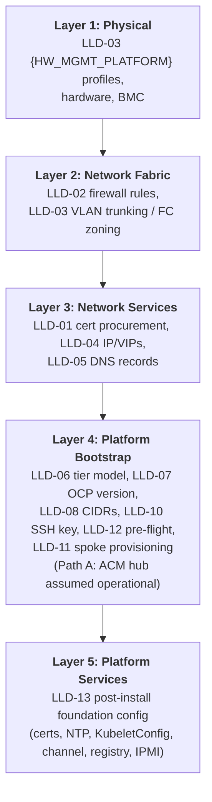
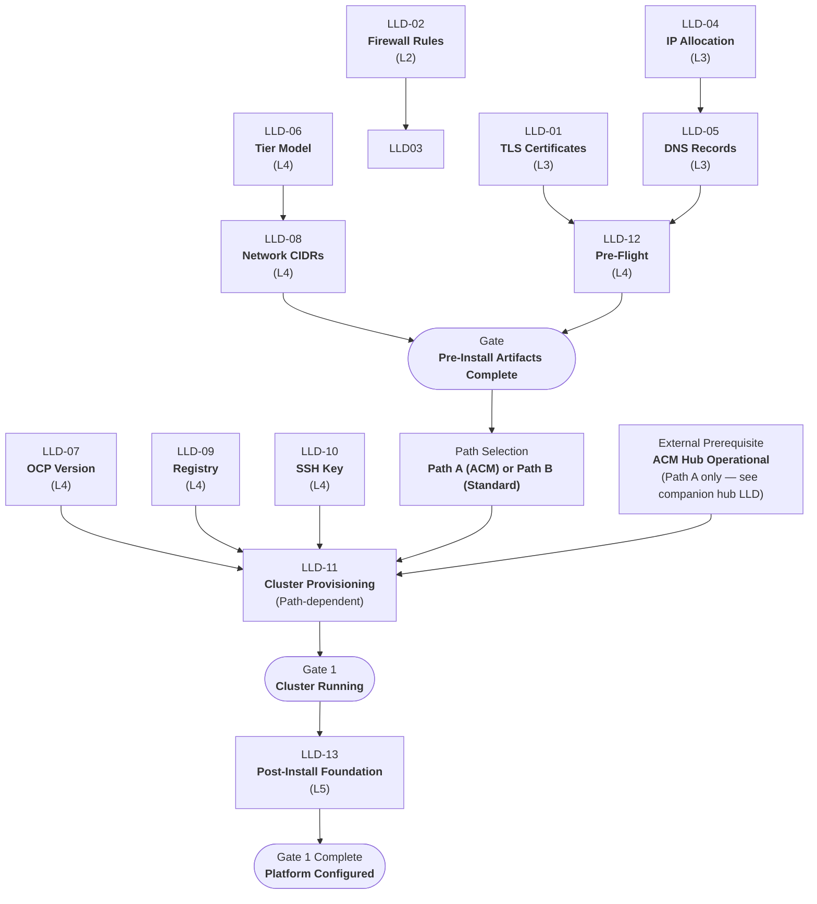

# {CLIENT} OpenShift Virtualization — Phase 1 Foundation LLD

> Replace all `{PLACEHOLDERS}` with engagement-specific values. See placeholder reference table at end of document.

---

## Document Control

| Field                  | Value                                                  |
| ---------------------- | ------------------------------------------------------ |
| **Title**              | {CLIENT} OpenShift Virtualization — Phase 1 Foundation LLD |
| **Version**            | 0.3                                                    |
| **Status**             | Draft                                                  |
| **Classification**     | Internal — Confidential                                |
| **Author**             | {AUTHOR}                                                  |
| **Reviewers**          | {REVIEWER_LIST}                                        |
| **Approval Authority** | {APPROVER}                                             |
| **Last Updated**       | 2026-06-16                                                 |

### Revision History

| Ver | Date       | Author      | Changes |
| --- | ---------- | ----------- | ------- |
| 0.1 | 2026-06-04 | {AUTHOR} | Initial Phase 1 Foundation LLD |
| 0.2 | 2026-06-16 | {AUTHOR} | Consolidated 2026-06-16 updates: prescriptiveness remediation, vendor-neutral networking language, corrected dependencies/sequencing, and dual-path LLD-11 template flow (Path A ClusterInstance, Path B install-config.yaml). |
| 0.3 | 2026-06-16 | {AUTHOR} | Split Phase 1: Foundation now assumes ACM hub is pre-existing (external prerequisite). Hub deployment flow removed from implementation diagram; Path A still requires hub but references companion hub LLD. |

---

## Scope & References

This LLD provides implementation specifications for every decision documented in HLD Phase 1 (Foundation). Each section maps 1:1 to an HLD decision and contains configuration parameters, implementation procedures, layer context, and testable acceptance criteria.

---

## Layer Model Overview



---

## Phase 1 Implementation Flow



---

## LLD-01: TLS/SSL Certificates

Procure and validate enterprise TLS certificates for API and ingress endpoints before cluster installation. Post-install certificate deployment is in LLD-13. *(ADR 24)*

### Prerequisites

| ID      | Item                                                   | Owner         | Status |
| ------- | ------------------------------------------------------ | ------------- | ------ |
| CG-01-1 | Confirm the required TLS certificate key algorithm standard with the Security team | Security Team | Open   |

### Dependencies

*No dependencies — this section can begin immediately.*

### Configuration Parameters

| Parameter              | Value                            | Description                           | Source                      |
| ---------------------- | -------------------------------- | ------------------------------------- | --------------------------- |
| API cert subject       | `api.<cluster>.<base_domain>`    | API server CN/SAN                     | HLD — Certificate Inventory |
| Ingress cert subject   | `*.apps.<cluster>.<base_domain>` | Wildcard ingress CN/SAN               | HLD — Certificate Inventory |
| cert-manager namespace | `cert-manager`                   | Operator manages rotation post Day 0  | OCP docs                    |

### Sample Configuration

No sample configuration for pre-install procurement. Post-install certificate deployment sample configs are in LLD-13.

### Tier Variance

| Parameter           | DC            | CDF           | Branch        |
| ------------------- | ------------- | ------------- | ------------- |
| API cert issuer     | Enterprise CA | Enterprise CA | Enterprise CA |
| Ingress cert issuer | Internal CA   | Internal CA   | Internal CA   |
| Wildcard exception  | Required      | Required      | Required      |

*No tier-specific variance for certificates.*

### Implementation Procedure

**Execution Readiness Checks:**

- [ ] Cluster name and base domain finalized
- [ ] Enterprise CA and Internal CA accessible
- [ ] Wildcard certificate exception approved (ADR 24)

**Steps:**

1. **Generate CSR for API certificate**
   
   - Subject: `api.<cluster>.<base_domain>`
   - SAN: `api.<cluster>.<base_domain>`
   - Key: RSA 2048 or ECDSA P-256 per enterprise policy

2. **Generate CSR for Ingress wildcard certificate**
   
   - Subject: `*.apps.<cluster>.<base_domain>`
   - SAN: `*.apps.<cluster>.<base_domain>`

3. **Submit API CSR to Enterprise CA** — follow {CLIENT} PKI submission process

4. **Submit Ingress CSR to Internal CA** — include wildcard exception reference (ADR 24)

5. **Validate received certificates:**
   
   ```bash
   openssl x509 -in api.crt -noout -text | grep -E "Subject:|DNS:"
   openssl x509 -in ingress.crt -noout -text | grep -E "Subject:|DNS:"
   openssl x509 -in api.crt -noout -dates
   openssl verify -CAfile ca-bundle.crt api.crt
   openssl verify -CAfile ca-bundle.crt ingress.crt
   ```

6. **Store certificates securely** for use post-install

> Post-install certificate deployment (ingress secret creation, IngressController patching) is in LLD-13.

**Verification:**

```bash
openssl x509 -in api.crt -noout -text | grep -E "Subject:|DNS:"
openssl verify -CAfile ca-bundle.crt api.crt
openssl verify -CAfile ca-bundle.crt ingress.crt
```

**Rollback:**

- Re-submit CSR with corrected SAN if needed
- Certificates are pre-install artifacts; no cluster-side rollback at this stage

### Acceptance Criteria

| ID      | Criterion                | Test                                                     | Expected Result                           |
| ------- | ------------------------ | -------------------------------------------------------- | ----------------------------------------- |
| AC-01-1 | API cert SAN correct     | `openssl x509 -in api.crt -noout -text \| grep DNS:`     | Contains `api.<cluster>.<base_domain>`    |
| AC-01-2 | Ingress cert SAN correct | `openssl x509 -in ingress.crt -noout -text \| grep DNS:` | Contains `*.apps.<cluster>.<base_domain>` |
| AC-01-3 | Chain validates          | `openssl verify -CAfile ca-bundle.crt <cert>`            | OK                                        |
| AC-01-4 | Not expired              | `openssl x509 -in <cert> -noout -dates`                  | notAfter is future                        |

> Post-install certificate verification (AC-14-1, AC-14-2) is in LLD-13.

---

## LLD-02: Firewall Rules & Port Requirements

Open all required inter-node, ACM hub-spoke, BMC/Ironic provisioning, and external egress firewall ports before ACM ZTP begins cluster deployment. *(ADR 16)*

### Prerequisites

| ID      | Item                                                       | Owner                     | Status |
| ------- | ---------------------------------------------------------- | ------------------------- | ------ |
| CG-02-1 | Decide whether branch network egress uses a proxy or direct firewall rules                 | Network / Architecture    | Open   |
| CG-02-2 | Finalise branch firewall rules and IP subnet allocations                                   | Network / Sam (Branch PM) | Open   |

### Dependencies

*No dependencies — this section can begin immediately.*

### Reference

| Parameter                                       | Value                     | Description                                                       | Source                |
| ----------------------------------------------- | ------------------------- | ----------------------------------------------------------------- | --------------------- |
| Egress model (DC/CDF)                           | Firewall-only             | No cluster-wide proxy                                             | ADR 16                |
| Egress model (Branch)                           | **TBD**                   | Firewall or proxy pending branch infra maturity                   | ADR 16                |
| Inter-node — ICMP                               | ICMP all                  | Network reachability tests                                        | OCP install guide     |
| Inter-node — metrics                            | TCP 1936                  | Ingress health-check probes                                       | OCP install guide     |
| Inter-node — host services                      | TCP/UDP 9000-9999         | node-exporter, CVO, etc.                                          | OCP install guide     |
| Inter-node — kubelet                            | TCP 10250-10259           | Kubernetes reserved                                               | OCP install guide     |
| Inter-node — MCS                                | TCP 22623                 | Machine Config Server                                             | OCP install guide     |
| Inter-node — Geneve                             | UDP 6081                  | OVN-Kubernetes overlay                                            | OCP install guide     |
| Inter-node — NodePort                           | TCP/UDP 30000-32767       | NodePort range                                                    | OCP install guide     |
| All → CP — API                                  | TCP 6443                  | Kubernetes API                                                    | OCP install guide     |
| CP ↔ CP — etcd                                  | TCP 2379-2380             | etcd server + peer                                                | OCP install guide     |
| LB → CP                                         | TCP 6443, 22623           | API + MCS                                                         | OCP install guide     |
| LB → Workers                                    | TCP 80, 443               | HTTP/HTTPS ingress                                                | OCP install guide     |
| **ACM Hub → Managed Cluster**                   |                           |                                                                   |                       |
| Hub → Managed — Search logs                     | TCP 443                   | Log retrieval via Search console (klusterlet-addon-workmgr)       | RHACM 2.12 networking |
| Hub → Managed — API                             | TCP 6443                  | Kubernetes API for klusterlet install (Hive + import-controller)  | RHACM 2.12 networking |
| **Managed Cluster → ACM Hub**                   |                           |                                                                   |                       |
| Managed → Hub — metrics/alerts                  | TCP 443                   | Push Observability metrics, alerts, cluster proxy add-on          | RHACM 2.12 networking |
| Managed → Hub — API watch                       | TCP 6443                  | Watch hub API server for policy/config changes                    | RHACM 2.12 networking |
| **ACM Hub → BMC**                               |                           |                                                                   |                       |
| Hub → BMC — Redfish                             | TCP 443                   | Redfish management (power state, virtual media boot)              | MCE Infra Operator    |
| **BMC → ACM Hub (Ironic)**                      |                           |                                                                   |                       |
| BMC → Hub — virtual media HTTP                  | TCP 6180                  | BMC pulls discovery ISO from hub Ironic HTTP server               | MCE Infra Operator    |
| BMC → Hub — virtual media TLS                   | TCP 6183                  | BMC pulls discovery ISO from hub Ironic HTTPS server              | MCE Infra Operator    |
| **Hub Ironic ↔ Managed Node (provisioning)**    |                           |                                                                   |                       |
| Hub Ironic → Node — IPA callback                | TCP 9999                  | Ironic conductor to Ironic Python Agent on bare-metal node        | MCE Infra Operator    |
| Node IPA → Hub Ironic — API                     | TCP 6385                  | Ironic Python Agent communicates with Ironic API on hub           | MCE Infra Operator    |
| **Managed Cluster → Hub (provisioning)**        |                           |                                                                   |                       |
| Managed → Hub — assistedService                 | TCP 443                   | Report hardware info via assistedService route during install     | MCE Infra Operator    |
| **Managed Cluster → Image Repo (provisioning)** |                           |                                                                   |                       |
| Managed → Image Repo — rootfs                   | TCP 443 (80 disconnected) | Download rootfs/ISO image during cluster install                  | MCE Infra Operator    |
| **ACM Hub → External**                          |                           |                                                                   |                       |
| Hub → ObjectStore — Observability               | TCP 443                   | Thanos long-term metrics storage (ICOS / Cluster Backup Operator) | RHACM 2.12 networking |
| Hub → Channel sources — GitOps                  | TCP 443                   | Git, Helm, Object Store for Application lifecycle / ArgoCD        | RHACM 2.12 networking |
| **External Connectivity**                       |                           |                                                                   |                       |
| External — NTP                                  | UDP 123                   | Time sync                                                         | OCP firewall guide    |
| External — registry                             | TCP 443                   | {REGISTRY_MIRROR} pull-through cache                                    | ADR 4                 |
| External — DNS                                  | TCP/UDP 53                | CoreDNS to upstream                                               | OCP firewall guide    |

### Egress URL Allowlist

The hub cluster (and {REGISTRY_MIRROR} itself) must reach the following upstream URLs on TCP 443 even when {REGISTRY_MIRROR} is the pull-through cache. Spoke clusters pull through {REGISTRY_MIRROR}; the per-spoke allowlist may be limited to {REGISTRY_MIRROR} only. Branch spoke egress is TBD per ADR 16. *(Source: [OCP 4.21 — Configuring your firewall](https://docs.redhat.com/en/documentation/openshift_container_platform/4.21/html/installation_configuration/configuring-firewall), HLD Firewall Port Matrix, ADR 16)*

| Category                                                      | URL                                                     | Port | Purpose                                             | Required On       |
| ------------------------------------------------------------- | ------------------------------------------------------- | ---- | --------------------------------------------------- | ----------------- |
| **Container Registries**                                      |                                                         |      |                                                     |                   |
|                                                               | `registry.redhat.io`                                    | 443  | Core container images                               | Hub + {REGISTRY_MIRROR} |
|                                                               | `registry.access.redhat.com` (or `*.access.redhat.com`) | 443  | Red Hat Ecosystem Catalog images                    | Hub + {REGISTRY_MIRROR} |
|                                                               | `access.redhat.com`                                     | 443  | Image signature verification                        | Hub + {REGISTRY_MIRROR} |
|                                                               | `quay.io` / `*.quay.io`                                 | 443  | Core container images + CDN                         | Hub + {REGISTRY_MIRROR} |
|                                                               | `sso.redhat.com`                                        | 443  | Authentication for console.redhat.com               | Hub               |
| **Cluster Lifecycle**                                         |                                                         |      |                                                     |                   |
|                                                               | `api.openshift.com`                                     | 443  | Cluster token + update availability checks          | Hub + Spokes      |
|                                                               | `console.redhat.com`                                    | 443  | Cluster token + Insights                            | Hub + Spokes      |
|                                                               | `mirror.openshift.com`                                  | 443  | Mirrored install content + release image signatures | Hub               |
|                                                               | `rhcos.mirror.openshift.com`                            | 443  | RHCOS images for Assisted Installer                 | Hub               |
|                                                               | `storage.googleapis.com/openshift-release`              | 443  | Release image signatures (alternate source)         | Hub               |
|                                                               | `quayio-production-s3.s3.amazonaws.com`                 | 443  | Quay image content on AWS S3                        | Hub + {REGISTRY_MIRROR} |
| **Telemetry / Insights** (required unless Telemetry disabled) |                                                         |      |                                                     |                   |
|                                                               | `cert-api.access.redhat.com`                            | 443  | Telemetry                                           | Hub + Spokes      |
|                                                               | `api.access.redhat.com`                                 | 443  | Telemetry                                           | Hub + Spokes      |
|                                                               | `infogw.api.openshift.com`                              | 443  | Telemetry                                           | Hub + Spokes      |
| **GitOps**                                                    |                                                         |      |                                                     |                   |
|                                                               | `github.{CLIENT_DOMAIN}`                                       | 443  | GitHub Enterprise — ArgoCD + ACM policy repos       | Hub               |
|                                                               | `*.github.com`                                          | 443  | GitHub.com — GitOps dependencies                    | Hub               |
| **Third-Party Operators**                                     |                                                         |      |                                                     |                   |
|                                                               | `registry.connect.redhat.com`                           | 443  | Certified operators + third-party images            | Hub + {REGISTRY_MIRROR} |

> **Wildcard simplification:** `*.quay.io` can replace `cdn.quay.io` and `cdn01`–`cdn06.quay.io`. `*.access.redhat.com` can replace `registry.access.redhat.com` and `access.redhat.com`.

> **Operator health-check routes:** OCP operators require egress to three application routes for health checks. If `*.apps.<cluster>.<base_domain>` is not globally allowed at the firewall, the following routes must be explicitly permitted per cluster:
> 
> - `oauth-openshift.apps.<cluster>.<base_domain>`
> - `canary-openshift-ingress-canary.apps.<cluster>.<base_domain>`
> - `console-openshift-console.apps.<cluster>.<base_domain>` (or the hostname in `consoles.operator/cluster` spec if overridden)
> 
> *(Source: [OCP 4.21 — Configuring your firewall](https://docs.redhat.com/en/documentation/openshift_container_platform/4.21/html/installation_configuration/configuring-firewall))*

### Sample Configuration

**Firewall change request template (per cluster):**

```
Cluster: <cluster_name>
Site: <site_name>
Tier: DC / CDF / Branch
ACM Hub: <hub_cluster_fqdn> / <hub_api_vip>

Source → Destination rules:

  --- OCP Inter-Cluster ---
  Inter-node (all ↔ all): ICMP, TCP 1936, TCP/UDP 9000-9999, TCP 10250-10259,
                           TCP 22623, UDP 6081, TCP/UDP 30000-32767
  All → CP: TCP 6443
  CP ↔ CP: TCP 2379-2380
  LB → CP: TCP 6443, TCP 22623
  LB → Workers: TCP 80, TCP 443

  --- ACM Hub ↔ Managed Cluster ---
  Hub → Managed:  TCP 443 (Search/logs), TCP 6443 (klusterlet install)
  Managed → Hub:  TCP 443 (metrics/alerts/proxy), TCP 6443 (API watch)

  --- ACM ZTP Provisioning (MCE Infrastructure Operator) ---
  Hub → BMC:        TCP 443 (Redfish management)
  BMC → Hub:        TCP 6180 (virtual media HTTP), TCP 6183 (virtual media TLS)
  Hub Ironic → Node: TCP 9999 (IPA callback)
  Node IPA → Hub:   TCP 6385 (Ironic API)
  Managed → Hub:    TCP 443 (assistedService hardware report)
  Managed → Repo:   TCP 443 (rootfs/ISO download)

  --- ACM Hub External Egress ---
  Hub → ObjectStore: TCP 443 (Observability/Thanos long-term metrics)
  Hub → Channels:    TCP 443 (Git/Helm/Object Store for GitOps)

  --- General External ---
  External: UDP 123 (NTP), TCP 443 ({REGISTRY_MIRROR}), TCP/UDP 53 (DNS)

  --- Egress URL Allowlist (TCP 443 — Hub + {REGISTRY_MIRROR}) ---
  Registries:  registry.redhat.io, *.quay.io, *.access.redhat.com, sso.redhat.com
  Lifecycle:   api.openshift.com, console.redhat.com, mirror.openshift.com,
               rhcos.mirror.openshift.com, storage.googleapis.com/openshift-release
  Telemetry:   cert-api.access.redhat.com, api.access.redhat.com,
               infogw.api.openshift.com
  GitOps:      github.{CLIENT_DOMAIN}, *.github.com
  Third-party: registry.connect.redhat.com
```

### Tier Variance

| Parameter                         | DC                                   | CDF                                  | Branch                               |
| --------------------------------- | ------------------------------------ | ------------------------------------ | ------------------------------------ |
| Egress model                      | Firewall-only                        | Firewall-only                        | **TBD**                              |
| Firewall locations                | {SITE_1}/{SITE_2}/{SITE_3}                 | Site-specific                        | **TBD**                              |
| MCE Infra Operator / Ironic ports | Yes (ACM ZTP via Assisted Installer) | Yes (ACM ZTP via Assisted Installer) | Yes (ACM ZTP via Assisted Installer) |
| VM traffic impacted               | No (bridged VLANs)                   | No (bridged VLANs)                   | No (bridged VLANs)                   |

### Implementation Procedure

**Execution Readiness Checks:**

- [ ] Cluster name, node IPs, VIPs, and BMC IPs finalized
- [ ] ACM hub API VIP, hub route FQDN, and assistedService route known
- [ ] Hub Ironic service IP (for virtual media / IPA ports) identified
- [ ] Network team firewall change request process available
- [ ] Firewall team capacity for rule creation

<mark>**Steps:</mark>**

1. **Prepare firewall change request** using the port matrix above, substituting cluster-specific IPs

2. **Submit change request** to Network team per {CLIENT} change management process

3. **Network team implements rules** on site-specific firewalls ({SITE_1}, {SITE_2}, {SITE_3}, or CDF/Branch firewalls)

4. **Validate inter-node connectivity:**
   
   ```bash
   nc -zv <peer_node_ip> 6443
   nc -zv <peer_node_ip> 2379
   nc -zv <peer_node_ip> 22623
   nc -zv <peer_node_ip> 10250
   ```

5. **Validate ACM hub → managed cluster connectivity (from hub):**
   
   ```bash
   nc -zv <managed_cluster_route> 443   # Search/log retrieval
   nc -zv <managed_cluster_api> 6443    # klusterlet install
   ```

6. **Validate managed cluster → ACM hub connectivity (from spoke):**
   
   ```bash
   nc -zv <acm_hub_route> 443           # metrics/alerts push
   nc -zv <acm_hub_api> 6443            # API watch
   ```

7. **Validate BMC/Redfish connectivity from hub:**
   
   ```bash
   curl -sk https://<bmc_ip>/redfish/v1/Systems
   nc -zv <bmc_ip> 443
   ```

8. **Validate MCE Infrastructure Operator provisioning ports (from hub):**
   
   ```bash
   nc -zv <bmc_ip> 6180                 # virtual media HTTP
   nc -zv <bmc_ip> 6183                 # virtual media TLS
   ```

9. **Validate assistedService route reachability (from spoke network):**
   
   ```bash
   curl -sk https://<hub_assisted_service_route>/api/v2/infra-envs
   ```

10. **Validate external egress:**
    
    ```bash
    nc -zv <registry_mirror_host> 443
    nc -zv <ntp_server> 123
    dig +short @<upstream_dns> redhat.com
    ```

11. **Validate egress URL allowlist (from hub):**
    
    ```bash
    curl -sk https://registry.redhat.io/v2/ | head -1
    curl -sk https://quay.io/v2/ | head -1
    curl -sk https://console.redhat.com -o /dev/null -w "%{http_code}"
    curl -sk https://github.{CLIENT_DOMAIN} -o /dev/null -w "%{http_code}"
    ```

**Verification:**

```bash
echo "=== Inter-node ==="
for port in 6443 22623 2379 10250 443 80; do
  echo "Port $port: $(nc -zv <target_node_ip> $port 2>&1)"
done

echo "=== Spoke → Hub ==="
for port in 443 6443; do
  echo "Hub port $port: $(nc -zv <acm_hub_ip> $port 2>&1)"
done

echo "=== Hub → BMC / Ironic ==="
for port in 443 6180 6183; do
  echo "BMC port $port: $(nc -zv <bmc_ip> $port 2>&1)"
done
```

**Rollback:**

- Reverse firewall change request via Network team
- Ports revert to blocked state

### Acceptance Criteria

| ID       | Criterion                          | Test                                                              | Expected Result     |
| -------- | ---------------------------------- | ----------------------------------------------------------------- | ------------------- |
| AC-02-1  | API port reachable                 | `nc -zv <api_vip> 6443`                                           | Connection succeeds |
| AC-02-2  | MCS port reachable                 | `nc -zv <cp_node> 22623`                                          | Connection succeeds |
| AC-02-3  | etcd ports reachable               | `nc -zv <cp_node> 2379`                                           | Connection succeeds |
| AC-02-4  | Ingress ports reachable            | `nc -zv <ingress_vip> 443`                                        | Connection succeeds |
| AC-02-5  | BMC reachable from hub (Redfish)   | `curl -sk https://<bmc_ip>/redfish/v1/Systems`                    | HTTP 200            |
| AC-02-6  | NTP reachable                      | `nc -zvu <ntp_server> 123`                                        | Connection succeeds |
| AC-02-7  | {REGISTRY_MIRROR} reachable              | `curl -sk https://<registry_mirror>/v2/`                              | HTTP 200 or 401     |
| AC-02-8  | Hub → managed cluster route (logs) | `nc -zv <managed_cluster_route> 443`                              | Connection succeeds |
| AC-02-9  | Managed → hub route (metrics push) | `nc -zv <acm_hub_route> 443`                                      | Connection succeeds |
| AC-02-10 | Managed → hub API (policy watch)   | `nc -zv <acm_hub_api> 6443`                                       | Connection succeeds |
| AC-02-11 | BMC → hub virtual media HTTP       | `nc -zv <hub_ironic_ip> 6180`                                     | Connection succeeds |
| AC-02-12 | BMC → hub virtual media TLS        | `nc -zv <hub_ironic_ip> 6183`                                     | Connection succeeds |
| AC-02-13 | Hub assistedService reachable      | `curl -sk https://<hub_assisted_route>/api/v2/infra-envs`         | HTTP 200 or 401     |
| AC-02-14 | Red Hat registry reachable (hub)   | `curl -sk https://registry.redhat.io/v2/`                         | HTTP 200 or 401     |
| AC-02-15 | Quay registry reachable (hub)      | `curl -sk https://quay.io/v2/`                                    | HTTP 200 or 401     |
| AC-02-16 | GitHub Enterprise reachable (hub)  | `curl -sk https://github.{CLIENT_DOMAIN} -o /dev/null -w "%{http_code}"` | HTTP 200 or 301     |

---

## LLD-03: Hardware Provisioning & Network Fabric

Configure Cisco {HW_MGMT_PLATFORM} server profiles, PCI placement, switch zoning, VLAN trunking, and multi-NIC layout to prepare the physical infrastructure. Post-install PSI and IPMI hardening are in LLD-13. *(ADR 7)*

### Prerequisites

| ID      | Item                                                      | Owner              | Status |
| ------- | --------------------------------------------------------- | ------------------ | ------ |
| CG-03-1 | Finalise the two-network-interface layout for branch nodes                                                          | Network Team       | Open   |
| CG-03-2 | Validate server BIOS settings against OpenShift hardware requirements                                               | Platform / Red Hat | Open   |
| CG-03-3 | Deliver the IPMI post-install hardening procedure for all deployed nodes (tracked in LLD-13)                        | Platform / Cisco   | Open   |
| CG-03-4 | Confirm which NTP source takes precedence for BIOS time synchronisation ({HW_MGMT_PLATFORM} vs BIOS setting)       | BC Team / Cisco    | Open   |

### Dependencies

| Blocked By | Reason                    |
| ---------- | ------------------------- |
| LLD-02     | Firewall rules open       |

### Configuration Parameters

| Parameter        | Value                                  | Description                        | Source              |
| ---------------- | -------------------------------------- | ---------------------------------- | ------------------- |
| BIOS profile     | Cisco "virtualization" preset          | VT-x, VT-d, NX bit enabled         | [CVD][cvd] baseline |
| Boot mode        | UEFI                                   | Local disk or SAN boot             | OCP requirement     |
| vNIC 0           | FI-A, management VLAN                  | MTU 1500                           | HLD                 |
| vNIC 1           | FI-B, all VM VLANs                     | MTU 1500                           | HLD                 |
| vNIC 2           | Dedicated, migration VLAN              | MTU 9000                           | HLD                 |
| vNIC 3           | Dedicated, backup VLAN                 | MTU 9000                           | HLD                 |
| PCI placement    | Enabled in all profile templates       | Resolves Broadcom NIC reordering   | ADR 7               |
| IPMI encryption  | Disabled at Day 0                      | Hardened post-install — see LLD-13 | [{HW_VENDOR} CVD][cvd]    |
| Ethernet adapter | Interrupt coalescing, RSS, ring buffer | Per CVD sizing                     | [{HW_VENDOR} CVD][cvd]    |
| PSI kernel arg   | `psi=1` via MachineConfig              | Applied post-install — see LLD-13  | ADR 40              |

### Sample Configuration

No sample configuration for pre-install hardware provisioning. PSI MachineConfig and IPMI hardening sample configs are in LLD-13.

### Tier Variance

| Parameter           | DC                       | CDF                      | Branch                  |
| ------------------- | ------------------------ | ------------------------ | ----------------------- |
| vNIC count          | 4 (full bond separation) | 4 (baseline)             | 2 (TBD, combined bonds) |
| FC HBA / SAN zoning | Required                 | Required                 | N/A                     |
| Hardware model      | UCS M8                   | UCS M8                   | Unified Edge            |
| Storage VLAN        | Site-specific, 9000/9216 | Site-specific, 9000/9216 | N/A (local ODF)         |
| Migration VLAN      | Dedicated, 9000          | Dedicated, 9000          | N/A (shared bond TBD)   |
| FC SAN zoning       | Required                 | Required                 | N/A                     |

### Implementation Procedure

**Execution Readiness Checks:**

- [ ] Cisco UCS M8 hardware racked, powered, registered in {HW_MGMT_PLATFORM}
- [ ] {HW_MGMT_PLATFORM} account with admin privileges
- [ ] VLAN IDs for all network layers determined
- [ ] WWPN pools defined (if FC SAN boot)
- [ ] Data center switch access credentials available

**Steps — L1: Server Profiles (Infrastructure Team):**

1. **Create BIOS policy** — base: Cisco "virtualization" preset; verify VT-x, VT-d, NX bit

2. **Create Boot policy** — UEFI; local disk or SAN boot

3. **Create vNIC policies:**
   
   | vNIC   | Fabric    | VLANs        | Purpose               | MTU  |
   | ------ | --------- | ------------ | --------------------- | ---- |
   | vNIC 0 | FI-A      | Management   | OCP management        | 1500 |
   | vNIC 1 | FI-B      | All VM VLANs | VM data (OVS bridges) | 1500 |
   | vNIC 2 | Dedicated | Migration    | Live migration        | 9000 |
   | vNIC 3 | Dedicated | Backup       | {BACKUP_VENDOR} backup         | 9000 |

4. **Enable PCI placement rules** in the server profile template (ADR 7)

5. **Configure IPMI** — deploy with encryption disabled per [CVD][cvd]

6. **Create Ethernet adapter policies** — interrupt coalescing, RSS, ring buffer per [CVD][cvd]

7. **Create server profile template** combining all policies

8. **Derive and apply profiles** to each physical server

9. **Verify profile application** — {HW_MGMT_PLATFORM} console: all profiles status "OK"

**Steps — L2: Network Fabric (Network Team):**

10. **Configure VLAN trunking** on data center switches:
    
    - Management (1500), VM Data (1500), Storage (9000), Migration (9000), Backup (9000), BMC (1500)

11. **Configure FC SAN zoning** (DC/CDF only) — zone each node FC HBA WWPN to {BLOCK_STORAGE_ARRAY} targets

12. **Verify MTU end-to-end:**
    
    ```bash
    ping -M do -s 8972 <peer_migration_ip>
    ```

**Verification:**

```bash
ip link show
curl -sk https://<bmc_ip>/redfish/v1/Systems
ip link show <iface> | grep mtu
```

**Rollback:**

- Unapply server profile from {HW_MGMT_PLATFORM}; server reverts on reboot
- Revert switch config to pre-change snapshot
- Remove FC SAN zones via switch CLI

### Acceptance Criteria

| ID      | Criterion          | Test                                           | Expected Result    |
| ------- | ------------------ | ---------------------------------------------- | ------------------ |
| AC-03-1 | Profiles applied   | {HW_MGMT_PLATFORM} console                             | Status: OK         |
| AC-03-2 | NIC names stable   | `ip link show` across reboot                   | Names unchanged    |
| AC-03-3 | BMC reachable      | `curl -sk https://<bmc_ip>/redfish/v1/Systems` | HTTP 200           |
| AC-03-4 | MTU correct        | `ip link show <iface> \| grep mtu`             | Expected MTU       |
| AC-03-5 | FC SAN zone active | Switch CLI — zone membership                   | Correct WWPN pairs |

---

## LLD-04: IP Reservations & Load Balancer VIPs

Reserve all node IPs, API/ingress VIPs, BMC IPs, and storage interface IPs in {IPAM_PLATFORM} (IPAM) per cluster and validate no address conflicts exist. DNS record creation for these IPs is handled in LLD-05. *(ADR 12)*

### Prerequisites

| ID      | Item                                                           | Owner        | Status |
| ------- | -------------------------------------------------------------- | ------------ | ------ |
| CG-04-1 | Decide the IP address management strategy for branch nodes (static allocation on shared /23 subnets confirmed or alternative) | Network Team | Open   |
| CG-04-2 | Decide whether IPv6 is in scope for Phase 1 or explicitly deferred                                                           | Architecture | Open   |

### Dependencies

| Blocked By | Reason                                                              |
| ---------- | ------------------------------------------------------------------- |
| None       | IP reservations can be allocated during planning before LLD-03 work |

### Configuration Parameters

| Parameter             | Value                              | Description                                      | Source            |
| --------------------- | ---------------------------------- | ------------------------------------------------ | ----------------- |
| API VIP               | 1 per cluster on baremetal network | Floats via keepalived                            | ADR 12            |
| Ingress VIP           | 1 per cluster on baremetal network | Floats via keepalived                            | ADR 12            |
| CP node IPs           | 3 static per cluster               | NMState-managed                                  | HLD               |
| Worker node IPs       | N static per cluster               | NMState-managed                                  | HLD               |
| BMC/CIMC IPs          | 1 per node on management/BMC VLAN  | Out-of-band management                           | HLD               |
| Storage interface IPs | 1 per node on storage VLAN         | FC (DC/CDF); ODF (Branch)                        | HLD               |
| LB target — API       | TCP 6443, TCP 22623                | Backend: control plane nodes                     | OCP install guide |
| LB target — Ingress   | TCP 80, TCP 443                    | Backend: workers (or all if schedulable masters) | OCP install guide |
| IPAM system           | {IPAM_PLATFORM}                           | Enterprise DNS/IPAM                              | ADR 13            |
| F5 role               | DNS path only (GTM)                | Pool members are {IPAM_PLATFORM}; not LB for OCP        | ADR 12            |

### Sample Configuration

**NMState static IP (worker node example):**

```yaml
apiVersion: nmstate.io/v1
kind: NodeNetworkConfigurationPolicy
metadata:
  name: worker-0-static-ip
spec:
  nodeSelector:
    kubernetes.io/hostname: worker-0
  desiredState:
    interfaces:
      - name: ens1f0
        type: ethernet
        state: up
        ipv4:
          enabled: true
          address:
            - ip: 10.x.x.10
              prefix-length: 24
          dhcp: false
        mtu: 1500
```

### Tier Variance

| Parameter             | DC                          | CDF                         | Branch                                 |
| --------------------- | --------------------------- | --------------------------- | -------------------------------------- |
| Worker node count     | 16+                         | Variable (4-10)             | 0 (compact — 3 CP/worker)              |
| Total IPs per cluster | ~30+                        | ~20-30                      | ~12                                    |
| Subnet model          | Dedicated OCP subnets       | Dedicated or shared         | Shared /23 with non-OCP                |
| Storage interface IPs | FC SAN (site-specific VLAN) | FC SAN (site-specific VLAN) | ODF (local, no dedicated storage VLAN) |

### Implementation Procedure

**Execution Readiness Checks:**

- [ ] Cluster name, tier, and node count finalized
- [ ] {IPAM_PLATFORM} access with permissions to create reservations
- [ ] Baremetal network VLAN and subnet identified
- [ ] BMC/CIMC VLAN identified

**Steps:**

1. **Calculate IP requirements** per cluster:
   
   - 2 VIPs (API + Ingress)
   - 3 CP node IPs
   - N worker node IPs
   - 1 BMC IP per node
   - 1 storage interface IP per node (DC/CDF)

2. **Reserve all IPs in {IPAM_PLATFORM}** — ensure VIPs are not assigned to any host

3. **Reserve BMC IPs** on the management/BMC VLAN

4. **Document IP-to-host mapping** for Red Hat delivery team

5. **Validate no IP conflicts:**
   
   ```bash
   for ip in <list_of_ips>; do
     arping -D -c 3 $ip
   done
   ```

6. **Validate VIP L2 adjacency** — keepalived requires VRRP on the same L2 segment

**Verification:**

```bash
arping -D -c 3 <api_vip>
arping -D -c 3 <ingress_vip>
ping -c 1 <node_ip>
```

**Rollback:**

- Release IP reservations in {IPAM_PLATFORM}
- IPs return to available pool

### Acceptance Criteria

| ID      | Criterion                     | Test                         | Expected Result           |
| ------- | ----------------------------- | ---------------------------- | ------------------------- |
| AC-04-1 | All IPs reserved              | {IPAM_PLATFORM} query               | All cluster IPs allocated |
| AC-04-2 | No IP conflicts               | `arping -D -c 3 <ip>` per IP | No duplicate detected     |
| AC-04-3 | VIPs not host-assigned        | {IPAM_PLATFORM} — VIP records       | Reserved but unassigned   |
| AC-04-4 | IP-to-host mapping documented | Mapping document reviewed    | Complete and accurate     |

---

## LLD-05: DNS, Static IPs & NTP

Create DNS A/PTR records in {IPAM_PLATFORM} for the IPs reserved in LLD-04 and validate resolution before cluster installation. Post-install NTP/chrony configuration is in LLD-13. *(ADR 48)*

### Prerequisites

| ID      | Item                                                            | Owner           | Status |
| ------- | --------------------------------------------------------------- | --------------- | ------ |
| CG-05-1 | Confirm the NTP server(s) for branch clusters (tracked in LLD-13)                                     | Network Team    | Open   |
| CG-05-2 | Validate BIOS time synchronisation with Cisco across all server models (tracked in LLD-13)            | BC Team / Cisco | Open   |

### Dependencies

| Blocked By | Reason                            |
| ---------- | --------------------------------- |
| LLD-04     | IP reservations allocated in IPAM |

### Configuration Parameters

| Parameter        | Value                                          | Description           | Source            |
| ---------------- | ---------------------------------------------- | --------------------- | ----------------- |
| DNS provider     | {IPAM_PLATFORM}                                       | Enterprise DNS        | HLD               |
| API record       | `api.<cluster>.<base_domain>` → API VIP        | A + PTR               | OCP install guide |
| API-int record   | `api-int.<cluster>.<base_domain>` → API VIP    | A + PTR               | OCP install guide |
| Ingress wildcard | `*.apps.<cluster>.<base_domain>` → Ingress VIP | Wildcard A            | OCP install guide |
| Node records     | `<hostname>.<cluster>.<base_domain>` → node IP | A + PTR per node      | OCP install guide |
| TTL              | 300s (recommended during deployment)           | Raise post-validation | Best practice     |

### Tier Variance

| Parameter         | DC                 | CDF             | Branch    |
| ----------------- | ------------------ | --------------- | --------- |
| Node record count | 3 CP + 16+ workers | 3 CP + variable | 3 compact |
| DNS provider      | {IPAM_PLATFORM}           | {IPAM_PLATFORM}        | {IPAM_PLATFORM}  |

### Implementation Procedure

**Execution Readiness Checks:**

- [ ] IP allocations completed (LLD-04)
- [ ] Cluster name and base domain finalized
- [ ] {IPAM_PLATFORM} access

**Steps — L3: DNS Records (Network Team):**

1. **Create API records:**
   
   ```
   api.<cluster>.<base_domain>        A     <api_vip>
   api-int.<cluster>.<base_domain>    A     <api_vip>
   <api_vip>                          PTR   api.<cluster>.<base_domain>
   ```

2. **Create Ingress wildcard record:**
   
   ```
   *.apps.<cluster>.<base_domain>     A     <ingress_vip>
   ```

3. **Create per-node records** (A + PTR for each node)

4. **Wait for DNS propagation**

5. **Validate all records:**
   
   ```bash
   dig +short api.<cluster>.<base_domain>
   dig +short api-int.<cluster>.<base_domain>
   dig +short test.apps.<cluster>.<base_domain>
   dig +short <hostname>.<cluster>.<base_domain>
   dig +short -x <node_ip>
   ```

**Rollback:**

- DNS: delete records from {IPAM_PLATFORM} (non-destructive)

### Acceptance Criteria

| ID      | Criterion              | Test                                            | Expected Result |
| ------- | ---------------------- | ----------------------------------------------- | --------------- |
| AC-05-1 | API DNS resolves       | `dig +short api.<cluster>.<base_domain>`        | API VIP         |
| AC-05-2 | API-int DNS resolves   | `dig +short api-int.<cluster>.<base_domain>`    | API VIP         |
| AC-05-3 | Wildcard resolves      | `dig +short test.apps.<cluster>.<base_domain>`  | Ingress VIP     |
| AC-05-4 | Node A records resolve | `dig +short <hostname>.<cluster>.<base_domain>` | Node IP         |
| AC-05-5 | PTR records resolve    | `dig +short -x <node_ip>`                       | FQDN            |

> 

---

## LLD-06: Tier Classification and Policy Binding

Define the ACM tier classification label taxonomy, placement structure, and policy binding manifests. Manifests are pre-staged in Git before any cluster exists; they are applied to the ACM hub during Phase 2 (Platform Build). Tier architecture and sizing definitions remain in HLD Phase 1 (`Deployment Tier Model`). *(ADR 5, 6)*

### Prerequisites

| ID      | Item                                                                 | Owner                | Status |
| ------- | -------------------------------------------------------------------- | -------------------- | ------ |
| CG-06-1 | Tier definitions approved in HLD (`Deployment Tier Model`)           | Architecture lead | Open   |
| CG-06-2 | Tier-specific PolicySet names finalized in GitOps repositories       | Platform / Monte     | Open   |

### Dependencies

*No dependencies — this section can begin immediately.*

### Configuration Parameters

| Parameter                       | Value                                                        | Description                                      | Source |
| ------------------------------- | ------------------------------------------------------------ | ------------------------------------------------ | ------ |
| Tier label key                 | `tier`                                                       | Primary selector for ACM placement               | ADR 5  |
| Tier label values              | `datacenter`, `cdf`, `branch`                                | Fleet-standard tier identifiers                  | LLD-06 |
| Cluster class label key        | `cluster-class`                                              | Tier-specific baseline class                     | LLD-06 |
| Cluster class values           | `dc-standard`, `cdf-standard`, `branch-compact`              | Used by overlays and policy targeting            | LLD-06 |
| Storage profile label values   | `{BLOCK_STORAGE_ARRAY}-fc`, `odf-local`                      | Drives storage policy overlays                   | ADR 6  |
| Network profile label values   | `4nic-dedicated`, `2nic-compact`                             | Drives network policy overlays                   | ADR 6  |
| Policy namespace               | `policies`                                                   | Namespace for Placement/Binding/PolicySet        | ACM    |
| Placement naming               | `placement-<tier>`                                           | Standardized naming for cluster selection        | LLD-06 |
| PlacementBinding naming        | `bind-<tier>-foundation`                                     | Standardized naming for tier foundation bindings | LLD-06 |

### Sample Configuration

**ACM ManagedCluster labels (tier identification):**

```yaml
apiVersion: cluster.open-cluster-management.io/v1
kind: ManagedCluster
metadata:
  name: dc-{SITE_1}-prod-01
  labels:
    tier: datacenter
    site: {SITE_1}
    environment: production
    cluster-class: dc-standard
```

### Tier Mapping

| Label Key         | Datacenter Value         | CDF Value                | Branch Value             |
| ----------------- | ------------------------ | ------------------------ | ------------------------ |
| `tier`            | `datacenter`             | `cdf`                    | `branch`                 |
| `environment`     | `production` / `nonprod` | `production` / `nonprod` | `production` / `nonprod` |
| `cluster-class`   | `dc-standard`            | `cdf-standard`           | `branch-compact`         |
| `storage-profile` | `{BLOCK_STORAGE_ARRAY}-fc` | `{BLOCK_STORAGE_ARRAY}-fc` | `odf-local`            |
| `network-profile` | `4nic-dedicated`         | `4nic-dedicated`         | `2nic-compact`           |

### Implementation Procedure

**Execution Readiness Checks:**

- [ ] Tier definitions approved in HLD
- [ ] Tier-specific PolicySet names finalized in GitOps repositories
- [ ] Tier-specific label values documented and agreed

**Steps (Pre-Install — pre-stage manifests in Git):**

1. **Define tier label taxonomy** — finalize label keys and values per the Configuration Parameters table above.

2. **Author Placement and PlacementBinding manifests** for each tier (see sample configuration above) and commit to the GitOps policy repository.

3. **Peer review manifests** — confirm label selectors match the taxonomy; confirm PolicySet names align with CG-06-2.

> The manifests authored above are applied to the ACM hub during Phase 2 (Platform Build). Tier labels are carried into each spoke cluster through the ClusterInstance manifest used in LLD-11.

**Verification:**

```bash
git log --oneline -- policies/placement-*.yaml
git diff HEAD -- policies/
```

**Rollback:**

- Revert the Git commit containing incorrect manifests; re-run peer review

### Acceptance Criteria

| ID      | Criterion                             | Test                                      | Expected Result                            |
| ------- | ------------------------------------- | ----------------------------------------- | ------------------------------------------ |
| AC-06-1 | Tier label taxonomy documented        | Review of committed manifests in GitOps repo | Label keys/values match Configuration Parameters table |
| AC-06-2 | Placement manifests authored          | `ls` / `git log` on policy repo              | One Placement + PlacementBinding per tier committed    |
| AC-06-3 | Manifests pass peer review            | PR approval in GitOps repo                   | No selector mismatches; PolicySet names valid          |

---

## LLD-07: Release Image Pinning and Version Controls

Document the approved OCP release version and pre-stage the `ClusterImageSet` manifest in Git. The manifest is applied to the ACM hub during Phase 2 (Platform Build); this section ensures the version decision is locked and the artifact is ready. Post-install update-channel operations remain in LLD-13. *(ADR 2)*

### Prerequisites

| ID      | Item                                                                 | Owner                  | Status |
| ------- | -------------------------------------------------------------------- | ---------------------- | ------ |
| CG-07-1 | Approved target OCP minor version recorded in ADR/HLD               | Architecture / Platform | Open  |
| CG-07-2 | Mirrored release payload published and signed in {REGISTRY_MIRROR}   | Platform                | Open  |

### Dependencies

*No dependencies — this section can begin immediately.*

### Configuration Parameters

| Parameter                    | Value                                                   | Description                                             | Source |
| ---------------------------- | ------------------------------------------------------- | ------------------------------------------------------- | ------ |
| Approved OCP minor version   | `4.21`                                                  | Target minor for this release wave                      | ADR 2  |
| ClusterImageSet name         | `openshift-v4.21.0`                                     | Reference object consumed by install assets             | LLD-07 |
| Release payload              | `{REGISTRY_MIRROR}/ocp/release@sha256:<release_digest>` | Digest-pinned payload in mirror registry                | LLD-07 |
| Update channel (post-install)| `stable-4.21`                                           | Day-2 channel target (configured in LLD-13)             | ADR 2  |
| Git source of truth          | ClusterInstance manifests                               | Where version references are controlled                 | LLD-07 |

### Sample Configuration

**ClusterImageSet (hub):**

```yaml
apiVersion: hive.openshift.io/v1
kind: ClusterImageSet
metadata:
  name: openshift-v4.21.0
spec:
  releaseImage: {REGISTRY_MIRROR}/ocp/release@sha256:<release_digest>
```

**Cluster manifest reference:**

```yaml
spec:
  clusterImageSetNameRef: openshift-v4.21.0
```

### Tier Variance

No tier variance. All tiers must reference the same approved release wave unless a formal exception is approved.

### Implementation Procedure

**Execution Readiness Checks:**

- [ ] Release payload digest validated and mirrored to {REGISTRY_MIRROR}
- [ ] Approved OCP minor version recorded in ADR/HLD

**Steps (Pre-Install — pre-stage in Git):**

1. **Document approved version** — record OCP 4.21 as the target, with digest-pinned release image reference.

2. **Author `ClusterImageSet` manifest** with the digest-pinned release image and commit to GitOps repo.

3. **Update ClusterInstance templates** so `clusterImageSetNameRef` references the approved image set name.

4. **Peer review** — confirm digest matches mirrored payload; confirm all cluster manifests reference the same approved version.

> The `ClusterImageSet` CR is applied to the ACM hub during Phase 2 (Platform Build). Until then, the manifest exists only in Git.

**Verification:**

```bash
git log --oneline -- clusterimageset-openshift-v4.21.0.yaml
rg "clusterImageSetNameRef:\s*openshift-v4\.21\.0" "<gitops_repo_path>"
```

**Rollback:**

- Revert manifests to previous approved version reference in Git; re-run peer review.

### Acceptance Criteria

| ID      | Criterion                                   | Test                                                     | Expected Result                                  |
| ------- | ------------------------------------------- | -------------------------------------------------------- | ------------------------------------------------ |
| AC-07-1 | `ClusterImageSet` manifest committed        | `git log` on GitOps repo                                | Manifest exists with digest-pinned release image |
| AC-07-2 | Cluster manifests reference approved image  | `rg "clusterImageSetNameRef:\\s*openshift-v4\\.21\\.0"` | All target manifests reference approved set      |
| AC-07-3 | Release payload mirrored                    | `podman pull` from {REGISTRY_MIRROR}                     | Digest-pinned image pulls successfully           |

---

## LLD-08: Cluster Network CIDR Input Controls

Implement pre-install CIDR artifact preparation for cluster networking. Cluster installation occurs in LLD-11; post-install runtime validation occurs in LLD-13. *(ADR 3)*

### Prerequisites

| ID      | Item                                                          | Owner          | Status |
| ------- | ------------------------------------------------------------- | -------------- | ------ |
| CG-08-1 | Machine network CIDR assigned for every cluster              | Network Team   | Open   |
| CG-08-2 | Existing site subnet inventory exported for overlap checking  | Network Team   | Open   |

### Dependencies

| Blocked By | Reason                                          |
| ---------- | ----------------------------------------------- |
| HLD/ADR    | Capacity targets approved (ADR 38, ADR 39, ADR 45) |

### Configuration Parameters

| Parameter      | Value              | Description                             | Source            |
| -------------- | ------------------ | --------------------------------------- | ----------------- |
| Pod subnet     | `192.168.0.0/17`   | Non-routable, reused fleet-wide         | ADR 3             |
| Service subnet | `192.168.128.0/18` | Non-routable, reused fleet-wide         | ADR 3             |
| Host prefix    | `/23`              | 510 IPs per node; headroom for 32 nodes | ADR 3             |
| Network type   | OVNKubernetes      | Default for OCP 4.21                    | OCP install guide |
| Pods-per-node  | 512                | Set via KubeletConfig (HLD/ADR 39)      | ADR 3             |

### Sample Configuration

**install-config.yaml networking section:**

```yaml
networking:
  networkType: OVNKubernetes
  clusterNetwork:
    - cidr: 192.168.0.0/17
      hostPrefix: 23
  serviceNetwork:
    - 192.168.128.0/18
  machineNetwork:
    - cidr: <baremetal_network_cidr>
```

### Tier Variance

| Parameter       | DC                   | CDF                 | Branch           |
| --------------- | -------------------- | ------------------- | ---------------- |
| Pod subnet      | 192.168.0.0/17       | 192.168.0.0/17      | 192.168.0.0/17   |
| Service subnet  | 192.168.128.0/18     | 192.168.128.0/18    | 192.168.128.0/18 |
| Host prefix     | /23                  | /23                 | /23              |
| Machine network | Dedicated OCP subnet | Dedicated or shared | Shared /23       |

*CIDRs are identical across tiers. Machine network differs by site allocation.*

### Implementation Procedure

**Execution Readiness Checks:**

- [ ] Machine network CIDR identified per site
- [ ] Subnet inventory available for overlap analysis
- [ ] ClusterInstance/install-config templates available in Git

**Steps:**

1. **Populate networking CIDRs** in `install-config.yaml`/`ClusterInstance` for each cluster (pod, service, hostPrefix, machineNetwork).

2. **Run overlap validation** against site subnet inventory before merge:

   ```bash
   python3 - <<'PY'
   import ipaddress
   pod = ipaddress.ip_network("192.168.0.0/17")
   svc = ipaddress.ip_network("192.168.128.0/18")
   machine = ipaddress.ip_network("<baremetal_network_cidr>")
   assert not pod.overlaps(svc), "pod/service overlap"
   assert not machine.overlaps(pod), "machine/pod overlap"
   assert not machine.overlaps(svc), "machine/service overlap"
   print("cidr-validation=ok")
   PY
   ```

3. **Commit validated network inputs** to GitOps manifests consumed by LLD-11 installation workflows.

4. **Create install handoff record** linking CIDR artifact commit to the LLD-11 installation run.

**Verification:**

- Manifest review confirms required networking fields are present for each cluster.
- CIDR overlap validation output shows `cidr-validation=ok`.
- Handoff record to LLD-11 references the exact manifest commit.

**Rollback:**

- Pre-install: revert networking manifest changes and rerun overlap checks.
- Post-install: CIDRs are immutable; change requires rebuild procedure via LLD-11 path.

### Acceptance Criteria

| ID      | Criterion                               | Test                                             | Expected Result                                  |
| ------- | --------------------------------------- | ------------------------------------------------ | ------------------------------------------------ |
| AC-09-1 | Networking fields are fully populated   | Manifest review (`networkType`, CIDRs, hostPrefix) | No missing networking fields per cluster      |
| AC-09-2 | CIDR overlap validation passes          | Validation script output                         | `cidr-validation=ok`                             |
| AC-09-3 | Install handoff prepared for LLD-11     | Handoff record review                            | CIDR commit linked to installation workflow       |

---

## LLD-09: Container Image Registry

Configure the {REGISTRY_MIRROR} pull secret and validate image pulls before cluster installation. Post-install registry verification and third-party credentials are in LLD-13. *(ADR 4)*

### Prerequisites

| ID      | Item                                                                                    | Owner            | Status |
| ------- | --------------------------------------------------------------------------------------- | ---------------- | ------ |
| CG-09-1 | Assess branch network bandwidth and decide whether a local container image mirror is required               | Network Team     | Open   |
| CG-09-2 | Decide whether spoke clusters pull images directly from {REGISTRY_MIRROR} or via an ACM-hosted mirror      | Platform / Monte | Open   |

### Dependencies

*No dependencies — this section can begin immediately.*

### Configuration Parameters

| Parameter        | Value                            | Description                   | Source |
| ---------------- | -------------------------------- | ----------------------------- | ------ |
| Pull secret      | {REGISTRY_MIRROR} credentials          | Embedded in install-config    | ADR 4  |

> Post-install registry configuration (in-cluster registry, third-party pull secrets) is in LLD-13.

### Sample Configuration

No sample configuration for pre-install registry setup. Post-install registry sample configs are in LLD-13.

### Tier Variance

| Parameter                | DC                   | CDF                  | Branch                                         |
| ------------------------ | -------------------- | -------------------- | ---------------------------------------------- |
| Image source             | {REGISTRY_MIRROR} (direct) | {REGISTRY_MIRROR} (direct) | {REGISTRY_MIRROR} (direct) or local mirror (**TBD**) |
| Bandwidth to {REGISTRY_MIRROR} | High (LAN)           | High (LAN)           | Limited (WAN)                                  |
| In-cluster registry      | Ephemeral            | Ephemeral            | Ephemeral                                      |

### Implementation Procedure

**Execution Readiness Checks:**

- [ ] {REGISTRY_MIRROR} registry URL and credentials available
- [ ] Pull secret generated with {REGISTRY_MIRROR} auth
- [ ] Network connectivity to {REGISTRY_MIRROR} validated (LLD-02)

**Steps:**

1. **Include {REGISTRY_MIRROR} credentials in pull secret** used by install-config.yaml

2. **Validate image pull from {REGISTRY_MIRROR}:**
   
   ```bash
   podman login --authfile <pull_secret> <registry_mirror>
   podman pull <registry_mirror>/openshift/release-images:4.21.x
   ```

> Post-install registry verification and third-party pull secret additions are in LLD-13.

**Verification:**

```bash
podman login --authfile <pull_secret> <registry_mirror>
```

**Rollback:**

- Pull secret is a pre-install artifact; regenerate if credentials are wrong

### Acceptance Criteria

| ID      | Criterion                 | Test                                          | Expected Result |
| ------- | ------------------------- | --------------------------------------------- | --------------- |
| AC-10-1 | {REGISTRY_MIRROR} pull succeeds | `podman pull <registry_mirror>/<image>`           | Pull completes  |
| AC-10-2 | Pull secret valid         | `podman login --authfile <secret> <registry>` | Login succeeds  |

> Post-install registry verification (AC-14-9) is in LLD-13.

---

## LLD-10: SSH Key Management

Generate or retrieve the SSH key pair used for node access during and after installation. The public key is embedded in the ClusterInstance CR; the private key is used for emergency `core` user access to nodes. *(OCP install guide — generating a key pair for cluster node SSH access)*

### Prerequisites

*No completion gates — standard key generation.*

### Dependencies

*No dependencies — this section can begin immediately.*

### Configuration Parameters

| Parameter          | Value                                                     | Description                                         | Source                |
| ------------------ | --------------------------------------------------------- | --------------------------------------------------- | --------------------- |
| Key algorithm      | Ed25519 (preferred) or RSA 4096                           | Ed25519 is shorter and faster                       | OCP install guide     |
| Key scope          | One key pair per fleet (or per tier if security requires) | Shared across all nodes provisioned by the same hub | Architecture decision |

### Sample Configuration

**Generate key pair:**

```bash
ssh-keygen -t ed25519 -N '' -f ~/.ssh/ocp_cluster_key -C "ocp-cluster-access"
```

**Verify key:**

```bash
ssh-keygen -l -f ~/.ssh/ocp_cluster_key.pub
```

**Load into ssh-agent (required before install):**

```bash
eval "$(ssh-agent -s)"
ssh-add ~/.ssh/ocp_cluster_key
```

### Tier Variance

*No tier-specific variance. All tiers use the same key generation procedure. Key scope (fleet-wide vs per-tier) is an architecture decision.*

### Implementation Procedure

**Execution Readiness Checks:**

- [ ] Platform team member with access to provisioning workstation
- [ ] Enterprise secrets management system available (Vault, {SECRET_MGMT_VENDOR}, etc.)

**Steps:**

1. **Generate SSH key pair:**
   
   ```bash
   ssh-keygen -t ed25519 -N '' -f ~/.ssh/ocp_cluster_key -C "ocp-cluster-access"
   ```

2. **Store private key in enterprise secrets management** — do not commit to Git

3. **Extract public key** for embedding in ClusterInstance:
   
   ```bash
   cat ~/.ssh/ocp_cluster_key.pub
   ```

4. **Validate key loads into ssh-agent:**
   
   ```bash
   eval "$(ssh-agent -s)"
   ssh-add ~/.ssh/ocp_cluster_key
   ssh-add -l
   ```

**Verification:**

```bash
ssh-keygen -l -f ~/.ssh/ocp_cluster_key.pub
ssh-add -l | grep ocp_cluster_key
```

**Rollback:**

- Generate a new key pair; update ClusterInstance before applying
- If cluster already deployed with old key, add new public key via MachineConfig

### Acceptance Criteria

| ID       | Criterion                   | Test                                          | Expected Result                   |
| -------- | --------------------------- | --------------------------------------------- | --------------------------------- |
| AC-11-1 | Key pair exists             | `ls ~/.ssh/ocp_cluster_key*`                  | Both .pub and private exist       |
| AC-11-2 | Key is Ed25519 or RSA 4096  | `ssh-keygen -l -f ~/.ssh/ocp_cluster_key.pub` | Shows ed25519 or 4096-bit         |
| AC-11-3 | Key loads into agent        | `ssh-add -l`                                  | Key fingerprint listed            |
| AC-11-4 | Private key stored in vault | Secrets management audit                      | Key present and access-controlled |

---

## LLD-11: Provisioning Method per Tier

Provision clusters using one of two implementation paths: ACM-managed ZTP (Path A) or standard cluster installation (Path B). *(ADR 1)*

> **Provisioning Path Selection (choose one and remove the other in client deliverables):**
>
> - **Path A — ACM ZTP (hub + spoke):** Requires ACM hub to be operational (see companion LLD: `{CLIENT}_OCP-V_LLD_Phase1_ACM_Hub_Deployment.md`). Artifact is `ClusterInstance` applied on ACM hub.
> - **Path B — Standard Installation (IPI / UPI / standalone Assisted Installer):** ACM hub is not applicable. Artifact is `install-config.yaml` consumed by `openshift-install`.

> **CR update:** The `SiteConfig` CR (`ran.openshift.io/v1|v2`) was deprecated in OCP 4.18 and removed in OCP 4.21. This design uses the `ClusterInstance` CR (`siteconfig.open-cluster-management.io/v1alpha1`) managed by the SiteConfig Operator (RHACM 2.12+).
> - [ClusterInstance CR reference (RHACM 2.12)](https://docs.redhat.com/en/documentation/red_hat_advanced_cluster_management_for_kubernetes/2.12/html/multicluster_engine_operator_with_red_hat_advanced_cluster_management/siteconfig-intro)
> - [Migrating from SiteConfig to ClusterInstance (OCP 4.21)](https://docs.redhat.com/en/documentation/openshift_container_platform/4.21/html/edge_computing/ztp-migrate-clusterinstance)

### Prerequisites

| ID      | Item                                                    | Owner                | Status |
| ------- | ------------------------------------------------------- | -------------------- | ------ |
| CG-11-1 | Resolve open questions on Cisco FlexPod/{HW_MGMT_PLATFORM} integration with the Cisco SME team         | Platform / Cisco SME | Open   |
| CG-11-2 | Confirm ACM hub clusters are operational before beginning spoke cluster provisioning                    | Platform             | Open   |

### Dependencies

| Blocked By | Reason                            |
| ---------- | --------------------------------- |
| LLD-05     | DNS records created and validated |
| LLD-07     | Release image controls defined    |
| LLD-08     | Network CIDRs allocated           |
| LLD-09     | Registry pull secret validated    |
| LLD-10     | SSH key pair generated and stored |
| LLD-12     | Pre-flight validation passed      |
| External prerequisite | Path A only — ACM hub operational per companion hub LLD |

### Path A — ClusterInstance Input Map (ACM ZTP)

Every field in the ClusterInstance CR is an output from an earlier LLD section. Use this table when assembling the ClusterInstance for a new cluster.

| ClusterInstance Field                      | Example Value                      | Source LLD | Notes                                                       |
| ------------------------------------------ | ---------------------------------- | ---------- | ----------------------------------------------------------- |
| `metadata.name`                            | `<cluster_name>`                   | LLD-05     | Must align with DNS naming and hub namespace                |
| `metadata.namespace`                       | `<cluster_name>`                   | LLD-05     | Namespace scoped per cluster                                |
| `spec.clusterName`                         | `<cluster_name>`                   | LLD-05     | Cluster identity used across ACM resources                  |
| `spec.baseDomain`                          | `<base_domain>`                    | LLD-05     | Must match DNS zone used for A/PTR records                  |
| `spec.pullSecretRef.name`                  | `pullsecret-cluster-<cluster_name>`| LLD-09     | `{REGISTRY_MIRROR}` credentials; secret must exist on hub   |
| `spec.clusterImageSetNameRef`              | `openshift-v4.21.0`                | LLD-07     | Must match `ClusterImageSet` CR on hub                      |
| `spec.sshPublicKey`                        | `ssh-ed25519 AAAA…`                | LLD-10     | Public key from `~/.ssh/ocp_cluster_key.pub`                |
| `spec.networkType`                         | `OVNKubernetes`                    | LLD-08     | Default and only supported CNI                              |
| `spec.apiVIPs[]`                           | `<api_vip>`                        | LLD-04/05  | API endpoint virtual IP                                     |
| `spec.ingressVIPs[]`                       | `<ingress_vip>`                    | LLD-04/05  | Ingress endpoint virtual IP                                 |
| `spec.additionalNTPSources[]`              | `<ntp_server_1>`                   | LLD-02     | Enterprise NTP sources for chrony                           |
| `spec.clusterNetwork[].cidr`               | `192.168.0.0/17`                   | LLD-08     | Immutable post-install                                      |
| `spec.clusterNetwork[].hostPrefix`         | `23`                               | LLD-08     | Must match LLD-08 configuration parameters                  |
| `spec.serviceNetwork[].cidr`               | `192.168.128.0/18`                 | LLD-08     | Immutable post-install                                      |
| `spec.machineNetwork[].cidr`               | `<baremetal_cidr>`                 | LLD-04     | Site-specific subnet from IPAM                              |
| `spec.templateRefs[]`                      | `ai-cluster-templates-v1`          | LLD-11C    | Cluster-level SiteConfig Operator template reference        |
| `spec.nodes[].hostName`                    | `<node_hostname>`                  | LLD-05     | Must match DNS A record hostname                            |
| `spec.nodes[].role`                        | `master` / `worker`                | LLD-06     | Tier model determines role assignment                       |
| `spec.nodes[].bmcAddress`                  | `redfish-virtualmedia+https://…`   | LLD-03     | BMC IP from `{HW_MGMT_PLATFORM}` profile; Redfish path      |
| `spec.nodes[].bmcCredentialsName.name`     | `bmc-secret-<cluster_name>`        | LLD-03     | Secret created on hub with BMC username/password            |
| `spec.nodes[].bootMACAddress`              | `<mac>`                            | LLD-03     | Management NIC MAC from `{HW_MGMT_PLATFORM}` inventory      |
| `spec.nodes[].bootMode`                    | `UEFI`                             | LLD-03     | Align with server profile boot configuration                |
| `spec.nodes[].rootDeviceHints.deviceName`  | `/dev/sda`                         | LLD-03     | Explicit install disk selection                             |
| `spec.nodes[].templateRefs[]`              | `ai-node-templates-v1`             | LLD-11C    | Node-level SiteConfig Operator template reference           |
| `spec.nodes[].nodeNetwork.config`          | `interfaces`, `dns-resolver`, `routes` | LLD-04 | Static IP, DNS servers, and route settings per node         |

### Path A — Sample Configuration (ACM ZTP)

**ClusterInstance CR (simplified example):**

> For the full `ClusterInstance` CR field reference, see [Installing managed clusters with RHACM and ClusterInstance resources (OCP {OCP_VERSION})](https://docs.redhat.com/en/documentation/openshift_container_platform/{OCP_VERSION}/html/edge_computing/ztp-deploying-far-edge-sites).

```yaml
apiVersion: siteconfig.open-cluster-management.io/v1alpha1
kind: ClusterInstance
metadata:
  name: <cluster_name>
  namespace: <cluster_name>
  annotations:
    argocd.argoproj.io/sync-wave: "2"
spec:
  holdInstallation: false
  clusterName: <cluster_name>
  baseDomain: <base_domain>
  pullSecretRef:
    name: pullsecret-cluster-<cluster_name>
  clusterImageSetNameRef: openshift-v4.21.0
  sshPublicKey: <ssh_public_key>
  networkType: OVNKubernetes
  apiVIPs:
    - <api_vip>
  ingressVIPs:
    - <ingress_vip>
  additionalNTPSources:
    - <ntp_server_1>
    - <ntp_server_2>
  clusterNetwork:
    - cidr: 192.168.0.0/17
      hostPrefix: 23
  serviceNetwork:
    - cidr: 192.168.128.0/18
  machineNetwork:
    - cidr: <baremetal_cidr>
  templateRefs:
    - name: ai-cluster-templates-v1
      namespace: open-cluster-management
  nodes:
    - hostName: <node_hostname>
      automatedCleaningMode: disabled
      ironicInspect: ''
      role: master
      bmcAddress: "redfish-virtualmedia+https://<bmc_ip>/redfish/v1/Systems/1"
      bmcCredentialsName:
        name: bmc-secret-<cluster_name>
      bootMACAddress: <mac>
      bootMode: UEFI
      rootDeviceHints:
        deviceName: /dev/sda
      templateRefs:
        - name: ai-node-templates-v1
          namespace: open-cluster-management
      nodeNetwork:
        interfaces:
          - name: ens1f0
            macAddress: <mac>
        config:
          interfaces:
            - name: ens1f0
              type: ethernet
              state: up
              mac-address: <mac>
              ipv4:
                enabled: true
                address:
                  - ip: <node_ip>
                    prefix-length: 24
                dhcp: false
          dns-resolver:
            config:
              server:
                - <dns_server_1>
                - <dns_server_2>
          routes:
            config:
              - destination: 0.0.0.0/0
                next-hop-address: <gateway_ip>
                next-hop-interface: ens1f0
                table-id: 254
```

### Path B — install-config.yaml Input Map (Standard Installation)

Use this input map when the client does not deploy ACM hubs and installs clusters directly with `openshift-install`.

| install-config.yaml Field          | Example Value        | Source LLD | Notes |
| ---------------------------------- | -------------------- | ---------- | ----- |
| `baseDomain`                       | `<base_domain>`      | LLD-05     | Must match enterprise DNS zone |
| `metadata.name`                    | `<cluster_name>`     | LLD-05     | Aligns with DNS and cert naming |
| `pullSecret`                       | `<pull_secret_json>` | LLD-09     | Include all required registries |
| `sshKey`                           | `<ssh_public_key>`   | LLD-10     | Public key generated in LLD-10 |
| `networking.networkType`           | `OVNKubernetes`      | LLD-08     | Default CNI |
| `networking.machineNetwork[].cidr` | `<baremetal_cidr>`   | LLD-04     | Site subnet from IPAM |
| `networking.clusterNetwork[].cidr` | `192.168.0.0/17`     | LLD-08     | Immutable post-install |
| `networking.serviceNetwork[]`      | `192.168.128.0/18`   | LLD-08     | Immutable post-install |
| `controlPlane.replicas`            | `3`                  | LLD-06     | Tier role model |
| `compute[].replicas`               | `<worker_count>`     | LLD-08     | Capacity worksheet output |
| `platform.baremetal.hosts[]`       | `<host definitions>` | LLD-03/04  | BMC, MAC, root device hints |

### Path B — Sample Configuration (Standard Installation)

```yaml
apiVersion: v1
baseDomain: <base_domain>
metadata:
  name: <cluster_name>
compute:
  - name: worker
    replicas: <worker_count>
controlPlane:
  name: master
  replicas: 3
networking:
  networkType: OVNKubernetes
  machineNetwork:
    - cidr: <baremetal_cidr>
  clusterNetwork:
    - cidr: 192.168.0.0/17
      hostPrefix: 23
  serviceNetwork:
    - 192.168.128.0/18
platform:
  baremetal:
    apiVIPs:
      - <api_vip>
    ingressVIPs:
      - <ingress_vip>
    hosts:
      - name: <cp0_hostname>
        role: master
        bmc:
          address: redfish-virtualmedia://<bmc_ip>/redfish/v1/Systems/1
          username: <bmc_user>
          password: <bmc_password>
        bootMACAddress: <mac>
pullSecret: '<pull_secret_json>'
sshKey: '<ssh_public_key>'
```

### Tier Variance

| Parameter       | DC                           | CDF                          | Branch                               |
| --------------- | ---------------------------- | ---------------------------- | ------------------------------------ |
| Install method  | Path A or Path B             | Path A or Path B             | Path A or Path B                     |
| ACM hub source  | DC hub                       | DC/CDF hub (TBD)             | Branch hub                           |
| Node role model | 3 CP (schedulable) + workers | 3 CP (schedulable) + workers | 3 compact (CP + worker + ODF)        |
| ISO delivery    | BMC virtual media            | BMC virtual media            | BMC virtual media                    |

### Path A — Implementation Procedure (ACM ZTP)

**Execution Readiness Checks:**

- [ ] ACM hub cluster operational and validated per companion hub LLD (Path A only)
- [ ] `ClusterImageSet` for target OCP version exists on hub — LLD-07
- [ ] BMC credentials for all target nodes — LLD-03
- [ ] Pull secret ({REGISTRY_MIRROR}) available on hub — LLD-09
- [ ] SSH key pair generated and agent-loaded — LLD-10
- [ ] TLS certificates procured — LLD-01
- [ ] Firewall rules and egress URLs open — LLD-02
- [ ] Server profiles applied, NIC names stable, BMCs reachable — LLD-03
- [ ] All IPs reserved in IPAM, no conflicts — LLD-04
- [ ] DNS A/PTR/wildcard records resolving — LLD-05
- [ ] Network CIDRs documented — LLD-08
- [ ] Tier labels and role model determined — LLD-06
- [ ] Pre-flight validation passed — LLD-12

**Steps:**

1. **Populate ClusterInstance CR** using the [Path A — ClusterInstance Input Map (ACM ZTP)](#path-a--clusterinstance-input-map-acm-ztp) above — every field must trace to a validated LLD output

2. **Create BMC credential secrets** on ACM hub for each node:
   
   ```bash
   oc create secret generic <node>-bmc-secret \
     -n <cluster_namespace> \
     --from-literal=username=<bmc_user> \
     --from-literal=password=<bmc_pass>
   ```

3. **Apply ClusterInstance to hub:**
   
   ```bash
   oc apply -f clusterinstance-<cluster>.yaml
   ```

   > For step-by-step deployment flow, see [Deploying managed clusters with ClusterInstance and GitOps ZTP (OCP {OCP_VERSION})](https://docs.redhat.com/en/documentation/openshift_container_platform/{OCP_VERSION}/html/edge_computing/ztp-deploying-far-edge-sites).

4. **Monitor installation progress:**
   
   ```bash
   oc get agentclusterinstall <cluster> -n <namespace> -o jsonpath='{.status.conditions}'
   oc get agent -n <namespace>
   ```

5. **Wait for cluster bootstrap and node join** (typically 45-90 minutes)

6. **Verify cluster is accessible:**
   
   ```bash
   export KUBECONFIG=<cluster_kubeconfig>
   oc get nodes
   oc get clusterversion
   ```

7. **Verify ACM management:**
   
   ```bash
   oc get managedcluster <cluster_name>
   ```

**Verification:**

```bash
oc get nodes -o wide
oc get clusterversion
oc get co
oc get managedcluster <cluster_name> -o jsonpath='{.status.conditions}'
```

**Rollback:**

- Delete ClusterInstance and related CRs from hub
- Power off nodes via BMC
- Cluster resources cleaned up; nodes can be re-provisioned

### Path A — Acceptance Criteria (ACM ZTP)

| ID      | Criterion                      | Test                           | Expected Result                      |
| ------- | ------------------------------ | ------------------------------ | ------------------------------------ |
| AC-12-1 | ACM hub reachable              | `oc get managedcluster` on hub | Hub responsive                       |
| AC-12-2 | All nodes joined and Ready     | `oc get nodes`                 | All nodes STATUS: Ready              |
| AC-12-3 | Cluster version correct        | `oc get clusterversion`        | 4.21.x, Available: True              |
| AC-12-4 | All ClusterOperators available | `oc get co`                    | All Available: True, Degraded: False |

### Path B — Implementation Procedure (Standard Installation)

**Execution Readiness Checks:**

- [ ] All LLD-01 through LLD-10 and LLD-12 inputs complete
- [ ] `install-config.yaml` assembled from the Path B input map
- [ ] `openshift-install` binary version matches target OCP release

**Steps:**

1. Populate `install-config.yaml` from approved LLD artifacts.
2. Generate manifests and ignition assets:
   - `openshift-install create manifests --dir <install_dir>`
   - `openshift-install create ignition-configs --dir <install_dir>`
3. Start cluster installation:
   - `openshift-install create cluster --dir <install_dir>`
4. Wait for completion:
   - `openshift-install wait-for install-complete --dir <install_dir> --log-level=info`
5. Verify cluster health:
   - `oc get nodes`
   - `oc get clusterversion`
   - `oc get co`

**Verification:**

- Installer run completes without fatal errors.
- All nodes report `Ready`.
- `ClusterVersion` is `Available=True`.

**Acceptance Criteria:**

| ID       | Criterion            | Test                                                          | Expected Result |
| -------- | -------------------- | ------------------------------------------------------------- | --------------- |
| AC-12B-1 | Installer completion | `openshift-install wait-for install-complete`                 | Completes successfully |
| AC-12B-2 | Node readiness       | `oc get nodes`                                                | All nodes `Ready` |
| AC-12B-3 | Operator health      | `oc get co`                                                   | All operators `Available=True` |
| AC-12B-4 | Version alignment    | `oc get clusterversion -o jsonpath='{.status.desired.version}'` | Matches approved LLD-07 version |

---

## LLD-12: Pre-Flight Validation Checklist

Execute a comprehensive pre-installation validation checklist covering DNS, NTP, firewall, BMC, storage, and network readiness before triggering cluster deployment.

### Prerequisites

| ID      | Item                                              | Owner         | Status |
| ------- | ------------------------------------------------- | ------------- | ------ |
| CG-12-1 | Develop the pre-flight validation script or playbook that will be run before each cluster deployment | Platform Team | Open   |

### Dependencies

| Blocked By | Reason                            |
| ---------- | --------------------------------- |
| LLD-05     | DNS records created and validated |

### Reference

| Parameter              | Value                                                                                                                 | Description                                         | Source                 |
| ---------------------- | --------------------------------------------------------------------------------------------------------------------- | --------------------------------------------------- | ---------------------- |
| DNS — API record       | `dig api.<cluster>.<base_domain>`                                                                                     | Must resolve to API VIP                             | HLD                    |
| DNS — API-int record   | `dig api-int.<cluster>.<base_domain>`                                                                                 | Must resolve to API VIP                             | HLD                    |
| DNS — Ingress wildcard | `dig test.apps.<cluster>.<base_domain>`                                                                               | Must resolve to Ingress VIP                         | HLD                    |
| DNS — Node A records   | `dig <hostname>.<cluster>.<base_domain>` per node                                                                     | Must resolve to node IP                             | HLD                    |
| DNS — PTR records      | `dig -x <node_ip>` per node                                                                                           | Must return correct FQDN                            | HLD                    |
| NTP                    | `chronyc sources` from hub                                                                                            | Offset < 100ms                                      | HLD                    |
| BMC reachability       | `curl -k https://<bmc_ip>/redfish/v1/Systems`                                                                         | HTTP 200                                            | HLD                    |
| NIC cabling            | {HW_MGMT_PLATFORM} inventory or `lldpctl`                                                                                     | Expected NICs present                               | HLD                    |
| IP conflict            | `arping -D -c 3 <node_ip>`                                                                                            | No duplicate IP                                     | HLD                    |
| Firewall — API         | `nc -zv <api_vip> 6443`                                                                                               | Connection succeeds                                 | HLD                    |
| Firewall — Ingress     | `nc -zv <ingress_vip> 443`                                                                                            | Connection succeeds                                 | HLD                    |
| Firewall — inter-node  | `nc -zv <node_ip> 2379`                                                                                               | etcd reachable                                      | HLD                    |
| Certificates           | `openssl x509 -in <cert> -noout -dates`                                                                               | Not expired; SAN matches                            | HLD                    |
| Pull secret            | `podman login --authfile <secret> <registry>`                                                                         | Login succeeds                                      | HLD                    |
| Disk — etcd perf       | `fio --rw=write --ioengine=sync --fdatasync=1 --directory=<etcd_data_dir> --size=22m --bs=2300 --name=etcd-wal-fsync` | p99 fsync ≤ 10ms (see `clat percentiles → 99.00th`) | OCP bare metal prereqs |
| ClusterImageSet        | `oc get clusterimageset openshift-v4.21.0` on hub                                                                     | CR exists                                           | LLD-11                 |

### Sample Configuration

**Pre-flight validation script (shell excerpt):**

```bash
#!/bin/bash
CLUSTER="<cluster_name>"
DOMAIN="<base_domain>"
API_VIP="<api_vip>"
INGRESS_VIP="<ingress_vip>"

echo "=== DNS Checks ==="
dig +short api.${CLUSTER}.${DOMAIN} | grep -q ${API_VIP} && echo "PASS: API DNS" || echo "FAIL: API DNS"
dig +short api-int.${CLUSTER}.${DOMAIN} | grep -q ${API_VIP} && echo "PASS: API-int DNS" || echo "FAIL: API-int DNS"
dig +short test.apps.${CLUSTER}.${DOMAIN} | grep -q ${INGRESS_VIP} && echo "PASS: Wildcard DNS" || echo "FAIL: Wildcard DNS"

echo "=== Firewall Checks ==="
nc -zv ${API_VIP} 6443 2>&1 | grep -q succeeded && echo "PASS: API port" || echo "FAIL: API port"
nc -zv ${INGRESS_VIP} 443 2>&1 | grep -q succeeded && echo "PASS: Ingress port" || echo "FAIL: Ingress port"

echo "=== BMC Checks ==="
for bmc in <bmc_ip_list>; do
  curl -sk https://${bmc}/redfish/v1/Systems | grep -q Systems && echo "PASS: BMC ${bmc}" || echo "FAIL: BMC ${bmc}"
done

echo "=== Certificate Checks ==="
openssl x509 -in api.crt -noout -checkend 0 && echo "PASS: API cert not expired" || echo "FAIL: API cert expired"

echo "=== Pull Secret Check ==="
podman login --authfile pull-secret.json <registry_mirror> 2>&1 | grep -q "Login Succeeded" && echo "PASS: Pull secret" || echo "FAIL: Pull secret"

echo "=== Disk I/O (etcd WAL fsync) ==="
ETCD_DIR="/var/lib/etcd"   # or target mount on control-plane nodes
FIO_OUT=$(fio --rw=write --ioengine=sync --fdatasync=1 \
    --directory=${ETCD_DIR} --size=22m --bs=2300 \
    --name=etcd-wal-fsync --output-format=json 2>/dev/null)
P99_US=$(echo "${FIO_OUT}" | python3 -c "import sys,json; d=json.load(sys.stdin); print(d['jobs'][0]['sync']['clat_ns']['percentile']['99.000000'])" 2>/dev/null)
P99_MS=$(echo "scale=2; ${P99_US:-0} / 1000000" | bc)
(( $(echo "${P99_MS} <= 10" | bc -l) )) && echo "PASS: etcd fsync p99 = ${P99_MS}ms" || echo "FAIL: etcd fsync p99 = ${P99_MS}ms (>10ms)"

echo "=== ClusterImageSet Check ==="
oc get clusterimageset openshift-v4.21.0 &>/dev/null && echo "PASS: ClusterImageSet" || echo "FAIL: ClusterImageSet not found on hub"
```

### Tier Variance

| Parameter              | DC                        | CDF                       | Branch             |
| ---------------------- | ------------------------- | ------------------------- | ------------------ |
| FC SAN check           | Required                  | Required                  | N/A                |
| BMC type               | Cisco UCS M8 / {HW_MGMT_PLATFORM} | Cisco UCS M8 / {HW_MGMT_PLATFORM} | {HW_VENDOR} Unified Edge |
| Node count to validate | 3 CP + 16+ workers        | 3 CP + variable           | 3 compact          |
| etcd disk perf check   | Required                  | Required                  | Required           |

### Implementation Procedure

**Execution Readiness Checks:**

- [ ] All LLD-01 through LLD-05 complete
- [ ] Pre-flight script or Ansible playbook available
- [ ] Access to ACM hub management network

**Steps:**

1. **Run pre-flight validation script** from a machine with network access to all cluster nodes, BMCs, and VIPs

2. **Review pass/fail report** — all checks must pass

3. **Remediate any failures** before proceeding:
   
   - DNS failures → return to LLD-05
   - Firewall failures → return to LLD-02
   - BMC failures → return to LLD-03
   - Certificate failures → return to LLD-01
   - IP conflict → return to LLD-04

4. **Re-run pre-flight** until all checks pass

5. **Document pre-flight results** and attach to deployment record

**Verification:**

Pre-flight script output: all lines show PASS.

**Rollback:**

- Pre-flight is read-only validation; no rollback needed
- Failures are remediated by returning to the appropriate LLD section

### Acceptance Criteria

| ID      | Criterion                     | Test                  | Expected Result   |
| ------- | ----------------------------- | --------------------- | ----------------- |
| AC-13-1 | All pre-flight checks pass    | Run pre-flight script | All PASS, no FAIL |
| AC-13-2 | Pre-flight results documented | Deployment record     | Report attached   |

---

## LLD-13: Post-Install Foundation Configuration

Apply all Day-1 post-install platform configurations that were planned in LLD-01 through LLD-12 but require a running cluster: TLS certificate deployment, NTP chrony, KubeletConfig, update channel, registry config, and IPMI hardening. *(ADR 24, 48, 38, 2, 4)*

### Prerequisites

| ID      | Item                                        | Owner            | Status |
| ------- | ------------------------------------------- | ---------------- | ------ |
| CG-13-1 | Confirm the NTP server(s) to be used by branch clusters                                              | Network Team     | Open   |
| CG-13-2 | Validate BIOS time synchronisation behaviour with Cisco across all server models                     | BC Team / Cisco  | Open   |
| CG-13-3 | Document and execute the IPMI post-install hardening procedure for all deployed nodes                | Platform / Cisco | Open   |

### Dependencies

| Blocked By | Reason                                         |
| ---------- | ---------------------------------------------- |
| LLD-11     | Gate 1 — cluster deployed and all nodes joined |

### Configuration Parameters

| Parameter           | Value                                            | Description                              | Source                |
| ------------------- | ------------------------------------------------ | ---------------------------------------- | --------------------- |
| Ingress secret name | `custom-ingress-cert`                            | In namespace `openshift-ingress`         | OCP cert config guide |
| NTP servers         | Internal NTP (site-specific)                     | DC/CDF: SRE-managed; Branch: TBD         | HLD / ADR 48          |
| Chrony delivery     | MachineConfig via ArgoCD                         | ACM inform policy monitors compliance    | ADR 48                |
| Guest VM time       | No hypervisor sync                               | Windows: AD; Linux: direct NTP           | ADR 48                |
| PSI kernel arg      | `psi=1` via MachineConfig `99-worker-kernel-psi` | For descheduler profile                  | ADR 40                |
| Update channel      | `stable-4.21`                                    | Set post-install                         | ADR 2                 |
| Pods-per-node       | 512                                              | KubeletConfig applied post-install       | ADR 3 / ADR 39        |
| maxUnavailable      | 1 (small), 2-4 (16+ nodes)                       | MCP setting                              | ADR 45                |
| In-cluster registry | Ephemeral mode                                   | Verify managementState: Managed          | OCP registry docs     |
| IPMI encryption     | Hardened post-install (2-step)                   | Disabled at Day 0, enabled after install | [{HW_VENDOR} CVD][cvd]      |

### Sample Configuration

**Ingress certificate secret (from LLD-01):**

```yaml
apiVersion: v1
kind: Secret
metadata:
  name: custom-ingress-cert
  namespace: openshift-ingress
type: kubernetes.io/tls
data:
  tls.crt: <base64-encoded-cert-chain>
  tls.key: <base64-encoded-private-key>
```

**IngressController patch (from LLD-01):**

```yaml
apiVersion: operator.openshift.io/v1
kind: IngressController
metadata:
  name: default
  namespace: openshift-ingress-operator
spec:
  defaultCertificate:
    name: custom-ingress-cert
```

**PSI MachineConfig (from LLD-03):**

```yaml
apiVersion: machineconfiguration.openshift.io/v1
kind: MachineConfig
metadata:
  labels:
    machineconfiguration.openshift.io/role: worker
  name: 99-worker-kernel-psi
spec:
  kernelArguments:
    - psi=1
```

**Chrony MachineConfig (from LLD-05):**

```yaml
apiVersion: machineconfiguration.openshift.io/v1
kind: MachineConfig
metadata:
  labels:
    machineconfiguration.openshift.io/role: worker
  name: 99-worker-chrony
spec:
  config:
    ignition:
      version: 3.4.0
    storage:
      files:
        - path: /etc/chrony.conf
          mode: 0644
          overwrite: true
          contents:
            source: data:text/plain;charset=utf-8;base64,<BASE64_ENCODED_CHRONY_CONF>
```

**chrony.conf content (before base64 encoding):**

```
server ntp1.<site>.{CLIENT_DOMAIN} iburst
server ntp2.<site>.{CLIENT_DOMAIN} iburst
driftfile /var/lib/chrony/drift
makestep 1.0 3
rtcsync
logdir /var/log/chrony
```

**KubeletConfig for 512 pods-per-node (from HLD/ADR 39):**

```yaml
apiVersion: machineconfiguration.openshift.io/v1
kind: KubeletConfig
metadata:
  name: set-max-pods
spec:
  machineConfigPoolSelector:
    matchLabels:
      pools.operator.machineconfiguration.openshift.io/worker: ""
  kubeletConfig:
    maxPods: 512
```

**MachineConfigPool with explicit maxUnavailable (from ADR 45):**

```yaml
apiVersion: machineconfiguration.openshift.io/v1
kind: MachineConfigPool
metadata:
  name: worker
spec:
  maxUnavailable: 1
```

### Tier Variance

| Parameter      | DC                            | CDF              | Branch                       |
| -------------- | ----------------------------- | ---------------- | ---------------------------- |
| NTP servers    | DC internal NTP (SRE-managed) | CDF internal NTP | Branch network NTP (**TBD**) |
| maxUnavailable | 2-4                           | 1-2              | 1                            |
| IPMI hardening | Required                      | Required         | Required                     |

### Implementation Procedure

**Execution Readiness Checks:**

- [ ] Cluster deployed and all nodes joined (LLD-11 complete)
- [ ] Pre-flight validation passed (LLD-12)
- [ ] Certificates procured and validated (LLD-01)
- [ ] NTP server addresses confirmed (LLD-05)
- [ ] `KUBECONFIG` set for target cluster

**Steps — TLS Certificate Deployment (from LLD-01):**

1. **Create ingress certificate secret:**
   
   ```bash
   oc create secret tls custom-ingress-cert \
     --cert=ingress.crt --key=ingress.key \
     -n openshift-ingress
   ```

2. **Patch IngressController:**
   
   ```bash
   oc patch ingresscontroller default \
     -n openshift-ingress-operator \
     --type=merge \
     -p '{"spec":{"defaultCertificate":{"name":"custom-ingress-cert"}}}'
   ```

3. **Verify ingress certificate:**
   
   ```bash
   curl -vk https://console-openshift-console.apps.<cluster>.<base_domain> 2>&1 | grep issuer
   ```

**Steps — API Server Certificate Deployment (from LLD-01):**

4. **Create API server certificate secret:**
   
   ```bash
   oc create secret tls api-server-cert \
     --cert=api.crt --key=api.key \
     -n openshift-config
   ```

5. **Patch APIServer with named certificate:**
   
   ```bash
   oc patch apiserver cluster --type=merge -p '{
     "spec": {
       "servingCerts": {
         "namedCertificates": [{
           "names": ["api.<cluster>.<base_domain>"],
           "servingCertificate": {
             "name": "api-server-cert"
           }
         }]
       }
     }
   }'
   ```

6. **Wait for kube-apiserver operator rollout** (pods restart sequentially):
   
   ```bash
   oc get co kube-apiserver -w
   ```

7. **Verify API server certificate:**
   
   ```bash
   curl -vk https://api.<cluster>.<base_domain>:6443 2>&1 | grep issuer
   ```

**Steps — CSR Approval:**

8. **Check for pending CSRs** (kubelet serving certs may await manual approval):
   
   ```bash
   oc get csr | grep Pending
   ```

9. **Approve any pending CSRs:**
   
   ```bash
   oc get csr -o go-template='{{range .items}}{{if not .status}}{{.metadata.name}}{{"\n"}}{{end}}{{end}}' \
     | xargs -r oc adm certificate approve
   ```

10. **Verify no pending CSRs remain:**
   
   ```bash
   oc get csr --no-headers | grep -c Pending   # expected: 0
   ```

**Steps — PSI Kernel Argument (from LLD-03):**

11. **Apply PSI MachineConfig:**
   
   ```bash
   oc apply -f 99-worker-kernel-psi.yaml
   ```

12. **Monitor MCP rollout:**
   
   ```bash
   oc get mcp -w
   ```

**Steps — NTP / Chrony (from LLD-05):**

13. **Prepare chrony.conf** with site-specific NTP servers

14. **Base64-encode:** `cat chrony.conf | base64 -w0`

15. **Apply MachineConfig:**
    
    ```bash
    oc apply -f 99-worker-chrony.yaml
    oc apply -f 99-master-chrony.yaml
    ```

16. **Monitor MCP rollout:**
    
    ```bash
    oc get mcp -w
    ```

17. **Verify NTP sync:**
    
    ```bash
    for node in $(oc get nodes -o name); do
      echo "--- $node ---"
      oc debug $node -- chroot /host chronyc sources 2>/dev/null
    done
    ```

**Steps — Update Channel (from LLD-07):**

18. **Set update channel:**
    
    ```bash
    oc adm upgrade channel stable-4.21
    ```

19. **Verify version and channel:**
    
    ```bash
    oc get clusterversion
    oc adm upgrade
    ```

**Steps — KubeletConfig & maxUnavailable (from HLD/ADR 38, 39, 45):**

20. **Apply KubeletConfig** for maxPods:
    
    ```bash
    oc apply -f kubeletconfig-max-pods.yaml
    ```

21. **Monitor MCP rollout** (triggers rolling reboot):
    
    ```bash
    oc get mcp -w
    ```

22. **Set explicit maxUnavailable** on worker MCP:
    
    ```bash
    oc patch mcp worker --type=merge \
      -p '{"spec":{"maxUnavailable":1}}'
    ```

23. **Verify maxPods applied:**
    
    ```bash
    oc get node <node> -o jsonpath='{.status.capacity.pods}'
    ```

**Steps — Registry Verification (from LLD-09):**

24. **Verify in-cluster registry is managed:**
    
    ```bash
    oc get configs.imageregistry.operator.openshift.io cluster -o jsonpath='{.spec.managementState}'
    ```

25. **Add third-party registry credentials** if needed:
    
    ```bash
    oc set data secret/pull-secret -n openshift-config \
      --from-file=.dockerconfigjson=<updated_pull_secret>
    ```

**Steps — IPMI Hardening (from LLD-03):**

26. **Enable IPMI encryption** per [{HW_VENDOR} CVD][cvd] 2-step procedure (post-install, once cluster is stable)

**Verification:**

```bash
curl -vk https://console-openshift-console.apps.<cluster>.<base_domain> 2>&1 | grep issuer
chronyc sources
oc get clusterversion -o jsonpath='{.items[0].status.desired.version}'
oc adm upgrade
oc get kubeletconfig -o yaml
oc get mcp worker -o jsonpath='{.spec.maxUnavailable}'
oc get node <node> -o jsonpath='{.status.capacity.pods}'
oc get configs.imageregistry.operator.openshift.io cluster -o jsonpath='{.spec.managementState}'
```

**Rollback:**

- TLS: `oc delete secret custom-ingress-cert -n openshift-ingress` + revert IngressController patch; cluster reverts to self-signed
- PSI: `oc delete mc 99-worker-kernel-psi`; nodes revert on MCP rollout
- NTP: Delete MachineConfig resources; nodes revert to default chrony on MCP rollout
- Channel: Cannot revert channel; forward-only upgrades
- KubeletConfig: `oc delete kubeletconfig set-max-pods`; default maxPods restored on MCP rollout
- maxUnavailable: `oc patch mcp worker --type=merge -p '{"spec":{"maxUnavailable":1}}'`
- Registry: Pull secret update is non-destructive; in-cluster registry state change is non-destructive

### Acceptance Criteria

| ID       | Criterion                   | Test                                                         | Expected Result            |
| -------- | --------------------------- | ------------------------------------------------------------ | -------------------------- |
| AC-14-1  | Ingress cert active         | `curl -v` console URL, grep issuer                           | Internal CA                |
| AC-14-2  | API cert active             | `curl -v` API URL, grep issuer                               | Enterprise CA              |
| AC-14-3  | PSI enabled                 | `cat /proc/pressure/cpu` on worker                           | File exists with data      |
| AC-14-4  | NTP synced                  | `chronyc sources` on all nodes                               | `*` source, offset < 100ms |
| AC-14-5  | Correct OCP version         | `oc get clusterversion`                                      | 4.21.x                     |
| AC-14-6  | Correct update channel      | `oc adm upgrade`                                             | Channel: stable-4.21       |
| AC-14-7  | maxPods is 512              | `oc get node <node> -o jsonpath='{.status.capacity.pods}'`   | 512                        |
| AC-14-8  | maxUnavailable explicit     | `oc get mcp worker -o jsonpath='{.spec.maxUnavailable}'`     | Expected value (1 or 2-4)  |
| AC-14-9  | In-cluster registry managed | `oc get configs.imageregistry.operator.openshift.io cluster` | managementState: Managed   |
| AC-14-10 | IPMI encryption enabled     | BMC console or {HW_MGMT_PLATFORM}                                    | Encryption: enabled        |
| AC-14-11 | No pending CSRs             | `oc get csr --no-headers \| grep -c Pending`                 | 0                          |

---


## Phase 1 Gate Criteria — Full-Stack Validation

| Layer | HLD Gate Criterion            | LLD Acceptance Tests               | Status |
| ----- | ----------------------------- | ---------------------------------- | ------ |
| L1    | BMC/Redfish reachable         | AC-03-3                            | [ ]    |
| L1    | Network fabric configured     | AC-03-1, AC-03-2, AC-03-4, AC-03-5 | [ ]    |
| L2    | Firewall rules validated      | AC-02-1 to AC-02-7                 | [ ]    |
| L2    | Egress URLs reachable (hub)   | AC-02-14 to AC-02-16               | [ ]    |
| L3    | TLS certificates obtained     | AC-01-1 to AC-01-4                 | [ ]    |
| L3    | All DNS records resolving     | AC-05-1 to AC-05-5                 | [ ]    |
| L3    | IP reservations allocated     | AC-04-1 to AC-04-4                 | [ ]    |
| L4    | Capacity targets documented   | HLD Capacity section + ADR 38/39/45 evidence | [ ]    |
| L4    | CIDRs set correctly           | AC-09-1 to AC-09-3                 | [ ]    |
| L4    | Pull secret valid             | AC-10-1, AC-10-2                   | [ ]    |
| L4    | Pre-flight validation passed  | AC-13-1                            | [ ]    |
| L4    | Cluster API reachable         | AC-12-2                            | [ ]    |
| L4    | etcd quorum healthy           | `oc get etcd` — 3 members          | [ ]    |
| L4    | All workers joined + Ready    | AC-12-2                            | [ ]    |
| L5    | TLS certs deployed to cluster | AC-14-1, AC-14-2                   | [ ]    |
| L5    | NTP synchronized              | AC-14-4                            | [ ]    |
| L5    | Update channel set            | AC-14-6                            | [ ]    |
| L5    | KubeletConfig applied         | AC-14-7, AC-14-8                   | [ ]    |
| L5    | In-cluster registry managed   | AC-14-9                            | [ ]    |
| L5    | PSI enabled                   | AC-14-3                            | [ ]    |

**Gate 1 PASSED when all rows show [x].**

[cvd]: {CVD_URL}

---

## Placeholder Reference

| Placeholder | Description | Example |
|---|---|---|
| `{CLIENT}` | Client name | ACME Corp |
| `{CLIENT_LOWER}` | Client name lowercase (for domains/URLs) | acme |
| `{CLIENT_DOMAIN}` | Client domain | acme.example.com |
| `{AUTHOR}` | Document author | J. Smith |
| `{REVIEWER_LIST}` | Comma-separated reviewer names | A. Jones, B. Lee |
| `{APPROVER}` | Approval authority | C. Director |
| `2026-06-04` | Document date | 2026-05-19 |
| `{ADR_REGISTER}` | Path to ADR register file | ADR_acme.md |
| `{HW_VENDOR}` | Hardware vendor | Cisco |
| `{HW_MGMT_PLATFORM}` | Hardware management platform | Intersight |
| `{HW_MONITORING_VENDOR}` | Hardware monitoring tool | Virtana |
| `{BLOCK_STORAGE_ARRAY}` | Block storage array model | FlashSystem |
| `{SIEM_PLATFORM}` | SIEM / log aggregation platform | Splunk |
| `{EVENT_MGMT_PLATFORM}` | Event management / AIOps platform | Moogsoft |
| `{BACKUP_VENDOR}` | Backup solution vendor | e.g. Veeam, Commvault |
| `{SECRET_MGMT_VENDOR}` | Secret / vault management vendor | CyberArk |
| `{IPAM_PLATFORM}` | IP address management system | Infoblox |
| `{APM_PLATFORM}` | Application performance monitoring | Dynatrace |
| `{SCAN_VENDOR}` | Vulnerability / compliance scanner | Tenable |
| `{REGISTRY_MIRROR}` | Container image registry mirror | Artifactory |
| `{CVD_URL}` | Hardware vendor CVD documentation URL | https://... |
| `{SITE_LIST}` | Comma-separated site names | Site-Alpha, Site-Beta, Site-Gamma |
| `{SITE_1}` / `{SITE_2}` / `{SITE_3}` | Individual site names | Site-Alpha / Site-Beta / Site-Gamma |
