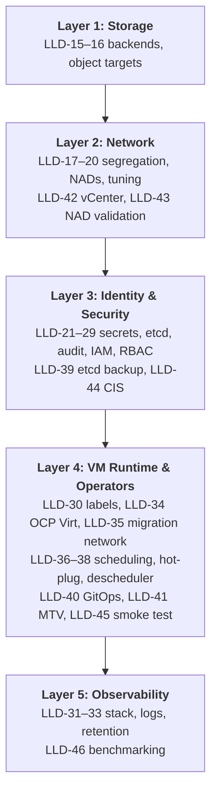
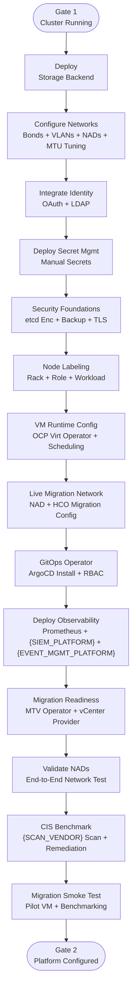

# {CLIENT} OpenShift Virtualization — Phase 2 Platform Build LLD

> Replace all `{PLACEHOLDERS}` with engagement-specific values. See placeholder reference table at end of document.

---

## Document Control

| Field                  | Value                                                      |
| ---------------------- | ---------------------------------------------------------- |
| **Title**              | {CLIENT} OpenShift Virtualization — Phase 2 Platform Build LLD |
| **Version**            | 0.1                                                        |
| **Status**             | Draft                                                      |
| **Classification**     | Internal — Confidential                                    |
| **Author**             | {AUTHOR}                                                   |
| **Reviewers**          | {REVIEWER_LIST}                                            |
| **Approval Authority** | {APPROVER}                                                 |
| **Last Updated**       | {DATE}                                                     |

### Revision History

| Ver | Date   | Author   | Changes                            |
| --- | ------ | -------- | ---------------------------------- |
| 0.1 | {DATE} | {AUTHOR} | Initial Phase 2 Platform Build LLD |

---

## Scope & References

This LLD provides implementation specifications for every Phase 2 (Platform Build) decision documented in the {CLIENT} HLD. Each section maps 1:1 to an HLD decision and contains configuration parameters, implementation procedures, layer context (L1–L5), and testable acceptance criteria. Phase 2 assumes Gate 1 (cluster running per Phase 1 LLD).

> **NTP:** Chrony / NTP configuration is handled in Phase 1 (LLD-18: Network Configuration — NTP subsection). Phase 2 inherits the validated time source; no additional NTP work is required unless drift is observed during platform build.

---

## Layer Model Overview — Phase 2

| Layer  | Scope                  | Typical LLD coverage                                                                                                                      |
| ------ | ---------------------- | ----------------------------------------------------------------------------------------------------------------------------------------- |
| **L1** | Storage Infrastructure | {BLOCK_STORAGE_ARRAY} FC SAN paths, ODF/local NVMe, ICOS/object endpoints                                                                           |
| **L2** | Network Configuration  | NMState policies, NADs, physical vNIC segregation, VLAN plumbing, MTU tuning, NAD validation, vCenter provider                             |
| **L3** | Identity & Security    | OAuth/LDAP, RBAC, manual secrets, etcd encryption + backup, CIS remediation                                                               |
| **L4** | VM Runtime & Operators | OCP Virt operator, live migration network, schedulable masters, eviction, hot-plug, descheduler, node labels, GitOps operator, MTV operator, migration smoke test |
| **L5** | Observability          | Prometheus, AlertManager routing, Vector/CLF, {SIEM_PLATFORM} HEC, Loki, Grafana/Perses                                                            |



---

## Phase 2 Implementation Flow



---

## LLD-15: Storage Backend Selection

Configure IBM {BLOCK_STORAGE_ARRAY} via FC SAN for DC/CDF block storage and ODF on local NVMe for branch clusters, with default StorageClasses per tier. *(ADR 17, 6)*

### Prerequisites

| ID      | Item                                                                 | Owner                  | Status |
| ------- | -------------------------------------------------------------------- | ---------------------- | ------ |
| CG-15-1 | Validate block storage driver against {BLOCK_STORAGE_ARRAY} hardware at the target DC and CDF sites           | Storage / Platform     | Open   |
| CG-15-2 | Confirm branch nodes meet the three-node minimum with local NVMe storage required for ODF deployment          | Storage / Architecture | Open   |
| CG-15-3 | Agree on the default storage class for each deployment tier (block storage required for VMs)                  | Storage / Virt         | Open   |

### Dependencies

| Blocked By | Reason |
| ---------- | ------ |
| None       | —      |

### Sample Configuration

**IBM Block CSI Operator Subscription (DC/CDF):**

```yaml
apiVersion: operators.coreos.com/v1alpha1
kind: Subscription
metadata:
  name: ibm-block-csi-operator
  namespace: openshift-operators
spec:
  channel: stable
  name: ibm-block-csi-operator-community
  source: certified-operators
  sourceNamespace: openshift-marketplace
  installPlanApproval: Manual
```

**IBMBlockCSI CR — creates CSI controller + node driver pods:**

```yaml
apiVersion: csi.ibm.com/v1
kind: IBMBlockCSI
metadata:
  name: ibm-block-csi
  namespace: openshift-operators
spec:
  controller:
    repository: cp.icr.io/cp/ibm-block-csi-driver-controller  # **TBD** — confirm image path with IBM
    tag: "<TBD version>"
  node:
    repository: cp.icr.io/cp/ibm-block-csi-driver-node
    tag: "<TBD version>"
```

**Array Secret (one per {BLOCK_STORAGE_ARRAY} backend):**

```yaml
apiVersion: v1
kind: Secret
metadata:
  name: {BLOCK_STORAGE_LOWER}-array-secret       # **TBD** per naming standard
  namespace: openshift-operators
type: Opaque
stringData:
  management_address: "<{BLOCK_STORAGE_ARRAY} management IP — TBD>"
  username: "<provided by storage team>"
  password: "<provided by storage team>"
```

**StorageClass — IBM Block (DC/CDF):**

```yaml
kind: StorageClass
apiVersion: storage.k8s.io/v1
metadata:
  name: ibm-block-gold-vsc             # **TBD** per naming standard
  annotations:
    storageclass.kubernetes.io/is-default-class: "true"
provisioner: block.csi.ibm.com
parameters:
  SpaceEfficiency: thin
  pool: "<TBD pool name>"
  csi.storage.k8s.io/provisioner-secret-name: {BLOCK_STORAGE_LOWER}-array-secret
  csi.storage.k8s.io/provisioner-secret-namespace: openshift-operators
  csi.storage.k8s.io/controller-publish-secret-name: {BLOCK_STORAGE_LOWER}-array-secret
  csi.storage.k8s.io/controller-publish-secret-namespace: openshift-operators
  csi.storage.k8s.io/fstype: xfs
reclaimPolicy: Delete
allowVolumeExpansion: true
volumeBindingMode: Immediate
```

> **Ref:** [IBM Block Storage CSI Driver on OpenShift (Redpaper REDP-5613)](https://www.redbooks.ibm.com/redpapers/pdfs/redp5613.pdf) — Example 4-64 for StorageClass YAML pattern.

**ODF Operator Subscription (Branch):**

```yaml
apiVersion: operators.coreos.com/v1alpha1
kind: Subscription
metadata:
  name: odf-operator
  namespace: openshift-storage
spec:
  channel: stable-4.21
  name: odf-operator
  source: redhat-operators
  sourceNamespace: openshift-marketplace
  installPlanApproval: Manual
```

**StorageCluster CR — ODF internal mode on local NVMe (Branch):**

```yaml
apiVersion: ocs.openshift.io/v1
kind: StorageCluster
metadata:
  name: ocs-storagecluster
  namespace: openshift-storage
spec:
  manageNodes: false
  monDataDirHostPath: /var/lib/rook
  storageDeviceSets:
    - name: ocs-deviceset
      count: 1
      dataPVCTemplate:
        spec:
          storageClassName: localblock       # from LocalVolumeDiscovery — **TBD**
          accessModes:
            - ReadWriteOnce
          resources:
            requests:
              storage: 1                     # placeholder — actual capacity from local disks
          volumeMode: Block
      replica: 3
      portable: false
```

> **Ref:** [Deploying ODF 4.21 on bare metal — internal mode](https://docs.redhat.com/en/documentation/red_hat_openshift_data_foundation/4.21/html/deploying_openshift_data_foundation_using_bare_metal_infrastructure)

**Example PVC referencing IBM block StorageClass (`ReadWriteMany` illustrative — confirm exact VM storage access mode with storage team):**

```yaml
apiVersion: v1
kind: PersistentVolumeClaim
metadata:
  name: example-vm-disk
spec:
  accessModes:
    - ReadWriteMany
  storageClassName: ibm-block-gold-vsc # **TBD**
  resources:
    requests:
      storage: 50Gi
```

### Tier Variance

| Parameter            | DC                             | CDF                            | Branch                                                 |
| -------------------- | ------------------------------ | ------------------------------ | ------------------------------------------------------ |
| Block CSI            | IBM block → {BLOCK_STORAGE_ARRAY}        | IBM block → {BLOCK_STORAGE_ARRAY}        | ODF `ocs-storagecluster-ceph-rbd` (**TBD** exact name) |
| FC SAN path          | Required                       | Required                       | N/A                                                    |
| Local NVMe for ODF   | N/A (**TBD** if future use)    | N/A (**TBD**)                  | Required (min 3 nodes)                                 |
| Default StorageClass | `ibm-block-gold-vsc` (**TBD**) | `ibm-block-gold-vsc` (**TBD**) | `ocs-storagecluster-ceph-rbd` (**TBD**)                |

### Implementation Procedure

**Execution Readiness Checks:**

- [ ] Gate 1 complete; nodes `Ready`
- [ ] FC zoning complete (DC/CDF) — see Phase 1 LLD
- [ ] OLM reachable; catalogs configured
- [ ] Pull secret permits required operator images
- [ ] {BLOCK_STORAGE_ARRAY} management IP, pool name, and credentials available (DC/CDF)
- [ ] Local NVMe disks identified via `lsblk` on branch nodes

**Steps — DC/CDF (IBM Block CSI):**

1. **Install IBM Block CSI Operator** — apply the Subscription YAML above; approve the InstallPlan:
   
   ```bash
   oc apply -f ibm-block-csi-subscription.yaml
   oc get installplan -n openshift-operators              # approve pending plan
   oc get csv -n openshift-operators | grep ibm-block
   ```

2. **Create IBMBlockCSI instance:**
   
   ```bash
   oc apply -f ibm-block-csi-cr.yaml
   ```

3. **Create array secret** with {BLOCK_STORAGE_ARRAY} credentials:
   
   ```bash
   oc apply -f {BLOCK_STORAGE_LOWER}-array-secret.yaml
   ```

4. **Create StorageClass(es)** — apply the StorageClass YAML above (one per performance tier if applicable):
   
   ```bash
   oc apply -f ibm-block-gold-vsc-sc.yaml
   ```

5. **Set default StorageClass annotation** on the primary VM storage class:
   
   ```bash
   oc annotate storageclass ibm-block-gold-vsc \
     storageclass.kubernetes.io/is-default-class=true
   ```

**Steps — Branch (ODF):**

6. **Create `openshift-storage` namespace** and OperatorGroup:
   
   ```bash
   oc create namespace openshift-storage || true
   oc apply -f odf-operatorgroup.yaml
   ```

7. **Install ODF Operator** — apply the Subscription YAML above; approve the InstallPlan:
   
   ```bash
   oc apply -f odf-operator-subscription.yaml
   oc get installplan -n openshift-storage                # approve pending plan
   oc get csv -n openshift-storage | grep odf
   ```

8. **Discover local disks** — create `LocalVolumeDiscovery` or use auto-detect per ODF bare-metal guide.

9. **Create StorageCluster** — apply the StorageCluster CR above:
   
   ```bash
   oc apply -f ocs-storagecluster.yaml
   oc get storagecluster -n openshift-storage -w          # wait for Phase: Ready
   ```

10. **Set default StorageClass** for branch:
    
    ```bash
    oc annotate storageclass ocs-storagecluster-ceph-rbd \
      storageclass.kubernetes.io/is-default-class=true
    ```

**Steps — Common (all tiers):**

11. **Validate provisioning** — create test PVC and confirm bind:
    
    ```bash
    oc new-project storage-validation-test || true
    oc apply -f - <<EOF
    apiVersion: v1
    kind: PersistentVolumeClaim
    metadata:
      name: test-pvc
      namespace: storage-validation-test
    spec:
      accessModes: [ReadWriteOnce]
      resources:
        requests:
          storage: 1Gi
    EOF
    oc get pvc test-pvc -n storage-validation-test -w     # expect Bound
    oc delete project storage-validation-test
    ```

**Verification:**

```bash
oc get csv -n openshift-operators | grep ibm-block        # DC/CDF
oc get csv -n openshift-storage | grep odf                 # Branch
oc get storagecluster -n openshift-storage                 # Branch — Phase: Ready
oc get cephcluster -n openshift-storage                    # Branch — health: HEALTH_OK
oc get storageclass -o wide
```

**Rollback:**

- Uninstall CSI/ODF per vendor procedure only in non-production; retain data snapshots **TBD** per change management — production rollback requires formal DR playbook.

### Acceptance Criteria

| ID      | Criterion                       | Test                                                                                                 | Expected Result              |
| ------- | ------------------------------- | ---------------------------------------------------------------------------------------------------- | ---------------------------- |
| AC-15-1 | Storage operator CSV healthy    | `oc get csv -n openshift-operators` (DC/CDF) or `oc get csv -n openshift-storage` (Branch)           | `Succeeded`                  |
| AC-15-2 | CSI driver pods running         | `oc get pods -A \| grep -E 'ibm-block\|csi'` (DC/CDF) or `oc get pods -n openshift-storage` (Branch) | All pods `Running`           |
| AC-15-3 | StorageCluster healthy (Branch) | `oc get storagecluster -n openshift-storage`                                                         | `Phase: Ready`               |
| AC-15-4 | Default StorageClass annotated  | `oc get storageclass`                                                                                | One class marked `(default)` |
| AC-15-5 | PVC bind success                | Create test PVC; `oc get pvc`                                                                        | `Bound`                      |

---

## LLD-16: Object Storage

Deploy ICOS or ODF RGW endpoints for S3-compatible object storage used by Loki, Thanos, and backup workflows. *(ADR 17)*

### Prerequisites

| ID      | Item                                                                                     | Owner                   | Status |
| ------- | ---------------------------------------------------------------------------------------- | ----------------------- | ------ |
| CG-16-1 | Define and provision the ICOS object storage endpoint, credentials, and bucket layout per datacenter   | Storage / Observability | Open   |
| CG-16-2 | Confirm whether CDF sites access ICOS over WAN or use a local object storage path                     | Architecture / Storage  | Open   |
| CG-16-3 | Confirm branch object storage gateway is reachable from monitoring and logging workloads               | Platform                | Open   |

### Dependencies

| Blocked By | Reason                   |
| ---------- | ------------------------ |
| LLD-15     | Storage platform healthy |

### Sample Configuration

**Example `BucketClass`/`ObjectBucketClaim` naming is product-specific — placeholder only:**

```bash
oc get objectbucketclaim -n openshift-logging # **TBD** after ODF/MCO objs defined
```

**Example secret reference for remote S3 (values provided by storage/infrastructure team):**

```yaml
apiVersion: v1
kind: Secret
metadata:
  name: icos-credentials
  namespace: openshift-logging # **TBD**
type: Opaque
stringData:
  AWS_ACCESS_KEY_ID: "<provided by infrastructure team>"
  AWS_SECRET_ACCESS_KEY: "<provided by infrastructure team>"
```

### Tier Variance

| Parameter       | DC           | CDF                    | Branch                     |
| --------------- | ------------ | ---------------------- | -------------------------- |
| Object endpoint | ICOS         | ICOS or WAN to DC ICOS | Local ODF RGW              |
| WAN dependency  | Typically no | Possibly yes           | WAN N/A for object (local) |

### Implementation Procedure

**Execution Readiness Checks:**

- [ ] LLD-15 storage platform healthy
- [ ] Firewall paths to ICOS / RGW open and verified: `curl -sI https://<icos-fqdn>` from cluster node (**TBD** exact ports — typically HTTPS 443)

**Steps:**

1. **Provision buckets/prefixes** per observability/logging design — names **TBD** (immutable vs rotate **TBD**).
2. **Create credentials Secret** manually from values provided by the infrastructure team.
3. **Configure Loki/Thanos/ObjectStorage** CRs (**LLD-32**, **LLD-33**) to reference endpoints.
4. **Validate PUT/GET** from a debug pod:

```bash
oc run awscli --rm -it --restart=Never --image=amazon/aws-cli -- \\
  s3 ls s3://<bucket> --endpoint-url=https://<icos-fqdn>
```

**Rollback:**

- Remove forwarding CR references; buckets retained per retention policy (**TBD**).

### Acceptance Criteria

| ID      | Criterion                          | Test                                                               | Expected Result         |
| ------- | ---------------------------------- | ------------------------------------------------------------------ | ----------------------- |
| AC-16-1 | S3 endpoint reachable from cluster | CURL/HTTPS probe from bastion-aligned pod **TBD**                  | Success                 |
| AC-16-2 | Credentials secret present         | `oc get secret icos-credentials -n openshift-logging` (**TBD** ns) | `TYPE`/`DATA` populated |
| AC-16-3 | Writes succeed                     | Controlled test upload to bucket                                   | Success                 |

---

## LLD-17: Network Segregation Strategy

Define physical vNIC-to-traffic-type mapping and VLAN segregation for management, VM data, live migration, and backup networks. *(ADR 11)*

### Prerequisites

| ID      | Item                                                                                          | Owner            | Status |
| ------- | --------------------------------------------------------------------------------------------- | ---------------- | ------ |
| CG-17-1 | Finalize VLAN assignments to each network interface on nodes, including migration and {BACKUP_VENDOR} backup VLANs | Network / Virt   | Open   |
| CG-17-2 | Confirm with {BACKUP_VENDOR} whether the backup network interface uses a trunk port or a single VLAN            | Network / Backup | Open   |
| CG-17-3 | Validate Quality of Service traffic shaping on the shared 100G network pipe with the Network team               | Network          | Open   |

### Dependencies

| Blocked By | Reason |
| ---------- | ------ |
| None       | —      |

### Reference

| Parameter           | Value                                           | Description                                                          | Source                      |
| ------------------- | ----------------------------------------------- | -------------------------------------------------------------------- | --------------------------- |
| vNIC 0 / FI-A       | OCP mgmt + OVN-Kubernetes                       | API/etcd path on management VLAN MTU 1500                            | ADR 11 / HLD                |
| vNIC 1 / FI-B       | VM bridged VLANs (OVS)                          | Tenant VM data MTU 1500                                              | ADR 11                      |
| vNIC 2              | Live migration dedicated                        | MTU 9000/9216 at fabric                                              | ADR 11                      |
| vNIC 3              | {BACKUP_VENDOR} backup                                   | MTU jumbo — trunk **TBD**                                            | ADR 11 / {BACKUP_VENDOR} discussions |
| Physical separation | Dedicated vNICs per traffic class               | No OCP-managed bonding — {HW_VENDOR} FI fabric handles redundancy (ADR 11) | HLD Phase 2                 |
| Branch footnote     | **Potentially 2 vNICs** — shared migration path | Density trade accepted                                               | ADR 11.3                    |

### Sample Configuration

**Reference — Phase 1 LLD NIC layout table** — reproduced for operator context:

```
vNIC0: FI-A mgmt/OVN — MTU 1500
vNIC1: FI-B VM-OVS — MTU 1500
vNIC2: Migration — MTU 9000
vNIC3: Backup — MTU 9000
```

### Tier Variance

| Parameter  | DC             | CDF                             | Branch            |
| ---------- | -------------- | ------------------------------- | ----------------- |
| vNIC count | 4 (FI-managed) | 4 baseline; disjoint L2 **TBD** | 2 (**TBD** final) |

### Implementation Procedure

**Execution Readiness Checks:**

- [ ] UCS/{HW_MGMT_PLATFORM} profiles applied (PCI placement rules per ADR 7)
- [ ] Switch VLAN trunks staged

**Steps:**

1. Network implements VLANs/fabrics feeding each vNIC per mapping sheet (**TBD** attachment).
2. Platform validates interfaces appear with stable names (`ip link`, NMState introspection).

**Verification:**

```bash
oc debug node/<name> -- chroot /host ip -br link
```

**Rollback:**

- Revert {HW_MGMT_PLATFORM} + switch configs via change controls.

### Acceptance Criteria

| ID      | Criterion                             | Test                                                            | Expected Result                                                  |
| ------- | ------------------------------------- | --------------------------------------------------------------- | ---------------------------------------------------------------- |
| AC-17-1 | Four NIC roles present DC/CFI-managed | BMC console / SOS report                                        | Interfaces enumerated match design                               |
| AC-17-2 | Migration MTU end-to-end              | `ping -M do -s 8972 <peer>` (**TBD** source IP)                 | No fragmentation along path                                      |
| AC-17-3 | No OCP-managed bonds on nodes         | `oc debug node/<name> -- chroot /host ip -br link \| grep bond` | Empty (no bond devices) unless documented CDF disjoint exception |

---

## LLD-18: NAD Scope & VLAN Strategy

Create Network Attachment Definitions for each VM-facing VLAN to enable secondary network interfaces on virtualized workloads. *(ADR 9, 10)*

### Prerequisites

| ID      | Item                                                      | Owner    | Status |
| ------- | --------------------------------------------------------- | -------- | ------ |
| CG-18-1 | Deliver the final, authoritative VLAN list for each site                                | Network  | Open   |
| CG-18-2 | Agree on naming conventions and label standards for network attachment definitions      | Platform | Open   |

### Dependencies

| Blocked By | Reason                                |
| ---------- | ------------------------------------- |
| LLD-17     | Network segregation strategy approved |

### Configuration Parameters

| Parameter           | Value                                        | Description                             | Source          |
| ------------------- | -------------------------------------------- | --------------------------------------- | --------------- |
| NAD namespace       | `default`                                    | Effective cluster-wide NAD availability | ADR 9           |

### Sample Configuration

OVS NAD example (vlan **TBD** plugin — validate exact CNI stanza vs cluster version):

```yaml
apiVersion: k8s.cni.cncf.io/v1
kind: NetworkAttachmentDefinition
metadata:
  name: vlan-412
  namespace: default
  labels:
    {CLIENT_DOMAIN}/vlan-id: "412"
spec:
  config: |-
    {
      "cniVersion": "0.3.1",
      "type": "ovn-kube-cni-overlay",
      "topology": "localnet",
      "mtu": 1500,
      "name": "vlan-412-net",
      "netAttachDefName": "default/vlan-412"
    }
```

*The `netAttachDefName` / CNI `type` fields MUST be validated on sandbox against the target OCP 4.21 OVN-K secondary networks schema — exact JSON is **TBD** per cluster baseline.*

### Tier Variance

| Parameter    | DC                           | CDF              | Branch                                  |
| ------------ | ---------------------------- | ---------------- | --------------------------------------- |
| VLAN catalog | Primary data center VLAN set | Possibly reduced | Shared /23 context — VLAN count **TBD** |

### Implementation Procedure

**Execution Readiness Checks:**

- [ ] Physical VLAN to bridge mapping (`localnet`/`bridge` mappings) defined with Network

**Steps:**

1. Capture VLAN manifest in Git (**ADR 49** multi-repo boundaries **TBD**).
2. Apply NAD set via ArgoCD wave after NMState bridging policy ready.
3. VM attach via `nadName`/`multus.networkName` (**TBD** per VM templating).

**Verification:**

```bash
oc get net-attach-def -n default
oc describe net-attach-def vlan-412 -n default
```

**Rollback:**

```bash
oc delete net-attach-def vlan-412 -n default # only if unused
```

### Acceptance Criteria

| ID      | Criterion                           | Test                   | Expected Result                  |
| ------- | ----------------------------------- | ---------------------- | -------------------------------- |
| AC-18-1 | NAD count matches VLAN manifest     | Scripted diff vs sheet | Exact match (**TBD** automation) |
| AC-18-2 | NAD only in designated namespace(s) | `oc get nad -A`        | `default` (+ exceptions **TBD**) |

---

## LLD-19: MAC Spoof Filtering

Configure MAC spoof check policy on OVS bridges to control whether VMs can use arbitrary MAC addresses on secondary networks. *(ADR 8, 25)*

### Prerequisites

| ID      | Item                                                                                                          | Owner           | Status |
| ------- | ------------------------------------------------------------------------------------------------------------- | --------------- | ------ |
| CG-19-1 | Decide whether to enable MAC spoofing prevention (CIS OCP-V control 4.2) on Day 1 or log a formal security exception | Security / Virt | Open   |
| CG-19-2 | Validate in sandbox that MAC spoofing prevention works correctly on all applicable network bridge configurations     | Platform        | Open   |

### Dependencies

| Blocked By | Reason       |
| ---------- | ------------ |
| LLD-18     | NADs created |

### Configuration Parameters

| Parameter          | Value                                                                | Description                 | Source       |
| ------------------ | -------------------------------------------------------------------- | --------------------------- | ------------ |
| Target posture     | Explicit `macspoofchk: true` for bridge NADs when approved           | RH hardening expectation    | ADR 8 bullet |

### Sample Configuration

**KubeVirt bridge NAD with mac spoof check (literal field per validated version — **confirm in sandbox**):**

```yaml
apiVersion: k8s.cni.cncf.io/v1
kind: NetworkAttachmentDefinition
metadata:
  name: br402-macchk
  namespace: default
spec:
  config: |
    {
      "cniVersion": "0.3.1",
      "name": "br402",
      "type": "kubevirt-bridge",
      "bridge": "br402",
      "macspoofchk": true
    }
```

### Tier Variance

| Parameter        | DC                           | CDF   | Branch |
| ---------------- | ---------------------------- | ----- | ------ |
| Enforcement wave | Pilot after CIS triage Pilot | Pilot | Pilot  |

### Implementation Procedure

**Execution Readiness Checks:**

- [ ] NAD schema verified on sandbox OCP-V version (**TBD** exact JSON keys)

**Steps:**

1. **If approved —** patch Git manifests to add `"macspoofchk": true` on all bridged NADs.
2. Argo sync + monitor VM attaches for failures (legacy appliances **TBD** exceptions).
3. If deferred — capture formal risk acceptance referencing CIS triage ticket **TBD**.

**Verification:**

```bash
oc get net-attach-def br402-macchk -n default -o jsonpath='{.spec.config}' | jq .
```

**Rollback:**

- Revert Git commit; resync Argo; restore prior NAD JSON.

### Acceptance Criteria

| ID      | Criterion                                    | Test                                | Expected Result    |
| ------- | -------------------------------------------- | ----------------------------------- | ------------------ |
| AC-19-1 | When enabled, config includes mac spoof flag | `oc get net-attach-def <n> -o yaml` | `macspoofchk` true |
| AC-19-2 | No VM attach regression for golden VM tests  | Manual console + ping               | Pass               |

---

## LLD-20: Network Tuning

Validate end-to-end MTU across all VLANs and tune OVN-Kubernetes and migration bandwidth settings for optimal throughput. *(ADR 11, 40)*

### Prerequisites

| ID      | Item                                                          | Owner              | Status |
| ------- | ------------------------------------------------------------- | ------------------ | ------ |
| CG-20-1 | Validate MTU size end-to-end across all VLANs to confirm no packet fragmentation occurs          | Network / Platform | Open   |
| CG-20-2 | Review and set VM live migration bandwidth limits in the virtualisation platform configuration    | Platform / Virt    | Open   |

### Dependencies

| Blocked By | Reason                                                          |
| ---------- | --------------------------------------------------------------- |
| LLD-17     | Network segregation strategy approved; NMState policies applied |

### Configuration Parameters

| Parameter                 | Value                      | Description                                                      | Source                |
| ------------------------- | -------------------------- | ---------------------------------------------------------------- | --------------------- |
| MTU (cluster network)     | 8900 or 9000               | Jumbo frames for OVN-K (if fabric supports)                      | ADR 11 / network team |
| MTU (migration VLAN)      | 9000                       | Dedicated migration network MTU                                  | HLD Phase 2           |
| MTU (storage VLAN)        | 9000                       | FC SAN not applicable; NFS/iSCSI if used                         | HLD                   |
| OVN-K gateway mode        | `local` or `shared`        | **TBD** per cluster topology                                     | OCP networking docs   |
| Migration bandwidth limit | `0` (unlimited) or **TBD** | HyperConverged `.spec.liveMigrationConfig.bandwidthPerMigration` | LLD-34                |

### Sample Configuration

**NMState MTU policy (illustrative):**

```yaml
apiVersion: nmstate.io/v1
kind: NodeNetworkConfigurationPolicy
metadata:
  name: mtu-migration-vlan
spec:
  desiredState:
    interfaces:
      - name: ens4f0.412
        type: vlan
        state: up
        vlan:
          base-iface: ens4f0
          id: 412
        mtu: 9000
```

**MTU validation:**

```bash
ip -d link show ens4f0.412 | grep mtu
ping -M do -s 8972 <remote-node-migration-ip>
```

### Tier Variance

| Parameter     | DC         | CDF        | Branch                      |
| ------------- | ---------- | ---------- | --------------------------- |
| Jumbo frames  | Yes (9000) | Yes (9000) | **TBD** — switch capability |
| OVN-K gateway | **TBD**    | **TBD**    | `local` (compact)           |

### Implementation Procedure

**Execution Readiness Checks:**

- [ ] Physical switch MTU confirmed by network team
- [ ] NMState policies from LLD-17 applied

**Steps:**

1. Validate end-to-end MTU on every VLAN with `ping -M do -s <mtu-28>`.
2. Confirm OVN-K CNI MTU matches fabric (`oc get network.config cluster -o jsonpath='{.status.clusterNetworkMTU}'`).
3. If migration bandwidth contention is observed, patch `bandwidthPerMigration` on the existing HCO CR (created in **LLD-34**, migration config set in **LLD-35**):

```bash
oc patch hyperconverged kubevirt-hyperconverged -n openshift-cnv --type merge -p '{
  "spec": {
    "liveMigrationConfig": {
      "bandwidthPerMigration": "1Gi"
    }
  }
}'
```

**Verification:**

```bash
oc get network.config cluster -o jsonpath='{.status.clusterNetworkMTU}'
ping -M do -s 8972 <peer-node-ip>
```

**Rollback:**

- Revert NMState policy; NIC reverts to previous MTU.

### Acceptance Criteria

| ID      | Criterion               | Test                    | Expected Result  |
| ------- | ----------------------- | ----------------------- | ---------------- |
| AC-20-1 | Jumbo frames end-to-end | `ping -M do -s 8972`    | No fragmentation |
| AC-20-2 | OVN-K MTU matches       | `network.config` status | Expected value   |

---

## LLD-21: etcd Encryption

Enable encryption at rest for Secrets, ConfigMaps, and other sensitive resources stored in etcd using AES-CBC or AES-GCM. *(ADR 21)*

### Prerequisites

| ID      | Item                                                                                        | Owner               | Status |
| ------- | ------------------------------------------------------------------------------------------- | ------------------- | ------ |
| CG-21-1 | Obtain InfoSec approval for the etcd encryption algorithm selection (AES-CBC vs AES-GCM)                              | Security            | Open   |
| CG-21-2 | Document the encryption key storage and rotation procedure in a secure offline location (vault migration post-Phase 2) | Platform / Security | Open   |
| CG-21-3 | Complete an etcd backup and restore drill that covers the encrypted cluster state                                      | Platform            | Open   |

### Dependencies

| Blocked By | Reason |
| ---------- | ------ |
| None       | —      |

### Configuration Parameters

| Parameter       | Value                                                  | Description           | Source           |
| --------------- | ------------------------------------------------------ | --------------------- | ---------------- |
| Encryption type | **`aescbc` or `aesgcm`** on `APIServer` spec           | Mandatory             | ADR 21 / OCP doc |

### Sample Configuration

```yaml
apiVersion: config.openshift.io/v1
kind: APIServer
metadata:
  name: cluster
spec:
  encryption:
    type: aesgcm
```

**Apply:**

```bash
oc apply -f apiserver-encryption.yaml
```

**Monitor migration job:**

```bash
oc get openshiftapiservers.operator.openshift.io -o yaml | grep encrypt -n
oc get etcd -o jsonpath='{.items[0].status.conditions}' | jq
```

### Tier Variance

| Parameter   | DC      | CDF     | Branch  |
| ----------- | ------- | ------- | ------- |
| Requirement | Encrypt | Encrypt | Encrypt |

### Implementation Procedure

**Execution Readiness Checks:**

- [ ] Maintenance window (**TBD** — encryption rollout duration)
- [ ] etcd backups current

**Steps:**

1. Apply `APIServer` encryption spec patch.
2. Wait for etcd encryption controllers to converge (~time **TBD** pod count).
3. Record key fingerprints in secure offline storage (migrate to vault post-Phase 2).

**Verification:**

```bash
oc explain apiserver.spec.encryption
oc get apiserver cluster -o jsonpath='{.spec.encryption.type}'
```

**Rollback:**

- Not supported casually — escalate to RH support + InfoSec (**TBD** procedure).

### Acceptance Criteria

| ID      | Criterion                | Test                                                             | Expected Result      |
| ------- | ------------------------ | ---------------------------------------------------------------- | -------------------- |
| AC-21-1 | etcd encryption type set | `oc get apiserver cluster -o jsonpath='{.spec.encryption.type}'` | `aesgcm` or approved |
| AC-21-2 | etcd reports migrated    | Encryption operator status (**TBD** exact field)                 | Complete             |

---

## LLD-22: Audit Logging Policy

Configure the OCP audit log profile and forwarding rules to ensure API server events are captured and shipped to {SIEM_PLATFORM}. *(ADR 26)*

### Prerequisites

| ID      | Item                                                                                    | Owner         | Status |
| ------- | --------------------------------------------------------------------------------------- | ------------- | ------ |
| CG-22-1 | Unpark and decide the API audit logging verbosity level (Default, WriteRequestBodies, or AllRequestBodies) | InfoSec       | Open   |
| CG-22-2 | Integrate agreed audit log filters into the {SIEM_PLATFORM} log pipeline                                  | Observability | Open   |

### Dependencies

| Blocked By | Reason |
| ---------- | ------ |
| None       | —      |

### Sample Configuration

> **Note:** The `APIServer/cluster` resource is also modified by **LLD-21** (etcd encryption — `spec.encryption`). This step patches only `spec.audit.profile` on the same object.

**When approved — patch `APIServer` audit profile:**

```bash
oc patch apiserver cluster --type=merge -p '{"spec":{"audit":{"profile":"WriteRequestBodies"}}}'
# **TBD** — do not apply until unparked
```

### Tier Variance

| Parameter | DC                            | CDF  | Branch |
| --------- | ----------------------------- | ---- | ------ |
| Profile   | **TBD** single fleet standard | Same | Same   |

### Implementation Procedure

**Execution Readiness Checks:**

- [ ] InfoSec decision recorded (un-park ADR 26)
- [ ] {SIEM_PLATFORM} indexing capacity review for selected profile

**Steps:**

1. Hold — track dependency on InfoSec workshop while decision remains parked.
2. Upon decision, apply via GitOps + monitor API latency / disk growth (**TBD** thresholds).

**Verification:**

```bash
oc get apiserver cluster -o jsonpath='{.spec.audit.profile}'
```

**Rollback:**

- Patch profile back to `Default` or prior state.

### Acceptance Criteria

| ID      | Criterion                                    | Test                  | Expected Result   |
| ------- | -------------------------------------------- | --------------------- | ----------------- |
| AC-22-1 | Documented profile                           | Runbook               | Lists chosen enum |
| AC-22-2 | {SIEM_PLATFORM} sourcetype sees expected event volume | {SIEM_PLATFORM} search **TBD** | Baseline chart    |

---

## LLD-23: Secret Management Approach

Manage cluster secrets via manual `oc create secret` during Phase 2, with a documented inventory for future migration to an automated vault (ESO + {SECRET_MGMT_VENDOR}) post-Phase 2. *(ADR 20)*

> **Note:** {SECRET_MGMT_VENDOR} and External Secrets Operator (ESO) will not be available during Phase 2 execution. All secrets are created manually. A secret catalog is maintained so that migration to ESO + {SECRET_MGMT_VENDOR} can proceed once the vault infrastructure is ready.

### Prerequisites

| ID      | Item                                                                                             | Owner    | Status |
| ------- | ------------------------------------------------------------------------------------------------ | -------- | ------ |
| CG-23-1 | Complete the secrets inventory listing every manually managed secret, its namespace, and rotation schedule  | Platform | Open   |
| CG-23-2 | Create all required secrets manually to unblock downstream LLD work                                        | Platform | Open   |
| CG-23-3 | Confirm no plaintext secrets are committed to Git (automated scanning in place)                            | Platform | Open   |

### Dependencies

| Blocked By | Reason |
| ---------- | ------ |
| None       | —      |

### Sample Configuration

**Manual secret creation pattern (example — LDAP bind):**

```bash
oc create secret generic ldap-bind-secret \
  -n openshift-config \
  --from-literal=bindPassword="<provided by IAM team>"
```

**Secret catalog entry (track in deployment record or spreadsheet):**

| #   | Secret Name                    | Kind       | Namespace              | Purpose                                                            | Source Team         | Rotation        | LLD Ref        | Tier   |
| --- | ------------------------------ | ---------- | ---------------------- | ------------------------------------------------------------------ | ------------------- | --------------- | -------------- | ------ |
| 1   | `custom-ingress-cert`          | TLS Secret | `openshift-ingress`    | Ingress wildcard certificate + key                                 | Security / PKI      | Per cert expiry | Phase 1 LLD-13 | All    |
| 2   | `api-server-cert`              | TLS Secret | `openshift-config`     | API server certificate + key                                       | Security / PKI      | Per cert expiry | Phase 1 LLD-13 | All    |
| 3   | `{BLOCK_STORAGE_LOWER}-array-secret`     | Opaque     | `openshift-operators`  | {BLOCK_STORAGE_ARRAY} management address + credentials                       | Storage             | Per policy      | LLD-15         | DC/CDF |
| 4   | `icos-credentials`             | Opaque     | `openshift-logging`    | ICOS S3 access key + secret key                                    | Infrastructure      | Per policy      | LLD-16         | DC/CDF |
| 5   | `ldap-bind-secret`             | Opaque     | `openshift-config`     | LDAP bind DN password for OAuth                                    | IAM                 | 90 days         | LLD-24         | All    |
| 6   | `ldap-ca-bundle`               | ConfigMap  | `openshift-config`     | LDAP server CA certificate bundle                                  | IAM / PKI           | Per cert expiry | LLD-24         | All    |
| 7   | `ldap-sync-secret`             | Opaque     | `openshift-config`     | LDAP group sync bind password                                      | IAM                 | 90 days         | LLD-24         | All    |
| 8   | `htpasswd-secret`              | Opaque     | `openshift-config`     | Breakglass user htpasswd file                                      | Security            | Per policy      | LLD-26         | All    |
| 9   | `{SIEM_LOWER}-hec-token`             | Opaque     | `openshift-logging`    | {SIEM_PLATFORM} HEC ingest token                                            | {SIEM_PLATFORM}              | Per policy      | LLD-33         | All    |
| 10  | `loki-object-storage`          | Opaque     | `openshift-logging`    | Loki S3 backend credentials (access key, secret, bucket, endpoint) | Infrastructure      | Per policy      | LLD-33         | All    |
| 11  | `alertmanager-{EVENT_MGMT_LOWER}-config` | Opaque     | `openshift-monitoring` | AlertManager webhook URL + auth for {EVENT_MGMT_PLATFORM}                       | NOC / Observability | Per policy      | LLD-31         | All    |
| 12  | `vcenter-credentials`          | Opaque     | `openshift-mtv`        | vCenter service account + password + thumbprint                    | VMware              | Per policy      | LLD-42         | All    |

### Tier Variance

| Parameter    | DC               | CDF              | Branch                                                    |
| ------------ | ---------------- | ---------------- | --------------------------------------------------------- |
| Secret count | 12 (all entries) | 12 (all entries) | 10 (no #3 {BLOCK_STORAGE_ARRAY}, no #4 ICOS — uses ODF RGW locally) |

### Implementation Procedure

**Execution Readiness Checks:**

- [ ] All downstream LLD secret values collected from respective teams (IAM, Storage, {SIEM_PLATFORM}, VMware)
- [ ] Secret catalog template prepared

**Steps:**

1. **Populate secret catalog** with every secret required across LLD-15 through LLD-46.
2. **Create each secret** using `oc create secret` — one per catalog entry.
3. **Verify all secrets exist** in their target namespaces.
4. **Document rotation schedule** in deployment record for manual rotation until ESO is available.

**Verification:**

```bash
# Phase 1 TLS secrets
oc get secret custom-ingress-cert -n openshift-ingress
oc get secret api-server-cert -n openshift-config

# Storage (LLD-15, LLD-16)
oc get secret {BLOCK_STORAGE_LOWER}-array-secret -n openshift-operators   # DC/CDF only
oc get secret icos-credentials -n openshift-logging              # DC/CDF only

# Identity (LLD-24, LLD-26)
oc get secret ldap-bind-secret -n openshift-config
oc get configmap ldap-ca-bundle -n openshift-config
oc get secret ldap-sync-secret -n openshift-config
oc get secret htpasswd-secret -n openshift-config

# Observability (LLD-31, LLD-33)
oc get secret {SIEM_LOWER}-hec-token -n openshift-logging
oc get secret loki-object-storage -n openshift-logging
oc get secret alertmanager-{EVENT_MGMT_LOWER}-config -n openshift-monitoring

# Migration (LLD-42)
oc get secret vcenter-credentials -n openshift-mtv
```

**Rollback:**

- Delete and recreate individual secrets as needed; no operator dependency.

### Acceptance Criteria

| ID      | Criterion                     | Test                                          | Expected Result          |
| ------- | ----------------------------- | --------------------------------------------- | ------------------------ |
| AC-23-1 | All cataloged secrets present | `oc get secret <name> -n <ns>` for each entry | Exists with correct keys |
| AC-23-2 | No plaintext secrets in Git   | Repo scanner                                  | Clean                    |
| AC-23-3 | Secret catalog documented     | Deployment record artifact                    | All entries populated    |

---

## LLD-24: Identity & Access Model

Integrate OAuth with {CLIENT} LDAP for cluster authentication, mapping enterprise groups to OCP roles for interactive login. *(ADR 28)*

### Prerequisites

| ID      | Item                                                                          | Owner          | Status |
| ------- | ----------------------------------------------------------------------------- | -------------- | ------ |
| CG-24-1 | Receive LDAP connection details, bind credentials, TLS requirements, and group schema from IAM team          | IAM / Security | Open   |
| CG-24-2 | Review and approve the LDAP identity provider and group sync configuration manifests                         | Platform       | Open   |
| CG-24-3 | Define and document the privileged access model for Phase 2 (manual credential management is acceptable now) | Security       | Open   |

### Dependencies

| Blocked By | Reason                              |
| ---------- | ----------------------------------- |
| LLD-23     | Secret management approach deployed |

### Sample Configuration

**OAuth cluster configuration — illustrative:**

```yaml
apiVersion: config.openshift.io/v1
kind: OAuth
metadata:
  name: cluster
spec:
  identityProviders:
    - type: LDAP
      name: {CLIENT_LOWER}-ldap
      mappingMethod: claim
      ldap:
        attributes:
          id:
            - dn
          email:
            - mail
          name:
            - cn
          preferredUsername:
            - uid
        bindDN: "uid=readonly,**TBD**"
        bindPassword:
          name: ldap-bind-secret
        ca:
          name: ldap-ca-bundle
        url: ldap://ipa.example.invalid/ # **TBD** ldaps URI
```

**Group sync `LDAPSyncConfig`:**

```yaml
apiVersion: v1
kind: LDAPSyncConfig
url: ldap://ipa.example.invalid
bindDN: uid=ldap-reader,cn=sysaccounts,cn=config
bindPasswordSecret:
  apiVersion: v1
  kind: Secret
  name: ldap-sync-secret
ldapGroupUIDAttribute: dn
ldapGroupsQuery:
  baseDN: "**TBD**"
  scope: sub
groupUIDNameMapping:
  "**TBD**": cluster-admins
```

### Tier Variance

| Parameter | DC                    | CDF           | Branch                   |
| --------- | --------------------- | ------------- | ------------------------ |
| LDAP view | Possibly same forests | Possibly same | Branch LDAP path **TBD** |

### Implementation Procedure

**Execution Readiness Checks:**

- [ ] Secrets created for bind accounts (manually created from values provided by IAM team)
- [ ] CA trust bundle available
- [ ] LDAP endpoint reachable from cluster: `oc run ldaptest --rm -it --restart=Never --image=curlimages/curl -- curl -vk ldaps://<ldap-fqdn>:636`

**Steps:**

1. Apply Secrets + CA configmaps.
2. Patch `OAuth.spec` (`oc patch oauth/cluster --type merge --patch-file=oauth-patch.yaml`).
3. Configure CronJob or dedicated group sync operator job **TBD** standard.
4. Validate login flow with test user.

**Verification:**

```bash
oc get identity
oc get user
oc whoami --show-console
```

**Rollback:**

```bash
oc patch oauth cluster --type json -p '[{"op":"remove","path":"/spec/identityProviders/0"}]' # illustrative only
```

### Acceptance Criteria

| ID      | Criterion          | Test                                 | Expected Result       |
| ------- | ------------------ | ------------------------------------ | --------------------- |
| AC-24-1 | LDAP login success | Attempt console login test account   | Successful            |
| AC-24-2 | Groups visible     | `oc get identity` / `groups` objects | Mapped groups present |

---

## LLD-25: RBAC Assignments

Define ClusterRoleBindings and RoleBindings that map LDAP groups to platform-admin, VM-admin, and viewer roles. *(ADR 28)*

### Prerequisites

| ID      | Item                                                    | Owner                    | Status |
| ------- | ------------------------------------------------------- | ------------------------ | ------ |
| CG-25-1 | Deliver the access requirements enumeration from the business team                                         | Business / Virt          | Open   |
| CG-25-2 | Draft minimum-privilege role definitions for {BACKUP_VENDOR} operators, OS teams, and application owners  | Security                 | Open   |
| CG-25-3 | Lock the namespace design sufficiently to allow role bindings to be written (depends on LLD-28)            | **TBD** — depends LLD-28 | Open   |

### Dependencies

| Blocked By | Reason                       |
| ---------- | ---------------------------- |
| LLD-24     | Identity provider integrated |

### Sample Configuration

**Example `ClusterRole` fragment — restrict consoles — **sandbox refine**:**

```yaml
kind: ClusterRole
apiVersion: rbac.authorization.k8s.io/v1
metadata:
  name: {CLIENT_LOWER}-vm-namespace-operator
rules:
  - apiGroups: ["kubevirt.io"]
    resources: ["virtualmachines"]
    verbs: ["get", "list", "watch"]
  - apiGroups: ["subresources.kubevirt.io"]
    resources:
      ["virtualmachineinstances/console", "virtualmachineinstances/vnc"]
    verbs: []
```

*`verbs: []` denies — pair with Roles per team (**TBD`).*

### Tier Variance

| Parameter        | DC                   | CDF    | Branch  |
| ---------------- | -------------------- | ------ | ------- |
| Role cardinality | Larger staff surface | Medium | Reduced |

### Implementation Procedure

**Execution Readiness Checks:**

- [ ] Group names finalized in IdP (`oc adm groups new` optionally)

**Steps:**

1. Manifest `ClusterRole`/`Role` + `RoleBinding` per iteration.
2. Deploy via Argo wave.
3. Audit API server logs for denied noise — refine.

**Verification:**

```bash
oc auth can-i create virtualmachines -n <ns> --as-group=<group>
```

**Rollback:**

- Remove bindings via Git revert.

### Acceptance Criteria

| ID      | Criterion                                    | Test                  | Expected Result     |
| ------- | -------------------------------------------- | --------------------- | ------------------- |
| AC-25-1 | Least privilege spot checks                  | `can-i` matrix sample | Expected deny/allow |
| AC-25-2 | {BACKUP_VENDOR} SA / user perms functional for backup | {BACKUP_VENDOR} job dry-run    | Success             |

---

## LLD-26: Breakglass Account

Create a local HTPasswd breakglass user with cluster-admin privileges for IdP outage scenarios, with credentials stored securely offline. *(ADR 22)*

### Prerequisites

| ID      | Item                                                                                         | Owner    | Status |
| ------- | -------------------------------------------------------------------------------------------- | -------- | ------ |
| CG-26-1 | Generate breakglass credentials and store them securely offline (vault migration planned post-Phase 2) | Security | Open   |
| CG-26-2 | Apply the breakglass identity provider configuration to the cluster                                   | Platform | Open   |
| CG-26-3 | Schedule recurring breakglass access exercise to confirm credentials remain valid                     | Security | Open   |

### Dependencies

| Blocked By | Reason |
| ---------- | ------ |
| None       | —      |

### Sample Configuration

> **Note:** If **LLD-24** (LDAP identity provider) has already been applied, this step appends the htpasswd breakglass provider to the existing `identityProviders` array — do not overwrite the LDAP provider. If LLD-24 has not yet been applied, this creates the initial `identityProviders` array.

**Create secret:**

```bash
htpasswd -B -b /tmp/htpasswd breakout '<password>'
oc create secret generic htpasswd-secret -n openshift-config --from-file=htpasswd=/tmp/htpasswd
```

**Append htpasswd provider to existing OAuth (preserves LLD-24 LDAP provider):**

```bash
oc patch oauth cluster --type json -p '[{
  "op": "add",
  "path": "/spec/identityProviders/-",
  "value": {
    "type": "HTPasswd",
    "name": "breakglass",
    "mappingMethod": "claim",
    "htpasswd": {
      "fileData": {
        "name": "htpasswd-secret"
      }
    }
  }
}]'
```

### Tier Variance

| Parameter | DC   | CDF  | Branch |
| --------- | ---- | ---- | ------ |
| Policy    | Same | Same | Same   |

### Implementation Procedure

**Execution Readiness Checks:**

- [ ] OAuth admin access (`cluster-admin` or equivalent)
- [ ] Secure offline storage location identified for htpasswd credential
- [ ] Approved password complexity standard (**TBD**)

**Steps:**

1. Generate password per policy (**TBD** complexity standard).
2. Load into secret; attach OAuth provider.
3. Grant **only emergency** RBAC (**TBD** — avoid cluster-admin unless Policy mandates).

**Verification:**

```bash
oc login https://api.<cluster>.<domain>:6443 -u breakout
```

**Rollback:**

- Remove provider + secret after LDAP restoration exercises only per runbook (**TBD**).

### Acceptance Criteria

| ID      | Criterion                    | Test                   | Expected Result |
| ------- | ---------------------------- | ---------------------- | --------------- |
| AC-26-1 | LDAP outage simulation login | Controlled test window | Successful      |
| AC-26-2 | Secret not in Git            | Repo scan              | Clean           |

---

## LLD-27: Self-Provisioner Policy

Remove the default self-provisioner ClusterRoleBinding to prevent authenticated users from creating namespaces without approval. *(ADR 30)*

### Prerequisites

| ID      | Item                                                                 | Owner    | Status |
| ------- | -------------------------------------------------------------------- | -------- | ------ |
| CG-27-1 | Remove or disable the default permission that allows any user to create namespaces without approval | Platform | Open   |
| CG-27-2 | Document the ServiceNow or launchpad request process teams must follow to provision a new namespace | Virt     | Open   |

### Dependencies

| Blocked By | Reason |
| ---------- | ------ |
| None       | —      |

### Configuration Parameters

| Parameter        | Value        | Description                | Source |
| ---------------- | ------------ | -------------------------- | ------ |
| Self-provisioner | **Disabled** | Aligns VMware ticket model | ADR 30 |

### Sample Configuration

```bash
oc adm policy remove-cluster-role-from-group self-provisioners system:authenticated:oauth
oc adm policy remove-cluster-role-from-group self-provisioners system:authenticated
```

### Tier Variance

| Parameter | DC       | CDF      | Branch   |
| --------- | -------- | -------- | -------- |
| Policy    | Disabled | Disabled | Disabled |

### Implementation Procedure

**Execution Readiness Checks:**

- [ ] OAuth + RBAC model agreed (no dependency on self-provision for normal users)
- [ ] Change window for API identity provider reload if required

**Steps:**

1. Execute removal commands on each cluster (GitOps `Job` **TBD**).
2. Validate non-admin cannot `oc new-project`.

**Verification:**

```bash
oc auth can-i create projectrequests --as testuser
```

**Rollback:**

- Reattach `self-provisioners` only if leadership reverses ADR — document exception **TBD**.

### Acceptance Criteria

| ID      | Criterion                         | Test                              | Expected Result |
| ------- | --------------------------------- | --------------------------------- | --------------- |
| AC-27-1 | Group lacks self-provision        | `can-i`                           | `no`            |
| AC-27-2 | Admin can still create namespaces | `oc new-project` as elevated user | Success         |

---

## LLD-28: Namespace Strategy for VMs

Define the namespace naming convention, quota policy, and network isolation model for VM workloads across application teams. *(ADR 27, 29)*

### Prerequisites

| ID      | Item                                                      | Owner             | Status |
| ------- | --------------------------------------------------------- | ----------------- | ------ |
| CG-28-1 | Conduct internal workshop to finalise whether OS and application workloads share namespaces or are separated  | Virt / App owners | Open   |
| CG-28-2 | Draft MTV network and storage mapping rules aligned to the target namespace layout per migration wave         | Migration         | Open   |

### Dependencies

| Blocked By | Reason |
| ---------- | ------ |
| None       | —      |

### Sample Configuration

**Example project + labels (illustrative names **TBD**):**

```yaml
apiVersion: project.openshift.io/v1
kind: Project
metadata:
  name: linux-vms-prod
  labels:
    {CLIENT_DOMAIN}/workload: vm
    {CLIENT_DOMAIN}/os: linux
    {CLIENT_DOMAIN}/env: prod
```

### Tier Variance

| Parameter | DC     | CDF    | Branch                      |
| --------- | ------ | ------ | --------------------------- |
| Count     | Higher | Medium | Low (single shared **TBD**) |

### Implementation Procedure

**Execution Readiness Checks:**

- [ ] LLD-28 workshop complete or interim naming standard published
- [ ] Privileged project-creation RBAC in place

**Steps:**

1. Maintain canonical namespace registry (**TBD** CMDB linkage).
2. Create projects only via privileged team per **LLD-27**.
3. Apply network/storage defaults via labels + `ResourceQuota` **not required** (**ADR 31** exclusion).

**Verification:**

```bash
oc get projects -l {CLIENT_DOMAIN}/workload=vm
```

**Rollback:**

- Rare deletion — follow DR + {BACKUP_VENDOR} protections **TBD**.

### Acceptance Criteria

| ID      | Criterion                           | Test                  | Expected Result |
| ------- | ----------------------------------- | --------------------- | --------------- |
| AC-28-1 | Namespace pattern documented        | Governance doc        | Accepted        |
| AC-28-2 | MTV plan references allowed NS only | Plan review checklist | Compliance      |

---

## LLD-29: VM Console Access Control

Restrict VNC/serial console access to VMs using RBAC so that only authorized operators can interact with guest consoles. *(ADR 32)*

### Prerequisites

| ID      | Item                                                                 | Owner           | Status |
| ------- | -------------------------------------------------------------------- | --------------- | ------ |
| CG-29-1 | Evaluate in sandbox which VM console access method (SPICE or virtctl) to use and what roles are required | Virt / Security | Open   |
| CG-29-2 | Deliver a formal access matrix defining which team can access which VMs and via which method             | Security        | Open   |
| CG-29-3 | Deliver custom VM console role definitions through Git (not applied manually)                            | Platform        | Open   |

### Dependencies

| Blocked By | Reason                       |
| ---------- | ---------------------------- |
| LLD-24     | Identity provider integrated |
| LLD-28     | Namespace strategy defined   |

### Sample Configuration

See **LLD-25** sample `ClusterRole` stub — extend per persona. Example binding:

```yaml
apiVersion: rbac.authorization.k8s.io/v1
kind: RoleBinding
metadata:
  name: virt-console-deny-app
  namespace: linux-vms-prod
roleRef:
  apiGroup: rbac.authorization.k8s.io
  kind: ClusterRole
  name: {CLIENT_LOWER}-vm-no-console
subjects:
  - kind: Group
    name: app-owners-example
```

*`{CLIENT_LOWER}-vm-no-console` rules **TBD** — craft to allow read but not `console`/`vnc`.*

### Tier Variance

| Parameter | DC   | CDF  | Branch                               |
| --------- | ---- | ---- | ------------------------------------ |
| Matrix    | Full | Full | Reduced staffing — same policy class |

### Implementation Procedure

**Execution Readiness Checks:**

- [ ] Namespace layout agreed enough to bind roles (**LLD-28**)

**Steps:**

1. Draft three baseline roles: `view-only`, `infra-ops`, `virt-admin` (final role names **TBD**).
2. Map LDAP groups → bindings.
3. Test with representative users + `virtctl` / console.

**Verification:**

```bash
oc auth can-i get virtualmachineinstances/console -n linux-vms-prod --as testuser
virtctl console sample-vm -n linux-vms-prod   # expect deny for app persona
```

**Rollback:**

- Relax bindings via Git revert (only after approval).

### Acceptance Criteria

| ID      | Criterion                          | Test                            | Expected Result |
| ------- | ---------------------------------- | ------------------------------- | --------------- |
| AC-29-1 | App persona cannot open VM console | Attempt via console + `virtctl` | Denied          |
| AC-29-2 | OS persona can if policy allows    | Controlled user                 | Success         |

---

## LLD-30: Node Labeling Strategy

Apply rack-awareness, role, and workload labels to all nodes for topology-aware scheduling and descheduler integration. *(ADR 37, 40)*

### Prerequisites

| ID      | Item                                        | Owner                   | Status |
| ------- | ------------------------------------------- | ----------------------- | ------ |
| CG-30-1 | Agree on the node label naming convention (domain prefix and key names) to be used fleet-wide | Platform / Architecture | Open   |
| CG-30-2 | Receive rack and availability zone inventory from the datacenter team                         | DC Ops                  | Open   |

### Dependencies

| Blocked By | Reason |
| ---------- | ------ |
| None       | —      |

### Configuration Parameters

| Parameter      | Value                         | Description                                  | Source                      |
| -------------- | ----------------------------- | -------------------------------------------- | --------------------------- |
| Label domain   | `{CLIENT_DOMAIN}/`               | Custom label prefix                          | {CLIENT} naming standard         |
| Rack label key | `{CLIENT_DOMAIN}/rack`           | Physical rack identifier for topology spread | ADR 40                      |
| Role label     | `{CLIENT_DOMAIN}/role`           | Workload role (e.g., `compute`, `infra`)     | HLD                         |
| Workload label | `{CLIENT_DOMAIN}/workload`       | `vm`, `container`, `infra`                   | ADR 37 / namespace strategy |
| Zone label     | `topology.kubernetes.io/zone` | OCP-standard zone key                        | Kubernetes upstream         |

### Sample Configuration

```bash
oc label node worker-0 {CLIENT_DOMAIN}/rack=rackA
oc label node worker-1 {CLIENT_DOMAIN}/rack=rackB
oc label node worker-2 {CLIENT_DOMAIN}/rack=rackA
oc label node cp-0 {CLIENT_DOMAIN}/rack=rackA
oc label node cp-1 {CLIENT_DOMAIN}/rack=rackB
oc label node cp-2 {CLIENT_DOMAIN}/rack=rackC
```

### Tier Variance

| Parameter   | DC                    | CDF                   | Branch                            |
| ----------- | --------------------- | --------------------- | --------------------------------- |
| Rack labels | Required (multi-rack) | Required (multi-rack) | Single rack — label still applied |
| Zone labels | If multi-zone         | If multi-zone         | N/A                               |

### Implementation Procedure

**Execution Readiness Checks:**

- [ ] Node-to-rack mapping from DC ops
- [ ] Label taxonomy approved

**Steps:**

1. Label all nodes with rack, role, and workload keys.
2. Verify descheduler `TopologyAndDuplicates` profile can consume rack labels.
3. Apply labels via GitOps MachineConfig or AAP playbook for repeatability.

**Verification:**

```bash
oc get nodes -L {CLIENT_DOMAIN}/rack,{CLIENT_DOMAIN}/role,{CLIENT_DOMAIN}/workload
```

**Rollback:**

- Remove labels: `oc label node <node> {CLIENT_DOMAIN}/rack-`

### Acceptance Criteria

| ID      | Criterion         | Test                                | Expected Result     |
| ------- | ----------------- | ----------------------------------- | ------------------- |
| AC-30-1 | All nodes labeled | `oc get nodes -L {CLIENT_DOMAIN}/rack` | No blank entries    |
| AC-30-2 | Labels in GitOps  | Git repo audit                      | Labels reproducible |

---

## LLD-31: Observability Stack Architecture

Configure Prometheus metrics collection, AlertManager routing to {EVENT_MGMT_PLATFORM}, and user workload monitoring for the per-cluster monitoring stack. *(ADR 43)*

### Prerequisites

| ID      | Item                                                                                 | Owner               | Status |
| ------- | ------------------------------------------------------------------------------------ | ------------------- | ------ |
| CG-31-1 | Configure ACM multicluster observability to forward aggregated metrics to the ICOS object storage backend | Observability       | Open   |
| CG-31-2 | Configure and test alert routing from AlertManager to {EVENT_MGMT_PLATFORM}                              | NOC / Observability | Open   |
| CG-31-3 | Make virtualisation dashboards available in Grafana/Perses and execute the dashboard migration plan      | Virt                | Open   |
| CG-31-4 | Import the {BACKUP_VENDOR} backup traffic dashboard after {BACKUP_VENDOR} deployment is complete         | Observability       | Open   |

### Dependencies

| Blocked By | Reason                    |
| ---------- | ------------------------- |
| LLD-16     | Object storage configured |

### Sample Configuration

**Excerpt — `AlertmanagerConfig` secret patch (illustrative {EVENT_MGMT_PLATFORM} webhook):**

```yaml
receivers:
  - name: {EVENT_MGMT_LOWER}
    webhook_configs:
      - url: https://{EVENT_MGMT_LOWER}.{CLIENT_DOMAIN}/ingest  # **TBD**
        send_resolved: true
```

Apply via user-workload monitoring secret `alertmanager-user-workload` pattern **TBD** per RH monitoring doc.

### Tier Variance

| Parameter   | DC   | CDF  | Branch                                                                                   |
| ----------- | ---- | ---- | ---------------------------------------------------------------------------------------- |
| Stack depth | Full | Full | Metrics emphasis / reduced logging depth per cross-cutting matrix (**TBD** branch final) |

### Implementation Procedure

**Execution Readiness Checks:**

- [ ] Hub-side ACM observability prerequisites met (if using central Thanos) — **TBD** per hub runbook
- [ ] ICOS buckets/credentials for Thanos (**LLD-16**)
- [ ] {EVENT_MGMT_PLATFORM} webhook URL and auth **TBD**

**Steps:**

1. **Apply the authoritative `cluster-monitoring-config` ConfigMap** (includes user workload monitoring, retention, and PVC settings — this is the single source of truth; LLD-32 references this ConfigMap):

   ```yaml
   apiVersion: v1
   kind: ConfigMap
   metadata:
     name: cluster-monitoring-config
     namespace: openshift-monitoring
   data:
     config.yaml: |
       enableUserWorkload: true
       prometheusK8s:
         retention: 30d
         volumeClaimTemplate:
           spec:
             storageClassName: "<TBD fast class>"
             resources:
               requests:
                 storage: 500Gi
       alertmanagerMain:
         volumeClaimTemplate:
           spec:
             storageClassName: "<TBD fast class>"
             resources:
               requests:
                 storage: 20Gi
   ```
   
   ```bash
   oc apply -f cluster-monitoring-config.yaml
   ```

2. **Verify user workload monitoring pods are running:**
   
   ```bash
   oc get pods -n openshift-user-workload-monitoring
   ```

3. **Verify Prometheus and AlertManager PVCs are bound:**

   ```bash
   oc get pvc -n openshift-monitoring
   ```

4. Configure remote write / ACM observability per hub instruction set **TBD** (separate hub doc).

5. Import VM dashboards from Red Hat collection IDs **TBD**.

6. **Import/create {BACKUP_VENDOR} backup traffic dashboard** — once {BACKUP_VENDOR} agents are deployed, create a Grafana/Perses dashboard tracking backup vNIC network utilization during backup windows. Source metrics from `node_network_transmit_bytes_total` / `node_network_receive_bytes_total` filtered to the backup interface. *(HLD Phase 2 Observability requirement)*

**Verification:**

```bash
oc get prometheus -n openshift-monitoring
oc get prometheus -n openshift-user-workload-monitoring
oc get route -n openshift-monitoring
oc get pvc -n openshift-monitoring
oc get prometheus k8s -n openshift-monitoring -o jsonpath='{.spec.retention}'
```

**Rollback:**

- Set `enableUserWorkload: false` in the ConfigMap; remove receivers; disable remote_write — follow change control.

### Acceptance Criteria

| ID      | Criterion                        | Test                                                                        | Expected Result               |
| ------- | -------------------------------- | --------------------------------------------------------------------------- | ----------------------------- |
| AC-31-1 | Targets up                       | Prometheus UI `/targets`                                                    | Critical targets `UP`         |
| AC-31-2 | Test alert fires {EVENT_MGMT_PLATFORM}        | Amtool / test alert                                                         | Ticket **TBD**                |
| AC-31-3 | User workload monitoring running | `oc get pods -n openshift-user-workload-monitoring`                         | All pods `Running` / `Ready`  |
| AC-31-4 | {BACKUP_VENDOR} backup dashboard present  | Grafana/Perses dashboard list                                               | Backup traffic panels visible |
| AC-31-5 | Prometheus retention ≥ 30d       | `oc get prometheus k8s -n openshift-monitoring -o jsonpath='{.spec.retention}'` | ≥30d                          |
| AC-31-6 | Prometheus PVC bound             | `oc get pvc -n openshift-monitoring -l app.kubernetes.io/name=prometheus`   | `Bound`                       |
| AC-31-7 | AlertManager PVC bound           | `oc get pvc -n openshift-monitoring -l app.kubernetes.io/name=alertmanager` | `Bound`                       |

---

## LLD-32: Metric Retention

Configure Prometheus local retention period and PVC sizing to meet the minimum 30-day metric retention policy. *(ADR 42)*

### Prerequisites

| ID      | Item                                                                                                                                                            | Owner                   | Status |
| ------- | --------------------------------------------------------------------------------------------------------------------------------------------------------------- | ----------------------- | ------ |
| CG-32-1 | Provision persistent storage for per-cluster Prometheus sized for 30 days of retention (fleet standard; earlier 7-day figure is superseded) | Observability           | Open   |
| CG-32-2 | Configure a lifecycle retention policy on the ICOS Thanos object storage bucket                                                             | Observability / Storage | Open   |
| CG-32-3 | Confirm the 30-day local retention standard is agreed and documented as the fleet baseline                                                  | Architecture            | Open   |

### Dependencies

| Blocked By | Reason                       |
| ---------- | ---------------------------- |
| LLD-31     | Observability stack deployed |

### Configuration Parameters

| Parameter             | Value                                | Description                                                                 | Source                                    |
| --------------------- | ------------------------------------ | --------------------------------------------------------------------------- | ----------------------------------------- |
| Local Prometheus      | **Minimum 30 days**                  | Architecture lead direction (2026-04-29)                                                | ADR 42                                    |

### Sample Configuration

> **Note:** The `cluster-monitoring-config` ConfigMap is the authoritative source and is applied in **LLD-31** (Observability Stack Architecture). The retention and PVC settings documented here are included in that ConfigMap. Do not apply a separate ConfigMap — it would overwrite the LLD-31 settings.

**Relevant keys in the LLD-31 ConfigMap (for reference):**

```yaml
# Applied in LLD-31 — do not duplicate
prometheusK8s:
  retention: 30d                          # LLD-32 retention requirement
  volumeClaimTemplate:                    # LLD-32 PVC requirement
    spec:
      storageClassName: "<TBD fast class>"
      resources:
        requests:
          storage: 500Gi
alertmanagerMain:
  volumeClaimTemplate:                    # LLD-32 PVC requirement
    spec:
      storageClassName: "<TBD fast class>"
      resources:
        requests:
          storage: 20Gi
```

User-workload monitoring may require parallel `user-workload-monitoring-config` ConfigMap **TBD**.

### Tier Variance

| Parameter  | DC    | CDF    | Branch                              |
| ---------- | ----- | ------ | ----------------------------------- |
| PVC sizing | Large | Medium | Smaller — still meet minimum policy |

### Implementation Procedure

**Execution Readiness Checks:**

- [ ] LLD-31 `cluster-monitoring-config` ConfigMap applied (includes retention + PVC keys)
- [ ] ADR 42 minimum local retention (30 days) confirmed vs any legacy 7‑day narrative — reconcile in gate review
- [ ] Storage class for Prometheus PVCs sized and approved

**Steps:**

1. Calculate storage: `ingestion_rate * 30d * replication_overhead` **TBD** formula with Observability.
2. Verify retention and PVC values are correct in the ConfigMap applied by LLD-31.
3. Validate Thanos sidecar / receive path for ACM stack **TBD** (hub responsibility).

**Verification:**

```bash
oc get prometheus k8s -n openshift-monitoring -o jsonpath='{.spec.retention}'
oc get pvc -n openshift-monitoring
```

**Rollback:**

- Reduce retention if disk pressure — patch the `cluster-monitoring-config` ConfigMap (owned by LLD-31) and requires ticket.

### Acceptance Criteria

| ID      | Criterion              | Test                                                                        | Expected Result |
| ------- | ---------------------- | --------------------------------------------------------------------------- | --------------- |
| AC-32-1 | Retention ≥ policy     | Prom UI `Status->TSDB` or config                                            | ≥30d            |
| AC-32-2 | Prometheus PVC bound   | `oc get pvc -n openshift-monitoring -l app.kubernetes.io/name=prometheus`   | `Bound`         |
| AC-32-3 | AlertManager PVC bound | `oc get pvc -n openshift-monitoring -l app.kubernetes.io/name=alertmanager` | `Bound`         |

---

## LLD-33: Logging Strategy

Deploy Vector via ClusterLogForwarder to ship container and audit logs to {SIEM_PLATFORM}, with Loki for short-term local log retention. *(ADR 41)*

### Prerequisites

| ID      | Item                                                                      | Owner         | Status |
| ------- | ------------------------------------------------------------------------- | ------------- | ------ |
| CG-33-1 | Configure log forwarding via Vector to ship cluster logs to the {SIEM_PLATFORM} HEC endpoint               | Observability   | Open   |
| CG-33-2 | Configure the Loki log stack with 3-day local retention backed by ICOS object storage                      | Observability   | Open   |
| CG-33-3 | Obtain {SIEM_PLATFORM} HEC tokens from the {SIEM_PLATFORM} team (required before log forwarding can start) | {SIEM_PLATFORM} | Open   |

### Dependencies

| Blocked By | Reason                    |
| ---------- | ------------------------- |
| LLD-16     | Object storage configured |

### Sample Configuration

```yaml
apiVersion: observability.openshift.io/v1
kind: ClusterLogForwarder
metadata:
  name: instance
  namespace: openshift-logging
spec:
  outputs:
    - name: {SIEM_LOWER}-hec
      type: splunk
      splunk:
        url: https://{SIEM_LOWER}-hec.{CLIENT_DOMAIN}:8088  # **TBD**
        tokenFrom:
          secret:
            name: {SIEM_LOWER}-hec-token
            key: token
    - name: loki-local
      type: loki
      loki:
        url: https://loki-gateway.openshift-logging.svc:8080/api/logs/v1/application
  pipelines:
    - name: forward-app
      inputRefs:
        - application
      outputRefs:
        - {SIEM_LOWER}-hec
        - loki-local
```

Exact `ClusterLogForwarder` API version + fields must match installed logging operator — validate on cluster (**TBD**).

### Tier Variance

| Parameter    | DC   | CDF              | Branch     |
| ------------ | ---- | ---------------- | ---------- |
| Loki backend | ICOS | ICOS or WAN path | ODF-backed |

### Implementation Procedure

**Execution Readiness Checks:**

- [ ] Cluster logging operator + Loki operator/subscriptions approved version pinned (ACM policy **TBD**)
- [ ] {SIEM_PLATFORM} HEC token + index naming from {SIEM_PLATFORM} team
- [ ] {SIEM_PLATFORM} HEC endpoint reachable from cluster: `oc run splunktest --rm -it --restart=Never --image=curlimages/curl -- curl -sI https://<{SIEM_LOWER}-hec-fqdn>:8088`
- [ ] Object storage credentials for Loki (**LLD-16**)

**Steps:**

1. **Create the `openshift-logging` namespace** (if not present):
   
   ```bash
   oc create namespace openshift-logging || true
   ```

2. **Install the Loki Operator:**
   
   ```yaml
   apiVersion: operators.coreos.com/v1alpha1
   kind: Subscription
   metadata:
     name: loki-operator
     namespace: openshift-operators-redhat
   spec:
     channel: stable-6.1
     name: loki-operator
     source: redhat-operators
     sourceNamespace: openshift-marketplace
     installPlanApproval: Manual
   ```
   
   ```bash
   oc apply -f loki-operator-subscription.yaml
   oc get installplan -n openshift-operators-redhat   # approve pending plan
   ```

3. **Install the Red Hat OpenShift Logging Operator:**
   
   ```yaml
   apiVersion: operators.coreos.com/v1alpha1
   kind: Subscription
   metadata:
     name: cluster-logging
     namespace: openshift-logging
   spec:
     channel: stable-6.1
     name: cluster-logging
     source: redhat-operators
     sourceNamespace: openshift-marketplace
     installPlanApproval: Manual
   ```
   
   ```bash
   oc apply -f cluster-logging-subscription.yaml
   oc get installplan -n openshift-logging             # approve pending plan
   ```

4. **Verify operator pods are running:**
   
   ```bash
   oc get csv -n openshift-operators-redhat | grep loki
   oc get csv -n openshift-logging | grep cluster-logging
   ```

5. **Create object storage credentials secret** for Loki (ICOS or ODF RGW):
   
   ```bash
   oc create secret generic loki-object-storage \
     -n openshift-logging \
     --from-literal=access_key_id="<TBD>" \
     --from-literal=access_key_secret="<TBD>" \
     --from-literal=bucketnames="<TBD>" \
     --from-literal=endpoint="<TBD>"
   ```

6. **Deploy LokiStack CR:**
   
   ```yaml
   apiVersion: loki.grafana.com/v1
   kind: LokiStack
   metadata:
     name: logging-loki
     namespace: openshift-logging
   spec:
     size: 1x.extra-small          # adjust per tier sizing
     storage:
       schemas:
         - version: v13
           effectiveDate: "2024-10-01"
       secret:
         name: loki-object-storage
         type: s3
     storageClassName: "<TBD storage class>"
     tenants:
       mode: openshift-logging
   ```
   
   ```bash
   oc apply -f lokistack.yaml
   oc get lokistack -n openshift-logging -w
   ```

7. **Create output secrets** (`HEC token`, ICOS credentials).

8. **Apply ClusterLogForwarder YAML** via Argo (sample in configuration section above).

9. **Verify events in {SIEM_PLATFORM} index** **TBD**.

**Verification:**

```bash
oc get csv -n openshift-operators-redhat | grep loki
oc get csv -n openshift-logging | grep cluster-logging
oc get lokistack -n openshift-logging
oc get clusterlogforwarder -n openshift-logging -o yaml
oc logs -n openshift-logging -l component=collector
```

Search {SIEM_PLATFORM}: `index=<TBD> host=<cluster>`

**Rollback:**

- Disable pipeline outputs; collectors remain idle. To remove operators, delete Subscriptions and CSVs.

### Acceptance Criteria

| ID      | Criterion                | Test                                       | Expected Result        |
| ------- | ------------------------ | ------------------------------------------ | ---------------------- |
| AC-33-1 | Events reach {SIEM_PLATFORM}      | Sample search window                       | Hits increase          |
| AC-33-2 | Loki query works         | LogQL via console                          | Streams visible        |
| AC-33-3 | Logging operator healthy | `oc get csv -n openshift-logging`          | `Succeeded`            |
| AC-33-4 | Loki operator healthy    | `oc get csv -n openshift-operators-redhat` | `Succeeded`            |
| AC-33-5 | LokiStack ready          | `oc get lokistack -n openshift-logging`    | Condition `Ready=True` |

---

## LLD-34: OpenShift Virtualization Operator

Install the OCP Virtualization operator, create the HyperConverged CR, and review feature gates. Post-install configuration of the HCO CR is handled by dedicated LLDs. *(ADR 38, 40)*

### Prerequisites

| ID      | Item                                                      | Owner                   | Status |
| ------- | --------------------------------------------------------- | ----------------------- | ------ |
| CG-34-1 | Pin the OpenShift Virtualization operator to the validated release version via ACM policy             | Platform / Red Hat      | Open   |
| CG-34-2 | Review and approve the list of feature gates to enable in the HyperConverged operator configuration   | Platform / Architecture | Open   |

### Dependencies

| Blocked By | Reason                |
| ---------- | --------------------- |
| LLD-15     | Storage backend ready |

### Configuration Parameters

| Parameter              | Value                        | Description                          | Source        |
| ---------------------- | ---------------------------- | ------------------------------------ | ------------- |
| Operator channel       | `stable`                     | Track stable channel for production  | OCP Virt docs |
| OCP Virt version       | Aligned to OCP 4.21          | Version lock via Subscription        | HLD           |
| HyperConverged CR name | `kubevirt-hyperconverged`    | Single instance per cluster          | OCP Virt docs |
| Feature gates          | **TBD** — review per release | Enable/disable experimental features | HLD / ADR     |

> **HCO CR configuration handled by other LLDs:**
> 
> | Setting                                                            | Owner LLD      | What it configures                                          |
> | ------------------------------------------------------------------ | -------------- | ----------------------------------------------------------- |
> | `liveMigrationConfig` (network, bandwidth, parallelism, timeouts)  | LLD-35         | Live migration network and tuning                           |
> | `vmRolloutStrategy`, `liveUpdateConfiguration` (`maxHotplugRatio`) | LLD-37         | CPU/memory hot-plug                                         |
> | Eviction strategy (`LiveMigrate`)                                  | —              | OCP-V 4.21 default; no config needed (confirmed in AC-34-4) |

### Implementation Procedure

**Execution Readiness Checks:**

- [ ] OperatorHub accessible ({REGISTRY_MIRROR} mirror)
- [ ] Storage backend ready (LLD-15)

**Steps:**

1. Create `openshift-cnv` namespace and `OperatorGroup`:

```bash
oc create namespace openshift-cnv

cat <<EOF | oc apply -f -
apiVersion: operators.coreos.com/v1
kind: OperatorGroup
metadata:
  name: kubevirt-hyperconverged-group
  namespace: openshift-cnv
spec:
  targetNamespaces:
  - openshift-cnv
EOF
```

2. Apply Subscription:

```bash
oc apply -f - <<EOF
apiVersion: operators.coreos.com/v1alpha1
kind: Subscription
metadata:
  name: kubevirt-hyperconverged
  namespace: openshift-cnv
spec:
  channel: stable
  installPlanApproval: Manual
  name: kubevirt-hyperconverged
  source: redhat-operators
  sourceNamespace: openshift-marketplace
EOF
```

3. Approve the InstallPlan:

```bash
INSTALL_PLAN=$(oc get installplan -n openshift-cnv -o jsonpath='{.items[?(@.spec.approved==false)].metadata.name}')
oc patch installplan "$INSTALL_PLAN" -n openshift-cnv --type merge -p '{"spec":{"approved":true}}'
```

4. Wait for CSV to reach `Succeeded`:

```bash
oc wait csv -n openshift-cnv -l operators.coreos.com/kubevirt-hyperconverged.openshift-cnv \
  --for=jsonpath='{.status.phase}'=Succeeded --timeout=300s
```

5. Create HyperConverged CR (baseline — other LLDs patch additional settings):

```bash
oc apply -f - <<EOF
apiVersion: hco.kubevirt.io/v1beta1
kind: HyperConverged
metadata:
  name: kubevirt-hyperconverged
  namespace: openshift-cnv
spec:
  featureGates:
    withHostPassthroughCPU: false
EOF
```

6. Wait for HyperConverged to become Available:

```bash
oc wait hyperconverged kubevirt-hyperconverged -n openshift-cnv \
  --for=condition=Available --timeout=600s
```

**Verification:**

```bash
oc get csv -n openshift-cnv -o custom-columns=NAME:.metadata.name,PHASE:.status.phase
oc get hyperconverged kubevirt-hyperconverged -n openshift-cnv \
  -o jsonpath='{range .status.conditions[*]}{.type}={.status}{"\n"}{end}'
oc get pods -n openshift-cnv --no-headers | grep -v Running | grep -v Completed
```

**Rollback:**

- Delete HyperConverged CR, then Subscription and CSV; all CNV pods terminate.

### Acceptance Criteria

| ID      | Criterion                                  | Test                                                                                                                     | Expected Result                  |
| ------- | ------------------------------------------ | ------------------------------------------------------------------------------------------------------------------------ | -------------------------------- |
| AC-34-1 | Operator CSV Succeeded                     | `oc get csv -n openshift-cnv`                                                                                            | Phase `Succeeded`                |
| AC-34-2 | HyperConverged Available                   | `.status.conditions`                                                                                                     | `Available=True`                 |
| AC-34-3 | All CNV pods running                       | `oc get pods -n openshift-cnv`                                                                                           | No CrashLoop / Pending           |
| AC-34-4 | Eviction strategy is LiveMigrate (default) | `oc get kubevirt kubevirt-kubevirt-hyperconverged -n openshift-cnv -o jsonpath='{.spec.configuration.evictionStrategy}'` | `LiveMigrate` or empty (default) |

---

## LLD-35: Live Migration Network

Configure a dedicated VLAN and NAD for VM live migration traffic with HyperConverged CR settings for bandwidth and concurrency limits. *(ADR 11, 37)*

### Prerequisites

| ID      | Item                                                                                 | Owner           | Status |
| ------- | ------------------------------------------------------------------------------------ | --------------- | ------ |
| CG-35-1 | Configure the VM live migration network to use a dedicated network interface separate from general workload traffic | Virt / Platform | Open   |
| CG-35-2 | Validate network Quality of Service holds up under concurrent VM live migrations (lab soak test required)          | Network / Virt  | Open   |

### Dependencies

| Blocked By | Reason                              |
| ---------- | ----------------------------------- |
| LLD-18     | NADs created                        |
| LLD-19     | MAC spoof filtering configured      |
| LLD-34     | HyperConverged CR created and ready |

### Configuration Parameters

| Parameter            | Value                                                                  | Description                                   | Source      |
| -------------------- | ---------------------------------------------------------------------- | --------------------------------------------- | ----------- |
| MTU                  | 9000 preferred                                                         | Matches jumbo VLAN                            | ADR 11      |
| Strategy pairing     | `LiveMigrate` eviction default                                         | Aligns migration behavior with dedicated path | ADR 37      |

### Sample Configuration

> **Note:** The `HyperConverged` CR is created in **LLD-34**. This step patches `liveMigrationConfig` on the existing CR.

**Patch HCO CR to set migration network and concurrency:**

```bash
oc patch hyperconverged kubevirt-hyperconverged -n openshift-cnv --type merge -p '{
  "spec": {
    "liveMigrationConfig": {
      "network": "<nad_name_referencing_migration_vlan>",
      "completionTimeoutPerGiB": 800,
      "parallelMigrationsPerCluster": 5,
      "parallelOutboundMigrationsPerNode": 2
    }
  }
}'
```

> **TBD:** Tune values after lab soak. Bandwidth limit (`bandwidthPerMigration`) is set in LLD-20.

Corresponding NAD / NNCP bindings **TBD** after VLAN ID assigned.

### Tier Variance

| Parameter                         | DC  | CDF            | Branch                                      |
| --------------------------------- | --- | -------------- | ------------------------------------------- |
| Dedicated mig NIC                 | Yes | Yes (baseline) | **No dedicated — shared path per ADR 11.3** |
| parallelMigrationsPerCluster      | 5   | 5              | 2                                            |
| parallelOutboundMigrationsPerNode | 2   | 2              | 1                                            |

### Implementation Procedure

**Execution Readiness Checks:**

- [ ] HyperConverged CR created and healthy (LLD-34)
- [ ] Migration VLAN L3/L2 path tested MTU
- [ ] Multus secondary IPAM if needed **TBD**

**Steps:**

1. Create migration-specific NAD bound to OVS bridge on vNIC2.
2. Patch existing HCO CR with `liveMigrationConfig` (see Sample Configuration above).
3. Run sample live migration of test VM on RWX storage.

**Verification:**

```bash
oc get hyperconverged kubevirt-hyperconverged -n openshift-cnv \
  -o jsonpath='{.spec.liveMigrationConfig}'
virtctl migrate test-vm -n <ns>
oc get vmi -A -w
```

**Rollback:**

- Patch HCO `liveMigrationConfig.network` back to empty string to revert to default pod network.

### Acceptance Criteria

| ID      | Criterion                          | Test                        | Expected Result   |
| ------- | ---------------------------------- | --------------------------- | ----------------- |
| AC-35-1 | Migration completes                | `virtctl migrate` / console | `Succeeded`       |
| AC-35-2 | Traffic observed on migration VLAN | SPAN / sFlow **TBD**        | Evidence captured |

---

## LLD-36: Control Plane Node Placement

Configure schedulable control-plane nodes with appropriate taints and tolerations per ADR 37 to allow VM workloads on masters. *(ADR 33, 34)*

### Prerequisites

| ID      | Item                                                             | Owner        | Status |
| ------- | ---------------------------------------------------------------- | ------------ | ------ |
| CG-36-1 | Deliver rack placement diagrams for the first production sites showing physical node distribution across racks | Infra / Virt | Open   |
| CG-36-2 | Reconcile the control plane schedulability setting and node taint/label plan with the capacity sizing          | Platform     | Open   |

### Dependencies

| Blocked By | Reason                      |
| ---------- | --------------------------- |
| LLD-34     | OCP Virt operator installed |
| LLD-30     | Node labels applied         |

### Sample Configuration

**Example control-plane schedulable (if not default in compact):**

```yaml
apiVersion: operator.openshift.io/v1
kind: Scheduler
metadata:
  name: cluster
spec:
  mastersSchedulable: true
```

**Example `Node` labels **TBD** (`{CLIENT_DOMAIN}/role=control-plane`, `nfvi.io/noisy-neighbor-guard` illustrative only):**

```bash
oc label node cp-0 {CLIENT_DOMAIN}/rack=rackA
oc label node cp-1 {CLIENT_DOMAIN}/rack=rackB
```

### Tier Variance

| Parameter   | DC       | CDF         | Branch |
| ----------- | -------- | ----------- | ------ |
| Rack spread | Maximize | Best effort | None   |

### Implementation Procedure

**Execution Readiness Checks:**

- [ ] Rack/chassis placement diagram approved
- [ ] Nodes labeled in inventory (hostname <-> rack)

**Steps:**

1. Apply hardware layout from Facilities.
2. Label nodes for observability + descheduler awareness.
3. Validate critical pods spread via `PodDisruptionBudgets` **Phase 4/ops**.

**Verification:**

```bash
oc get nodes -L {CLIENT_DOMAIN}/rack 2>/dev/null || oc get nodes --show-labels
oc describe node cp-0 | grep -i -E 'SchedulingDisabled|Taints'
```

**Rollback:**

- Relabel nodes; reschedule workloads — low risk.

### Acceptance Criteria

| ID      | Criterion                      | Test                                       | Expected Result                 |
| ------- | ------------------------------ | ------------------------------------------ | ------------------------------- |
| AC-36-1 | Masters host infra pods        | Pod distribution **TBD** script            | Ingress/monitoring pods allowed |
| AC-36-2 | CP nodes rack labels populated | `oc get nodes -L rack` (**TBD** label key) | Meets rack diversity target     |

---

## LLD-37: VM Hot-Plug Configuration

Verify and configure the cluster-level settings that enable CPU and memory hot-plug, set maximum hot-plug ratios/limits, and validate that running VMs can scale resources without rebooting. *(ADR 35)*

### Prerequisites

| ID      | Item                                                                 | Owner                 | Status |
| ------- | -------------------------------------------------------------------- | --------------------- | ------ |
| CG-37-1 | Confirm the VM rollout strategy is set to Live Update in the HyperConverged configuration (allows spec changes without VM restart) | Virt                  | Open   |
| CG-37-2 | Agree and apply the maximum CPU/memory hot-plug ratio for VMs                                                                     | Virt / Capacity       | Open   |
| CG-37-3 | Document which guest OS versions support CPU and memory hot-plug, including required driver and kernel versions                   | Virt                  | Open   |
| CG-37-4 | Validate CPU and memory hot-plug works correctly for both Linux and Windows VMs in sandbox                                        | Virt                  | Open   |
| CG-37-5 | Document the approval process for VM changes that exceed the hot-plug ratio and require a full VM restart                         | Virt / App Governance | Open   |

### Dependencies

| Blocked By | Reason                                                          |
| ---------- | --------------------------------------------------------------- |
| LLD-34     | OCP Virt operator installed and HyperConverged CR exists        |
| LLD-35     | Live migration network configured (hot-plug triggers migration) |

### Configuration Parameters

| Parameter                 | Value                                    | Description                                                           | Source                                                                                                                                           |
| ------------------------- | ---------------------------------------- | --------------------------------------------------------------------- | ------------------------------------------------------------------------------------------------------------------------------------------------ |
| `vmRolloutStrategy`       | `LiveUpdate` (OCP-V 4.21 default)        | Propagates VM spec changes to running VMI without restart             | [KubeVirt docs](https://kubevirt.io/user-guide/user_workloads/vm_rollout_strategies/)                                                            |
| `workloadUpdateMethods`   | `[LiveMigrate]` (OCP-V 4.21 default)     | Hot-plug triggers automatic live migration                            | [OCP-V 4.21 docs](https://docs.redhat.com/en/documentation/openshift_container_platform/4.21/html/virtualization/postinstallation-configuration) |
| `maxHotplugRatio`         | `4` (default) — **TBD** adjust if needed | CPU sockets and memory can scale up to 4× initial value before reboot | ADR 35                                                                                                                                           |
| `maxCpuSockets`           | *Optional* — override per cluster        | Absolute cap on CPU sockets; takes precedence over ratio              | KubeVirt API                                                                                                                                     |
| `maxGuest`                | *Optional* — override per cluster        | Absolute cap on guest memory; takes precedence over ratio             | KubeVirt API                                                                                                                                     |

### Sample Configuration

> **Note:** The `HyperConverged` CR is created in **LLD-34**. This step patches `liveUpdateConfiguration` on the existing CR.

**Step 1 — Verify defaults and patch cluster-level hot-plug ratio:**

```bash
# Verify vmRolloutStrategy (should be LiveUpdate or empty = default)
oc get hyperconverged kubevirt-hyperconverged -n openshift-cnv \
  -o jsonpath='{.spec.configuration.vmRolloutStrategy}'

# Verify workloadUpdateMethods (should include LiveMigrate)
oc get kv kubevirt-kubevirt-hyperconverged -n openshift-cnv \
  -o jsonpath='{.spec.workloadUpdateStrategy.workloadUpdateMethods}'

# Patch maxHotplugRatio (if adjusting from default 4x)
oc patch hyperconverged kubevirt-hyperconverged -n openshift-cnv --type merge -p '{
  "spec": {
    "liveUpdateConfiguration": {
      "maxHotplugRatio": 4
    }
  }
}'
```

**Step 2 — Per-VM override (optional, for VMs needing non-default limits):**

```yaml
apiVersion: kubevirt.io/v1
kind: VirtualMachine
metadata:
  name: high-capacity-vm
spec:
  template:
    spec:
      domain:
        cpu:
          sockets: 4
          cores: 1
          threads: 1
          maxSockets: 16          # VM-level override — allows up to 16 sockets
        memory:
          guest: 16Gi
          maxGuest: 64Gi          # VM-level override — allows up to 64Gi
```

### Tier Variance

| Parameter       | DC  | CDF | Branch                                      |
| --------------- | --- | --- | ------------------------------------------- |
| maxHotplugRatio | 4   | 4   | 4 (same policy; capacity headroom reviewed) |
| maxCpuSockets   | —   | —   | — (use ratio unless exception required)     |
| maxGuest        | —   | —   | — (use ratio unless exception required)     |

### Implementation Procedure

**Execution Readiness Checks:**

- [ ] OpenShift Virtualization operator installed and HyperConverged CR healthy (LLD-34)
- [ ] Live migration network configured and tested (LLD-20)
- [ ] Golden Linux VM image with kernel ≥ 5.16 available
- [ ] Golden Windows VM image with virtio-win ≥ 100.95.104.26200 available (if Windows hot-plug required)

**Steps:**

1. Verify defaults and patch `maxHotplugRatio` on the existing HCO CR (see Sample Configuration above for commands).

2. Verify the ratio propagated:

```bash
oc get hyperconverged kubevirt-hyperconverged -n openshift-cnv \
  -o jsonpath='{.spec.liveUpdateConfiguration.maxHotplugRatio}'
```

3. **CPU hot-plug validation** — create a test VM with 2 sockets, then hot-plug to 4:

```bash
# Create test VM (or use existing golden template)
oc patch vm test-hotplug -n <ns> --type json \
  -p '[{"op":"replace","path":"/spec/template/spec/domain/cpu/sockets","value":4}]'

# Monitor migration triggered by hot-plug
oc get vmim -l kubevirt.io/vmi-name=test-hotplug -n <ns>

# Verify new socket count applied
oc get vmi test-hotplug -n <ns> \
  -o jsonpath='{.status.currentCPUTopology.sockets}'
# Expected: 4
```

4. **Memory hot-plug validation** — increase guest memory on running VM:

```bash
oc patch vm test-hotplug -n <ns> --type json \
  -p '[{"op":"replace","path":"/spec/template/spec/domain/memory/guest","value":"4Gi"}]'

# Verify memory increase applied after migration
oc get vmi test-hotplug -n <ns> \
  -o jsonpath='{.status.memory}'
# Expected: guestCurrent: 4Gi
```

5. Document guest OS compatibility matrix and operational approval workflow for beyond-ratio requests.

**Rollback:**

- To disable hot-plug cluster-wide, patch `maxHotplugRatio: 1` on the existing HCO CR (LLD-34) — this prevents any hot-plug headroom from being reserved.
- Per-VM: set `maxSockets` equal to `sockets` to disable CPU hot-plug for that VM.

### Acceptance Criteria

| ID      | Criterion                                        | Test                                                                                    | Expected Result                                       |
| ------- | ------------------------------------------------ | --------------------------------------------------------------------------------------- | ----------------------------------------------------- |
| AC-37-1 | vmRolloutStrategy is LiveUpdate                  | `oc get hyperconverged … -o jsonpath='{.spec.configuration.vmRolloutStrategy}'`         | `LiveUpdate` or empty (default)                       |
| AC-37-2 | workloadUpdateMethods includes LiveMigrate       | `oc get kv … -o jsonpath='{.spec.workloadUpdateStrategy.workloadUpdateMethods}'`        | `["LiveMigrate"]`                                     |
| AC-37-3 | maxHotplugRatio set to agreed value              | `oc get hyperconverged … -o jsonpath='{.spec.liveUpdateConfiguration.maxHotplugRatio}'` | `4` (or agreed value)                                 |
| AC-37-4 | CPU hot-plug works within ratio                  | Patch running VM sockets from 2→4; confirm in-guest                                     | New sockets visible without reboot                    |
| AC-37-5 | Memory hot-plug works within ratio               | Patch running VM memory from 2Gi→4Gi; confirm in-guest                                  | New memory visible without reboot                     |
| AC-37-6 | Beyond-ratio change requires reboot (not silent) | Patch sockets beyond 4× initial; check VMI condition                                    | `RestartRequired` condition appears                   |
| AC-37-7 | Guest OS compatibility matrix documented         | Review document                                                                         | Linux kernel ≥ 5.16, Windows virtio-win version noted |

---

## LLD-38: Descheduler and VM Rebalancing

Deploy and configure the descheduler with a topology-aware profile to rebalance VM workloads and prevent noisy-neighbor hotspots. *(ADR 40)*

### Prerequisites

| ID      | Item                                                                                               | Owner       | Status |
| ------- | -------------------------------------------------------------------------------------------------- | ----------- | ------ |
| CG-38-1 | Select the descheduler balancing profile (workload-preservation vs active migration pressure relief) after sandbox validation | Virt        | Open   |
| CG-38-2 | Apply the Pressure Stall Information kernel setting on worker nodes if the enhanced descheduler profile is selected          | Platform    | Open   |
| CG-38-3 | Define disruption budgets for production VM workloads before enabling the descheduler to prevent uncontrolled evictions      | Apps / Virt | Open   |

### Dependencies

| Blocked By | Reason                      |
| ---------- | --------------------------- |
| LLD-34     | OCP Virt operator installed |

### Sample Configuration

**KubeVirt descheduler CR (representative — confirm API version/name on cluster):**

```yaml
apiVersion: descheduler.operator.openshift.io/v1alpha1
kind: KubeVirtDescheduler
metadata:
  name: cluster
  namespace: openshift-kube-descheduler-operator
spec:
  deschedulerInterval: 300
  kubevirtDescheduler:
    mode: KubeVirtRelieveAndMigrate  # or LongLifecycle — **TBD**
```

**PSI MachineConfig (skip if already applied in Phase 1 — verify with `oc get mc 99-worker-kernel-psi`):**

```yaml
apiVersion: machineconfiguration.openshift.io/v1
kind: MachineConfig
metadata:
  labels:
    machineconfiguration.openshift.io/role: worker
  name: 99-worker-kernel-psi
spec:
  kernelArguments:
    - psi=1
```

### Tier Variance

| Parameter              | DC            | CDF    | Branch                 |
| ---------------------- | ------------- | ------ | ---------------------- |
| Profile aggressiveness | Likely higher | Medium | Conservative / **TBD** |

### Implementation Procedure

**Execution Readiness Checks:**

- [ ] OpenShift Kube Descheduler Operator available in catalog
- [ ] Sandbox approved profile + churn limits
- [ ] PSI MachineConfig applied if using `KubeVirtRelieveAndMigrate` (verify: `oc get mc 99-worker-kernel-psi` — skip creation if already present from Phase 1)

**Steps:**

1. Validate Prometheus headroom if enabling PSI metrics path.
2. Install/configure descheduler operator + KubeVirtDescheduler CR.
3. Observe migration counts / alert noise 48h lab soak.

**Verification:**

```bash
oc api-resources | grep -i descheduler
oc get kubevirt-descheduler -A 2>/dev/null || oc get kubedescheduler -A 2>/dev/null || true
oc logs -n openshift-kube-descheduler-operator deploy/kube-descheduler-operator-controller 2>/dev/null || oc get pods -n openshift-kube-descheduler-operator
```

**Rollback:**

- Set mode `LongLifecycle` or remove CR; delete PSI MC if necessary (impacts other features).

### Acceptance Criteria

| ID      | Criterion                        | Test                           | Expected Result          |
| ------- | -------------------------------- | ------------------------------ | ------------------------ |
| AC-38-1 | Operator healthy                 | CSV / subscription `Succeeded` | True                     |
| AC-38-2 | No destabilizing migration storm | Dashboard review               | Within threshold **TBD** |

---

## LLD-39: etcd Backup Configuration

Deploy a CronJob-based etcd backup schedule with defined retention policy and validate restore capability through a lab drill. *(ADR 35)*

### Prerequisites

| ID      | Item                                                                                     | Owner          | Status |
| ------- | ---------------------------------------------------------------------------------------- | -------------- | ------ |
| CG-39-1 | Agree the etcd backup schedule and retention with the SRE team                                                      | Platform / SRE | Open   |
| CG-39-2 | Complete at least one etcd restore drill in the lab environment                                                     | Platform       | Open   |
| CG-39-3 | Store the etcd encryption key archive separately from backup snapshots (required for restore to succeed after loss) | Security / SRE | Open   |

### Dependencies

| Blocked By | Reason                  |
| ---------- | ----------------------- |
| LLD-21     | etcd encryption enabled |

### Configuration Parameters

| Parameter        | Value                                               | Description              | Source     |
| ---------------- | --------------------------------------------------- | ------------------------ | ---------- |
| Schedule         | Daily or **TBD** per RPO                            | CronJob schedule         | SRE policy |
| Retention        | 7 backups (rolling) or **TBD**                      | Local PV or NFS target   | SRE policy |
| Backup path      | `/home/core/etcd-backups` or NFS mount              | Per node or shared       | OCP docs   |

> **Encryption Key Backup — Critical Requirement**
>
> `cluster-backup.sh` produces two files per run ([OCP 4.21 — Backing up etcd data](https://docs.openshift.com/container-platform/4.21/backup_and_restore/control_plane_backup_and_restore/backing-up-etcd.html)):
>
> | File | Contents |
> | --- | --- |
> | `snapshot_<datetimestamp>.db` | etcd data snapshot |
> | `static_kuberesources_<datetimestamp>.tar.gz` | Static pod resources **plus encryption keys** (when etcd encryption is enabled via LLD-21) |
>
> Per Red Hat: *"For security reasons, store this file separately from the etcd snapshot. However, this file is required to restore a previous state of etcd from the respective etcd snapshot."* ([OCP 4.21 — About etcd encryption](https://docs.openshift.com/container-platform/4.21/security/encrypting-etcd.html))
>
> **Without the `static_kuberesources` tarball, an encrypted etcd snapshot is unrecoverable.**
>
> After each backup run (automated or manual):
>
> 1. Copy `static_kuberesources_<datetimestamp>.tar.gz` to a **separate secure location** (vault, offline media, or different storage system from the snapshot).
> 2. Verify the tarball contains encryption keys: `tar tzf static_kuberesources_*.tar.gz | grep encryption`.
> 3. Retain key archives on the same schedule as their paired snapshots — a snapshot without its matching key archive is useless.

### Sample Configuration

**CronJob for etcd backup (runs on control-plane node):**

```yaml
apiVersion: batch/v1
kind: CronJob
metadata:
  name: etcd-backup
  namespace: openshift-etcd
spec:
  schedule: "0 2 * * *"
  jobTemplate:
    spec:
      template:
        spec:
          nodeSelector:
            node-role.kubernetes.io/master: ""
          tolerations:
            - effect: NoSchedule
              operator: Exists
          containers:
            - name: etcd-backup
              image: quay.io/openshift-release-dev/ocp-v4.0-art-dev
              command:
                - /bin/sh
                - -c
                - /usr/local/bin/cluster-backup.sh /home/core/etcd-backups
              securityContext:
                privileged: true
              volumeMounts:
                - name: etcd-backup-dir
                  mountPath: /home/core/etcd-backups
          restartPolicy: OnFailure
          hostNetwork: true
          volumes:
            - name: etcd-backup-dir
              hostPath:
                path: /home/core/etcd-backups
                type: DirectoryOrCreate
```

### Tier Variance

| Parameter | DC          | CDF         | Branch      |
| --------- | ----------- | ----------- | ----------- |
| Schedule  | Daily 02:00 | Daily 02:00 | Daily 02:00 |
| Retention | 7           | 7           | 5           |

### Implementation Procedure

**Execution Readiness Checks:**

- [ ] etcd encryption enabled (LLD-21)
- [ ] Backup target path accessible on control-plane nodes
- [ ] Separate secure storage location identified for encryption key archives (vault, offline media, or isolated storage)

**Steps:**

1. Apply CronJob YAML via GitOps.
2. Trigger manual backup to validate path and permissions.
3. Verify backup artifacts exist and are non-zero size.
4. Verify `static_kuberesources_*.tar.gz` contains encryption keys: `tar tzf static_kuberesources_*.tar.gz | grep encryption`.
5. Copy `static_kuberesources_*.tar.gz` to the designated separate secure location.
6. Document the key-archive-to-snapshot pairing in the deployment record.
7. Conduct restore drill in lab environment using both the snapshot **and** its paired key archive.

**Verification:**

```bash
oc get cronjob etcd-backup -n openshift-etcd
oc debug node/<control-plane-node> -- chroot /host ls -la /home/core/etcd-backups/
oc debug node/<control-plane-node> -- chroot /host \
  tar tzf /home/core/etcd-backups/static_kuberesources_*.tar.gz | grep encryption
```

**Rollback:**

- Delete CronJob; no impact on cluster operation.

### Acceptance Criteria

| ID      | Criterion                        | Test                                                        | Expected Result                             |
| ------- | -------------------------------- | ----------------------------------------------------------- | ------------------------------------------- |
| AC-39-1 | CronJob scheduled                | `oc get cronjob -n openshift-etcd`                          | Schedule present                            |
| AC-39-2 | Backup artifacts exist           | Debug pod `ls /home/core/etcd-backups/`                     | Non-zero `.db` + `.tar.gz` files            |
| AC-39-3 | Encryption keys in tarball       | `tar tzf static_kuberesources_*.tar.gz \| grep encryption`  | Encryption key files listed                 |
| AC-39-4 | Key archive stored separately    | Confirm key tarball exists in designated secure location     | File present and integrity-verified         |
| AC-39-5 | Restore drill passed             | Lab restore using snapshot + paired key archive              | Cluster recoverable with encrypted secrets  |

---

## LLD-40: OpenShift GitOps Operator

Install the OpenShift GitOps operator and configure the per-cluster ArgoCD instance with RBAC scoped to platform namespaces. *(ADR 49)*

### Prerequisites

| ID      | Item                                    | Owner               | Status |
| ------- | --------------------------------------- | ------------------- | ------ |
| CG-40-1 | Pin the OpenShift GitOps operator to the approved version via subscription policy             | Platform            | Open   |
| CG-40-2 | Confirm ArgoCD access controls are scoped to platform namespaces and not granted cluster-wide | Platform / Security | Open   |

### Dependencies

| Blocked By | Reason                 |
| ---------- | ---------------------- |
| LLD-24     | LDAP integration ready |

### Configuration Parameters

| Parameter       | Value                                             | Description                   | Source   |
| --------------- | ------------------------------------------------- | ----------------------------- | -------- |
| Channel         | `latest` or `gitops-1.x`                          | Per OCP version compatibility | OCP docs |

### Sample Configuration

**Subscription:**

```yaml
apiVersion: operators.coreos.com/v1alpha1
kind: Subscription
metadata:
  name: openshift-gitops-operator
  namespace: openshift-operators
spec:
  channel: latest
  installPlanApproval: Manual
  name: openshift-gitops-operator
  source: redhat-operators
  sourceNamespace: openshift-marketplace
```

### Tier Variance

| Parameter       | DC                       | CDF              | Branch           |
| --------------- | ------------------------ | ---------------- | ---------------- |
| ArgoCD instance | Full (hub + spoke agent) | Spoke agent only | Spoke agent only |

### Implementation Procedure

**Execution Readiness Checks:**

- [ ] OperatorHub accessible
- [ ] LDAP integration ready (LLD-24)

**Steps:**

1. Apply Subscription via ACM policy or manual YAML.
2. Approve InstallPlan.
3. Validate `openshift-gitops` namespace and default ArgoCD instance.
4. Configure RBAC: map ArgoCD admin role to LDAP group.
5. Test app-of-apps bootstrap with a canary ApplicationSet.

**Verification:**

```bash
oc get csv -n openshift-operators | grep gitops
oc get argocd -n openshift-gitops
oc get pods -n openshift-gitops
```

**Rollback:**

- Delete ArgoCD instance then Subscription.

### Acceptance Criteria

| ID      | Criterion               | Test               | Expected Result      |
| ------- | ----------------------- | ------------------ | -------------------- |
| AC-40-1 | Operator CSV Succeeded  | `oc get csv`       | Succeeded            |
| AC-40-2 | ArgoCD instance healthy | `oc get argocd`    | Available            |
| AC-40-3 | RBAC restricted         | Argo UI login test | Only platform-admins |

---

## LLD-41: MTV Operator Installation

Install the Migration Toolkit for Virtualization operator, build the VDDK image, and deploy the ForkliftController CR as the prerequisite for Phase 4 migrations. *(ADR 50, 51)*

### Prerequisites

| ID      | Item                                               | Owner                | Status |
| ------- | -------------------------------------------------- | -------------------- | ------ |
| CG-41-1 | Confirm the Migration Toolkit for Virtualization operator version is compatible with the target OCP version | Platform / Migration | Open   |
| CG-41-2 | Build the VMware VDDK container image and publish it to {REGISTRY_MIRROR}                                  | Migration / Platform | Open   |
| CG-41-3 | Confirm clusters can successfully pull the VDDK image from {REGISTRY_MIRROR}                               | Migration            | Open   |
| CG-41-4 | Obtain legal/security confirmation that use of the VMware VDDK library is license-compliant                | Legal / Security     | Open   |

### Dependencies

| Blocked By | Reason                    |
| ---------- | ------------------------- |
| LLD-34     | OCP Virt operator running |

### Configuration Parameters

| Parameter                    | Value                                                             | Description                                       | Source                                                                                                                                                                                   |
| ---------------------------- | ----------------------------------------------------------------- | ------------------------------------------------- | ---------------------------------------------------------------------------------------------------------------------------------------------------------------------------------------- |
| Operator                     | Migration Toolkit for Virtualization                              | Red Hat MTV                                       | ADR 50                                                                                                                                                                                   |
| Channel                      | `release-v2.7` or latest stable                                   | Per OCP compatibility                             | MTV docs                                                                                                                                                                                 |
| ForkliftController namespace | `openshift-mtv`                                                   | Default MTV namespace                             | MTV docs                                                                                                                                                                                 |
| VDDK SDK version             | **8.0.1** (required for OCP ≥ 4.13)                               | VMware Virtual Disk Development Kit               | [MTV 2.6 — Creating a VDDK image](https://docs.redhat.com/en/documentation/migration_toolkit_for_virtualization/2.6/html/installing_and_using_the_migration_toolkit_for_virtualization/prerequisites_mtv#creating-vddk-image_mtv) |
| VDDK image ref               | `{REGISTRY_MIRROR}/openshift-mtv/vddk:v8` (**TBD**)               | Built from VMware SDK; used as init container     | ADR 50                                                                                                                                                                                   |

> **Why VDDK is critical:**
>
> - VDDK accelerates virtual disk transfers by using the VMware NBDSSL transport, significantly reducing migration time compared to the fallback HTTP path.
> - **VM migrations backed by VMware vSAN do not work without VDDK.** ([MTV 2.9 — Migrating VMs from VMware vSphere](https://docs.redhat.com/en/documentation/migration_toolkit_for_virtualization/2.9/html/installing_and_using_the_migration_toolkit_for_virtualization/migrating-vmware))
> - If a migration plan fails without VDDK, Red Hat advises retrying with VDDK installed.

### Sample Configuration

**Subscription:**

```yaml
apiVersion: operators.coreos.com/v1alpha1
kind: Subscription
metadata:
  name: mtv-operator
  namespace: openshift-mtv
spec:
  channel: release-v2.7
  installPlanApproval: Manual
  name: mtv-operator
  source: redhat-operators
  sourceNamespace: openshift-marketplace
```

**ForkliftController CR:**

```yaml
apiVersion: forklift.konveyor.io/v1beta1
kind: ForkliftController
metadata:
  name: forklift-controller
  namespace: openshift-mtv
spec: {}
```

### VDDK Image Build Procedure

The following procedure is derived from the official Red Hat documentation: [MTV — Creating a VDDK image](https://docs.redhat.com/en/documentation/migration_toolkit_for_virtualization/2.9/html/installing_and_using_the_migration_toolkit_for_virtualization/prerequisites-per-provider_mtv#creating-vddk-image_mtv).

**Execution Readiness Checks:**

- [ ] VMware VDDK 8.0.1 archive downloaded from [VMware VDDK 8 download page](https://developer.vmware.com/web/sdk/8.0/vddk)
- [ ] `podman` installed on the build host
- [ ] Build host filesystem preserves symbolic links (the VDDK package contains symlinks)
- [ ] {REGISTRY_MIRROR} credentials with push access to the target repository
- [ ] {REGISTRY_MIRROR} image registry accessible from all OCP clusters

**Steps:**

1. **Create and enter a temporary build directory:**

   ```bash
   mkdir /tmp/vddk-build && cd /tmp/vddk-build
   ```

2. **Extract the VDDK archive** (filename will vary by exact version):

   ```bash
   tar -xzf VMware-vix-disklib-8.0.1-<build>.x86_64.tar.gz
   ```

3. **Create the Dockerfile:**

   ```dockerfile
   cat > Dockerfile <<EOF
   FROM registry.access.redhat.com/ubi8/ubi-minimal
   USER 1001
   COPY vmware-vix-disklib-distrib /vmware-vix-disklib-distrib
   RUN mkdir -p /opt
   ENTRYPOINT ["cp", "-r", "/vmware-vix-disklib-distrib", "/opt"]
   EOF
   ```

4. **Build the VDDK image:**

   ```bash
   podman build . -t {REGISTRY_MIRROR}/openshift-mtv/vddk:v8
   ```

5. **Push the image to {REGISTRY_MIRROR}:**

   ```bash
   podman login {REGISTRY_MIRROR}
   podman push {REGISTRY_MIRROR}/openshift-mtv/vddk:v8
   ```

6. **Verify the image is pullable from the cluster:**

   ```bash
   oc run vddk-pull-test --rm -it --restart=Never \
     --image={REGISTRY_MIRROR}/openshift-mtv/vddk:v8 \
     --command -- echo "VDDK image pull succeeded"
   ```

7. **Clean up the build directory** (contains VMware proprietary binaries):

   ```bash
   rm -rf /tmp/vddk-build
   ```

> **License note:** Per VMware EULA, the VDDK image must be stored in a **private** registry. Do not push to any public or externally accessible registry.

The VDDK image path is specified per-provider in the Provider CR (`spec.settings.vddkInitImage`) when configuring the vCenter source in **LLD-42**.

### Tier Variance

| Parameter     | DC  | CDF | Branch                          |
| ------------- | --- | --- | ------------------------------- |
| MTV installed | Yes | Yes | Only if migrating VMs to branch |

### Implementation Procedure

**Execution Readiness Checks:**

- [ ] `openshift-mtv` namespace created
- [ ] VDDK image built and pushed to {REGISTRY_MIRROR} (see VDDK Image Build Procedure above)
- [ ] OCP Virt operator running (LLD-34)

**Steps:**

1. Create namespace and apply OperatorGroup.
2. Apply Subscription; approve InstallPlan.
3. Create ForkliftController CR.
4. Validate all MTV pods reach `Running`.

**Verification:**

```bash
oc get csv -n openshift-mtv | grep mtv
oc get forkliftcontroller -n openshift-mtv
oc get pods -n openshift-mtv --no-headers | wc -l
```

**Rollback:**

- Delete ForkliftController then Subscription.

### Acceptance Criteria

| ID      | Criterion                    | Test                                                                  | Expected Result                          |
| ------- | ---------------------------- | --------------------------------------------------------------------- | ---------------------------------------- |
| AC-41-1 | MTV CSV Succeeded            | `oc get csv -n openshift-mtv`                                         | Succeeded                                |
| AC-41-2 | ForkliftController ready     | `oc get forkliftcontroller`                                           | `Ready`                                  |
| AC-41-3 | All MTV pods running         | `oc get pods -n openshift-mtv`                                        | No failures                              |
| AC-41-4 | VDDK image in registry       | `podman pull {REGISTRY_MIRROR}/openshift-mtv/vddk:v8`                 | Pull succeeds                            |
| AC-41-5 | VDDK image pullable from OCP | `oc run` pull test from cluster node                                  | Pod starts and completes                 |
| AC-41-6 | VDDK contains SDK libs       | `podman run --rm <vddk-image> ls /vmware-vix-disklib-distrib/lib64/`  | `libvixDiskLib.so` and symlinks present  |

---

## LLD-42: vCenter Provider Configuration

Create the MTV Provider CR to connect OCP to vCenter, validate credentials, and confirm VM inventory is populated for migration planning. *(ADR 50)*

### Prerequisites

| ID      | Item                                                                   | Owner                | Status |
| ------- | ---------------------------------------------------------------------- | -------------------- | ------ |
| CG-42-1 | Create a dedicated vCenter service account with the minimum permissions required for VM migration       | VMware / Security    | Open   |
| CG-42-2 | Confirm the MTV vCenter provider connection shows Ready status in the migration tool                   | Migration / Platform | Open   |

### Dependencies

| Blocked By | Reason                 |
| ---------- | ---------------------- |
| LLD-41     | MTV operator installed |

### Configuration Parameters

| Parameter           | Value                                            | Description            | Source                  |
| ------------------- | ------------------------------------------------ | ---------------------- | ----------------------- |
| vCenter FQDN        | `vcenter.example.{CLIENT_LOWER}` (**TBD** per site)     | Source VMware endpoint | VMware team             |
| vCenter credentials | Stored in Kubernetes Secret                      | Username + password    | Provided by VMware team |
| Provider type       | `vsphere`                                        | MTV source provider    | MTV docs                |
| TLS verification    | `true` (use CA bundle)                           | Trust vCenter cert     | Security policy         |
| VDDK image ref      | `{REGISTRY_MIRROR_FQDN}/mtv/vddk:v8` (**TBD**) | VDDK init container    | LLD-41                  |

### Sample Configuration

**Credentials Secret:**

```yaml
apiVersion: v1
kind: Secret
metadata:
  name: vcenter-credentials
  namespace: openshift-mtv
type: Opaque
stringData:
  user: svc-mtv-migration@{CLIENT_DOMAIN}
  password: "<provided by VMware team>"
  thumbprint: "<vcenter-tls-thumbprint>"
```

**Provider CR:**

```yaml
apiVersion: forklift.konveyor.io/v1beta1
kind: Provider
metadata:
  name: vcenter-source
  namespace: openshift-mtv
spec:
  type: vsphere
  url: https://vcenter.example.{CLIENT_LOWER}/sdk
  secret:
    name: vcenter-credentials
    namespace: openshift-mtv
  settings:
    vddkInitImage: {REGISTRY_MIRROR_FQDN}/mtv/vddk:v8
```

### Implementation Procedure

**Execution Readiness Checks:**

- [ ] MTV operator running (LLD-41)
- [ ] Network path from OCP nodes to vCenter (firewall rules — Phase 1)
- [ ] vCenter service account provisioned

**Steps:**

1. Create credentials Secret manually from values provided by VMware team.
2. Apply Provider CR.
3. Wait for provider status `Ready` (MTV inventories vCenter objects).
4. Validate VM inventory count matches expected source list.

**Verification:**

```bash
oc get provider vcenter-source -n openshift-mtv -o jsonpath='{.status.conditions}'
oc get provider vcenter-source -n openshift-mtv -o jsonpath='{.status.phase}'
```

**Rollback:**

- Delete Provider CR and Secret.

### Acceptance Criteria

| ID      | Criterion              | Test              | Expected Result                         |
| ------- | ---------------------- | ----------------- | --------------------------------------- |
| AC-42-1 | Provider Ready         | `oc get provider` | `Ready`                                 |
| AC-42-2 | VM inventory populated | MTV UI or API     | Count matches source                    |
| AC-42-3 | Credentials rotatable  | ESO sync test     | Secret updated without Provider restart |

---

## LLD-43: Migration NAD Validation

Test end-to-end L2 reachability and throughput on all migration-relevant NADs before executing any VM migrations. *(ADR 11)*

### Prerequisites

| ID      | Item                                          | Owner              | Status |
| ------- | --------------------------------------------- | ------------------ | ------ |
| CG-43-1 | Test all network attachment definitions that will be used during migration and confirm connectivity end-to-end | Platform / Network | Open   |

### Dependencies

| Blocked By | Reason       |
| ---------- | ------------ |
| LLD-18     | NADs created |

### Implementation Procedure

**Execution Readiness Checks:**

- [ ] NADs created (LLD-18)
- [ ] Migration VLAN trunked to all nodes

**Steps:**

1. Deploy two test pods on different nodes, each attaching to the migration NAD.
2. Verify L2 connectivity: `ping`, `iperf3` throughput.
3. Repeat for each production NAD that VMs will use post-migration.
4. Document results per NAD in validation matrix.

**Verification:**

```bash
# Deploy test pod with NAD annotation
oc run nad-test-1 --image=quay.io/centos/centos:stream9 \
  --overrides='{"metadata":{"annotations":{"k8s.v1.cni.cncf.io/networks":"migration-net"}}}' \
  -- sleep 3600

# From test pod
ping -c 5 <peer-pod-migration-ip>
iperf3 -c <peer-pod-migration-ip> -t 10
```

**Rollback:**

- Delete test pods; no infrastructure change.

### Acceptance Criteria

| ID      | Criterion                     | Test              | Expected Result      |
| ------- | ----------------------------- | ----------------- | -------------------- |
| AC-43-1 | Migration NAD L2 reachable    | Ping across nodes | 0% loss              |
| AC-43-2 | Throughput meets baseline     | `iperf3`          | ≥ 8 Gbps on 10G link |
| AC-43-3 | All production NADs validated | Validation matrix | 100% coverage        |

---

## LLD-44: CIS Benchmark Compliance

Run the CIS OCP and OCP-V benchmark scans, triage findings, and remediate high-severity items to meet {CLIENT} security compliance requirements. Scans execute after all Phase 2 configuration is complete to capture the full security posture. *(ADR 25)*

### Prerequisites

| ID      | Item                                       | Owner                    | Status |
| ------- | ------------------------------------------ | ------------------------ | ------ |
| CG-44-1 | Onboard the first ACM hub and at least one spoke cluster into {SCAN_VENDOR} for vulnerability scanning                | Security / Observability | Open   |
| CG-44-2 | Execute CIS benchmark scans for OpenShift and OpenShift Virtualization after initial platform configuration            | Security                 | Open   |
| CG-44-3 | Finalise the RACI defining who is responsible for remediating high, medium, and low severity security findings         | InfoSec                  | Open   |

### Dependencies

| Blocked By | Reason                         |
| ---------- | ------------------------------ |
| LLD-21     | etcd encryption enabled        |
| LLD-34     | OCP Virt operator installed    |
| LLD-31     | Observability stack configured |
| LLD-43     | Network validation complete    |

> **Rationale:** CIS scans must run after all platform components are configured to produce an accurate baseline. Running earlier would require rescanning after each subsequent configuration change.

### Sample Configuration

**Example MachineConfig tightening (illustrative only — must map to specific findings):**

```yaml
apiVersion: machineconfiguration.openshift.io/v1
kind: MachineConfig
metadata:
  labels:
    machineconfiguration.openshift.io/role: worker
  name: 50-cis-worker-hardening
spec:
  config:
    ignition:
      version: 3.4.0
    storage:
      files: [] # Populate per {SCAN_VENDOR} output — **TBD**
```

### Tier Variance

| Parameter | DC           | CDF      | Branch                       |
| --------- | ------------ | -------- | ---------------------------- |
| Cadence   | Stricter SLA | Moderate | Aligned fleet policy **TBD** |

### Implementation Procedure

**Execution Readiness Checks:**

- [ ] All Phase 2 LLDs (LLD-15 through LLD-46) applied and validated
- [ ] {SCAN_VENDOR} connector + credentials for OpenShift scanning
- [ ] Sandbox scan playbook executed once (method of work **TBD**)

**Steps — {SCAN_VENDOR}:**

1. Confirm all platform components configured (storage, networking, identity, operators, observability, migration readiness).
2. Import {SCAN_VENDOR} scan template for OCP 4.x + VIRT profile **TBD SKU**.
3. Execute initial scan against fully configured cluster.
4. Remediate highs first; exceptions via risk acceptance tracker **TBD**.
5. Rescan to confirm remediation; iterate until sign-off.

**Steps — Compliance Operator (optional — continuous in-cluster CIS baseline between {SCAN_VENDOR} scans):**

6. **Install the Compliance Operator:**
   
   ```yaml
   apiVersion: operators.coreos.com/v1alpha1
   kind: Subscription
   metadata:
     name: compliance-operator
     namespace: openshift-compliance
   spec:
     channel: stable
     name: compliance-operator
     source: redhat-operators
     sourceNamespace: openshift-marketplace
     installPlanApproval: Manual
   ```
   
   ```bash
   oc create namespace openshift-compliance || true
   oc apply -f compliance-operator-subscription.yaml
   oc get installplan -n openshift-compliance          # approve pending plan
   ```

7. **Verify Compliance Operator is healthy:**
   
   ```bash
   oc get csv -n openshift-compliance | grep compliance
   ```

8. **Create a ScanSettingBinding** to bind the CIS profile to the default scan schedule:
   
   ```yaml
   apiVersion: compliance.openshift.io/v1alpha1
   kind: ScanSettingBinding
   metadata:
     name: cis-scan
     namespace: openshift-compliance
   profiles:
     - name: ocp4-cis
       kind: Profile
       apiGroup: compliance.openshift.io/v1alpha1
     - name: ocp4-cis-node
       kind: Profile
       apiGroup: compliance.openshift.io/v1alpha1
   settingsRef:
     name: default
     kind: ScanSetting
     apiGroup: compliance.openshift.io/v1alpha1
   ```
   
   ```bash
   oc apply -f cis-scan-binding.yaml
   ```

9. **Review scan results:**
   
   ```bash
   oc get compliancescan -n openshift-compliance
   oc get compliancecheckresult -n openshift-compliance --no-headers | head -20
   ```

> **Decision gate:** If the Compliance Operator is not required ({SCAN_VENDOR} alone is sufficient), document the exclusion rationale in the gate review and skip steps 6-9.

**Verification:**

```bash
oc get co
oc get csv -n openshift-compliance 2>/dev/null        # if Compliance Operator deployed
oc get compliancescan -n openshift-compliance 2>/dev/null
```

**Rollback:**

- Revert offending MachineConfigs via GitOps rollback. Compliance Operator can be removed by deleting the Subscription and CSV.

### Acceptance Criteria

| ID      | Criterion                                        | Test                                            | Expected Result |
| ------- | ------------------------------------------------ | ----------------------------------------------- | --------------- |
| AC-44-1 | No open high findings without waiver             | Latest {SCAN_VENDOR} CSV                              | Accepted        |
| AC-44-2 | VIRT-specific delta register maintained          | Ticketing artifact                              | Exists          |
| AC-44-3 | Compliance Operator scan completed (if deployed) | `oc get compliancescan -n openshift-compliance` | `DONE` phase    |

---

## LLD-45: Migration Smoke Test

Migrate a pilot VM from VMware to OCP-V using MTV to validate the end-to-end migration path, storage mapping, and network mapping. *(ADR 50)*

### Prerequisites

| ID      | Item                                                           | Owner                | Status |
| ------- | -------------------------------------------------------------- | -------------------- | ------ |
| CG-45-1 | Successfully migrate a pilot VM using cold migration (VM powered off during transfer)                                           | Migration / Platform | Open   |
| CG-45-2 | Successfully migrate a pilot VM using warm migration (VM remains running during transfer), if warm migration will be used       | Migration / Platform | Open   |

### Dependencies

| Blocked By | Reason                      |
| ---------- | --------------------------- |
| LLD-42     | vCenter provider configured |
| LLD-43     | NADs validated              |
| LLD-15     | Storage classes available   |

### Configuration Parameters

| Parameter        | Value                                   | Description             | Source         |
| ---------------- | --------------------------------------- | ----------------------- | -------------- |
| Target namespace | `mtv-smoke-test`                        | Isolated test namespace | Best practice  |

### Implementation Procedure

**Execution Readiness Checks:**

- [ ] Provider Ready (LLD-42)
- [ ] NADs validated (LLD-43)
- [ ] Storage classes available (LLD-15)
- [ ] Test VM identified and snapshot-free

**Steps:**

1. Create `mtv-smoke-test` namespace.
2. Create MTV `Plan` CR specifying pilot VM, storage mapping, network mapping.
3. Create MTV `Migration` CR referencing the plan.
4. Monitor migration progress via MTV UI or `oc get migration`.
5. Validate migrated VM boots, has network connectivity, and disk I/O.
6. Document elapsed time, data transferred, any errors.

**Verification:**

```bash
oc get plan -n openshift-mtv
oc get migration -n openshift-mtv
oc get vm -n mtv-smoke-test
virtctl console <vm-name> -n mtv-smoke-test
```

**Rollback:**

- Delete migrated VM and namespace; source VM untouched.

### Acceptance Criteria

| ID      | Criterion              | Test                     | Expected Result     |
| ------- | ---------------------- | ------------------------ | ------------------- |
| AC-45-1 | Migration completes    | `oc get migration`       | `Succeeded`         |
| AC-45-2 | VM boots and reachable | `virtctl console` / ping | Responsive          |
| AC-45-3 | Disk data intact       | App/file check inside VM | Data matches source |

---

## LLD-46: Migration Benchmarking

Measure migration throughput at varying concurrency levels to establish baseline performance and determine the recommended parallel migration limit per wave. *(ADR 50)*

### Prerequisites

| ID      | Item                          | Owner                | Status |
| ------- | ----------------------------- | -------------------- | ------ |
| CG-46-1 | Measure and record baseline VM migration throughput under production network conditions            | Migration / Platform | Open   |
| CG-46-2 | Establish the maximum number of concurrent VM migrations the environment can safely support        | Migration / Platform | Open   |

### Dependencies

| Blocked By | Reason            |
| ---------- | ----------------- |
| LLD-45     | Smoke test passed |

### Implementation Procedure

**Execution Readiness Checks:**

- [ ] Smoke test passed (LLD-45)
- [ ] Multiple test VMs available

**Steps:**

1. Migrate 1 VM; record wall-clock time, data volume, network throughput.
2. Migrate 2 concurrently; record same metrics.
3. Increase to 5, then 10; observe link saturation and MTV controller performance.
4. For warm migration: run 3 precopy cycles, measure delta sizes, cutover time.
5. Compile results into benchmarking report.
6. Derive recommended concurrency for production waves.

**Verification:**

```bash
oc get migration -n openshift-mtv -o wide
oc adm top nodes   # during migration
# Prometheus query: rate(node_network_transmit_bytes_total[5m])
```

**Rollback:**

- Delete migrated VMs; source VMs untouched.

### Acceptance Criteria

| ID      | Criterion                      | Test                | Expected Result                             |
| ------- | ------------------------------ | ------------------- | ------------------------------------------- |
| AC-46-1 | Throughput baseline documented | Benchmarking report | GB/hr per VM size                           |
| AC-46-2 | Concurrency limit set          | Report              | Max parallel without degradation            |
| AC-46-3 | Warm migration delta measured  | CBT precopy logs    | Incremental size documented                 |
| AC-46-4 | Fits maintenance window        | Calculation         | Wave fits window at recommended concurrency |

---


## Phase 2 Gate Criteria — Full-Stack Validation

| Layer | HLD Gate Criterion                                                                                                                   | LLD Acceptance Tests                                                                                                                                                                | Status |
| ----- | ------------------------------------------------------------------------------------------------------------------------------------ | ----------------------------------------------------------------------------------------------------------------------------------------------------------------------------------- | ------ |
| L1    | Storage backends healthy — IBM block CSI connected to {BLOCK_STORAGE_ARRAY} at DC/CDF; ODF healthy at branches; default StorageClasses created | AC-15-1–AC-15-3                                                                                                                                                                     | [ ]    |
| L2    | NMState policies applied, all bonds active                                                                                           | AC-04-2, AC-17-2 — *Note: ADR 11 specifies no OCP-managed bonding; interpret as “NMState desired state applied; logical interfaces up per design / fabric redundancy outside OCP.”* | [ ]    |
| L3    | OAuth login working with LDAP groups                                                                                                 | AC-24-1, AC-24-2                                                                                                                                                                    | [ ]    |
| L3    | All cataloged secrets present in target namespaces                                                                                   | AC-23-1                                                                                                                                                                             | [ ]    |
| L3    | etcd encryption enabled; TLS certs deployed                                                                                          | AC-21-1; Phase 1 AC-01-5/6 (TLS)                                                                                                                                                    | [ ]    |
| L3    | {SCAN_VENDOR} CIS scan completed; high-severity items remediated                                                                           | AC-44-1                                                                                                                                                                             | [ ]    |
| L4    | VM eviction strategy `LiveMigrate` confirmed (default); hot-plug defaults configured (4x CPU, 2x memory)                             | AC-34-4, AC-37-1                                                                                                                                                                    | [ ]    |
| L4    | Schedulable masters confirmed; infra workloads co-located; no memory overcommit enforced                                             | AC-36-1; confirm no cluster-wide memory overcommit for VM workloads per ADR 38 (**TBD**: explicit `HyperConverged` / operator field or fleet policy check)                          | [ ]    |
| L5    | Prometheus scraping, AlertManager → {EVENT_MGMT_PLATFORM} routing confirmed                                                                       | AC-31-1, AC-31-2                                                                                                                                                                    | [ ]    |
| L5    | Vector → {SIEM_PLATFORM} log forwarding active; Loki 3-day local retention verified                                                           | AC-32-1, AC-32-2                                                                                                                                                                    | [ ]    |
| L4/L5 | Descheduler profile selected and deployed (ADR 40)                                                                                   | AC-38-1                                                                                                                                                                             | [ ]    |
| L3    | CIS OCP-V benchmark scan completed alongside OCP CIS scan; Phase 2-relevant gaps triaged                                             | AC-44-2                                                                                                                                                                             | [ ]    |
| L4    | OCP Virt operator installed; HyperConverged CR Available                                                                             | AC-34-1, AC-34-2                                                                                                                                                                    | [ ]    |
| L4    | Live migration network configured; migration completes on dedicated VLAN                                                             | AC-35-1, AC-35-2                                                                                                                                                                    | [ ]    |
| L3    | etcd backup CronJob running; restore drill passed                                                                                    | AC-39-1, AC-39-3                                                                                                                                                                    | [ ]    |
| L4    | Node labels applied (rack, role, workload)                                                                                           | AC-30-1                                                                                                                                                                             | [ ]    |
| L2    | MTU validated end-to-end; no fragmentation on migration VLAN                                                                         | AC-20-1                                                                                                                                                                             | [ ]    |
| L4/L5 | GitOps operator installed; ArgoCD instance healthy                                                                                   | AC-40-1, AC-40-2                                                                                                                                                                    | [ ]    |
| L4    | MTV operator installed; ForkliftController Ready                                                                                     | AC-41-1, AC-41-2                                                                                                                                                                    | [ ]    |
| L2    | vCenter provider connected and Ready; VM inventory populated                                                                         | AC-42-1, AC-42-2                                                                                                                                                                    | [ ]    |
| L2    | Migration NADs validated end-to-end (L2 + throughput)                                                                                | AC-43-1, AC-43-2                                                                                                                                                                    | [ ]    |
| L4    | Pilot VM migration smoke test passed (cold + warm if applicable)                                                                     | AC-45-1, AC-45-2                                                                                                                                                                    | [ ]    |
| L4/L5 | Migration benchmarking complete; concurrency limit established                                                                       | AC-46-1, AC-46-2                                                                                                                                                                    | [ ]    |

**Gate 2 PASSED when all rows show [x].**

---

## Placeholder Reference

| Placeholder | Description | Example |
|---|---|---|
| `{CLIENT}` | Client name | ACME Corp |
| `{CLIENT_LOWER}` | Client name lowercase (for domains/URLs) | acme |
| `{CLIENT_DOMAIN}` | Client domain | acme.example.com |
| `{AUTHOR}` | Document author | J. Smith |
| `{REVIEWER_LIST}` | Comma-separated reviewer names | A. Jones, B. Lee |
| `{APPROVER}` | Approval authority | C. Director |
| `{DATE}` | Document date | 2026-05-20 |
| `{ADR_REGISTER}` | Path to ADR register file | ADR_acme.md |
| `{HW_VENDOR}` | Hardware vendor | Cisco |
| `{HW_MGMT_PLATFORM}` | Hardware management platform | Intersight |
| `{HW_MONITORING_VENDOR}` | Hardware monitoring tool | Virtana |
| `{BLOCK_STORAGE_ARRAY}` | Block storage array model | FlashSystem |
| `{BLOCK_STORAGE_LOWER}` | Block storage name lowercase (for K8s resource names) | flashsystem |
| `{SIEM_PLATFORM}` | SIEM / log aggregation platform | Splunk |
| `{SIEM_LOWER}` | SIEM platform name lowercase (for K8s resource names) | splunk |
| `{EVENT_MGMT_PLATFORM}` | Event management / AIOps platform | Moogsoft |
| `{EVENT_MGMT_LOWER}` | Event management platform lowercase (for K8s resource names) | moogsoft |
| `{BACKUP_VENDOR}` | Backup solution vendor | e.g. Veeam, Commvault |
| `{SECRET_MGMT_VENDOR}` | Secret / vault management vendor | CyberArk |
| `{IPAM_PLATFORM}` | IP address management system | Infoblox |
| `{SCAN_VENDOR}` | Vulnerability / compliance scanner | Tenable |
| `{REGISTRY_MIRROR}` | Container image registry mirror | Artifactory |
| `{REGISTRY_MIRROR_FQDN}` | Registry mirror FQDN | artifactory.acme.example.com |
| `{SITE_LIST}` | Comma-separated site names | Site Gamma, Site Alpha, Site Beta |
| `{SITE_1}` / `{SITE_2}` / `{SITE_3}` | Individual site names | Site Gamma / Site Alpha / Site Beta |
