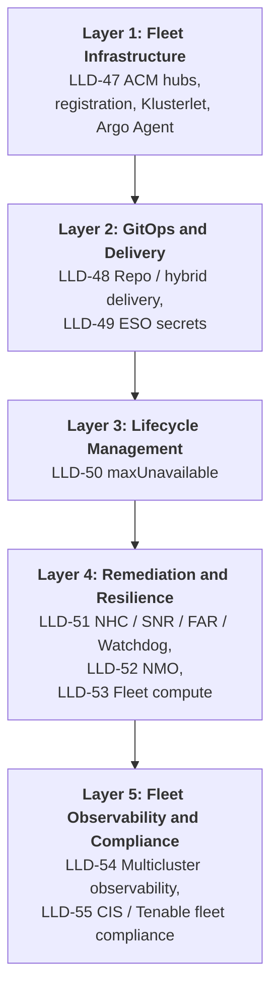
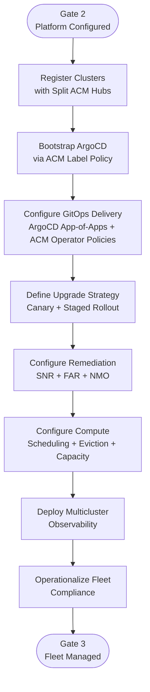

# {CLIENT} OpenShift Virtualization — Phase 3 Fleet Operations LLD

> Replace all `{PLACEHOLDERS}` with engagement-specific values.

---

## Document Control

| Field | Value |
|---|---|
| **Title** | {CLIENT} OpenShift Virtualization — Phase 3 Fleet Operations LLD |
| **Version** | 0.1 |
| **Status** | Draft |
| **Classification** | Internal — Confidential |
| **Author** | {AUTHOR} |
| **Reviewers** | {REVIEWER_LIST} |
| **Approval Authority** | {APPROVER} |
| **Last Updated** | {DATE} |

### Revision History

| Ver | Date | Author | Changes |
|-----|------|--------|---------|
| 0.1 | {DATE} | {AUTHOR} | Initial Phase 3 Fleet Operations LLD |

---

## Scope & References

This LLD provides implementation specifications for Fleet Operations (Phase 3): ACM hub-spoke topology, hybrid ArgoCD + ACM delivery, secrets connectivity, fleet upgrade and maintenance posture, remediation and maintenance operators, fleet compute enforcement, multicluster observability, operations/ITSM, and fleet compliance. Each LLD-N section maps to the corresponding decision in Phase 3 of the {CLIENT} HLD.

---

## Layer Model Overview



---

## Phase 3 Implementation Flow



---

## LLD-47: Fleet Registration Validation

Validate that ACM-provisioned spoke clusters are registered to the correct split hubs with the required labels and policy targeting in place for fleet-wide governance and lifecycle operations. *(ADR 5)*
### Prerequisites

| ID | Item | Owner | Status |
|----|------|-------|--------|
| CG-47-1 | Decide final ACM hub count and tier placement (DC, Regional, branch, sandbox/lab) to close open ADR 5 decisions                  | Architecture / Leadership | Open |
| CG-47-2 | Decide how production ACM hubs handle failure (active/passive standby vs independent per-site hubs)                               | Architecture / Leadership | Open |
| CG-47-3 | Confirm firewall and DNS routes are open from spoke clusters to their ACM hub (required for cluster management and monitoring)     | Platform / Network        | Open |

### Dependencies

| Blocked By | Reason |
|------------|--------|
| Hub Gate (LLD-11H) | Phase 3 execution starts only after Phase 1 hub deployment validation passes (ACM hubs operational) |

### Configuration Parameters

The hub topology, cluster labels, ManagedClusterSets, CIDRs, klusterlet installation, and registration endpoints are defined and applied during provisioning. See Phase 1 LLD-06 (tier labels, Placement, ManagedClusterSets), LLD-08 (CIDRs), LLD-12 (ClusterInstance provisioning), and LLD-12A-12H (hub architecture and DR).

The following parameter is Phase 3 scope - a post-provisioning tuning action validated during fleet operations:

| Parameter                  | Value                                            | Description                                                                                     | Source |
| -------------------------- | ------------------------------------------------ | ----------------------------------------------------------------------------------------------- | ------ |
| Klusterlet policy interval | 60s default, 120s for high-latency branch spokes | Controls how frequently the klusterlet polls for policy changes; tune WAN branches to reduce churn | HLD    |

### Sample Configuration

**ManagedCluster (spoke registers to correct hub namespace):**

```yaml
apiVersion: cluster.open-cluster-management.io/v1
kind: ManagedCluster
metadata:
  name: dc-sb-prod-01
  labels:
    name: dc-sb-prod-01
    tier: dc
    site: site-beta
    environment: production
    cluster.open-cluster-management.io/clusterset: datacenter-production
spec:
  hubAcceptsClient: true
  leaseDurationSeconds: 60
---
apiVersion: cluster.open-cluster-management.io/v1
kind: ManagedClusterAddon
metadata:
  name: klusterlet-addon
  namespace: dc-sb-prod-01
spec:
  installNamespace: open-cluster-management-agent
```

**Placement (policy targeting DC production example):**

```yaml
apiVersion: cluster.open-cluster-management.io/v1beta1
kind: Placement
metadata:
  name: placement-dc-prod
  namespace: policies
spec:
  predicates:
    - requiredClusterSelector:
        labelSelector:
          matchExpressions:
            - key: tier
              operator: In
              values: ["dc"]
            - key: environment
              operator: In
              values: ["production"]
---
apiVersion: cluster.open-cluster-management.io/v1beta1
kind: PlacementBinding
metadata:
  name: bind-dc-prod-compliance
  namespace: policies
placementRef:
  name: placement-dc-prod
  kind: Placement
  apiVersion: cluster.open-cluster-management.io/v1beta1
subjects:
  - name: policy-set-dc-compliance
    kind: PolicySet
    apiVersion: policy.open-cluster-management.io/v1beta1
```

**Verification (hub):**

```bash
oc get managedcluster -o wide
oc get managedcluster <name> -o jsonpath='{.status.conditions[?(@.type=="ManagedClusterConditionAvailable")]}' ; echo
oc get csr | grep pending   # approve if Manual import path used
```

### Tier Variance

| Parameter | DC | Regional | Branch |
|---|---|---|---|
| Hub affinity | ACM hub — DC (or prod hub per final ADR 5) | ACM hub — Regional or embedded in DC (**TBD**) | Dedicated branch ACM hub |
| Cluster count band | Few large clusters | Small/medium clusters | ~400 compact clusters |
| Network latency profile | LAN / low WAN | WAN to hub possible | Highest WAN variance (e.g., international branches) |
| Management blast radius segment | Segment bound to hub | Same | Branch-only segment |

### Implementation Procedure

**Execution Readiness Checks:**

- [ ] ACM hub clusters installed for each tier segment per ADR 5 resolution
- [ ] Hub TLS, ingress, and identity integrate with {CLIENT} enterprise standards
- [ ] Firewall rules allow spoke → hub 443/TCP (and paths documented in ACM networking guide)

**Steps:**

1. Create or reuse `ManagedCluster` / import flow per ACM (automatic from ZTP vs manual kubeconfig import — follow ADR 1).
2. Apply standard label set at registration time (`tier`, `site`, `environment`, clusterset selectors).
3. Configure `Placement`/`PlacementBinding` for policy sets that must apply only to matching tiers.
4. Validate klusterlet availability and policy compliance propagation on a pilot cluster before fleet rollout.
5. Document hub inventory (URLs, namespaces, credential stores) aligned with {SECRET_MGMT_VENDOR} / kubeconfig procedures (ADR 23).

**Verification:**

```bash
# On hub:
oc get managedcluster -o custom-columns=NAME:.metadata.name,AVAILABLE:.status.conditions[?\(@.type==\"ManagedClustersConditionJoined\"\)].status

# On spoke:
oc -n open-cluster-management-agent get pods
```

**Rollback:**

- Detach cluster from ACM only per controlled procedure (impact: loss of centralized policy/GitOps bootstrap); restores last on-cluster state until re-import.

### Acceptance Criteria

| ID | Criterion | Test | Expected Result |
|----|-----------|------|-----------------|
| AC-47-1 | Policies reach spoke | ACM console policy status for pilot cluster | Non-empty compliance report per pilot policy |
| AC-47-2 | Klusterlet policy interval tuned | `oc get klusterletconfig -o jsonpath='{.spec.policyController.interval}'` on branch hub | 120s for branch spokes; 60s elsewhere |
| AC-47-3 | Hub inventory documented | Hub inventory record (URLs, namespaces, credential store references) reviewed and committed | Document exists and covers all active hubs |

---

## LLD-48: GitOps Repository & Delivery — ArgoCD + ACM Hybrid

Define the Git repository structure and configure the ArgoCD + ACM hybrid delivery model for consistent Day-2 configuration across all clusters. *(ADR 49)*
### Prerequisites

| ID | Item | Owner | Status |
|----|------|-------|--------|
| CG-48-1 | Confirm monorepo-per-site repository boundaries and naming convention from sandbox pilot for rollout to production and branch sites | Platform | Closed |
| CG-48-2 | Implement automated alerts when configuration drifts between repositories (e.g., a change in one repo is not reflected in another) | Platform | Open |
| CG-48-3 | Conduct workshop with Red Hat to finalise how ACM operator policies are scoped and targeted per cluster tier                       | Platform / RH | Open |
| CG-48-4 | Validate that ACM can bootstrap the GitOps operator and ArgoCD Agent onto spoke clusters without relying on manual Ansible steps   | Platform | Open |
| CG-48-5 | Confirm OpenShift GitOps version is 1.20.1 or later on all hubs (minimum version required for ArgoCD Agent connectivity)          | Platform | Open |
| CG-48-6 | Identify and register at least one canary cluster per ACM hub segment to serve as the first upgrade target each cycle              | Platform | Open |
| CG-48-7 | Produce a tested compatibility matrix confirming which operator versions are approved for each target OCP minor version            | Platform | Open |

### Dependencies

| Blocked By | Reason |
|------------|--------|
| LLD-47 | Clusters registered with ACM hubs |

### Configuration Parameters

Architecture decisions (ArgoCD + ACM hybrid delivery, ArgoCD Agent on spokes, OperatorPolicy for operator lifecycle, monorepo-per-site layout) are documented in ADR 49 and ADR 46. The sample configurations below implement those decisions. This table contains only the tunable values that must be set per deployment:

| Parameter             | Value                                           | Description                                                                  | Source        |
| --------------------- | ----------------------------------------------- | ---------------------------------------------------------------------------- | ------------- |
| `targetRevision`      | Commit SHA or release tag (`release-YYYYMMDD`) | Production Applications must pin to a specific SHA or tag, never `HEAD`     | ADR 49        |
| TALM `maxConcurrency` | `2` (initial; increase after canary validation) | Maximum clusters upgraded in parallel per `ClusterGroupUpgrade` batch        | ADR 46        |
| Sync window - allow   | CAB-approved maintenance slot (e.g., `0 06 * * 2`, 8h) | ArgoCD AppProject allow window; syncs blocked outside this window | ADR 46 / policy |
| Sync window - deny    | Moratorium periods (e.g., `0 0 15-16 * *`, 48h) | Explicit deny during known blackout periods                                  | policy        |

### Sample Configuration

**Root Application (hub — app-of-apps pattern):**

```yaml
apiVersion: argoproj.io/v1alpha1
kind: Application
metadata:
  name: root-openshift-gitops-platform
  namespace: openshift-gitops
spec:
  project: platform
  source:
    repoURL: https://github.example.com/{CLIENT_ORG}/platform-ocp-prod.git
    targetRevision: <SHA_OR_TAG_TBD>
    path: overlays/hub/root
  destination:
    server: https://kubernetes.default.svc
    namespace: openshift-gitops
  syncPolicy:
    automated:
      prune: true
      selfHeal: true
```

**ACM OperatorPolicy (conceptual — RHACM 2.13+ APIs; adjust `apiVersion` to cluster-supported level):**

```yaml
apiVersion: policy.open-cluster-management.io/v1beta1
kind: OperatorPolicy
metadata:
  name: openshift-virtualization-pin
  namespace: policies
spec:
  remediationAction: enforce
  severity: high
  complianceType: musthave
  subscription:
    channel: stable
    name: kubevirt-hyperconverged
    source: redhat-operators
    sourceNamespace: openshift-marketplace
  upgradeApproval: Automatic
  versions:
    - kubevirt-hyperconverged.v<APPROVED_CSV_ONLY>
---
apiVersion: policy.open-cluster-management.io/v1
kind: Policy
metadata:
  name: enforce-virt-operator-policy
  namespace: policies
spec:
  remediationAction: enforce
  disabled: false
  policy-templates:
    - objectDefinition:
        apiVersion: policy.open-cluster-management.io/v1beta1
        kind: ConfigurationPolicy
        metadata:
          name: virt-operator-pin
        spec:
          remediationAction: enforce
          object-templates:
            - complianceType: musthave
              objectDefinition:
                apiVersion: policy.open-cluster-management.io/v1beta1
                kind: OperatorPolicy
                metadata:
                  name: openshift-virtualization-pin
                  namespace: policies
```

*Note:* Exact embedding of `OperatorPolicy` inside `Policy` may follow ACM Policy Generator manifests in Git — align with RH reference repo validated 04/27 (ADR 49).

**ClusterGroupUpgrade / TALM (upgrade orchestration — enable only after CAB approval and validated canary):**

```yaml
apiVersion: ran.openshift.io/v1alpha1
kind: ClusterGroupUpgrade
metadata:
  name: ocp-upgrade-batch-001
  namespace: default
spec:
  managedPolicies:
    - policy-ocp-upgrade-4xx
  clusterSelector:
    - labelSelector:
        matchLabels:
          environment: sandbox
          upgrade-wave: wave1
  enable: false
  maxConcurrency: 2
```

**ArgoCD sync window (block production syncs during moratorium — illustrative):**

```yaml
apiVersion: argoproj.io/v1alpha1
kind: AppProject
metadata:
  name: fleet-production
  namespace: openshift-gitops
spec:
  syncWindows:
    - kind: allow
      schedule: "0 06 * * 2"
      duration: 8h
      applications: ["*"]
      manualSync: true
    - kind: deny
      schedule: "0 0 15-16 * *"
      duration: 48h
      applications: ["*"]
```

*Adjust schedules to CAB-approved moratorium calendar.*

**ApplicationSet (cluster generator — illustrative):**

```yaml
apiVersion: argoproj.io/v1alpha1
kind: ApplicationSet
metadata:
  name: spoke-day2-config
  namespace: openshift-gitops
spec:
  goTemplate: true
  generators:
    - clusterDecisionResource:
        configMapRef: acm-placement-spokes
        labelSelector:
          matchLabels:
            generator: argo-spokes
  template:
    metadata:
      name: 'spoke-day2-{{.name}}'
    spec:
      project: platform
      source:
        repoURL: https://github.example.com/{CLIENT_ORG}/platform-ocp-prod.git
        targetRevision: '{{.revision}}'
        path: overlays/spokes/{{.metadata.labels.tier}}/base
      destination:
        name: '{{.name}}'
        namespace: openshift-gitops
      syncPolicy: {}
```

### Tier Variance

| Parameter | DC | Regional | Branch |
|---|---|---|---|
| Repo | Production repo (**TBD** split) | Same or Regional-focused repo (**TBD**) | Likely isolated repo / team (**TBD**) |
| Promotion bake | Sandbox → lab same week → prod 1–2 wk | Same pattern scaled | Lab mock → pilot → regional rollout (**TBD**) |
| Hub Argo endpoint | Hub in DC segment | Hub in Regional or shared (**TBD**) | Branch hub |
| ACM policy payloads | Tier-specific operator pins | Tier-specific pins | Conservative pins / bandwidth (**TBD**) |

### Implementation Procedure

**Execution Readiness Checks:**

- [ ] Git org permissions, fork model, CODEOWNERS, and branch protection configured per ADR 49.
- [ ] ACM hub reachable from spokes; Placement labels applied (LLD-47).
- [ ] Decide initial `targetRevision` strategy (SHA vs tag).

**Steps:**

1. Stand up COP-template directory layout in chosen repo(s); migrate existing SRE content incrementally (**TBD** cutover milestones).
2. On hub OpenShift GitOps — deploy root app-of-apps and repo credentials (non-plaintext paths per LLD-49).
3. Implement ACM OperatorPolicy manifests for pinned operators (OCP-V, NMO, logging stack, observability endpoints — list **TBD**).
4. Enable ArgoCD Agent on spokes via ACM bootstrap policy (label-triggered) once OpenShift GitOps operator present.
5. Validate eventual consistency — Argo applies config before operator finishes install; converge to healthy state (ADR 49).
6. Wire cross-repo automation for drift notifications (**TBD** implementation).

**Verification:**

```bash
oc -n openshift-gitops get applications
argocd app list   # via CLI logged into hub instance
oc get operatorpolicy.policy.open-cluster-management.io -n policies
```

**Rollback:**

- Revert Git `targetRevision` on hub Application; Argo reconciles backward where Kubernetes allows.
- For OperatorPolicy revert — coordinated PR lowers approved `versions`; ACM returns OLM plans to Manual for unapproved.

### Acceptance Criteria

| ID | Criterion | Test | Expected Result |
|----|-----------|------|-----------------|
| AC-48-1 | App-of-apps sync healthy | Hub Argo Applications `Synced/Healthy` | No persistent `Degraded` |
| AC-48-2 | Agents registered | Hub shows agent connection for spokes | Connected |
| AC-48-3 | OperatorPolicy enforced | ACM policy CSV matches approved list | Compliance `Compliant` |
| AC-48-4 | Repo structure matches site scaffold | Repo review | `.helm/`, `components/`, `groups/`, `clusters/<hub>/managed-clusters/`, and `implementation/` present |
| AC-48-5 | Sync windows block during moratorium | Attempt manual sync on prod AppProject during deny window | Sync rejected with window violation message |

---

## LLD-49: Secret Sync via ArgoCD + ESO

Configure ArgoCD to deploy ExternalSecret CRs across the fleet so that ESO pulls secrets from {SECRET_MGMT_VENDOR} consistently on every cluster. *(ADR 20)*
### Prerequisites

| ID | Item | Owner | Status |
|----|------|-------|--------|
| CG-49-1 | Deliver complete inventory of all secrets required by ACM, ArgoCD, and cluster operations (prerequisite to PAM integration work)    | Platform / Monte    | Open |
| CG-49-2 | Schedule and complete {SECRET_MGMT_VENDOR}/Conjur integration session with Security to agree ESO connection patterns                | Security / PAM      | Open |
| CG-49-3 | Set a decision date for switching to an alternative secrets solution if {SECRET_MGMT_VENDOR} integration is not ready in time       | Architecture        | Open |
| CG-49-4 | Agree and document how secrets needed at GitOps sync time will be retrieved from the vault without storing values in Git             | Platform / Security | Open |

### Dependencies

| Blocked By | Reason |
|------------|--------|
| LLD-48 | ArgoCD bootstrapped on spokes |

### Configuration Parameters

Architecture decisions for secrets delivery ({SECRET_MGMT_VENDOR}/Conjur, ESO, and ArgoCD delivery path) are defined in ADR 20. This section remains blocked pending CG-49-2; sample manifests below represent the target state once unblocked.

### Sample Configuration

**ExternalSecret (illustrative — ESO CR):**

```yaml
apiVersion: external-secrets.io/v1beta1
kind: SecretStore
metadata:
  name: cyberark-store
  namespace: openshift-config
spec:
  provider:
    cyberark_conjur:
      conjurCredentials:
        serviceAccountSecretRef:
          name: cyberark-ro
          namespace: openshift-config
---
apiVersion: external-secrets.io/v1beta1
kind: ExternalSecret
metadata:
  name: pull-secret-append
  namespace: openshift-config
spec:
  refreshInterval: 1h
  secretStoreRef:
    name: cyberark-store
    kind: SecretStore
  target:
    name: pull-secret
    creationPolicy: Merge
    template:
      type: kubernetes.io/dockerconfigjson
      engineVersion: v2
      data:
        # pattern TBD - align with PAM-approved template
```

**ArgoCD Application snippet pointing at secrets manifest path:**

```yaml
spec:
  source:
    repoURL: https://github.example.com/{CLIENT_ORG}/platform-ocp-prod.git
    path: components/external-secrets/overlays/production
```

### Tier Variance

| Parameter | DC | Regional | Branch |
|---|---|---|---|
| Vault connectivity | Datacenter LAN expectations | WAN to vault possible | Branch firewall path **TBD** (ADR 16) |
| Secret refresh tolerances | **TBD** | **TBD** | Stricter WAN failure modes (**TBD**) |

### Implementation Procedure

**Execution Readiness Checks:**

- [ ] ESO subscription/deployed (**TBD:** via OperatorPolicy + Argo config).
- [ ] {SECRET_MGMT_VENDOR} auth method for Kubernetes agreed with PAM.

**Steps:**

1. Catalog secrets (CG-49-1).
2. For each class define: owner, rotation, Conjur path, namespaces affected.
3. Apply `SecretStore` + RBAC via ArgoCD; validate non-privileged namespaces cannot read vault creds.
4. Replace manual secret injection milestones as connectors go live.

**Verification:**

```bash
oc get externalsecrets -A
oc get secrets <target> -n openshift-config -o yaml | wc -l
```

**Rollback:**

- Disable `ExternalSecret`, restore static `oc create secret` procedure documented per secret.

### Acceptance Criteria

| ID | Criterion | Test | Expected Result |
|----|-----------|------|-----------------|
| AC-49-1 | No plaintext secrets in Git | Repo secret scanner / manual PR review | Violations flagged |
| AC-49-2 | ExternalSecret resolves | `oc describe externalsecret` | Ready True |
| AC-49-3 | ACM install secrets readiness | Provision test spoke without manual undocumented steps | Success after catalog (**TBD** gate) |

---

## LLD-50: maxUnavailable Strategy

Set maxUnavailable values for MachineConfigPool updates to control how many nodes can be rebooting simultaneously during rolling upgrades. *(ADR 45)*
### Prerequisites

| ID | Item | Owner | Status |
|----|------|-------|--------|
| CG-50-1 | Validate in sandbox that VMs migrate successfully when multiple nodes reboot in parallel on large clusters (16+ workers)        | Platform      | Open |
| CG-50-2 | Confirm with Red Hat whether changing the parallel-reboot limit on a node pool triggers an immediate node reboot               | Platform / RH | Open |
| CG-50-3 | Store each cluster's maximum parallel-reboot value explicitly in Git so it is tracked and not left to platform defaults        | Platform      | Open |

### Dependencies

| Blocked By | Reason |
|------------|--------|
| LLD-48 | Upgrade orchestration (TALM CGU) defined |

### Reference

| Cluster Size | maxUnavailable | Rationale | Source |
|--------------|----------------|-----------|--------|
| 3-node compact | `1` | Quorum preservation | ADR 45 / HLD |
| 4–15 nodes | `1` | Conservative drains + migration validation first | ADR 45 |
| 16+ nodes | `2–4` | Parallel drains shorten maintenance — **validated in sandbox first** | ADR 45 / HLD |

### Sample Configuration

**MachineConfigPool (explicit — Phase 3 alignment with LLD Phase 1 example):**

```yaml
apiVersion: machineconfiguration.openshift.io/v1
kind: MachineConfigPool
metadata:
  name: worker
spec:
  machineConfigSelector:
    matchExpressions:
      - key: machineconfiguration.openshift.io/role
        operator: In
        values:
          - worker
  nodeSelector:
    matchLabels:
      node-role.kubernetes.io/worker: ""
  maxUnavailable: 1   # overlays: bump to 2-4 ONLY after CG-50-1
```

Apply via GitOps overlay per cluster tier.

### Tier Variance

Per Cross-Cutting matrix:

| Parameter | DC | Regional | Branch |
|---|---|---|---|
| Node count | High | Medium | Compact (implicit 1) |
| maxUnavailable targets | **2–4 post-validation** | **1–2** | **1** |
| Capacity coupling | Maintain N-1 headroom (**TBD:** exact node count governance) | Same | Highest relative reserve % |

### Implementation Procedure

**Execution Readiness Checks:**

- [ ] Understand current pool membership — control plane pools separate from worker.

**Steps:**

1. Set explicit `spec.maxUnavailable` for `worker`, `master` pools (master pool usually `1`).
2. Document value in fleet inventory YAML per cluster (`clusters/<name>/kustomization.yaml`).
3. After sandbox success, elevate DC worker pools gradually (2→3→**TBD ceiling**).

**Verification:**

```bash
oc get mcp worker -o jsonpath='{.spec.maxUnavailable}'; echo
```

**Rollback:**

- Patch pool back to `1` (`oc patch mcp worker ...`) if parallel drains degrade VM SLO.

### Acceptance Criteria

| ID | Criterion | Test | Expected Result |
|----|-----------|------|-----------------|
| AC-50-1 | maxUnavailable explicitly set per MCP | `oc get mcp worker -o jsonpath='{.spec.maxUnavailable}'` | Non-empty integer value (not defaulted/omitted) |
| AC-50-2 | Tier-correct parallelism matches HLD sizing | Compare maxUnavailable value against HLD tier band (e.g. sandbox=2–4, prod=1) | Value within approved range for each tier |
| AC-50-3 | Capacity headroom validated before bump | Run `oc adm top nodes` and confirm ≥1 spare worker worth of allocatable CPU/RAM | Available capacity > single-node workload footprint |
| AC-50-4 | VM workloads remain available during rolling update | Trigger MCP update in sandbox; monitor `oc get vmi` for unexpected `Failed`/`Unknown` states | Zero VM interruptions beyond live-migration settle time |
| AC-50-5 | Rollback path verified | Patch maxUnavailable back to `1` during active rollout; confirm drain pauses | Only 1 node draining after patch; remaining nodes unaffected |

---

## LLD-51: Node Remediation & Recovery Model

Configure automated node health checks, hardware watchdog integration, and BMC-based remediation actions to detect and recover unhealthy nodes without manual intervention. *(ADR 44)*
### Prerequisites

| ID | Item | Owner | Status |
|----|------|-------|--------|
| CG-51-1 | Validate in sandbox that automated hard-reboot via {HW_MGMT_PLATFORM} BMC works end-to-end, then formally close the ADR decision | Platform / RH  | Open |
| CG-51-2 | Decide whether NodeHealthCheck runs unpaused (fully automatic remediation) or paused (remediation disabled until an operator explicitly unpauses); note that medik8s has no per-incident approval gate — this is a cluster-wide on/off setting | Ops / Security | Open |
| CG-51-3 | Document whether the automated fence action powers the node off or reboots it, and specify any workload-class exceptions            | Platform       | Open |
| CG-51-4 | Confirm that bare-metal servers expose a hardware watchdog device that the self-remediation operator can use                        | Platform            | Open |
| CG-51-5 | Validate in sandbox that the automated fence agent can authenticate to BMC and trigger a power action                               | Infrastructure / RH | Open |

### Dependencies

| Blocked By | Reason |
|------------|--------|
| LLD-49 | BMC secrets vaulted via ESO (or interim manual procedure per LLD-49 while blocked) |

### Configuration Parameters

| Parameter | Value | Description | Source |
|-----------|-------|-------------|--------|
| `minHealthyNodes` | `"51%"` | Minimum healthy worker nodes before NodeHealthCheck pauses further remediation to prevent cascading fences | ADR 44 / RH WA docs |
| SNR `timeoutSeconds` | `300` | Seconds to wait for self-node-remediation to recover the node before escalating to FAR; tune per SLA | ADR 44 |
| FAR `timeoutSeconds` | `420` | Seconds to wait for fence-agent remediation (BMC power-cycle) to complete before marking remediation failed | ADR 44 |
| `fenceAgent` | `redfish` | BMC fence method; set to `redfish` for {HW_MGMT_PLATFORM} Redfish-capable servers, `ipmilan` for legacy IPMI | HLD Phase 3 |

### Sample Configuration

> **Implementation note:** API groups/versions evolve with RH Workload Availability operator bundle — reconcile against target OCP 4.21 / WA operator docs before apply.

```yaml
apiVersion: self-node-remediation.medik8s.io/v1alpha1
kind: SelfNodeRemediationTemplate
metadata:
  name: snr-cr-template
spec:
  template:
    metadata:
      name: self-node-remediation
    spec: {}
---
apiVersion: fence-agents-remediation.medik8s.io/v1alpha1
kind: FenceAgentsRemediationTemplate
metadata:
  name: far-redfish-ipmi-template
spec:
  template:
    metadata:
      name: fence-remediation
    spec:
      nodeCoordinates:
        bmcIPAddress: BMC_IP_HERE
      fenceAgent: redfish
      sharedSecret:
        fenceSecretName: bmcs-holding-redfish-login
---
apiVersion: self-node-remediation.medik8s.io/v1alpha1
kind: NodeHealthCheck
metadata:
  name: degraded-node-chain
spec:
  minHealthyNodes: "51%"
  selector:
    matchExpressions:
      - key: node-role.kubernetes.io/worker
        operator: Exists
  unmatchedNodePolicy: Continue
  escalatingRemediations:
    - remediationStrategy: remediationTemplate
      order: 0
      remediationTemplateRef:
        name: snr-cr-template
        namespace: openshift-workloads-availability-fencing
      timeoutSeconds: 300   # Example - tune per SLA
      strategy: OutOfScope  # escalate if not recovered within timeout -> next order per design
    - remediationStrategy: remediationTemplate
      order: 1
      remediationTemplateRef:
        name: far-redfish-ipmi-template
        namespace: openshift-workloads-availability-fencing
      timeoutSeconds: 420
```

*Align field names (`escalatingRemediations`, `RemediationTemplateRef`) with GA CRDs on cluster — placeholders above illustrate intent from HLD sequence.*

### Tier Variance

| Parameter | DC | Regional | Branch |
|---|---|---|---|
| BMC redundancy | Dedicated full-feature UCS | UCS | Unified Edge BMC model (**validate FAR**) (**TBD**) |

### Implementation Procedure

**Execution Readiness Checks:**

- [ ] Workload Availability / medik8s operators installed via ACM pins.
- [ ] BMC secrets vaulted (LLD-49) — never plain in Git.
- [ ] Live migration prerequisites met (RWX disks per ADR 37).

**Steps:**

1. Deploy SNR + FAR operators + prerequisite RBAC (operator OLM subscription channel selection **TBD**).
2. Confirm `/dev/watchdog` present on worker nodes during staging boot; correlate SNR logs asserting `HardwareWatchdog` strategy.
3. Verify Redfish credential reachability (`curl -sk https://<bmc>/redfish/v1/Systems` returns HTTP 200).
4. Create templates + escalating `NodeHealthCheck` per sandbox outcome.
5. Document any nodes lacking hardware watchdog — escalate risk acceptance for software-only fallback.
6. Optional: integrate EDA playbooks referenced in ADR 44.

**Verification:**

- Controlled fault injection sandbox — unplug vs hang scenarios per safety plan (**TBD**).

**Rollback:**

- Remove / pause `NodeHealthCheck` remediation by setting `paused: true` or deleting CR (**TBD** exact field).

### Acceptance Criteria

| ID | Criterion | Test | Expected Result |
|----|-----------|------|-----------------|
| AC-51-1 | SNR remediates soft faults | Simulate kubelet hang (**TBD** harness) | Node returns Ready |
| AC-51-2 | FAR triggers after SNR timeout | Simulate hard hang | BMC cycle observed + VMs rescheduled |
| AC-51-3 | POC loop regression absent | Scenario replay | FAR invoked — no indefinite SNR loop |
| AC-51-4 | Hardware watchdog path preferred | Inspect SNR diagnostic logs | Strategy shows hardware watchdog when device exists |
| AC-51-5 | BMC Redfish reachable | `curl -sk https://<bmc>/redfish/v1/Systems` | HTTP 200 |

---

## LLD-52: Node Maintenance Operator

Deploy the Node Maintenance Operator to provide a controlled cordon-and-drain workflow for planned node maintenance with VM live migration. *(ADR 47)*
### Prerequisites

| ID | Item | Owner | Status |
|----|------|-------|--------|
| CG-52-1 | Confirm the Node Maintenance Operator subscription channel and approved version, then pin it in the ACM policy              | Platform   | Open |
| CG-52-2 | Deliver and test the Ansible automation that opens and closes a node drain request linked to an approved ServiceNow change  | Automation | Open |
| CG-52-3 | Evaluate and optionally implement automated ServiceNow ticket status updates when node maintenance state changes (optional) | Automation | Open |

### Dependencies

No hard blockers. Recommended sequencing is after LLD-51 for a coherent remediation + maintenance operating model.

### Configuration Parameters

NMO has no fleet-level configuration parameters. The operator is installed via ACM OperatorPolicy (ADR 47) and each maintenance event is driven by a per-node `NodeMaintenance` CR with instance-specific values (`nodeName`, `reason`). {ITSM_PLATFORM}/AAP integration is an operational workflow, not a platform tunable.

### Sample Configuration

**OperatorPolicy hook (conceptual)**

```yaml
apiVersion: policy.open-cluster-management.io/v1beta1
kind: OperatorPolicy
metadata:
  name: node-maintenance-operator
  namespace: policies
spec:
  remediationAction: enforce
  subscription:
    name: node-maintenance-operator
    namespace: openshift-nmo
```

**NodeMaintenance CR**

```yaml
apiVersion: nodemaintenance.medik8s.io/v1beta1
kind: NodeMaintenance
metadata:
  name: drain-worker-17
spec:
  nodeName: worker-17
  reason: "CHG123456 Planned firmware"
```

CLI alternative for break-glass: `oc adm cordon`, `drain`.

### Tier Variance

| Parameter | DC | Regional | Branch |
|---|---|---|---|
| Maintenance frequency | Highest | Moderate | Lower absolute count (**TBD** staffing model) |

### Implementation Procedure

**Execution Readiness Checks:**

- [ ] VMs use `LiveMigrate` evictionStrategy (ADR 37) enabling drain progress.

**Steps:**

1. Install / upgrade NMO fleet-wide via ACM.
2. Test CR cycle on sandbox node observing VM migrations.
3. Wire AAP job template Parameters: CLUSTER, NODE, CHG#, TTL.
4. Document uncordon failure playbook if CR deletion stuck.

**Verification:**

```bash
oc get nm -A
oc describe nm drain-worker-17
```

**Rollback:**

- Delete `NodeMaintenance` CR; forcibly cleanup finalizers only per emergency playbook (**danger**).

### Acceptance Criteria

| ID | Criterion | Test | Expected Result |
|----|-----------|------|-----------------|
| AC-52-1 | NMO subscribed | ACM policy / `Subscription` CSV | Desired CSV |
| AC-52-2 | Planned drain migrates VMs | Observation / metrics | VMs Running elsewhere |
| AC-52-3 | SNOW linkage | Pilot CHG automation | Matching ticket references |

---

## LLD-53: Fleet Compute Configuration

Standardize compute-related MachineConfigs, kernel parameters, and runtime settings across the fleet via GitOps delivery. *(ADR 37, 38, 39, 40, 45)*
### Prerequisites

| ID | Item | Owner | Status |
|----|------|-------|--------|
| CG-53-1 | Confirm GitOps overlays set Live Migrate as the default VM eviction strategy on all clusters                                    | Platform      | Open                      |
| CG-53-2 | Confirm capacity dashboards are available and visible per ACM hub (dashboard IDs to be assigned)                                | Observability | Open                      |
| CG-53-3 | Confirm Pressure Stall Information kernel setting is applied on all worker nodes before enabling the descheduler (Phase 1 link) | Platform      | Track Phase 1 LLD linkage |
| CG-53-4 | Select and confirm the descheduler VM-balancing profile after sandbox testing                                                   | Platform      | Open                      |

### Dependencies

| Blocked By | Reason |
|------------|--------|
| LLD-52 | Node Maintenance Operator deployed |

### Configuration Parameters

The following settings are applied during earlier phases and validated fleet-wide in Phase 3 via ACM governance policies:

- **EvictionStrategy `LiveMigrate`** -- set as OCP-V default in Phase 2 (LLD-34/AC-34-4)
- **Memory overcommit disabled** -- enforced in Phase 2 (ADR 38)
- **Pods per node `512`** -- applied via KubeletConfig in Phase 1 (LLD-14/AC-14-7)

The following parameters are Phase 3 scope -- new configuration applied during fleet operations:

| Parameter | Value | Description | Source |
|-----------|-------|-------------|--------|
| `batchEvictionSize` | `10` | Maximum VMs live-migrated concurrently during operator upgrades; limits migration storms | HLD / ADR 37 |
| `batchEvictionInterval` | `1m0s` | Delay between migration batches during operator upgrades | HLD / ADR 37 |
| Descheduler profile | **TBD** after sandbox testing | KubeVirtDescheduler VM-balancing profile; requires PSI kernel setting (Phase 1) | ADR 40 |
| `deschedulingInterval` | `10m` (conservative) | How often the descheduler evaluates VM placement balance | ADR 40 |

### Sample Configuration

**HyperConverged workloadUpdateStrategy (controls VM migration behaviour during operator upgrades):**

```yaml
apiVersion: hco.kubevirt.io/v1beta1
kind: HyperConverged
metadata:
  name: kubevirt-hyperconverged
  namespace: openshift-cnv
spec:
  workloadUpdateStrategy:
    workloadUpdateMethods:
      - LiveMigrate
    batchEvictionSize: 10
    batchEvictionInterval: "1m0s"
```

**VirtualMachine / cluster default eviction (illustrative `kubevirt` API fragment):**

```yaml
spec:
  template:
    spec:
      evictionStrategy: LiveMigrate
```

Fleet default may be conveyed via mutation policy / validating defaults — **exact mechanism **TBD** (OPA/Gatekeeper vs template sync).**

**Kubelet maxPods reinforcement (duplicate reference from Phase 1 pattern):**

```yaml
apiVersion: machineconfiguration.openshift.io/v1
kind: KubeletConfig
metadata:
  name: fleet-max-pods-512
spec:
  kubeletConfig:
    maxPods: 512
  machineConfigPoolSelector:
    matchLabels:
      pools.operator.machineconfiguration.openshift.io/worker: ""
```

**KubeVirtDescheduler (post-enablement)**

```yaml
apiVersion: descheduler-operator.openshift.io/v1beta1
kind: KubeVirtDescheduler
metadata:
  name: cluster
  namespace: openshift-kube-descheduler
spec:
  deschedulingInterval: 10m     # Tune conservatively
  profileBindings:
    - kubevirt/profile: kubvirt-relieve-pressure  # Candidate - confirm exact string post-sandbox
```

### Tier Variance

Per Cross-Cutting:

| Parameter | DC | Regional | Branch |
|---|---|---|---|
| Spare-node strategy | Maintain 2–3 | 1–2 | Implicit N-1 (~34% HA reserve guideline) |
| maxUnavailable parallelism | Highest post-validation | Middle | Locked at 1 |
| Observability dashboards | Full | Full | Metrics-only reductions may limit some panels (**TBD**) |

### Implementation Procedure

**Execution Readiness Checks:**

- [ ] Phase 2 storage classes support RWX for migratable fleets.

**Steps:**

1. Apply GitOps overlays for eviction defaults + MCP maxUnavailable selections.
2. Integrate dashboards + alerts referencing spare capacity metrics (**TBD** PromQL catalogue).
3. Enable descheduler only after PSI validation & sandbox soak.
4. Add ACM governance check for divergence (desired config JSON vs spoke).

**Verification:**

- Synthetic drain — ensure blocked when insufficient schedulable capacity with `LiveMigrate`.

**Rollback:**

- Temporarily downgrade eviction to `LiveMigrateIfPossible` only under explicit CAB — **risk**: masks capacity debt (generally discouraged per ADR 37).

### Acceptance Criteria

| ID | Criterion | Test | Expected Result |
|----|-----------|------|-----------------|
| AC-53-1 | LiveMigrate default enforced | Sampling VM specs (**TBD** script) | `LiveMigrate` majority |
| AC-53-2 | Capacity headroom | Dashboard / query | ≥1 usable worker headroom (**TBD** metric naming) |
| AC-53-3 | MCP parallelism consistent | Fleet inventory diff | Matches tier |
| AC-53-4 | workloadUpdateStrategy persisted on HCO | `oc get hc -n openshift-cnv -o jsonpath='{.spec.workloadUpdateStrategy}'` | Shows `LiveMigrate` method with batch settings |

---

## LLD-54: Multicluster Observability

Configure ACM Multicluster Observability with Thanos on the hub to aggregate Prometheus metrics from all spoke clusters for fleet-wide visibility. *(ADR 42, 43)*
### Prerequisites

| ID | Item | Owner | Status |
|----|------|-------|--------|
| CG-54-1 | Calculate and provision storage capacity for per-cluster Prometheus to retain at least 30 days of metrics data       | Observability | Open |
| CG-54-2 | Provision an object storage bucket per ACM hub and configure the metrics allowlist to include virtualisation metrics  | Observability | Open |
| CG-54-3 | Deploy log forwarding to {SIEM_PLATFORM} fleet-wide and agree a cutover schedule per tier                            | Observability | Open |
| CG-54-4 | Validate alert routing from clusters to the NOC platform and document the future migration path to {NOC_PLATFORM}    | Observability | Open |
| CG-54-5 | Assess readiness to migrate VM dashboards from Grafana to Perses and agree a migration timeline                      | Observability | Open |

### Dependencies

| Blocked By | Reason |
|------------|--------|
| LLD-53 | Fleet compute configuration applied |

### Sample Configuration

**Allowlist excerpt (KubeVirt metrics — illustrative ConfigMap)**

```yaml
apiVersion: v1
kind: ConfigMap
metadata:
  name: observability-metrics-allowlist
  namespace: open-cluster-management-observability
data:
  metrics_list.yaml: |
    names:
      - kubevirt_hyperconverged_operator_health_status
      - kubevirt_virt_controller_ready
```

*Exact ConfigMap semantics follow ACM Observability docs for installed release.*

### Tier Variance

| Parameter | DC | Regional | Branch |
|---|---|---|---|
| Stack depth | Full (logs+metrics+NOC alerts) | Full / possible ICOS WAN | Branch row in CrossCutting suggests reduced stack panels — confirm scope (**TBD**) |

### Implementation Procedure

**Execution Readiness Checks:**

- [ ] Certificates + routes for hub Grafana/Prometheus Thanos integrations.

**Steps:**

1. Deploy Multicluster Observability Operator on hubs (exclusive per Global Hub collisions **if ever adopted — not {CLIENT} Phase 3**).
2. Configure object bucket secrets via ESO pipeline.
3. Tune allowlists for VM cardinality management.
4. Validate cross-cluster Grafana/Perses VM dashboard panels with pilot workloads.

**Verification:**

- Sample alert firing test into Moogsoft non-prod queue.

**Rollback:**

- Toggle observability off per RH procedure if causing hub instability — record blast.

### Acceptance Criteria

| ID | Criterion | Test | Expected Result |
|----|-----------|------|-----------------|
| AC-54-1 | Thanos ingest healthy | Grafana explore / `thanos ruler` alerts | Targets up |
| AC-54-2 | Logs land in {SIEM_PLATFORM} | Search (`index=TBD kube_namespace=openshift*`) | Events present (**TBD** index) |
| AC-54-3 | Alerts route | Synthetic alert | Moogsoft (**or {NOC_PLATFORM} later**) acknowledgement |

---

## LLD-55: Fleet-wide Compliance & Hardening

Enforce CIS benchmarks, audit policies, and security hardening standards fleet-wide via ACM governance policies with automated compliance reporting. *(ADR 25)*

### Prerequisites

| ID      | Item                                                                                                       | Owner               | Status |
| ------- | ---------------------------------------------------------------------------------------------------------- | ------------------- | ------ |
| CG-55-1 | Onboard all managed clusters into Tenable for CIS scanning and confirm network paths are open per ACM hub  | Security            | Open   |
| CG-55-2 | Deliver an ACM governance policy baseline mapped to the agreed CIS controls (mapping sheet required)       | Platform / Security | Open   |
| CG-55-3 | Agree the plan and timeline to migrate from CIS benchmark version 1.8 to 1.9                               | InfoSec             | Open   |
| CG-55-4 | Implement the process for exporting quarterly Tenable scan results in a format suitable for audit evidence | Compliance          | Open   |

### Dependencies

| Blocked By | Reason                              |
| ---------- | ----------------------------------- |
| LLD-54     | Multicluster observability deployed |
| LLD-48     | GitOps delivery pipeline functional |

### Configuration Parameters

| Parameter                      | Value                                              | Description                                                                                            | Source            |
| ------------------------------ | -------------------------------------------------- | ------------------------------------------------------------------------------------------------------ | ----------------- |
| Policy namespace               | `policies`                                         | Hub namespace where all governance PolicySets are deployed; ACM watches this NS for policy propagation | ACM best practice |
| Default remediationAction      | `inform`                                           | All policies start as audit-only; escalation to `enforce` requires CAB approval per individual control | ADR 25 / HLD      |
| CIS benchmark version          | 1.8 (current); 1.9 migration **TBD** timeline     | Controls mapped to ACM policies and Tenable scan profiles must align to same benchmark version         | ADR 25            |
| Tenable scan schedule          | Weekly (**TBD** exact cron per tier)               | External scans against cluster API/node endpoints; scheduled outside maintenance moratoriums           | Security          |
| Compliance evaluation interval | `10m` (ACM default)                                | How often ACM re-evaluates policy compliance on managed clusters                                       | ACM docs          |

### Sample Configuration

**PolicyGenerator (Kustomize plugin — generates Policy CRs from templates):**

```yaml
apiVersion: policy.open-cluster-management.io/v1
kind: PolicyGenerator
metadata:
  name: cis-baseline
policyDefaults:
  namespace: policies
  remediationAction: inform
  consolidateManifests: false
  policySets:
    - cis-ocp-baseline
placementBindingDefaults:
  name: cis-baseline-binding
policies:
  - name: etcd-encryption-required
    manifests:
      - path: input-manifests/etcd-encryption.yaml
  - name: audit-profile-configured
    manifests:
      - path: input-manifests/audit-profile.yaml
  - name: kubeadmin-removed
    manifests:
      - path: input-manifests/kubeadmin-check.yaml
policySets:
  - name: cis-ocp-baseline
    description: "CIS OCP Benchmark 1.8 controls enforced via ACM"
    policies:
      - etcd-encryption-required
      - audit-profile-configured
      - kubeadmin-removed
```

**Individual policy template (`input-manifests/etcd-encryption.yaml`):**

```yaml
apiVersion: policy.open-cluster-management.io/v1
kind: ConfigurationPolicy
metadata:
  name: check-etcd-encryption
spec:
  remediationAction: inform
  severity: high
  object-templates:
    - complianceType: musthave
      objectDefinition:
        apiVersion: config.openshift.io/v1
        kind: APIServer
        metadata:
          name: cluster
        spec:
          encryption:
            type: aesgcm
```

**Placement rule (phased rollout — sandbox first, then production tiers):**

```yaml
apiVersion: cluster.open-cluster-management.io/v1beta1
kind: Placement
metadata:
  name: cis-baseline-placement
  namespace: policies
spec:
  predicates:
    - requiredClusterSelector:
        labelSelector:
          matchExpressions:
            - key: compliance-baseline
              operator: In
              values: ["cis-1.8"]
```

### Tier Variance

| Parameter          | DC                                  | CDF                    | Branch                                                |
| ------------------ | ----------------------------------- | ---------------------- | ----------------------------------------------------- |
| Scan schedule      | Weekly (Sunday 02:00 ET)            | Weekly (Sunday 04:00)  | Bi-weekly (**TBD** — WAN scheduling tolerance)        |
| PolicySet rollout  | After sandbox validation            | Same wave as DC        | Separate wave — confirm WAN policy sync               |
| Tenable profile    | Full CIS OCP + OCP-V (26 controls)  | Same as DC             | Reduced scope if hardware constraints (**TBD**)       |
| Auto-enforce scope | None (inform only)                  | None (inform only)     | None (inform only)                                    |

### Implementation Procedure

**Execution Readiness Checks:**

- [ ] etcd encryption enabled (LLD-21).
- [ ] GitOps repo structure includes `components/compliance/` path (LLD-48).
- [ ] Tenable scanner appliance deployed with network access to cluster nodes (LLD-02 firewall rules).
- [ ] ACM hub operational with managed clusters registered (LLD-47).

**Steps:**

1. Create the `policies` namespace on each ACM hub (if not already present from ACM install).

```bash
oc create namespace policies --dry-run=client -o yaml | oc apply -f -
```

2. Author PolicyGenerator YAML and input manifests in `components/compliance/` within the GitOps repo. Start with three foundational controls:
   - `etcd-encryption-required` — verifies `APIServer.spec.encryption.type`
   - `audit-profile-configured` — verifies `APIServer.spec.audit.profile` is not `None`
   - `kubeadmin-removed` — verifies `Secret/kubeadmin` absent in `kube-system`

3. Create the ArgoCD Application targeting `components/compliance/` on each hub. Sync generates Policy + PlacementBinding + PolicySet CRs.

```bash
oc get policy -n policies
# Expect: etcd-encryption-required, audit-profile-configured, kubeadmin-removed
```

4. Add the `compliance-baseline: cis-1.8` label to sandbox clusters first.

```bash
oc label managedcluster <sandbox-cluster> compliance-baseline=cis-1.8
```

5. Validate compliance status on sandbox clusters before expanding scope.

```bash
oc get policy -n policies -o custom-columns=NAME:.metadata.name,COMPLIANT:.status.compliant
```

6. Expand placement labels to DC/CDF clusters, then branch clusters in subsequent waves.

7. Configure Tenable scan credentials and schedules:
   - Provide Tenable scanner with SSH key for `core` user (read-only scan profile).
   - Set scan schedule per tier (see Tier Variance).
   - Map scan results to CIS control IDs matching the ACM policy names.

8. Validate Tenable findings align with ACM compliance dashboard. Discrepancies indicate:
   - Missing ACM policies (controls only covered by Tenable).
   - False positives in either tool (document in exception register).

9. Establish remediation workflow: Tenable finding → Jira/SNOW ticket → PR to Git manifest → CAB approval → ArgoCD sync.

**Verification:**

```bash
# All policies in compliant state on managed clusters
oc get policy -n policies -o json | \
  jq -r '.items[] | "\(.metadata.name): \(.status.compliant)"'

# Per-cluster compliance breakdown
oc get policy -n policies -o json | \
  jq -r '.items[] | .status.status[]? | "\(.clusternamespace): \(.compliant)"'
```

**Rollback:**

- Set all policies to `inform` (already default — no destructive action).
- Remove `compliance-baseline` label from clusters to de-scope from placement.
- Delete ArgoCD Application targeting `components/compliance/` if full rollback needed.

### Acceptance Criteria

| ID      | Criterion                      | Test                                                                  | Expected Result                                                      |
| ------- | ------------------------------ | --------------------------------------------------------------------- | -------------------------------------------------------------------- |
| AC-55-1 | Policies synced to hub         | `oc get policy -n policies` on each hub                               | All expected Policy CRs present and propagated                       |
| AC-55-2 | Sandbox compliance reported    | ACM console → Governance → Compliance tab for sandbox cluster         | Status shows `Compliant` or documented exceptions                    |
| AC-55-3 | Tenable scan completes         | Tenable console → scan history for target clusters                    | Last scan within scheduled window; results downloadable              |
| AC-55-4 | ACM + Tenable findings aligned | Compare ACM non-compliant list with Tenable critical/high findings    | No unaccounted discrepancies (delta documented in exception register) |
| AC-55-5 | Remediation workflow exercised | Intentionally introduce non-compliance → verify PR/CAB path completes | Finding → ticket → PR → CAB → merge → ArgoCD sync → compliant       |

---


## Phase 3 Gate Criteria — Full-Stack Validation

| Layer | HLD Gate Criterion | LLD Acceptance Tests | Status |
|-------|-------------------|---------------------|--------|
| L1 | Clusters provisioned in Phase 1 (`LLD-12`) are visible in their respective ACM hubs with `Compliant` status | Phase 1 AC-12-1..4, AC-47-1 | [ ] |
| L2 | ArgoCD app-of-apps syncing from Git repo; ACM operator policies enforcing operator versions fleet-wide | AC-48-1, AC-48-3, AC-48-4 | [ ] |
| L2 | ArgoCD Agent deployed on all spoke clusters; hub Argo instance shows fleet-wide sync status | AC-48-2 | [ ] |
| L3 | Canary cluster identified and upgrade path tested | CG-48-6, CG-48-7 | [ ] |
| L4 | SNR/FAR operators deployed; {HW_MGMT_PLATFORM} IPMI-over-LAN confirmed | AC-51-2, AC-51-5, CG-51-1 | [ ] |
| L4 | NMO deployed on all OCP-V clusters; {ITSM_PLATFORM} integration via AAP functional | AC-52-1, AC-52-3 | [ ] |
| L4/L3 | VM eviction set to `LiveMigrate`; capacity headroom verified (**1+** spare node per cluster, **2–3** preferred DC/Regional) | AC-53-1, AC-53-2 | [ ] |
| L5 | ACM Thanos aggregating metrics from managed clusters; Grafana/Perses dashboards operational | AC-54-1 | [ ] |
| L5 | Vector → {SIEM_PLATFORM} log forwarding active across fleet; AlertManager → Moogsoft routing confirmed | AC-54-2, AC-54-3 | [ ] |
| L5 | Tenable CIS scans running across fleet; ACM compliance policies reporting status per cluster | AC-55-1, AC-55-2 | [ ] |

**Gate 3 PASSED when all rows show [x].**