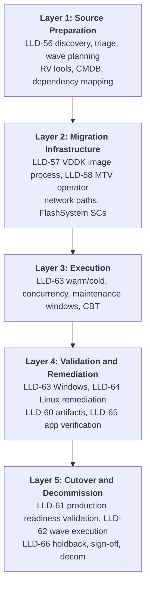
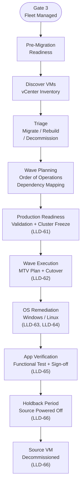

# {CLIENT} OpenShift Virtualization — Phase 4 Migration LLD

> Replace all `{PLACEHOLDERS}` with engagement-specific values.

---

## Document Control

| Field | Value |
|---|---|
| **Title** | {CLIENT} OpenShift Virtualization — Phase 4 Migration LLD |
| **Version** | 0.1 |
| **Status** | Draft |
| **Classification** | Internal — Confidential |
| **Author** | {AUTHOR} |
| **Reviewers** | {REVIEWER_LIST} |
| **Approval Authority** | {APPROVER} |
| **Last Updated** | {DATE} |

### Revision History

| Ver | Date | Author | Changes |
|-----|------|--------|---------|
| 0.1 | {DATE} | {AUTHOR} | Initial Phase 4 Migration LLD |

---

## Scope & References

This LLD provides implementation specifications for every Phase 4 (Migration) decision documented in the HLD. Each section maps 1:1 to an HLD decision area and contains configuration parameters, implementation procedures, layer context, and testable acceptance criteria. **Phase 4 gate criteria:** the Production Readiness Validation (LLD-61) is executed once per receiving cluster before the first wave; subsequent per-wave gates are the wave-level GO/NO-GO review in the change record.

---

## Layer Model Overview

Phase 4 spans five logical layers from source preparation through decommission:



| Layer | Scope |
|-------|--------|
| **L1** | Source preparation: discovery, RVTools, CMDB/{ITSM_PLATFORM}, triage, wave planning, wave order of operations |
| **L2** | Migration infrastructure: VDDK image process, MTV operator, network paths, FlashSystem storage classes |
| **L3** | Execution: warm/cold methods, concurrency, maintenance windows, CBT |
| **L4** | Validation and remediation: post-migration checks, Linux/Windows remediation, artifact storage, app verification |
| **L5** | Cutover and decommission: production readiness validation, wave execution, app verification, holdback, sign-off, decom         |

---

## Phase 4 Implementation Flow



---

## Phase 4 Prescriptive Operating Rules

The following controls apply to **every** Phase 4 LLD section and wave:

1. Do not execute a wave step until all listed completion gates for that LLD are marked complete or have an approved exception.
2. Every gate and acceptance criterion must map to objective evidence in the wave evidence pack (command output, ticket, report, or signed approval).
3. Every external dependency update (registry image, Provider, network map, storage map, change ticket) must be versioned and timestamped.
4. Any failed verification step requires explicit disposition: retry, remediate, or rollback — no silent carry-forward.
5. If a criterion cannot be met, record the exception owner, expiry date, and risk acceptance reference before proceeding.

---

## LLD-56: Migration Discovery, Triage & Wave Planning

Define the migration discovery workflow, workload triage outcomes, and wave execution order of operations from pilot through production. *(ADR 55, ADR 50)*

### Prerequisites

| ID      | Item                                                                                                                 | Owner                        | Status  |
| ------- | -------------------------------------------------------------------------------------------------------------------- | ---------------------------- | ------- |
| CG-56-1 | Complete RVTools VM inventory export for each source vCenter site                                                    | Migration                    | Open    |
| CG-56-2 | Reconcile ServiceNow/CMDB dependency mapping against discovered VM inventory                                         | App Owners / Migration       | Open    |
| CG-56-3 | Approve pilot wave VM list (15–20 low-criticality, low-dependency VMs; 10 acceptable for high-storage candidates)    | Migration / App Owners       | Open    |
| CG-56-4 | Agree methodology for wave grouping and execution order by app affinity/dependency/risk                              | Migration Lead / App Owners  | Open    |
| CG-56-5 | Publish migration wave schedule by business unit and change window cadence                                           | Change Mgmt / Leadership     | **TBD** |
| CG-56-6 | Define pilot success criteria including 2-week validation period and OS patch-cycle execution                        | Platform / OS Teams          | Open    |
| CG-56-7 | Document migration execution operating model (migration captain role, CAB go/no-go, bridge staffing, comms channels) | Migration Lead / Change Mgmt | Open    |

### Dependencies

| Blocked By     | Reason                                                                     |
| -------------- | -------------------------------------------------------------------------- |
| Phase 2 LLD-46 | Benchmarking data used for initial wave sizing and concurrency assumptions |

### Design Decisions

Wave planning strategy, triage criteria, and wave composition methodology are governed by ADR 55 and ADR 50. The following table captures implementation-level decisions specific to this LLD.

| Parameter                         | Value                                                                     | Description                                                                                         |
| --------------------------------- | ------------------------------------------------------------------------- | --------------------------------------------------------------------------------------------------- |
| Inventory tool                    | RVTools export                                                            | Captures VM name, OS, CPU, memory, disk, power state, and host/cluster per site                     |
| Dependency source                 | {ITSM_PLATFORM} CMDB                                                      | VM-to-application and upstream/downstream relationships; reconciled against RVTools snapshot date    |
| Pilot wave size                   | 15–20 VMs (10 acceptable for high-storage candidates)                    | Low-criticality, low-dependency; must represent all OS classes, VLAN paths, and datastore mappings  |
| Pre-migration compatibility scope | ISO/CD-ROM mount, NIC (IPv4/IPv6), guest OS support, VM naming, disk mode, encryption, AV/EDR risk | Applied per-VM during triage; exceptions require documented approval before wave assignment |
| VLAN pre-check implementation     | MTV pre-migration VLAN validation hook                                    | Blocks migration when VLAN reachability fails; must pass before Plan CR is applied                  |
| Export retention                  | Timestamped immutable filenames in wave evidence pack                     | Raw RVTools exports retained per wave; linked to {ITSM_PLATFORM} change record as audit artifact    |

### Sample Configuration

See `Sample_Migration_Weekly_Schedule.xlsx` (provided separately). This workbook is the authoritative wave planning artifact for this LLD.

### Tier Variance

None — wave planning methodology, workbook structure, and triage criteria apply uniformly across all deployment tiers.

### Implementation Procedure

**Execution Readiness Checks:**

- [ ] vCenter access for RVTools export at all in-scope sites
- [ ] CMDB/ServiceNow export process agreed with app owners
- [ ] Namespace/RBAC placement rules are available for wave-to-namespace mapping (ADRs 27–29)
- [ ] Phase 2 benchmarking outputs available for initial concurrency assumptions (LLD-46)
- [ ] CAB calendar and app-owner approval routing are defined for pilot and production waves
- [ ] Source VM pre-migration compatibility checklist criteria agreed (ISO/CD-ROM, NIC addressing, naming, disk/encryption posture, supported guest OS)

**Steps:**

1. Export RVTools per site and store raw exports with immutable timestamped names in the wave evidence pack.
2. Obtain CMDB/ServiceNow application-to-VM and upstream/downstream dependency data for the same snapshot date.
3. Merge inventory + CMDB data and produce an exception list for missing owner/dependency metadata.
4. Triage each VM to migrate/rebuild/retire; record rationale, owner, risk tier, rollback estimate, and target wave.
5. Review the RVTools export for each VM against the pre-migration compatibility criteria: ISO/CD-ROM mounts detached, NIC has IPv4/IPv6 address, guest OS is on the MTV supported list, VM name is Kubernetes-compliant, disk mode is not independent-persistent, encryption is documented, and no known AV/EDR with VMware-specific hooks. Record exceptions with documented approval before wave assignment.
6. Define pilot wave candidates and confirm representation across OS classes, VLAN paths, and datastore mappings.
7. Validate pilot success criteria (2-week validation, patch-cycle execution, {BACKUP_VENDOR} snapshot checks, performance checks).
8. Build production waves by app dependency groups and change-window capacity; assign accountable wave captain per wave.
9. Publish wave schedule and execution model once business-unit agreement is recorded and CAB routing is attached.

**Verification:**

- 100% of in-scope VMs have triage outcome and wave assignment or explicit exclusion.
- Pilot list and pilot success criteria approved in writing.
- Wave execution model (captain, go/no-go authority, comms) documented for each scheduled wave.
- No wave contains unresolved dependency conflicts without an approved exception record.

**Rollback:**

- Revert to prior approved wave-plan revision when planning quality gates fail.
- Re-run triage/affinity checks for only impacted workloads, then reissue schedule revision.

### Acceptance Criteria

| ID      | Criterion                                 | Test                           | Expected Result                                    |
| ------- | ----------------------------------------- | ------------------------------ | -------------------------------------------------- |
| AC-56-1 | RVTools export complete per DC/CDF source | File inventory / checksum      | All required sites present                         |
| AC-56-2 | CMDB reconciliation complete              | Spot-check VM→app mapping      | Matches sample set                                 |
| AC-56-3 | All in-scope VMs triaged                  | In migration schedule XLSX (`Triage` column), filter for blank — valid values are `migrate`, `rebuild`, `retire` | Zero blank rows                                    |
| AC-56-4 | Pilot wave defined and approved           | Document review                | 15–20 low-criticality VMs (or justified exception) |
| AC-56-5 | Waves are app/dependency grouped          | Plan review                    | No wave composed by VM count alone                 |
| AC-56-6 | Risk tiers assigned                       | Wave plan review               | Every wave labeled low/medium/high                 |
| AC-56-7 | Capacity assumptions documented           | Benchmark cross-check          | Wave sizing linked to measured constraints         |

---

---

## LLD-57: VDDK Image Creation & Registry Publishing

Acquire, build, scan, and publish the VMware VDDK container image to the internal registry, then configure the vSphere Provider to reference the approved image and verify runtime usage during pilot migration. *(ADR 56, ADR 4)*

**Reference Documentation:**

- [VMware VDDK SDK — download and licensing](https://developer.broadcom.com/sdks/vmware-virtual-disk-development-kit-vddk/latest/)
- [Red Hat MTV — Creating a VDDK image (MTV 2.9)](https://docs.redhat.com/en/documentation/migration_toolkit_for_virtualization/2.9/html/installing_and_using_the_migration_toolkit_for_virtualization/prerequisites-per-provider_mtv#creating-vddk-image_mtv)

### Prerequisites

| ID      | Item                                                                                                          | Owner                | Status |
| ID      | Item                                                                                              | Owner                | Status |
| ------- | ------------------------------------------------------------------------------------------------- | -------------------- | ------ |
| CG-57-1 | VDDK version confirmed compatible with in-scope vSphere/ESXi source versions                     | Migration / Platform | Open   |
| CG-57-2 | Licensed VDDK package accessible from approved download location with valid entitlement           | Platform / Licensing | Open   |
| CG-57-3 | Internal build runner reachable with access to UBI base image and {REGISTRY} registry             | Platform             | Open   |
| CG-57-4 | Image scan tooling configured with approved policy baseline                                       | Security             | Open   |
| CG-57-5 | Receiving clusters have pull secret configured for {REGISTRY} private registry                    | Platform             | Open   |

### Dependencies

| Blocked By | Reason                                        |
| ---------- | --------------------------------------------- |
| LLD-56     | Wave planning defines receiving cluster scope |

### Design Decisions

Build governance, registry policy, tagging standards, and provenance requirements are defined in ADR 4 and ADR 56. The following table captures implementation-level decisions specific to this LLD.

| Parameter            | Value                                                  | Description                                                                        |
| -------------------- | ------------------------------------------------------ | ---------------------------------------------------------------------------------- |
| Registry target      | {IMAGE_REGISTRY} private registry                      | Client-approved internal registry; public registry prohibited per VMware licensing |
| Base image           | `registry.access.redhat.com/ubi8/ubi-minimal`          | Required by MTV 2.9 VDDK image pattern; non-root user (`USER 1001`)                |
| Build context layout | `vmware-vix-disklib-distrib` at root of build context  | Must be extracted before build; entrypoint copies to `/opt`                        |
| Provider binding     | `settings.vddkInitImage` on the vSphere Provider CR   | MTV migration pods source VDDK from this field; must reference approved digest     |

### Sample Configuration

**Prepare VDDK content (required):**

```bash
tar -xzf VMware-vix-disklib-<version>.x86_64.tar.gz
test -d vmware-vix-disklib-distrib
```

**Dockerfile (MTV 2.9 pattern):**

```Dockerfile
FROM registry.access.redhat.com/ubi8/ubi-minimal
USER 1001
COPY vmware-vix-disklib-distrib /vmware-vix-disklib-distrib
RUN mkdir -p /opt
ENTRYPOINT ["cp", "-r", "/vmware-vix-disklib-distrib", "/opt"]
```

**Build and publish (required):**

```bash
podman build . -t registry.example.{CLIENT_DOMAIN}/mtv/vddk:<tag>
podman push registry.example.{CLIENT_DOMAIN}/mtv/vddk:<tag>
podman inspect --format '{{.Digest}}' registry.example.{CLIENT_DOMAIN}/mtv/vddk:<tag>
```

**Provider binding (required):**

```yaml
apiVersion: forklift.konveyor.io/v1beta1
kind: Provider
metadata:
  name: vcenter-{SITE_1}
  namespace: openshift-mtv
spec:
  type: vsphere
  url: https://vcenter.example.{CLIENT_DOMAIN}/sdk
  settings:
    vddkInitImage: registry.example.{CLIENT_DOMAIN}/mtv/vddk:<tag>
    sdkEndpoint: vcenter
  secret:
    name: vcenter-credentials
    namespace: openshift-mtv
```

### Tier Variance

| Parameter     | DC                 | CDF                | Branch              |
| ------------- | ------------------ | ------------------ | ------------------- |
| Registry path | Shared {IMAGE_REGISTRY} | Shared {IMAGE_REGISTRY} | Shared {IMAGE_REGISTRY} |
| Pull model    | Cluster pull secret | Cluster pull secret | Cluster pull secret |

### Implementation Procedure

**Execution Readiness Checks:**

- [ ] Licensed VDDK package and checksum available from approved source
- [ ] Build runner has access to base image, VDDK artifact, and {IMAGE_REGISTRY}
- [ ] Image scan tooling and policy baseline available
- [ ] Receiving clusters can pull from private registry

**Steps:**

1. Retrieve VDDK package from approved source and verify checksum against recorded value.
2. Extract package and confirm `vmware-vix-disklib-distrib` directory is present.
3. Build VDDK image with approved Dockerfile pattern (`ubi8/ubi-minimal`, non-root user, `/opt` copy entrypoint).
4. Run vulnerability and policy scans; remediate findings per policy.
5. Push image to {IMAGE_REGISTRY} with immutable tag and capture digest.
6. Update vSphere Provider `settings.vddkInitImage` to the approved image tag.
7. Confirm Provider status is `Ready` after update.
8. Run pilot migration and verify migration pod logs show VDDK config usage (`--vddk-config` path).
9. Store build, scan, digest, provider YAML, and verification log evidence in wave pack.

**Verification:**

- Pull test succeeds from every receiving cluster namespace used by MTV.
- Provider YAML contains `settings.vddkInitImage` with approved registry path.
- Migration logs contain VDDK config path usage (`--vddk-config /mnt/extra-v2v-conf/input.conf`).
- Digest in evidence pack matches digest deployed by MTV configuration.

**Rollback:**

- Revert Provider `vddkInitImage` to prior approved digest/tag.
- Re-run Provider readiness and pull validation.

### Acceptance Criteria

| ID      | Criterion                                       | Test                                      | Expected Result                      |
| ------- | ----------------------------------------------- | ----------------------------------------- | ------------------------------------ |
| AC-57-1 | VDDK package version/checksum verified          | Artifact validation record                | Matches approved source              |
| AC-57-2 | `vmware-vix-disklib-distrib` present after extraction   | Build validation checklist                | Directory exists                     |
| AC-57-3 | Security scan passed                            | Scan report                               | No policy-blocking findings          |
| AC-57-4 | Image published and immutable                   | Registry tag + digest check               | Tag resolves to pinned digest        |
| AC-57-5 | Provider references approved VDDK image         | `oc get provider -n openshift-mtv -o yaml` | `settings.vddkInitImage` matches approved tag |
| AC-57-6 | Runtime VDDK usage verified in migration logs   | Migration pod log review                  | `--vddk-config` entry present        |

---

---

## LLD-58: MTV Pre-Migration Readiness & Tuning

Validate that the MTV installation from Phase 2 LLD-33 is healthy on the production receiving cluster, then configure network paths to ESXi hosts, produce the datastore-to-StorageClass mapping, and tune concurrent transfer settings before the first migration wave. *(ADR 56)*

### Prerequisites

| ID      | Item                                                                                                  | Owner                | Status  |
| ------- | ----------------------------------------------------------------------------------------------------- | -------------------- | ------- |
| CG-58-1 | MTV operator Ready on production receiving cluster (installed via Phase 2 LLD-33)                    | Platform / Migration | Open    |
| CG-58-2 | VDDK container image pullable from {REGISTRY} on the production cluster (published via LLD-57)        | Platform             | Open    |
| CG-58-3 | vCenter Provider CR in `openshift-mtv` reaches `Ready` against production vCenter endpoint            | Platform / Migration | Open    |
| CG-58-4 | Firewall rules open for MTV data path: TCP 443 and TCP 902 to each in-scope ESXi host                | Network              | Open    |
| CG-58-5 | Datastore-to-StorageClass mapping documented and approved by Storage and Migration owners             | Storage / Migration  | Open    |
| CG-58-6 | Sandbox benchmark results available to set `MAX_VM_INFLIGHT` operating point                         | Migration            | **TBD** |

### Dependencies

| Blocked By     | Reason                                         |
| -------------- | ---------------------------------------------- |
| Phase 2 LLD-33 | MTV operator installed and Provider configured |
| LLD-57         | VDDK image published and pullable              |
| LLD-56         | Discovery, triage, and wave planning complete  |

### Configuration Parameters

| Parameter            | Value                                           | Description                                                                                          | Source                      |
| -------------------- | ----------------------------------------------- | ---------------------------------------------------------------------------------------------------- | --------------------------- |
| MAX_VM_INFLIGHT      | Start 20; tune per sandbox benchmark            | Concurrent VMs per ESXi host; step down if transfer failures observed                               | ADR 50; ADR 56              |
| AIO buffer tuning    | Cold migrations only                            | ~25–31% faster cold; **must be disabled** before warm migrations                                     | ADR 50; meeting_prep        |
| ESXi data-path ports | TCP 443 and TCP 902 to each ESXi host           | Required from MTV importer pod network to source hypervisors; vCenter-only rules are insufficient    | MTV docs / field validation |
| ESXi NFC memory      | Tune when high per-host concurrency is observed | Prevents NFC transfer bottlenecks when many VMs migrate from one ESXi host in parallel              | Field operations guidance   |

### Sample Configuration

**ForkliftController — AIO perf ConfigMap (cold migrations only; remove before warm):**

```yaml
apiVersion: forklift.konveyor.io/v1beta1
kind: ForkliftController
metadata:
  name: forklift-controller
  namespace: openshift-mtv
spec:
  virt_v2v_extra_conf_config_map: perf-cold-only
```

```yaml
apiVersion: v1
kind: ConfigMap
metadata:
  name: perf-cold-only
  namespace: openshift-mtv
binaryData:
  v2v-extra.conf: <BASE64_V2V_PERF_SNIPPET>
```

### Tier Variance

| Parameter               | DC                             | {SITE_2}                                   | Branch                                      |
| ----------------------- | ------------------------------ | ------------------------------------------ | ------------------------------------------- |
| FlashSystem SC count    | 3 arrays → 3 SCs               | Same pattern where FlashSystem deployed    | ODF (**TBD** mapping for branch migrations) |
| Dedicated migration NIC | 4-vNIC design (migration VLAN) | 4-vNIC baseline; L2 disjoint sites **TBD** | 2 vNIC — shared path                        |
| Backup contention       | Coordinate backup windows      | Same                                       | WAN backup profile                          |

### Implementation Procedure

**Execution Readiness Checks:**

- [ ] MTV pods running and Provider `Ready` on production cluster
- [ ] {REGISTRY} pull secret present and VDDK image pull verified
- [ ] Firewall rules confirmed for TCP 443 and TCP 902 to each in-scope ESXi host
- [ ] Storage class mapping document approved

**Steps:**

1. Verify MTV operator CSV `Succeeded` and all pods `Running` on the production cluster.
2. Confirm Provider status `Ready`; validate connectivity from `forklift-controller` pod to vCenter and each ESXi host on TCP 443 and TCP 902.
3. Produce datastore-to-StorageClass mapping and obtain approval from Storage and Migration owners.
4. Validate MTU consistency across the migration path (vNICs, worker NICs, switch path).
5. Run sandbox benchmark ladder (`MAX_VM_INFLIGHT`: 10 → 15 → 20); record throughput and failure profile; select operating point.
6. If ESXi-host concentration bottlenecks are observed, coordinate ESXi NFC service memory tuning before production waves.
7. Record migration NIC, QoS, firewall, concurrency decisions, and storage mapping in the versioned wave baseline document.

**Verification:**

```bash
oc get csv -n openshift-mtv
oc get pods -n openshift-mtv
oc get providers -n openshift-mtv
oc logs deployment/forklift-controller -n openshift-mtv --tail=50
```

| Step | Action                                                         | Owner              | Evidence                                   |
| ---- | -------------------------------------------------------------- | ------------------ | ------------------------------------------ |
| 1    | Confirm VM is running and accessible                           | Platform           | `virtctl` / console access                 |
| 2    | Validate network reachability (ping, DNS, port checks)         | Platform / Network | Automated script output                    |
| 3    | Run application health check / smoke test                      | App Owner          | Test results                               |
| 4    | Verify monitoring data flowing (metrics + logs)                | SRE                | Dynatrace / Prometheus / Splunk dashboards |
| 5    | Compare performance baseline (CPU, memory, I/O, response time) | App Owner / SRE    | Grafana / Dynatrace                        |
| 6    | Execute app-specific functional tests                          | App Owner / QA     | Test report                                |
| 7    | Confirm backup job succeeded for migrated VM                   | Backup team        | {BACKUP_VENDOR} job status                 |
| 8    | Sign off in {ITSM_PLATFORM}                                    | App Owner          | Sub-task closure                           |

**Rollback:**

- Stop new plan execution and clear in-flight Migration CRs.
- Revert controller/concurrency settings and re-validate provider health.

### Acceptance Criteria

| ID      | Criterion                    | Test                               | Expected Result                             |
| ------- | ---------------------------- | ---------------------------------- | ------------------------------------------- |
| AC-58-1 | MTV pods running             | `oc get pods -n openshift-mtv`     | All ready                                   |
| AC-58-2 | Provider Ready               | `oc get provider -n openshift-mtv` | Ready=True                                  |
| AC-58-3 | VDDK pull succeeds           | Image pull event on migration pod  | Success                                     |
| AC-58-4 | Storage mapping approved     | Document control ID                | Approved datastore → StorageClass mapping   |
| AC-58-5 | Path bandwidth documented    | iperf or network team sign-off     | ≥10Gbps path documented                     |
| AC-58-6 | ESXi host ports validated    | Network validation evidence        | TCP 443/902 confirmed to each in-scope host |

---

---

## LLD-59: Migration Method — Warm vs Cold

Define when to use warm (CBT incremental) versus cold (full copy) migration based on VM size, downtime tolerance, and guest OS type. *(ADR 50)*

### Prerequisites

| ID      | Item                                                                                                            | Owner                  | Status                                   |
| ------- | --------------------------------------------------------------------------------------------------------------- | ---------------------- | ---------------------------------------- |
| CG-59-1 | Enable Changed Block Tracking on all VMs destined for warm migration (~90% complete; finish remainder)          | Migration              | Open (~90% reported; complete remainder) |
| CG-59-2 | Upgrade VMware Tools to the current version on all source VMs                                                   | Migration              | Open                                     |
| CG-59-3 | Disable Volume Shadow Copy service on Windows VMs where required for warm migration                             | Migration              | Open                                     |
| CG-59-4 | Confirm source datastore has sufficient free space (minimum 10% buffer plus 2% for {BACKUP_VENDOR} snapshot overhead)    | Storage / Migration    | Open                                     |
| CG-59-5 | Obtain change management authorisation for the migration maintenance window (11 PM – 6 AM ET baseline)          | Change Mgmt            | Open                                     |
| CG-59-6 | Confirm application owners have reviewed and acknowledged the rollback procedure (power on source VM to revert) | Migration / App Owners | Open                                     |

### Dependencies

| Blocked By | Reason                                           |
| ---------- | ------------------------------------------------ |
| LLD-56     | Wave plan approved with dependency/risk grouping |
| LLD-57     | VDDK image creation and publish process complete |
| LLD-58     | MTV installation and configuration complete       |

### Configuration Parameters

| Parameter        | Value                                      | Description                               | Source       |
| ---------------- | ------------------------------------------ | ----------------------------------------- | ------------ |
| Default method   | Warm                                       | ~90%+ of VMs; precopy outside window      | ADR 50; HLD  |
| Warm plan sizing | 100–200 VMs per plan                       | MTV guidance                              | ADR 50       |
| Cold plan sizing | Up to 500 VMs per plan                     | MTV guidance                              | ADR 50       |
| CBT              | Required for warm                          | Enable per VM/disk before first warm sync | ADR 50       |
| Precopy interval | Default 60 min (MTV); 120–240 configurable | Warm sync scheduling                      | meeting_prep |
| Snapshot guardrail | Evaluate interval vs. staging duration     | 60-minute interval creates snapshots hourly; validate cutover timing to avoid snapshot-chain limits | Ops guidance |

### Sample Configuration

**Plan CR (illustrative — names/labels per {CLIENT} standards):**

```yaml
apiVersion: forklift.konveyor.io/v1beta1
kind: Plan
metadata:
  name: wave-pilot-01
  namespace: openshift-mtv
spec:
  provider:
    destination:
      name: host
      namespace: openshift-mtv
    source:
      name: vcenter-{SITE_1}
      namespace: openshift-mtv
  targetNamespace: linux-vms
  map:
    network:
      - source:
          name: VM Network VLAN100
        target:
          name: vlan100-nad
    storage:
      - source:
          name: DS-Flash-A
        target:
          storageClass: flashsystem-a
      - source:
          name: DS-Flash-B
        target:
          storageClass: flashsystem-b
      - source:
          name: DS-Flash-C
        target:
          storageClass: flashsystem-c
  warm: true
  # For cold plans set warm: false and consider AIO per LLD-58
```

**Migration CR (cutover trigger pattern):**

```yaml
apiVersion: forklift.konveyor.io/v1beta1
kind: Migration
metadata:
  name: wave-pilot-01-mig-001
  namespace: openshift-mtv
spec:
  plan:
    name: wave-pilot-01
    namespace: openshift-mtv
  cutover: true
```

**CLI:**

```bash
oc apply -f plan-wave-pilot-01.yaml
oc apply -f migration-wave-pilot-01.yaml
oc get migration -n openshift-mtv -w
```

### Tier Variance

| Parameter         | DC                      | CDF                            | Branch                         |
| ----------------- | ----------------------- | ------------------------------ | ------------------------------ |
| Default method    | Warm                    | Warm + cold exceptions per app | **TBD**                        |
| Network bandwidth | 100G design assumption  | Site-specific                  | Lower bandwidth — plan differs |
| Change window     | Standard ET maintenance | Same or site-local             | **TBD**                        |

### Implementation Procedure

**Execution Readiness Checks:**

- [ ] LLD-56 wave plan approved; LLD-57 VDDK image published; LLD-58 MTV ready
- [ ] Source VM CBT and VMware Tools prerequisites met
- [ ] Target NADs map to source port groups
- [ ] Method decision matrix approved by Migration + App Owner (warm default, cold exceptions documented)

**Steps:**

1. Classify each VM as warm or cold using the approved decision matrix; record method + rationale in wave sheet.
2. For warm VMs, create Plan with `warm: true` and start precopy outside maintenance window.
3. Track snapshot depth against 26-snapshot limit; because snapshots are interval-driven (default hourly), align pre-staging duration and interval settings to avoid chain exhaustion before cutover.
4. Verify datastore free-space threshold before final sync (10% minimum + {BACKUP_VENDOR} overhead).
5. Execute cutover inside approved window only after app quiesce confirmation from workload owner.
6. For cold waves, ensure AIO policy and concurrency settings match approved cold profile before execution.
7. If post-cutover validation fails, execute rollback by powering on source VM and reconciling transient DNS/LB updates.

**Verification:**

- MTV UI or `oc get migration` reports success; VMs running on target.
- MAC/IP addressing matches preservation plan.
- Method selection evidence exists for each VM (warm/cold + owner approval).

**Rollback:**

- Power on source VM in vCenter (primary rollback).
- Destroy failed target VM objects only after explicit decision per runbook.
- Capture rollback decision, timestamps, and ownership in wave evidence pack.

### Acceptance Criteria

| ID      | Criterion                          | Test                               | Expected Result                 |
| ------- | ---------------------------------- | ---------------------------------- | ------------------------------- |
| AC-59-1 | Warm plan uses CBT-enabled sources | vCenter VM config / Migration logs | No CBT precondition failures    |
| AC-59-2 | Cutover completes in window        | Change ticket timestamps           | Inside approved window          |
| AC-59-3 | Snapshot chain healthy             | vCenter snapshot count             | ≤ 26                            |
| AC-59-4 | Rollback tested in sandbox         | Tabletop or test VM                | Source powers on; app reachable |
| AC-59-5 | AIO not enabled during warm        | Controller ConfigMap state         | No AIO active for warm plans    |
| AC-59-6 | MAC preserved post-migration       | Guest NIC MAC compare              | Matches reservation             |

---

---

## LLD-60: Migration Artifact Storage & Reporting

Implement the artifact storage and reporting approach defined in ADR 51 — secure storage of migration plans, logs, and status reports with automated wave completion reporting. *(ADR 51)*

### Prerequisites

| ID      | Item                                                                                                                                 | Owner                 | Status |
| ------- | ------------------------------------------------------------------------------------------------------------------------------------ | --------------------- | ------ |
| CG-60-1 | Implement a script to sanitize migration reports by removing vCenter credentials and sensitive infrastructure details before sharing | Platform / Automation | Open   |
| CG-60-2 | Provision an access-controlled storage location for migration artifacts (SMB, NFS, or alternative to be confirmed)                   | Storage / Security    | Open   |
| CG-60-3 | Confirm the MTV analyzer tool is available for generating migration reports (CLI or container)                                       | Migration             | Open   |
| CG-60-4 | Define and communicate the process: PMs access pre-sanitized analyzer output only, not raw migration data                            | PMO                   | Open   |

### Dependencies

| Blocked By | Reason                       |
| ---------- | ---------------------------- |
| LLD-59     | Migration execution underway |

### Tier Variance

| Parameter      | DC                              | CDF  | Branch  |
| -------------- | ------------------------------- | ---- | ------- |
| Share location | **TBD** per site or centralized | Same | **TBD** |

### Implementation Procedure

**Execution Readiness Checks:**

- [ ] Storage team provisions secured share with least-privilege groups
- [ ] Migration team owns retention policy (**TBD**)
- [ ] Sanitization script reviewed by Security and redaction key list approved

**Steps:**

1. Export MTV Plan/Migration manifests post-wave into a staging directory not accessible to PM users.
2. Run sanitization pipeline with approved redaction list; fail pipeline on parsing errors.
3. Execute secret-pattern scan on sanitized outputs; block publish if any match remains.
4. Copy sanitized YAML and analyzer inputs to ACL-controlled share using wave-based folder naming.
5. Run MTV analyzer on sanitized dataset and publish report bundle for PM consumption.
6. Record artifact hash/listing and access-control evidence in wave evidence pack.

**Verification:**

- Spot-check sanitized files contain no credential strings.
- Access audit shows only authorized groups.
- PM distribution contains sanitized outputs only; raw migration data is restricted.

**Rollback:**

- Quarantine and remove erroneous artifacts from share under records-management policy.
- If sensitive data was exposed, rotate affected credentials and file incident per security process.

### Acceptance Criteria

| ID      | Criterion                     | Test                                                | Expected Result          |
| ------- | ----------------------------- | --------------------------------------------------- | ------------------------ |
| AC-60-1 | No secrets in sanitized files | `rg -i '(password|token|secret|username)' sanitized/*.yaml` | No matches               |
| AC-60-2 | Analyzer report generated     | Evidence in PM mailbox or portal                    | Present per wave         |
| AC-60-3 | Access controlled             | Share ACL review                                    | Least privilege          |
| AC-60-4 | Git remains clean             | Repo hook / audit                                   | No MTV YAML committed    |

---

---

## LLD-61: Production Readiness Validation

Execute the **OpenShift Production Readiness Validation Guide** once per receiving cluster before the first migration wave begins. This is a cluster-level gate — not a per-wave gate — confirming the platform, network, storage, and operational controls are ready to receive migrations. *(ADR 50)*

### Prerequisites

| ID      | Item                                                                            | Owner     | Status |
| ------- | ------------------------------------------------------------------------------- | --------- | ------ |
| CG-61-1 | Phase 2 platform build complete on the receiving cluster                        | Platform  | Open   |
| CG-61-2 | MTV readiness and tuning complete on the receiving cluster (LLD-58)             | Migration | Open   |
| CG-61-3 | Wave planning complete and receiving cluster identified for validation (LLD-56) | Migration | Open   |

### Dependencies

| Blocked By | Reason                                        |
| ---------- | --------------------------------------------- |
| LLD-58     | MTV readiness and tuning complete on cluster  |
| LLD-56     | Discovery, triage, and wave planning complete |

### Implementation Procedure

1. Execute all sections of the `OpenShift_Production_Readiness_Validation_Guide` against the target cluster; attach evidence to the {ITSM_PLATFORM} change record.
2. Run GO/NO-GO review with required signatories; record decision and timestamp in the change record.
3. On GO: activate cluster freeze — pause ArgoCD sync and set `installPlanApproval: Manual` on all Subscriptions.
4. On NO-GO: document failed checks, remediate, and re-validate. Do not proceed to LLD-62 until GO is confirmed.

### Acceptance Criteria

| ID      | Criterion                                   | Test                  | Expected Result         |
| ------- | ------------------------------------------- | --------------------- | ----------------------- |
| AC-61-1 | Production Readiness Validation complete    | {ITSM_PLATFORM} / runbook | All sections signed off |
| AC-61-2 | Cluster frozen                              | ArgoCD sync paused    | No auto-sync active     |
| AC-61-3 | GO/NO-GO decision recorded with signatories | Change record         | Approved                |

---


---

---

## LLD-62: Migration Wave Execution

Execute each approved migration wave by creating MTV Plan and Migration CRs, managing warm precopy cycles, and triggering cutover inside the approved maintenance window. *(ADR 50; ADR 56)*

### Prerequisites

| ID      | Item                                                                                        | Owner          | Status |
| ------- | ------------------------------------------------------------------------------------------- | -------------- | ------ |
| CG-62-1 | LLD-61 Production Readiness Validation passed for the wave                                     | Migration Lead | Open   |
| CG-62-2 | All wave VMs confirmed in wave sheet with `Triage = migrate` and `Migration_Type` set      | Migration      | Open   |
| CG-62-3 | Maintenance window approved and change ticket open                                          | Change Mgmt    | Open   |
| CG-62-4 | App owners notified and available for cutover confirmation                                  | App Owners     | Open   |

### Dependencies

| Blocked By | Reason                           |
| ---------- | -------------------------------- |
| LLD-58     | MTV installed and Provider Ready |
| LLD-59     | Migration method decided per VM  |
| LLD-61     | Production Readiness Validation passed |

### Sample Configuration

**Plan CR:**

```yaml
apiVersion: forklift.konveyor.io/v1beta1
kind: Plan
metadata:
  name: wave-pilot-01
  namespace: openshift-mtv
spec:
  provider:
    destination:
      name: host
      namespace: openshift-mtv
    source:
      name: vcenter-{SITE_1}
      namespace: openshift-mtv
  targetNamespace: {TARGET_NAMESPACE}
  warm: true          # false for cold — per Migration_Type column in wave sheet
  map:
    network:
      - source:
          name: {SOURCE_PORT_GROUP}
        target:
          name: {TARGET_NAD}
    storage:
      - source:
          name: {SOURCE_DATASTORE}
        target:
          storageClass: {TARGET_STORAGE_CLASS}
```

**Migration CR (cutover trigger):**

```yaml
apiVersion: forklift.konveyor.io/v1beta1
kind: Migration
metadata:
  name: wave-pilot-01-cutover
  namespace: openshift-mtv
spec:
  plan:
    name: wave-pilot-01
    namespace: openshift-mtv
  cutover: true
```

**Monitor:**

```bash
oc apply -f plan-wave-pilot-01.yaml
oc get migration -n openshift-mtv -w
oc get vm -n {TARGET_NAMESPACE}
```

### Tier Variance

None — wave execution procedure is uniform across tiers; network and storage mappings are tier-specific configuration inputs, not procedural variances.

### Implementation Procedure

**Steps:**

1. Apply Plan CR for the wave; confirm plan status shows `Ready`.
2. For warm VMs, start precopy and monitor progress outside the maintenance window; track snapshot depth (≤ 26).
3. Enter maintenance window: quiesce application per app owner confirmation.
4. Apply Migration CR to trigger cutover; monitor until `Succeeded`.
5. Confirm VMs running in target namespace; verify MAC/IP preservation per workload design.
6. On failure, power on source VM in vCenter and capture rollback evidence in wave pack.

**Verification:**

- `oc get migration -n openshift-mtv` shows `Succeeded`
- VMs running in target namespace
- Migration logs retained in artifact store per LLD-60

### Acceptance Criteria

| ID      | Criterion                              | Test                         | Expected Result       |
| ------- | -------------------------------------- | ---------------------------- | --------------------- |
| AC-62-1 | Plan CR reaches Ready                  | `oc get plan`                | Ready                 |
| AC-62-2 | Cutover completes within window        | Migration CR status          | Succeeded             |
| AC-62-3 | MAC/IP preserved                       | Guest NIC check post-cutover | Matches pre-migration |
| AC-62-4 | Snapshot chain healthy (warm)          | vCenter snapshot count       | ≤ 26                  |
| AC-62-5 | Rollback evidence captured if failed   | Wave evidence pack           | Present               |

---

## LLD-63: Windows Post-Migration Remediation

Execute post-migration driver injection, VirtIO installation, VMware Tools removal, and network reconfiguration for Windows guests. *(ADR 52)*

### Prerequisites

| ID      | Item                                                                                                        | Owner                  | Status  |
| ------- | ----------------------------------------------------------------------------------------------------------- | ---------------------- | ------- |
| CG-63-1 | Promote Ansible playbooks for Windows post-migration remediation to production                              | Platform / Automation  | Open    |
| CG-63-2 | Confirm WinRM or SSH connectivity from the Ansible execution host to migrated Windows VM VLANs              | Network / Security     | Open    |
| CG-63-3 | Validate remediation playbooks against the target Windows Server versions in use (2016, 2019, 2022 minimum) | Migration              | Open    |
| CG-63-4 | Confirm no application depends on VMware Tools API before removal (MIE team follow-up complete)             | App Owners / Migration | Open    |

### Dependencies

| Blocked By | Reason                |
| ---------- | --------------------- |
| LLD-59     | VM migration executed |

### Design Decisions

| Parameter                  | Value                                                                  | Description                                                 | Source         |
| -------------------------- | ---------------------------------------------------------------------- | ----------------------------------------------------------- | -------------- |
| Automation path            | AAP + Ansible playbooks                                                | Standardized remediation workflow per migrated Windows VM   | ADR 52         |
| VirtIO source              | Approved internal ISO/mirror path                                      | Driver package source must be controlled and versioned      | ADR 52         |
| Guest agent requirement    | `qemu-ga` required post-remediation                                    | Enables guest-level observability and operational controls  | ADR 52         |
| VMware Tools removal check | Verify no app-layer VMware Tools API dependency before uninstall       | Prevent workload regressions tied to legacy Tools API usage | ADR 52 (05/21) |
| Exceptions model           | Ticket-driven for reboot-constrained or dependency-constrained servers | Tracks managed exceptions without blocking broader waves    | ADR 52         |

### Sample Configuration

**Ansible role layout (repository structure):**

```text
roles/
  windows_ocpv_remediate/
    tasks/
      main.yml
    handlers/
      main.yml
    vars/
      main.yml
playbooks/
  post_migrate_windows.yml
```

**`playbooks/post_migrate_windows.yml` (sketch):**

```yaml
---
- name: Post-migrate Windows VMs on OCP-V
  hosts: windows_migrated
  gather_facts: true
  vars:
    virtio_iso_path: "\\\\fileserver\\share\\virtio-win.iso"   # UNC **TBD**
  roles:
    - role: windows_ocpv_remediate
      tasks_from: remove_vmware_tools
    - role: windows_ocpv_remediate
      tasks_from: install_virtio
    - role: windows_ocpv_remediate
      tasks_from: install_qemu_guest_agent
  post_tasks:
    - name: Verify qemu-ga service
      ansible.windows.win_service_info:
        name: qemu-ga
      register: ga
      failed_when: not ga.exists
```

**PowerShell invocation pattern (inside role — illustrative):**

```powershell
# Run via win_shell or script module — validate exit codes against known issues
MsiExec.exe /X {VMware Tools ProductCode} /quiet /norestart
```

### Tier Variance

None — remediation playbooks and tooling apply uniformly across all tiers.

### Implementation Procedure

**Execution Readiness Checks:**

- [ ] Migrated VM powered on; network reachable
- [ ] AAP inventory updated with WinRM credentials ({SECRETS_MANAGER} integration when available)
- [ ] {BACKUP_VENDOR} backup/snapshot captured before remediation run
- [ ] VMware Tools API dependency confirmation recorded for affected applications

**Steps:**

1. Tag migrated Windows VMs in AAP inventory and attach wave/cutover metadata labels.
2. Execute remediation playbook in canary batch first; promote to full batch only after successful canary outcome.
3. Validate per-workload VMware Tools API dependency sign-off before triggering uninstall tasks.
4. Run uninstall/install sequence: remove VMware Tools, install VirtIO packages, install and start `qemu-ga`.
5. Reboot when required by installer status and rerun validation tasks post-reboot.
6. Verify driver state, network adapter state, and guest agent service on each VM.
7. Record failures (e.g., 1603/1618) as tracked exceptions with owner and remediation ETA.

**Verification:**

```powershell
Get-Service qemu-ga
Get-PnpDevice | Where-Object { $_.FriendlyName -like '*VirtIO*' }
Get-ItemProperty 'HKLM:\Software\Microsoft\Windows\CurrentVersion\Uninstall\*' |
  Where-Object { $_.DisplayName -like '*VMware Tools*' }
```

**Rollback:**

- Guest-level rollback: restore from {BACKUP_VENDOR} if remediation breaks boot (**TBD** procedure).
- Prefer snapshot before remediation if supported (**TBD** policy).
- If uninstall causes workload regression, reinstall VMware Tools only under approved exception and document waiver.

### Acceptance Criteria

| ID      | Criterion                | Test                             | Expected Result                 |
| ------- | ------------------------ | -------------------------------- | ------------------------------- |
| AC-63-1 | QEMU guest agent running | WinRM `Get-Service qemu-ga`      | Running                         |
| AC-63-2 | VirtIO devices present   | Device Manager / `Get-PnpDevice` | Expected devices                |
| AC-63-3 | VMware Tools removed     | Programs list / registry         | Absent                          |
| AC-63-4 | Networking OK            | Ping AD, DNS, app probes         | Pass                            |
| AC-63-5 | Job audited in AAP       | AAP job log                      | Success or documented exception |

---

---

## LLD-64: Linux Post-Migration Remediation

Execute Linux guest remediation after migration, including guest agent state, VMware tooling removal, interface mapping validation, and boot/network sanity checks. *(ADR 63)*

### Prerequisites

| ID      | Item                                                                                                    | Owner               | Status |
| ------- | ------------------------------------------------------------------------------------------------------- | ------------------- | ------ |
| CG-64-1 | Promote Ansible playbooks for Linux post-migration remediation to production                           | Platform / Automation  | Open   |
| CG-64-2 | Confirm SSH connectivity from the Ansible execution host to migrated Linux VM VLANs                    | Network / Security     | Open   |
| CG-64-3 | Validate remediation playbooks against the target Linux distributions in use (RHEL 8/9, Ubuntu, SUSE minimum) | Migration       | Open   |
| CG-64-4 | Confirm no application has a runtime dependency on `open-vm-tools` (MTV removes it automatically during conversion) | App Owners / Migration | Open   |

### Dependencies

| Blocked By | Reason                |
| ---------- | --------------------- |
| LLD-59     | VM migration executed |

### Design Decisions

| Parameter                        | Value                                     | Description                                                                 | Source |
| -------------------------------- | ----------------------------------------- | --------------------------------------------------------------------------- | ------ |
| Linux remediation execution path | AAP or approved automation runner         | Batch-capable and auditable execution across wave cohorts                   | ADR 63 |
| `qemu-guest-agent`               | Required                                  | Enables guest-aware operations and improved observability                   | ADR 63 |
| NIC name preservation            | Client decision (required or not required) | If required, pre-stage deterministic mapping; if not required, verify service reachability only | ADR 63 |
| Exceptions model                 | Ticketed workload exceptions              | Captures edge-case guests requiring manual remediation                      | ADR 63 |

### Sample Configuration

**Linux post-migration remediation playbook (sketch):**

```yaml
---
- name: Post-migrate Linux remediation
  hosts: linux_migrated
  become: true
  tasks:
    - name: Ensure qemu guest agent installed
      ansible.builtin.package:
        name: qemu-guest-agent
        state: present
    - name: Ensure qemu guest agent enabled
      ansible.builtin.service:
        name: qemu-guest-agent
        state: started
        enabled: true
    - name: Show active interface mapping
      ansible.builtin.command: ip -br address
      register: ip_map
      changed_when: false
```

### Implementation Procedure

**Execution Readiness Checks:**

- [ ] Migrated Linux VMs are reachable on target VLANs
- [ ] Backup confirmed before remediation batch
- [ ] Remediation canary cohort identified and approved

**Steps:**

1. Tag migrated Linux VMs for wave and canary cohort execution.
2. Run remediation playbook on canary set first (`qemu-guest-agent` install/enable, interface sanity checks, verify `open-vm-tools` absent).
3. Validate service/network health on canary VMs before broad rollout.
4. Execute remediation across full wave cohort and collect command evidence.
5. Verify functional connectivity; open exception handling only when guest-level interface mapping issues are observed.
6. Record exceptions with owner, workaround, and closure ETA.

**Verification:**

```bash
systemctl status qemu-guest-agent --no-pager
rpm -q qemu-guest-agent || dpkg -l qemu-guest-agent
rpm -q open-vm-tools || dpkg -l open-vm-tools
ip -br address
```

**Rollback:**

- For remediation-induced outage, restore service via configuration rollback or execute approved LLD-59 source rollback path.
- Track workload as exception until remediation is validated in a new window.

### Acceptance Criteria

| ID      | Criterion                         | Test                               | Expected Result                 |
| ------- | --------------------------------- | ---------------------------------- | ------------------------------- |
| AC-64-1 | QEMU guest agent functional       | Service status check               | Running and enabled             |
| AC-64-2 | `open-vm-tools` absent (removed by MTV) | Package query                | Not present or approved exception |
| AC-64-3 | Linux guest networking validated  | Connectivity and route checks      | Reachable per workload design   |
| AC-64-4 | Remediation jobs auditable        | Automation job logs                | Success or tracked exception    |

---

---

## LLD-65: Post-Migration Application Verification


Validate application health, network connectivity, storage performance, and monitoring integration for each VM after migration completes. *(ADR 54)*

### Prerequisites

| ID      | Item                                                                                      | Owner                       | Status |
| ------- | ----------------------------------------------------------------------------------------- | --------------------------- | ------ |
| CG-65-1 | Agree on the post-migration application verification procedure for each application tier  | Migration Lead / App Owners | Open   |
| CG-65-2 | Define the application owner sign-off workflow in ServiceNow for each completed migration | Change Management           | Open   |

### Dependencies

| Blocked By | Reason                      |
| ---------- | --------------------------- |
| LLD-59     | VM migration complete       |
| LLD-63     | Windows remediation applied |
| LLD-60     | Guest OS lifecycle verified |

### Implementation Procedure

**Execution Readiness Checks:**

- [ ] VM migration complete (LLD-59)
- [ ] OS verification passed (LLD-63/LLD-60)
- [ ] App owner available for testing
- [ ] Severity matrix agreed (criteria for immediate rollback vs fix-forward)

**Steps:**

1. Notify app owner that VM is migrated and ready for verification; include verification SLA window.
2. Provide app owner with updated VM access details (IP, DNS, console path) and expected test scope.
3. Confirm application-specific cutover actions (load balancer membership changes, DNS failover/record updates) are executed by app owners per runbook before final sign-off.
4. Execute verification procedure steps 1-8 and capture evidence per step (platform + app owner artifacts).
5. If any step fails, log defect, classify severity, and apply agreed decision path (rollback or fix-forward).
6. For rollback decisions, execute LLD-59 rollback immediately and record trigger condition.
7. On success, app owner closes ServiceNow sub-task with "Verified" status and migration team archives evidence pack.
8. Track validation automation candidates (connectivity checks, health probes, evidence collection) in the wave backlog to reduce manual verification overhead at scale.

**Verification:**

```bash
# Platform-side checks
oc get vmi <vm-name> -n <namespace> -o jsonpath='{.status.phase}'
virtctl ssh <vm-name> -n <namespace> -- 'systemctl status <app-service>'
oc get vm <vm-name> -n <namespace> -o jsonpath='{.status.printableStatus}{"\n"}'
```

**Rollback:**

- If app verification fails within holdback window: execute rollback (LLD-59), power on source VM.
- If severity does not meet rollback threshold, execute approved fix-forward plan and keep holdback active.

### Acceptance Criteria

| ID      | Criterion               | Test                   | Expected Result       |
| ------- | ----------------------- | ---------------------- | --------------------- |
| AC-65-1 | App health check passed | App owner test         | Functional            |
| AC-65-2 | Monitoring baseline met | Dynatrace / Prometheus | ±10% of pre-migration |
| AC-65-3 | App owner sign-off      | ServiceNow sub-task    | Closed / Verified     |
| AC-65-4 | Backup confirmed        | {BACKUP_VENDOR}                 | Success               |

---

## Phase 4 Exit Criteria

Criteria are either **Cluster** (validated once per receiving cluster before wave 1) or **Wave** (validated for every individual migration wave).

| Frequency | Layer | Gate Criterion                                                                           | LLD / Evidence                                                 | Status |
| --------- | ----- | ---------------------------------------------------------------------------------------- | -------------------------------------------------------------- | ------ |
| Cluster   | L1    | Wave order of operations documented; dependencies mapped                                 | AC-56-5, AC-56-7                                               | [ ]    |
| Cluster   | L2    | VDDK image built, scanned, and pullable on receiving cluster                             | AC-57-3, AC-57-5                                               | [ ]    |
| Cluster   | L2    | MTV operator healthy; vCenter provider `Ready`                                           | AC-58-1, AC-58-2                                               | [ ]    |
| Cluster   | L3    | Production Readiness Validation complete; cluster frozen                                 | AC-61-1, AC-61-2                                               | [ ]    |
| Wave      | L3    | Wave execution complete — all Plan CRs `Succeeded` or documented exception               | AC-62-1, AC-62-2, migration reports                            | [ ]    |
| Wave      | L4    | Network validated (ping, DNS, VLAN reach)                                                | HLD validation table; automation **TBD**                       | [ ]    |
| Wave      | L4    | Storage I/O verified (baseline ±10%); PVC healthy                                   | `fio`/PVC checks                                               | [ ]    |
| Wave      | L4    | Windows remediation complete (QEMU agent, VirtIO, VMware Tools removed) where applicable | AC-63-1–AC-63-3                                           | [ ]    |
| Wave      | L4    | Linux remediation complete (`qemu-guest-agent`, tooling cleanup, connectivity validated) | AC-64-1–AC-64-3                                           | [ ]    |
| Wave      | L4    | Application health checks passing; app owner signed off                                  | AC-65-1, AC-65-3                                               | [ ]    |
| Wave      | L5    | Rubrik backup job succeeds for migrated VMs                                              | AC-66-3                                                        | [ ]    |
| Wave      | L5    | Holdback window (source powered off, not deleted) observed                               | AC-66-1, AC-66-4                                               | [ ]    |
| Wave      | L2    | NIC bond failover tested — no unacceptable packet loss                              | HLD Phase 4 gate; Phase 2 `live_migration_check.sh` pedigree   | [ ]    |

**Wave complete** when all Wave-frequency rows for workloads in that wave show `[x]` in the evidence pack. Cluster-frequency rows need only be satisfied once and carry forward for subsequent waves.

---

---

## LLD-66: Holdback & Source Decommission

Implement the holdback period and source VM decommission process defined in ADR 54 — observe the approved holdback period post-cutover, then execute structured decommission of VMware source VMs and related infrastructure. *(ADR 54)*

### Prerequisites

| ID      | Item                                                                                                                  | Owner                  | Status  |
| ------- | --------------------------------------------------------------------------------------------------------------------- | ---------------------- | ------- |
| CG-66-1 | Complete per-wave validation checklist covering network, storage, application, performance, and backup checks         | Migration / App Owners | Open    |
| CG-66-2 | Confirm at least one successful {BACKUP_VENDOR} backup has been recorded for each migrated VM before decommission begins       | Backup                 | Open    |
| CG-66-3 | Obtain application owner sign-off in ServiceNow for each migrated workload                                            | App Owners             | Open    |
| CG-66-4 | Define the holdback period duration for each wave based on workload risk profile                                      | App Owners / Infra     | **TBD** |
| CG-66-5 | Establish a minimum holdback duration as the default; require a formal risk acceptance to shorten it                  | Change Mgmt            | **TBD** |
| CG-66-6 | Confirm source VMware VMs are powered off (not deleted) for the full duration of the holdback period                  | Migration              | Open    |
| CG-66-7 | Document and follow the decommission workflow for removing source VMware infrastructure after all holdback gates pass | Infra                  | Open    |

### Dependencies

| Blocked By | Reason                          |
| ---------- | ------------------------------- |
| LLD-65     | Application verification passed |

### Design Decisions

| Parameter             | Value                                                                                    | Description                                    | Source         |
| --------------------- | ---------------------------------------------------------------------------------------- | ---------------------------------------------- | -------------- |
| Decommission criteria | Holdback elapsed; no rollback; app owner confirms stability via {ITSM_PLATFORM}; backup OK | All conditions must be met before infra acts | HLD            |
| Decommission model    | Migrated VMs get back-end data removal; built-new VMs decommission via app-owner request | Distinguishes closure paths by workload origin | ADR 54         |

### Sample Configuration

**ServiceNow task template (fields — illustrative):**

| Field                | Example                                |
| -------------------- | -------------------------------------- |
| short_description    | OCP-V migration wave closure — APP-XYZ |
| u_wave_id            | WAVE-2026-078                          |
| u_holdback_start     | \<timestamp\>                          |
| u_holdback_end       | \<timestamp **TBD** policy\>           |
| u_rollback_requested | false                                  |
| approval             | app_owner_group                        |

**Post-wave validation shell excerpt (combine with Prometheus/Dynatrace checks externally):**

```bash
#!/bin/bash
NS=${1:?namespace}
for vm in $(oc get vm -n "$NS" -o jsonpath='{.items[*].metadata.name}'); do
  echo "== $vm =="
  oc get vm "$vm" -n "$NS" -o jsonpath='{.status.printableStatus}{"\n"}'
done
```

### Implementation Procedure

**Execution Readiness Checks:**

- [ ] All applicable Phase 4 exit criteria satisfied (see Phase 4 Exit Criteria section)
- [ ] Source VM remains registered in CMDB until decommission complete
- [ ] Holdback start/end timestamps recorded in ServiceNow task per workload

**Steps:**

1. On wave validation success, set holdback start timestamp and calculate holdback end per policy.
2. Keep source VM powered off (not deleted) for full holdback duration and perform scheduled health checks.
3. If failure during holdback: execute rollback (`LLD-59`), capture incident details, and restart holdback decision process.
4. After holdback + ServiceNow approval + {BACKUP_VENDOR} confirmation, open Infra decommission ticket for source VMware cleanup.
5. Complete source VM decommission tasks and update CMDB to reflect OCP-V as system of record.

**Verification:**

- ServiceNow closure record attached to wave folder.
- vCenter shows VM removed or marked decommissioned per process.
- Holdback timer evidence (start/end + policy basis) is present for each workload.

**Rollback:**

- During holdback: power on source; redirect traffic if needed.
- Before decommission execution, decommission step may be paused with no destructive change.

### Acceptance Criteria

| ID      | Criterion                          | Test                | Expected Result      |
| ------- | ---------------------------------- | ------------------- | -------------------- |
| AC-66-1 | Holdback observed                  | Change record dates | Matches policy       |
| AC-66-2 | Sign-off present                   | ServiceNow          | Approved             |
| AC-66-3 | {BACKUP_VENDOR} backup OK                   | {BACKUP_VENDOR} job UI/API   | Success              |
| AC-66-4 | Source powered off during holdback | vCenter power state | Off                  |
| AC-66-5 | Controlled decommission            | Infra ticket        | Completed with audit |

---
