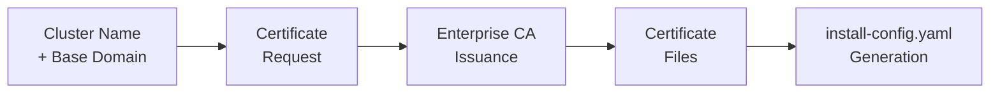

# Low-Level Design — Sample A: Component Specification Format

> **FORMAT SAMPLE** — This document demonstrates the Component Specification LLD format using Phase 1 (Foundation) content from the Acme Corp HLD. It is not a production LLD.

---

## About This Format

| Attribute | Description |
|-----------|-------------|
| **Style** | Classic engineering specification organized by component/subsystem |
| **Audience** | Platform engineers, infrastructure architects, reviewers |
| **Strength** | Easy to look up "how is component X configured?" independently — each component is self-contained |
| **Navigation** | Jump to any component section without reading sequentially |
| **Relationship to HLD** | Each component specification traces back to one or more HLD decisions via the HLD Reference field |

---

## Document Control

| Field | Value |
|---|---|
| **Title** | Acme Corp OpenShift Virtualization — Phase 1 Foundation LLD (Component Specification) |
| **Version** | 0.1 |
| **Status** | Draft |
| **Classification** | Internal — Confidential |
| **Author** | {AUTHOR} |
| **Reviewers** | {REVIEWER_LIST} |
| **Approval Authority** | {APPROVER} |
| **Last Updated** | {DATE} |

### Revision History

| Ver | Date | Author | Changes |
|-----|------|--------|---------|
| 0.1 | {DATE} | {AUTHOR} | Initial component specifications — Phase 1 Foundation |

---

## Scope

This LLD covers the implementation-level specifications for all Phase 1 (Foundation) components of the Acme Corp OpenShift Virtualization deployment. It translates HLD decisions into exact configuration parameters, manifests, and validation criteria.

### In Scope

- TLS/SSL certificate specifications
- DNS record specifications
- Firewall rule specifications
- Hardware provisioning parameters (Intersight server profiles)
- IP allocation and VIP configuration
- NTP configuration
- Pre-flight validation

### Out of Scope

- Phase 2–4 components (storage, identity, fleet management, migration)
- Operational runbooks (see Sample B format)
- Per-cluster instance data (see Sample C format)

### References

| Document | Location |
|----------|----------|
| Acme Corp HLD — Phase 1 Foundation | `HLD/markdown_files/Acme Corp_OCP-V_HLD_DecisionJourney_phase1.md` |
| Acme Corp HLD — Cross-Cutting | `HLD/markdown_files/Acme Corp_OCP-V_HLD_CrossCutting.md` |
| OCP 4.21 Bare-Metal Installation Guide | [Red Hat Documentation](https://docs.redhat.com/en/documentation/openshift_container_platform/4.21/html/installing_on_bare_metal/preparing-to-install-on-bare-metal) |
| RHACM 2.12 Networking Requirements | [Red Hat Documentation](https://docs.redhat.com/en/documentation/red_hat_advanced_cluster_management_for_kubernetes/2.12/html/networking/networking) |

---

## Component Index

| ID | Component | HLD Section | Status |
|----|-----------|-------------|--------|
| C-01 | TLS/SSL Certificates | Phase 1 — TLS/SSL Certificates | Draft |
| C-02 | DNS Records | Phase 1 — DNS, Static IPs & NTP Prerequisites | Draft |
| C-03 | NTP Configuration | Phase 1 — DNS, Static IPs & NTP Prerequisites | Draft |
| C-04 | Firewall Rules | Phase 1 — Firewall Rules & Port Requirements | Draft |
| C-05 | IP Allocation & VIPs | Phase 1 — IP Reservations & Load Balancer VIPs | Draft |
| C-06 | Intersight Server Profiles | Phase 1 — Hardware Provisioning & Network Fabric | Draft |

---

## C-01: TLS/SSL Certificates

### Overview

| Field | Value |
|---|---|
| **HLD Reference** | Phase 1 — TLS/SSL Certificates (Pre-Install); ADR 24 |
| **Applies To** | [DC] [CDF] [EDGE] |
| **Owner** | Security Team (procurement); Platform Team (installation) |
| **Dependencies** | Cluster name and base domain finalized; Enterprise CA available |

### Configuration Parameters

| Parameter | Value | Description | Source |
|-----------|-------|-------------|--------|
| API cert subject | `api.<cluster>.<base_domain>` | API server TLS certificate CN/SAN | HLD — Certificate Inventory |
| Ingress cert subject | `*.apps.<cluster>.<base_domain>` | Wildcard ingress certificate CN/SAN | HLD — Certificate Inventory |
| API cert issuer | Enterprise CA | Corporate PKI | ADR 24 |
| Ingress cert issuer | Internal CA | Internal PKI with wildcard exception | ADR 24 |
| Key algorithm | RSA 2048 or ECDSA P-256 | Per enterprise PKI policy | Acme Corp Security Standards |
| Validity period | Per enterprise CA policy (typically 1-2 years) | Renewed via cert-manager post-install | HLD |
| cert-manager namespace | `cert-manager` | Operator manages rotation post Day 0 | OCP cert-manager docs |

### Sample Configuration

**Ingress certificate secret:**

```yaml
apiVersion: v1
kind: Secret
metadata:
  name: custom-ingress-cert
  namespace: openshift-ingress
type: kubernetes.io/tls
data:
  tls.crt: <base64-encoded-cert-chain>
  tls.key: <base64-encoded-private-key>
```

**IngressController patch:**

```yaml
apiVersion: operator.openshift.io/v1
kind: IngressController
metadata:
  name: default
  namespace: openshift-ingress-operator
spec:
  defaultCertificate:
    name: custom-ingress-cert
```

### Tier Variance

| Parameter | DC | CDF | Branch |
|---|---|---|---|
| API cert issuer | Enterprise CA | Enterprise CA | Enterprise CA |
| Ingress cert issuer | Internal CA | Internal CA | Internal CA |
| Wildcard exception | Required | Required | Required |
| cert-manager rotation | Yes | Yes | Yes |

*No tier-specific variance for certificates.*

### Dependencies



### Validation Criteria

| Check | Command | Expected Result |
|-------|---------|-----------------|
| API cert SAN matches | `openssl x509 -in api.crt -noout -text \| grep DNS:` | Contains `api.<cluster>.<base_domain>` |
| Ingress cert SAN matches | `openssl x509 -in ingress.crt -noout -text \| grep DNS:` | Contains `*.apps.<cluster>.<base_domain>` |
| Cert not expired | `openssl x509 -in <cert> -noout -dates` | `notAfter` is future date |
| Chain validates | `openssl verify -CAfile ca-bundle.crt api.crt` | Returns `OK` |
| Post-install: ingress cert active | `oc get secret custom-ingress-cert -n openshift-ingress` | Secret exists with valid data |
| Post-install: API cert active | `curl -v https://api.<cluster>.<base_domain>:6443 2>&1 \| grep issuer` | Shows Enterprise CA issuer |

---

## C-02: DNS Records

### Overview

| Field | Value |
|---|---|
| **HLD Reference** | Phase 1 — DNS, Static IPs & NTP Prerequisites |
| **Applies To** | [DC] [CDF] [EDGE] |
| **Owner** | Network Team (Infoblox) |
| **Dependencies** | IP reservations completed (C-05); cluster name finalized |

### Configuration Parameters

| Parameter | Value | Description | Source |
|-----------|-------|-------------|--------|
| DNS provider | Infoblox | Enterprise DNS | HLD |
| API record | `api.<cluster>.<base_domain>` → API VIP | A record + PTR | OCP install guide |
| API-int record | `api-int.<cluster>.<base_domain>` → API VIP | A record + PTR | OCP install guide |
| Ingress wildcard | `*.apps.<cluster>.<base_domain>` → Ingress VIP | Wildcard A record | OCP install guide |
| Node records | `<hostname>.<cluster>.<base_domain>` → node IP | A record + PTR per node | OCP install guide |
| TTL | 300s (recommended) | Low TTL during deployment; raise post-validation | Best practice |

### Record Inventory Template (per cluster)

| Record Type | FQDN | Target IP | PTR Required |
|-------------|------|-----------|--------------|
| A + PTR | `api.<cluster>.<base_domain>` | `<api_vip>` | Yes |
| A + PTR | `api-int.<cluster>.<base_domain>` | `<api_vip>` | Yes |
| Wildcard A | `*.apps.<cluster>.<base_domain>` | `<ingress_vip>` | No |
| A + PTR | `cp-0.<cluster>.<base_domain>` | `<cp0_ip>` | Yes |
| A + PTR | `cp-1.<cluster>.<base_domain>` | `<cp1_ip>` | Yes |
| A + PTR | `cp-2.<cluster>.<base_domain>` | `<cp2_ip>` | Yes |
| A + PTR | `worker-0.<cluster>.<base_domain>` | `<w0_ip>` | Yes |
| A + PTR | `worker-N.<cluster>.<base_domain>` | `<wN_ip>` | Yes |

### Tier Variance

| Parameter | DC | CDF | Branch |
|---|---|---|---|
| Node A+PTR records | 3 CP + 16+ workers | 3 CP + variable workers | 3 compact nodes |
| DNS provider | Infoblox | Infoblox | Infoblox |

### Validation Criteria

| Check | Command | Expected Result |
|-------|---------|-----------------|
| API resolves | `dig +short api.<cluster>.<base_domain>` | Returns API VIP |
| API-int resolves | `dig +short api-int.<cluster>.<base_domain>` | Returns API VIP |
| Wildcard resolves | `dig +short test.apps.<cluster>.<base_domain>` | Returns Ingress VIP |
| Node A resolves | `dig +short <hostname>.<cluster>.<base_domain>` | Returns correct node IP |
| PTR resolves | `dig +short -x <node_ip>` | Returns correct FQDN |

---

## C-03: NTP Configuration

### Overview

| Field | Value |
|---|---|
| **HLD Reference** | Phase 1 — DNS, Static IPs & NTP Prerequisites |
| **Applies To** | [DC] [CDF] [EDGE] |
| **Owner** | Platform Team |
| **Dependencies** | Internal NTP servers reachable; UDP 123 open |

### Configuration Parameters

| Parameter | Value | Description | Source |
|-----------|-------|-------------|--------|
| NTP servers | Internal NTP (site-specific) | DC/CDF: SRE-managed NTP; Branch: existing network infra | HLD — NTP Requirements |
| Max offset tolerance | < 100ms | Pre-flight pass criteria | HLD — Pre-Flight Checklist |
| Delivery mechanism | chrony MachineConfig via ArgoCD | ACM inform policy monitors compliance | HLD — Chrony delivery |
| Guest VM time sync | Disabled (hypervisor-level) | Windows: AD/Kerberos; Linux: direct NTP | HLD — Guest VM time |
| Firewall requirement | UDP 123 from all nodes | Baremetal network | HLD — Required Port Matrix |

### Sample Configuration

**Chrony MachineConfig (worker nodes):**

```yaml
apiVersion: machineconfiguration.openshift.io/v1
kind: MachineConfig
metadata:
  labels:
    machineconfiguration.openshift.io/role: worker
  name: 99-worker-chrony
spec:
  config:
    ignition:
      version: 3.4.0
    storage:
      files:
        - path: /etc/chrony.conf
          mode: 0644
          overwrite: true
          contents:
            source: data:text/plain;charset=utf-8;base64,<BASE64_ENCODED_CHRONY_CONF>
```

**chrony.conf content (before base64 encoding):**

```
server ntp1.<site>.example.corp iburst
server ntp2.<site>.example.corp iburst
driftfile /var/lib/chrony/drift
makestep 1.0 3
rtcsync
logdir /var/log/chrony
```

### Tier Variance

| Parameter | DC | CDF | Branch |
|---|---|---|---|
| NTP servers | DC internal NTP | CDF internal NTP | Branch network NTP (TBD) |
| Delivery | ArgoCD + ACM inform | ArgoCD + ACM inform | ArgoCD + ACM inform |

### Validation Criteria

| Check | Command | Expected Result |
|-------|---------|-----------------|
| NTP sync status | `chronyc sources` | At least one source with `*` (selected) |
| Offset within tolerance | `chronyc tracking \| grep "Last offset"` | Offset < 100ms |
| MachineConfig applied | `oc get mc 99-worker-chrony` | Resource exists |
| All nodes synced | `oc debug node/<node> -- chroot /host chronyc sources` | All nodes show synced source |

---

## C-04: Firewall Rules

### Overview

| Field | Value |
|---|---|
| **HLD Reference** | Phase 1 — Firewall Rules & Port Requirements; ADR 16 |
| **Applies To** | [DC] [CDF] [EDGE] |
| **Owner** | Network Team (firewall); Platform Team (validation) |
| **Dependencies** | IP reservations completed (C-05); ACM hub IP known |

### Configuration Parameters

| Parameter | Value | Description | Source |
|-----------|-------|-------------|--------|
| Egress model | Firewall-only (no proxy) | DC/CDF confirmed; Branch TBD | ADR 16 |
| VM traffic model | Bridged VLANs (bypass cluster egress) | No egress rules needed for VM traffic | HLD |

### Rule Specification (per cluster)

| Rule ID | Source | Destination | Port(s) | Protocol | Direction | Purpose |
|---------|--------|-------------|---------|----------|-----------|---------|
| FW-01 | All nodes | All nodes | ICMP | ICMP | Bidirectional | Reachability |
| FW-02 | All nodes | All nodes | 1936 | TCP | Bidirectional | Metrics / health-check |
| FW-03 | All nodes | All nodes | 9000-9999 | TCP/UDP | Bidirectional | Host services |
| FW-04 | All nodes | All nodes | 10250-10259 | TCP | Bidirectional | Kubelet, kube-proxy |
| FW-05 | All nodes | All nodes | 22623 | TCP | Bidirectional | Machine Config Server |
| FW-06 | All nodes | All nodes | 6081 | UDP | Bidirectional | Geneve (OVN-Kubernetes) |
| FW-07 | All nodes | All nodes | 30000-32767 | TCP/UDP | Bidirectional | NodePort range |
| FW-08 | All nodes | Control plane | 6443 | TCP | Inbound | Kubernetes API |
| FW-09 | Control plane | Control plane | 2379-2380 | TCP | Bidirectional | etcd server + peer |
| FW-10 | LB VIP | Control plane | 6443, 22623 | TCP | Inbound | API + MCS via LB |
| FW-11 | LB VIP | Workers | 80, 443 | TCP | Inbound | HTTP/HTTPS ingress |
| FW-12 | ACM hub | Managed cluster | 443, 6443 | TCP | Bidirectional | Hub management + API |
| FW-13 | ACM hub | BMC IPs | 443 | TCP | Outbound | Redfish management |
| FW-14 | BMC IPs | ACM hub | 6180, 6183 | TCP | Inbound | Virtual media ISO pull |
| FW-15 | ACM hub | Nodes | 5050, 6385, 9999 | TCP | Bidirectional | Ironic provisioning |
| FW-16 | All nodes | NTP servers | 123 | UDP | Outbound | NTP |
| FW-17 | All nodes | Artifactory | 443 | TCP | Outbound | Image registry |
| FW-18 | All nodes | DNS servers | 53 | TCP/UDP | Outbound | DNS resolution |

### Tier Variance

| Parameter | DC | CDF | Branch |
|---|---|---|---|
| Egress model | Firewall-only | Firewall-only | TBD |
| FC SAN ports | Required (site-specific) | Required (site-specific) | N/A |
| Ironic ports (5050, 6385, 9999) | Required | Required | Required |

### Validation Criteria

| Check | Command | Expected Result |
|-------|---------|-----------------|
| API port open | `nc -zv <api_vip> 6443` | Connection succeeds |
| Ingress port open | `nc -zv <ingress_vip> 443` | Connection succeeds |
| etcd port open | `nc -zv <cp_node> 2379` from peer | Connection succeeds |
| BMC reachable | `curl -k https://<bmc_ip>/redfish/v1/Systems` | HTTP 200 |
| NTP reachable | `nc -zuv <ntp_server> 123` | Connection succeeds |
| Artifactory reachable | `curl -s https://<artifactory_url>/v2/` | HTTP 200 or 401 |

---

## C-05: IP Allocation & Load Balancer VIPs

### Overview

| Field | Value |
|---|---|
| **HLD Reference** | Phase 1 — IP Reservations & Load Balancer VIPs; ADR 12 |
| **Applies To** | [DC] [CDF] [EDGE] |
| **Owner** | Network Team (Infoblox reservations) |
| **Dependencies** | VLAN assignments finalized; cluster sizing confirmed |

### Configuration Parameters

| Parameter | Value | Description | Source |
|-----------|-------|-------------|--------|
| LB model | Built-in keepalived/haproxy | No external F5 for OCP traffic | ADR 12 |
| API VIP | 1 per cluster on baremetal network | Floats via keepalived VRRP | HLD |
| Ingress VIP | 1 per cluster on baremetal network | Floats via keepalived VRRP | HLD |
| F5 role | DNS path only (GTM) | Pool members are Infoblox; not LB for OCP | ADR 12 |
| IP source | Infoblox reservations | Static IPs for all nodes | HLD |

### Per-Cluster IP Allocation Template

| IP Type | Count | Network | VLAN | Assignment Method |
|---------|-------|---------|------|-------------------|
| API VIP | 1 | Baremetal | `<mgmt_vlan>` | Infoblox — not assigned to any host |
| Ingress VIP | 1 | Baremetal | `<mgmt_vlan>` | Infoblox — not assigned to any host |
| Control plane nodes | 3 | Baremetal | `<mgmt_vlan>` | Static via NMState |
| Worker nodes | N | Baremetal | `<mgmt_vlan>` | Static via NMState |
| BMC/CIMC | 1 per node | BMC VLAN | `<bmc_vlan>` | Intersight |
| Storage interface | 1 per node | Storage VLAN | `<stor_vlan>` | Static via NMState |
| Migration interface | 1 per node | Migration VLAN | `<mig_vlan>` | Static via NMState |
| Backup interface | 1 per node | Backup VLAN | `<bkp_vlan>` | Static via NMState |

### Sample install-config.yaml (relevant section)

```yaml
platform:
  baremetal:
    apiVIPs:
      - <api_vip>
    ingressVIPs:
      - <ingress_vip>
    hosts:
      - name: cp-0
        role: master
        bmc:
          address: redfish-virtualmedia://<bmc_ip_0>/redfish/v1/Systems/1
          username: <bmc_user>
          password: <bmc_pass>
        bootMACAddress: <mac_0>
```

### Tier Variance

| Parameter | DC | CDF | Branch |
|---|---|---|---|
| Worker node count | 16+ | Variable | 0 (compact) |
| Total IPs per cluster | ~25+ | ~10-15 | 3 nodes + 2 VIPs |
| Migration VLAN IPs | 1 per node | 1 per node | Shared bond (TBD) |
| Storage VLAN IPs | 1 per node | 1 per node | N/A (local ODF) |

### Validation Criteria

| Check | Command | Expected Result |
|-------|---------|-----------------|
| No IP conflict — API VIP | `arping -D -c 3 <api_vip>` | No duplicate detected |
| No IP conflict — Ingress VIP | `arping -D -c 3 <ingress_vip>` | No duplicate detected |
| No IP conflict — node IPs | `arping -D -c 3 <node_ip>` per node | No duplicate detected |
| VIP not host-assigned | Infoblox query | VIP marked reserved, not assigned to host |

---

## C-06: Intersight Server Profiles

### Overview

| Field | Value |
|---|---|
| **HLD Reference** | Phase 1 — Hardware Provisioning & Network Fabric; ADR 7 |
| **Applies To** | [DC] [CDF] [EDGE] |
| **Owner** | Infrastructure Team (Intersight); Platform Team (validation) |
| **Dependencies** | Cisco UCS M8 hardware racked and powered; Intersight account configured |

### Configuration Parameters

| Policy | Parameter | Value | Source |
|--------|-----------|-------|--------|
| BIOS | Profile | Cisco "virtualization" preset | CVD baseline (Architecture lead confirmed 04/21) |
| BIOS | VT-x | Enabled | OCP requirement |
| BIOS | VT-d | Enabled | OCP requirement |
| BIOS | NX bit | Enabled | OCP requirement |
| Boot | Mode | UEFI | OCP requirement |
| Boot | Order | Local disk or SAN boot | Site-specific |
| vNIC 0 | Purpose | OCP management | FI-A |
| vNIC 1 | Purpose | VM data (OVS bridges) | FI-B |
| vNIC 2 | Purpose | Live migration | Dedicated |
| vNIC 3 | Purpose | Backup ({BACKUP_VENDOR}) | Dedicated |
| MTU | Management | 1500 | HLD — Network Fabric Layers |
| MTU | Migration/Storage/Backup | 9000 or 9216 | HLD — Network Fabric Layers |
| PCI Placement | Rule | Enabled per server profile template | ADR 7 — NIC naming stability |
| IPMI | Initial | Encryption disabled (Cisco CVD) | Pedro Moreno confirmed 04/21 |
| IPMI | Post-install | Encryption enabled via OCP console token | Post-install hardening step |

### Network Fabric Layers

| Layer | VLAN | MTU | Purpose | Tiers |
|-------|------|-----|---------|-------|
| Management | Site-specific | 1500 | OCP API, etcd, DNS, NTP | All |
| VM Data | Multiple (all presented VLANs) | 1500 | VM tenant traffic via OVS bridges + NADs | All |
| Storage | Site-specific | 9000/9216 | FlashSystem FC block access | DC, CDF |
| Migration | Dedicated | 9000 | Live migration memory page transfer | DC, CDF |
| Backup | Dedicated | 9000 | {BACKUP_VENDOR} agent backup traffic | All |
| FC SAN | N/A (FC zoning) | N/A | FlashSystem block access | DC, CDF |
| BMC/CIMC | Site-specific | 1500 | Out-of-band management, Redfish | All |

### Tier Variance

| Parameter | DC | CDF | Branch |
|---|---|---|---|
| vNIC count | 4 (full bond separation) | 4 (baseline) | 2 (TBD, combined bonds) |
| FC SAN zoning | Required | Required | N/A |
| Node count per profile | 3 CP + 16+ workers | 3 CP + variable | 3 compact |

### Validation Criteria

| Check | Method | Expected Result |
|-------|--------|-----------------|
| Server profile applied | Intersight console | Profile status: "OK" |
| NIC naming stable | `ip link show` across reboot | Interface names unchanged |
| BMC reachable | `curl -k https://<bmc_ip>/redfish/v1/Systems` | HTTP 200 |
| BIOS VT-x enabled | Intersight inventory or BIOS console | VT-x: Enabled |
| MTU correct | `ip link show <iface> \| grep mtu` | Matches expected MTU |

---

## Appendix A: Parameter Registry

| Component | Parameter | Value | Tier Variance |
|-----------|-----------|-------|---------------|
| Certificates | API cert issuer | Enterprise CA | None |
| Certificates | Ingress cert issuer | Internal CA | None |
| DNS | Provider | Infoblox | None |
| DNS | TTL | 300s (deployment) | None |
| NTP | Max offset | < 100ms | None |
| NTP | Delivery | ArgoCD MachineConfig + ACM inform | None |
| Firewall | Egress model | Firewall-only | Branch TBD |
| LB | Model | keepalived/haproxy (built-in) | None |
| LB | F5 role | DNS path only (GTM) | None |
| Network | Management MTU | 1500 | None |
| Network | Migration/Storage MTU | 9000/9216 | Branch: N/A for storage |
| Server Profile | BIOS | Cisco "virtualization" preset | None |
| Server Profile | vNIC count | 4 | Branch: 2 (TBD) |
| Server Profile | PCI placement | Enabled | None |
| OCP | Version | 4.21 | None |
| OCP | Update channel | stable | None |
| OCP | Pods-per-node | 512 | None |
| OCP | Pod subnet | 192.168.0.0/17 | None |
| OCP | Services subnet | 192.168.128.0/18 | None |
| OCP | Host CIDR | /22 | None |
| Capacity | Target CPU utilization | 60-70% | None |
| Capacity | Memory overcommit | Disabled | None |
| Registry | Provider | Artifactory (pull-through cache) | None |
