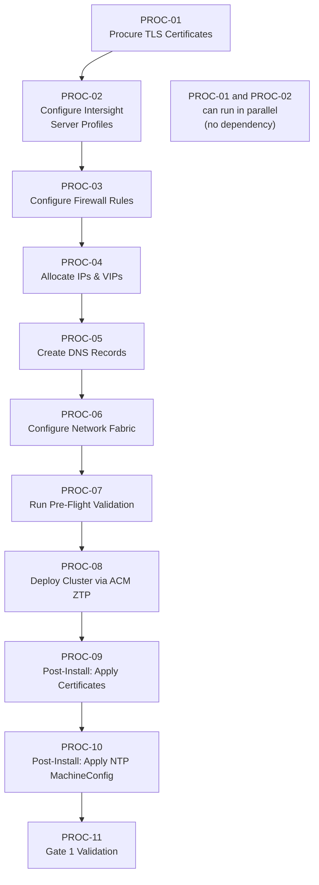

# Low-Level Design — Sample B: Runbook / Procedure Format

> **FORMAT SAMPLE** — This document demonstrates the Runbook/Procedure LLD format using Phase 1 (Foundation) content from the Acme Corp HLD. It is not a production LLD.

---

## About This Format

| Attribute | Description |
|-----------|-------------|
| **Style** | Sequential implementation procedures aimed at the build engineer |
| **Audience** | Build/deployment engineers executing the work |
| **Strength** | Hands-on — an engineer can follow it linearly to build the cluster from bare metal |
| **Navigation** | Procedures are ordered by execution dependency; follow top to bottom |
| **Relationship to HLD** | Each procedure block maps to one or more HLD decisions and is tagged with an HLD Reference |

---

## Document Control

| Field | Value |
|---|---|
| **Title** | Acme Corp OpenShift Virtualization — Phase 1 Foundation LLD (Runbook/Procedure) |
| **Version** | 0.1 |
| **Status** | Draft |
| **Classification** | Internal — Confidential |
| **Author** | {AUTHOR} |
| **Reviewers** | {REVIEWER_LIST} |
| **Approval Authority** | {APPROVER} |
| **Last Updated** | {DATE} |

### Revision History

| Ver | Date | Author | Changes |
|-----|------|--------|---------|
| 0.1 | {DATE} | {AUTHOR} | Initial runbook procedures — Phase 1 Foundation |

---

## Scope

This LLD provides step-by-step procedures to execute Phase 1 (Foundation) of the Acme Corp OpenShift Virtualization deployment. Procedures are ordered by dependency and must be executed sequentially unless explicitly marked as parallelizable.

### References

| Document | Location |
|----------|----------|
| Acme Corp HLD — Phase 1 Foundation | `HLD/markdown_files/Acme Corp_OCP-V_HLD_DecisionJourney_phase1.md` |
| OCP 4.21 Bare-Metal Installation Guide | [Red Hat Documentation](https://docs.redhat.com/en/documentation/openshift_container_platform/4.21/html/installing_on_bare_metal/preparing-to-install-on-bare-metal) |

---

## Execution Order



### Procedure Summary

| ID | Procedure | Estimated Duration | Responsible Role | Parallelizable With |
|----|-----------|--------------------|------------------|---------------------|
| PROC-01 | Procure TLS Certificates | 3-5 business days | Security Team | PROC-02 |
| PROC-02 | Configure Intersight Server Profiles | 2-4 hours per profile | Infrastructure Team | PROC-01 |
| PROC-03 | Configure Firewall Rules | 1-2 business days | Network Team | — |
| PROC-04 | Allocate IPs & VIPs | 1-2 hours | Network Team | — |
| PROC-05 | Create DNS Records | 1 hour + propagation | Network Team | — |
| PROC-06 | Configure Network Fabric | 2-4 hours | Network Team | — |
| PROC-07 | Run Pre-Flight Validation | 15-30 minutes | Platform Team | — |
| PROC-08 | Deploy Cluster via ACM ZTP | 45-90 minutes | Platform Team | — |
| PROC-09 | Post-Install: Apply Certificates | 15 minutes | Platform Team | — |
| PROC-10 | Post-Install: Apply NTP MachineConfig | 15 minutes | Platform Team | — |
| PROC-11 | Gate 1 Validation | 30 minutes | Platform Team | — |

---

## PROC-01: Procure TLS Certificates

| Field | Value |
|---|---|
| **Objective** | Obtain enterprise-signed API and internal CA ingress certificates for the target cluster |
| **HLD Reference** | Phase 1 — TLS/SSL Certificates (Pre-Install); ADR 24 |
| **Estimated Duration** | 3-5 business days (CA processing) |
| **Responsible** | Security Team |

### Prerequisites

- [ ] Cluster name and base domain finalized
- [ ] Enterprise CA and Internal CA accessible
- [ ] Wildcard certificate exception approved (ADR 24)

### Steps

1. **Generate CSR for API certificate**
   - Subject: `api.<cluster>.<base_domain>`
   - Key: RSA 2048 or ECDSA P-256 per enterprise policy
   - SAN: `api.<cluster>.<base_domain>`

2. **Generate CSR for Ingress wildcard certificate**
   - Subject: `*.apps.<cluster>.<base_domain>`
   - Key: RSA 2048 or ECDSA P-256 per enterprise policy
   - SAN: `*.apps.<cluster>.<base_domain>`

3. **Submit API CSR to Enterprise CA**
   - Follow Acme Corp PKI submission process
   - Request includes SAN and intended use (TLS server authentication)

4. **Submit Ingress CSR to Internal CA**
   - Include wildcard exception reference (ADR 24)

5. **Receive and validate certificates**

   ```bash
   # Validate API certificate
   openssl x509 -in api.crt -noout -text | grep -E "Subject:|DNS:"
   # Expected: Subject contains api.<cluster>.<base_domain>

   # Validate Ingress certificate
   openssl x509 -in ingress.crt -noout -text | grep -E "Subject:|DNS:"
   # Expected: Subject contains *.apps.<cluster>.<base_domain>

   # Validate not expired
   openssl x509 -in api.crt -noout -dates
   openssl x509 -in ingress.crt -noout -dates

   # Validate chain
   openssl verify -CAfile ca-bundle.crt api.crt
   openssl verify -CAfile ca-bundle.crt ingress.crt
   ```

6. **Store certificates securely** for use in PROC-09

### Verification

- [ ] API certificate SAN matches `api.<cluster>.<base_domain>`
- [ ] Ingress certificate SAN matches `*.apps.<cluster>.<base_domain>`
- [ ] Both certificates validate against CA chain
- [ ] Neither certificate is expired

### Rollback

Not applicable — certificate procurement is non-destructive. If certificates are incorrect, re-submit CSR.

---

## PROC-02: Configure Intersight Server Profiles

| Field | Value |
|---|---|
| **Objective** | Create and apply Intersight server profiles with BIOS, boot, vNIC, and PCI placement policies for all cluster nodes |
| **HLD Reference** | Phase 1 — Hardware Provisioning & Network Fabric; ADR 7 |
| **Estimated Duration** | 2-4 hours per profile template |
| **Responsible** | Infrastructure Team |

### Prerequisites

- [ ] Cisco UCS M8 hardware racked, powered, and registered in Intersight
- [ ] Intersight account with admin privileges
- [ ] VLAN IDs for management, VM data, migration, backup, and BMC determined
- [ ] WWPN pools defined (if FC SAN boot)

### Steps

1. **Create BIOS policy**
   - Base: Cisco "virtualization" preset (CVD-recommended)
   - Verify: VT-x enabled, VT-d enabled, NX bit enabled

2. **Create Boot policy**
   - Mode: UEFI
   - Order: Local disk (or SAN boot if applicable)

3. **Create vNIC policies (4 vNICs)**

   | vNIC | Fabric | VLANs | Purpose | MTU |
   |------|--------|-------|---------|-----|
   | vNIC 0 | FI-A | Management VLAN | OCP management | 1500 |
   | vNIC 1 | FI-B | All VM VLANs | VM data (OVS bridges) | 1500 |
   | vNIC 2 | Dedicated | Migration VLAN | Live migration | 9000 |
   | vNIC 3 | Dedicated | Backup VLAN | {BACKUP_VENDOR} backup | 9000 |

4. **Enable PCI placement rules** in the server profile template to resolve Broadcom NIC reordering (ADR 7)

5. **Configure IPMI** — deploy with encryption disabled per Cisco CVD (hardened post-install in PROC-09)

6. **Create Ethernet adapter policies** — interrupt coalescing, RSS, ring buffer sizing per CVD

7. **Create server profile template** combining all policies

8. **Derive and apply profiles** to each physical server

9. **Verify profile application**
   - Intersight console: all profiles show status "OK"
   - Each server shows correct vNIC count and VLAN assignments

### Verification

- [ ] All server profiles applied successfully (status: OK)
- [ ] BIOS settings match virtualization preset
- [ ] vNIC count and VLAN assignments correct per node
- [ ] PCI placement rules active

### Rollback

- Unapply server profile from Intersight console
- Revert to previous profile template version if available
- Server reverts to previous configuration on next reboot

---

## PROC-03: Configure Firewall Rules

| Field | Value |
|---|---|
| **Objective** | Open all required ports for inter-node, LB, BMC, ACM hub, Ironic, and external connectivity before cluster installation |
| **HLD Reference** | Phase 1 — Firewall Rules & Port Requirements; ADR 16 |
| **Estimated Duration** | 1-2 business days (change request + implementation) |
| **Responsible** | Network Team |

### Prerequisites

- [ ] IP allocations completed (PROC-04 — or preliminary IP ranges known)
- [ ] ACM hub IP address(es) known
- [ ] BMC IP addresses known (from Intersight registration)
- [ ] Firewall change request approved

### Steps

1. **Submit firewall change request** with the full port matrix from the HLD (18 rule groups — see HLD Phase 1 "Required Port Matrix")

2. **Implement rules** per the following priority order:
   - Inter-node rules (FW-01 through FW-07)
   - API and etcd rules (FW-08, FW-09)
   - LB rules (FW-10, FW-11)
   - ACM hub <-> managed cluster (FW-12)
   - BMC / Redfish and Ironic (FW-13, FW-14, FW-15)
   - External services (FW-16, FW-17, FW-18)

3. **Validate each rule group** — spot-check with `nc` or `curl`:

   ```bash
   # API port
   nc -zv <api_vip> 6443

   # Ingress ports
   nc -zv <ingress_vip> 80
   nc -zv <ingress_vip> 443

   # etcd (from peer control plane node)
   nc -zv <cp_node_ip> 2379

   # BMC Redfish
   curl -sk https://<bmc_ip>/redfish/v1/Systems | head -1

   # NTP
   nc -zuv <ntp_server> 123

   # Artifactory
   curl -s -o /dev/null -w "%{http_code}" https://<artifactory_url>/v2/
   ```

### Verification

- [ ] All 18 rule groups confirmed open
- [ ] Spot-check connections succeed for API, Ingress, etcd, BMC, NTP, Artifactory
- [ ] No unintended ports opened (audit firewall diff)

### Rollback

- Remove firewall rules via reverse change request
- Firewall state reverts to pre-change baseline

---

## PROC-04: Allocate IPs & VIPs

| Field | Value |
|---|---|
| **Objective** | Reserve all required IP addresses in Infoblox for the target cluster |
| **HLD Reference** | Phase 1 — IP Reservations & Load Balancer VIPs; ADR 12 |
| **Estimated Duration** | 1-2 hours |
| **Responsible** | Network Team |

### Prerequisites

- [ ] Cluster name, tier, and node count finalized
- [ ] VLAN assignments determined
- [ ] Infoblox access

### Steps

1. **Reserve API VIP** on baremetal network — must not be assigned to any host

2. **Reserve Ingress VIP** on baremetal network — must not be assigned to any host

3. **Reserve control plane node IPs** (3 per cluster) on baremetal network

4. **Reserve worker node IPs** (N per cluster) on baremetal network

5. **Reserve BMC IPs** (1 per node) on BMC VLAN

6. **Reserve storage interface IPs** (1 per node, DC/CDF only) on storage VLAN

7. **Reserve migration interface IPs** (1 per node, DC/CDF only) on migration VLAN

8. **Reserve backup interface IPs** (1 per node) on backup VLAN

9. **Verify no IP conflicts:**

   ```bash
   # Run for each reserved IP on the appropriate VLAN
   arping -D -c 3 <reserved_ip>
   # Expected: no duplicate detected
   ```

10. **Document allocations** in the cluster build sheet (see Sample C format)

### Verification

- [ ] All IPs reserved in Infoblox
- [ ] VIPs marked as reserved (not host-assigned)
- [ ] No IP conflicts detected via arping
- [ ] Allocation spreadsheet updated

### Rollback

- Release IP reservations in Infoblox
- Non-destructive operation

---

## PROC-05: Create DNS Records

| Field | Value |
|---|---|
| **Objective** | Create all required forward and reverse DNS records in Infoblox for the target cluster |
| **HLD Reference** | Phase 1 — DNS, Static IPs & NTP Prerequisites |
| **Estimated Duration** | 1 hour + propagation time |
| **Responsible** | Network Team |

### Prerequisites

- [ ] IP allocations completed (PROC-04)
- [ ] Cluster name and base domain finalized

### Steps

1. **Create API records:**

   ```
   api.<cluster>.<base_domain>        A     <api_vip>
   api-int.<cluster>.<base_domain>    A     <api_vip>
   <api_vip>                          PTR   api.<cluster>.<base_domain>
   ```

2. **Create Ingress wildcard record:**

   ```
   *.apps.<cluster>.<base_domain>     A     <ingress_vip>
   ```

3. **Create per-node records** (A + PTR for each node):

   ```
   cp-0.<cluster>.<base_domain>       A     <cp0_ip>
   <cp0_ip>                           PTR   cp-0.<cluster>.<base_domain>
   # Repeat for cp-1, cp-2, worker-0 through worker-N
   ```

4. **Wait for DNS propagation** (or force zone transfer if Infoblox supports it)

5. **Validate all records:**

   ```bash
   # API
   dig +short api.<cluster>.<base_domain>
   # Expected: <api_vip>

   dig +short api-int.<cluster>.<base_domain>
   # Expected: <api_vip>

   # Ingress wildcard
   dig +short test.apps.<cluster>.<base_domain>
   # Expected: <ingress_vip>

   # Per-node forward
   dig +short cp-0.<cluster>.<base_domain>
   # Expected: <cp0_ip>

   # Per-node reverse
   dig +short -x <cp0_ip>
   # Expected: cp-0.<cluster>.<base_domain>.
   ```

### Verification

- [ ] API A record resolves to API VIP
- [ ] API-int A record resolves to API VIP
- [ ] Wildcard resolves to Ingress VIP
- [ ] All node A records resolve to correct IPs
- [ ] All node PTR records resolve to correct FQDNs

### Rollback

- Delete DNS records from Infoblox
- Non-destructive operation

---

## PROC-06: Configure Network Fabric

| Field | Value |
|---|---|
| **Objective** | Configure switch zoning, VLAN trunking, and MTU settings for all cluster network layers |
| **HLD Reference** | Phase 1 — Hardware Provisioning & Network Fabric |
| **Estimated Duration** | 2-4 hours |
| **Responsible** | Network Team |

### Prerequisites

- [ ] Intersight server profiles applied (PROC-02)
- [ ] VLAN assignments determined
- [ ] Switch access credentials available

### Steps

1. **Configure VLAN trunking** on Nexus switches for all assigned ports:
   - Management VLAN (MTU 1500)
   - VM data VLANs (MTU 1500)
   - Storage VLAN (MTU 9000/9216) — DC/CDF only
   - Migration VLAN (MTU 9000) — DC/CDF only
   - Backup VLAN (MTU 9000)
   - BMC VLAN (MTU 1500)

2. **Configure FC SAN zoning** (DC/CDF only):
   - Zone each node's FC HBA WWPN to FlashSystem target ports
   - Verify zone membership via switch CLI

3. **Verify MTU end-to-end:**

   ```bash
   # From node to peer on migration VLAN
   ping -M do -s 8972 <peer_migration_ip>
   # Expected: no fragmentation, replies received
   ```

4. **Verify VLAN trunking:**

   ```bash
   # From node, verify tagged traffic on expected VLANs
   ip -d link show <bond_iface>
   ```

### Verification

- [ ] All VLANs trunked to correct switch ports
- [ ] Jumbo MTU (9000) confirmed on storage, migration, and backup VLANs
- [ ] FC SAN zoning complete (DC/CDF)
- [ ] End-to-end ping succeeds at expected MTU

### Rollback

- Revert switch configuration to pre-change snapshot
- Remove VLAN trunking and SAN zones

---

## PROC-07: Run Pre-Flight Validation

| Field | Value |
|---|---|
| **Objective** | Execute the full pre-flight checklist and confirm all prerequisites pass before starting cluster installation |
| **HLD Reference** | Phase 1 — Pre-Flight Validation Checklist |
| **Estimated Duration** | 15-30 minutes |
| **Responsible** | Platform Team |

### Prerequisites

- [ ] PROC-01 through PROC-06 completed
- [ ] Pre-flight validation script/playbook available

### Steps

Run each check and record pass/fail:

| # | Check | Command | Expected | Pass? |
|---|-------|---------|----------|-------|
| 1 | DNS — API | `dig +short api.<cluster>.<base_domain>` | API VIP | |
| 2 | DNS — API-int | `dig +short api-int.<cluster>.<base_domain>` | API VIP | |
| 3 | DNS — Ingress | `dig +short test.apps.<cluster>.<base_domain>` | Ingress VIP | |
| 4 | DNS — Node A | `dig +short <hostname>.<cluster>.<base_domain>` per node | Node IP | |
| 5 | DNS — PTR | `dig +short -x <node_ip>` per node | FQDN | |
| 6 | NTP | `chronyc sources` from hub | Synced, offset < 100ms | |
| 7 | BMC | `curl -sk https://<bmc_ip>/redfish/v1/Systems` per node | HTTP 200 | |
| 8 | NIC cabling | Intersight inventory or `lldpctl` | Expected NICs present | |
| 9 | IP conflict | `arping -D -c 3 <ip>` per node + VIPs | No duplicate | |
| 10 | FW — API | `nc -zv <api_vip> 6443` | Succeeds | |
| 11 | FW — Ingress | `nc -zv <ingress_vip> 443` | Succeeds | |
| 12 | FW — etcd | `nc -zv <cp_ip> 2379` from peer | Succeeds | |
| 13 | Certificates | `openssl x509 -in <cert> -noout -dates` | Not expired, SAN matches | |
| 14 | Pull secret | `podman login --authfile <pull_secret> <artifactory>` | Login succeeds | |
| 15 | Disk perf | `fio` sequential write on install target | p99 fsync < 10ms | |

**Gate:** Installation MUST NOT proceed until all checks pass.

### Verification

- [ ] All 15 checks pass
- [ ] Pre-flight report generated and archived

### Rollback

Not applicable — validation is read-only.

---

## PROC-08: Deploy Cluster via ACM ZTP

| Field | Value |
|---|---|
| **Objective** | Provision the target cluster using ACM ZTP with Assisted Installer |
| **HLD Reference** | Phase 1 — Provisioning Method per Tier |
| **Estimated Duration** | 45-90 minutes |
| **Responsible** | Platform Team |

### Prerequisites

- [ ] PROC-07 pre-flight validation passed (all checks green)
- [ ] ACM hub operational and reachable
- [ ] SiteConfig CR and install-config.yaml prepared with cluster-specific values

### Steps

1. **Prepare SiteConfig CR** with cluster name, base domain, node inventory, BMC credentials, network config, and pull secret

2. **Prepare install-config.yaml** with:
   - `apiVIPs` and `ingressVIPs` from PROC-04
   - `networking.clusterNetwork`: `192.168.0.0/17`, hostPrefix `/22`
   - `networking.serviceNetwork`: `192.168.128.0/18`
   - `platform.baremetal.hosts` with BMC addresses and boot MAC addresses

3. **Apply SiteConfig to ACM hub:**

   ```bash
   oc apply -f siteconfig-<cluster>.yaml
   ```

4. **Monitor installation progress:**

   ```bash
   # Watch cluster provisioning status
   oc get agentclusterinstall <cluster> -n <cluster> -w

   # Check individual agent status
   oc get agents -n <cluster>
   ```

5. **Wait for cluster installation to complete** — all nodes boot via virtual media, join the cluster, and report Ready

6. **Retrieve kubeconfig:**

   ```bash
   oc get secret <cluster>-admin-kubeconfig -n <cluster> -o jsonpath='{.data.kubeconfig}' | base64 -d > kubeconfig-<cluster>
   ```

### Verification

- [ ] `AgentClusterInstall` shows `Completed`
- [ ] All agents show `bound` and `installed`
- [ ] Cluster API reachable: `oc --kubeconfig=kubeconfig-<cluster> get nodes`
- [ ] All nodes show `Ready`

### Rollback

- Delete the `AgentClusterInstall` and `SiteConfig` CRs from ACM hub
- Power off nodes via Intersight
- Re-run from PROC-07 after addressing root cause

---

## PROC-09: Post-Install — Apply Certificates

| Field | Value |
|---|---|
| **Objective** | Replace default self-signed certificates with enterprise-signed API and ingress certificates |
| **HLD Reference** | Phase 1 — TLS/SSL Certificates |
| **Estimated Duration** | 15 minutes |
| **Responsible** | Platform Team |

### Prerequisites

- [ ] Cluster running (PROC-08 complete)
- [ ] Certificates from PROC-01 available

### Steps

1. **Create ingress TLS secret:**

   ```bash
   oc create secret tls custom-ingress-cert \
     --cert=ingress.crt \
     --key=ingress.key \
     -n openshift-ingress
   ```

2. **Patch IngressController:**

   ```bash
   oc patch ingresscontroller default \
     -n openshift-ingress-operator \
     --type=merge \
     -p '{"spec":{"defaultCertificate":{"name":"custom-ingress-cert"}}}'
   ```

3. **Replace API server certificate** per OCP documentation

4. **Verify certificates active:**

   ```bash
   # Ingress
   curl -vk https://console-openshift-console.apps.<cluster>.<base_domain> 2>&1 | grep issuer
   # Expected: Internal CA issuer

   # API
   curl -vk https://api.<cluster>.<base_domain>:6443 2>&1 | grep issuer
   # Expected: Enterprise CA issuer
   ```

### Verification

- [ ] Ingress serves Internal CA certificate
- [ ] API serves Enterprise CA certificate
- [ ] No browser warnings when accessing console

### Rollback

- Delete custom-ingress-cert secret to revert to self-signed
- `oc patch ingresscontroller default -n openshift-ingress-operator --type=merge -p '{"spec":{"defaultCertificate":null}}'`

---

## PROC-10: Post-Install — Apply NTP MachineConfig

| Field | Value |
|---|---|
| **Objective** | Deploy chrony NTP configuration to all nodes via MachineConfig |
| **HLD Reference** | Phase 1 — DNS, Static IPs & NTP Prerequisites |
| **Estimated Duration** | 15 minutes (+ node rolling restart) |
| **Responsible** | Platform Team |

### Prerequisites

- [ ] Cluster running (PROC-08 complete)
- [ ] Internal NTP server addresses confirmed

### Steps

1. **Prepare chrony.conf** with site-specific NTP servers

2. **Base64-encode the chrony.conf:**

   ```bash
   cat chrony.conf | base64 -w0
   ```

3. **Apply MachineConfig for workers and masters:**

   ```bash
   oc apply -f 99-worker-chrony.yaml
   oc apply -f 99-master-chrony.yaml
   ```

4. **Monitor MachineConfigPool rollout:**

   ```bash
   oc get mcp -w
   # Wait until UPDATED=True, UPDATING=False for both pools
   ```

5. **Verify NTP sync on all nodes:**

   ```bash
   for node in $(oc get nodes -o name); do
     echo "--- $node ---"
     oc debug $node -- chroot /host chronyc sources 2>/dev/null
   done
   ```

### Verification

- [ ] MachineConfig resources exist (`oc get mc 99-worker-chrony 99-master-chrony`)
- [ ] MachineConfigPools updated and not degraded
- [ ] All nodes synced to internal NTP (chronyc shows `*` source)
- [ ] Offset < 100ms on all nodes

### Rollback

- Delete MachineConfig resources
- Nodes revert to default chrony config on next MCP rollout

---

## PROC-11: Gate 1 Validation

| Field | Value |
|---|---|
| **Objective** | Confirm all Phase 1 gate criteria are met |
| **HLD Reference** | Phase 1 — Gate Criteria |
| **Estimated Duration** | 30 minutes |
| **Responsible** | Platform Team |

### Gate Criteria Checklist

| # | Criterion | Validation Command | Pass? |
|---|-----------|-------------------|-------|
| 1 | TLS certificates active | `curl -v` API and Ingress endpoints | |
| 2 | BMC/Redfish reachable | `curl -sk https://<bmc_ip>/redfish/v1/Systems` | |
| 3 | All DNS records resolving | `dig` API, API-int, *.apps, per-node A+PTR | |
| 4 | NTP synchronized | `chronyc sources` on all nodes | |
| 5 | Firewall rules validated | `nc -zv` key ports | |
| 6 | IP reservations allocated | Infoblox audit | |
| 7 | Network fabric configured | MTU + VLAN verification | |
| 8 | Pre-flight passed | PROC-07 report | |
| 9 | Cluster API reachable | `oc get nodes` from management network | |
| 10 | etcd quorum healthy | `oc get etcd -o=jsonpath='{range .items[*]}{.status.conditions[?(@.type=="EtcdMembersAvailable")].message}{"\n"}'` | |
| 11 | All workers joined + Ready | `oc get nodes` — all show `Ready` | |
| 12 | Console accessible | Browser access to `console-openshift-console.apps.<cluster>.<base_domain>` | |

**Gate 1 is PASSED when all 12 criteria are confirmed.**

### Sign-Off

| Role | Name | Date | Signature |
|------|------|------|-----------|
| Platform Lead | | | |
| Network Lead | | | |
| Security Lead | | | |

---

## Appendix: Rollback Summary Matrix

| Procedure | Rollback Action | Impact | Time |
|-----------|----------------|--------|------|
| PROC-01 | Re-submit CSR | None | 3-5 days |
| PROC-02 | Unapply Intersight profile | Server reverts on reboot | Minutes |
| PROC-03 | Reverse firewall change request | Ports closed | 1-2 days |
| PROC-04 | Release IP reservations in Infoblox | IPs freed | Minutes |
| PROC-05 | Delete DNS records from Infoblox | Records removed | Minutes |
| PROC-06 | Revert switch config snapshot | VLANs/zones removed | 1-2 hours |
| PROC-07 | N/A (read-only) | None | N/A |
| PROC-08 | Delete CRs from ACM hub + power off nodes | Cluster destroyed | 15 min |
| PROC-09 | Delete cert secret + revert IngressController | Self-signed certs | 5 min |
| PROC-10 | Delete MachineConfig resources | Default chrony | 15 min (MCP rollout) |
| PROC-11 | N/A (read-only) | None | N/A |
