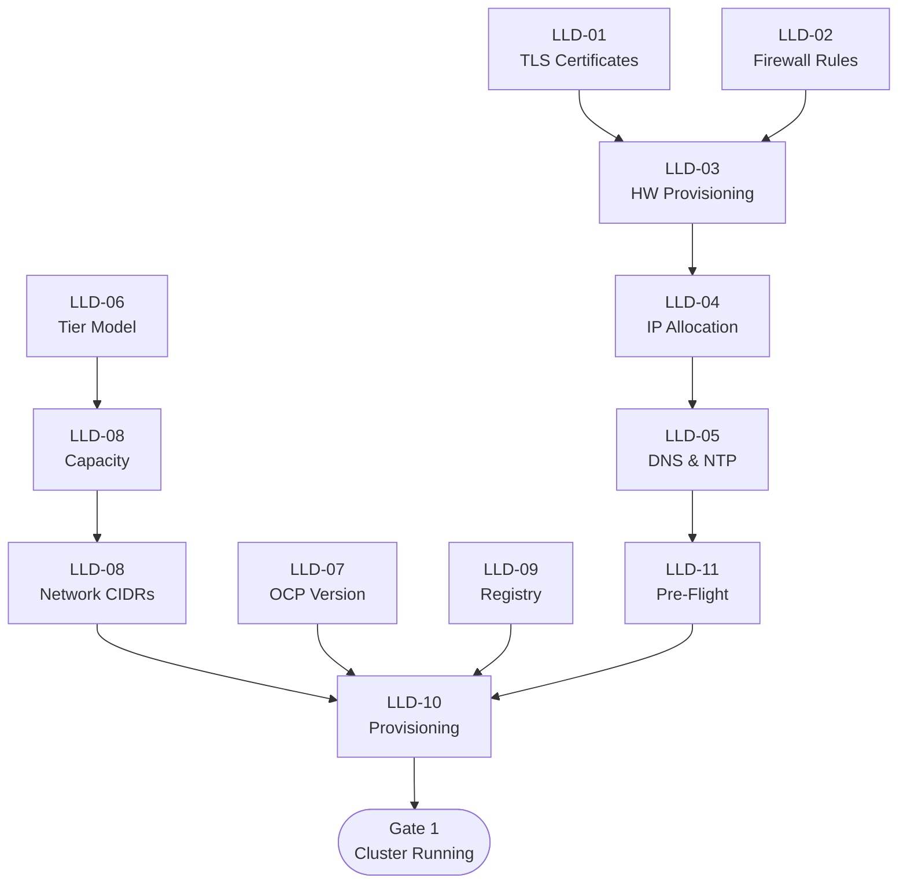

# Low-Level Design — Sample D: Decision-to-Implementation Traceability

> **FORMAT SAMPLE** — This document demonstrates the Decision-to-Implementation Traceability LLD format using Phase 1 (Foundation) content from the Acme Corp HLD. It is not a production LLD.

---

## About This Format

| Attribute | Description |
|-----------|-------------|
| **Style** | Mirrors the HLD's Decision Journey structure but drills each decision into implementation detail |
| **Audience** | Architects validating coverage, leads auditing HLD-to-implementation alignment, QA |
| **Strength** | Direct lineage from every HLD decision to its implementation spec — no decision left unimplemented |
| **Navigation** | Follows HLD phase order; the traceability matrix (Appendix A) provides a cross-reference index |
| **Relationship to HLD** | 1:1 mapping — every HLD decision section has a corresponding LLD implementation section |

---

## Document Control

| Field | Value |
|---|---|
| **Title** | Acme Corp OpenShift Virtualization — Phase 1 Foundation LLD (Decision Traceability) |
| **Version** | 0.1 |
| **Status** | Draft |
| **Classification** | Internal — Confidential |
| **Author** | {AUTHOR} |
| **Reviewers** | {REVIEWER_LIST} |
| **Approval Authority** | {APPROVER} |
| **Last Updated** | {DATE} |

### Revision History

| Ver | Date | Author | Changes |
|-----|------|--------|---------|
| 0.1 | {DATE} | {AUTHOR} | Initial decision traceability — Phase 1 Foundation |

---

## Scope

This LLD provides implementation specifications for every decision documented in HLD Phase 1 (Foundation). Each section maps to a specific HLD decision section and provides the configuration detail, procedures, and acceptance criteria needed to execute that decision.

### HLD-to-LLD Mapping Summary

| HLD Decision | LLD Section | ADR(s) | Status |
|---|---|---|---|
| TLS/SSL Certificates | LLD-01 | ADR 24 | Draft |
| Firewall Rules & Port Requirements | LLD-02 | ADR 16 | Draft |
| Hardware Provisioning & Network Fabric | LLD-03 | ADR 7 | Draft |
| IP Reservations & Load Balancer VIPs | LLD-04 | ADR 12 | Draft |
| DNS, Static IPs & NTP Prerequisites | LLD-05 | — | Draft |
| Deployment Tier Model | LLD-06 | — | Draft |
| OCP Version Strategy | LLD-07 | — | Draft |
| Capacity & Headroom Policy | LLD-08 | — | Draft |
| Cluster Network CIDRs | LLD-08 | — | Draft |
| Container Image Registry | LLD-09 | ADR 4 | Draft |
| Provisioning Method per Tier | LLD-10 | — | Draft |
| Pre-Flight Validation Checklist | LLD-11 | — | Draft |

### References

| Document | Location |
|----------|----------|
| Acme Corp HLD — Phase 1 | `HLD/markdown_files/Acme Corp_OCP-V_HLD_DecisionJourney_phase1.md` |
| Acme Corp ADR Register | `ADR_{client}.md` |

---

## Phase 1 Implementation Flow



---

## LLD-01: TLS/SSL Certificates

| Field | Value |
|---|---|
| **HLD Section** | Phase 1 — TLS/SSL Certificates (Pre-Install) |
| **ADR** | ADR 24 (wildcard certificate exceptions) |
| **Implementation Scope** | Procure, validate, and install enterprise TLS certificates for API and Ingress endpoints |

### Detailed Design

**Certificate specifications:**

| Certificate | Subject / SAN | Issuer | Key Spec | Timing |
|-------------|--------------|--------|----------|--------|
| API server | `api.<cluster>.<base_domain>` | Enterprise CA | RSA 2048 or ECDSA P-256 | Day 0 |
| Ingress wildcard | `*.apps.<cluster>.<base_domain>` | Internal CA | RSA 2048 or ECDSA P-256 | Day 0 |

**Post-install application:**

```yaml
# Secret in openshift-ingress namespace
apiVersion: v1
kind: Secret
metadata:
  name: custom-ingress-cert
  namespace: openshift-ingress
type: kubernetes.io/tls
data:
  tls.crt: <base64-encoded-cert-chain>
  tls.key: <base64-encoded-private-key>
```

```yaml
# IngressController patch
apiVersion: operator.openshift.io/v1
kind: IngressController
metadata:
  name: default
  namespace: openshift-ingress-operator
spec:
  defaultCertificate:
    name: custom-ingress-cert
```

**Post-install automation:** cert-manager operator handles renewal after initial manual provisioning.

**Tier variance:** None — identical across DC, CDF, and Branch.

### Implementation Steps

1. Generate CSRs for API and Ingress certificates
2. Submit to Enterprise CA and Internal CA respectively
3. Validate received certificates (SAN, expiry, chain)
4. Store securely until cluster is provisioned
5. Apply as Kubernetes secret + IngressController patch post-install

### Acceptance Criteria

| ID | Criterion | Test | Expected Result |
|----|-----------|------|-----------------|
| AC-01-1 | API cert SAN correct | `openssl x509 -in api.crt -noout -text \| grep DNS:` | Contains `api.<cluster>.<base_domain>` |
| AC-01-2 | Ingress cert SAN correct | `openssl x509 -in ingress.crt -noout -text \| grep DNS:` | Contains `*.apps.<cluster>.<base_domain>` |
| AC-01-3 | Chain validates | `openssl verify -CAfile ca-bundle.crt <cert>` | OK |
| AC-01-4 | Not expired | `openssl x509 -in <cert> -noout -dates` | notAfter is future |
| AC-01-5 | Ingress cert active post-install | `curl -v https://console-openshift-console.apps.<cluster>.<base_domain> 2>&1 \| grep issuer` | Internal CA |
| AC-01-6 | API cert active post-install | `curl -v https://api.<cluster>.<base_domain>:6443 2>&1 \| grep issuer` | Enterprise CA |

### Open Items

| ID | Item | Owner | Status |
|----|------|-------|--------|
| OI-01-1 | Confirm certificate key algorithm policy with Security | Security Team | Open |

---

## LLD-02: Firewall Rules & Port Requirements

| Field | Value |
|---|---|
| **HLD Section** | Phase 1 — Firewall Rules & Port Requirements |
| **ADR** | ADR 16 (firewall-only egress, no proxy) |
| **Implementation Scope** | Open all required ports before installation; validate connectivity |

### Detailed Design

**Egress model:** Firewall-only for DC/CDF (no proxy). Branch TBD.

**Rule set (18 rule groups):**

| Rule | Source | Destination | Ports | Protocol | Purpose |
|------|--------|-------------|-------|----------|---------|
| FW-01 | All nodes | All nodes | ICMP | ICMP | Reachability |
| FW-02 | All nodes | All nodes | 1936 | TCP | Metrics |
| FW-03 | All nodes | All nodes | 9000-9999 | TCP/UDP | Host services |
| FW-04 | All nodes | All nodes | 10250-10259 | TCP | Kubelet |
| FW-05 | All nodes | All nodes | 22623 | TCP | MCS |
| FW-06 | All nodes | All nodes | 6081 | UDP | Geneve |
| FW-07 | All nodes | All nodes | 30000-32767 | TCP/UDP | NodePort |
| FW-08 | All nodes | CP | 6443 | TCP | K8s API |
| FW-09 | CP | CP | 2379-2380 | TCP | etcd |
| FW-10 | LB VIP | CP | 6443, 22623 | TCP | LB → API/MCS |
| FW-11 | LB VIP | Workers | 80, 443 | TCP | Ingress |
| FW-12 | ACM hub | Cluster | 443, 6443 | TCP | Hub mgmt |
| FW-13 | ACM hub | BMCs | 443 | TCP | Redfish |
| FW-14 | BMCs | ACM hub | 6180, 6183 | TCP | Virtual media |
| FW-15 | Hub | Nodes | 5050, 6385, 9999 | TCP | Ironic |
| FW-16 | All nodes | NTP | 123 | UDP | NTP |
| FW-17 | All nodes | Artifactory | 443 | TCP | Images |
| FW-18 | All nodes | DNS | 53 | TCP/UDP | DNS |

**Tier variance:** Branch egress model TBD. FC SAN ports N/A for Branch.

### Implementation Steps

1. Submit firewall change request with full port matrix
2. Implement rules in priority order (inter-node first, then external)
3. Spot-check connectivity for each rule group

### Acceptance Criteria

| ID | Criterion | Test | Expected Result |
|----|-----------|------|-----------------|
| AC-02-1 | API port open | `nc -zv <api_vip> 6443` | Succeeds |
| AC-02-2 | Ingress port open | `nc -zv <ingress_vip> 443` | Succeeds |
| AC-02-3 | etcd port open | `nc -zv <cp_ip> 2379` from peer | Succeeds |
| AC-02-4 | BMC reachable | `curl -sk https://<bmc_ip>/redfish/v1/Systems` | HTTP 200 |
| AC-02-5 | NTP reachable | `nc -zuv <ntp_server> 123` | Succeeds |
| AC-02-6 | Artifactory reachable | `curl -s https://<artifactory>/v2/` | HTTP 200 or 401 |
| AC-02-7 | No unintended ports | Firewall audit diff | Only approved rules present |

### Open Items

| ID | Item | Owner | Status |
|----|------|-------|--------|
| OI-02-1 | Branch egress model decision | Network Team / Architecture | Open |

---

## LLD-03: Hardware Provisioning & Network Fabric

| Field | Value |
|---|---|
| **HLD Section** | Phase 1 — Hardware Provisioning & Network Fabric |
| **ADR** | ADR 7 (PCI placement rules for NIC stability) |
| **Implementation Scope** | Configure Intersight server profiles, switch zoning, VLAN trunking, and network fabric |

### Detailed Design

**Intersight server profile policies:**

| Policy | Configuration | Source |
|--------|--------------|--------|
| BIOS | Cisco "virtualization" preset — VT-x, VT-d, NX bit enabled | CVD baseline |
| Boot | UEFI; local disk or SAN boot | Site-specific |
| vNIC 0 | FI-A, management VLAN, MTU 1500 | HLD |
| vNIC 1 | FI-B, all VM VLANs, MTU 1500 | HLD |
| vNIC 2 | Dedicated, migration VLAN, MTU 9000 | HLD |
| vNIC 3 | Dedicated, backup VLAN, MTU 9000 | HLD |
| PCI Placement | Enabled — resolves Broadcom NIC reordering | ADR 7 |
| IPMI | Disabled initially; hardened post-install | Cisco CVD |

**Network fabric layers:**

| Layer | VLAN | MTU | DC | CDF | Branch |
|-------|------|-----|----|----|--------|
| Management | Site-specific | 1500 | Yes | Yes | Yes |
| VM Data | Multiple | 1500 | Yes | Yes | Yes |
| Storage | Site-specific | 9000/9216 | Yes | Yes | No |
| Migration | Dedicated | 9000 | Yes | Yes | No |
| Backup | Dedicated | 9000 | Yes | Yes | Yes |
| FC SAN | FC zoning | N/A | Yes | Yes | No |
| BMC | Site-specific | 1500 | Yes | Yes | Yes |

**Day-0 MachineConfig — PSI kernel argument:**

```yaml
apiVersion: machineconfiguration.openshift.io/v1
kind: MachineConfig
metadata:
  labels:
    machineconfiguration.openshift.io/role: worker
  name: 99-worker-kernel-psi
spec:
  kernelArguments:
    - psi=1
```

Required for the `KubeVirtRelieveAndMigrate` descheduler profile (ADR 40). Must be lexicographically > `98-*`. Applied at Day 0 to avoid post-workload reboot.

**Prometheus impact:** PSI increases Prometheus RSS by ~1.3 GB per pod (~42% from baseline at 500+ containers). Plan memory allocation accordingly.

### Implementation Steps

1. Create BIOS, boot, vNIC, and Ethernet adapter policies in Intersight
2. Enable PCI placement rules in profile template
3. Derive and apply profiles to all nodes
4. Configure VLAN trunking on Nexus switches
5. Configure FC SAN zoning (DC/CDF)
6. Apply PSI MachineConfig at Day 0

### Acceptance Criteria

| ID | Criterion | Test | Expected Result |
|----|-----------|------|-----------------|
| AC-03-1 | Profiles applied | Intersight console | Status: OK |
| AC-03-2 | NIC names stable | `ip link show` across reboot | Names unchanged |
| AC-03-3 | BMC reachable | `curl -sk https://<bmc_ip>/redfish/v1/Systems` | HTTP 200 |
| AC-03-4 | MTU correct | `ip link show <iface> \| grep mtu` | Expected MTU |
| AC-03-5 | FC SAN zone active | Switch CLI — zone membership | Correct WWPN pairs |
| AC-03-6 | PSI enabled | `cat /proc/pressure/cpu` on worker node | File exists with data |

### Open Items

| ID | Item | Owner | Status |
|----|------|-------|--------|
| OI-03-1 | Branch 2-vNIC layout finalization | Network Team | Open |
| OI-03-2 | BIOS validation against OCP requirements | Platform Team / Red Hat | Open |
| OI-03-3 | IPMI post-install hardening procedure | Platform Team / Cisco | Open |
| OI-03-4 | BIOS time propagation (Intersight NTP vs BIOS clock) | BC Team / Cisco | Open |

---

## LLD-04: IP Reservations & Load Balancer VIPs

| Field | Value |
|---|---|
| **HLD Section** | Phase 1 — IP Reservations & Load Balancer VIPs |
| **ADR** | ADR 12 (built-in keepalived/haproxy; no F5 for OCP traffic) |
| **Implementation Scope** | Reserve all IPs in Infoblox; configure keepalived VIPs via install-config.yaml |

### Detailed Design

**LB model:** Built-in keepalived/haproxy. F5 is DNS-path only (GTM).

**Per-cluster allocation requirements:**

| IP Type | Count | Network | Method |
|---------|-------|---------|--------|
| API VIP | 1 | Baremetal | Infoblox reservation (not host-assigned) |
| Ingress VIP | 1 | Baremetal | Infoblox reservation (not host-assigned) |
| CP nodes | 3 | Baremetal | Static (NMState) |
| Workers | N | Baremetal | Static (NMState) |
| BMC | 1/node | BMC VLAN | Intersight |
| Storage | 1/node | Storage VLAN | Static (NMState) — DC/CDF only |
| Migration | 1/node | Migration VLAN | Static (NMState) — DC/CDF only |
| Backup | 1/node | Backup VLAN | Static (NMState) |

**install-config.yaml VIP specification:**

```yaml
platform:
  baremetal:
    apiVIPs:
      - <api_vip>
    ingressVIPs:
      - <ingress_vip>
```

**LB backend targets:**

| LB Target | Ports | Backend |
|-----------|-------|---------|
| API (internal + external) | 6443, 22623 | Control plane nodes |
| Ingress | 80, 443 | Workers (or all nodes if schedulable masters) |

### Implementation Steps

1. Reserve VIPs in Infoblox (not host-assigned)
2. Reserve per-node IPs for all interfaces
3. Verify no IP conflicts via arping
4. Document in cluster build sheet

### Acceptance Criteria

| ID | Criterion | Test | Expected Result |
|----|-----------|------|-----------------|
| AC-04-1 | No VIP conflict | `arping -D -c 3 <vip>` | No duplicate |
| AC-04-2 | No node IP conflict | `arping -D -c 3 <ip>` per node | No duplicate |
| AC-04-3 | VIPs reserved in Infoblox | Infoblox query | Reserved, not host-assigned |
| AC-04-4 | Post-install: VIP floating | `oc get endpoints -n openshift-kube-apiserver` | API endpoint matches VIP |

### Open Items

None.

---

## LLD-05: DNS, Static IPs & NTP

| Field | Value |
|---|---|
| **HLD Section** | Phase 1 — DNS, Static IPs & NTP Prerequisites |
| **ADR** | — |
| **Implementation Scope** | Create all DNS records in Infoblox; configure NTP via chrony MachineConfig |

### Detailed Design

**DNS records per cluster:**

| Type | Record | Target |
|------|--------|--------|
| A + PTR | `api.<cluster>.<base_domain>` | API VIP |
| A + PTR | `api-int.<cluster>.<base_domain>` | API VIP |
| Wildcard A | `*.apps.<cluster>.<base_domain>` | Ingress VIP |
| A + PTR | `<hostname>.<cluster>.<base_domain>` per node | Node IP |

PTR records are required — RHCOS uses them to set hostnames.

**NTP configuration:** chrony MachineConfig delivered via ArgoCD; ACM inform policy monitors compliance.

**Guest VM time:** No hypervisor sync. Windows uses AD/Kerberos; Linux uses NTP directly.

### Implementation Steps

1. Create all A and PTR records in Infoblox
2. Create wildcard A record for ingress
3. Verify propagation with dig
4. Apply chrony MachineConfig post-install
5. Verify NTP sync on all nodes

### Acceptance Criteria

| ID | Criterion | Test | Expected Result |
|----|-----------|------|-----------------|
| AC-05-1 | API DNS resolves | `dig +short api.<cluster>.<base_domain>` | API VIP |
| AC-05-2 | API-int DNS resolves | `dig +short api-int.<cluster>.<base_domain>` | API VIP |
| AC-05-3 | Wildcard resolves | `dig +short test.apps.<cluster>.<base_domain>` | Ingress VIP |
| AC-05-4 | Node A records resolve | `dig +short <hostname>.<cluster>.<base_domain>` | Node IP |
| AC-05-5 | PTR records resolve | `dig +short -x <node_ip>` | FQDN |
| AC-05-6 | NTP synced | `chronyc sources` on all nodes | `*` source, offset < 100ms |

### Open Items

| ID | Item | Owner | Status |
|----|------|-------|--------|
| OI-05-1 | Branch NTP server confirmation | Network Team | Open |

---

## LLD-06: Deployment Tier Model

| Field | Value |
|---|---|
| **HLD Section** | Phase 1 — Deployment Tier Model |
| **ADR** | — |
| **Implementation Scope** | Define the three tier profiles and ACM hub assignments |

### Detailed Design

| Parameter | DC | CDF | Branch |
|---|---|---|---|
| Nodes | 3 CP + 16+ workers | 3 CP + variable workers | 3 compact |
| CP schedulable | Yes | Yes | Yes (compact) |
| Storage | FlashSystem FC SAN | FlashSystem FC SAN | ODF local NVMe |
| ACM Hub | DC/CDF hub | DC/CDF hub | Branch hub |
| vNICs | 4 (full bond separation) | 4 (baseline) | 2 (TBD) |
| maxUnavailable | 2-4 | 1-2 | 1 |
| HA reserve | ~10% (1-3 spare) | 10-20% | 34% (N-1 of 3) |

### Acceptance Criteria

| ID | Criterion | Test | Expected Result |
|----|-----------|------|-----------------|
| AC-06-1 | Tier profile assigned | Cluster metadata / ACM labels | Correct tier label |
| AC-06-2 | Hub assignment correct | `oc get managedcluster` on hub | Cluster registered to correct hub |

### Open Items

None.

---

## LLD-07: OCP Version Strategy

| Field | Value |
|---|---|
| **HLD Section** | Phase 1 — OCP Version Strategy |
| **Implementation Scope** | Set target OCP version and update channel in install-config.yaml |

### Detailed Design

| Parameter | Value |
|---|---|
| Target version | OCP 4.21 |
| Update channel | `stable` |
| Year-1 strategy | Track N (latest GA) for {BACKUP_VENDOR} CBT (expected 4.22, ~June 2026) |
| Post year-1 | Revert to N-1 for stability |

**install-config.yaml:**

```yaml
apiVersion: v1
metadata:
  name: <cluster>
baseDomain: <base_domain>
# OCP version controlled by release image in SiteConfig
```

### Acceptance Criteria

| ID | Criterion | Test | Expected Result |
|----|-----------|------|-----------------|
| AC-07-1 | Correct OCP version | `oc get clusterversion` | 4.21.x |
| AC-07-2 | Correct channel | `oc get clusterversion -o jsonpath='{.spec.channel}'` | stable-4.21 |

### Open Items

None.

---

## LLD-08: Capacity & Headroom Policy

| Field | Value |
|---|---|
| **HLD Section** | Phase 1 — Capacity & Headroom Policy |
| **Implementation Scope** | Configure pods-per-node, enforce no memory overcommit, set capacity targets |

### Detailed Design

| Parameter | Value | Enforcement |
|---|---|---|
| Target CPU utilization | 60-70% | Monitoring alerts (Phase 2) |
| Memory overcommit | Disabled | Default (no `overcommitPercentage` in KubeletConfig) |
| Headroom (DC/CDF) | 1-3 spare nodes | Capacity planning |
| maxUnavailable (DC) | 2-4 | MachineConfigPool spec |
| maxUnavailable (Branch) | 1 | MachineConfigPool spec |
| Pods-per-node | 512 | KubeletConfig `maxPods: 512` |

**KubeletConfig:**

```yaml
apiVersion: machineconfiguration.openshift.io/v1
kind: KubeletConfig
metadata:
  name: set-max-pods
spec:
  machineConfigPoolSelector:
    matchLabels:
      pools.operator.machineconfiguration.openshift.io/worker: ""
  kubeletConfig:
    maxPods: 512
```

### Acceptance Criteria

| ID | Criterion | Test | Expected Result |
|----|-----------|------|-----------------|
| AC-08-1 | maxPods set | `oc get kubeletconfig set-max-pods -o yaml` | maxPods: 512 |
| AC-08-2 | No overcommit | `oc describe node \| grep -i overcommit` | No overcommit policy |

### Open Items

None.

---

## LLD-08: Cluster Network CIDRs

| Field | Value |
|---|---|
| **HLD Section** | Phase 1 — Cluster Network CIDRs |
| **Implementation Scope** | Set pod/service subnets and host CIDR in install-config.yaml (immutable post-install) |

### Detailed Design

| Parameter | Value |
|---|---|
| Pod subnet | `192.168.0.0/17` |
| Service subnet | `192.168.128.0/18` |
| Host CIDR prefix | `/22` |
| Reuse across clusters | Yes (non-routable ranges) |

**install-config.yaml:**

```yaml
networking:
  clusterNetwork:
    - cidr: 192.168.0.0/17
      hostPrefix: 22
  serviceNetwork:
    - 192.168.128.0/18
  networkType: OVNKubernetes
```

### Acceptance Criteria

| ID | Criterion | Test | Expected Result |
|----|-----------|------|-----------------|
| AC-09-1 | Pod CIDR correct | `oc get network.config cluster -o jsonpath='{.spec.clusterNetwork}'` | 192.168.0.0/17, hostPrefix 22 |
| AC-09-2 | Service CIDR correct | `oc get network.config cluster -o jsonpath='{.spec.serviceNetwork}'` | 192.168.128.0/18 |

### Open Items

None.

---

## LLD-09: Container Image Registry

| Field | Value |
|---|---|
| **HLD Section** | Phase 1 — Container Image Registry |
| **ADR** | ADR 4 (Artifactory only; no Quay) |
| **Implementation Scope** | Configure Artifactory as pull-through cache; set in-cluster registry to ephemeral mode |

### Detailed Design

| Parameter | Value |
|---|---|
| Enterprise registry | Artifactory (pull-through cache) |
| In-cluster registry | Ephemeral mode |
| Pull secret | Includes Artifactory credentials |

### Acceptance Criteria

| ID | Criterion | Test | Expected Result |
|----|-----------|------|-----------------|
| AC-10-1 | Pull secret valid | `podman login --authfile <pull_secret> <artifactory>` | Login succeeds |
| AC-10-2 | In-cluster registry ephemeral | `oc get configs.imageregistry.operator.openshift.io cluster -o jsonpath='{.spec.storage}'` | emptyDir or similar ephemeral config |

### Open Items

| ID | Item | Owner | Status |
|----|------|-------|--------|
| OI-10-1 | Branch bandwidth — local mirror needed? | Network Team | Open |

---

## LLD-10: Provisioning Method per Tier

| Field | Value |
|---|---|
| **HLD Section** | Phase 1 — Provisioning Method per Tier |
| **Implementation Scope** | Deploy all clusters via ACM ZTP with Assisted Installer |

### Detailed Design

All tiers use ACM ZTP. Branch clusters additionally use GitOps ZTP pipeline with SiteConfig CRs for at-scale deployment.

**Provisioning sequence:**

| Step | Action | Artifact |
|------|--------|----------|
| Day 0 | SiteConfig CR + ManagedClusterClaim applied to ACM hub | `siteconfig-<cluster>.yaml` |
| Day 0 | Discovery ISO auto-boots via BMC virtual media | Assisted Installer |
| Day 1 | Cluster installs; nodes join | install-config.yaml |
| Day 2 | Policies applied; ACM sync confirmed | ACM PolicySet |

### Acceptance Criteria

| ID | Criterion | Test | Expected Result |
|----|-----------|------|-----------------|
| AC-11-1 | AgentClusterInstall complete | `oc get agentclusterinstall <cluster> -n <cluster>` | Status: Completed |
| AC-11-2 | All nodes Ready | `oc get nodes` on spoke cluster | All nodes Ready |
| AC-11-3 | ACM managed | `oc get managedcluster <cluster>` on hub | Available: True |

### Open Items

None.

---

## LLD-11: Pre-Flight Validation Checklist

| Field | Value |
|---|---|
| **HLD Section** | Phase 1 — Pre-Flight Validation Checklist |
| **Implementation Scope** | Scripted validation of all prerequisites before installation |

### Detailed Design

15 validation checks executed via Ansible playbook or shell script. Installation MUST NOT proceed until all pass.

| # | Check | Command | Pass Criteria |
|---|-------|---------|---------------|
| 1 | DNS — API | `dig api.<cluster>.<base_domain>` | Resolves to API VIP |
| 2 | DNS — API-int | `dig api-int.<cluster>.<base_domain>` | Resolves to API VIP |
| 3 | DNS — Wildcard | `dig test.apps.<cluster>.<base_domain>` | Resolves to Ingress VIP |
| 4 | DNS — Node A | `dig <hostname>.<cluster>.<base_domain>` | Correct node IP |
| 5 | DNS — PTR | `dig -x <node_ip>` | Correct FQDN |
| 6 | NTP | `chronyc sources` | Synced, offset < 100ms |
| 7 | BMC | `curl -sk https://<bmc_ip>/redfish/v1/Systems` | HTTP 200 |
| 8 | NIC cabling | Intersight inventory or `lldpctl` | Expected NICs present |
| 9 | IP conflict | `arping -D -c 3 <ip>` | No duplicate |
| 10 | FW — API | `nc -zv <api_vip> 6443` | Succeeds |
| 11 | FW — Ingress | `nc -zv <ingress_vip> 443` | Succeeds |
| 12 | FW — etcd | `nc -zv <cp_ip> 2379` | Succeeds |
| 13 | Certificates | `openssl x509 -noout -dates` | Valid, SAN matches |
| 14 | Pull secret | `podman login --authfile <secret> <registry>` | Login succeeds |
| 15 | Disk perf | `fio` sequential write | p99 fsync < 10ms |

### Acceptance Criteria

| ID | Criterion | Test | Expected Result |
|----|-----------|------|-----------------|
| AC-12-1 | All 15 checks pass | Pre-flight script output | 15/15 PASS |
| AC-12-2 | Report archived | Report file exists | Timestamped file |

### Open Items

| ID | Item | Owner | Status |
|----|------|-------|--------|
| OI-12-1 | Pre-flight script/playbook development | Platform Team | Open |

---

## Phase 1 Gate Criteria — Refined Acceptance Tests

The HLD Phase 1 gate criteria are refined here into specific, testable acceptance criteria:

| HLD Gate Criterion | LLD Acceptance Test(s) |
|---|---|
| TLS certificates obtained | AC-01-1 through AC-01-4 |
| BMC/Redfish reachable | AC-03-3 |
| All DNS records resolving | AC-05-1 through AC-05-5 |
| NTP synchronized | AC-05-6 |
| Firewall rules validated | AC-02-1 through AC-02-6 |
| IP reservations allocated | AC-04-1 through AC-04-3 |
| Network fabric configured | AC-03-4, AC-03-5 |
| Pre-flight validation passed | AC-12-1 |
| Cluster API reachable | AC-11-2 (`oc get nodes` succeeds) |
| etcd quorum healthy | `oc get etcd` — 3 members available |
| All workers joined + Ready | AC-11-2 |
| Console accessible | Browser → `console-openshift-console.apps.<cluster>.<base_domain>` |

---

## Appendix A: Traceability Matrix

| HLD Decision Section | ADR | LLD Section | Acceptance Criteria | Open Items |
|---|---|---|---|---|
| TLS/SSL Certificates | ADR 24 | LLD-01 | AC-01-1 to AC-01-6 | OI-01-1 |
| Firewall Rules & Port Requirements | ADR 16 | LLD-02 | AC-02-1 to AC-02-7 | OI-02-1 |
| Hardware Provisioning & Network Fabric | ADR 7 | LLD-03 | AC-03-1 to AC-03-6 | OI-03-1 to OI-03-4 |
| IP Reservations & Load Balancer VIPs | ADR 12 | LLD-04 | AC-04-1 to AC-04-4 | — |
| DNS, Static IPs & NTP Prerequisites | — | LLD-05 | AC-05-1 to AC-05-6 | OI-05-1 |
| Deployment Tier Model | — | LLD-06 | AC-06-1, AC-06-2 | — |
| OCP Version Strategy | — | LLD-07 | AC-07-1, AC-07-2 | — |
| Capacity & Headroom Policy | — | LLD-08 | AC-08-1, AC-08-2 | — |
| Cluster Network CIDRs | — | LLD-08 | AC-09-1, AC-09-2 | — |
| Container Image Registry | ADR 4 | LLD-09 | AC-10-1, AC-10-2 | OI-10-1 |
| Provisioning Method per Tier | — | LLD-10 | AC-11-1 to AC-11-3 | — |
| Pre-Flight Validation Checklist | — | LLD-11 | AC-12-1, AC-12-2 | OI-12-1 |

## Appendix B: Open Items Summary

| ID | Item | Owner | LLD Section | Status |
|----|------|-------|-------------|--------|
| OI-01-1 | Certificate key algorithm policy | Security Team | LLD-01 | Open |
| OI-02-1 | Branch egress model decision | Network / Architecture | LLD-02 | Open |
| OI-03-1 | Branch 2-vNIC layout | Network Team | LLD-03 | Open |
| OI-03-2 | BIOS validation against OCP | Platform / Red Hat | LLD-03 | Open |
| OI-03-3 | IPMI post-install hardening | Platform / Cisco | LLD-03 | Open |
| OI-03-4 | BIOS time propagation | BC Team / Cisco | LLD-03 | Open |
| OI-05-1 | Branch NTP server confirmation | Network Team | LLD-05 | Open |
| OI-10-1 | Branch bandwidth / local mirror | Network Team | LLD-09 | Open |
| OI-12-1 | Pre-flight script development | Platform Team | LLD-11 | Open |
