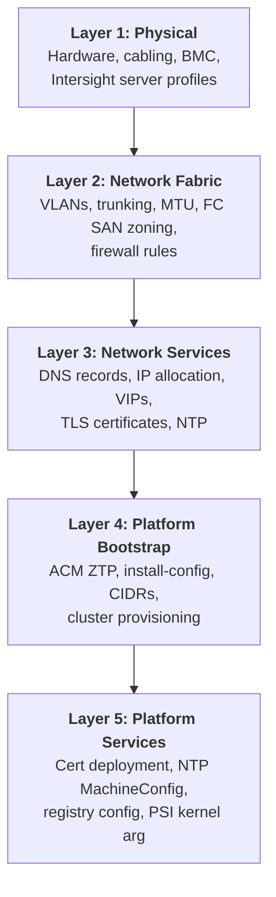

# Low-Level Design — Sample F: Layered Architecture (Bottom-Up Stack)

> **FORMAT SAMPLE** — This document demonstrates the Layered Architecture LLD format using Phase 1 (Foundation) content from the Acme Corp HLD. It is not a production LLD.

---

## About This Format

| Attribute | Description |
|-----------|-------------|
| **Style** | Organized by infrastructure layer, bottom-up — physical through platform services |
| **Audience** | Network and infrastructure engineers who think in layers; troubleshooting teams isolating failures |
| **Strength** | Dependencies are implicit — each layer assumes the one below is healthy; mirrors how physical infrastructure is actually built |
| **Navigation** | Start at Layer 1 (physical) and work up; when troubleshooting, identify the broken layer and look down |
| **Relationship to HLD** | Repackages HLD Phase 1 decisions into a layered dependency model instead of decision-order |

---

## Document Control

| Field | Value |
|---|---|
| **Title** | Acme Corp OpenShift Virtualization — Phase 1 Foundation LLD (Layered Architecture) |
| **Version** | 0.1 |
| **Status** | Draft |
| **Classification** | Internal — Confidential |
| **Author** | {AUTHOR} |
| **Reviewers** | {REVIEWER_LIST} |
| **Approval Authority** | {APPROVER} |
| **Last Updated** | {DATE} |

### Revision History

| Ver | Date | Author | Changes |
|-----|------|--------|---------|
| 0.1 | {DATE} | {AUTHOR} | Initial layered architecture — Phase 1 Foundation |

---

## Scope

This LLD organizes Phase 1 (Foundation) specifications into five infrastructure layers. Each layer builds on the one below. The document is designed to be read bottom-up (physical first) and to support layer-isolation troubleshooting.

### References

| Document | Location |
|----------|----------|
| Acme Corp HLD — Phase 1 Foundation | `HLD/markdown_files/Acme Corp_OCP-V_HLD_DecisionJourney_phase1.md` |
| Acme Corp HLD — Cross-Cutting | `HLD/markdown_files/Acme Corp_OCP-V_HLD_CrossCutting.md` |

---

## Layer Model



### Layer Summary

| Layer | What It Provides | Depends On | HLD Sections |
|-------|-----------------|------------|-------------|
| L1: Physical | Powered servers with configured BIOS, NICs, and BMC connectivity | Racked hardware, power, Intersight account | Hardware Provisioning |
| L2: Network Fabric | Trunked VLANs, switched paths, FC zoning, firewall rules | L1 (physical NICs cabled) | Firewall Rules, Network Fabric Layers |
| L3: Network Services | Resolvable DNS, allocated IPs/VIPs, valid TLS certs, reachable NTP | L2 (network paths open) | DNS/NTP Prerequisites, IP Reservations, TLS Certificates |
| L4: Platform Bootstrap | Running OCP cluster with API, etcd, and joined nodes | L1 + L2 + L3 (all prerequisites met) | Provisioning Method, Tier Model, CIDRs, Capacity |
| L5: Platform Services | Production-ready cluster with enterprise certs, NTP, and runtime config | L4 (cluster running) | TLS post-install, NTP MachineConfig, Registry, PSI |

---

## Layer 1: Physical

### Inputs

- Cisco UCS M8 hardware racked and powered
- Intersight account with admin access
- Physical NICs cabled to Nexus switches

### Specifications

**Intersight server profile policies:**

| Policy | Configuration |
|--------|--------------|
| BIOS | Cisco "virtualization" preset — VT-x, VT-d, NX bit enabled (CVD baseline) |
| Boot | UEFI; local disk or SAN boot |
| vNIC 0 | FI-A, management VLAN, MTU 1500 |
| vNIC 1 | FI-B, all VM VLANs, MTU 1500 |
| vNIC 2 | Dedicated, migration VLAN, MTU 9000 |
| vNIC 3 | Dedicated, backup VLAN, MTU 9000 |
| PCI Placement | Enabled — resolves Broadcom NIC reordering (ADR 7) |
| Ethernet Adapter | Interrupt coalescing, RSS, ring buffer sizing |
| Storage (FC) | WWPN pools, SAN boot targets (DC/CDF only) |
| IPMI | Disabled at Day 0; hardened post-install |

**Tier variance at Layer 1:**

| Parameter | DC | CDF | Branch |
|---|---|---|---|
| vNIC count | 4 | 4 | 2 (TBD) |
| FC HBA | Required | Required | N/A |
| Hardware model | UCS M8 | UCS M8 | Unified Edge |

### Outputs to Layer 2

- Server profiles applied (status: OK)
- BMC/Redfish reachable at known IPs
- Physical NICs present and linked
- NIC naming stable across reboots (PCI placement confirmed)

### Layer 1 Validation

| Check | Method | Expected |
|-------|--------|----------|
| Profiles applied | Intersight console | All profiles: OK |
| BMC reachable | `curl -sk https://<bmc_ip>/redfish/v1/Systems` | HTTP 200 |
| NIC naming stable | `ip link show` across reboot | Names unchanged |
| BIOS VT-x | Intersight inventory | Enabled |
| Physical link | Intersight inventory or `lldpctl` | All NICs linked |

---

## Layer 2: Network Fabric

### Inputs from Layer 1

- Physical NICs cabled and linked
- vNIC VLAN assignments defined in Intersight profiles
- Server profiles applied

### Specifications

**VLAN trunking (Nexus switches):**

| Layer | VLAN | MTU | Purpose | Tiers |
|-------|------|-----|---------|-------|
| Management | Site-specific | 1500 | OCP API, etcd, DNS, NTP | All |
| VM Data | Multiple | 1500 | VM tenant traffic (OVS bridges + NADs) | All |
| Storage | Site-specific | 9000/9216 | FlashSystem FC block access | DC, CDF |
| Migration | Dedicated | 9000 | Live migration memory transfer | DC, CDF |
| Backup | Dedicated | 9000 | {BACKUP_VENDOR} agent traffic | All |
| BMC/CIMC | Site-specific | 1500 | Out-of-band management | All |

**FC SAN zoning (DC/CDF only):**

- Zone each node FC HBA WWPN to FlashSystem target ports
- Verify zone membership via switch CLI

**Firewall rules (18 rule groups):**

| Rule Group | Source | Destination | Key Ports | Protocol |
|------------|--------|-------------|-----------|----------|
| Inter-node | All nodes | All nodes | ICMP, 1936, 9000-9999, 10250-10259, 22623, 6081, 30000-32767 | Mixed |
| API access | All nodes | CP | 6443 | TCP |
| etcd | CP | CP | 2379-2380 | TCP |
| LB → CP | LB VIP | CP | 6443, 22623 | TCP |
| LB → Workers | LB VIP | Workers | 80, 443 | TCP |
| ACM hub | Hub | Cluster | 443, 6443 | TCP |
| BMC/Redfish | Hub | BMC IPs | 443 | TCP |
| Virtual media | BMC IPs | Hub | 6180, 6183 | TCP |
| Ironic | Hub | Nodes | 5050, 6385, 9999 | TCP |
| External | All nodes | External | 123/UDP, 443/TCP, 53/TCP+UDP | Mixed |

Egress model: Firewall-only for DC/CDF (ADR 16). Branch TBD.

### Outputs to Layer 3

- VLANs trunked and reachable between all ports
- Jumbo MTU (9000) confirmed on storage/migration/backup paths
- FC SAN zoning active (DC/CDF)
- All firewall ports open
- No Layer 2 loops or spanning-tree issues

### Layer 2 Validation

| Check | Method | Expected |
|-------|--------|----------|
| VLAN reachable | `ping` between nodes on each VLAN | Replies received |
| Jumbo MTU | `ping -M do -s 8972 <peer_ip>` on migration/storage VLAN | No fragmentation |
| FC zone active | Switch CLI zone membership query | Correct WWPN pairs |
| FW — API port | `nc -zv <api_vip> 6443` | Succeeds |
| FW — Ingress | `nc -zv <ingress_vip> 443` | Succeeds |
| FW — etcd | `nc -zv <cp_ip> 2379` from peer | Succeeds |
| FW — BMC | `curl -sk https://<bmc_ip>/redfish/v1/Systems` | HTTP 200 |
| FW — NTP | `nc -zuv <ntp_server> 123` | Succeeds |
| FW — Artifactory | `curl -s https://<artifactory>/v2/` | HTTP 200 or 401 |

---

## Layer 3: Network Services

### Inputs from Layer 2

- Network paths open (VLANs, firewall rules)
- BMC reachable (for IP reservation confirmation)

### Specifications

**IP allocation (per cluster, Infoblox):**

| IP Type | Count | Network | Notes |
|---------|-------|---------|-------|
| API VIP | 1 | Baremetal | Not host-assigned; floats via keepalived |
| Ingress VIP | 1 | Baremetal | Not host-assigned; floats via keepalived |
| CP nodes | 3 | Baremetal | Static via NMState |
| Workers | N | Baremetal | Static via NMState |
| BMC | 1/node | BMC VLAN | Intersight |
| Storage | 1/node | Storage VLAN | DC/CDF only |
| Migration | 1/node | Migration VLAN | DC/CDF only |
| Backup | 1/node | Backup VLAN | All tiers |

**DNS records (per cluster, Infoblox):**

| Type | Record | Target |
|------|--------|--------|
| A + PTR | `api.<cluster>.<base_domain>` | API VIP |
| A + PTR | `api-int.<cluster>.<base_domain>` | API VIP |
| Wildcard A | `*.apps.<cluster>.<base_domain>` | Ingress VIP |
| A + PTR | `<hostname>.<cluster>.<base_domain>` per node | Node IP |

**TLS certificates (Day 0):**

| Certificate | Subject / SAN | Issuer |
|-------------|--------------|--------|
| API server | `api.<cluster>.<base_domain>` | Enterprise CA |
| Ingress wildcard | `*.apps.<cluster>.<base_domain>` | Internal CA |

Wildcard exception per ADR 24.

**NTP:**

| Parameter | DC/CDF | Branch |
|---|---|---|
| Servers | Internal NTP (SRE-managed) | Branch network NTP (TBD) |
| Protocol | UDP 123 | UDP 123 |
| Max offset | < 100ms | < 100ms |

### Outputs to Layer 4

- All IPs reserved with no conflicts
- DNS records resolving (forward + reverse)
- TLS certificates validated (SAN match, chain valid, not expired)
- NTP reachable

### Layer 3 Validation

| Check | Method | Expected |
|-------|--------|----------|
| No IP conflict | `arping -D -c 3 <ip>` per IP + VIP | No duplicate |
| API DNS | `dig +short api.<cluster>.<base_domain>` | API VIP |
| API-int DNS | `dig +short api-int.<cluster>.<base_domain>` | API VIP |
| Wildcard DNS | `dig +short test.apps.<cluster>.<base_domain>` | Ingress VIP |
| Node A records | `dig +short <hostname>.<cluster>.<base_domain>` | Node IP |
| PTR records | `dig +short -x <node_ip>` | FQDN |
| API cert valid | `openssl x509 -in api.crt -noout -text \| grep DNS:` | SAN matches |
| Ingress cert valid | `openssl x509 -in ingress.crt -noout -text \| grep DNS:` | SAN matches |
| Cert chain | `openssl verify -CAfile ca-bundle.crt <cert>` | OK |
| NTP reachable | `nc -zuv <ntp_server> 123` | Succeeds |

---

## Layer 4: Platform Bootstrap

### Inputs from Layers 1-3

- All physical, network, and service prerequisites met
- Pre-flight validation passed (all 15 checks)

### Pre-Flight Gate

Installation MUST NOT proceed until the full pre-flight checklist passes. This validates that Layers 1-3 are healthy:

| # | Check | Layer Tested |
|---|-------|-------------|
| 1-5 | DNS records (API, API-int, wildcard, A, PTR) | L3 |
| 6 | NTP sync | L3 |
| 7 | BMC reachable | L1 |
| 8 | NIC cabling | L1 |
| 9 | IP conflicts | L3 |
| 10-12 | Firewall ports (API, Ingress, etcd) | L2 |
| 13 | Certificates | L3 |
| 14 | Pull secret / Artifactory | L2 + L3 |
| 15 | Disk performance | L1 |

### Specifications

**Cluster parameters (install-config.yaml):**

| Parameter | Value |
|---|---|
| OCP version | 4.21 |
| Update channel | stable |
| Pod subnet | 192.168.0.0/17 |
| Service subnet | 192.168.128.0/18 |
| Host CIDR prefix | /22 |
| Network type | OVNKubernetes |
| Pods-per-node | 512 |

**Tier model:**

| Tier | Nodes | ACM Hub |
|------|-------|---------|
| DC | 3 CP (schedulable) + 16+ workers | DC/CDF hub |
| CDF | 3 CP (schedulable) + variable workers | DC/CDF hub |
| Branch | 3 compact | Branch hub |

**Capacity settings:**

| Parameter | DC | CDF | Branch |
|---|---|---|---|
| Target CPU | 60-70% | 60-70% | 60-70% |
| Memory overcommit | Disabled | Disabled | Disabled |
| maxUnavailable | 2-4 | 1-2 | 1 |
| Headroom | 1-3 spare nodes | 10-20% | 34% (N-1) |

**Provisioning method:** ACM ZTP via Assisted Installer for all tiers. Branch additionally uses GitOps ZTP pipeline with SiteConfig CRs.

**Provisioning sequence:**


### Outputs to Layer 5

- Cluster API reachable
- etcd quorum healthy
- All nodes joined and Ready
- Console accessible (self-signed certs — replaced at Layer 5)

### Layer 4 Validation

| Check | Method | Expected |
|-------|--------|----------|
| AgentClusterInstall | `oc get agentclusterinstall <cluster> -n <cluster>` | Completed |
| Nodes Ready | `oc get nodes` | All Ready |
| etcd healthy | `oc get etcd -o jsonpath='{.items[*].status.conditions[?(@.type=="EtcdMembersAvailable")].message}'` | 3 members |
| API reachable | `oc --kubeconfig=<kubeconfig> get nodes` | Responds |
| Console | Browser → `console-openshift-console.apps.<cluster>.<base_domain>` | Loads |

---

## Layer 5: Platform Services

### Inputs from Layer 4

- Running OCP cluster with API access
- Self-signed certificates active (default)
- Default NTP configuration

### Specifications

**Enterprise certificate deployment:**

```yaml
apiVersion: v1
kind: Secret
metadata:
  name: custom-ingress-cert
  namespace: openshift-ingress
type: kubernetes.io/tls
data:
  tls.crt: <base64-encoded-cert-chain>
  tls.key: <base64-encoded-private-key>
```

```yaml
apiVersion: operator.openshift.io/v1
kind: IngressController
metadata:
  name: default
  namespace: openshift-ingress-operator
spec:
  defaultCertificate:
    name: custom-ingress-cert
```

**NTP MachineConfig (chrony):**

```yaml
apiVersion: machineconfiguration.openshift.io/v1
kind: MachineConfig
metadata:
  labels:
    machineconfiguration.openshift.io/role: worker
  name: 99-worker-chrony
spec:
  config:
    ignition:
      version: 3.4.0
    storage:
      files:
        - path: /etc/chrony.conf
          mode: 0644
          overwrite: true
          contents:
            source: data:text/plain;charset=utf-8;base64,<BASE64_CHRONY_CONF>
```

Delivered via ArgoCD; ACM inform policy monitors compliance.

**PSI kernel argument (Day-0 MachineConfig):**

```yaml
apiVersion: machineconfiguration.openshift.io/v1
kind: MachineConfig
metadata:
  labels:
    machineconfiguration.openshift.io/role: worker
  name: 99-worker-kernel-psi
spec:
  kernelArguments:
    - psi=1
```

Required for the `KubeVirtRelieveAndMigrate` descheduler profile (ADR 40). Prometheus RSS impact: +~1.3 GB per pod.

**KubeletConfig (pods-per-node):**

```yaml
apiVersion: machineconfiguration.openshift.io/v1
kind: KubeletConfig
metadata:
  name: set-max-pods
spec:
  machineConfigPoolSelector:
    matchLabels:
      pools.operator.machineconfiguration.openshift.io/worker: ""
  kubeletConfig:
    maxPods: 512
```

**Registry:** Artifactory pull-through cache. In-cluster registry: ephemeral mode.

**IPMI hardening (post-install):** Create OCP authentication token, configure IPMI encryption in Intersight.

### Outputs (Gate 1 Ready)

- Enterprise TLS active on API and Ingress
- NTP synced via chrony on all nodes
- PSI enabled on all workers
- maxPods set to 512
- IPMI encryption enabled

### Layer 5 Validation

| Check | Method | Expected |
|-------|--------|----------|
| Ingress cert | `curl -v https://console-openshift-console.apps.<cluster>.<base_domain> 2>&1 \| grep issuer` | Internal CA |
| API cert | `curl -v https://api.<cluster>.<base_domain>:6443 2>&1 \| grep issuer` | Enterprise CA |
| NTP synced | `oc debug node/<node> -- chroot /host chronyc sources` all nodes | `*` source, offset < 100ms |
| PSI enabled | `oc debug node/<worker> -- chroot /host cat /proc/pressure/cpu` | File exists with data |
| maxPods | `oc get kubeletconfig set-max-pods -o jsonpath='{.spec.kubeletConfig.maxPods}'` | 512 |
| MCP healthy | `oc get mcp` | UPDATED=True, DEGRADED=False |

---

## Cross-Layer Dependency Matrix

| Dependency | Layer | Failure Impact |
|------------|-------|---------------|
| Physical NIC cabling | L1 | No L2 connectivity; cluster cannot form |
| Intersight profiles | L1 | NIC naming unstable; BIOS requirements unmet |
| BMC/Redfish | L1 | Cannot discover or power-on nodes |
| VLAN trunking | L2 | No network connectivity between layers |
| Firewall rules | L2 | Silent install failures; blocked ports |
| FC SAN zoning | L2 | No storage path (DC/CDF) |
| DNS records | L3 | Bootstrap fails; nodes can't resolve API |
| IP reservations | L3 | IP conflicts; NMState failures |
| TLS certificates | L3 | Untrusted endpoints; security scanning blocks |
| NTP | L3 | Clock drift; cert validation / Kerberos failures |
| ACM hub | L4 | No provisioning possible |
| install-config | L4 | Wrong CIDRs, wrong node count, wrong VIPs |

---

## Full-Stack Validation (Gate 1)

Gate 1 is met when all five layers pass validation. Summary:

| Layer | Key Checks | Status |
|-------|-----------|--------|
| L1: Physical | Profiles OK, BMC reachable, NICs stable | [ ] |
| L2: Network Fabric | VLANs trunked, MTU confirmed, FW rules open, FC zoned | [ ] |
| L3: Network Services | DNS resolving, IPs conflict-free, certs valid, NTP reachable | [ ] |
| L4: Platform Bootstrap | Cluster API reachable, etcd healthy, all nodes Ready | [ ] |
| L5: Platform Services | Enterprise certs active, NTP synced, PSI enabled, maxPods 512 | [ ] |

**Gate 1 PASSED when all five layers show [x].**
