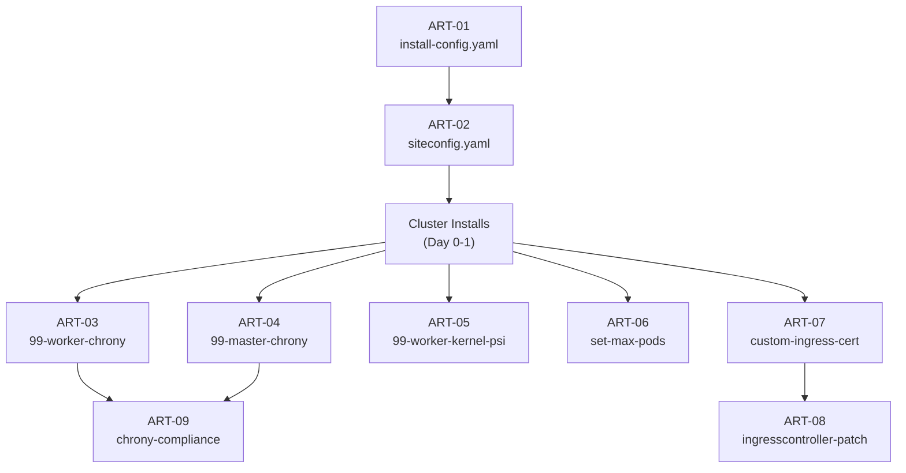

# Low-Level Design — Sample G: Configuration-as-Code / GitOps Manifest Catalog

> **FORMAT SAMPLE** — This document demonstrates the GitOps Manifest Catalog LLD format using Phase 1 (Foundation) content from the Acme Corp HLD. It is not a production LLD.

---

## About This Format

| Attribute | Description |
|-----------|-------------|
| **Style** | Catalog of the actual YAML/config artifacts that will be committed to Git and applied to the cluster |
| **Audience** | GitOps engineers, ArgoCD/ACM operators, code reviewers |
| **Strength** | The LLD *is* the configuration — reduces the translation gap to near-zero; directly reviewable as code |
| **Navigation** | Browse by lifecycle stage (Day 0 / Day 1 / Day 2) or search the variable registry |
| **Relationship to HLD** | Each artifact maps back to an HLD decision via the HLD Reference field |

---

## Document Control

| Field | Value |
|---|---|
| **Title** | Acme Corp OpenShift Virtualization — Phase 1 Foundation LLD (GitOps Manifest Catalog) |
| **Version** | 0.1 |
| **Status** | Draft |
| **Classification** | Internal — Confidential |
| **Author** | {AUTHOR} |
| **Reviewers** | {REVIEWER_LIST} |
| **Approval Authority** | {APPROVER} |
| **Last Updated** | {DATE} |

### Revision History

| Ver | Date | Author | Changes |
|-----|------|--------|---------|
| 0.1 | {DATE} | {AUTHOR} | Initial manifest catalog — Phase 1 Foundation |

---

## Scope

This LLD catalogs every configuration artifact needed to execute Phase 1 (Foundation) of the Acme Corp OpenShift Virtualization deployment. Each entry is a Git-committable artifact with variable substitution markers, purpose annotation, and validation criteria.

### References

| Document | Location |
|----------|----------|
| Acme Corp HLD — Phase 1 Foundation | `HLD/markdown_files/Acme Corp_OCP-V_HLD_DecisionJourney_phase1.md` |

---

## Git Repository Structure

```
ocp-fleet-config/
├── base/                              # Shared across all clusters
│   ├── machineconfigs/
│   │   ├── 99-worker-chrony.yaml      # ART-03
│   │   ├── 99-master-chrony.yaml      # ART-04
│   │   └── 99-worker-kernel-psi.yaml  # ART-05
│   └── kubeletconfigs/
│       └── set-max-pods.yaml          # ART-06
├── clusters/
│   └── ${CLUSTER_NAME}/
│       ├── install-config.yaml        # ART-01
│       ├── siteconfig.yaml            # ART-02
│       └── manifests/
│           ├── custom-ingress-cert.yaml    # ART-07
│           ├── ingresscontroller-patch.yaml # ART-08
│           └── pull-secret.yaml            # (not cataloged — sensitive)
└── policies/
    └── acm/
        └── chrony-compliance.yaml     # ART-09
```

---

## Artifact Dependency Graph



---

## Artifact Catalog

### Day 0 — Pre-Install / Install Artifacts

---

#### ART-01: install-config.yaml

| Field | Value |
|---|---|
| **Path** | `clusters/${CLUSTER_NAME}/install-config.yaml` |
| **Purpose** | Defines cluster identity, network CIDRs, VIPs, and node inventory for ACM Assisted Installer |
| **HLD Reference** | Cluster Network CIDRs; IP Reservations & LB VIPs; Deployment Tier Model; Container Image Registry |
| **Apply Method** | Consumed by ACM ZTP — referenced in SiteConfig CR |
| **Lifecycle** | Day 0 — generated before installation; immutable post-install for network CIDRs |

**Manifest:**

```yaml
apiVersion: v1
metadata:
  name: ${CLUSTER_NAME}
baseDomain: ${BASE_DOMAIN}
networking:
  clusterNetwork:
    - cidr: 192.168.0.0/17
      hostPrefix: 22
  serviceNetwork:
    - 192.168.128.0/18
  networkType: OVNKubernetes
platform:
  baremetal:
    apiVIPs:
      - ${API_VIP}
    ingressVIPs:
      - ${INGRESS_VIP}
    hosts:
      - name: ${CP_0_HOSTNAME}
        role: master
        bmc:
          address: redfish-virtualmedia://${CP_0_BMC_IP}/redfish/v1/Systems/1
          username: ${BMC_USER}
          password: ${BMC_PASS}
        bootMACAddress: ${CP_0_BOOT_MAC}
        rootDeviceHints:
          deviceName: /dev/sda
      - name: ${CP_1_HOSTNAME}
        role: master
        bmc:
          address: redfish-virtualmedia://${CP_1_BMC_IP}/redfish/v1/Systems/1
          username: ${BMC_USER}
          password: ${BMC_PASS}
        bootMACAddress: ${CP_1_BOOT_MAC}
        rootDeviceHints:
          deviceName: /dev/sda
      - name: ${CP_2_HOSTNAME}
        role: master
        bmc:
          address: redfish-virtualmedia://${CP_2_BMC_IP}/redfish/v1/Systems/1
          username: ${BMC_USER}
          password: ${BMC_PASS}
        bootMACAddress: ${CP_2_BOOT_MAC}
        rootDeviceHints:
          deviceName: /dev/sda
      # Worker entries follow same pattern
pullSecret: '${PULL_SECRET}'
sshKey: '${SSH_PUBLIC_KEY}'
imageContentSources:
  - mirrors:
      - ${ARTIFACTORY_MIRROR}/openshift/release-images
    source: quay.io/openshift-release-dev/ocp-release
```

**Variables:**

| Variable | Description | Example | Source |
|----------|-------------|---------|--------|
| `${CLUSTER_NAME}` | Cluster name | `ocp-sa-prod-01` | Cluster planning |
| `${BASE_DOMAIN}` | Base DNS domain | `ocp.example.corp` | DNS standards |
| `${API_VIP}` | API virtual IP | `10.1.1.200` | Infoblox reservation |
| `${INGRESS_VIP}` | Ingress virtual IP | `10.1.1.201` | Infoblox reservation |
| `${CP_N_HOSTNAME}` | Control plane hostname | `cp-0` | Naming convention |
| `${CP_N_BMC_IP}` | BMC IP for CP node | `10.1.100.10` | Intersight/Infoblox |
| `${CP_N_BOOT_MAC}` | Boot NIC MAC address | `AA:BB:CC:01:01:00` | Intersight |
| `${BMC_USER}` | BMC username | (from CyberArk) | Secrets management |
| `${BMC_PASS}` | BMC password | (from CyberArk) | Secrets management |
| `${PULL_SECRET}` | OCP + Artifactory pull secret | (JSON blob) | Secrets management |
| `${SSH_PUBLIC_KEY}` | SSH key for node access | (public key) | Platform team |
| `${ARTIFACTORY_MIRROR}` | Artifactory registry URL | `artifactory.example.corp` | ADR 4 |

**Validation:**

| Check | Command | Expected |
|-------|---------|----------|
| YAML valid | `oc adm release info --registry-config=<pull_secret>` | No errors |
| CIDRs match spec | Inspect `networking` block | 192.168.0.0/17, 192.168.128.0/18 |
| VIPs reserved | `arping -D -c 3 ${API_VIP}` | No conflict |

---

#### ART-02: siteconfig.yaml

| Field | Value |
|---|---|
| **Path** | `clusters/${CLUSTER_NAME}/siteconfig.yaml` |
| **Purpose** | ACM SiteConfig CR — triggers ZTP provisioning for the cluster |
| **HLD Reference** | Provisioning Method per Tier |
| **Apply Method** | `oc apply -f` to ACM hub or via ArgoCD app-of-apps |
| **Lifecycle** | Day 0 — applied to initiate cluster provisioning |

**Manifest:**

```yaml
apiVersion: ran.openshift.io/v2
kind: SiteConfig
metadata:
  name: ${CLUSTER_NAME}
  namespace: ${CLUSTER_NAME}
spec:
  baseDomain: ${BASE_DOMAIN}
  pullSecretRef:
    name: ${CLUSTER_NAME}-pull-secret
  clusterImageSetNameRef: openshift-v${OCP_VERSION}
  sshPublicKey: '${SSH_PUBLIC_KEY}'
  clusters:
    - clusterName: ${CLUSTER_NAME}
      networkType: OVNKubernetes
      clusterLabels:
        tier: ${TIER}
        site: ${SITE}
      clusterNetwork:
        - cidr: 192.168.0.0/17
          hostPrefix: 22
      serviceNetwork:
        - 192.168.128.0/18
      apiVIPs:
        - ${API_VIP}
      ingressVIPs:
        - ${INGRESS_VIP}
      nodes:
        - hostName: ${CP_0_HOSTNAME}
          role: master
          bmcAddress: redfish-virtualmedia://${CP_0_BMC_IP}/redfish/v1/Systems/1
          bmcCredentialsName:
            name: ${CLUSTER_NAME}-bmc-cp-0
          bootMACAddress: ${CP_0_BOOT_MAC}
          nodeNetwork:
            interfaces:
              - name: ens1f0
                macAddress: ${CP_0_BOOT_MAC}
            config:
              interfaces:
                - name: ens1f0
                  type: ethernet
                  state: up
                  ipv4:
                    address:
                      - ip: ${CP_0_MGMT_IP}
                        prefix-length: 24
                    enabled: true
                    dhcp: false
        # Additional nodes follow same pattern
```

**Variables (additional to ART-01):**

| Variable | Description | Example | Source |
|----------|-------------|---------|--------|
| `${OCP_VERSION}` | Target OCP version | `4.21.3` | HLD — OCP Version Strategy |
| `${TIER}` | Deployment tier label | `datacenter` | HLD — Tier Model |
| `${SITE}` | Site identifier | `site-alpha` | Site planning |
| `${CP_N_MGMT_IP}` | Management IP | `10.1.1.10` | Infoblox |

**Validation:**

| Check | Command | Expected |
|-------|---------|----------|
| CR accepted | `oc apply --dry-run=server -f siteconfig.yaml` | No errors |
| Namespace exists | `oc get ns ${CLUSTER_NAME}` | Exists (or will be created) |

---

### Day 1 — Post-Install Base Configuration

---

#### ART-03: 99-worker-chrony.yaml

| Field | Value |
|---|---|
| **Path** | `base/machineconfigs/99-worker-chrony.yaml` |
| **Purpose** | Configure chrony NTP on all worker nodes |
| **HLD Reference** | DNS, Static IPs & NTP Prerequisites |
| **Apply Method** | ArgoCD app-of-apps (base config); ACM inform policy monitors compliance |
| **Lifecycle** | Day 1 — applied post-install; triggers rolling node restart |

**Manifest:**

```yaml
apiVersion: machineconfiguration.openshift.io/v1
kind: MachineConfig
metadata:
  labels:
    machineconfiguration.openshift.io/role: worker
  name: 99-worker-chrony
spec:
  config:
    ignition:
      version: 3.4.0
    storage:
      files:
        - path: /etc/chrony.conf
          mode: 0644
          overwrite: true
          contents:
            source: data:text/plain;charset=utf-8;base64,${CHRONY_CONF_B64}
```

**Variables:**

| Variable | Description | Example | Source |
|----------|-------------|---------|--------|
| `${CHRONY_CONF_B64}` | Base64-encoded chrony.conf | (base64 of chrony.conf below) | Site-specific NTP servers |

**chrony.conf template (before encoding):**

```
server ${NTP_SERVER_1} iburst
server ${NTP_SERVER_2} iburst
driftfile /var/lib/chrony/drift
makestep 1.0 3
rtcsync
logdir /var/log/chrony
```

| Variable | Description | Example | Source |
|----------|-------------|---------|--------|
| `${NTP_SERVER_1}` | Primary NTP server | `ntp1.ash.example.corp` | SRE / Network team |
| `${NTP_SERVER_2}` | Secondary NTP server | `ntp2.ash.example.corp` | SRE / Network team |

**Validation:**

| Check | Command | Expected |
|-------|---------|----------|
| MC exists | `oc get mc 99-worker-chrony` | Resource found |
| MCP updated | `oc get mcp worker -o jsonpath='{.status.conditions[?(@.type=="Updated")].status}'` | True |
| NTP synced | `oc debug node/<worker> -- chroot /host chronyc sources` | `*` source, offset < 100ms |

---

#### ART-04: 99-master-chrony.yaml

| Field | Value |
|---|---|
| **Path** | `base/machineconfigs/99-master-chrony.yaml` |
| **Purpose** | Configure chrony NTP on all control plane nodes |
| **HLD Reference** | DNS, Static IPs & NTP Prerequisites |
| **Apply Method** | ArgoCD app-of-apps |
| **Lifecycle** | Day 1 |

**Manifest:** Identical to ART-03 except:

```yaml
metadata:
  labels:
    machineconfiguration.openshift.io/role: master
  name: 99-master-chrony
```

Same `${CHRONY_CONF_B64}` variable, same validation.

---

#### ART-05: 99-worker-kernel-psi.yaml

| Field | Value |
|---|---|
| **Path** | `base/machineconfigs/99-worker-kernel-psi.yaml` |
| **Purpose** | Enable PSI kernel argument for the KubeVirtRelieveAndMigrate descheduler profile |
| **HLD Reference** | Hardware Provisioning — Day-0 MachineConfig Considerations; ADR 40 |
| **Apply Method** | ArgoCD app-of-apps |
| **Lifecycle** | Day 0/1 — apply before workloads run to avoid extra reboot cycle |

**Manifest:**

```yaml
apiVersion: machineconfiguration.openshift.io/v1
kind: MachineConfig
metadata:
  labels:
    machineconfiguration.openshift.io/role: worker
  name: 99-worker-kernel-psi
spec:
  kernelArguments:
    - psi=1
```

**Variables:** None — static manifest.

**Notes:**
- Name `99-*` is lexicographically > `98-*` (default config disables PSI)
- Prometheus RSS impact: +~1.3 GB per pod at 500+ containers

**Validation:**

| Check | Command | Expected |
|-------|---------|----------|
| MC exists | `oc get mc 99-worker-kernel-psi` | Resource found |
| PSI active | `oc debug node/<worker> -- chroot /host cat /proc/pressure/cpu` | File exists with data |

---

#### ART-06: set-max-pods.yaml

| Field | Value |
|---|---|
| **Path** | `base/kubeletconfigs/set-max-pods.yaml` |
| **Purpose** | Set pods-per-node limit to 512 |
| **HLD Reference** | Capacity & Headroom Policy |
| **Apply Method** | ArgoCD app-of-apps |
| **Lifecycle** | Day 1 |

**Manifest:**

```yaml
apiVersion: machineconfiguration.openshift.io/v1
kind: KubeletConfig
metadata:
  name: set-max-pods
spec:
  machineConfigPoolSelector:
    matchLabels:
      pools.operator.machineconfiguration.openshift.io/worker: ""
  kubeletConfig:
    maxPods: 512
```

**Variables:** None — static manifest.

**Validation:**

| Check | Command | Expected |
|-------|---------|----------|
| KubeletConfig exists | `oc get kubeletconfig set-max-pods` | Resource found |
| maxPods value | `oc get kubeletconfig set-max-pods -o jsonpath='{.spec.kubeletConfig.maxPods}'` | 512 |

---

#### ART-07: custom-ingress-cert.yaml

| Field | Value |
|---|---|
| **Path** | `clusters/${CLUSTER_NAME}/manifests/custom-ingress-cert.yaml` |
| **Purpose** | Replace default self-signed ingress certificate with Internal CA wildcard cert |
| **HLD Reference** | TLS/SSL Certificates; ADR 24 |
| **Apply Method** | Manual `oc apply` or ArgoCD (requires SealedSecret or ESO for key material) |
| **Lifecycle** | Day 1 — applied immediately after cluster is accessible |

**Manifest:**

```yaml
apiVersion: v1
kind: Secret
metadata:
  name: custom-ingress-cert
  namespace: openshift-ingress
type: kubernetes.io/tls
data:
  tls.crt: ${INGRESS_CERT_B64}
  tls.key: ${INGRESS_KEY_B64}
```

**Variables:**

| Variable | Description | Example | Source |
|----------|-------------|---------|--------|
| `${INGRESS_CERT_B64}` | Base64-encoded ingress cert chain | (base64 blob) | Internal CA |
| `${INGRESS_KEY_B64}` | Base64-encoded private key | (base64 blob) | Internal CA |

**Validation:**

| Check | Command | Expected |
|-------|---------|----------|
| Secret exists | `oc get secret custom-ingress-cert -n openshift-ingress` | Found |
| Cert valid | `oc get secret custom-ingress-cert -n openshift-ingress -o jsonpath='{.data.tls\.crt}' \| base64 -d \| openssl x509 -noout -text \| grep DNS:` | `*.apps.${CLUSTER_NAME}.${BASE_DOMAIN}` |

---

#### ART-08: ingresscontroller-patch.yaml

| Field | Value |
|---|---|
| **Path** | `clusters/${CLUSTER_NAME}/manifests/ingresscontroller-patch.yaml` |
| **Purpose** | Point the default IngressController to the enterprise ingress certificate |
| **HLD Reference** | TLS/SSL Certificates |
| **Apply Method** | `oc apply` or ArgoCD |
| **Lifecycle** | Day 1 — applied after ART-07 |

**Manifest:**

```yaml
apiVersion: operator.openshift.io/v1
kind: IngressController
metadata:
  name: default
  namespace: openshift-ingress-operator
spec:
  defaultCertificate:
    name: custom-ingress-cert
```

**Variables:** None — references secret name from ART-07.

**Validation:**

| Check | Command | Expected |
|-------|---------|----------|
| IngressController patched | `oc get ingresscontroller default -n openshift-ingress-operator -o jsonpath='{.spec.defaultCertificate.name}'` | `custom-ingress-cert` |
| Cert active | `curl -v https://console-openshift-console.apps.${CLUSTER_NAME}.${BASE_DOMAIN} 2>&1 \| grep issuer` | Internal CA |

---

### Day 2 — Compliance & Drift Detection

---

#### ART-09: chrony-compliance.yaml

| Field | Value |
|---|---|
| **Path** | `policies/acm/chrony-compliance.yaml` |
| **Purpose** | ACM inform policy that monitors chrony MachineConfig compliance across all managed clusters |
| **HLD Reference** | DNS, Static IPs & NTP Prerequisites (chrony delivery pattern) |
| **Apply Method** | Applied to ACM hub via ArgoCD |
| **Lifecycle** | Day 2 — continuous compliance monitoring |

**Manifest:**

```yaml
apiVersion: policy.open-cluster-management.io/v1
kind: Policy
metadata:
  name: chrony-compliance
  namespace: open-cluster-management-policies
  annotations:
    policy.open-cluster-management.io/categories: CM Configuration Management
    policy.open-cluster-management.io/standards: NIST SP 800-53
spec:
  remediationAction: inform
  disabled: false
  policy-templates:
    - objectDefinition:
        apiVersion: policy.open-cluster-management.io/v1
        kind: ConfigurationPolicy
        metadata:
          name: chrony-mc-exists
        spec:
          remediationAction: inform
          severity: high
          object-templates:
            - complianceType: musthave
              objectDefinition:
                apiVersion: machineconfiguration.openshift.io/v1
                kind: MachineConfig
                metadata:
                  name: 99-worker-chrony
---
apiVersion: apps.open-cluster-management.io/v1
kind: PlacementRule
metadata:
  name: chrony-placement
  namespace: open-cluster-management-policies
spec:
  clusterSelector:
    matchExpressions:
      - key: vendor
        operator: In
        values:
          - OpenShift
---
apiVersion: policy.open-cluster-management.io/v1
kind: PlacementBinding
metadata:
  name: chrony-placement-binding
  namespace: open-cluster-management-policies
placementRef:
  name: chrony-placement
  apiGroup: apps.open-cluster-management.io
  kind: PlacementRule
subjects:
  - name: chrony-compliance
    apiGroup: policy.open-cluster-management.io
    kind: Policy
```

**Variables:** None — applies to all OpenShift managed clusters.

**Validation:**

| Check | Command | Expected |
|-------|---------|----------|
| Policy created | `oc get policy chrony-compliance -n open-cluster-management-policies` | Found |
| Compliance status | `oc get policy chrony-compliance -n open-cluster-management-policies -o jsonpath='{.status.compliant}'` | Compliant |

---

## Master Variable Registry

All substitution variables used across artifacts:

| Variable | Description | Example | Used In | Source |
|----------|-------------|---------|---------|--------|
| `${CLUSTER_NAME}` | Cluster identifier | `ocp-sa-prod-01` | ART-01, 02, 07, 08 | Cluster planning |
| `${BASE_DOMAIN}` | Base DNS domain | `ocp.example.corp` | ART-01, 02 | DNS standards |
| `${API_VIP}` | API virtual IP | `10.1.1.200` | ART-01, 02 | Infoblox |
| `${INGRESS_VIP}` | Ingress virtual IP | `10.1.1.201` | ART-01, 02 | Infoblox |
| `${OCP_VERSION}` | OCP release version | `4.21.3` | ART-02 | HLD |
| `${TIER}` | Deployment tier | `datacenter` | ART-02 | HLD — Tier Model |
| `${SITE}` | Site name | `site-alpha` | ART-02 | Site planning |
| `${CP_N_HOSTNAME}` | CP node hostname | `cp-0` | ART-01, 02 | Naming convention |
| `${CP_N_BMC_IP}` | CP node BMC IP | `10.1.100.10` | ART-01, 02 | Intersight/Infoblox |
| `${CP_N_BOOT_MAC}` | CP node boot MAC | `AA:BB:CC:01:01:00` | ART-01, 02 | Intersight |
| `${CP_N_MGMT_IP}` | CP node management IP | `10.1.1.10` | ART-02 | Infoblox |
| `${BMC_USER}` | BMC username | (secret) | ART-01 | CyberArk |
| `${BMC_PASS}` | BMC password | (secret) | ART-01 | CyberArk |
| `${PULL_SECRET}` | OCP + Artifactory pull secret | (JSON) | ART-01 | Secrets management |
| `${SSH_PUBLIC_KEY}` | SSH public key for node access | (key) | ART-01, 02 | Platform team |
| `${ARTIFACTORY_MIRROR}` | Artifactory registry URL | `artifactory.example.corp` | ART-01 | ADR 4 |
| `${NTP_SERVER_1}` | Primary NTP server | `ntp1.ash.example.corp` | ART-03, 04 | SRE / Network |
| `${NTP_SERVER_2}` | Secondary NTP server | `ntp2.ash.example.corp` | ART-03, 04 | SRE / Network |
| `${CHRONY_CONF_B64}` | Base64-encoded chrony.conf | (derived) | ART-03, 04 | Derived from NTP vars |
| `${INGRESS_CERT_B64}` | Base64-encoded ingress cert | (secret) | ART-07 | Internal CA |
| `${INGRESS_KEY_B64}` | Base64-encoded ingress key | (secret) | ART-07 | Internal CA |

**Sensitive variables** (`${BMC_USER}`, `${BMC_PASS}`, `${PULL_SECRET}`, `${INGRESS_KEY_B64}`) must be managed via CyberArk/ESO and never committed to Git in plaintext.

---

## Artifact Summary by Lifecycle Stage

| Stage | Artifact ID | File | Apply Method |
|-------|------------|------|-------------|
| **Day 0** | ART-01 | install-config.yaml | ACM ZTP (referenced by SiteConfig) |
| **Day 0** | ART-02 | siteconfig.yaml | `oc apply` to ACM hub or ArgoCD |
| **Day 1** | ART-03 | 99-worker-chrony.yaml | ArgoCD app-of-apps |
| **Day 1** | ART-04 | 99-master-chrony.yaml | ArgoCD app-of-apps |
| **Day 1** | ART-05 | 99-worker-kernel-psi.yaml | ArgoCD app-of-apps |
| **Day 1** | ART-06 | set-max-pods.yaml | ArgoCD app-of-apps |
| **Day 1** | ART-07 | custom-ingress-cert.yaml | Manual / ArgoCD + ESO |
| **Day 1** | ART-08 | ingresscontroller-patch.yaml | ArgoCD |
| **Day 2** | ART-09 | chrony-compliance.yaml | ArgoCD to ACM hub |

---

## Open Items

| ID | Item | Owner | Status |
|----|------|-------|--------|
| OI-G-01 | Finalize Git repo structure with SRE team | Platform Team | Open |
| OI-G-02 | ESO/SealedSecret strategy for cert and BMC secrets in Git | Platform / Security | Open |
| OI-G-03 | ArgoCD app-of-apps hierarchy for base vs cluster-specific | Platform Team | Open |
| OI-G-04 | Branch-specific variable overrides (NTP, VLANs) | Platform / Network | Open |
