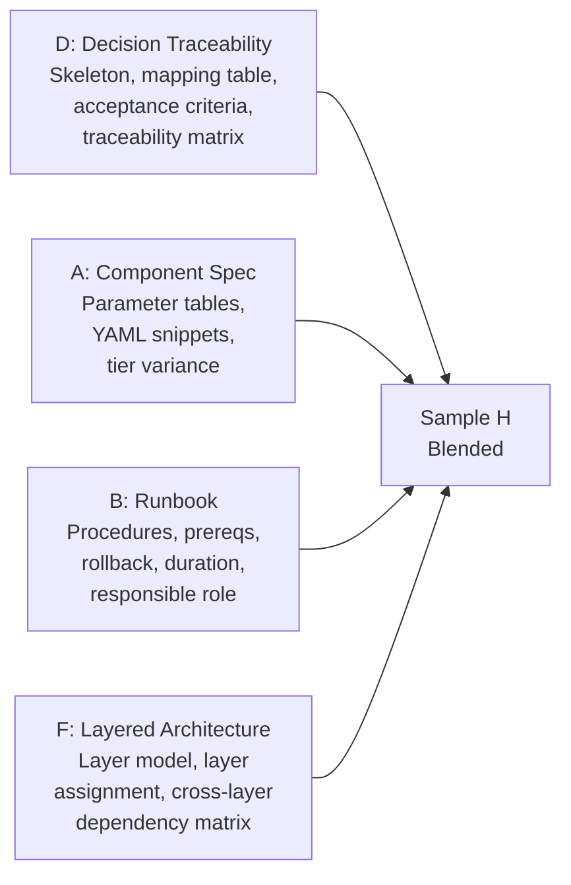
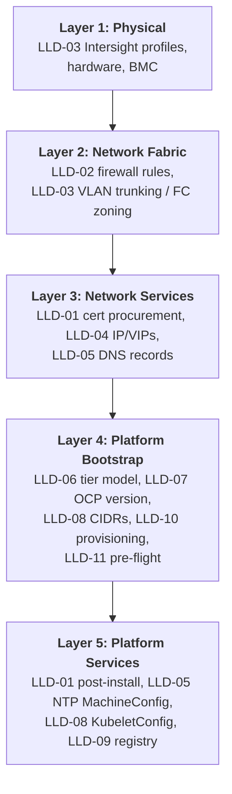
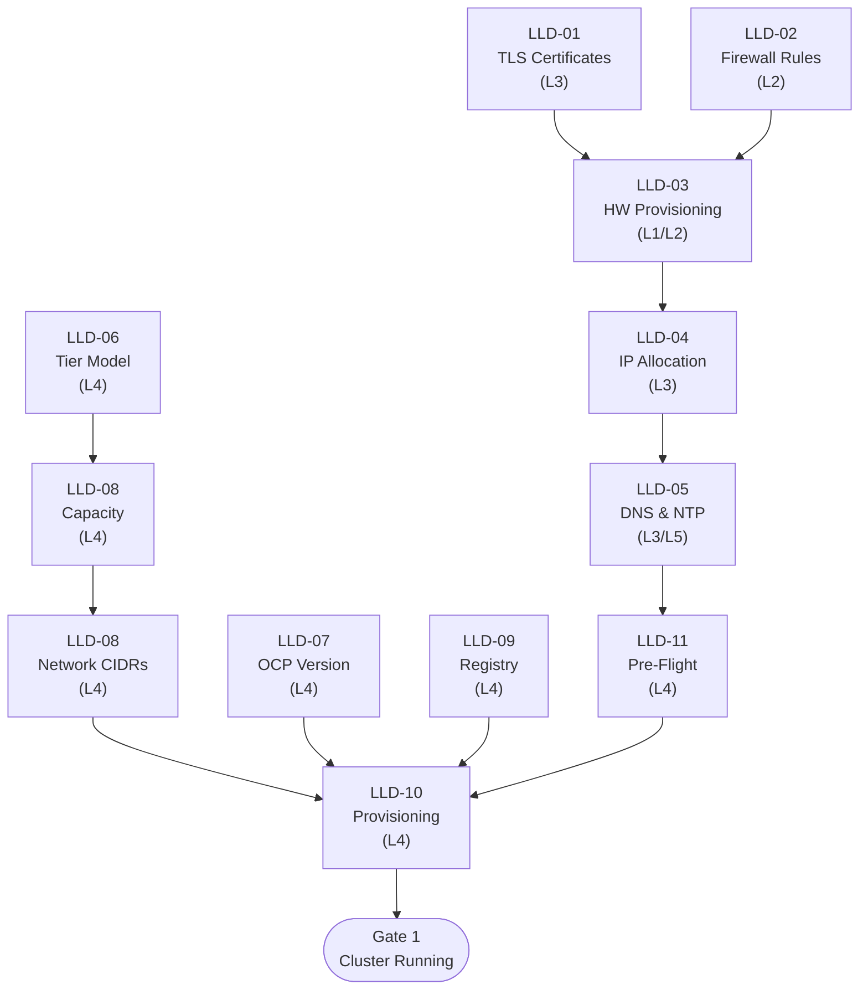

# Low-Level Design — Sample H: Blended Format (D + A + B + F)

> **FORMAT SAMPLE** — This document demonstrates a blended LLD format combining elements from Samples D, A, B, and F using Phase 1 (Foundation) content from the Acme Corp HLD. It is not a production LLD. Three sections (LLD-01, LLD-03, LLD-05) are fully detailed; the remaining nine are skeleton placeholders to show the complete document structure.

---

## About This Format

| Attribute | Description |
|-----------|-------------|
| **Base Structure** | Decision-to-Implementation Traceability (Sample D) — HLD decision ordering, mapping table, numbered acceptance criteria, traceability matrix |
| **Enriched With** | Component Specification (A) — parameter tables, YAML snippets, tier variance tables |
| | Runbook/Procedure (B) — step-by-step procedures, prerequisites, rollback, duration, responsible role |
| | Layered Architecture (F) — layer model framing, layer assignment per section, cross-layer dependencies |
| **Audience** | All roles — architects verify traceability, engineers follow procedures, reviewers audit parameter correctness, troubleshooters isolate by layer |
| **Navigation** | Follow HLD decision order (D); filter by layer (F); jump to any procedure (B); look up any parameter (A) |

### What Each Source Contributes



---

## Document Control

| Field | Value |
|---|---|
| **Title** | Acme Corp OpenShift Virtualization — Phase 1 Foundation LLD (Blended) |
| **Version** | 0.1 |
| **Status** | Draft |
| **Classification** | Internal — Confidential |
| **Author** | {AUTHOR} |
| **Reviewers** | {REVIEWER_LIST} |
| **Approval Authority** | {APPROVER} |
| **Last Updated** | {DATE} |

### Revision History

| Ver | Date | Author | Changes |
|-----|------|--------|---------|
| 0.1 | {DATE} | {AUTHOR} | Initial blended LLD — Phase 1 Foundation |

---

## Scope & References

This LLD provides implementation specifications for every decision documented in HLD Phase 1 (Foundation). Each section maps 1:1 to an HLD decision and contains configuration parameters (A), implementation procedures (B), layer context (F), and testable acceptance criteria (D).

| Document | Location |
|----------|----------|
| Acme Corp HLD — Phase 1 Foundation | `HLD/markdown_files/Acme Corp_OCP-V_HLD_DecisionJourney_phase1.md` |
| Acme Corp HLD — Cross-Cutting | `HLD/markdown_files/Acme Corp_OCP-V_HLD_CrossCutting.md` |
| Acme Corp ADR Register | `ADR_{client}.md` |

---

## Layer Model Overview

*From Sample F — each LLD section is assigned to an infrastructure layer.*



---

## Phase 1 Implementation Flow

*From Sample D.*



---

## LLD-01: TLS/SSL Certificates

### Section Header

| Field | Value |
|---|---|
| **HLD Section** | Phase 1 — TLS/SSL Certificates (Pre-Install) |
| **ADR** | ADR 24 (wildcard certificate exceptions) |
| **Layer** | L3 (procurement) / L5 (post-install application) |
| **Responsible** | |

### Prerequisites

| ID | Item | Owner | Status |
|----|------|-------|--------|
| CG-01-1 | Confirm certificate key algorithm policy with Security | Security Team | Open |

### Configuration Parameters

| Parameter | Value | Description | Source |
|-----------|-------|-------------|--------|
| API cert subject | `api.<cluster>.<base_domain>` | API server CN/SAN | HLD — Certificate Inventory |
| Ingress cert subject | `*.apps.<cluster>.<base_domain>` | Wildcard ingress CN/SAN | HLD — Certificate Inventory |
| API cert issuer | Enterprise CA | Corporate PKI | ADR 24 |
| Ingress cert issuer | Internal CA | Internal PKI with wildcard exception | ADR 24 |
| Key algorithm | RSA 2048 or ECDSA P-256 | Per enterprise PKI policy | Acme Corp Security Standards |
| Validity period | Per enterprise CA policy | Renewed via cert-manager post-install | HLD |
| cert-manager namespace | `cert-manager` | Operator manages rotation post Day 0 | OCP docs |
| Ingress secret name | `custom-ingress-cert` | In namespace `openshift-ingress` | OCP cert config guide |

### Sample Configuration

**Ingress certificate secret:**

```yaml
apiVersion: v1
kind: Secret
metadata:
  name: custom-ingress-cert
  namespace: openshift-ingress
type: kubernetes.io/tls
data:
  tls.crt: <base64-encoded-cert-chain>
  tls.key: <base64-encoded-private-key>
```

**IngressController patch:**

```yaml
apiVersion: operator.openshift.io/v1
kind: IngressController
metadata:
  name: default
  namespace: openshift-ingress-operator
spec:
  defaultCertificate:
    name: custom-ingress-cert
```

### Tier Variance

| Parameter | DC | CDF | Branch |
|---|---|---|---|
| API cert issuer | Enterprise CA | Enterprise CA | Enterprise CA |
| Ingress cert issuer | Internal CA | Internal CA | Internal CA |
| Wildcard exception | Required | Required | Required |

*No tier-specific variance for certificates.*

### Implementation Procedure

**Prerequisites:**

- [ ] Cluster name and base domain finalized
- [ ] Enterprise CA and Internal CA accessible
- [ ] Wildcard certificate exception approved (ADR 24)

**Steps:**

1. **Generate CSR for API certificate**
   - Subject: `api.<cluster>.<base_domain>`
   - SAN: `api.<cluster>.<base_domain>`
   - Key: RSA 2048 or ECDSA P-256 per enterprise policy

2. **Generate CSR for Ingress wildcard certificate**
   - Subject: `*.apps.<cluster>.<base_domain>`
   - SAN: `*.apps.<cluster>.<base_domain>`

3. **Submit API CSR to Enterprise CA** — follow Acme Corp PKI submission process

4. **Submit Ingress CSR to Internal CA** — include wildcard exception reference (ADR 24)

5. **Validate received certificates:**

   ```bash
   openssl x509 -in api.crt -noout -text | grep -E "Subject:|DNS:"
   openssl x509 -in ingress.crt -noout -text | grep -E "Subject:|DNS:"
   openssl x509 -in api.crt -noout -dates
   openssl verify -CAfile ca-bundle.crt api.crt
   openssl verify -CAfile ca-bundle.crt ingress.crt
   ```

6. **Store certificates securely** for use post-install

7. **Post-install — create ingress secret:**

   ```bash
   oc create secret tls custom-ingress-cert \
     --cert=ingress.crt --key=ingress.key \
     -n openshift-ingress
   ```

8. **Post-install — patch IngressController:**

   ```bash
   oc patch ingresscontroller default \
     -n openshift-ingress-operator \
     --type=merge \
     -p '{"spec":{"defaultCertificate":{"name":"custom-ingress-cert"}}}'
   ```

**Verification:**

```bash
curl -vk https://console-openshift-console.apps.<cluster>.<base_domain> 2>&1 | grep issuer
curl -vk https://api.<cluster>.<base_domain>:6443 2>&1 | grep issuer
```

**Rollback:**

- Delete secret: `oc delete secret custom-ingress-cert -n openshift-ingress`
- Revert IngressController: `oc patch ingresscontroller default -n openshift-ingress-operator --type=merge -p '{"spec":{"defaultCertificate":null}}'`
- Cluster reverts to self-signed certificates

### Acceptance Criteria

| ID | Criterion | Test | Expected Result |
|----|-----------|------|-----------------|
| AC-01-1 | API cert SAN correct | `openssl x509 -in api.crt -noout -text \| grep DNS:` | Contains `api.<cluster>.<base_domain>` |
| AC-01-2 | Ingress cert SAN correct | `openssl x509 -in ingress.crt -noout -text \| grep DNS:` | Contains `*.apps.<cluster>.<base_domain>` |
| AC-01-3 | Chain validates | `openssl verify -CAfile ca-bundle.crt <cert>` | OK |
| AC-01-4 | Not expired | `openssl x509 -in <cert> -noout -dates` | notAfter is future |
| AC-01-5 | Ingress cert active post-install | `curl -v` console URL, grep issuer | Internal CA |
| AC-01-6 | API cert active post-install | `curl -v` API URL, grep issuer | Enterprise CA |

---

## LLD-02: Firewall Rules & Port Requirements

*Placeholder — follows same enriched structure as LLD-01.*

| Field | Value |
|---|---|
| **HLD Section** | Phase 1 — Firewall Rules & Port Requirements |
| **ADR** | ADR 16 |
| **Layer** | L2 (Network Fabric) |
| **Responsible** | |

*Completion Gates, Configuration Parameters, Sample Config, Tier Variance, Implementation Procedure, and Acceptance Criteria (AC-02-1 to AC-02-7) would follow the same enriched format demonstrated in LLD-01.*

---

## LLD-03: Hardware Provisioning & Network Fabric

### Section Header

| Field | Value |
|---|---|
| **HLD Section** | Phase 1 — Hardware Provisioning & Network Fabric |
| **ADR** | ADR 7 (PCI placement rules for NIC stability) |
| **Layer** | L1 (Physical) / L2 (Network Fabric) |
| **Responsible** | |

### Prerequisites

| ID | Item | Owner | Status |
|----|------|-------|--------|
| CG-03-1 | Branch 2-vNIC layout finalization | Network Team | Open |
| CG-03-2 | BIOS validation against OCP requirements | Platform / Red Hat | Open |
| CG-03-3 | IPMI post-install hardening procedure | Platform / Cisco | Open |
| CG-03-4 | BIOS time propagation (Intersight NTP vs BIOS) | BC Team / Cisco | Open |

### Configuration Parameters

| Parameter | Value | Description | Source |
|-----------|-------|-------------|--------|
| BIOS profile | Cisco "virtualization" preset | VT-x, VT-d, NX bit enabled | CVD baseline |
| Boot mode | UEFI | Local disk or SAN boot | OCP requirement |
| vNIC 0 | FI-A, management VLAN | MTU 1500 | HLD |
| vNIC 1 | FI-B, all VM VLANs | MTU 1500 | HLD |
| vNIC 2 | Dedicated, migration VLAN | MTU 9000 | HLD |
| vNIC 3 | Dedicated, backup VLAN | MTU 9000 | HLD |
| PCI placement | Enabled in all profile templates | Resolves Broadcom NIC reordering | ADR 7 |
| IPMI encryption | Disabled at Day 0 | Hardened post-install (2-step) | Cisco CVD |
| Ethernet adapter | Interrupt coalescing, RSS, ring buffer | Per CVD sizing | Cisco CVD |
| PSI kernel arg | `psi=1` via MachineConfig `99-worker-kernel-psi` | For descheduler profile | ADR 40 |

### Sample Configuration

**PSI MachineConfig (Day 0):**

```yaml
apiVersion: machineconfiguration.openshift.io/v1
kind: MachineConfig
metadata:
  labels:
    machineconfiguration.openshift.io/role: worker
  name: 99-worker-kernel-psi
spec:
  kernelArguments:
    - psi=1
```

Name `99-*` is lexicographically > `98-*` (default disables PSI). Prometheus RSS impact: +~1.3 GB per pod at 500+ containers.

### Tier Variance

| Parameter | DC | CDF | Branch |
|---|---|---|---|
| vNIC count | 4 (full bond separation) | 4 (baseline) | 2 (TBD, combined bonds) |
| FC HBA / SAN zoning | Required | Required | N/A |
| Hardware model | UCS M8 | UCS M8 | Unified Edge |
| Storage VLAN | Site-specific, 9000/9216 | Site-specific, 9000/9216 | N/A (local ODF) |
| Migration VLAN | Dedicated, 9000 | Dedicated, 9000 | N/A (shared bond TBD) |
| FC SAN zoning | Required | Required | N/A |

### Implementation Procedure

**Prerequisites:**

- [ ] Cisco UCS M8 hardware racked, powered, registered in Intersight
- [ ] Intersight account with admin privileges
- [ ] VLAN IDs for all network layers determined
- [ ] WWPN pools defined (if FC SAN boot)
- [ ] Nexus switch access credentials available

**Steps — L1: Server Profiles (Infrastructure Team):**

1. **Create BIOS policy** — base: Cisco "virtualization" preset; verify VT-x, VT-d, NX bit

2. **Create Boot policy** — UEFI; local disk or SAN boot

3. **Create vNIC policies:**

   | vNIC | Fabric | VLANs | Purpose | MTU |
   |------|--------|-------|---------|-----|
   | vNIC 0 | FI-A | Management | OCP management | 1500 |
   | vNIC 1 | FI-B | All VM VLANs | VM data (OVS bridges) | 1500 |
   | vNIC 2 | Dedicated | Migration | Live migration | 9000 |
   | vNIC 3 | Dedicated | Backup | {BACKUP_VENDOR} backup | 9000 |

4. **Enable PCI placement rules** in the server profile template (ADR 7)

5. **Configure IPMI** — deploy with encryption disabled per CVD

6. **Create Ethernet adapter policies** — interrupt coalescing, RSS, ring buffer per CVD

7. **Create server profile template** combining all policies

8. **Derive and apply profiles** to each physical server

9. **Verify profile application** — Intersight console: all profiles status "OK"

**Steps — L2: Network Fabric (Network Team):**

10. **Configure VLAN trunking** on Nexus switches:
    - Management (1500), VM Data (1500), Storage (9000), Migration (9000), Backup (9000), BMC (1500)

11. **Configure FC SAN zoning** (DC/CDF only) — zone each node FC HBA WWPN to FlashSystem targets

12. **Verify MTU end-to-end:**

    ```bash
    ping -M do -s 8972 <peer_migration_ip>
    ```

**Verification:**

```bash
# NIC naming stability
ip link show  # before and after reboot — names must not change

# BMC reachable
curl -sk https://<bmc_ip>/redfish/v1/Systems

# MTU
ip link show <iface> | grep mtu
```

**Rollback:**

- Unapply server profile from Intersight; server reverts on reboot
- Revert switch config to pre-change snapshot
- Remove FC SAN zones via switch CLI

### Acceptance Criteria

| ID | Criterion | Test | Expected Result |
|----|-----------|------|-----------------|
| AC-03-1 | Profiles applied | Intersight console | Status: OK |
| AC-03-2 | NIC names stable | `ip link show` across reboot | Names unchanged |
| AC-03-3 | BMC reachable | `curl -sk https://<bmc_ip>/redfish/v1/Systems` | HTTP 200 |
| AC-03-4 | MTU correct | `ip link show <iface> \| grep mtu` | Expected MTU |
| AC-03-5 | FC SAN zone active | Switch CLI — zone membership | Correct WWPN pairs |
| AC-03-6 | PSI enabled | `cat /proc/pressure/cpu` on worker | File exists with data |

---

## LLD-04: IP Reservations & Load Balancer VIPs

*Placeholder — follows same enriched structure.*

| Field | Value |
|---|---|
| **HLD Section** | Phase 1 — IP Reservations & Load Balancer VIPs |
| **ADR** | ADR 12 |
| **Layer** | L3 (Network Services) |
| **Responsible** | |

*Completion Gates, full enriched content (parameters, procedure, tier variance, rollback, AC-04-1 to AC-04-4) would follow.*

---

## LLD-05: DNS, Static IPs & NTP

### Section Header

| Field | Value |
|---|---|
| **HLD Section** | Phase 1 — DNS, Static IPs & NTP Prerequisites |
| **ADR** | — |
| **Layer** | L3 (DNS, IP records) / L5 (NTP MachineConfig post-install) |
| **Responsible** | |

### Prerequisites

| ID | Item | Owner | Status |
|----|------|-------|--------|
| CG-05-1 | Branch NTP server confirmation | Network Team | Open |

### Configuration Parameters

| Parameter | Value | Description | Source |
|-----------|-------|-------------|--------|
| DNS provider | Infoblox | Enterprise DNS | HLD |
| API record | `api.<cluster>.<base_domain>` → API VIP | A + PTR | OCP install guide |
| API-int record | `api-int.<cluster>.<base_domain>` → API VIP | A + PTR | OCP install guide |
| Ingress wildcard | `*.apps.<cluster>.<base_domain>` → Ingress VIP | Wildcard A | OCP install guide |
| Node records | `<hostname>.<cluster>.<base_domain>` → node IP | A + PTR per node | OCP install guide |
| TTL | 300s (recommended during deployment) | Raise post-validation | Best practice |
| NTP servers | Internal NTP (site-specific) | DC/CDF: SRE-managed; Branch: TBD | HLD |
| NTP max offset | < 100ms | Pre-flight pass criteria | HLD |
| Chrony delivery | MachineConfig via ArgoCD | ACM inform policy monitors compliance | HLD |
| Guest VM time | No hypervisor sync | Windows: AD; Linux: direct NTP | HLD |

### Sample Configuration

**Chrony MachineConfig (worker nodes):**

```yaml
apiVersion: machineconfiguration.openshift.io/v1
kind: MachineConfig
metadata:
  labels:
    machineconfiguration.openshift.io/role: worker
  name: 99-worker-chrony
spec:
  config:
    ignition:
      version: 3.4.0
    storage:
      files:
        - path: /etc/chrony.conf
          mode: 0644
          overwrite: true
          contents:
            source: data:text/plain;charset=utf-8;base64,<BASE64_ENCODED_CHRONY_CONF>
```

**chrony.conf content (before base64 encoding):**

```
server ntp1.<site>.example.corp iburst
server ntp2.<site>.example.corp iburst
driftfile /var/lib/chrony/drift
makestep 1.0 3
rtcsync
logdir /var/log/chrony
```

### Tier Variance

| Parameter | DC | CDF | Branch |
|---|---|---|---|
| NTP servers | DC internal NTP (SRE-managed) | CDF internal NTP | Branch network NTP (TBD) |
| Node record count | 3 CP + 16+ workers | 3 CP + variable | 3 compact |
| DNS provider | Infoblox | Infoblox | Infoblox |

### Implementation Procedure

**Prerequisites:**

- [ ] IP allocations completed (LLD-04)
- [ ] Cluster name and base domain finalized
- [ ] Infoblox access
- [ ] Internal NTP server addresses confirmed (DC/CDF); Branch TBD

**Steps — L3: DNS Records (Network Team):**

1. **Create API records:**

   ```
   api.<cluster>.<base_domain>        A     <api_vip>
   api-int.<cluster>.<base_domain>    A     <api_vip>
   <api_vip>                          PTR   api.<cluster>.<base_domain>
   ```

2. **Create Ingress wildcard record:**

   ```
   *.apps.<cluster>.<base_domain>     A     <ingress_vip>
   ```

3. **Create per-node records** (A + PTR for each node)

4. **Wait for DNS propagation**

5. **Validate all records:**

   ```bash
   dig +short api.<cluster>.<base_domain>
   dig +short api-int.<cluster>.<base_domain>
   dig +short test.apps.<cluster>.<base_domain>
   dig +short <hostname>.<cluster>.<base_domain>
   dig +short -x <node_ip>
   ```

**Steps — L5: NTP MachineConfig (Platform Team, post-install):**

6. **Prepare chrony.conf** with site-specific NTP servers

7. **Base64-encode:** `cat chrony.conf | base64 -w0`

8. **Apply MachineConfig:**

   ```bash
   oc apply -f 99-worker-chrony.yaml
   oc apply -f 99-master-chrony.yaml
   ```

9. **Monitor MCP rollout:**

   ```bash
   oc get mcp -w
   ```

10. **Verify NTP sync:**

    ```bash
    for node in $(oc get nodes -o name); do
      echo "--- $node ---"
      oc debug $node -- chroot /host chronyc sources 2>/dev/null
    done
    ```

**Rollback:**

- DNS: delete records from Infoblox (non-destructive)
- NTP: delete MachineConfig resources; nodes revert to default chrony on next MCP rollout

### Acceptance Criteria

| ID | Criterion | Test | Expected Result |
|----|-----------|------|-----------------|
| AC-05-1 | API DNS resolves | `dig +short api.<cluster>.<base_domain>` | API VIP |
| AC-05-2 | API-int DNS resolves | `dig +short api-int.<cluster>.<base_domain>` | API VIP |
| AC-05-3 | Wildcard resolves | `dig +short test.apps.<cluster>.<base_domain>` | Ingress VIP |
| AC-05-4 | Node A records resolve | `dig +short <hostname>.<cluster>.<base_domain>` | Node IP |
| AC-05-5 | PTR records resolve | `dig +short -x <node_ip>` | FQDN |
| AC-05-6 | NTP synced | `chronyc sources` on all nodes | `*` source, offset < 100ms |

---

## LLD-06: Deployment Tier Model

*Placeholder — follows same enriched structure.*

| Field | Value |
|---|---|
| **HLD Section** | Phase 1 — Deployment Tier Model |
| **Layer** | L4 (Platform Bootstrap) |
| **Responsible** | |

*AC-06-1, AC-06-2 apply.*

---

## LLD-07: OCP Version Strategy

*Placeholder.*

| Field | Value |
|---|---|
| **HLD Section** | Phase 1 — OCP Version Strategy |
| **Layer** | L4 |
| **Responsible** | |

*AC-07-1, AC-07-2 apply.*

---

## LLD-08: Capacity & Headroom Policy

*Placeholder.*

| Field | Value |
|---|---|
| **HLD Section** | Phase 1 — Capacity & Headroom Policy |
| **Layer** | L4 / L5 |
| **Responsible** | |

*AC-08-1, AC-08-2 apply.*

---

## LLD-08: Cluster Network CIDRs

*Placeholder.*

| Field | Value |
|---|---|
| **HLD Section** | Phase 1 — Cluster Network CIDRs |
| **Layer** | L4 |
| **Responsible** | |

*AC-09-1, AC-09-2 apply.*

---

## LLD-09: Container Image Registry

*Placeholder.*

| Field | Value |
|---|---|
| **HLD Section** | Phase 1 — Container Image Registry |
| **ADR** | ADR 4 |
| **Layer** | L4 / L5 |
| **Responsible** | |

*AC-10-1, AC-10-2 apply. CG-10-1.*

---

## LLD-10: Provisioning Method per Tier

*Placeholder.*

| Field | Value |
|---|---|
| **HLD Section** | Phase 1 — Provisioning Method per Tier |
| **Layer** | L4 |
| **Responsible** | |

*AC-11-1 to AC-11-3 apply.*

---

## LLD-11: Pre-Flight Validation Checklist

*Placeholder.*

| Field | Value |
|---|---|
| **HLD Section** | Phase 1 — Pre-Flight Validation Checklist |
| **Layer** | L4 (validates L1-L3) |
| **Responsible** | |

*AC-12-1, AC-12-2 apply. CG-12-1.*

---

## Cross-Layer Dependency Matrix

*From Sample F.*

| Dependency | Layer | Failure Impact | Validated By |
|------------|-------|---------------|-------------|
| Physical NIC cabling | L1 | No L2 connectivity; cluster cannot form | AC-03-2 |
| Intersight profiles | L1 | NIC naming unstable; BIOS requirements unmet | AC-03-1 |
| BMC/Redfish | L1 | Cannot discover or power-on nodes | AC-03-3 |
| VLAN trunking | L2 | No network connectivity between layers | AC-03-4 |
| Firewall rules | L2 | Silent install failures; blocked ports | AC-02-1 to AC-02-6 |
| FC SAN zoning | L2 | No storage path (DC/CDF) | AC-03-5 |
| DNS records | L3 | Bootstrap fails; nodes can't resolve API | AC-05-1 to AC-05-5 |
| IP reservations | L3 | IP conflicts; NMState failures | AC-04-1, AC-04-2 |
| TLS certificates | L3 | Untrusted endpoints; security scanning blocks | AC-01-1 to AC-01-4 |
| NTP | L3/L5 | Clock drift; cert validation / Kerberos failures | AC-05-6 |
| ACM hub | L4 | No provisioning possible | AC-11-1 |
| install-config | L4 | Wrong CIDRs, wrong VIPs | AC-09-1, AC-09-2, AC-04-4 |

---

## Phase 1 Gate Criteria — Full-Stack Validation

*Combined from D (gate-to-AC mapping) and F (layer framing).*

| Layer | HLD Gate Criterion | LLD Acceptance Tests | Status |
|-------|-------------------|---------------------|--------|
| L1 | BMC/Redfish reachable | AC-03-3 | [ ] |
| L1 | Network fabric configured | AC-03-1, AC-03-2, AC-03-4, AC-03-5 | [ ] |
| L2 | Firewall rules validated | AC-02-1 to AC-02-6 | [ ] |
| L3 | TLS certificates obtained | AC-01-1 to AC-01-4 | [ ] |
| L3 | All DNS records resolving | AC-05-1 to AC-05-5 | [ ] |
| L3 | IP reservations allocated | AC-04-1 to AC-04-3 | [ ] |
| L3/L5 | NTP synchronized | AC-05-6 | [ ] |
| L4 | Pre-flight validation passed | AC-12-1 | [ ] |
| L4 | Cluster API reachable | AC-11-2 | [ ] |
| L4 | etcd quorum healthy | `oc get etcd` — 3 members | [ ] |
| L4 | All workers joined + Ready | AC-11-2 | [ ] |
| L5 | Console accessible with enterprise certs | AC-01-5, AC-01-6 | [ ] |

**Gate 1 PASSED when all rows show [x].**
