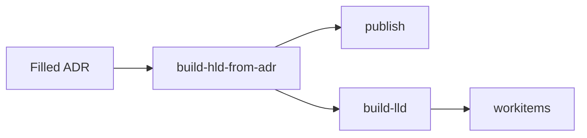

# Arch Design Doc Generator

An architecture decision record goes in. A high-level design, a low-level design, diagrams, PDFs, and sprint work items come out. The same toolkit can collect an OpenShift cluster and write a Health Check report.

## Pick a path

| | Architecture engagement | Health Check |
|---|---|---|
| You have | An ADR | An OpenShift cluster or a must-gather |
| You get | HLD, LLD, diagrams, PDFs, sprint items | A scored report, HTML, and PDF |
| First command | `make setup CLIENT="Example Client" PROJECT="OCP-V"` | `make setup CLIENT="Example Client" PROJECT="HC"` |
| Then | [Six steps](#architecture-engagement) | [Health Check scripts](scripts/health_check/README.md) |

## Architecture engagement

| | Command | You get |
|---|---|---|
| 1 | `make setup CLIENT="Example Client" PROJECT="OCP-V"` | `project.yaml`, working copies, and `ADR/ADR_<client>.md` |
| 2 | Edit the ADR under `ADR/` | The decisions the pipeline reads. Start from `templates/ADR/ADR_template.md` or `templates/ADR/ADR_EXAMPLE.md` |
| 3 | `make build-hld-from-adr` | HLD, LLD, and stamped diagrams in `output/` |
| 4 | `make publish` | Stitched HLD and PDFs |
| 5 | `make build-lld` | Stitched LLD and PDFs |
| 6 | `make workitems` | Sprint items from the LLD |

Setup leaves existing files alone. Pass `FORCE=1` when you mean to replace them. Do not edit `templates/ADR/` for a client engagement.

`make status` shows how far this engagement has gotten. `make help` lists every target. What each command does internally: [Code flow](docs/CODEFLOW.md).

## Health Check

| | Command | You get |
|---|---|---|
| 1 | `make setup CLIENT="..." PROJECT="HC"` | `project.yaml` plus `output/hc_collect` and `output/Health_Check_Report` |
| 2 | `make hc-collect KUBECONFIG=<path>` | Cluster JSON on the host |
| 3 | `make hc-report` | Markdown report and audit JSON |
| 4 | `make hc-html` / `make hc-pdf` | Collapsible HTML and a branded PDF |

A must-gather on a remote support shell uses `hc-push-scripts`, `hc-collect-remote`, and `hc-fetch-results` instead of step 2. Every Health Check target, the report engine, and the knowledge base: [scripts/health_check/README.md](scripts/health_check/README.md).

## Before you run

| You are running | You need |
|---|---|
| `build-hld-from-adr` | `python3`, `pyyaml`, and `cursor-sdk` or the CLI selected with `AI_TOOL` |
| `setup`, `publish`, `build-lld`, `workitems`, `hc-report` | `make`, plus Podman or Docker |
| `hc-collect` | `oc` on the host, and `python3` for categories `10` and `11` |

Podman is used when it is on `PATH`. Set `ENGINE=docker` to force Docker. The pipeline image is `arch-doc-gen`. It builds the first time a container target runs. [What the image contains](docs/ARCHITECTURE.md#container-image).

> **Client data stays on the machine.** `project.yaml`, `slot_map.json`, a filled `ADR/`, `output/`, and kubeconfigs are gitignored. Copy templates; do not commit the filled copies. Run `make install-git-hooks` once so `make check-pii` scans staged files. [What is safe to commit](docs/PROJECT_LAYOUT.md#working-copies-and-secrets).

## Where to read next

| Question | Doc |
|---|---|
| How does a command run? | [Code flow](docs/CODEFLOW.md) |
| Where does this file live? | [Project layout](docs/PROJECT_LAYOUT.md) |
| What are the pieces? | [Architecture](docs/ARCHITECTURE.md) |
| How do I run a Health Check? | [Health Check scripts](scripts/health_check/README.md) |
| Why did a check score that way? | [Check rationale](docs/HC_CHECK_RATIONALE.md) |
| What can I pass to `make`? | [Make variables](docs/CODEFLOW.md#make-variables) |

## License

GNU GPLv3. See [LICENSE](LICENSE).
