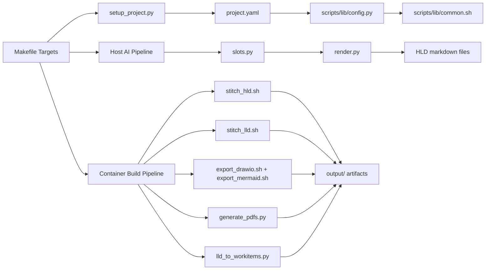
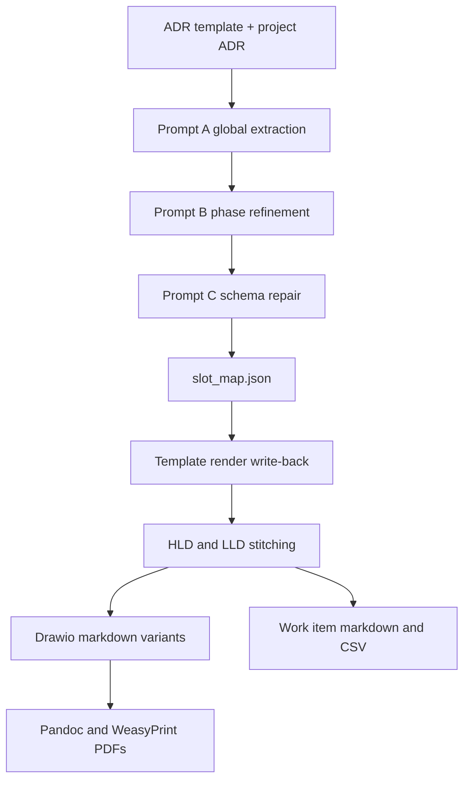

# Arch Design Doc Generator Architecture

## Component Flow

## Data Pipeline

## Runtime Boundaries

| Layer | Runs on | Responsibilities |
|---|---|---|
| Setup | Host + container entrypoint | Generate `project.yaml`, seed project files |
| AI extraction | Host | ADR chunking, slot extraction, deterministic render |
| Build and publish | Container | Stitch markdown, export diagrams, generate PDFs |
| Utilities | Host or container | Diagram sanitization, drawio merge, RVTools conversion |

## Configuration Architecture

- `project.example.yaml` is the template configuration committed to git.
- `make setup CLIENT="..." PROJECT="..."` creates `project.yaml` for a specific engagement.
- `scripts/lib/config.py` is the single configuration adapter used by Python and bash workflows.
- `scripts/lib/common.sh` bridges bash scripts to the same config source.

## Key Dependencies

- **Core runtime:** Python 3, PyYAML, make
- **Containerized build toolchain:** pandoc, weasyprint, draw.io export tooling, mermaid-cli, stitchmd
- **AI path:** Cursor SDK (or compatible CLI path selected via `AI_TOOL`)

## Related Documentation

- [Code Flow](CODEFLOW.md) - execution paths through setup, AI, build, and publishing
- [Project Layout](PROJECT_LAYOUT.md) - directory and file reference for maintainers
