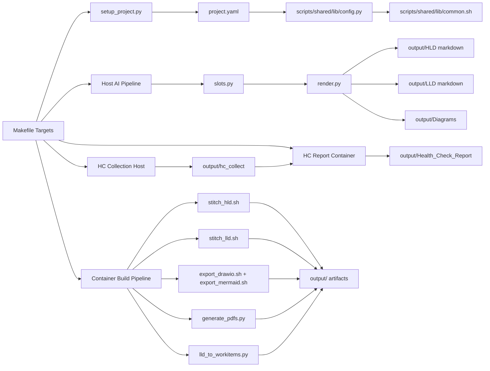
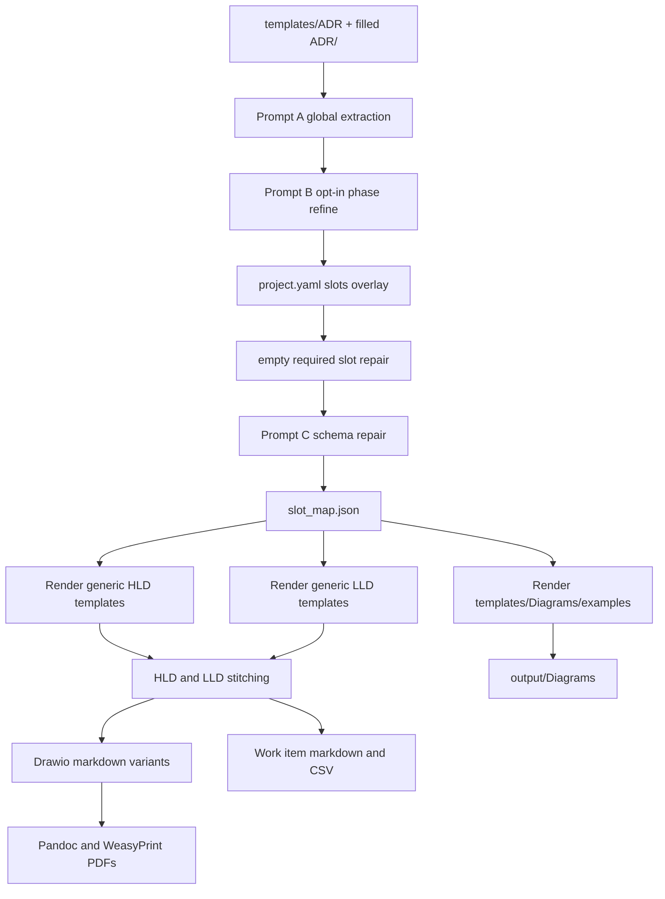
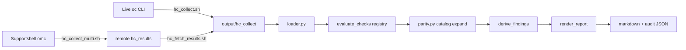

# Arch Design Doc Generator Architecture

## Component Flow

```mermaid
flowchart LR
    Makefile[Makefile Targets] --> Setup[setup_project.py]
    Makefile --> HostAI[Host AI Pipeline]
    Makefile --> ContainerBuild[Container Build Pipeline]
    Makefile --> HcCollect[HC Collection Host]
    Makefile --> HcReport[HC Report Container]

    Setup --> ProjectYaml[project.yaml]
    ProjectYaml --> ConfigPy[scripts/shared/lib/config.py]
    ConfigPy --> BashHelpers[scripts/shared/lib/common.sh]

    HostAI --> SlotExtract[slots.py]
    SlotExtract --> Render[render.py]
    Render --> HldMarkdown[output/HLD markdown]
    Render --> LldMarkdown[output/LLD markdown]
    Render --> StampedDrawio[output/Diagrams]

    ContainerBuild --> StitchHld[stitch_hld.sh]
    ContainerBuild --> StitchLld[stitch_lld.sh]
    ContainerBuild --> ExportDiagrams[export_drawio.sh + export_mermaid.sh]
    ContainerBuild --> GeneratePdfs[generate_pdfs.py]
    ContainerBuild --> Workitems[lld_to_workitems.py]

    StitchHld --> OutputArtifacts[output/ artifacts]
    StitchLld --> OutputArtifacts
    ExportDiagrams --> OutputArtifacts
    GeneratePdfs --> OutputArtifacts
    Workitems --> OutputArtifacts

    HcCollect --> CollectOut[output/hc_collect]
    CollectOut --> HcReport
    HcReport --> HcMarkdown[output/Health_Check_Report]
```

## Data Pipeline

```mermaid
flowchart TD
    AdrInput[templates/ADR + filled ADR/] --> PromptGlobal[Prompt A global extraction]
    PromptGlobal --> PromptPhase[Prompt B opt-in phase refine]
    PromptPhase --> Overlay[project.yaml slots overlay]
    Overlay --> EmptyRepair[empty required slot repair]
    EmptyRepair --> PromptRepair[Prompt C schema repair]
    PromptRepair --> SlotMap[slot_map.json]
    SlotMap --> RenderHld[Render generic HLD templates]
    SlotMap --> RenderLld[Render generic LLD templates]
    SlotMap --> RenderDrawio[Render templates/Diagrams/examples]
    RenderHld --> StitchDocs[HLD and LLD stitching]
    RenderLld --> StitchDocs
    RenderDrawio --> OutputDiagrams[output/Diagrams]
    StitchDocs --> DrawioVariants[Drawio markdown variants]
    DrawioVariants --> Pdfs[Pandoc and WeasyPrint PDFs]
    StitchDocs --> WorkitemsOut[Work item markdown and CSV]
```

## Runtime Boundaries

| Layer | Runs on | Responsibilities |
|---|---|---|
| Setup | Host + container entrypoint | Generate `project.yaml`, copy `templates/` to working copies; refuse overwrite unless `--force` |
| AI extraction | Host | Full-ADR Prompt A (chunked fallback), optional Prompt B, yaml overlay, empty-slot repair, one `slot_map.json`, deterministic HLD, LLD, and drawio render |
| Build and publish | Container | Stitch markdown, export diagrams, generate PDFs |
| Utilities | Host or container | Diagram sanitization, drawio merge, RVTools conversion |
| Health Check collection | Host | Live `oc` / remote `omc` JSON into `output/hc_collect` |
| Health Check report | Container | Deterministic markdown + audit JSON from collected JSON |

## Configuration Architecture

- `project.example.yaml` is the template configuration committed to git.
- `project.yaml` `slots:` overlay binds operator facts after extract; `registry_mirror_policy` can copy `IMAGE_REGISTRY` into an empty `REGISTRY_MIRROR`.
- `templates/` is the canonical generic source for ADR, HLD, LLD, and diagram examples (no client PII). ADR templates are `templates/ADR/`; a filled copy belongs in gitignored `ADR/`.
- Stampable `.drawio` files under `templates/Diagrams/examples/` are a render target of `slot_map.json` and overwrite `output/Diagrams` on every `prepare-hld-ai`.
- `make setup CLIENT="..." PROJECT="..."` creates `project.yaml` and copies templates into working copies. Existing destinations require `FORCE=1`.
- `scripts/shared/lib/config.py` is the single configuration adapter used by Python and bash workflows.
- `scripts/shared/lib/common.sh` bridges bash scripts to the same config source.

## Health Check Collection and Report Engine

```mermaid
flowchart LR
    Live[Live oc CLI] -->|hc_collect.sh| CollectOut[output/hc_collect]
    MG[Supportshell omc] -->|hc_collect_multi.sh| Remote[remote hc_results]
    Remote -->|hc_fetch_results.sh| CollectOut
    CollectOut --> Loader[loader.py]
    Loader --> Evaluate[evaluate_checks registry]
    Evaluate --> Expand[parity.py catalog expand]
    Expand --> Findings[derive_findings]
    Findings --> Renderer[render_report]
    Renderer --> ReportMd[markdown + audit JSON]
```

Collection (host): OpenShift cluster JSON via live `oc` or offline `omc`, loaded by `hc_report.loader.load_results`. Metadata comes from `hc_report.metadata.derive_metadata`.

Report (`make hc-report`, container): `generate_report.py` → `cli.main()` → load results → `evaluate_checks()` (registry of category evaluators; for `extended`/`advisory`, `parity.py` expands catalog rows from TSR HTML and optional CCX runtime) → knowledge-base lookup by `check_id` → `derive_findings()` → `render_report()` fills `{SLOT}` placeholders in `templates/Health_Check/Template_HC_Report.md` → markdown and audit JSON under `output/Health_Check_Report/`. Missing TSR HTML or live Insights data leaves catalog rows SKIPPED (CCX `status_hint` is not applied unless `--ccx-baseline-status`).

AI is excluded from the Health Check path by company policy. Default check profile is `advisory`. PDF/HTML export is deferred.

## Key Dependencies

- **Core runtime:** Python 3, PyYAML, make
- **Containerized build toolchain:** pandoc, weasyprint, draw.io export tooling, mermaid-cli, stitchmd
- **AI path:** Cursor SDK (or compatible CLI path selected via `AI_TOOL`) — HLD/LLD only, never Health Check

## Related Documentation

- [Code Flow](CODEFLOW.md) - execution paths through setup, AI, build, and publishing
- [Project Layout](PROJECT_LAYOUT.md) - directory and file reference for maintainers
