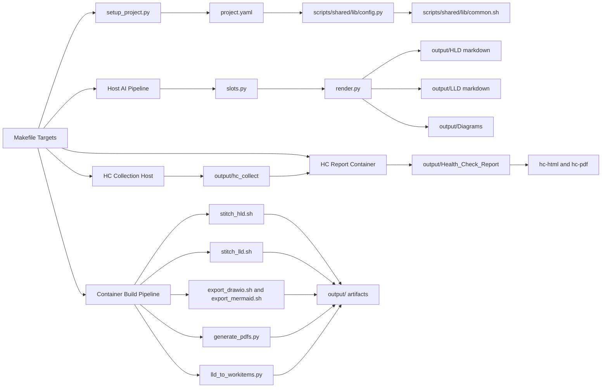
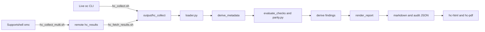

# Arch Design Doc Generator Architecture

## Component Flow

```mermaid
flowchart LR
    Makefile["Makefile Targets"] --> Setup["setup_project.py"]
    Makefile --> HostAI["Host AI Pipeline"]
    Makefile --> ContainerBuild["Container Build Pipeline"]
    Makefile --> HcCollect["HC Collection Host"]
    Makefile --> HcReport["HC Report Container"]

    Setup --> ProjectYaml["project.yaml"]
    ProjectYaml --> ConfigPy["scripts/shared/lib/config.py"]
    ConfigPy --> BashHelpers["scripts/shared/lib/common.sh"]

    HostAI --> SlotExtract["slots.py"]
    SlotExtract --> Render["render.py"]
    Render --> HldMarkdown["output/HLD markdown"]
    Render --> LldMarkdown["output/LLD markdown"]
    Render --> StampedDrawio["output/Diagrams"]

    ContainerBuild --> StitchHld["stitch_hld.sh"]
    ContainerBuild --> StitchLld["stitch_lld.sh"]
    ContainerBuild --> ExportDiagrams["export_drawio.sh and export_mermaid.sh"]
    ContainerBuild --> GeneratePdfs["generate_pdfs.py"]
    ContainerBuild --> Workitems["lld_to_workitems.py"]

    StitchHld --> OutputArtifacts["output/ artifacts"]
    StitchLld --> OutputArtifacts
    ExportDiagrams --> OutputArtifacts
    GeneratePdfs --> OutputArtifacts
    Workitems --> OutputArtifacts

    HcCollect --> CollectOut["output/hc_collect"]
    CollectOut --> HcReport
    HcReport --> HcMarkdown["output/Health_Check_Report"]
    HcMarkdown --> HcExport["hc-html and hc-pdf"]
```

## Data Pipeline

```mermaid
flowchart TD
    AdrInput["templates/ADR plus filled ADR/"] --> PromptGlobal["Prompt A global extraction"]
    PromptGlobal --> PromptPhase["Prompt B opt-in phase refine"]
    PromptPhase --> Overlay["project.yaml slots overlay"]
    Overlay --> EmptyRepair["empty required slot repair"]
    EmptyRepair --> PromptRepair["Prompt C schema repair"]
    PromptRepair --> SlotMap["slot_map.json"]
    SlotMap --> RenderHld["Render generic HLD templates"]
    SlotMap --> RenderLld["Render generic LLD templates"]
    SlotMap --> RenderDrawio["Render templates/Diagrams/examples"]
    RenderHld --> StitchDocs["HLD and LLD stitching"]
    RenderLld --> StitchDocs
    RenderDrawio --> OutputDiagrams["output/Diagrams"]
    StitchDocs --> DrawioVariants["Drawio markdown variants"]
    DrawioVariants --> Pdfs["Pandoc and WeasyPrint PDFs"]
    StitchDocs --> WorkitemsOut["Work item markdown and CSV"]
```

## Runtime Boundaries

| Layer | Runs on | Responsibilities |
|---|---|---|
| Setup | Host + container entrypoint | Generate `project.yaml`, copy `templates/` to working copies; refuse overwrite unless `--force` |
| AI extraction | Host | Full-ADR Prompt A (chunked fallback), optional Prompt B, yaml overlay, empty-slot repair, one `slot_map.json`, deterministic HLD, LLD, and drawio render |
| Build and publish | Container | Stitch markdown, export diagrams, generate PDFs |
| Utilities | Host or container | Diagram sanitization, drawio merge, RVTools conversion |
| Health Check collection | Host | Live `oc` / remote `omc` JSON into `output/hc_collect` |
| Health Check report | Container | Deterministic markdown + audit JSON from collected JSON |
| Health Check export | Container | Collapsible HTML and branded PDF from report markdown |

## Configuration Architecture

- `project.example.yaml` is the template configuration committed to git.
- `project.yaml` `slots:` overlay binds operator facts after extract; `registry_mirror_policy` can copy `IMAGE_REGISTRY` into an empty `REGISTRY_MIRROR`.
- `templates/` is the canonical generic source for ADR, HLD, LLD, and diagram examples (no client PII). ADR templates are `templates/ADR/`; a filled copy belongs in gitignored `ADR/`.
- Stampable `.drawio` files under `templates/Diagrams/examples/` are a render target of `slot_map.json` and overwrite `output/Diagrams` on every `prepare-hld-ai`.
- `make setup CLIENT="..." PROJECT="..."` creates `project.yaml` and copies templates into working copies. Existing destinations require `FORCE=1`.
- `scripts/shared/lib/config.py` is the single configuration adapter used by Python and bash workflows.
- `scripts/shared/lib/common.sh` bridges bash scripts to the same config source.

## Health Check Collection and Report Engine

```mermaid
flowchart LR
    Live["Live oc CLI"] -->|"hc_collect.sh"| CollectOut["output/hc_collect"]
    MG["Supportshell omc"] -->|"hc_collect_multi.sh"| Remote["remote hc_results"]
    Remote -->|"hc_fetch_results.sh"| CollectOut
    CollectOut --> Loader["loader.py"]
    Loader --> Meta["derive_metadata"]
    Meta --> Evaluate["evaluate_checks and parity.py"]
    Evaluate --> Findings["derive findings"]
    Findings --> Renderer["render_report"]
    Renderer --> ReportMd["markdown and audit JSON"]
    ReportMd --> Export["hc-html and hc-pdf"]
```

Collection (host): OpenShift cluster JSON via live `oc` (scripts `03`–`12`) or offline `omc`, loaded by `hc_report.loader.load_results`. Metadata comes from `hc_report.metadata.derive_metadata`. Command-level flow: [CODEFLOW.md](CODEFLOW.md) §6–8.

Report (`make hc-report`, container): `generate_report.py` → `cli.main()` → load results → `derive_metadata()` → `evaluate_checks()` (registry of category evaluators; for `extended`/`advisory`, `parity.py` expands catalog rows from TSR HTML and optional CCX runtime) → knowledge-base lookup by `check_id` → `derive_findings_with_tsr()` (which calls `derive_findings()`) → `render_report()` fills `{SLOT}` placeholders in `templates/Health_Check/Template_HC_Report.md` → markdown and audit JSON under `output/Health_Check_Report/` (per-cluster subdirs when multiple clusters are present). Optional `--omit-check-ids` / `HC_OMIT_CHECK_IDS` filters Chapter 6 findings by check ID and writes `{stem}_pruned.md` (same checks, compacted finding IDs); the original report and audit stay full. Finding derivation omits KB rows with `include_in_findings = false` and merges rows that share `finding_group` into one §6.2 finding; chapter 7 still lists every check. `content_from` aliases inherit canonical recommendation, verification, description, impact, and links at `load_kb()` time. `get_recommendation` joins optional `verification` with a bold `**Verification:**` line inside the Recommendation block (not a heading). See [README Knowledge Base](../README.md#knowledge-base-kb-for-recommendations-and-notes). Missing TSR HTML or live Insights data leaves catalog rows SKIPPED (CCX `status_hint` is not applied unless `--ccx-baseline-status`). Chapter 4 and §6.1 summaries use KB `summary_patterns` (substring match on evidence) then the first FAIL/WARNING reason, never the KB description; unusable text is omitted. §6.2 Observation is the status-count sentence (when tags exist), then KB `summary_patterns` if matched, then the cleaned first FAIL/WARNING reason; each prose block caps at 220; unusable text is omitted. Missing KB recommendation or impact renders `[NEEDS REVIEW]`; `impact = "none"` renders Level of Impact None; category fallback recs are not used. KB `description` states what the check evaluates (mode-neutral; valid without TSR); `recommendation` lists known failure classes as examples rather than asserting a single cluster's TSR remainder. TSR Result HTML is not sliced at 2000 characters (`_EVIDENCE_ABSURD_LIMIT` is a 1_000_000-byte guard only). Parsed TSR Result evidence condenses PASS host groups (`GROUP::>ALL NODES:` when every host is ok; mixed groups use `PASS NODES`) and inventory dumps (dot tables, NFS nconnect, node WARNING clones, unhealthy pods) before the 32_000-character clip. KB `finding_on_info` (default false) promotes INFO checks to P3 findings. Chapter 7 Check column and §6.2 finding titles prefer KB `title` when set. `parity.py` keeps TSR FAIL/WARNING catalog rows beside a native check that already uses the same normalized title (native CSI heading is `StorageClass provisioners (engine)`).

AI is excluded from Health Check **evaluation** by company policy. Optional `HC_SUMMARY_CONCLUSION=1` drafts Chapter 3 and Chapter 8 after generate. Default check profile is `advisory`. HTML and PDF are follow-on container commands (`make hc-html`, `make hc-pdf`) that use `scripts/shared/rendering/hc_export_paths.py`. With `REPORT` unset they discover all report markdown (preferring `{stem}_pruned.md` when present) and map each source to a unique path under `HTML/` or `PDFs/`; cluster subdirectories are preserved so the same basename in two cluster dirs does not overwrite. Optional `REPORT=path.md` exports that exact file (loud warning if a pruned sibling exists; out-of-tree sources map by basename with a location warning; overwriting an existing basename dest needs TTY yes or `FORCE=1`). Then pandoc plus `html_collapsible.py` or `pdf_preprocess.py` and weasyprint. Cover-meta colgroups at 42%/58% apply only on that HTML/PDF path.

Consultant per-check rationale lives in `docs/HC_CHECK_RATIONALE.md` (ratification log: `docs/HC_CHECK_RATIFICATION_LOG.md`). Operator runbooks are stitchmd fragments under `scripts/health_check/docs/`; `make hc-docs` regenerates `collect/README.md` and `supportshell/README.md`. `make hc-report-from-supportshell` fetches remote results then runs `hc-report`. `make check-hc-sync` diffs shared collect/supportshell scripts 03–09. `make hc-link-apply` writes accepted review `REPLACE` URLs into KB `[checks.links]`.

## Key Dependencies

- **Core runtime:** Python 3, PyYAML, make
- **Containerized build toolchain:** pandoc, weasyprint, draw.io export tooling, mermaid-cli, stitchmd
- **AI path:** Cursor SDK (or compatible CLI path selected via `AI_TOOL`) — HLD/LLD extraction, and optional Health Check Chapter 3/8 drafting only (never check evaluation)

## Related Documentation

- [Code Flow](CODEFLOW.md) - execution paths through setup, AI, build, publishing, and Health Check (§6–8)
- [Project Layout](PROJECT_LAYOUT.md) - directory and file reference for maintainers
