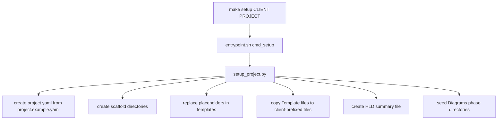
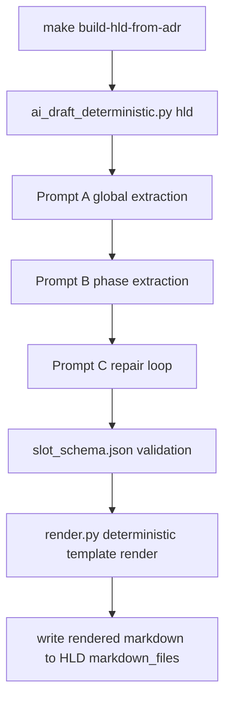
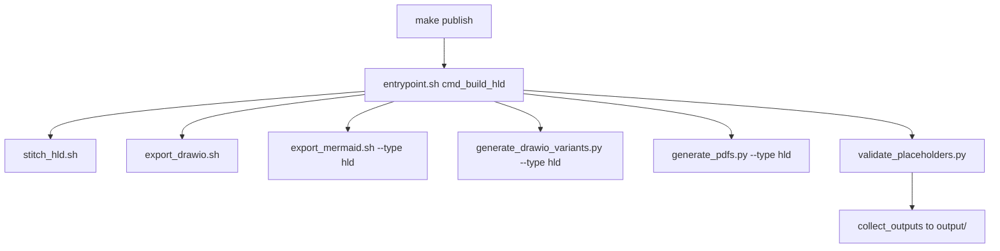
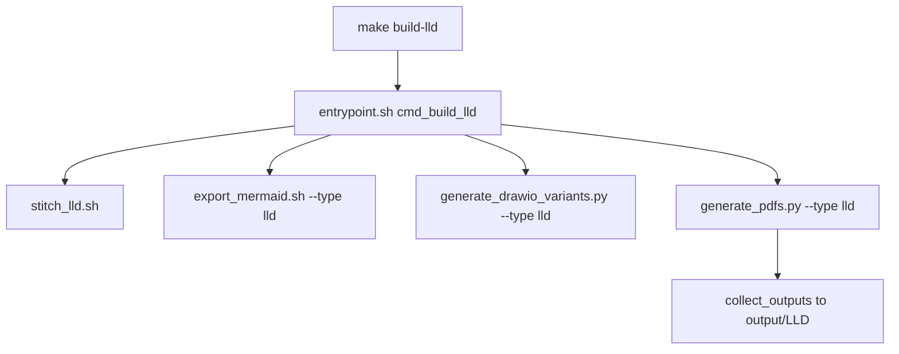
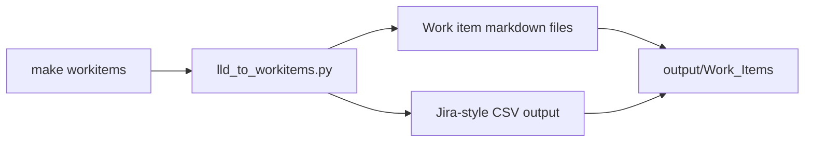

# Arch Design Doc Generator Code Flow

## Table of Contents

1. Setup and project bootstrap
2. HLD AI preparation (`make build-hld-from-adr`)
3. HLD publish pipeline (`make publish`)
4. LLD + work item pipeline (`make build-lld`, `make workitems`)
5. Host vs container execution

---

## 1) Setup and Project Bootstrap

`make setup CLIENT="Example Client" PROJECT="OCP-V"` routes through the container entrypoint and executes `scripts/setup_project.py`.

Key flow details:
- `create_project_yaml()` injects `CLIENT` and `PROJECT` code into generated config.
- `rename_templates()` produces client-specific working copies from `Template_*` files.
- `seed_diagrams()` copies canonical examples into phase folders for editing.

---

## 2) HLD AI Preparation (`make build-hld-from-adr`)

`make build-hld-from-adr` is an alias for `prepare-hld-ai`, which runs `scripts/ai/ai_draft_deterministic.py`.

Data artifacts produced:
- `output/.deterministic/slots/slot_map.json`
- `output/drafts_deterministic/*`
- Updated client HLD markdown files used by downstream publish targets

---

## 3) HLD Publish Pipeline (`make publish`)

`make publish` executes container target `build hld` via `entrypoint.sh`.

The publish stage generates:
- stitched HLD markdown
- Drawio markdown variants
- HLD diagram PNGs
- HLD PDFs

---

## 4) LLD and Work Item Pipeline

### LLD Build (`make build-lld`)

### Work Items (`make workitems`)

---

## 5) Host vs Container Execution

| Command Family | Runtime | Primary scripts |
|---|---|---|
| `setup`, `publish`, `build-lld`, `build`, `workitems` | Container (`entrypoint.sh`) | `scripts/build/*`, `scripts/tools/lld_to_workitems.py` |
| `build-hld-from-adr`, `prepare-hld-ai`, `validate-slots` | Host | `scripts/ai/ai_draft_deterministic.py`, `scripts/ai/deterministic/*` |
| Utility targets (`sanitize-diagrams`, `combine-drawio`, `sample-schedule`) | Host | `scripts/tools/*` |

Operational note:
- Heavy binary dependencies stay containerized.
- AI credentials remain on the host path.
- `output/` is the canonical artifact destination for publishable deliverables.
