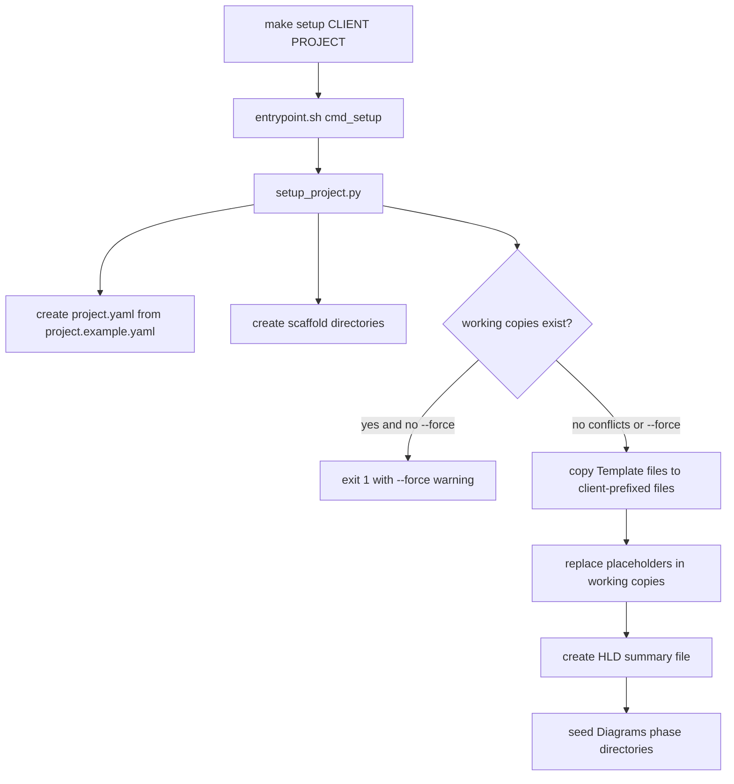
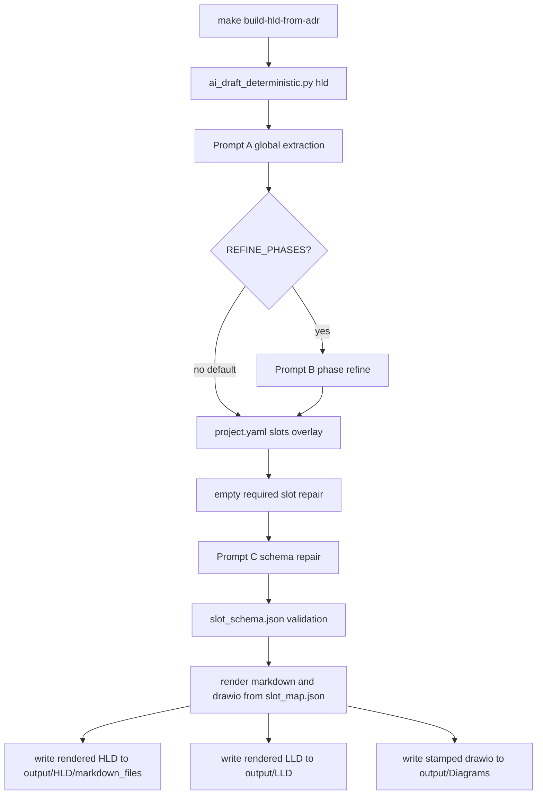
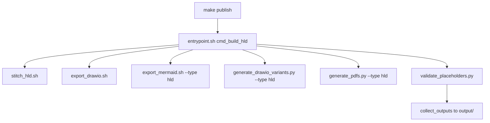
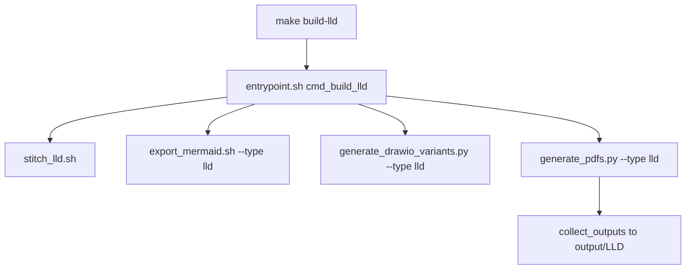
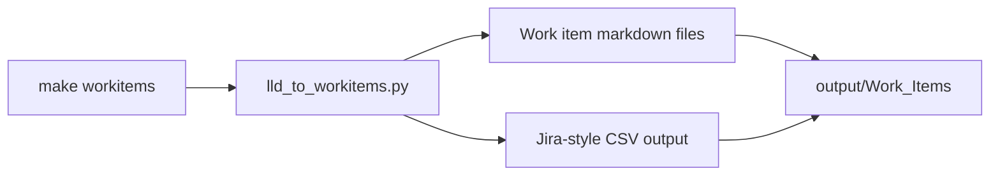
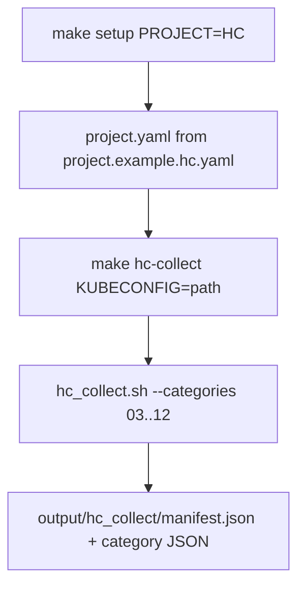
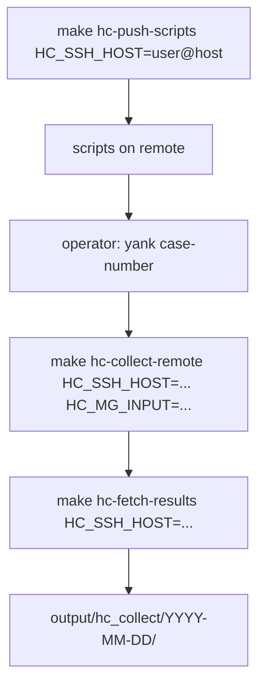
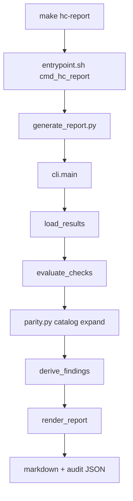

# Arch Design Doc Generator Code Flow

## Table of Contents

1. Setup and project bootstrap
2. HLD AI preparation (`make build-hld-from-adr`)
3. HLD publish pipeline (`make publish`)
4. LLD + work item pipeline (`make build-lld`, `make workitems`, `make lld-closeness`)
5. Host vs container execution
6. Health Check collection (host)
7. Health Check report engine (container)

---

## 1) Setup and Project Bootstrap

`make setup CLIENT="Example Client" PROJECT="OCP-V"` routes through the container entrypoint and executes `scripts/setup_project.py`. Generic sources live under `templates/` and are copied into `output/` (HLD/LLD) and gitignored `ADR/` (engagement ADR from `templates/ADR/ADR_template.md`). Existing working copies are **not** overwritten unless `FORCE=1` (`--force`).


```mermaid
flowchart TD
    MakeSetup[make setup CLIENT PROJECT] --> Entrypoint[entrypoint.sh cmd_setup]
    Entrypoint --> SetupPy[setup_project.py]
    SetupPy --> CreateYaml[create project.yaml from project.example.yaml]
    SetupPy --> Scaffold[create scaffold directories]
    SetupPy --> ConflictCheck{working copies exist?}
    ConflictCheck -->|yes and no --force| Refuse[exit 1 with --force warning]
    ConflictCheck -->|no conflicts or --force| CopyTemplates[copy Template files to client-prefixed files]
    CopyTemplates --> ReplaceTokens[replace placeholders in working copies]
    ReplaceTokens --> SummaryFile[create HLD summary file]
    SummaryFile --> SeedDiagrams[seed Diagrams phase directories]
```

Key flow details:
- `create_project_yaml()` injects `CLIENT` and `PROJECT` code into generated config.
- `collect_working_copy_conflicts()` lists existing destinations; without `--force`, setup exits 1 and leaves files unchanged.
- `rename_templates()` copies `templates/` `Template_*` files to client-prefixed working copies (`FORCE=1` overwrites).
- `seed_diagrams()` copies canonical examples into phase folders for editing.

---

## 2) HLD AI Preparation (`make build-hld-from-adr`)

`make build-hld-from-adr` is an alias for `prepare-hld-ai`, which runs `scripts/hld_lld/ai/ai_draft_deterministic.py`. Default Prompt A is one chunk over the full ADR (`ADR_MODE=auto`, `AI_TIMEOUT` 900s). On timeout or unparseable JSON it retries once with 8×12k chunks (`ADR_MODE=chunked` forces that path). Prompt B (per-phase refine) does not run unless `REFINE_PHASES=1`. After extract, non-empty `project.yaml` `slots:` values overlay the map; empty overlay keys do not wipe extract. One empty-required-slot repair call runs next, then Prompt C schema repair. Extraction is skipped when the input fingerprint is unchanged (ADR, `project.yaml`, slot schema, extract prompts, HLD placeholder set, `adr_mode`, and refine flag). A fingerprint-fresh skip still applies overlay and re-renders. A stale or missing map re-extracts (this calls the model; typically several minutes). `FORCE=1` re-extracts even when inputs are unchanged. The same map renders generic HLD templates into `output/HLD/markdown_files/`, always re-renders generic LLD templates into `output/LLD/` (setup copies are unfilled), and overwrites stampable `.drawio` files into `output/Diagrams`. Shell sequences such as `${CLUSTER}` are left untouched; empty slots render as `{TBD}`. GNU make does not accept `--force`; re-extract with `FORCE=1` or `make build-hld-from-adr force`.


```mermaid
flowchart TD
    BuildHldFromAdr[make build-hld-from-adr] --> AiDraft[ai_draft_deterministic.py hld]
    AiDraft --> PromptA[Prompt A global extraction]
    PromptA --> PromptB{REFINE_PHASES?}
    PromptB -->|yes| PhaseRefine[Prompt B phase refine]
    PromptB -->|no default| Overlay[project.yaml slots overlay]
    PhaseRefine --> Overlay
    Overlay --> EmptyRepair[empty required slot repair]
    EmptyRepair --> PromptC[Prompt C schema repair]
    PromptC --> SlotSchema[slot_schema.json validation]
    SlotSchema --> Render[render markdown and drawio from slot_map.json]
    Render --> WriteBackHld[write rendered HLD to output/HLD/markdown_files]
    Render --> WriteBackLld[write rendered LLD to output/LLD]
    Render --> WriteBackDrawio[write stamped drawio to output/Diagrams]
```

Data artifacts produced:
- `output/.deterministic/slots/slot_map.json`
- `output/.deterministic/slots/slot_map.fingerprint.json`
- `output/drafts_deterministic/*`
- Rendered HLD markdown used by `make publish`
- Rendered LLD markdown used by `make build-lld` and `make lld-closeness`
- Stamped diagrams in `output/Diagrams` (phase folders when the filename prefix matches)

---

## 3) HLD Publish Pipeline (`make publish`)

`make publish` executes container target `build hld` via `entrypoint.sh`.


```mermaid
flowchart TD
    Publish[make publish] --> BuildHldCmd[entrypoint.sh cmd_build_hld]
    BuildHldCmd --> StitchHld[stitch_hld.sh]
    BuildHldCmd --> ExportDrawio[export_drawio.sh]
    BuildHldCmd --> ExportMermaid[export_mermaid.sh --type hld]
    BuildHldCmd --> DrawioVariants[generate_drawio_variants.py --type hld]
    BuildHldCmd --> PdfHld[generate_pdfs.py --type hld]
    BuildHldCmd --> ValidateTokens[validate_placeholders.py]
    ValidateTokens --> CollectOutputs[collect_outputs to output/]
```

The publish stage generates:
- stitched HLD markdown
- Drawio markdown variants
- HLD diagram PNGs
- HLD PDFs

---

## 4) LLD and Work Item Pipeline

### LLD Build (`make build-lld`)


```mermaid
flowchart TD
    BuildLld[make build-lld] --> BuildLldCmd[entrypoint.sh cmd_build_lld]
    BuildLldCmd --> StitchLld[stitch_lld.sh]
    BuildLldCmd --> ExportMermaidLld[export_mermaid.sh --type lld]
    BuildLldCmd --> DrawioVariantsLld[generate_drawio_variants.py --type lld]
    BuildLldCmd --> PdfLld[generate_pdfs.py --type lld]
    PdfLld --> CollectLldOutputs[collect_outputs to output/LLD]
```

### Work Items (`make workitems`)


```mermaid
flowchart LR
    Workitems[make workitems] --> LldParser[lld_to_workitems.py]
    LldParser --> MarkdownItems[Work item markdown files]
    LldParser --> CsvItems[Jira-style CSV output]
    MarkdownItems --> OutputDir[output/Work_Items]
    CsvItems --> OutputDir
```

### LLD closeness (`make lld-closeness`)

After `prepare-hld-ai` has filled `output/LLD`, compare against a canonical fixture directory (not a CI gate):

```bash
make lld-closeness CANONICAL=/path/to/canonical/LLD
```

The report writes `tmp/lld_closeness.md`. Default rendered dir is `output/LLD`.

---

## 5) Host vs Container Execution

| Command Family | Runtime | Primary scripts |
|---|---|---|
| `setup`, `publish`, `build-lld`, `build`, `workitems` | Container (`entrypoint.sh`) | `scripts/hld_lld/build/*`, `scripts/hld_lld/lld_to_workitems.py` |
| `build-hld-from-adr`, `prepare-hld-ai`, `validate-slots` | Host | `scripts/hld_lld/ai/ai_draft_deterministic.py`, `scripts/hld_lld/ai/deterministic/*` |
| `lld-closeness` | Host | `scripts/hld_lld/report_lld_closeness.py` |
| `hc-collect`, `hc-push-scripts`, `hc-collect-remote`, `hc-fetch-results`, `hc-merge`, `hc-skip-summary`, `hc-command-ref`, `check-hc-sync` | Host | `scripts/health_check/collect/*`, `scripts/health_check/supportshell/*` |
| `hc-report-from-supportshell` | Host fetch, then container report | `hc-fetch-results` then `hc-report` with `HC_COLLECT_OUT=$(HC_FETCH_STAGE)` |
| `hc-report`, `hc-investigate` | Container (`entrypoint.sh`) | `scripts/health_check/generate_report.py`, `scripts/health_check/hc_investigate.py` |
| `hc-html`, `hc-pdf` | Container (`entrypoint.sh`) | `scripts/shared/rendering/html_collapsible.py`, `pdf_preprocess.py` |
| `hc-docs` | Container (stitchmd) | `scripts/health_check/docs/` fragments → collect/supportshell READMEs |
| `hc-build-catalog` | Host | `scripts/health_check/hc_report/build_crosswalk_catalog.py` |
| `hc-link-review` | Container (`curl_cffi`) | `scripts/health_check/hc_link_review.py` |
| `hc-link-apply` | Host | `scripts/health_check/hc_link_apply.py` |
| Utility targets (`sanitize-diagrams`, `combine-drawio`, `sample-schedule`, `check-annotations`, `package`) | Host | `scripts/shared/tools/*`, `scripts/rvtools/*`, `scripts/hld_lld/build/check_annotations.py` |

Operational note:
- Heavy binary dependencies stay containerized.
- AI credentials remain on the host path.
- `output/` is the canonical artifact destination for publishable deliverables.

---

## 6) Health Check Collection (host)

`make setup CLIENT="..." PROJECT="HC"` creates `project.yaml` from `project.example.hc.yaml` and scaffolds `output/hc_collect` + `output/Health_Check_Report`. No HLD/LLD templates are copied.

### Live cluster path


```mermaid
flowchart TD
    SetupHC[make setup PROJECT=HC] --> ProjectYaml[project.yaml from project.example.hc.yaml]
    ProjectYaml --> Collect[make hc-collect KUBECONFIG=path]
    Collect --> HcCollectSh[hc_collect.sh --categories 03..12]
    HcCollectSh --> Output[output/hc_collect/manifest.json + category JSON]
```

### Supportshell / must-gather path


```mermaid
flowchart TD
    Push[make hc-push-scripts HC_SSH_HOST=user@host] --> Remote[scripts on remote]
    Remote --> Yank[operator: yank case-number]
    Yank --> CollectRemote[make hc-collect-remote HC_SSH_HOST=... HC_MG_INPUT=...]
    CollectRemote --> FetchResults[make hc-fetch-results HC_SSH_HOST=...]
    FetchResults --> Staged[output/hc_collect/YYYY-MM-DD/]
```

### Host merge

```bash
make hc-merge MERGE_INPUTS="output/hc_collect/2026-08-01 output/hc_collect/2026-08-05"
```

Runs `hc_merge.py` on the host (no container). Prefers real JSON over `_hc_error` stubs; unions Kubernetes List items by `metadata.uid`.

AI is not used for health check (company policy).

---

## 7) Health Check report engine (container)

`make hc-report` requires collected JSON under `output/hc_collect` (or `HC_COLLECT_OUT`). It runs in the toolkit container via `entrypoint.sh cmd_hc_report`.


```mermaid
flowchart TD
    MakeReport[make hc-report] --> Entrypoint[entrypoint.sh cmd_hc_report]
    Entrypoint --> Generate[generate_report.py]
    Generate --> CliMain[cli.main]
    CliMain --> Load[load_results]
    Load --> Evaluate[evaluate_checks]
    Evaluate --> Expand[parity.py catalog expand]
    Expand --> Findings[derive_findings]
    Findings --> Render[render_report]
    Render --> Write[markdown + audit JSON]
```

Key flow details:
- Default `HC_CHECK_PROFILE` is `advisory`. `evaluate_checks` expands TSR/CCX catalog rows via `parity.py`. Place exports under `output/tsr_html/` (or set `HC_TSR_HTML`); discovery matches cluster id, then cluster name. Missing HTML or Insights data → SKIPPED.
- Report prose comes from `hc_report/kb/` via `kb_loader.py` (`content_from` aliases inherit canonical recommendation, description, impact, and links). See [README Knowledge Base](../README.md#knowledge-base-kb-for-recommendations-and-notes).
- `HC_CHECK_PROFILE=core` runs the deterministic evaluator registry only.
- Template: `templates/Health_Check/Template_HC_Report.md`.
- Outputs: markdown report and `*_audit_*.json` under `output/Health_Check_Report/`.
- `make hc-build-catalog TSR_HTML=<path>` rebuilds `scripts/health_check/hc_report/catalogs/tsr_ccx_crosswalk.json` on the host.
- `make hc-investigate RESULTS_DIR=… FINDING_ID=…` re-runs load/evaluate/findings and prints the matching raw JSON evidence (container). `CHECK_ID=` / `QUERY=` also work.
- `make hc-skip-summary LEDGER=…` and `make hc-command-ref` run on the host.

`make hc-html` converts report markdown via pandoc and `scripts/shared/rendering/html_collapsible.py` (collapsible `<details>` sections, Chapter 6↔7 cross-links). Output: `output/Health_Check_Report/HTML/`, preserving any cluster subdirectory. `make hc-pdf` runs pandoc, `scripts/shared/rendering/pdf_preprocess.py`, and weasyprint. Output: `output/Health_Check_Report/PDFs/`, preserving any cluster subdirectory. The same basename in two cluster dirs does not overwrite. Both require existing report markdown and exit non-zero without it.
