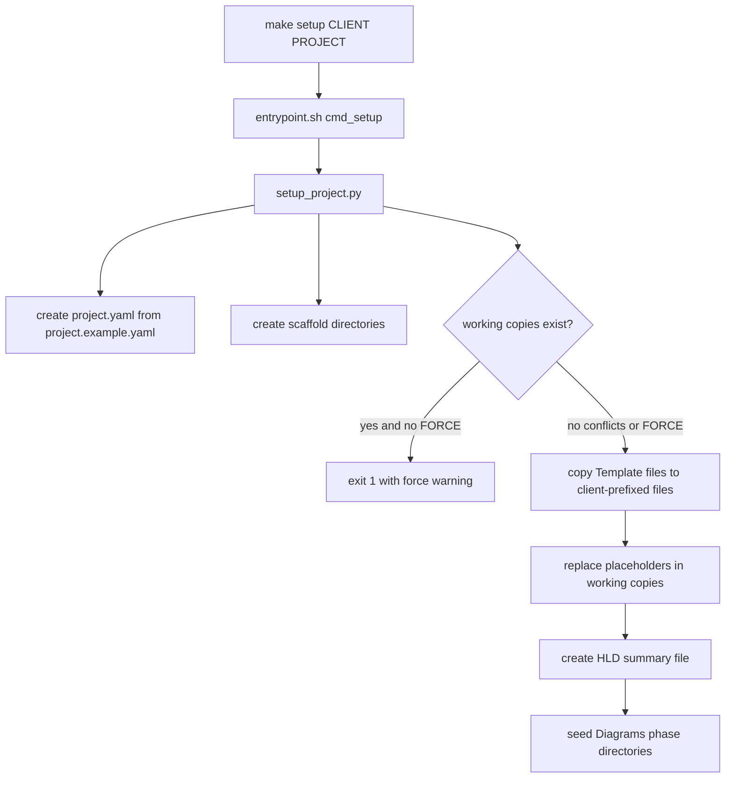
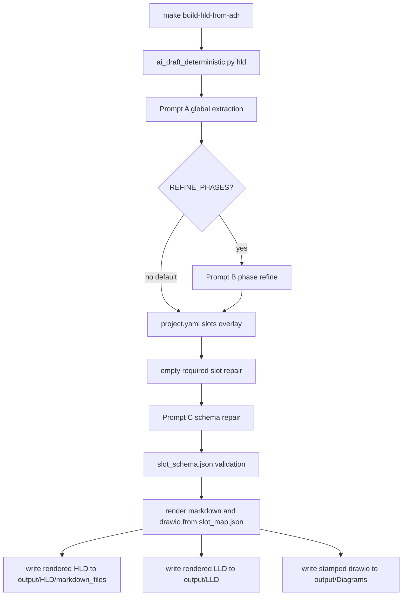
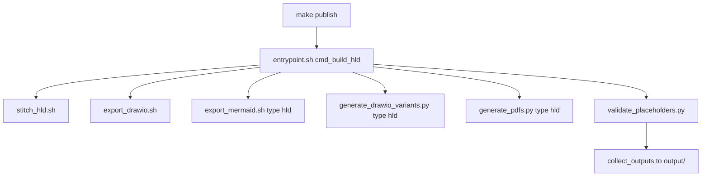
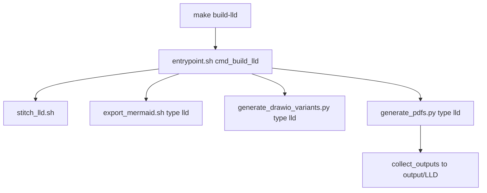
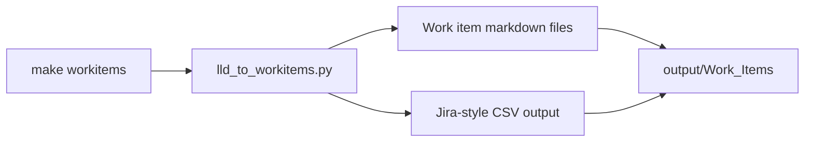
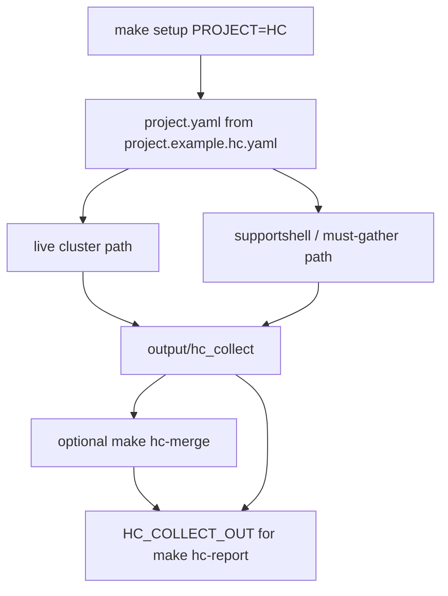
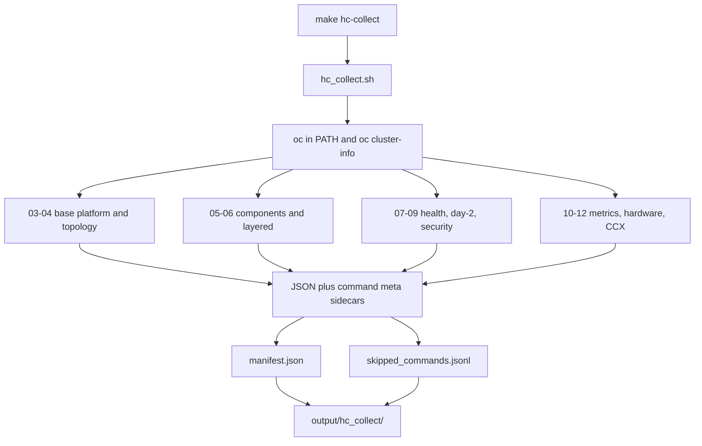
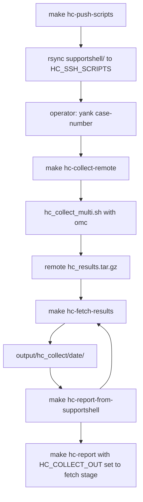
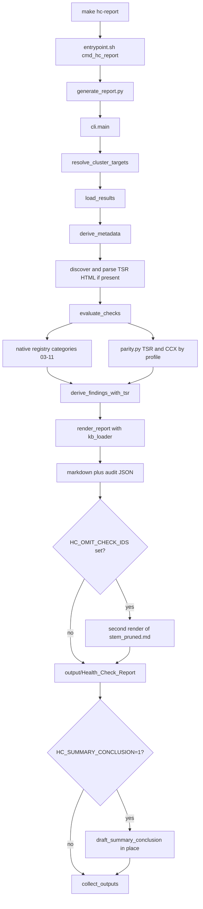
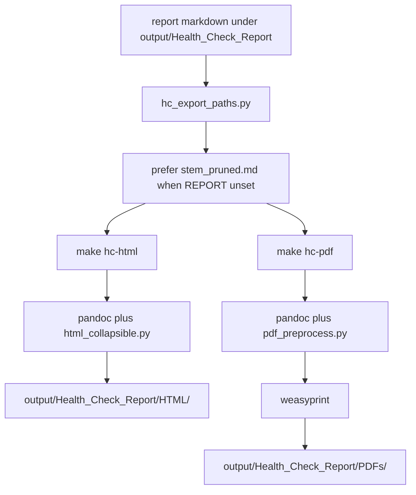

# Arch Design Doc Generator Code Flow

## Table of Contents

1. Setup and project bootstrap
2. HLD AI preparation (`make build-hld-from-adr`)
3. HLD publish pipeline (`make publish`)
4. LLD + work item pipeline (`make build-lld`, `make workitems`, `make lld-closeness`)
5. Host vs container execution
6. Health Check collection (host)
7. Health Check report engine (container)
8. Health Check export and consultant follow-ons

---

## 1) Setup and Project Bootstrap

`make setup CLIENT="Example Client" PROJECT="OCP-V"` routes through the container entrypoint and executes `scripts/setup_project.py`. Generic sources live under `templates/` and are copied into `output/` (HLD/LLD) and gitignored `ADR/` (engagement ADR from `templates/ADR/ADR_template.md`). Existing working copies are **not** overwritten unless `FORCE=1` (`--force`).


```mermaid
flowchart TD
    MakeSetup["make setup CLIENT PROJECT"] --> Entrypoint["entrypoint.sh cmd_setup"]
    Entrypoint --> SetupPy["setup_project.py"]
    SetupPy --> CreateYaml["create project.yaml from project.example.yaml"]
    SetupPy --> Scaffold["create scaffold directories"]
    SetupPy --> ConflictCheck{"working copies exist?"}
    ConflictCheck -->|"yes and no FORCE"| Refuse["exit 1 with force warning"]
    ConflictCheck -->|"no conflicts or FORCE"| CopyTemplates["copy Template files to client-prefixed files"]
    CopyTemplates --> ReplaceTokens["replace placeholders in working copies"]
    ReplaceTokens --> SummaryFile["create HLD summary file"]
    SummaryFile --> SeedDiagrams["seed Diagrams phase directories"]
```

Key flow details:
- `create_project_yaml()` injects `CLIENT` and `PROJECT` code into generated config.
- `collect_working_copy_conflicts()` lists existing destinations; without `--force`, setup exits 1 and leaves files unchanged.
- `rename_templates()` copies `templates/` `Template_*` files to client-prefixed working copies (`FORCE=1` overwrites).
- `seed_diagrams()` copies canonical examples into phase folders for editing.
- `PROJECT="HC"` uses `project.example.hc.yaml` and scaffolds Health Check dirs only (no HLD/LLD template copy). See section 6.

---

## 2) HLD AI Preparation (`make build-hld-from-adr`)

`make build-hld-from-adr` is an alias for `prepare-hld-ai`, which runs `scripts/hld_lld/ai/ai_draft_deterministic.py`. Default Prompt A is one chunk over the full ADR (`ADR_MODE=auto`, `AI_TIMEOUT` 900s). On timeout or unparseable JSON it retries once with 8×12k chunks (`ADR_MODE=chunked` forces that path). Prompt B (per-phase refine) does not run unless `REFINE_PHASES=1`. After extract, non-empty `project.yaml` `slots:` values overlay the map; empty overlay keys do not wipe extract. One empty-required-slot repair call runs next, then Prompt C schema repair. Extraction is skipped when the input fingerprint is unchanged (ADR, `project.yaml`, slot schema, extract prompts, HLD placeholder set, `adr_mode`, and refine flag). A fingerprint-fresh skip still applies overlay and re-renders. A stale or missing map re-extracts (this calls the model; typically several minutes). `FORCE=1` re-extracts even when inputs are unchanged. The same map renders generic HLD templates into `output/HLD/markdown_files/`, always re-renders generic LLD templates into `output/LLD/` (setup copies are unfilled), and overwrites stampable `.drawio` files into `output/Diagrams`. Shell sequences such as `${CLUSTER}` are left untouched; empty slots render as `{TBD}`. GNU make does not accept `--force`; re-extract with `FORCE=1` or `make build-hld-from-adr force`.


```mermaid
flowchart TD
    BuildHldFromAdr["make build-hld-from-adr"] --> AiDraft["ai_draft_deterministic.py hld"]
    AiDraft --> PromptA["Prompt A global extraction"]
    PromptA --> PromptB{"REFINE_PHASES?"}
    PromptB -->|"yes"| PhaseRefine["Prompt B phase refine"]
    PromptB -->|"no default"| Overlay["project.yaml slots overlay"]
    PhaseRefine --> Overlay
    Overlay --> EmptyRepair["empty required slot repair"]
    EmptyRepair --> PromptC["Prompt C schema repair"]
    PromptC --> SlotSchema["slot_schema.json validation"]
    SlotSchema --> Render["render markdown and drawio from slot_map.json"]
    Render --> WriteBackHld["write rendered HLD to output/HLD/markdown_files"]
    Render --> WriteBackLld["write rendered LLD to output/LLD"]
    Render --> WriteBackDrawio["write stamped drawio to output/Diagrams"]
```

Data artifacts produced:
- `output/.deterministic/slots/slot_map.json`
- `output/.deterministic/slots/slot_map.fingerprint.json`
- `output/drafts_deterministic/*`
- Rendered HLD markdown used by `make publish`
- Rendered LLD markdown used by `make build-lld` and `make lld-closeness`
- Stamped diagrams in `output/Diagrams` (phase folders when the filename prefix matches)

---

## 3) HLD Publish Pipeline (`make publish`)

`make publish` executes container target `build hld` via `entrypoint.sh`.


```mermaid
flowchart TD
    Publish["make publish"] --> BuildHldCmd["entrypoint.sh cmd_build_hld"]
    BuildHldCmd --> StitchHld["stitch_hld.sh"]
    BuildHldCmd --> ExportDrawio["export_drawio.sh"]
    BuildHldCmd --> ExportMermaid["export_mermaid.sh type hld"]
    BuildHldCmd --> DrawioVariants["generate_drawio_variants.py type hld"]
    BuildHldCmd --> PdfHld["generate_pdfs.py type hld"]
    BuildHldCmd --> ValidateTokens["validate_placeholders.py"]
    ValidateTokens --> CollectOutputs["collect_outputs to output/"]
```

The publish stage generates:
- stitched HLD markdown
- Drawio markdown variants
- HLD diagram PNGs
- HLD PDFs

---

## 4) LLD and Work Item Pipeline

### LLD Build (`make build-lld`)


```mermaid
flowchart TD
    BuildLld["make build-lld"] --> BuildLldCmd["entrypoint.sh cmd_build_lld"]
    BuildLldCmd --> StitchLld["stitch_lld.sh"]
    BuildLldCmd --> ExportMermaidLld["export_mermaid.sh type lld"]
    BuildLldCmd --> DrawioVariantsLld["generate_drawio_variants.py type lld"]
    BuildLldCmd --> PdfLld["generate_pdfs.py type lld"]
    PdfLld --> CollectLldOutputs["collect_outputs to output/LLD"]
```

### Work Items (`make workitems`)


```mermaid
flowchart LR
    Workitems["make workitems"] --> LldParser["lld_to_workitems.py"]
    LldParser --> MarkdownItems["Work item markdown files"]
    LldParser --> CsvItems["Jira-style CSV output"]
    MarkdownItems --> OutputDir["output/Work_Items"]
    CsvItems --> OutputDir
```

HLD/LLD work items come from rendered LLD. For Health Check, `make workitems` parses the execution guide under `output/Health_Check_LLD/` (see `scripts/health_check/docs/sections/shared_work_items.md`).

### LLD closeness (`make lld-closeness`)

After `prepare-hld-ai` has filled `output/LLD`, compare against a canonical fixture directory (not a CI gate):

```bash
make lld-closeness CANONICAL=/path/to/canonical/LLD
```

The report writes `tmp/lld_closeness.md`. Default rendered dir is `output/LLD`.

---

## 5) Host vs Container Execution

| Command Family | Runtime | Primary scripts |
|---|---|---|
| `setup`, `publish`, `build-lld`, `build`, `workitems` | Container (`entrypoint.sh`) | `scripts/hld_lld/build/*`, `scripts/hld_lld/lld_to_workitems.py` |
| `build-hld-from-adr`, `prepare-hld-ai`, `validate-slots` | Host | `scripts/hld_lld/ai/ai_draft_deterministic.py`, `scripts/hld_lld/ai/deterministic/*` |
| `lld-closeness` | Host | `scripts/hld_lld/report_lld_closeness.py` |
| `hc-collect`, `hc-push-scripts`, `hc-collect-remote`, `hc-fetch-results`, `hc-merge`, `check-hc-sync` | Host | `scripts/health_check/collect/*`, `scripts/health_check/supportshell/*` |
| `hc-skip-summary` | Host | `scripts/health_check/hc_skip_summary.py` |
| `hc-command-ref` | Host | `scripts/health_check/generate_command_reference.py` |
| `clean-hc` | Host | removes `output/hc_collect` and `output/Health_Check_Report` |
| `hc-report-from-supportshell` | Host fetch, then container report | `hc-fetch-results` then `hc-report` with `HC_COLLECT_OUT=$(HC_FETCH_STAGE)` |
| `hc-report`, `hc-investigate` | Container (`entrypoint.sh`) | `scripts/health_check/generate_report.py`, `scripts/health_check/hc_investigate.py` |
| `hc-summary-conclusion` | Container (`entrypoint.sh`) | `scripts/health_check/draft_summary_conclusion.py` |
| `hc-update-loi` | Host | `scripts/health_check/update_finding_loi.py` |
| `hc-renumber-findings` | Host | `scripts/health_check/renumber_finding_sections.py` |
| `hc-html`, `hc-pdf` | Container (`entrypoint.sh`) | `scripts/shared/rendering/hc_export_paths.py`, `html_collapsible.py`, `pdf_preprocess.py` |
| `hc-docs` | Container (stitchmd) | `scripts/health_check/docs/` fragments → collect/supportshell READMEs |
| `hc-build-catalog` | Host | `scripts/health_check/hc_report/build_crosswalk_catalog.py` |
| `hc-link-review` | Container (`curl_cffi`) | `scripts/health_check/hc_link_review.py` |
| `hc-link-apply` | Host | `scripts/health_check/hc_link_apply.py` |
| Utility targets (`sanitize-diagrams`, `combine-drawio`, `sample-schedule`, `check-annotations`, `package`) | Host | `scripts/shared/tools/*`, `scripts/rvtools/*`, `scripts/hld_lld/build/check_annotations.py` |

Operational note:
- Heavy binary dependencies stay containerized.
- AI credentials remain on the host path.
- `output/` is the canonical artifact destination for publishable deliverables.
- Health Check **evaluation** never uses AI (company policy). Optional Chapter 3/8 drafting is the only AI step on that pipeline.

---

## 6) Health Check Collection (host)

Health Check is a separate product path from HLD/LLD. Collection always runs on the host (live `oc` or remote `omc`). The report engine in section 7 consumes the JSON tree under `output/hc_collect` (or `HC_COLLECT_OUT`).

`make setup CLIENT="..." PROJECT="HC"` creates `project.yaml` from `project.example.hc.yaml` and scaffolds `output/hc_collect` + `output/Health_Check_Report`. No HLD/LLD templates are copied. `hc-report` fails closed if `project.yaml` is missing.


```mermaid
flowchart TD
    SetupHC["make setup PROJECT=HC"] --> ProjectYaml["project.yaml from project.example.hc.yaml"]
    ProjectYaml --> Live["live cluster path"]
    ProjectYaml --> Support["supportshell / must-gather path"]
    Live --> CollectOut["output/hc_collect"]
    Support --> CollectOut
    CollectOut --> OptionalMerge["optional make hc-merge"]
    OptionalMerge --> ReportIn["HC_COLLECT_OUT for make hc-report"]
    CollectOut --> ReportIn
```

### Live cluster path

`make hc-collect KUBECONFIG=path` runs `scripts/health_check/collect/hc_collect.sh` on the host. The driver sources `collect/lib/common.sh`, requires `oc` in `PATH`, and stops if `oc cluster-info` fails.


```mermaid
flowchart TD
    Collect["make hc-collect"] --> HcCollectSh["hc_collect.sh"]
    HcCollectSh --> Preflight["oc in PATH and oc cluster-info"]
    Preflight --> Foundation["03-04 base platform and topology"]
    Preflight --> Installed["05-06 components and layered"]
    Preflight --> Ops["07-09 health, day-2, security"]
    Preflight --> Extra["10-12 metrics, hardware, CCX"]
    Foundation --> Artifacts["JSON plus command meta sidecars"]
    Installed --> Artifacts
    Ops --> Artifacts
    Extra --> Artifacts
    Artifacts --> Manifest["manifest.json"]
    Artifacts --> SkipLedger["skipped_commands.jsonl"]
    Manifest --> Output["output/hc_collect/"]
    SkipLedger --> Output
```

Key flow details:
- Default live collection writes category JSON plus `manifest.json` under `output/hc_collect/` (scripts `03`–`12`). Optional `--categories 03,04` on the driver limits the run.
- Each `oc` capture is success JSON, `_hc_not_found` (empty list or missing CRD), `_hc_error` (real failure), or a `_hc_text` envelope for text commands.
- Sidecars (`*.meta.json`) are traceability only; `loader.py` does not ingest them.
- Both `collect/` and `supportshell/` have metrics, hardware, and CCX scripts (`10`–`12`). `make check-hc-sync` diffs only the paired twins `03`–`09`.
- `make hc-skip-summary LEDGER=…` (`RESULTS_DIR=` also works) renders the skip ledger on the host.

### Supportshell / must-gather path

Offline collection uses `omc` on a support-shell host. `yank` is interactive and is not automated.


```mermaid
flowchart TD
    Push["make hc-push-scripts"] --> Remote["rsync supportshell/ to HC_SSH_SCRIPTS"]
    Remote --> Yank["operator: yank case-number"]
    Yank --> CollectRemote["make hc-collect-remote"]
    CollectRemote --> Multi["hc_collect_multi.sh with omc"]
    Multi --> RemoteTar["remote hc_results.tar.gz"]
    RemoteTar --> Fetch["make hc-fetch-results"]
    Fetch --> Staged["output/hc_collect/date/"]
    Staged --> OneShot["make hc-report-from-supportshell"]
    OneShot --> Fetch
    OneShot --> HcReport["make hc-report with HC_COLLECT_OUT set to fetch stage"]
```

Remote collect replaces well-known `hc_results` / `hc_results.tar.gz` with this run only; cluster salvage tarballs stay as `hc_results.<cluster>.tar.gz`.

Supportshell fetch stages under `output/hc_collect/<date>/`. A single-cluster fetch may place `manifest.json` there; multi-cluster tarballs nest `output/hc_collect/<date>/<cluster>/manifest.json`.

### Host merge

```bash
make hc-merge MERGE_INPUTS="output/hc_collect/2026-08-01 output/hc_collect/2026-08-05"
```

Runs `supportshell/hc_merge.py` on the host (no container). Prefers real JSON over `_hc_error` stubs; unions Kubernetes List items by `metadata.uid`.

Operator runbooks: `scripts/health_check/collect/README.md` and `supportshell/README.md` (`make hc-docs` regenerates those from stitchmd fragments). Command list: [HC_Command_Reference.md](HC_Command_Reference.md).

---

## 7) Health Check report engine (container)

`make hc-report` requires collected JSON under `output/hc_collect` (or `HC_COLLECT_OUT`) and a `project.yaml`. It runs in the toolkit container via `entrypoint.sh cmd_hc_report` → `generate_report.py` → `hc_report.cli.main()`.

Place TSR HTML exports under `output/tsr_html/` (or set `HC_TSR_HTML` / `HC_TSR_HTML_DIR`) before generate. Discovery matches cluster id, then cluster name.


```mermaid
flowchart TD
    MakeReport["make hc-report"] --> Entrypoint["entrypoint.sh cmd_hc_report"]
    Entrypoint --> Generate["generate_report.py"]
    Generate --> CliMain["cli.main"]
    CliMain --> Resolve["resolve_cluster_targets"]
    Resolve --> Load["load_results"]
    Load --> Meta["derive_metadata"]
    Meta --> TsrHtml["discover and parse TSR HTML if present"]
    TsrHtml --> Evaluate["evaluate_checks"]
    Evaluate --> Registry["native registry categories 03-11"]
    Evaluate --> Parity["parity.py TSR and CCX by profile"]
    Registry --> Findings["derive_findings_with_tsr"]
    Parity --> Findings
    Findings --> Render["render_report with kb_loader"]
    Render --> Write["markdown plus audit JSON"]
    Write --> Omit{"HC_OMIT_CHECK_IDS set?"}
    Omit -->|"yes"| Pruned["second render of stem_pruned.md"]
    Omit -->|"no"| OutDir["output/Health_Check_Report"]
    Pruned --> OutDir
    OutDir --> Draft{"HC_SUMMARY_CONCLUSION=1?"}
    Draft -->|"yes"| CursorDraft["draft_summary_conclusion in place"]
    Draft -->|"no"| Done["collect_outputs"]
    CursorDraft --> Done
```

Key flow details:
- `cli.main()` runs load → evaluate → findings → render once for a single results dir, or once per cluster when `resolve_cluster_targets` finds multiple children. Multi-cluster writes `output/Health_Check_Report/<cluster>/`.
- Native evaluators are registry-driven (`hc_report/registry.py`): platform, topology, components (plus `components_infra` / `components_network` / `components_misc`), layered, health, day2, security, metrics, hardware. Category `12` CCX JSON is not a native registry evaluator; advisory profile expands CCX via `parity.py` (and findings may add scored CCX rows).
- Check profiles: `core` (native evaluators only), `extended` (core + TSR catalog rows), `advisory` (extended + CCX; Makefile default `HC_CHECK_PROFILE`). Missing HTML or Insights data → SKIPPED.
- Findings: CLI calls `derive_findings_with_tsr()`, which calls `derive_findings()`. KB `include_in_findings = false` omits a row from Chapter 6; `finding_group` merges rows into one §6.2 finding. Chapter 7 still lists every check.
- Omit: when `HC_OMIT_CHECK_IDS` is a non-empty list, `omit_findings.py` filters those Chapter 6 findings and a second `render_report` writes `{stem}_pruned.md` (filter-then-render; checks are not re-evaluated). Chapter 7 stays full.
- Report prose comes from `hc_report/kb/` via `kb_loader.py` (`content_from` aliases inherit canonical recommendation, verification, description, impact, and links). `get_recommendation` joins optional `verification` with a bold `**Verification:**` line inside the Recommendation block. See [README Knowledge Base](../README.md#knowledge-base-kb-for-recommendations-and-notes).
- Template: `templates/Health_Check/Template_HC_Report.md`.
- Outputs: markdown report and `*_audit_*.json` under `output/Health_Check_Report/`.
- `HC_DRY_RUN=1` on `make hc-report` passes `--dry-run` (placeholder executive summary). `HC_SUMMARY_CONCLUSION=1` runs Cursor in-place Chapter 3/8 after generate (prefers `{stem}_pruned.md` when present). `make hc-summary-conclusion REPORT=path.md` drafts an existing report without re-evaluate.
- `HC_CATALOG_PATH` overrides the TSR/CCX catalog JSON for `make hc-investigate`.
- `make hc-build-catalog TSR_HTML=<path>` rebuilds `scripts/health_check/hc_report/catalogs/tsr_ccx_crosswalk.json` on the host.
- `make hc-investigate RESULTS_DIR=… FINDING_ID=…` re-runs load/evaluate/findings and prints matching raw JSON evidence (container). `CHECK_ID=` / `QUERY=` also work. When `RESULTS_DIR` points at a dated parent dir with one cluster child, the Makefile resolves the nested `manifest.json` path automatically (fails closed if several cluster children exist).
- `make clean-hc` removes `output/hc_collect` and `output/Health_Check_Report`.

Finding/KB rendering detail: [ARCHITECTURE.md](ARCHITECTURE.md) §Health Check Collection and Report Engine.

---

## 8) Health Check export and consultant follow-ons

HTML and PDF are follow-on container commands. They do not re-run evaluators.


```mermaid
flowchart TD
    ReportMd["report markdown under output/Health_Check_Report"] --> Discover["hc_export_paths.py"]
    Discover --> PreferPruned["prefer stem_pruned.md when REPORT unset"]
    PreferPruned --> Html["make hc-html"]
    PreferPruned --> Pdf["make hc-pdf"]
    Html --> Collapsible["pandoc plus html_collapsible.py"]
    Collapsible --> HtmlOut["output/Health_Check_Report/HTML/"]
    Pdf --> Preprocess["pandoc plus pdf_preprocess.py"]
    Preprocess --> Weasy["weasyprint"]
    Weasy --> PdfOut["output/Health_Check_Report/PDFs/"]
```

`make hc-html` and `make hc-pdf` use `scripts/shared/rendering/hc_export_paths.py`. With `REPORT` unset they discover report markdown (prefers `{stem}_pruned.md` over the unpruned sibling; unique export paths per source file; collision fails closed). Optional `REPORT=path.md` exports that exact file (does not prefer pruned; loud warning if a pruned sibling exists). A source outside `output/Health_Check_Report/` maps by basename under `HTML/` or `PDFs/` (loud warning; `FORCE=1` or TTY yes only if that dest already exists). Cluster subdirectories are preserved for in-tree sources. Both require existing report markdown and exit non-zero without it.

Consultant tools (one named report file; do not glob):

| Target / script | When |
|---|---|
| `make hc-update-loi REPORT=path.md` | Rewrite Chapter 6 Level of Impact from current KB TOML |
| `make hc-renumber-findings REPORT=path.md` | After moving §6.2 blocks between P0–P3 bands |
| `make hc-link-review` / `make hc-link-apply` | Suggest and apply KB documentation URLs |
| `make hc-command-ref` | Regenerate `docs/HC_Command_Reference.md` from collect scripts |
| `make hc-docs` | Regenerate collect/supportshell READMEs from stitchmd fragments |

`DRY_RUN=1` is supported on LOI update and finding renumber.
